# Design Specifications and Topology Selection

As described in the doucument, the design specifications of the two-stage op-amp are as follows:

| **Design Parameters**          |                                       **Conditions**                                        | **Specifications**                                   |
|:-------------------------------|:-------------------------------------------------------------------------------------------:|:-----------------------------------------------------|
| Maximum Capacitive Loading     |                                        At the output                                        | $C_L = 10\text{pF}$                                  |
| Open-loop Gain (Low frequency) |                                                                                             | $>60\text{dB}$                                       |
| CMRR (Low frequency)           |                                                                                             | $>65\text{dB}$                                       |
| PSRR$\pm$(Low frequency)       |                                 for both supply and ground                                  | $>65\text{dB}$                                       |
| Input Common Mode Range        |                                                                                             | $>0.8\text{V}$                                       |
| Output Swing (peak-to-peak)    |                                                                                             | $>1.2\text{V}$                                       |
| Supply                         |                                                                                             | $1.8\text{V}, 0$                                     |
| DC Power Consumption           |                                                                                             | $<15\text{mW}$                                       |
| Gain-Bandwidth Product         |                                                                                             | $>3\text{MHz}$                                       |
| Phase Margin                   |                                                                                             | $>60^\circ$                                          |
| Slew Rate                      |                                                                                             | $>5\text{V/}\mu\text{S}$                             |
| Setup Time                     | Unit-Gain configuration. Input step function (0$\to$<!-- -->1V). Settled within $\pm0.1\%$. | $<1\mu\text{S}$                                      |
|                                |                                                                                             |                                                      |
| Current Source                 |                                                                                             | $200\text{ppm}/^\circ\text{C} (0^\circ\sim80^\circ)$ |

Design Specifications of the Operational Amplifier

In this design, to optain a higher gain, a two-stage op-amp is selected.A five-resistor OTA is used for the first stage, and a common-source stage is chosen for the second stage to obtain a wider voltage swing. The topology is shown below. The bias circuit is self-biased and controlled by $R_{ss}$.

<figure>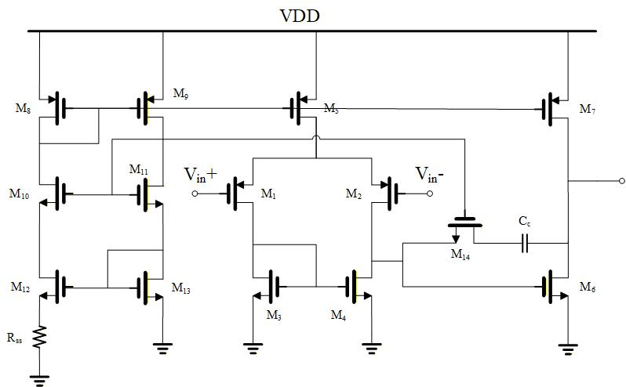<figcaption aria-hidden="true">Two-Stage Op-Amp Topology</figcaption></figure>

# Circuit Analysis

## Open Loop Gain

The op. amp. has two stages. The first stage is a Five-Resistor-OTA, and the second stage is a CS stage with a current source load. The open-loop gain is: $$\begin{aligned}
    &first stage: &A_{v_1}&=g_{m2}\left(r_{o2}||r_{o4}\right) \\
    &second stage: &A_{v_2}&=g_{m6}\left(r_{o6}||r_{o7}\right) \\ 
    &overall gain: &A_{v}&=A_{v_1} \cdot A_{v_2}=g_{m2}g_{m6}(r_{o2}||r_{o4})(r_{o6}||r_{o7}) \end{aligned}$$ Then，the parameters in the equations should be replaced by contollable quantities. Given that $$\begin{aligned}
    &g_m = \frac{2I_D}{V_{OD}} \\
    &r_o = \frac{1}{\lambda I_D}\end{aligned}$$ Thus obtain, $$\begin{aligned}
    Av = \frac{4}{V_{OD2}V_{OD6}(\lambda_{n}+\lambda_{p})^2} \end{aligned}$$

## Frequency Response

### Poles and Zeroes

From intuitive analysis, the circuit has at least 3 pole: the mirror pole, the output pole of the 1st stage, and the output pole of the 2nd stage. The signal path is as follows:

<figure><figcaption aria-hidden="true">Signal Path of the Two-Stage Op-Amp</figcaption></figure>

The poles can be calculated: $$\begin{aligned}
    &mirror pole: &\omega_{p-mirror}&=\frac{1}{\frac{1}{g_{m3}}C_3} = \frac{g_{m3}}{C_{GS2}+C_{GS4}} \\
    &output pole 1: &\omega_{p-output1}&=\frac{1}{(r_{o2}||r_{o4})g_{m6}(r_{o7}||r_{o6})C_{c}} \\
     &output pole 2: &\omega_{p-output2}&=\frac{g_{m6}}{C_{L}+C_{c}}\end{aligned}$$

Since the gain is relatively large, and Cc &gt; Cl &gt; MOSFET device, the order of the magnitude of these poles is: $$\begin{aligned}
    \omega_{p-output1} \ll \omega_{p-output2} < \omega_{p-mirror}\end{aligned}$$

Also, the circuit has a zero due to the feed through path made by Cc, the feed through path is shown as follows:

<figure><figcaption aria-hidden="true">FeedThrough Path of the Two-Stage Op-Amp</figcaption></figure>

The zero can be calculated as: $$\begin{aligned}
    \omega_{z} = \frac{g_{m6}}{C_{c}}\end{aligned}$$

### GBW

With the dominant pole and open loop gain known, the GBW can be calculated as: $$\begin{aligned}
    GBW = \frac{g_{m2}}{C_{c}} = \frac{2I_{D2}}{V_{OD2}C_{c}}\end{aligned}$$ in which the $V_{OD}$ represent the overdrive voltage.

### Phase Margin

To make the circuit work in a stable status, the phase margin of it should be at least 60 degrees. considering the dominant pole is exceedingly close to the origin, the phase shift lead by it is about 90 degrees. Thus the phase shift introduced by the non-dominant pole at the unity gain frequency should be no more than 30 degrees(regardless of the zero). 

$$\begin{aligned}
     \frac{\omega_u}{\omega_{p-output2}} < \tan 30^\circ \Rightarrow \omega_{p-output2} > \sqrt{3}\omega_u\end{aligned}$$ where the unity gain frequency is: 

$$\begin{aligned}
     \omega_u= GBW = \frac{2I_{D2}}{V_{OD2}C_c}\end{aligned}$$

### Zero Cancellation

As discussed in section 2.3, a RHP zero exist in the circuit and introduce undesirable phase shift. Thus a resistor implemented by M14 is placed at the feedback path to cancel the zero. By introducing the resistor, the zero is moved to: $$\begin{aligned}
    \omega_z = \frac{1}{(\frac{1}{g_{m6}} - R_z)C_c}\end{aligned}$$

Move the zero to approximately 1.2 times $\omega_u$ in the LHP. 

$$\begin{aligned}
     \frac{1}{(\frac{1}{g_{m6}} - R_z)C_c} = 1.2\frac{g_{mL}}{C_c} \Rightarrow g_{m2}R_z = \frac{1}{1.2}\end{aligned}$$

## Bias Circuit

The same as Razavi has shown in chapter 12, M8-M9 can bias itself to generate the Iout. Using Rs to define the current.

<figure>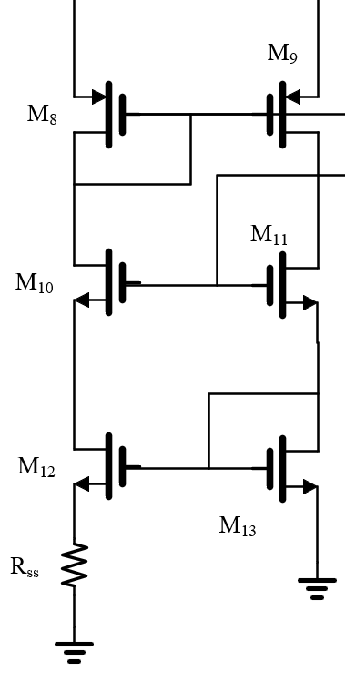<figcaption aria-hidden="true">Bias Circuit of the Two-Stage Op-Amp</figcaption></figure>

$$\begin{aligned}
    \overline{I}_{REF} = \frac{2}{\mu_n C_{ox}(W/L)_{12} R_S^2} \left( \sqrt{\frac{(W/L)_{12}}{(W/L)_{13}}} - 1 \right)^2\end{aligned}$$ the Rs can be calculated by determined reference current. 

$$\begin{aligned}
    R_S = \frac{2}{\sqrt{\mu_n C_{ox}(W/L)_{12} I_{REF}}} \left( \sqrt{\frac{(W/L)_{12}}{(W/L)_{13}}} - 1 \right)\end{aligned}$$ the transconductance of M12 is: $$\begin{aligned}
    g_{m12} = \frac{2}{R_S} \left( \frac{(W/L)_{12}}{(W/L)_{13}} - 1 \right)\end{aligned}$$

## Common Mode Input Range

To make the M1 and M2 work in saturation, the input common-mode voltage should be $$\begin{aligned}
     V_{OD3}+V_{THN}-V_{THP}<V_{in,CM}<V_{DD}-V_{OD5}-V_{THP}\end{aligned}$$

## Output Voltage Swing 

The output voltage swing is determined by the 2nd stage. The overall output swing is Vdd minus 2 overdrive voltage. $$\begin{aligned}
    V_{OD6} < V_{out} < V_{DD} - V_{OD7}\end{aligned}$$

## Common Mode Rejection Ratio

The CMRR is mostly defined by the first stage. Regardless of the mismatch of the circuit, the common-mode gain is: $$\begin{aligned}
    A_{CM} = \frac{1}{1 + 2g_{m2}r_{o5}} \cdot \frac{g_{m2}}{g_{m4}} \approx \frac{1}{2g_{m4}r_{o5}}\end{aligned}$$ thus according to the definition of the CMRR, it can be calculated as: $$\begin{aligned}
    CMRR = \left| \frac{A_{DM}}{A_{CM}} \right| = 2g_{m2}g_{m4}(r_{o2} || r_{o4})r_{o5}\end{aligned}$$ converting to available parameters: $$\begin{aligned}
    CMRR = 2 \cdot \frac{I_{D2}}{V_{OD2}} \cdot \frac{I_{D4}}{V_{OD4}} \cdot \left( \frac{1}{\lambda_p I_{D2}} || \frac{1}{\lambda_n I_{D4}} \right) \frac{1}{\lambda_p I_{D5}}\end{aligned}$$

## Power Supply Rejection Rate

There are 2 paths for small signal from power to be amplified, one is through the power of 1st stage, and the other is through the power of the 2nd stage.

For the positive supply, the first stage work as a CG stage with regeneration, and the 2nd stage work as a resistive divider. With mismatch ignorant, the PSRR of positive source is about 0.

For negative supply, the 1st stage doesn’t work and the 2nd stage work as a resistive divider. The PSRR is: $$\begin{aligned}
    PSRR = \frac{A_{DM}}{A_{CM}} = \frac{1}{2g_{m2}g_{m4}(r_{o2} || r_{o4})r_{o5}}\end{aligned}$$ the equicalent circuit to calculate PSRR is as follows:

<figure>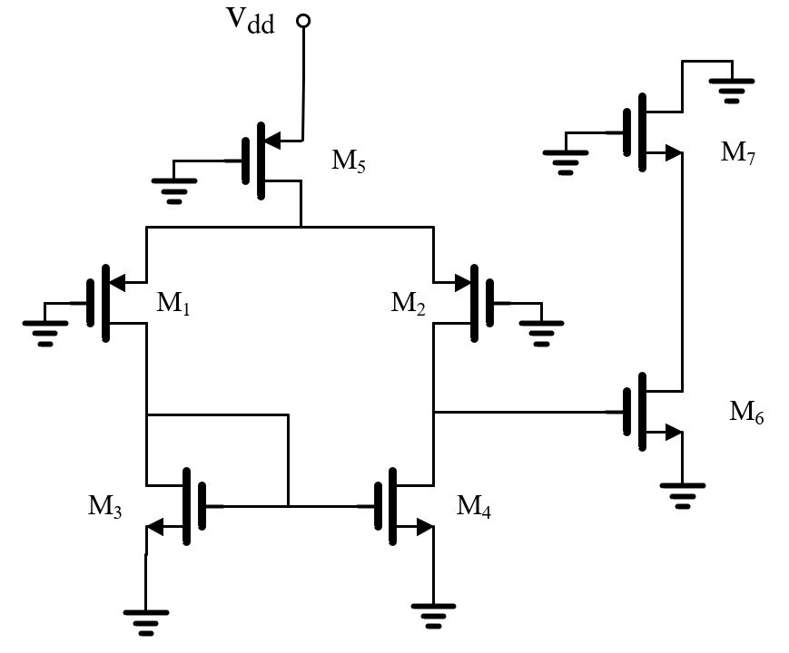</figure>

<figure>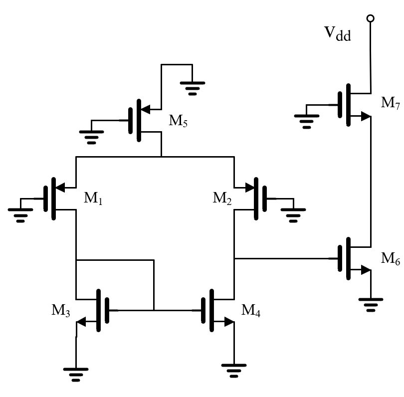</figure>

## Slew Rate

Due to the existence of the load capacitance at each output node, each stage can restrict the slew rate of the circuit, the slew rate can be expressed as: $$\begin{aligned}
    &slew rate of the 1st stage: &SR_1&=\frac{I_{D5}}{C_c} \\
    &slew rate of the 2nd stage: &SR_2&=\frac{I_{D7} - I_{D5}}{C_L} \\
    &overall slew rate: &SR_{overall}&=\min{SR_1, SR_2}\end{aligned}$$

# Preparatory Work for Calculation

## Basic Parameters

By reading the BSIM4 document, basic parameters can be found as folows:

| NMOS                  |                        | PMOS                  |                        |
|:----------------------|:----------------------:|:----------------------|:----------------------:|
| $\mu_n C_{\text{ox}}$ | $267.7\ \mu\text{S/m}$ | $\mu_p C_{\text{ox}}$ | $58.67\ \mu\text{S/m}$ |
| $V_{\text{THN}}$      |   $0.3156\ \text{V}$   | $V_{\text{THP}}$      |  $-0.4325\ \text{V}$   |
| $L_{\text{min}}$      |    $180\ \text{nm}$    | $L_{\text{min}}$      |    $180\ \text{nm}$    |
| $L_{\text{max}}$      |   $50\ \mu\text{m}$    | $L_{\text{max}}$      |   $50\ \mu\text{m}$    |
| $W_{\text{min}}$      |    $240\ \text{nm}$    | $W_{\text{min}}$      |    $240\ \text{nm}$    |
| $W_{\text{max}}$      |   $100\ \mu\text{m}$   | $W_{\text{max}}$      |   $100\ \mu\text{m}$   |
| $cgdo$                |   $121\ \text{pF/m}$   | $cgdo$                |   $158\ \text{pF/m}$   |
| $cgso$                |   $121\ \text{pF/m}$   | $cgso$                |   $158\ \text{pF/m}$   |
| $cgbo$                |          $0$           | $cgbo$                |          $0$           |

NMOS and PMOS Device Parameters

## Channel-Length Modulation Coefficient Extraction

In view of that the channel-length modulation coefficient is is not given by $BSIM4$ model, the $\lambda_n$ and $\lambda_p$ should be obtained by simulation.Given that, $$\begin{aligned}
    I_{D}=\frac{1}{2}u_{n}C_{ox}\frac{W}{L}(V_{GS}-V_{TH})^{2}(1+\lambda V_{DS})\end{aligned}$$ the $\lambda_n$ and $\lambda_p$ can be extracted by: $$\begin{aligned}
    \frac{\partial I_D}{\partial V_{DS}} &= \frac{1}{2} \mu C_{ox} \frac{W}{L} (V_{GS} - V_{TH})^2 \lambda \\
    \frac{\partial I_D}{\partial V_{DS}} &= I_{D0} \lambda\end{aligned}$$ for NMOS and PMOS in saturation with an 1 $\mu m$ channel length, through simulation, the $\lambda$ is about $$\begin{aligned}
    \lambda_n=4.25 \times 10^{-2}V^{-1} \\
    \lambda_p=1.16 \times 10^{-2}V^{-1}\end{aligned}$$ The figure of $I_D-V_{DS}$ is as follows:

<figure>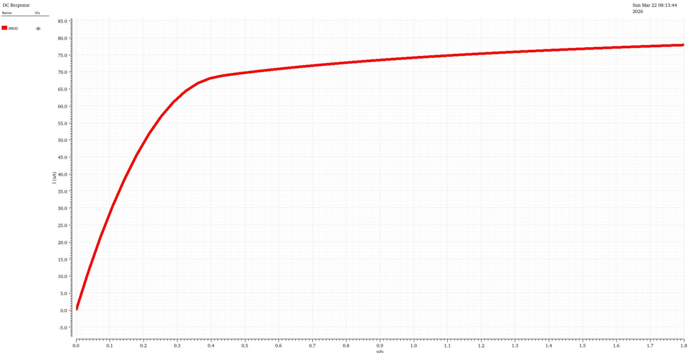</figure>

<figure>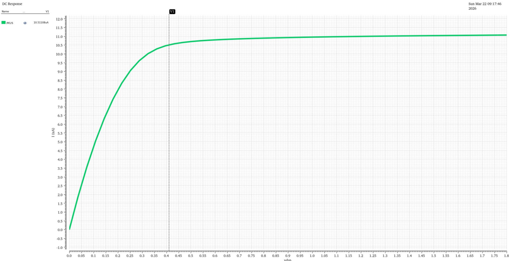</figure>

## Actual Parameter Correction

### Threshold Voltage

In actual simulations, the threshold voltage rises slightly due to the short-channel effect. This increase reaches approximately 150 mV when the channel length is set to 180 nm (the actual $L_{eff}$ may be smaller). When the minimum channel length of 1 μm is used, the threshold voltage is about 365.9 mV.

For Nmos, when the channel length is set to $1\mu m$, the threshold voltage is about 365.9 mV.

For Pmos, when the channel length is set to $1\mu m$, the threshold voltage is about 441.4 mV.

The similation to get the threshold voltage is shown is as follows:

<figure>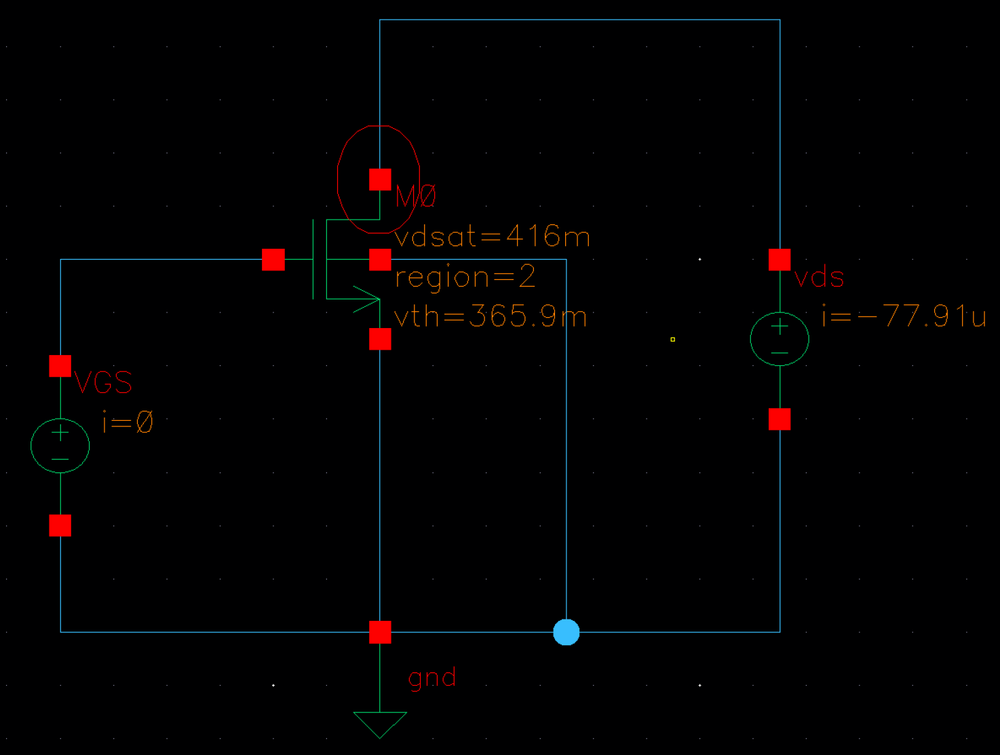</figure>

<figure>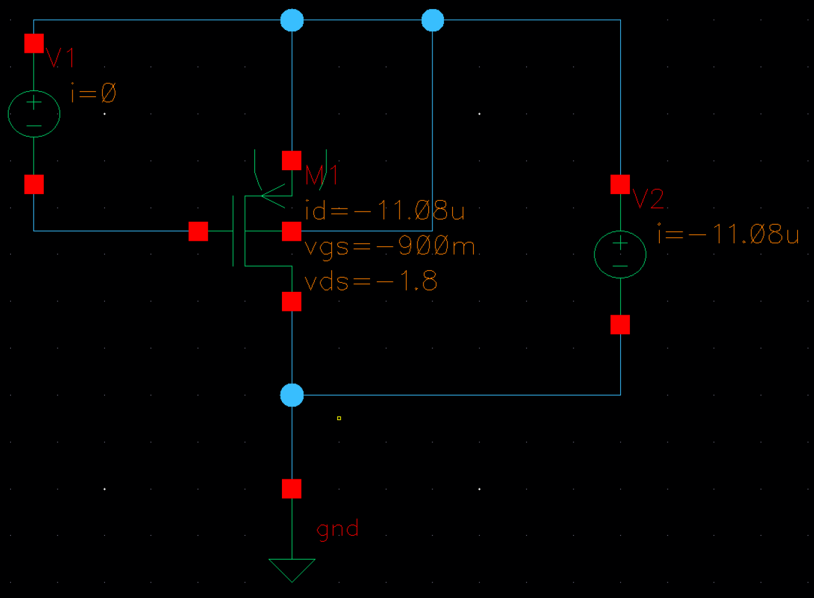</figure>

# Hand Calculation

## Power Consumption

According to the design specification

| Parameter            |        Specification         |
|:---------------------|:----------------------------:|
| Supply Voltage       | $1.8\,\text{V}, 0\,\text{V}$ |
| DC Power Consumption |      $< 15\,\text{mW}$       |

Core power and supply parameters

thus the maximum total current is $$\begin{aligned}
    I_{max}=\frac{P_{max}}{V_{00}}=8.3mA\end{aligned}$$

as described in [2.3](#sec:bias_circuit), current through $M_8$ is defined as reference current $I_{REF}$. The following constraints are imposed on the dimensions of the MOSFETs. 

$$\begin{aligned}
    (\frac{W}{L})_{8}&:(\frac{W}{L})_{9}:(\frac{W}{L})_{5}:(\frac{W}{L})_{7}=1:1:K_{1}:K_{2}\end{aligned}$$ thus the total current can be expressed as: $$\begin{aligned}
    (2+K_{1}+K_{2})I_{REF}&=8.3mA\end{aligned}$$ to make the gain larger, current for bias circuit should be small, in order to increase the current for amplifier stage. Approximately, let bias current be $100 \mu A$ $$\begin{aligned}
    I_{D8} = I_{D9} = 15 \mu A\end{aligned}$$ to make slew rate to be larger, current for the 2nd stage should be bigger than 1st stage,suppose that: 

$$\begin{aligned}
     I_{D5} = 300\mu A, K_{1} = 20 \\
     I_{D7} = 600\mu A, K_{2} = 40\end{aligned}$$

## Overdrive Voltage Alloacation

For a defined current, the gain of a transistor is largely influenced by the overdrive voltage.To produce a larger gain, the overdrive voltage should be relatively small. Roughly, assume that for transistors used for amplifying a signal: $$\begin{aligned}
  V_{OD-amp} = 0.2V\end{aligned}$$ in other hand, for transistors used for bias circuit, the stability should be given priority. To reduce the capacitance, the overdrive voltage should be relatively small. Roughly, assume that: $$\begin{aligned}
  V_{OD-bias} = 0.4V\end{aligned}$$

## Phase Compensation

Considering that a maximized value of $C_c$ can increase the phase margin, and split the poles further. However, may decrease the GBW and slew rate. Thus, we choose a maximized value of $C_c$ under the premise that the load capacitance $C_L$ remains dominant.

For the first sight, to simplify the caculation, $C_c$ is roughly chosen as $C_L/2$. $$\begin{aligned}
    C_{c} = \frac{C_L}{2} = 5pF\end{aligned}$$ The optimized value can be found in sumulation.

Then the phase margin can be considered accordingly. According to [2-9](#eq:output_pole2), [2-13](#eq:phase_margin), and [2-14](#eq:unity_gain_freq), relationship between the transconductance of $M_6$ and $M_2$ is: $$\begin{aligned}
    g_{m6}>(1+\frac{C_{L}}{C_{c}})\sqrt{3}g_{m2}\Rightarrow g_{m6}>3\sqrt{3}g_{m2}\end{aligned}$$ For simplicity, assume that: 

$$\begin{aligned}
     g_{m6} = 5.5g_{m2}\end{aligned}$$

## Zero Cancellation

According to [2-16](#eq:zero_cancellation), we have: $$\begin{aligned}
    R_{z}=\frac{V_{OD2}}{1.2\cdot2I_{D2}}\end{aligned}$$ for simplicity, assume that: $$\begin{aligned}
    R_{z} = 833 \Omega\end{aligned}$$ Since $M_14$ is biased in triode region, the impedence seen from it can be expressed as: $$\begin{aligned}
    R_{on14} = \frac{1}{g_{m14}}\end{aligned}$$ this constraint can be expressed as the ratio of device dimensions. $$\begin{aligned}
    \frac{\mu_{p}C_{ox}(\frac{W}{L})_{2}V_{OD2}}{\mu_{n}C_{ox}(\frac{W}{L})_{14}V_{OD14}}=\frac{1}{1.2}\end{aligned}$$ the overdrive can be biased to Approximately the same value. Thus 

$$\begin{aligned}
    \frac{(W/L)_2}{(W/L)_{14}}=3.8\end{aligned}$$

## Dimension Calculation

In this part, the minimum length of the MOSFETs is set to $1\mu m$.

### $M_1$,$M_2$

Considering that the $I_D$ and $V_{OD}$ are fixed, the dimensions of the MOSFETs can be calculated as: $$\begin{aligned}
    \frac{W}{L}=\frac{2I_{D}}{\mu C_{ox}V_{OD}^{2}}\end{aligned}$$ Thus the dimensions of $M_1$,$M_2$ are as follows: $$\begin{aligned}
    (\frac{W}{L})_{1,2}=\frac{2I_{D2}}{\mu_p C_{ox}V_{OD-amp}^{2}}=\frac{128\mu m}{1\mu m}\end{aligned}$$

### $M_6$

Since the restriction of phase margin,according to [4-11](#eq:gm6), the transconductance of $M_6$ is fixed, thus the overdrive voltage and dimension can be calculated as: $$\begin{aligned}
    V_{OD6}=5.5V_{OD2}\frac{I_{D6}}{I_{D2}}=0.145V \\
    (\frac{W}{L})_{6}=\frac{2I_{D6}}{\mu_{n}C_{ox} V_{OD6}^{2}}=\frac{320\mu m}{1.5\mu m}\end{aligned}$$ the length of $M_6$ is longer than $M_1$ and $M_2$ to achieve a better match.

### $M_3$,$M_4$

When the circuit works in a stability, the following relationship is satisfied: $$\begin{aligned}
    V_{GS3}=V_{DS3}=V_{GS4}=V_{DS4}=V_{GS6}=V_{DS6}\end{aligned}$$ thus the dimensions of $M_3$,$M_4$ are as follows: $$\begin{aligned}
    (\frac{W}{L})_{3.4}=\frac{2I_{D4}}{\mu_{n}C_{ox}V_{OD4}^{2}}=\frac{80\mu m}{1.5\mu m}\end{aligned}$$ the length of $M_3$,$M_4$ is the same as $M_6$.

### $M_5$,$M_7$

As mentioned above,the dimensions of $M_5$,$M_7$ are as follows: $$\begin{aligned}
    (\frac{W}{L})_{5}=\frac{2I_{D5}}{\mu_p C_{ox}V_{OD-bias}^{2}}=\frac{51.2\mu m}{0.8\mu m} \\
    (\frac{W}{L})_{7}=\frac{2I_{D7}}{\mu_p C_{ox}V_{OD-bias}^{2}}=\frac{102.4\mu m}{0.8\mu m}\end{aligned}$$ the length of $M_5$,$M_7$ is tend to be minimized, for lowering the capacitance so as to increase the stability.

### $M_8$,$M_9$

According to [4-2](#eq:bias_ratio),[4-5](#eq:bias_current_id5),[4-6](#eq:bias_current_id7), the dimensions of $M_8$,$M_9$ are as follows: $$\begin{aligned}
    (\frac{W}{L})_{8.9}=\frac{2.56\mu m}{0.8\mu m}\end{aligned}$$

### $M_{10}$,$M_{11}$,$M_{12}$,$M_{13}$

To simplify the calculation, the dimension ratio of $M_{12}$ and $M_{13}$ is intuitively chosen as $4:1$ $$\begin{aligned}
    (\frac{W}{L})_{12}=4(\frac{W}{L})_{13}\end{aligned}$$ Secondly, the $V_{OD}$ of the bias circuit should match that of the amplifying circuit, thus, $$\begin{aligned}
    V_{OD13}=V_{OD4}=0.145V\\
    (\frac{W}{L})_{13}=\frac{2I_{D9}}{\mu_n C_{ox}V_{OD13}^{2}}=\frac{8\mu m}{1.5\mu m}\\
    (\frac{W}{L})_{13}=(\frac{W}{L})_{10}=(\frac{W}{L})_{11}=\frac{8\mu m}{1.5\mu m}\\
    (\frac{W}{L})_{12}=\frac{32\mu m}{1.5\mu m}\end{aligned}$$

### $M_{14}$

According to [4-16](#eq:m14), the dimensions of $M_{14}$ are as follows: $$\begin{aligned}
    (\frac{W}{L})_{14}=(\frac{W}{L})_{2}/3.8=\frac{50.5\mu m}{1.5\mu m}\end{aligned}$$ the length of $M_{14}$ is the same as $M_{6}$.

## Reference Current Definition

According to [2-18](#eq:rs), the value of $R_ss$ is as follows: $$\begin{aligned}
    R_{ss} = 6.84k\Omega\end{aligned}$$

## Summary

Based on the above analysis, the parameters of the circuit are shown in table [4-2](#table:mos)and table [4-3](#table:component_values).

| MOS      |          $W/L$          | $V_{\text{OD}}$ / V |
|:---------|:-----------------------:|:-------------------:|
| M$_1$    |   128 $\mu$m/1 $\mu$m   |         0.2         |
| M$_2$    |   128 $\mu$m/1 $\mu$m   |         0.2         |
| M$_3$    |  80 $\mu$m/1.5 $\mu$m   |        0.145        |
| M$_4$    |  80 $\mu$m/1.5 $\mu$m   |        0.145        |
| M$_5$    | 51.2 $\mu$m/0.8 $\mu$m  |         0.4         |
| M$_6$    |  320 $\mu$m/1.5 $\mu$m  |        0.145        |
| M$_7$    | 102.4 $\mu$m/0.8 $\mu$m |         0.4         |
| M$_8$    | 2.56 $\mu$m/0.8 $\mu$m  |         0.4         |
| M$_9$    | 2.56 $\mu$m/0.8 $\mu$m  |         0.4         |
| M$_{10}$ |   8 $\mu$m/1.5 $\mu$m   |        0.145        |
| M$_{11}$ |   8 $\mu$m/1.5 $\mu$m   |        0.145        |
| M$_{12}$ |  32 $\mu$m/1.5 $\mu$m   |       0.0725        |
| M$_{13}$ |   8 $\mu$m/1.5 $\mu$m   |        0.145        |
| M$_{14}$ | 50.5 $\mu$m/1.5 $\mu$m  |         0.2         |

MOS Transistor Sizing and Overdrive Voltage

| Device          |         Value          |
|:----------------|:----------------------:|
| $R_{\text{ss}}$ | $6.84\,\text{k}\Omega$ |
| $C_{\text{c}}$  |     $5\,\text{pF}$     |

Circuit Component Values

Based on the parameters, the crutial specification in theory is shown in table [5-2](#table:performance_parameters).

| Parameter      |          Value in Theory           |       Specification        |
|:---------------|:----------------------------------:|:--------------------------:|
| Open-Loop Gain |     $\approx 93.5\,\text{dB}$      |      $>60\,\text{dB}$      |
| CMRR           |     $\approx 95.0\,\text{dB}$      |      $>65\,\text{dB}$      |
| PSRR           |     $\approx 95.6\,\text{dB}$      |      $>65\,\text{dB}$      |
| Input CM Range |      $\approx 0.94\,\text{V}$      |      $>0.8\,\text{V}$      |
| Output Swing   |      $\approx 1.25\,\text{V}$      |      $>1.2\,\text{V}$      |
| GBW            |     $\approx 47.7\,\text{MHz}$     |      $>3\,\text{MHz}$      |
| Slew Rate      | $\approx 30\,\text{V/}\mu\text{s}$ | $>5\,\text{V/}\mu\text{s}$ |

Performance Parameters of the Operational Amplifier

# Simulation and Result

## The Current Reference

A supply voltage of 1.8 V is applied to the reference current generation circuit, and the initial reference current is approximately $9\mu$A, a bit smaller than the target current.

According to [2-17](#eq:REF_current), by reducing the $R_{ss}$ the reference current can be increased. With $R_{ss}$ reduced to $4.86k \Omega$, the reference current is exactly $15\mu$A. The circuit is shown in [5-1](#fig:REF_current).

<figure><figcaption aria-hidden="true">Current Reference Schematic</figcaption></figure>

## Parameter Correction

Based on the specific simulation results, the parameters are revised to the form shown in the table [5-1](#table:correction) to achieve optimal performance.

| MOS      |         Hand Calculated $W/L$         |            Corrected $W/L$            |
|:---------|:-------------------------------------:|:-------------------------------------:|
| $M_1$    |   $128\,\mu\text{m}/1\,\mu\text{m}$   |   $128\,\mu\text{m}/1\,\mu\text{m}$   |
| $M_2$    |   $128\,\mu\text{m}/1\,\mu\text{m}$   |   $128\,\mu\text{m}/1\,\mu\text{m}$   |
| $M_3$    |  $80\,\mu\text{m}/1.5\,\mu\text{m}$   |  $80\,\mu\text{m}/1.5\,\mu\text{m}$   |
| $M_4$    |  $80\,\mu\text{m}/1.5\,\mu\text{m}$   |  $80\,\mu\text{m}/1.5\,\mu\text{m}$   |
| $M_5$    | $51.2\,\mu\text{m}/0.8\,\mu\text{m}$  | $204.8\,\mu\text{m}/0.8\,\mu\text{m}$ |
| $M_6$    |  $320\,\mu\text{m}/1.5\,\mu\text{m}$  |  $320\,\mu\text{m}/1.5\,\mu\text{m}$  |
| $M_7$    | $102.4\,\mu\text{m}/0.8\,\mu\text{m}$ | $409.6\,\mu\text{m}/0.8\,\mu\text{m}$ |
| $M_8$    | $2.56\,\mu\text{m}/0.8\,\mu\text{m}$  | $10.24\,\mu\text{m}/0.8\,\mu\text{m}$ |
| $M_9$    | $2.56\,\mu\text{m}/0.8\,\mu\text{m}$  | $10.24\,\mu\text{m}/0.8\,\mu\text{m}$ |
| $M_{10}$ |   $8\,\mu\text{m}/1.5\,\mu\text{m}$   |   $8\,\mu\text{m}/1.5\,\mu\text{m}$   |
| $M_{11}$ |   $8\,\mu\text{m}/1.5\,\mu\text{m}$   |   $8\,\mu\text{m}/1.5\,\mu\text{m}$   |
| $M_{12}$ |  $32\,\mu\text{m}/1.5\,\mu\text{m}$   |  $32\,\mu\text{m}/1.5\,\mu\text{m}$   |
| $M_{13}$ |   $8\,\mu\text{m}/1.5\,\mu\text{m}$   |   $8\,\mu\text{m}/1.5\,\mu\text{m}$   |
| $M_{14}$ | $50.5\,\mu\text{m}/1.5\,\mu\text{m}$  | $50.5\,\mu\text{m}/1.5\,\mu\text{m}$  |

MOS Transistor Width-Length Ratios

## Power Comsumption

Apply an 1.8V supply voltage and a 500 mV $V_{CM}$ to the circuit. Detect the current flow through the supply.

<figure><figcaption aria-hidden="true">PowerComsumption Testbench</figcaption></figure>

From the figure, the power consumption is as follows: $$\begin{aligned}
    P_{com} = I_{out} \times V_{dd}  = 2mW\end{aligned}$$

## The Amplifying Circuit

The full circuit schematic is presented as figure [5-3](#fig:amp_circuit).

<figure>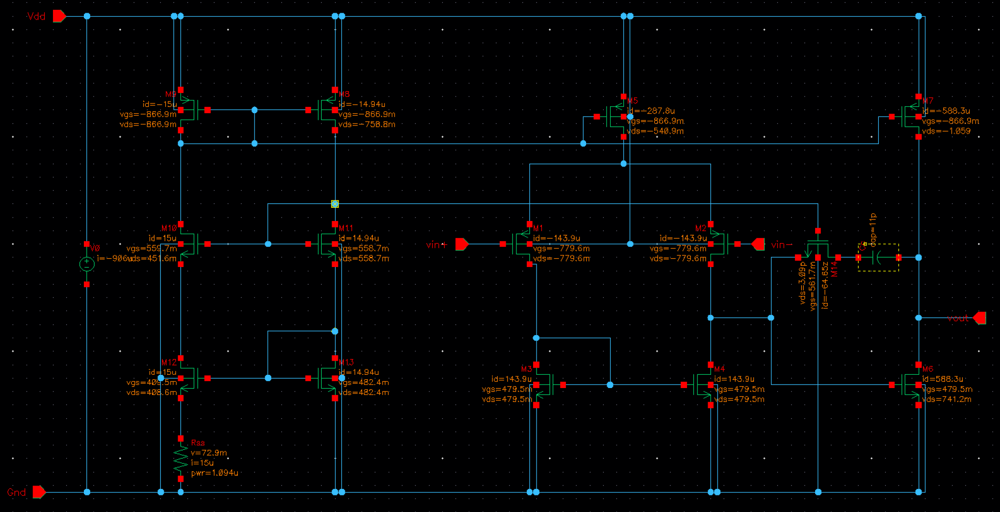<figcaption aria-hidden="true">Two-Stage OTA Schematic</figcaption></figure>

Although there are some discrepancies between the designed and actual values of the current and overdrive voltage for each branch, they are roughly the same, and a rough estimation suggests that this will not affect the operation of the amplifier.

## Open-Loop Gain,Phase Margin and GBW

The op-amp is connected in an open-loop configuration with a common-mode voltage of 0.8 V. An AC signal of ±0.5 V is applied, and frequency sweep is performed from 1 Hz to 1 GHz. The testbench is as follows:

<figure><figcaption aria-hidden="true">Basic testbench</figcaption></figure>

the result is as follows.

<figure><figcaption aria-hidden="true">Curve for Phase Margin, Open-Loop Gain, GBW</figcaption></figure>

From the figure, the GBW, Open-Loop Gain, and Phase Margin are shown in [5-5](#fig:phase-margin).

| Specification  |   Value   |
|:---------------|:---------:|
| Open-Loop Gain |  68.4 dB  |
| Phase Margin   | 75 degree |
| GBW            | 28.4 MHz  |

Operational Amplifier Performance Specifications

## ICMR

In this section, 2 ways for confirming the IMR are shown.

### Method 1

Connect the amp. as an unity gain amplifier. and apply an 0–1.8 V input voltage to the non-inverting terminal. The testbench is as follows:

<figure><figcaption aria-hidden="true">ICMR Testbench</figcaption></figure>

The output voltage curve is as follows:

<figure>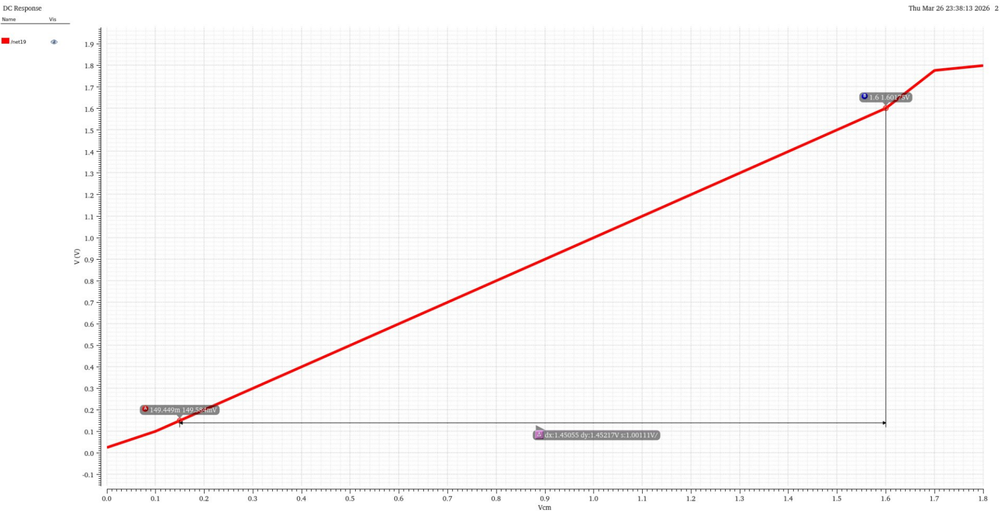<figcaption aria-hidden="true">ICMR Output Voltage</figcaption></figure>

It is puzzling that the ICMR shown by the curve is about $1.6V$, a lot higher than we expected. Thus a second method is needed.

### Method 2

In this method, the ICMR is confirmed by measuring the working status of the every MOS transistor, while applying a CM voltage from 0 to 1.8V. The output curve is as follows.

<figure>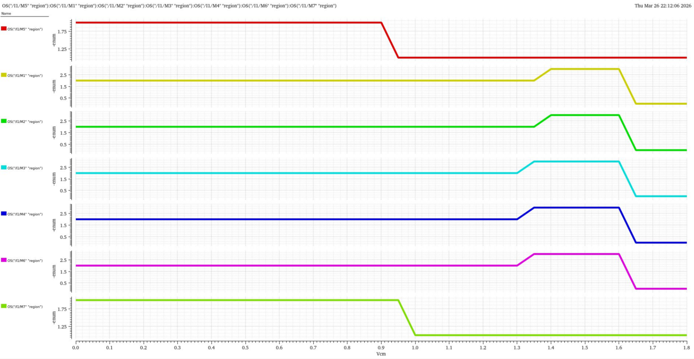<figcaption aria-hidden="true">ICMR Output Voltage</figcaption></figure>

when the CM voltage is about 0.9, a tail current transistor turn to deep triode region, indicating that the ICMR is about 0.9V. $$\begin{aligned}
    ICMR = 0.9V\end{aligned}$$

## Output Swing

The op-amp is configured in an open-loop mode, and a very small differential-mode voltage is applied to observe the linear variation range of the output with respect to the input. The testbench is as follows:

<figure>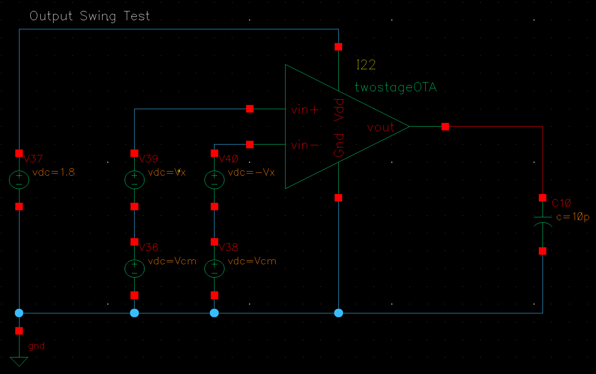<figcaption aria-hidden="true">Output Swing Testbench</figcaption></figure>

The output voltage curve is as follows:

<figure>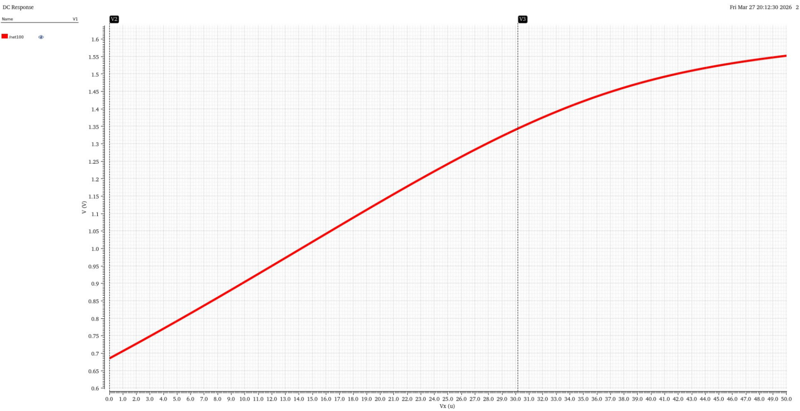<figcaption aria-hidden="true">Output Swing Output Voltage</figcaption></figure>

The linear range of the output voltage is about 1.4V. $$\begin{aligned}
    Output Swing \approx 1.4V\end{aligned}$$

## CMRR

The op-amp is connected in a negative feedback configuration, and a common-mode voltage of 1 V is applied at the input. The magnitude response of the system corresponds to the reciprocal of the common-mode rejection ratio. The testbench is as follows:

<figure>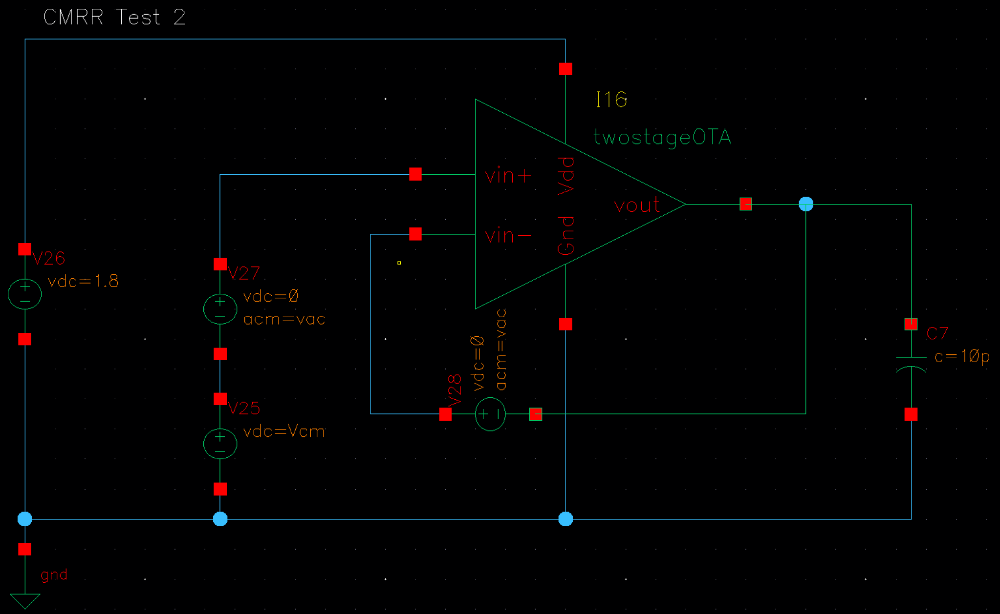<figcaption aria-hidden="true">CMRR Testbench</figcaption></figure>

The magnitude response curve is as follows:

<figure>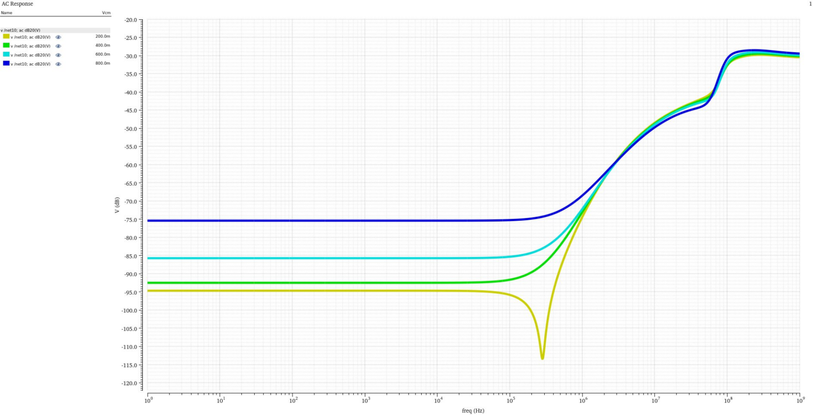<figcaption aria-hidden="true">CMRR Magnitude Response</figcaption></figure>

From the figure, the CMRR is about 75dB. $$\begin{aligned}
    CMRR \approx 75dB\end{aligned}$$

## PSRR

The op-amp is connected in a negative feedback configuration, and an AC signal of 1 V is applied to the power supply terminal. The magnitude response of the system corresponds to the reciprocal of the power supply rejection ratio. The testbench is as follows:

<figure>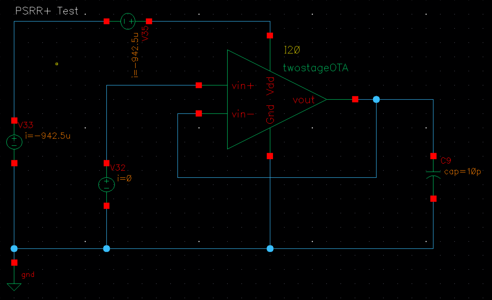</figure>

<figure>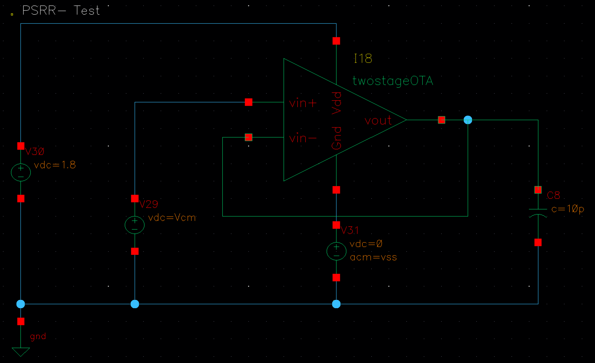</figure>

The magnitude response curve is as follows:

<figure>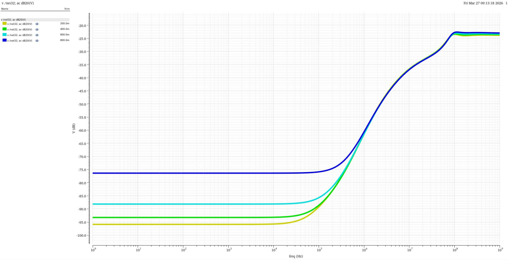</figure>

<figure>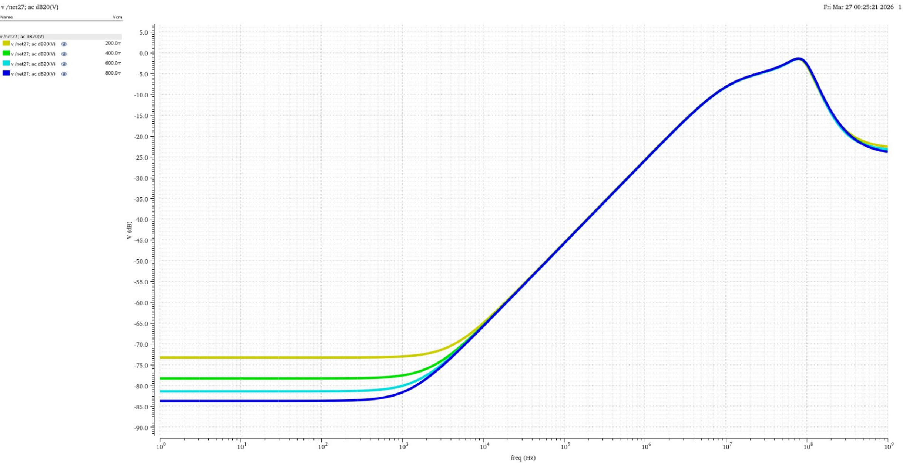</figure>

From the figure, the PSRR is about 75dB. $$\begin{aligned}
    PSRR \approx 75dB\end{aligned}$$

## SR

The op-amp is configured in a negative feedback mode, and a 500 mV pulse signal is applied to the non-inverting input. The slew rate can be obtained by observing the response waveform and calculating its maximum slope. The testbench is as follows:

<figure>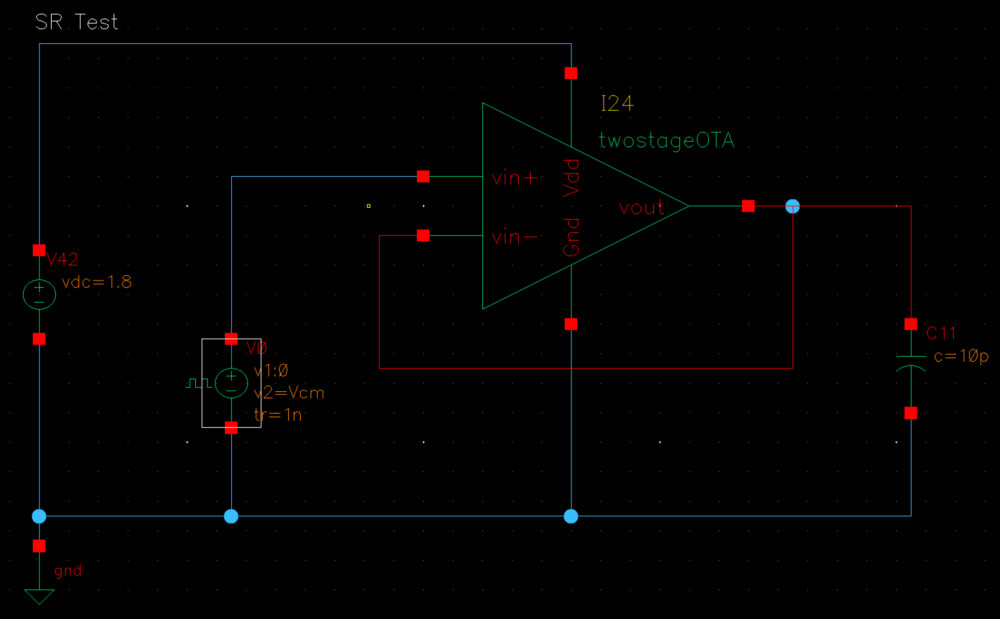<figcaption aria-hidden="true">SR Testbench</figcaption></figure>

The slew rate curve is as follows:

<figure>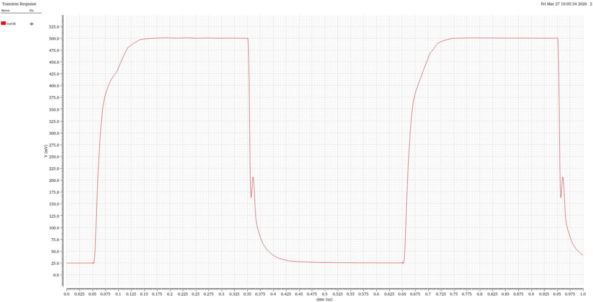<figcaption aria-hidden="true">SR Slew Rate</figcaption></figure>

From the figure, the slew rate is about 100 V/s. $$\begin{aligned}
    Slew Rate \approx 30 V/\mu s\end{aligned}$$

# Log

本附录用于记录仿真中遇到的一些自认为有价值的问题及其解决方案，为方便起见，采用中文书写

## 关于运放的同相与反相输入端问题

在首次进行ICMR测试时，将运放连接成单位增益形式，但是输出恒为电源电压。借鉴比较器的行为，可以发现设计运放时同相与反相输入端的标签标反了。

产生这一问题的原因在于学习《模集》时过于死板，机械性地记忆五管OTA的同相反相端，而忽略了对整体系统中第二级CS级自带 一个反相的情况。根本原因在于对电路分析的耐心欠缺。

因此，在确定同相反相端时，应当仔细考虑每一级是否反相，从电流入手，逐级分析$G_m$的正负，避免错误。

## 关于运放IMCR的测定的问题

在实际仿真中发现了一个有趣的现象（在simulation and result一章也有阐述）：利用单位增益负反馈绘制得到的 曲线表明，运放的共模输入范围极大，约为0.2-1.6V，这甚至大大地超过了理论指标。出于对该结果的怀疑， 进一步对管子的状态进行分析。

此时可以发现存在管子在输入共模电平为0.9V时就进入了线性区，显然，0-0.9V才是运放的正常工作范围。

进一步分析产生这种差异的原因，在大于共模电平0.9V时查看电路的状态，可以发现进入线性区的管子是尾电流源， 其在进入线性区后等价为一个电阻，仍然可以支持运放的正常工作，工作电流虽然下降，然是可以支持单位增益连接方式 的运放工作，因此造成了共模输入范围很大的假象。

## 关于尾电流源进入线性区导致共模输入范围下降的补救措施

当在进行ICMR测试时，当超出共模输入范围时，首先进入线性区的是尾电流源。其原因是输入级MOS管的$V_{DS}$ 过大。显然这是由于输入级的过驱动电压不够，沟道长度调制效应迫使其漏源电流增加。 此时我的解决方案是进一步降低 尾电流源的过驱动电压（实际上，我们所设定的0.4V过驱动电压是一个较大的值），从而流出更多的电流。

This page intentionally left blank.

The complete specifications are presented in Report 2.

# References

1.  拉扎维, 陈贵灿, 程军. 模拟CMOS集成电路设计\[M\]. 西安: 西安交通大学出版社, 2003, 120-180.

2.  唐长文，菅洪彦。全差分运算放大器设计 \[R\]. 复旦大学专用集成电路与系统国家重点实验室《通信系统混合信号 VLSI 设计》课程设计报告，2003.

3.  尹睿。二级密勒补偿运算放大器设计教程 \[R\]. 复旦大学专用集成电路与系统国家重点实验室RFIC.
