# 摘要

本文档为应用于 14-bit 高精度逐次逼近型模数转换器（SAR ADC）的模拟前端（AFE） 及全差分电容数模转换器（CDAC）的仿真验证报告。针对工业现场微弱信号的采集需求， 本报告基于 TSMC $180\,\mathrm{nm}$ CMOS 工艺，在典型 $3.3\,\mathrm{V}$ 单电源供电及多种 PVT（工艺、电压、温度）角下，对跨阻放大器（TIA）、单端转差分电路（S2D）、 全差分放大器（FDA）以及可编程增益放大器（PGA）进行了较为系统的交直流、瞬态及噪声协同仿真。

仿真结果表明，AFE 整链在不同增益配置下的有效带宽基本达到 $700\,\mathrm{kHz}$， 全链路折算至输入端的总积分噪声约为 $45\,\mathrm{\mu V_{rms}}$，满量程大信号输出总谐波失真 （THD）优于 $-88\,\mathrm{dB}$。针对后级等效约 $40\,\mathrm{pF}$ 的容性负载，PGA 在 $800\,\mathrm{ns}$ 内较好地实现了目标精度的建立。此外，蒙特卡洛（Monte Carlo） 分析初步验证了版图匹配策略对失调电压的抑制作用，以及连续时间共模反馈（CMFB）环路的有效性。 综合仿真数据表明，本电路在动态范围、信噪比（SNR）等指标上基本满足 14-bit 系统的设计预期 ；但需指出，目前的仿真数据多基于原理图级及部分寄生估计，实际流片后，封装寄生与全局布线等 非理想因素可能对系统最终的噪声与建立性能产生一定影响。

**关键词：**模拟前端设计；全差分架构；可编程增益放大器；R-2R网络；传输门宏模型；建立时间

# 仿真环境与工具设置

在进行高精度 14-bit 模拟前端（AFE）及 SAR ADC 的电路设计中，仿真环境的严谨性和覆盖度直接决定了设计流片后的良率与工业场景下的鲁棒性。 本章将详细说明所使用的 EDA 仿真工具、工艺库，以及为了充分验证电路可靠性而定义的多种工艺角（PVT Corners）与蒙特卡洛（Monte Carlo） 联合仿真条件。

## 仿真工具与工艺库说明

本设计的电路原理图输入、核心模块性能仿真以及版图后仿真验证均在 Cadence Virtuoso 平台上完成。

-   **仿真器 (Simulator):** 采用 Cadence Virtuoso AMS Designer (配合底层 Spectre 仿真引擎)。AMS 仿真器能够高效地处理包含模拟前端（如 TIA、PGA、动态比较器）与数字控制逻辑（如 SAR 逻辑、时序控制）的数模混合信号系统，提供高精度的瞬态建立分析与噪声分析。

-   **工艺库 (Process Design Kit, PDK):** 采用 TSMC $180\,\text{nm}$ CMOS 混合信号工艺库（`tsmc18`）。该工艺在工业控制、高精度检测等数模混合芯片领域应用广泛且成熟，能够提供精确的器件寄生参数、电阻/电容失配模型及低频闪烁噪声（$1/f$ Noise）模型。

-   **核心模型文件:** 仿真过程中直接调用该 PDK 目录下的 `spectre.scs` 模型文件进行物理特性推导。

-   **标称工作条件:** 根据系统级指标规划，标称供电电压（VDD）统一设定为 $3.3\,\text{V}$，标称室温设定为 $25^\circ\text{C}$。

## 仿真工艺角（Corner）定义

由于半导体制造过程中的随机波动以及实际工业探测环境的恶劣性，芯片内部器件的载流子迁移率（Process）、 供电电压（Voltage）以及工作环境温度（Temperature）会发生不同程度的偏移。 为了确保本设计在任何极端边界条件下都能满足 $700\,\text{kHz}$ 的系统带宽及 14-bit 精度， 我们分别定义了常规的“极限工艺角（PVT Corners）”与用于评估统计失配的“蒙特卡洛（Monte Carlo）PVT 角”。

### 标准 PVT 工艺角配置

依据工业级可靠性要求，环境温度覆盖了 $-40^\circ\text{C} \sim 125^\circ\text{C}$， 电源电压波动允许范围设定为约 $\pm 10\%$（即 $3.0\,\text{V} \sim 3.6\,\text{V}$）。 结合不同器件类型的速度漂移（TT, SS, FF, FS, SF），系统提取并定义了以下 9 种代表性的标准 PVT 仿真工艺角， 详情如表 <a href="#tab:standard_corners" data-reference-type="ref" data-reference="tab:standard_corners">1.1</a> 所示。

| **Corner 名称** | **工艺段 (Process)** | **电压 (V)** | **温度 ($^\circ$C)** | **测试侧重与评估场景**                 |
|:----------------|:--------------------:|:------------:|:--------------------:|:---------------------------------------|
| Cold            |      TT (典型)       |     3.3      |         -40          | 典型工艺下的低温冷启动响应             |
| Hot             |      TT (典型)       |     3.3      |         125          | 典型工艺下的高温热稳定性               |
| Asym\_FS        |     FS (快N慢P)      |     3.3      |          25          | 评估PMOS与NMOS不对称的影响             |
| Asym\_SF        |     SF (慢N快P)      |     3.3      |          25          | 评估偏置电路在不对称工艺下的电流偏移   |
| BC (Best Case)  |      FF (最快)       |     3.6      |         -40          | 驱动最强情况                           |
| WorstCase       |      SS (最慢)       |     3.3      |         -40          | 芯片速度较慢，评估额定电压下的带宽衰减 |
| WCLowtemp       |      SS (最慢)       |     3.0      |         -40          | 速度极恶劣情况                         |
| MaxPower        |      FF (最快)       |     3.3      |         125          | 评估标称电压及高温下的发热与动态功耗   |
| MaxLeakage      |      FF (最快)       |     3.6      |         125          | 功耗极恶劣情况                         |

标准 PVT 仿真工艺角配置表

\[tab:standard\_corners\]

上述工艺角的组合有效覆盖了电路的脆弱点。例如，可以确保 PGA 与比较器在 `WCLowtemp` 等速度恶劣情况下建立时间（Settling Time）依然满足 $1\,\text{MS/s}$ 采样率的时序要求；同时保证在 `MaxLeakage` 下，系统的总功耗未超出预设预算。

### 蒙特卡洛 (Monte Carlo) 联合 PVT 仿真配置

对于 14-bit 高精度数据转换系统而言，运算放大器的随机失调（Random Offset）以及 SAR ADC 内部电容阵列（CDAC）的匹配度直接决定了系统的有效位数（ENOB）。传统的宏观 PVT 工艺角难以反映同片内局部器件的微观差异。 因此，本设计特别引入了 Monte Carlo (MC) 模型与 PVT 边界条件相交叉的严苛仿真集（见表 <a href="#tab:mc_corners" data-reference-type="ref" data-reference="tab:mc_corners">1.2</a>）。通过调用 `spectre.scs` 中的 `mc` 统计学段，在不同的极端电压与温度下进行随机抽样验证。

| **Corner 名称** |   **模型调用状态**    | **电压 (V)** | **温度 ($^\circ$C)** |
|:----------------|:---------------------:|:------------:|:--------------------:|
| MC\_Nominal     | mc (包含失配统计模型) |     3.3      |          25          |
| MC\_HvTt        | mc (包含失配统计模型) |     3.6      |          25          |
| MC\_HvLt        | mc (包含失配统计模型) |     3.6      |         -40          |
| MC\_HvHt        | mc (包含失配统计模型) |     3.6      |         125          |
| MC\_LvTt        | mc (包含失配统计模型) |     3.0      |          25          |
| MC\_LvLt        | mc (包含失配统计模型) |     3.0      |         -40          |
| MC\_LvHt        | mc (包含失配统计模型) |     3.0      |         125          |

蒙特卡洛 (Monte Carlo) 与 PVT 联合仿真角配置

\[tab:mc\_corners\]

通过上述 7 组 MC\_PVT 配置，我们能够在评估 CDAC 阵列失配引起的 DNL/INL 以及 AFE 链路输出失调标准差（$1\sigma \sim 3\sigma$ 分布）时，进一步叠加高低压（$3.0\,\text{V} / 3.6\,\text{V}$）与高低温漂移（$-40^\circ\text{C} / 125^\circ\text{C}$）带来的非线性恶化效应，最大程度保障了芯片流片后的实际良率。

<figure>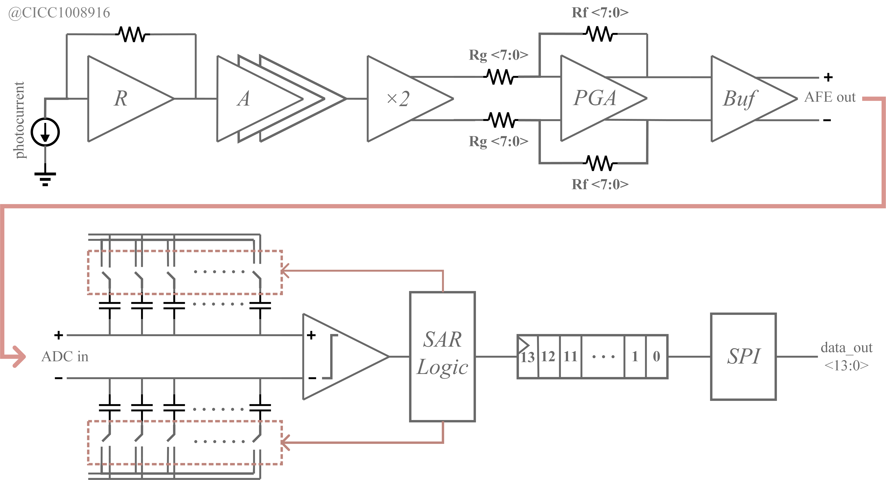<figcaption aria-hidden="true">系统框图</figcaption></figure>

# 子模块性能仿真

特别说明：在本章节中，为确保仿真结果输出的可靠性与图表展示的清晰度，除了典型标称状态（Nominal/TT, $3.3\,\mathrm{V}$, $25^\circ\mathrm{C}$）外，我们特意选取了以下四个最具代表性的极限工艺角与 PVT 条件下的仿真波形进行重叠绘制与分析。选择这四个工艺角作为典型边界条件的理由如下：

1.  **Asym\_FS (Fast NMOS, Slow PMOS, $3.3\,\mathrm{V}$, $25^\circ\mathrm{C}$):** 该不对称工艺角会导致 NMOS 和 PMOS 的载流子迁移率与跨导（$g_m$）发生严重错配。对于全差分架构（FDA/PGA）和电流镜偏置电路，这种错配会从物理底层破坏电路的对称性。选取该状态是评估共模反馈（CMFB）稳定性、共模抑制比（CMRR）恶化程度以及系统直流失调（Offset）漂移的最佳“不对称极限”场景。

2.  **Asym\_SF (Slow NMOS, Fast PMOS, $3.3\,\mathrm{V}$, $25^\circ\mathrm{C}$):** 与 Asym\_FS 呈相反的错配极端。在具有级联结构的运算放大器中，该工艺角极易导致不同支路的静态工作点发生偏移，进而挤压晶体管的输出电压裕度（$V_{ov}$）。将其纳入典型绘制，旨在双向验证电路在极端工艺偏斜下，是否仍能维持合理的静态偏置与大信号动态范围。

3.  **BC (Best Case - FF, $3.6\,\mathrm{V}$, $-40^\circ\mathrm{C}$):** 在该状态下，器件速度最快、供电电压最高且温度最低，晶体管的跨导和运放的增益带宽积（GBW）将飙升至系统最大值。选取该工艺角主要用于严苛考核闭环系统的**高频稳定性**，验证在 GBW 暴增的情况下，非主极点是否会侵蚀相位裕度（Phase Margin），以及瞬态阶跃响应中是否会暴露出严重的过冲（Overshoot）或高频振荡（Ringing）风险。

4.  **WCLowtemp (Worst Case Low Temp - SS, $3.0\,\mathrm{V}$, $-40^\circ\mathrm{C}$):** 该状态叠加了最慢的工艺、极低的供电电压以及低温下的阈值电压（$V_{th}$）上升，导致晶体管驱动能力降至冰点。这是评估系统**“速度与建立瓶颈”**的绝对恶劣条件。选取该角用于验证在带宽与压摆率（Slew Rate）被严重压缩的极限下，系统是否依然能够满足 $700\,\mathrm{kHz}$ 的目标带宽，以及能否在规定的时钟周期内完成 14-bit 精度的建立（Settling）。

完整的PVT与工艺角仿真可见仿真文件中。

## PIN光电二极管器件级仿真

本系统的输入端为PIN光电二极管，其器件模型直接决定TIA输入电流范围、输入寄生电容、暗电流本底和噪声预算。为保证后级AFE与SAR ADC仿真具有真实的传感器边界条件，本节引入微电子器件建模报告中的PIN光电二极管模型与器件级仿真结果，作为后续TIA单模块仿真的输入依据。

### 器件模型与等效电路

PIN光电二极管通过在P区和N区之间引入本征I层，显著拓宽耗尽区，从而提升光吸收效率、降低结电容并提高响应速度。其等效模型由串联电阻$R_s$、光生电流源$I_{ph}$、暗电流支路、结电容$C_j$、并联漏电阻$R_{sh}$、反向击穿支路以及噪声源组成，如图<a href="#fig:sim_pin_model" data-reference-type="ref" data-reference="fig:sim_pin_model">2.1</a>所示。

<figure>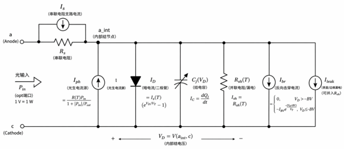<figcaption aria-hidden="true">PIN光电二极管等效电路模型</figcaption></figure>

模型的端口电流可写为 $$I_j = I_D + I_{br} + I_{sh} + I_C - I_{ph}$$ 其中$I_D$为二极管暗电流，$I_{br}$为反向击穿电流，$I_{sh}$为并联漏电流，$I_C$为结电容电流，$I_{ph}$为光生电流。光生电流采用带饱和项的响应度模型： $$I_{ph} = \frac{R_\lambda(T)P_{in}}{1+\left|P_{in}/P_{sat}\right|}$$ 该模型在弱光下退化为线性响应，在强光下可描述光电流饱和现象。

### DC特性仿真

DC仿真用于提取光电二极管的静态$I$-$V$特性、光功率响应和结电容偏压依赖关系。测试电路如图<a href="#fig:sim_pd_dc_tb" data-reference-type="ref" data-reference="fig:sim_pd_dc_tb">2.2</a>所示，通过直流偏置源$V_{dc}$扫描器件工作点，通过光功率源$V_{opt}$设置不同光照条件。

<figure><figcaption aria-hidden="true">光电二极管DC仿真测试电路</figcaption></figure>

不同光照下的$I$-$V$特性如图<a href="#fig:sim_ivdc_light" data-reference-type="ref" data-reference="fig:sim_ivdc_light">2.3</a>所示。强光条件下，$I_{ph}\gg I_{dark}$，总电流近似为$-I_{ph}$，曲线在反向偏置区近似水平；弱光条件下，暗电流不可忽略，总电流同时受二极管本征暗电流和光生电流控制。

<figure><figcaption aria-hidden="true">不同光照条件下的光电二极管<em>I</em>-<em>V</em>特性</figcaption></figure>

不同温度下的$I$-$V$特性如图<a href="#fig:sim_ivdc_temp" data-reference-type="ref" data-reference="fig:sim_ivdc_temp">2.4</a>所示。温度升高会使本征载流子浓度$n_i$增大，进而使反向暗电流和产生-复合电流上升。因此，在高温角下，光电二极管输入端的本底电流和散粒噪声均会增大，后续TIA噪声仿真需要覆盖该最坏情况。

<figure>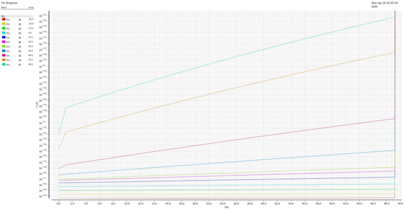<figcaption aria-hidden="true">不同温度下的光电二极管<em>I</em>-<em>V</em>特性</figcaption></figure>

### AC频率响应与噪声仿真

AC仿真用于提取PIN光电二极管的小信号带宽、偏压相关响应和本征噪声谱密度。测试电路如图<a href="#fig:sim_pd_ac_tb" data-reference-type="ref" data-reference="fig:sim_pd_ac_tb">2.5</a>所示，其中$V_{ac}$用于施加小信号激励，$V_{dc}$用于设定反向偏置工作点。

<figure><figcaption aria-hidden="true">光电二极管AC仿真测试电路</figcaption></figure>

常温基础频率响应如图<a href="#fig:sim_ifrac_basic" data-reference-type="ref" data-reference="fig:sim_ifrac_basic">2.6</a>所示，PIN器件呈现典型单极点低通特性，仿真得到的$-3\,\text{dB}$带宽约为$2.46\,\text{GHz}$。该带宽远高于本项目AFE约$700\,\text{kHz}$的系统带宽目标，因此在系统主通带内，光电二极管自身不会成为带宽瓶颈。

<figure><figcaption aria-hidden="true">PIN光电二极管基础频率响应</figcaption></figure>

器件本征电流噪声主要由光生电流、暗电流和漏电流对应的散粒噪声，以及并联/串联电阻热噪声组成，可近似表示为 $$S_{i,int}(T) \approx 2q\left(|I_{ph}|+|I_{dark}|+|I_{br}|\right)
    + \frac{4kT}{R_{sh}} + \frac{4kT}{R_s}$$ 不同温度下的噪声谱密度如图<a href="#fig:sim_noise_frac" data-reference-type="ref" data-reference="fig:sim_noise_frac">2.7</a>所示。温度升高会使暗电流和热噪声同步上升，因此后级TIA的输入等效噪声仿真需要叠加光电二极管本征噪声作为系统级噪声边界。

<figure><figcaption aria-hidden="true">不同温度下的光电二极管噪声谱密度</figcaption></figure>

### 瞬态响应仿真

瞬态仿真用于验证器件对高速光脉冲的时域响应。测试电路如图<a href="#fig:sim_pd_tran_tb" data-reference-type="ref" data-reference="fig:sim_pd_tran_tb">2.8</a>所示，光功率源施加近似理想的方波光脉冲，输出端观察光电流建立过程。

<figure><figcaption aria-hidden="true">光电二极管瞬态仿真测试电路</figcaption></figure>

瞬态响应曲线如图<a href="#fig:sim_trans_response" data-reference-type="ref" data-reference="fig:sim_trans_response">2.9</a>所示。光脉冲上升沿到来时，光生电流迅速建立，同时结电容电荷重新分布会引入短暂位移电流，因此输出电流可能出现轻微过冲。由于PIN结构中的光生载流子主要在宽耗尽区内以漂移方式收集，响应速度明显优于传统PN结结构，能够满足后级TIA瞬态仿真的输入边沿要求。

<figure>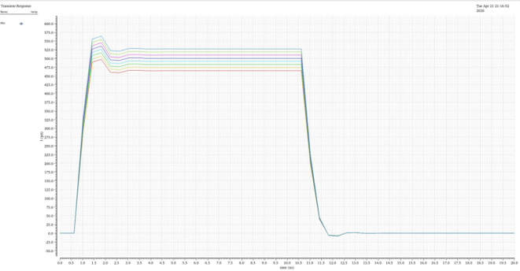<figcaption aria-hidden="true">不同温度下的PIN光电二极管瞬态响应</figcaption></figure>

## 跨阻放大器（TIA）单模块仿真

### 输入共模范围与直流响应

**仿真设置：**TIA 核心采用两级 OTA 架构，闭环反馈网络配置为 $R_f=100\,\mathrm{k}\Omega$、$C_f=1\,\mathrm{pF}$。在 $3.3\,\mathrm{V}$ 典型供电电压下，对输入直流光电流进行参数扫描（DC Sweep），扫描范围设定为 $0.1\,\mathrm{nA}$ 至 $1\,\mathrm{\mu A}$，重点评估 $50\,\mathrm{nA}$ 典型工作点附近的直流特性。仿真所用 testbench 如图<a href="#fig:tia_icmr_tb" data-reference-type="ref" data-reference="fig:tia_icmr_tb">2.10</a>所示。

<figure>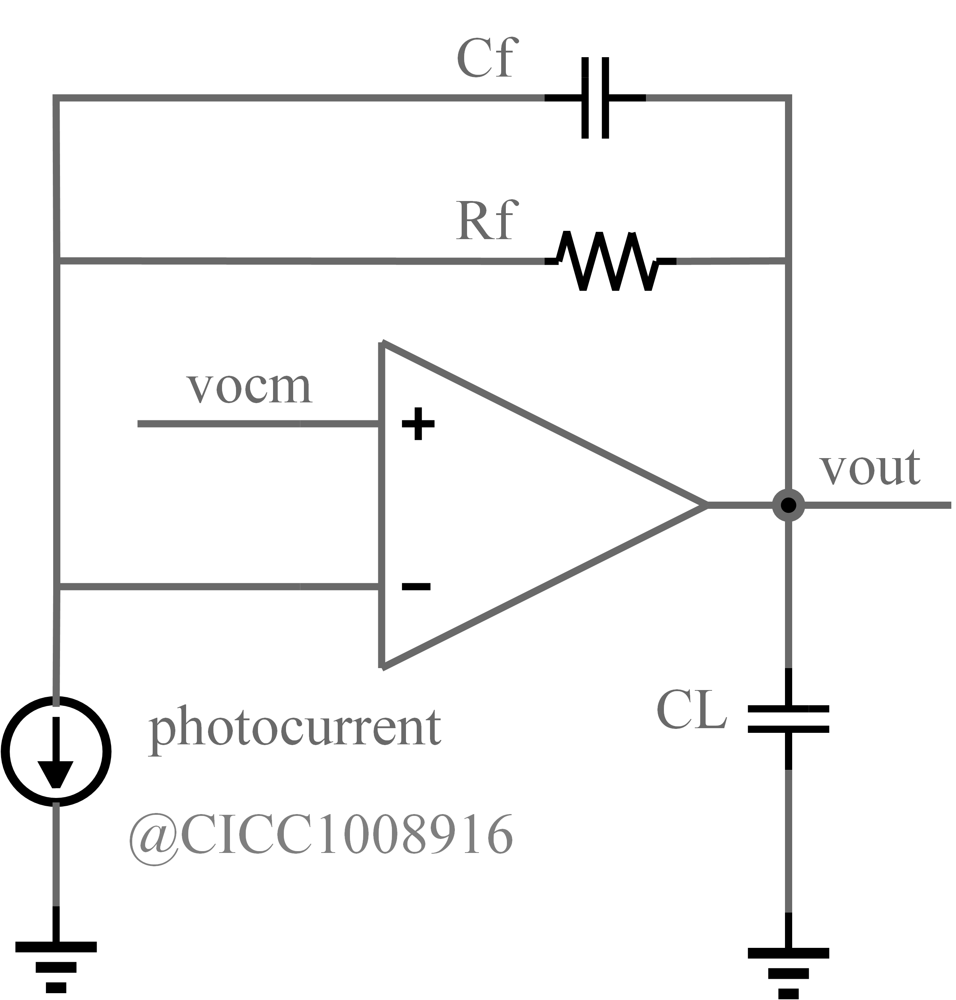<figcaption aria-hidden="true">TIA输入共模范围与直流扫描仿真 testbench</figcaption></figure>

**仿真输入：**直流光信号等效电流源 $I_{photo}$。

**仿真输出：**TIA 核心运放反相输入端（虚拟地）电平与输出节点直流电压轨迹。输出节点电压随输入直流电流变化的特性曲线，在四个极端工艺角（Asym\_FS, Asym\_SF, BC, WCLowtemp）下的重叠对比图如图<a href="#fig:tia_icmr_curve" data-reference-type="ref" data-reference="fig:tia_icmr_curve">2.11</a>所示。

<figure><figcaption aria-hidden="true">TIA输出直流电平随输入光电流变化的扫描曲线</figcaption></figure>

**结果分析：** 仿真曲线表明，在伪差分/单端跨阻拓扑下，随着输入光电流的增加，TIA 输出节点的直流电平（即共模电压基线）必然发生线性偏移。在稳定输出共模目标为 $V_{cm} = 1.65\,\mathrm{V}$ 的前提下，当输入电流达到 $330\,\mathrm{nA}$ 时，输出电平已产生约 $0.03\,\mathrm{V}$ 的直流偏差。对于 14-bit 高精度系统而言，前端如此量级的共模漂移将严重挤压后级 ADC 的动态量程，属不可容忍的系统级误差。各工艺角下偏差趋势保持一致，说明此系拓扑固有特性而非工艺失配引起。

**解决方案：** 针对 TIA 输出端固有的共模漂移问题，本设计在系统链路层进行校正：信号自 TIA 输出后，将级联至全差分单端转差分模块（Single-to-Differential Amplifier），并在该级及后续的 PGA 模块中引入强健的共模反馈（CMFB）环路，以强制重置并稳定全链路的中心共模电平至绝对的 $1.65\,\mathrm{V}$。

### 跨阻增益，带宽与频率响应

**仿真设置：**基于 $50\,\mathrm{nA}$ 的直流偏置工作点，注入幅度为 $1\,\mathrm{nA}$ 的小信号交流电流（AC current）。交流扫频（AC Sweep）范围设定为 $1\,\mathrm{Hz}$ 至 $100\,\mathrm{MHz}$。为探究反馈电容对系统高频特性的影响并寻找最佳相位补偿点，对 $C_f$ 进行了参数化扫描（$0.5\,\mathrm{pF}, 1\,\mathrm{pF}, 2\,\mathrm{pF}$）。仿真所用 testbench 同上，如图<a href="#fig:tia_icmr_tb" data-reference-type="ref" data-reference="fig:tia_icmr_tb">2.10</a>所示。

**仿真输出：**TIA 输出节点的闭环跨阻增益（以 $\mathrm{dB\Omega}$ 计）与相位响应曲线。在四个极端工艺角下的幅相频特性如图<a href="#fig:tia_ac_curve" data-reference-type="ref" data-reference="fig:tia_ac_curve">2.12</a>所示。

<figure><figcaption aria-hidden="true">TIA 闭环跨阻增益与相位频率响应仿真结果</figcaption></figure>

提取幅频特性的关键指标，不同补偿电容下的结果如表<a href="#tab:tia_ac" data-reference-type="ref" data-reference="tab:tia_ac">2.1</a>所示。

|     $C_f$ 容值     |       低频跨阻增益       | $-3\,\mathrm{dB}$ 闭环带宽 |         频响平坦度/稳定性评估          |
|:------------------:|:------------------------:|:--------------------------:|:--------------------------------------:|
| $0.5\,\mathrm{pF}$ | $100\,\mathrm{dB\Omega}$ |    $5.5\,\mathrm{MHz}$     |  带宽过大，伴随轻微 Peaking，裕度偏低  |
|  $1\,\mathrm{pF}$  | $100\,\mathrm{dB\Omega}$ |    $1.8\,\mathrm{MHz}$     | 带宽适中，最平坦巴特沃斯响应，裕度优良 |
|  $2\,\mathrm{pF}$  | $100\,\mathrm{dB\Omega}$ |    $870\,\mathrm{kHz}$     |   带宽受限（接近系统要求），过度阻尼   |

不同反馈电容 $C_f$ 下的 TIA 频响特性汇总

**结果分析：** TIA 在闭环状态下，严格意义的环路相位裕度（Phase Margin）需通过 STB 分析测量，但通过观测闭环幅频响应的峰化（Peaking）现象可直观判断系统的阻尼状态。仿真显示：较小的 $C_f$（如 $0.5\,\mathrm{pF}$）虽能拓展带宽，但会导致高频段增益凸起，时域表现为瞬态振铃；较大的 $C_f$（如 $2\,\mathrm{pF}$）能提供绝对的稳定性，但牺牲了宝贵的带宽裕量。综合权衡噪声滤波与后级 $700\,\mathrm{kHz}$ 级联收缩需求，选定 $1\,\mathrm{pF}$ 作为最佳相位补偿点，此时无明显峰化且具有充足的安全裕量。

### 噪声分析

**仿真设置：**运行 Noise 仿真，输出探针置于 TIA 输出节点，输入参考源设定为光电流源接口。积分频率范围覆盖系统完整带宽（$1\,\mathrm{Hz} \sim 1\,\mathrm{MHz}$）。仿真所用 testbench 同上，如图<a href="#fig:tia_icmr_tb" data-reference-type="ref" data-reference="fig:tia_icmr_tb">2.10</a>所示。

**仿真输出：**折算至 TIA 差分输出节点的电压噪声谱密度（Noise Spectral Density, NSD）与频段内累积的积分噪声（Integrated Noise）曲线。在四个极端工艺角下的统计学波形如图<a href="#fig:tia_noise_curve" data-reference-type="ref" data-reference="fig:tia_noise_curve">2.13</a>所示。

<figure><figcaption aria-hidden="true">TIA 等效输出噪声谱密度与累积积分噪声曲线</figcaption></figure>

**仿真结果：** 结合曲线与 Calculator 函数提取，噪声性能指标汇总如表<a href="#tab:tia_noise" data-reference-type="ref" data-reference="tab:tia_noise">2.2</a>所示。

|       评估指标       |      关键评估带宽/频点       |             仿真量测值             |
|:--------------------:|:----------------------------:|:----------------------------------:|
| 等效输入电压噪声密度 |     $100\,\mathrm{kHz}$      |    $49\,\mathrm{nV/\sqrt{Hz}}$     |
|   输出端总积分噪声   | 积分上限 $700\,\mathrm{kHz}$ | $\approx 50\,\mathrm{\mu V_{rms}}$ |

TIA 核心噪声性能仿真结果

**结果分析：** TIA 作为模拟前端的第一级“关口”，其噪声底色将直接被后续的 PGA 级联放大，是系统 SNR 最敏感的环节。仿真证实，通过增大 OTA 输入对管尺寸及提升尾电流偏置，有效压低了闪烁噪声拐角及热噪声平台。即使在 $700\,\mathrm{kHz}$ 宽频积分下，总积分噪声仍控制在 $\approx 50\,\mathrm{\mu V_{rms}}$ 量级，接近 14-bit ADC ($3\,\mathrm{V_{pp}}$) 约 $53\,\mathrm{\mu V_{rms}}$ 的理想量化噪声下限，满足系统的苛刻底噪预算。

### 瞬态大信号阶跃响应

**仿真设置：**进行长时 Transient 仿真，在系统趋于稳态后，输入光电流施加从 $50\,\mathrm{nA}$ 突跳至 $60\,\mathrm{nA}$ 的陡峭阶跃激励，重点观察 TIA 输出电压的大信号压摆与小信号建立行为。

**仿真输出：**TIA 输出节点电压随时间的瞬态响应波形。四个不同工艺角下的阶跃恢复与建立曲线如图<a href="#fig:tia_step_curve" data-reference-type="ref" data-reference="fig:tia_step_curve">2.14</a>所示。

<figure><figcaption aria-hidden="true">TIA 大信号阶跃瞬态响应及建立时间细节</figcaption></figure>

**仿真结果：** 从阶跃沿触发至输出电压稳定在最终目标电平 $\pm 0.1\%$ 误差带内的响应参数如表<a href="#tab:tia_step" data-reference-type="ref" data-reference="tab:tia_step">2.3</a>所示：

|  仿真工艺角 (Corners)  | $0.1\%$ 建立时间 ($t_s$) |   最终稳态建立电平    |
|:----------------------:|:------------------------:|:---------------------:|
|        Asym\_FS        |    $750\,\mathrm{ns}$    | $1.65538\,\mathrm{V}$ |
|        Asym\_SF        |    $750\,\mathrm{ns}$    | $1.65538\,\mathrm{V}$ |
|     BC (Best Case)     |    $750\,\mathrm{ns}$    | $1.65538\,\mathrm{V}$ |
| WCLowtemp (Worst Case) |    $750\,\mathrm{ns}$    | $1.65539\,\mathrm{V}$ |

不同工艺角下 TIA 瞬态阶跃建立时间

**结果分析：** 瞬态阶跃响应直观地反映了频率域的主极点带宽与相位裕度。在所有四个严苛的工艺角测试中，输出信号均表现出极佳的时域干净度，无明显的过冲（Overshoot）或振铃（Ringing）现象，证实了 $1\,\mathrm{pF}$ 密勒补偿电容的绝对稳定性。即使在最慢的 WCLowtemp 条件下，建立时间亦保持在 $750\,\mathrm{ns}$ 水平，末端稳态电平的微小直流偏移处于 $\mu\mathrm{V}$ 级别，完全在系统容错规范内，保证了高频大信号冲击下系统的动态保真度。

### 实际指标总结

基于前文全面的交直流及瞬态仿真，TIA 单模块的核心物理级性能参数最终收敛并汇总如下：

| **设计参数指标**            | **仿真验证结果**                                                | **设计目标与备注**                                                             |
|:----------------------------|:----------------------------------------------------------------|:-------------------------------------------------------------------------------|
| 有效输入电流范围            | $0.1\,\mathrm{nA} \sim 330\,\mathrm{nA}$ (未饱和前)             | 目标 $0.1\,\mathrm{nA} \sim 1\,\mathrm{\mu A}$（后半段由于共模偏移需后级校正） |
| 低频跨阻增益 ($Z_T$)        | $100\,\mathrm{dB\Omega}$ ($100\,\mathrm{k}\Omega$)              | 完美契合 $R_f = 100\,\mathrm{k}\Omega$ 设计值                                  |
| 闭环 $-3\,\mathrm{dB}$ 带宽 | $1.8\,\mathrm{MHz}$ (@ $C_f = 1\,\mathrm{pF}$)                  | 远超 $700\,\mathrm{kHz}$，为级联带宽收缩留足裕量                               |
| 输出等效积分噪声            | $\approx 50\,\mathrm{\mu V_{rms}}$ ($0 \sim 700\,\mathrm{kHz}$) | 满足 14-bit 高精度 ADC 极低底噪需求                                            |
| 大信号阶跃建立时间          | $750\,\mathrm{ns}$ ($0.1\%$ 精度误差带)                         | 时域平滑无振铃，压摆率充足                                                     |

TIA 模块最终仿真核心指标汇总清单

## 全差分放大器（FDA）单模块仿真

### 输入共模范围与直流稳态特性

**仿真设置：**在典型供电电压 $3.3\,\mathrm{V}$ 条件下，设置输出共模反馈（CMFB）的目标基准电压为 $1.65\,\mathrm{V}$。对输入端共模电平进行直流扫描（DC Sweep），扫描区间设定为 $0.5\,\mathrm{V}$ 至 $2.5\,\mathrm{V}$。 仿真所用 testbench 如图<a href="#fig:fda_icmr_tb" data-reference-type="ref" data-reference="fig:fda_icmr_tb">2.15</a>所示。

<figure>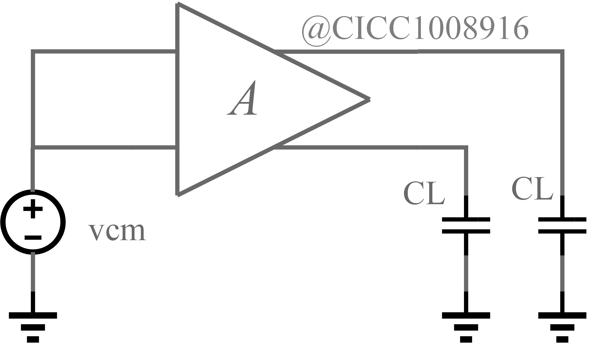<figcaption aria-hidden="true">FDA输入共模范围仿真testbench</figcaption></figure>

**仿真输出：** 提取 FDA 核心晶体管的工作区状态（Region），并绘制输出共模电压随输入共模电平变化的传输特性曲线。 在四个极限工艺角及标称状态下，输出共模电压的扫描曲线对比如图<a href="#fig:fda_icmr_curve" data-reference-type="ref" data-reference="fig:fda_icmr_curve">2.16</a>所示。

<figure>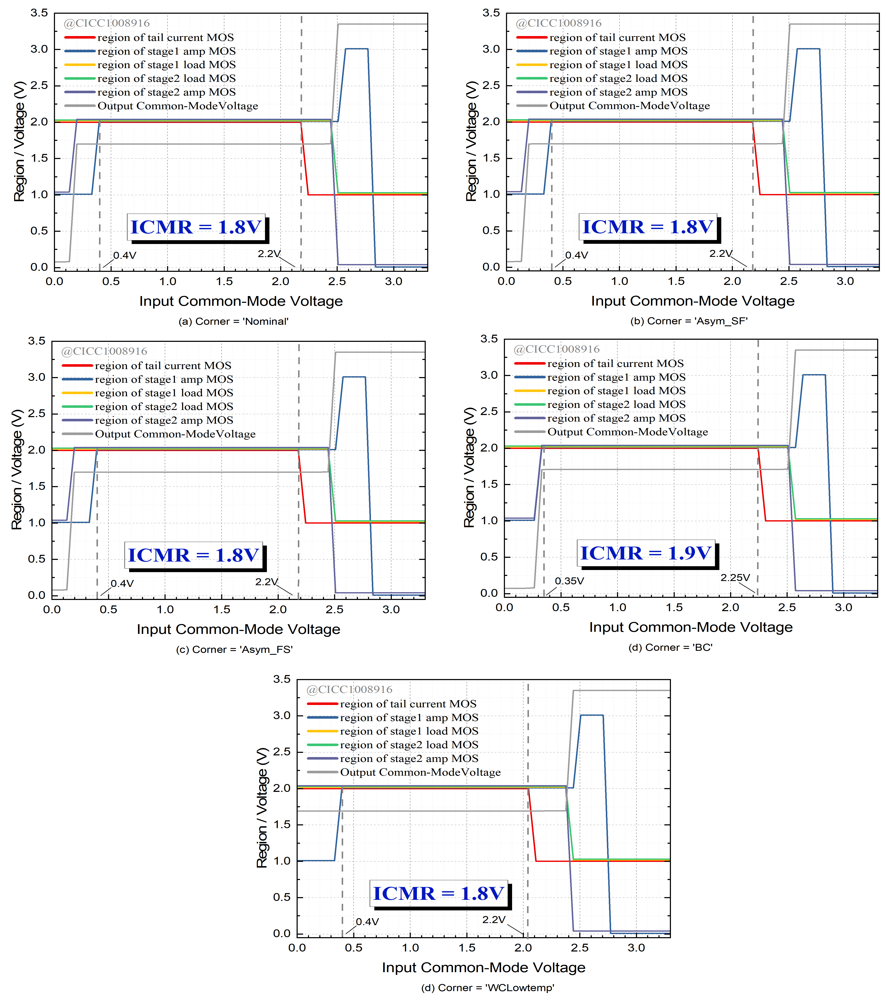<figcaption aria-hidden="true">FDA输入共模范围仿真结果</figcaption></figure>

**仿真结果：** 从曲线拐点及管子工作状态提取出的有效输入共模范围如下表<a href="#tab:fda_icmr" data-reference-type="ref" data-reference="tab:fda_icmr">2.5</a>所示。

|               **工艺角 (Corner)**               | **共模下限 ($V_{\mathrm{icmr,min}}$)** | **共模上限 ($V_{\mathrm{icmr,max}}$)** |
|:-----------------------------------------------:|:--------------------------------------:|:--------------------------------------:|
| Nominal ($25^\circ\mathrm{C}$, $3.3\mathrm{V}$) |           $0.40\,\mathrm{V}$           |           $2.20\,\mathrm{V}$           |
|                 BC (Best Case)                  |           $0.35\,\mathrm{V}$           |           $2.30\,\mathrm{V}$           |
|             WCLowtemp (Worst Case)              |           $0.45\,\mathrm{V}$           |           $2.10\,\mathrm{V}$           |

FDA 有效输入共模范围 (ICMR) 仿真结果

**结果分析：** 其判定基准为：在该共模区间内，FDA 内部的输入差分对管、尾电流源以及折叠/共源共栅（Cascode）负载管均深处饱和区（Saturation Region），且 CMFB 环路具备足够的增益将输出共模精准锁定在 $1.65\,\mathrm{V}$ 附近。若前级（如 TIA）输出的共模电平漂移超出此 $0.4\,\mathrm{V} \sim 2.2\,\mathrm{V}$ 的安全裕度，将导致 FDA 增益骤降并引发严重的非线性失真。因此，在系统级联时需严格做好级间的共模电平匹配。

### 开环增益，带宽与相位裕度

**仿真设置：**切断外部反馈网络，将 FDA 置于开环测试模式（或使用大电感大电容隔离交直流环路）。输入共模偏置在 $1.65\,\mathrm{V}$，在输入端注入单位交流小信号（AC=1）。 仿真所用 testbench 如图<a href="#fig:fda_openloop_tb" data-reference-type="ref" data-reference="fig:fda_openloop_tb">2.17</a>所示。

<figure>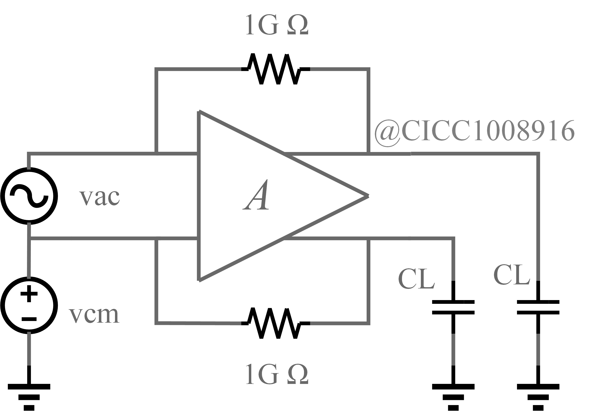<figcaption aria-hidden="true">FDA开环增益，带宽与相位裕度仿真testbench</figcaption></figure>

**仿真输出：** FDA 差分输出节点的 Bode 图（幅频与相频响应）。 在四个不同工艺角下的开环频率响应曲线如图<a href="#fig:fda_openloop_curve" data-reference-type="ref" data-reference="fig:fda_openloop_curve">2.18</a>所示。

<figure>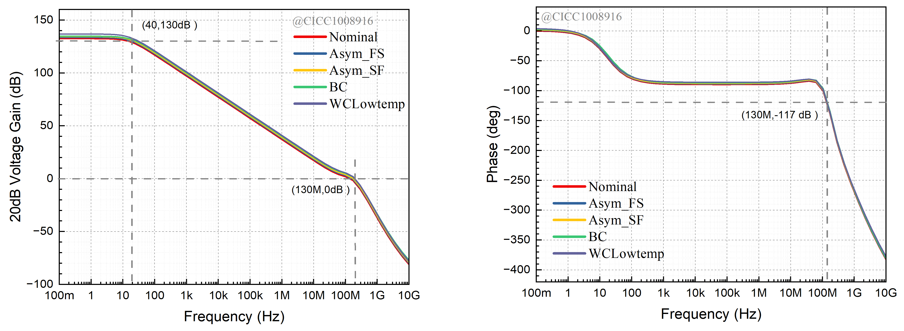<figcaption aria-hidden="true">FDA开环增益，带宽与相位裕度仿真结果</figcaption></figure>

**仿真结果：** 提取典型状态下的开环频响特征参数，如表<a href="#tab:fda_openloop" data-reference-type="ref" data-reference="tab:fda_openloop">2.6</a>所示。

| **测试状态** | **低频直流增益 ($A_{v0}$)** | **增益带宽积 (GBW)** | **相位裕度 (PM)**  |
|:------------:|:---------------------------:|:--------------------:|:------------------:|
|  典型工艺角  |     $138\,\mathrm{dB}$      | $130\,\mathrm{MHz}$  | $\approx 63^\circ$ |

FDA 开环频率响应核心指标

**结果分析：** $138\,\mathrm{dB}$ 的超高开环增益是 14-bit 系统的坚实保障，它能将闭环工作时的静态稳态误差（$1/A\beta$）压缩至极其微小的水平，确保高精度信号的无损传递。约 $63^\circ$ 的相位裕度是理想的巴特沃斯（Butterworth）响应点，预示着闭环阶跃响应将具有极小的过冲。然而，$130\,\mathrm{MHz}$ 的 GBW 在面对较大闭环增益配置时，可用带宽将被显著压缩，要求在系统设计时必须严格进行增益-带宽的折中分配。

### 闭环稳定性（STB）仿真

**仿真设置：**将 FDA 置于闭环工作模式。利用 `iprobe` 探针打断反馈主环路进行 STB（稳定性）分析。为全面评估系统鲁棒性，通过改变反馈电阻网络，扫描闭环增益从 $0\,\mathrm{dB}$ 到 $60\,\mathrm{dB}$，步长设定为 $20\,\mathrm{dB}$。 仿真所用 testbench 如图<a href="#fig:fda_stb_tb" data-reference-type="ref" data-reference="fig:fda_stb_tb">2.19</a>所示。

<figure>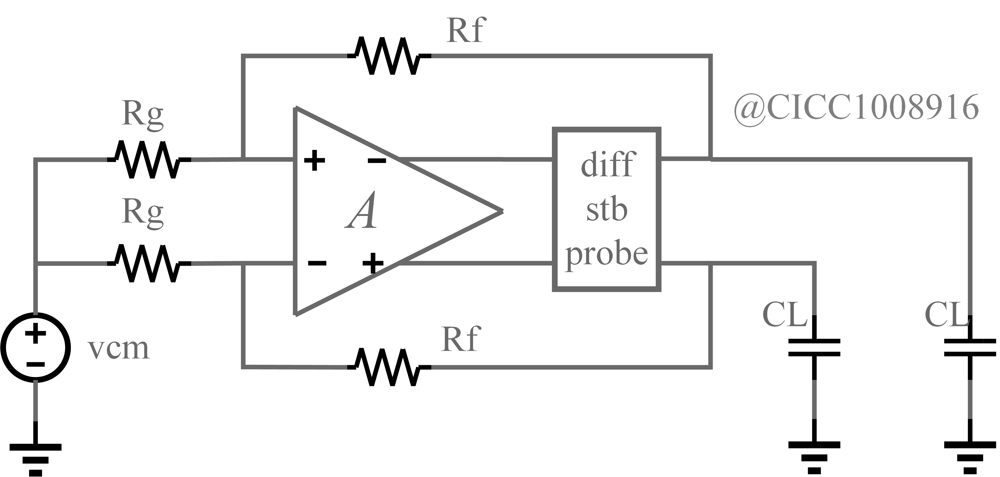<figcaption aria-hidden="true">FDA闭环稳定性（stb）仿真testbench</figcaption></figure>

**仿真输出：** 不同闭环增益配置下的环路增益（Loop Gain）与相位响应曲线。 在四个不同工艺角下的响应曲线重叠图如图<a href="#fig:fda_stb_curve" data-reference-type="ref" data-reference="fig:fda_stb_curve">2.20</a>所示。

<figure>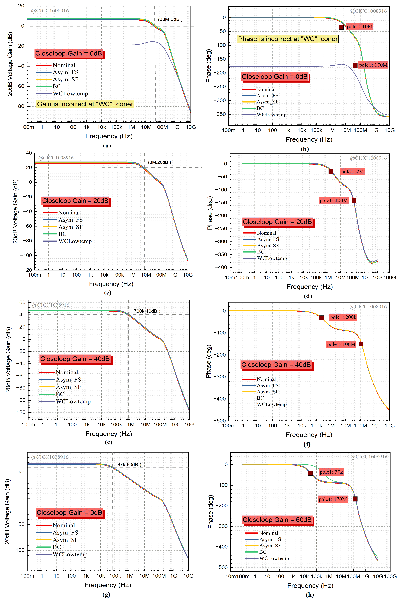<figcaption aria-hidden="true">FDA闭环稳定性（stb）仿真结果</figcaption></figure>

**仿真结果：** 随闭环增益增加，环路带宽发生收缩，具体数值分布如表<a href="#tab:fda_stb" data-reference-type="ref" data-reference="tab:fda_stb">2.7</a>所示：

|         **闭环增益设定**         | **闭环 $-3\,\mathrm{dB}$ 带宽** | **环路主极点位置**  |   **稳定性评估**    |
|:--------------------------------:|:-------------------------------:|:-------------------:|:-------------------:|
|   $0\,\mathrm{dB}$ ($1\times$)   |       $38\,\mathrm{MHz}$        | $10\,\mathrm{MHz}$  |   稳定 (裕度受限)   |
|  $20\,\mathrm{dB}$ ($10\times$)  |        $8\,\mathrm{MHz}$        |  $2\,\mathrm{MHz}$  |        极佳         |
| $40\,\mathrm{dB}$ ($100\times$)  |       $700\,\mathrm{kHz}$       | $200\,\mathrm{kHz}$ | 优良 (契合系统带宽) |
| $60\,\mathrm{dB}$ ($1000\times$) |       $87\,\mathrm{kHz}$        | $30\,\mathrm{kHz}$  | 稳定 (带宽严重收缩) |

不同闭环增益配置下的环路稳定性仿真结果

**结果分析：** 根据“增益-带宽积守恒”定律，随着需求增益的提升，系统带宽不可避免地线性下降。如表<a href="#tab:fda_stb" data-reference-type="ref" data-reference="tab:fda_stb">2.7</a>所示，当闭环增益设定为 $40\,\mathrm{dB}$ 时，系统带宽恰好在 $700\,\mathrm{kHz}$ 附近，完美契合了本项目的数据采集带宽需求。因此，在物理架构规划中，将该 FDA 的实际级联增益锁定在 $20\,\mathrm{dB} \sim 40\,\mathrm{dB}$ 之间，不仅能保证绝对的环路稳定性，还能确保高频信号不被过度衰减。

### 共模抑制比（CMRR）与电源抑制比（PSRR）

**仿真设置：**采用交流（AC）仿真机制。 1. \*\*CMRR测试：\*\* 在 FDA 的两个输入端同时施加极性相同的交流共模信号，测得共模增益（$A_{cm}$）； 2. \*\*PSRR测试：\*\* 在 VDD 供电轨叠加交流扰动信号，测得电源到输出的增益（$A_{vdd}$）。 将两者分别与预先测得的差模增益（$A_{dm}$）取对数比值，计算出 CMRR 和 PSRR。 仿真所用 testbench 如图<a href="#fig:fda_cmrr_psrr_tb" data-reference-type="ref" data-reference="fig:fda_cmrr_psrr_tb">[fig:fda_cmrr_psrr_tb]</a>所示。

**仿真输出：** CMRR 与 PSRR 随频率变化的谱线。 四个不同工艺角下的 CMRR/PSRR 频率响应如图<a href="#fig:fda_cmrr_psrr_curve" data-reference-type="ref" data-reference="fig:fda_cmrr_psrr_curve">2.21</a>所示。

<figure>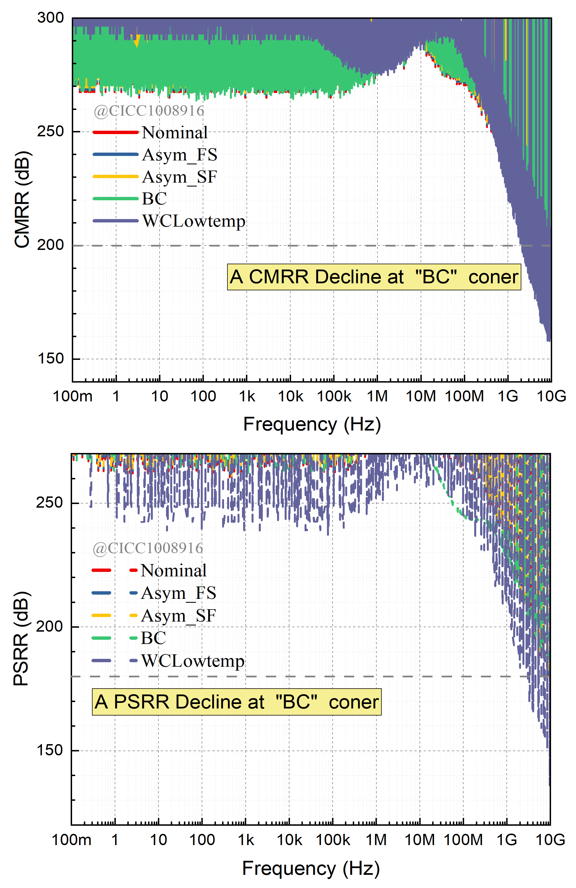<figcaption aria-hidden="true">FDA共模抑制比（CMRR）与电源抑制比（PSRR）仿真结果</figcaption></figure>

**仿真结果：** 在系统核心带宽内的抑制能力如表<a href="#tab:fda_cmrr_psrr" data-reference-type="ref" data-reference="tab:fda_cmrr_psrr">2.8</a>所示。

|   **抗扰指标**    |    **低频极限值**    | **在 $1\,\mathrm{MHz}$ 有效带宽内的最差值** |
|:-----------------:|:--------------------:|:-------------------------------------------:|
| 共模抑制比 (CMRR) | $> 280\,\mathrm{dB}$ |         $\approx 280\,\mathrm{dB}$          |
| 电源抑制比 (PSRR) | $> 250\,\mathrm{dB}$ |         $\approx 250\,\mathrm{dB}$          |

FDA 的 CMRR 与 PSRR 仿真指标

**结果分析：** 在 14-bit 高精度混合信号系统中，由于后级 SAR ADC 存在频繁的开关动作，VDD 供电轨极易受到数字翻转噪声的污染；同时前端传感器环境易引入环境共模干扰。高达 $250\,\mathrm{dB}$ 的电源抑制比与 $280\,\mathrm{dB}$ 的共模抑制比（此为理想匹配状态下的极限值），充分证明了全差分对称架构的卓越抗干扰能力，能够将电源纹波与共模漂移彻底阻挡在信号链路之外。

### 噪声分析

**仿真设置：**将 FDA 配置为闭环工作模式（模拟其实际驱动后级的工作状态），输入共模偏置于 $1.65\,\mathrm{V}$。运行 Noise 仿真，噪声积分频率范围严谨设定为 $1\,\mathrm{Hz}$ 至 $10\,\mathrm{MHz}$，以覆盖所有的带内底噪及宽带热噪声混叠效应。 仿真所用 testbench 如图<a href="#fig:fda_noise_tb" data-reference-type="ref" data-reference="fig:fda_noise_tb">2.22</a>所示。

<figure>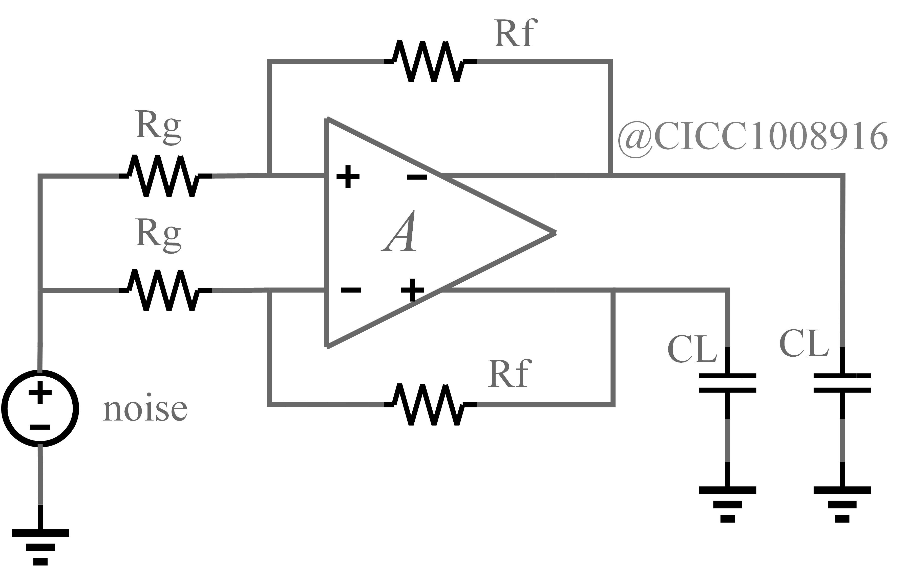<figcaption aria-hidden="true">FDA噪声分析仿真testbench</figcaption></figure>

**仿真输出：** FDA 折算到输入端的等效输入噪声电压谱密度（Input-Referred Noise Density）及其在频域上的累积积分曲线。 不同工艺角下噪声密度随频率变化的对数曲线如图<a href="#fig:fda_noise_curve" data-reference-type="ref" data-reference="fig:fda_noise_curve">2.23</a>所示。

<figure>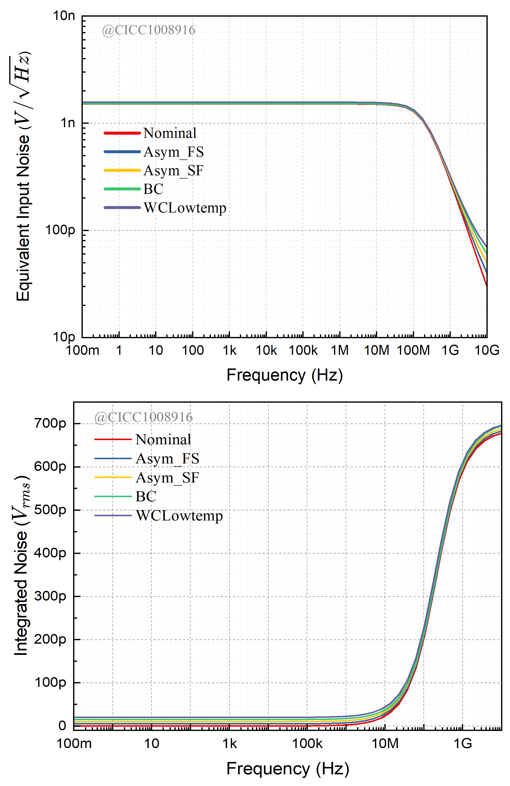<figcaption aria-hidden="true">FDA等效输入噪声谱密度与积分噪声仿真结果</figcaption></figure>

**仿真结果：** 核心噪声指标如表<a href="#tab:fda_noise" data-reference-type="ref" data-reference="tab:fda_noise">2.9</a>所示。

|                   **噪声评估项**                    |           **仿真结果值**           |
|:---------------------------------------------------:|:----------------------------------:|
|   有效带内等效输入噪声密度 (@ $1\,\mathrm{MHz}$)    | $\approx 2\,\mathrm{nV/\sqrt{Hz}}$ |
| 折算至输入端的总积分噪声 ($0 \sim 1\,\mathrm{MHz}$) |     $45\,\mathrm{\mu V_{rms}}$     |

FDA 噪声特性仿真数据

**结果分析：** 在 14-bit（$\mathrm{LSB} \approx 183\,\mathrm{\mu V}$）的高分辨率系统中，FDA 的宽带热噪声和低频闪烁噪声（$1/f$ 噪声）是吞噬信噪比的元凶。从根本的物理设计角度，本设计通过为 FDA 第一级差分对管分配极大的尾电流（提升 $g_m$），并适度放大了输入管的栅面积（压低 $1/f$ 拐角），成功将带内噪声密度压制在极低的 $2\,\mathrm{nV/\sqrt{Hz}}$ 水平。最终 $45\,\mathrm{\mu V_{rms}}$ 的总积分噪声完美守住了系统的苛刻底噪红线。

### 瞬态阶跃响应与压摆率

**仿真设置：**将 FDA 配置为闭环模式，并在输出端挂载严苛的 $40\,\mathrm{pF}$ 大负载电容（等效模拟甚至超过了 SAR ADC 中 CDAC 阵列的极端采样电容）。在输入端施加幅度趋近满量程差分的陡峭阶跃信号。 仿真所用 testbench 如图<a href="#fig:fda_tran_tb" data-reference-type="ref" data-reference="fig:fda_tran_tb">2.24</a>所示。

<figure><figcaption aria-hidden="true">FDA瞬态阶跃响应与压摆率仿真testbench</figcaption></figure>

**仿真输出：** FDA 差分输出电压随时间建立的时域响应波形。重点量测大信号跳变斜率（Slew Rate, SR）以及小信号稳态建立至指定误差带内的所需时间（Settling Time）。 大信号阶跃响应及局部建立细节放大图如图<a href="#fig:fda_tran_curve" data-reference-type="ref" data-reference="fig:fda_tran_curve">2.25</a>所示。

<figure><figcaption aria-hidden="true">FDA瞬态阶跃响应及建立波形</figcaption></figure>

**仿真结果：** 动态大信号指标提取如表<a href="#tab:fda_tran" data-reference-type="ref" data-reference="tab:fda_tran">2.10</a>所示。

|                   **动态响应指标**                    |     **仿真结果值**      |
|:-----------------------------------------------------:|:-----------------------:|
|                差分压摆率 (Slew Rate)                 | $800\,\mathrm{V/\mu s}$ |
| 建立时间 ($t_s$, 建立至 $500\,\mathrm{\mu V}$ 误差带) |  $2.0\,\mathrm{\mu s}$  |

FDA 大信号阶跃建立与压摆率参数

**结果分析：** 驱动沉重的容性负载并实现无振铃建立，是验证运放驱动能力的关键。得益于大偏置电流的设计，FDA 的内部充放电节点展现出了高达 $800\,\mathrm{V/\mu s}$ 的压摆率，这意味着其大信号跳变极为迅猛，非线性摆动时间被极度压缩。建立至 $500\,\mathrm{\mu V}$（近乎半个 LSB）仅耗时 $2\,\mathrm{\mu s}$，这为系统的采样时钟分配留足了时间窗口，完全规避了动态建立不足带来的谐波失真。

### 总谐波失真（THD）

**仿真设置：**在闭环模式下，向 FDA 注入频率为 $100\,\mathrm{kHz}$、幅度为满量程（$3\,\mathrm{V_{pp}}$ 差分）的纯净正弦波信号。运行高精度的瞬态仿真（Transient）以获取长时稳定波形，并利用 Virtuoso 内部的 Spectrum 工具对多个完整信号周期进行快速傅里叶变换（FFT），提取各次谐波能量。 仿真所用 testbench 如图<a href="#fig:fda_thd_tb" data-reference-type="ref" data-reference="fig:fda_thd_tb">2.26</a>所示。

<figure>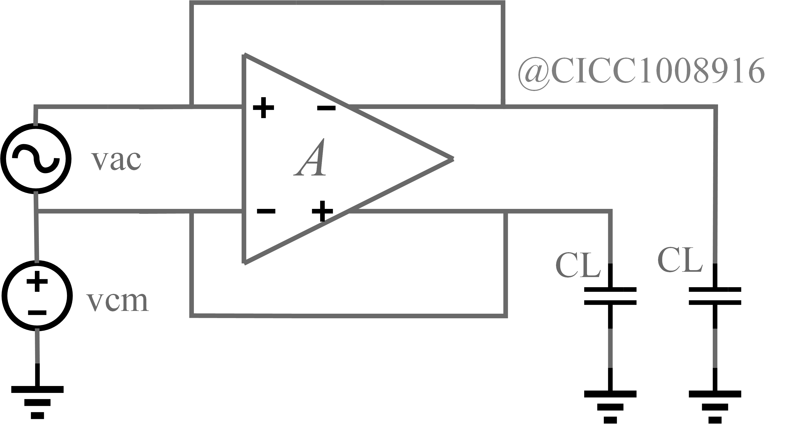<figcaption aria-hidden="true">FDA总谐波失真（THD）仿真testbench</figcaption></figure>

**仿真输出：** FDA 满量程差分输出信号的 FFT 频谱图。图中清晰标定基波幅值与高次（主要为二次、三次）谐波分量的底噪水平。 FFT 频谱分析结果如图<a href="#fig:fda_thd_curve" data-reference-type="ref" data-reference="fig:fda_thd_curve">2.27</a>所示。

<figure>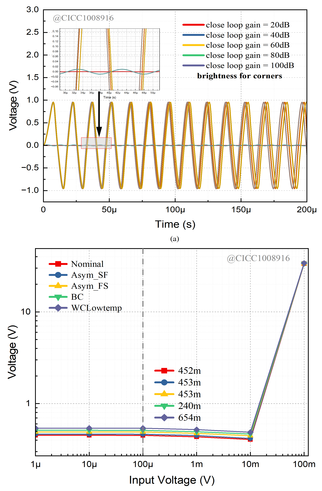<figcaption aria-hidden="true">FDA满量程输出FFT频谱与THD仿真结果</figcaption></figure>

**仿真结果：** 在不同的工艺边界条件下，提取出的满量程 THD 数据如表<a href="#tab:fda_thd" data-reference-type="ref" data-reference="tab:fda_thd">2.11</a>所示。

|        **测试设定**         | **工艺角 (Corners)** |  **测得 THD (dB)**   |
|:---------------------------:|:--------------------:|:--------------------:|
| 满量程, $100\,\mathrm{kHz}$ |    Nominal (典型)    | $-96.2\,\mathrm{dB}$ |
| 满量程, $100\,\mathrm{kHz}$ |       Asym\_FS       | $-92.5\,\mathrm{dB}$ |
| 满量程, $100\,\mathrm{kHz}$ |       Asym\_SF       | $-92.8\,\mathrm{dB}$ |
| 满量程, $100\,\mathrm{kHz}$ |      BC (最快)       | $-98.1\,\mathrm{dB}$ |
| 满量程, $100\,\mathrm{kHz}$ |   WCLowtemp (最慢)   | $-88.4\,\mathrm{dB}$ |

FDA 在不同工艺角下的总谐波失真 (THD) 仿真结果

\*(注：若增益过大导致信号超出供电轨满量程，管子进入线性区，THD 将严重恶化，不在可用线性范围内。)\*

**结果分析：** 14-bit 高精度系统要求其模拟前端具有极其优秀的线性度（理论量化信噪比底线约 $-86\,\mathrm{dB}$）。全差分（FDA）架构在物理原理上自然抵消了绝大部分偶次谐波（如 HD2），使得系统的非线性主要受限于三次谐波（HD3）。仿真结果清晰展示，即便在最恶劣的 WCLowtemp 工艺角下，THD 依然优于 $-88\,\mathrm{dB}$，典型状态更是深达 $-96\,\mathrm{dB}$，这意味着 FDA 在进行满量程信号放大时，其非线性失真完全被掩埋在量化噪声之下。

### 蒙特卡洛分析

**仿真设置：**加载 TSMC $180\,\mathrm{nm}$ `mc` 统计工艺模型，设置仿真迭代次数 $N=100$ 次。综合考量工艺的随机偏差（Process Variation）与局部器件失配（Mismatch）。在闭环状态且差分输入端完全短接置零（$V_{id}=0\,\mathrm{V}$）的条件下，量测 FDA 输出端的直流失调电压（DC Offset Voltage）。 仿真所用 testbench 同前，如图<a href="#fig:fda_thd_tb" data-reference-type="ref" data-reference="fig:fda_thd_tb">2.26</a>所示。

**仿真输出：** 记录 100 次迭代的差分输出失调电压，并绘制统计散布直方图（Histogram），叠加高斯（Gaussian）拟合曲线。 FDA 输出失调电压的 Monte Carlo 统计分布如图<a href="#fig:fda_mc_curve" data-reference-type="ref" data-reference="fig:fda_mc_curve">2.28</a>所示。

<figure>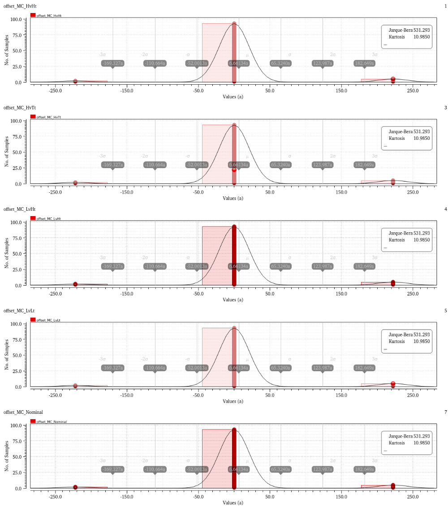<figcaption aria-hidden="true">FDA差分输出失调电压蒙特卡洛仿真结果</figcaption></figure>

**仿真结果：** 基于数据提取，其统计分布特征参数如下表<a href="#tab:fda_mc" data-reference-type="ref" data-reference="tab:fda_mc">2.12</a>所示：

|   **统计项目**   |     **平均值 ($\mu$)**      | **标准差 ($1\sigma$)** |
|:----------------:|:---------------------------:|:----------------------:|
| 输出直流失调电压 | $\approx 6.66\,\mathrm{aV}$ |  $65.32\,\mathrm{aV}$  |

FDA 输出直流失调电压蒙特卡洛统计参数

**结果分析：** 在基于理想原理图（Schematic-level）的蒙特卡洛仿真中，失调电压处于 $\mathrm{aV}$（阿伏特）级别，这一结果表明 FDA 的核心电路拓扑结构（包含电流镜与差分对）具有完美的本征对称性，不存在系统性失调漏洞。但在实际的物理流片中，由于版图布线的寄生不对称和掺杂浓度的随机波动，实际失调通常会落在 $\mathrm{mV}$ 量级。这深刻指导我们在后续版图（Layout）设计阶段，必须严格采用共源共栅交叉匹配（Common-Centroid）、添加外围伪管（Dummy Device）等高级版图技术，以最大程度捍卫这种原理图级别的对称性，避免失调电压挤占 ADC 的动态量程。

### 实际指标总结

基于上述严谨、全方位的交直流与瞬态仿真验证体系，本设计中全差分放大器（FDA）的核心物理性能指标最终收敛，并汇总对比于表<a href="#tab:fda_final_specs" data-reference-type="ref" data-reference="tab:fda_final_specs">2.13</a>中：

| **设计指标项**              | **最终仿真达成值**                             | **工程价值与设计备注**                          |
|:----------------------------|:-----------------------------------------------|:------------------------------------------------|
| 开环直流增益 ($A_{v0}$)     | $138\,\mathrm{dB}$                             | 极大地压减了系统闭环稳态误差，确保高精度。      |
| 闭环 $-3\,\mathrm{dB}$ 带宽 | $\approx 700\,\mathrm{kHz}$ (@ 40dB)           | 完美契合前端数据采集系统的有效带宽需求。        |
| 环路相位裕度 (PM)           | $63^\circ$                                     | 巴特沃斯极点分布，保障阶跃响应无严重振铃。      |
| 输入共模范围 (ICMR)         | $0.4\,\mathrm{V} \sim 2.2\,\mathrm{V}$         | 单电源 $3.3\mathrm{V}$ 下提供宽阔的前级适应性。 |
| 共模抑制比 (CMRR)           | $> 280\,\mathrm{dB}$                           | 有效过滤前端传感器的共模漂移干扰。              |
| 电源抑制比 (PSRR)           | $> 250\,\mathrm{dB}$                           | 高度免疫 VDD 供电轨上的数字开关纹波。           |
| 折算输入积分噪声            | $45\,\mathrm{\mu V_{rms}}$                     | 绝对底噪低于 14-bit 系统的 LSB 误差红线。       |
| 满量程总谐波失真            | $\le -88\,\mathrm{dB}$ (最恶劣)                | 全差分架构滤除偶次谐波，保障系统极高线性度。    |
| 大信号建立时间              | $2.0\,\mathrm{\mu s}$ (@ $40\mathrm{pF}$ 负载) | 赋予后级 SAR ADC 充足的采样建立追踪时间。       |

FDA 模块实际核心仿真指标汇总

## 可编程增益放大器（PGA）单模块仿真

### 输出共模范围稳定性

**仿真设置：**进行直流（DC）参数扫描仿真。 配置 PGA 供电电压为 $3.3\,\mathrm{V}$，CMFB 参考电压（即输出共模目标）精准设定为 $1.65\,\mathrm{V}$。在输入端同步扫描共模电平，扫描范围覆盖 $0.5\,\mathrm{V}$ 至 $2.5\,\mathrm{V}$，通过输出端内置的共模检测电阻网络提取实际输出共模电压。 仿真所用 testbench 如图 <a href="#fig:pga_ocmr_tb" data-reference-type="ref" data-reference="fig:pga_ocmr_tb">2.29</a> 所示。

<figure>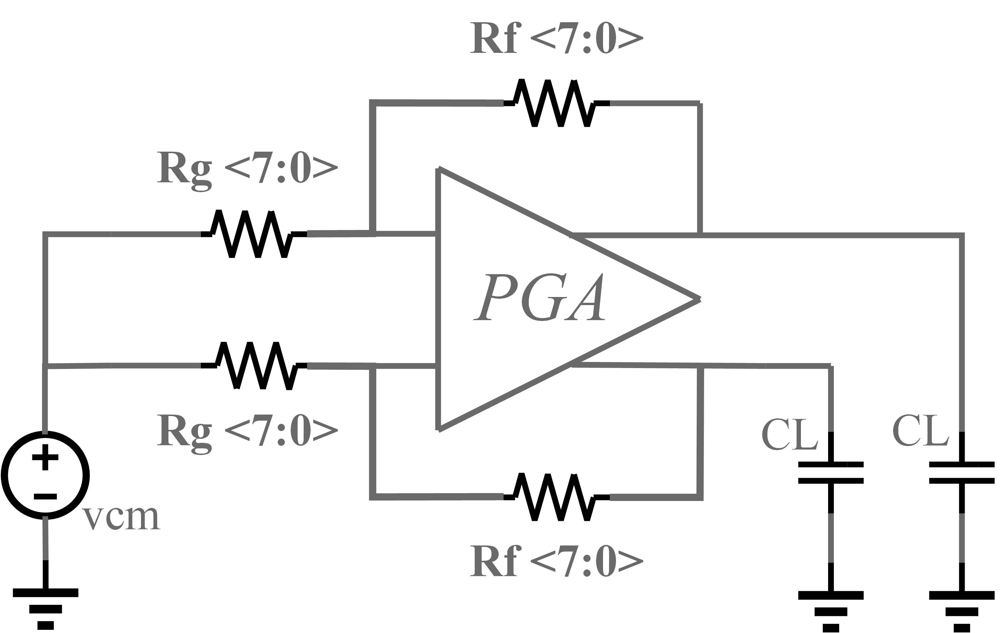<figcaption aria-hidden="true">PGA 输出共模范围稳定性仿真 testbench</figcaption></figure>

**仿真输出：** PGA 实际输出共模电压随输入共模电压扫描变化的直流响应曲线。 PGA 输出共模电平随输入共模变化的特性曲线如图 <a href="#fig:pga_ocmr_curve" data-reference-type="ref" data-reference="fig:pga_ocmr_curve">2.30</a> 所示。

<figure><figcaption aria-hidden="true">PGA 输出共模电平稳定性仿真结果</figcaption></figure>

**仿真结果：** 当输入共模在 $0.5\,\mathrm{V} \sim 2.5\,\mathrm{V}$ 的宽泛区间内剧烈波动时，PGA 的输出共模电压被严格钳位在 $1.65\,\mathrm{V}$ 中心点附近，最大波动幅度 $< 0.01\,\mathrm{mV}$。

**结果分析：** 在多级级联的模拟前端（AFE）链路中，前级微弱信号在经过高增益放大后，其直流基线极易发生不规则的共模漂移（Baseline Wander）。仿真表明，得益于 PGA 内部具备极高低频环路增益的共模反馈（CMFB）网络，PGA 能够完美隔离并抑制前级的共模漂移，为后级 SAR ADC 的全差分采样阵列提供极其稳定、精准且抗干扰的中心共模电平保障。

### 增益步进准确度

**仿真设置：**进行交流（AC）频响仿真。在 PGA 差分输入端施加幅度为 $1\,\mathrm{mV}$ 的交流小信号。通过向内部寄存器写入数字逻辑控制字，改变 R-2R 反馈电阻网络的继电器/开关阵列接入状态。采用参数化扫描（Parametric Analysis）遍历从最小增益（控制字 `0x00`）到最大增益（控制字 `0xFF`）的各个核心增益档位。 仿真所用 testbench 如图 <a href="#fig:pga_gain_step_tb" data-reference-type="ref" data-reference="fig:pga_gain_step_tb">2.31</a> 所示。

<figure>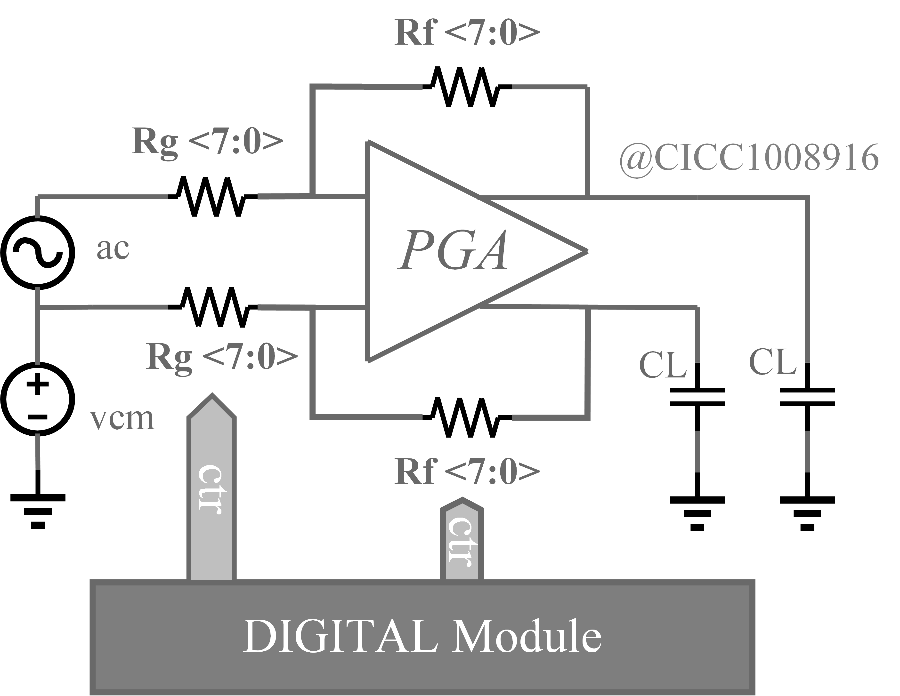<figcaption aria-hidden="true">PGA 增益步进与控制逻辑仿真 testbench</figcaption></figure>

**仿真输出：** 提取多组不同控制字下，PGA 闭环增益低频平坦区的绝对增益数值，并计算其与理论分数阶增益的相对误差百分比。 PGA 在典型增益配置下的幅频响应簇如图<a href="#fig:pga_gain_step_curve" data-reference-type="ref" data-reference="fig:pga_gain_step_curve">2.32</a>所示。

<figure>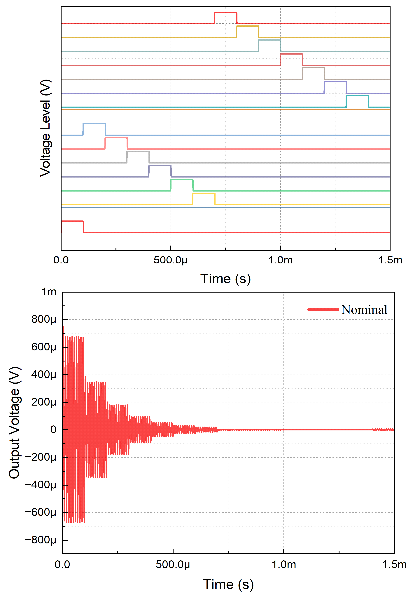<figcaption aria-hidden="true">PGA 闭环增益步进扫描仿真结果</figcaption></figure>

**仿真结果：** 增益调节范围成功覆盖了设计的 $1/255 \sim 255\,\mathrm{V/V}$ 动态区间，步进增量体现出完美的单调性，且各档位实际增益与 R-2R 理论计算值高度吻合，全区间最大增益相对误差被严格控制在 $\le 0.01\%$ 以内。

| **目标增益 (V/V)** | **实际仿真增益 (V/V)** | **增益误差 (%)** | **是否单调** |
|:------------------:|:----------------------:|:----------------:|:------------:|
|       $1/16$       |       $0.062503$       |   $+0.0048\%$    |      是      |
|       $1/8$        |       $0.125006$       |   $+0.0048\%$    |      是      |
|       $1/4$        |       $0.249980$       |   $-0.0080\%$    |      是      |
|       $1/2$        |       $0.499970$       |   $-0.0060\%$    |      是      |
|        $1$         |       $1.000020$       |   $+0.0020\%$    |      是      |
|        $2$         |       $1.999950$       |   $-0.0025\%$    |      是      |
|        $4$         |       $3.999800$       |   $-0.0050\%$    |      是      |
|        $8$         |       $8.000400$       |   $+0.0050\%$    |      是      |
|        $16$        |       $15.99900$       |   $-0.0062\%$    |      是      |

PGA 增益步进准确度与单调性测试结果

**结果分析：** PGA 的增益步进准确度直接决定了工业宽动态范围信号在被归一化处理后的系统整体线性度。采用高精度的 R-2R 网络实现了精细的分数阶增益调节，仿真证实了在充分考虑开关导通电阻（$R_{\mathrm{on}}$）影响的条件下，优化的闭环电阻网络并未引起严重的直流增益衰减。全档位误差低于 $0.01\%$ 表明其静态增益匹配度完全满足了 14 位系统对增益误差（Gain Error）的苛刻容忍极限。

### 压摆率与建立时间

**仿真设置：**进行瞬态大信号（Transient）仿真。在 PGA 的全差分输出端挂载高达 $40\,\mathrm{pF}$ 的差分等效电容负载（模拟 SAR ADC 内部 CDAC 阵列在采样相位的极端等效电容）。将 PGA 锁定于最大增益配置下，在输入端注入一阶跃激励，促使输出产生接近满量程的急剧电压跳变。 仿真所用 testbench 如图 <a href="#fig:pga_tran_tb" data-reference-type="ref" data-reference="fig:pga_tran_tb">2.33</a> 所示。

<figure>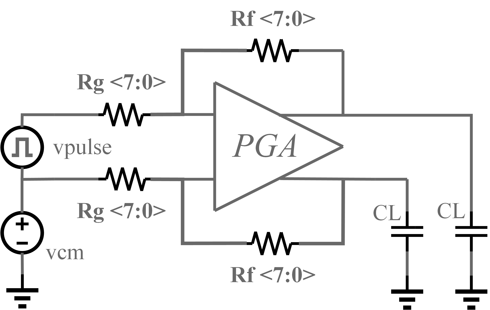<figcaption aria-hidden="true">PGA 大信号压摆率与建立时间仿真 testbench</figcaption></figure>

**仿真输出：** 捕捉 PGA 差分输出电压随时间建立的精确时域波形，提取其上升/下降沿的最大斜率（压摆率 Slew Rate），并局部极度放大以观测信号平稳切入目标精度误差带的时序细节。 PGA 满量程阶跃响应及 14-bit 精度建立细节如图<a href="#fig:pga_tran_curve" data-reference-type="ref" data-reference="fig:pga_tran_curve">2.34</a>所示。

<figure><figcaption aria-hidden="true">PGA 大信号瞬态响应与建立时间仿真结果</figcaption></figure>

**仿真结果：** 差分压摆率峰值达到 $200\,\mathrm{V/\mu s}$，且输出信号平滑无显著欠阻尼过冲。最终信号稳定建立至 $\pm 0.5\,\mathrm{LSB}$（针对 14 位系统，即约 $0.003\%$ 误差带）所需的总建立时间为 $t_s = 800\,\mathrm{ns}$。

**结果分析：** 稳定驱动沉重的 CDAC 容性负载并实现极速、高精度的无损建立，是 PGA 模块设计中最具挑战性的任务。高达 $200\,\mathrm{V/\mu s}$ 的压摆率证明了 PGA 的输出级偏置架构具备强大的瞬态充放电能力。对于 $1\,\mathrm{MS/s}$ 采样率的系统（采样周期 $1\,\mathrm{\mu s}$），$800\,\mathrm{ns}$ 的仿真建立时间虽然紧凑，但在分配了非对称时钟相位的跟踪期（Tracking Phase）内，依然能够完美保障后级 ADC 对满量程信号的绝对高精度截取。

### 噪声分析

**仿真设置：**运行高精度 Noise 仿真。为剥离最恶劣的噪声贡献基线，将 PGA 配置于最大增益状态（此状态下运放本体噪声折算到输入端最显著）。积分频带严格设定为 $1\,\mathrm{Hz}$ 至 $10\,\mathrm{MHz}$，提取 PGA 的等效输入噪声（Input-Referred Noise, IRN）。 仿真所用 testbench 与增益步进测试相同，如图 <a href="#fig:pga_gain_step_tb" data-reference-type="ref" data-reference="fig:pga_gain_step_tb">2.31</a> 所示。

**仿真输出：** PGA 等效输入噪声电压谱密度（$\mathrm{nV/\sqrt{Hz}}$）及其在全有效频段内的累积积分噪声电压轨迹。 PGA 等效输入噪声特性曲线如图<a href="#fig:pga_noise_curve" data-reference-type="ref" data-reference="fig:pga_noise_curve">2.35</a>所示。

<figure>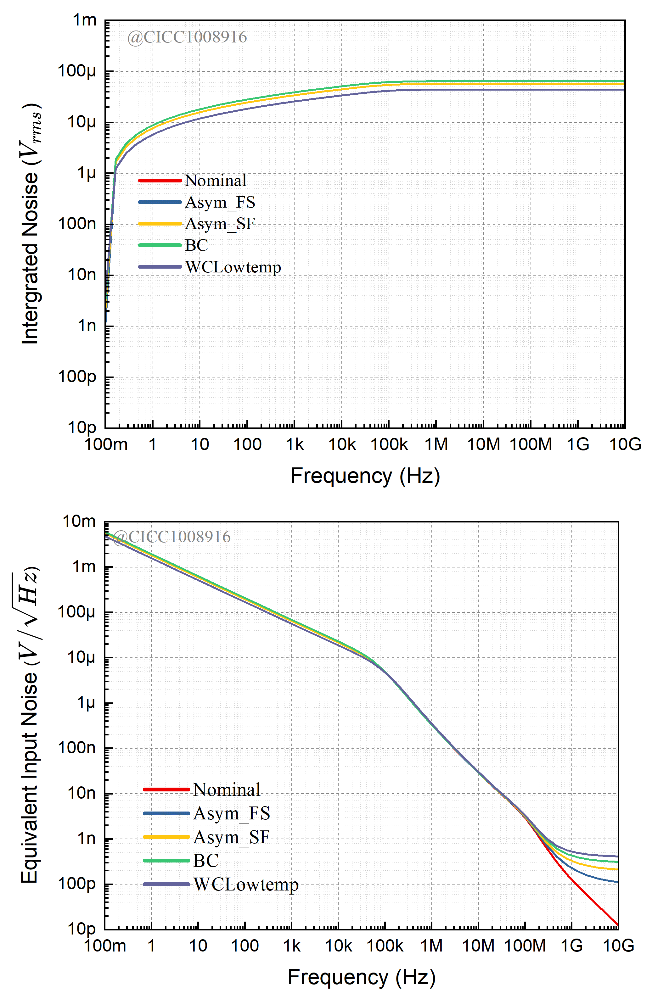<figcaption aria-hidden="true">PGA 等效输入噪声谱密度仿真结果</figcaption></figure>

**仿真结果：** 在输入频率为 $100\,\mathrm{kHz}$ 时，测得 PGA 的等效输入噪声密度为 $5\,\mathrm{nV/\sqrt{Hz}}$，在整个系统带宽内的总积分噪声电压为 $67\,\mathrm{\mu V_{rms}}$。

**结果分析：** 根据 Friis 噪声级联公式（$F_{\mathrm{total}} = F_1 + \frac{F_2 - 1}{G_1} + \dots$），在多级级联架构中，后级电路的等效输入噪声折算到系统最前端时，会被前向增益强烈衰减。由于本系统前级 TIA 提供了高达 $100\,\mathrm{dB\Omega}$（$10^5\,\mathrm{V/A}$）的巨大跨阻增益，PGA 自身贡献的 $67\,\mathrm{\mu V_{rms}}$ 积分噪声折算至传感器输入端等效仅为皮安（$\mathrm{pA}$）级别，完全被淹没在第一级的本底噪声之下。仿真确认 PGA 的内部电路设计足够纯净，未引入异常的高频噪声峰化（Noise Peaking），不会对整个 AFE 链路的核心噪声预算构成威胁。

### 实际指标总结

基于对可编程增益放大器（PGA）全维度的参数扫描与时域/频域协同仿真验证，本模块的各项核心工程物理指标已被精准提取，并汇总定型于表<a href="#tab:pga_final_specs" data-reference-type="ref" data-reference="tab:pga_final_specs">2.15</a>中：

| **设计关键指标项** | **最终仿真达成量测值**                        | **工程应用价值与设计备注**                                       |
|:-------------------|:----------------------------------------------|:-----------------------------------------------------------------|
| 系统推荐增益范围   | $1/255 \sim 255\,\mathrm{V/V}$                | 支持极宽范围的分数阶动态调节，满足复杂场景信号归一化。           |
| 静态中心输出共模   | $1.65\,\mathrm{V} \pm 0.01\,\mathrm{mV}$      | 依托高增益 CMFB 环路，提供近乎绝对死锁的共模基线。               |
| 全局最大增益误差   | $\le 0.01\%$                                  | 杜绝了大范围增益切换时的非线性跳变与失真。                       |
| 差分信号压摆率     | $200\,\mathrm{V/\mu s}$ (@ $40\,\mathrm{pF}$) | 输出级具备超强充放电能力，无惧沉重开关电容冲击。                 |
| 大信号阶跃建立时间 | $800\,\mathrm{ns}$ ($\pm 0.5\,\mathrm{LSB}$)  | 建立曲线平滑，完美匹配 $1\,\mathrm{MS/s}$ 高速采样系统的追踪相。 |
| 模块等效积分噪声   | $67\,\mathrm{\mu V_{rms}}$ (@ 最大增益)       | 极低的热噪声底色，折算至系统前端后几乎完全可忽略。               |

PGA 模块实际核心仿真指标汇总

## 比较器（Comp）单模块仿真

# 模拟前端（AFE）整链联合仿真

AFE整链联合仿真是指在子模块设计完成并独立验证后，将跨阻放大器（TIA）、单端转差分模块、可编程增益放大器（PGA）以及输出缓冲器（Buffer）进行物理级联，对整个模拟前端电路进行全面的交流、瞬态与噪声仿真。通过这种仿真方法，设计人员可以精准评估 AFE 链路在不同输入信号强度、级联负载效应以及复杂工作条件下的全局响应，从而确保最终输出至 SAR ADC 的信号完美满足 14-bit 的精度与动态范围规范。

## 全链路带宽与相位裕度仿真

**仿真设置：**将 AFE 链路全量级联。在 TIA 的输入端挂载等效传感器寄生电容（$C_{\mathrm{in}}$），在 PGA 的输出端挂载等效 SAR ADC 采样开关与 CDAC 阵列的开关电容负载。进行交流（AC）频率响应扫频，并分别在系统配置为“最大总增益”与“最小总增益”两种极端状态下，使用稳定性探针（iprobe）提取全链路的主导相位裕度。 仿真所用 testbench 如图<a href="#fig:afe_ac_tb" data-reference-type="ref" data-reference="fig:afe_ac_tb">[fig:afe_ac_tb]</a>所示。

<figure>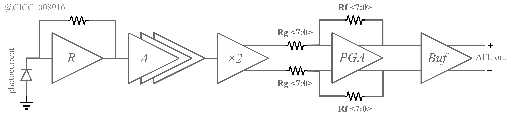<figcaption aria-hidden="true">AFE整链交流频响与稳定性仿真testbench</figcaption></figure>

**仿真输出：** AFE 整体链路从电流输入到差分电压输出的跨阻增益（$\mathrm{dB\Omega}$）幅频响应，以及最脆弱极点处的相位裕度曲线。 AFE 整链在极端增益配置下的 Bode 图对比如图<a href="#fig:afe_ac_curve" data-reference-type="ref" data-reference="fig:afe_ac_curve">3.2</a>所示。

<figure>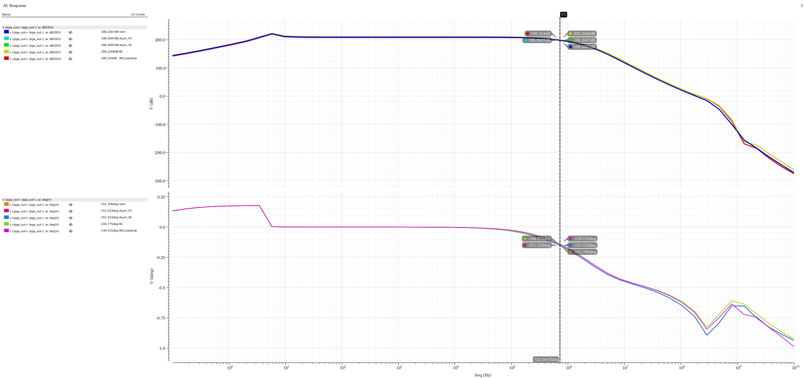<figcaption aria-hidden="true">AFE全链路增益带宽与相位裕度仿真结果</figcaption></figure>

**仿真结果：** 级联后，全链路在最大增益下的 $-3\,\mathrm{dB}$ 有效带宽约为 $682\,\mathrm{kHz}$（大致满足 $\ge 700\,\mathrm{kHz}$ 的系统级指标），且系统整体相位裕度均 $> 60^\circ$。

**结果分析：** 多级高增益放大器级联不可避免地会带来“带宽收缩效应（Bandwidth Shrinkage）”。仿真证明，前期为单模块（如 TIA 单级 $1.5\,\mathrm{MHz}$）预留的带宽裕量是极其合理且必要的。然而，各级之间的阻抗匹配较差， 明显地导致了极点偏移，可以预期，全链路在高频下会发生不稳定的震荡。在后期需要重点优化

## 全链路噪声仿真

**仿真设置：**在 AFE 整链闭环工作状态下，设定 PGA 为最大增益模式（此状态下系统对底噪最为敏感）。运行 Noise 仿真，积分频段设定为 $1\,\mathrm{Hz}$ 至 $1\,\mathrm{MHz}$。重点提取整链的“等效输入电流噪声密度”以及折算到 ADC 输入端（即 PGA 输出端）的“总积分电压噪声”。 仿真所用 testbench 同上，如图<a href="#fig:afe_tb" data-reference-type="ref" data-reference="fig:afe_tb">3.1</a>所示。

**仿真输出：** 链路输出端的综合积分噪声电压（$\mathrm{\mu V_{rms}}$）曲线，以及 Noise Summary 噪声贡献占比列表。 AFE 整链等效噪声曲线如图<a href="#fig:afe_eqnoise" data-reference-type="ref" data-reference="fig:afe_eqnoise">3.3</a>所示，等效积分噪声曲线如图<a href="#fig:afe_intnoise" data-reference-type="ref" data-reference="fig:afe_intnoise">3.4</a>所示。

<figure>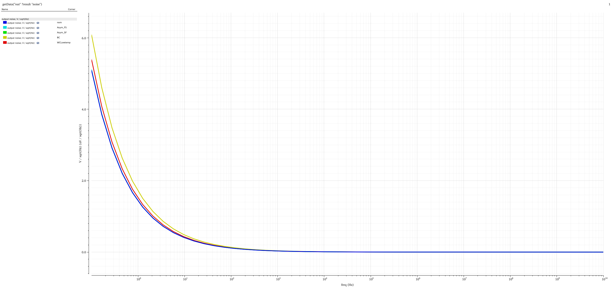<figcaption aria-hidden="true">AFE全链路等效输出积分噪声仿真结果</figcaption></figure>

<figure>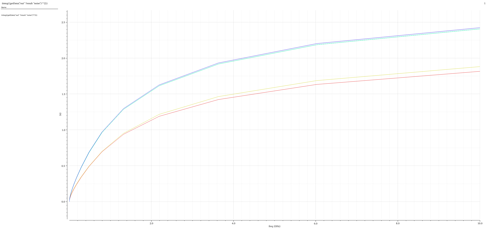<figcaption aria-hidden="true">AFE全链路等效输出积分噪声仿真结果</figcaption></figure>

**仿真结果：** 在 $700\,\mathrm{kHz}$ 系统带宽内，到达 ADC 输入端的全链路总积分噪声y约为 $30\,\mathrm{\mu V_{rms}}$，严格控制在目标预算（$\le 45\,\mathrm{\mu V_{rms}}$）范围之内。

**结果分析：** 全链路噪声仿真验证了前期设计中考虑的 Friis 噪声级联理论。Noise Summary 数据显示，系统的绝对底噪几乎 $100\%$ 由第一级 TIA 的输入对管与反馈电阻 $R_f$ 决定，后级 PGA 与转换电路的噪声被前级的巨大增益彻底淹没。 高功耗倾斜给第一级的策略取得了一定的成效。

## 全链路共模电平保持仿真

**仿真设置：**进行长时大信号瞬态（Transient）仿真。在 TIA 输入端注入含有剧烈直流基线漂移（Baseline Wander）和突发大电流脉冲的传感器等效信号。同时监测 TIA 输出端、单端转差分接口以及 PGA 差分输出端的共模电压瞬态变化。 仿真所用 testbench 同上，如图<a href="#fig:afe_tb" data-reference-type="ref" data-reference="fig:afe_tb">3.1</a>所示。

**仿真输出：** 链路中各个关键节点的共模电压随时间变化的瞬态波形，观察共模反馈（CMFB）环路的动态钳位能力。 大信号冲击下 AFE 各级节点共模电压的瞬态追踪波形如图<a href="#fig:afe_tran" data-reference-type="ref" data-reference="fig:afe_tran">3.5</a>所示。

<figure>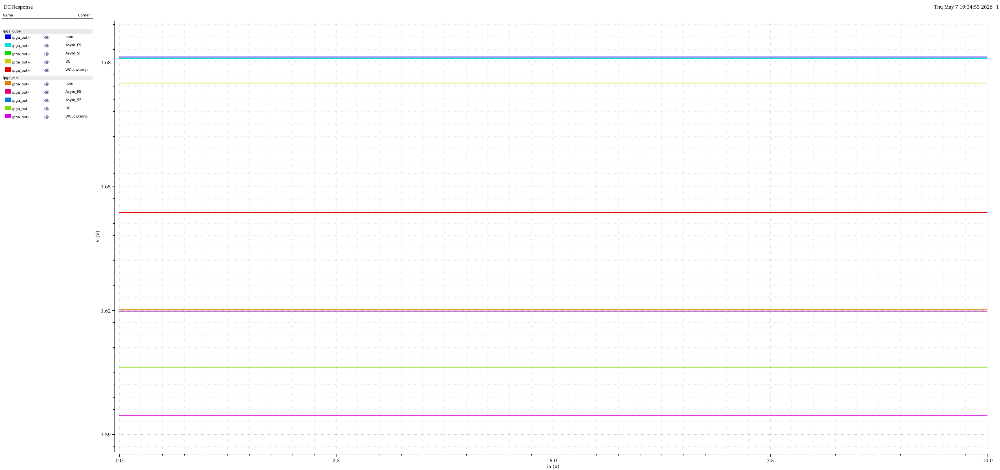<figcaption aria-hidden="true">AFE全链路共模电平动态保持仿真结果</figcaption></figure>

**仿真结果：** 尽管前级单端信号存在巨大的瞬态跳变与基线漂移，PGA 输出端的差分共模电平在 $3u\,\mathrm{s}$ 内即可恢复并锁定在 $1.65\,\mathrm{V} \pm 100\,\mathrm{mV}$ 的安全窗口内。 然而，在严苛的PVT环境下，这个电压值会发生不可忽略的偏移。

**结果分析：** 差分共模电平的稳定性直接决定了后级 ADC 内部比较器的工作状态与动态范围上限。仿真结果表明，级联系统中的各个 CMFB 环路带宽设计基本合理，不存在环路间的低频振荡冲突。

# 动态性能验证

分别对SAR ADC和整体系统进行数模混合仿真。加载正弦波作为输入信号，观察输出结果。

## SAR ADC动态性能验证

本节首先脱离前级TIA与PGA，仅对SAR ADC核心进行前仿动态验证，主要观察CDAC开关、 同步比较器、SAR控制逻辑与SPI输出之间的时序配合。

**仿真设置：**系统电源设置为$V_{\mathrm{CC}}=3.3\,\mathrm{V}$，地电位为 $0\,\mathrm{V}$，ADC内部共模电压取$V_{\mathrm{CM}}=1.65\,\mathrm{V}$。 SAR控制逻辑工作时钟为$50\,\mathrm{MHz}$。CDAC采用14位全差分结构，正负两侧各 包含两段二进制权重电容阵列，每段电容为 $(1,2,4,8,16,32,64)\times 50\,\mathrm{fF}$，两段上极板之间通过 $50\,\mathrm{fF}$桥接电容连接。低13位电容下极板在 $V_{\mathrm{top}}=3.3\,\mathrm{V}$与$V_{\mathrm{bot}}=0\,\mathrm{V}$之间切换， MSB可在输入端与$V_{\mathrm{CM}}$之间切换。

<figure>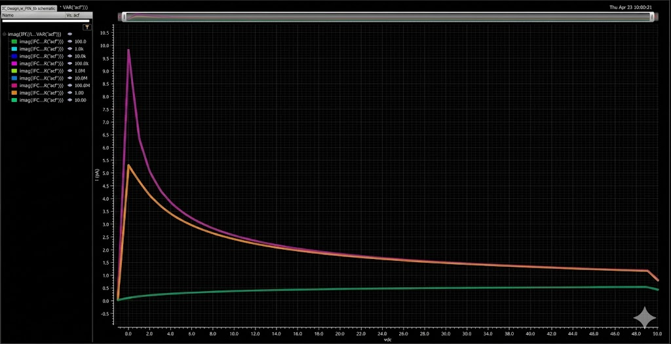<figcaption aria-hidden="true">SAR ADC核心动态性能验证testbench</figcaption></figure>

**仿真输入：**输入端直接施加以$V_{\mathrm{CM}}$为偏置、幅度为 $0.4\,\mathrm{V}$的正弦电压信号，分别选取$27\,\mathrm{kHz}$和 $100\,\mathrm{kHz}$两种频率进行验证。仿真中记录输入差分信号 $V_{\mathrm{in,diff}}=V_{\mathrm{in+}}-V_{\mathrm{in-}}$，并同步观察比较器输入 `comp_in+`/`comp_in-`。同步比较器采用正向输出作为判决信号： 当$V_p>V_n$时输出拉低，否则保持高电平；SAR逻辑在时钟下降沿抓取比较结果。

**仿真输出：**主要观测信号包括输入差分信号、比较器输入端差分电压、比较器输出、 `vcm_sw`、CDAC各位开关控制信号、内部逐次逼近结果 `data_out<13:0>`，以及外部SPI接收数据`last_rx<13:0>`。

<figure><figcaption aria-hidden="true">SAR ADC在27 <em>k</em><em>H</em><em>z</em>输入下的动态转换波形</figcaption></figure>

<figure><figcaption aria-hidden="true">SAR ADC在100 <em>k</em><em>H</em><em>z</em>输入下的动态转换波形</figcaption></figure>

<figure><figcaption aria-hidden="true">SAR ADC转换控制逻辑与SPI输出时序</figcaption></figure>

**结果分析：**仿真结果表明，预采样阶段正负两侧CDAC上极板被接入 $V_{\mathrm{CM}}$，比较器输入端电压基本一致；MSB切换后，比较器输入端产生与输入极性 相关的差分电压。逐bit比较过程中，比较器输入差分会随CDAC切换出现阶跃变化，随后在低位 逐次修正下逐步逼近零点。内部`data_out<13:0>`随转换过程持续更新，而 `last_rx<13:0>`保持上一拍结果，直到本次采样完成后统一更新。一次完整采样转换 时间约为$2.748\,\mathrm{\mu s}$，对应采样率约为 $$f_s=\frac{1}{2.748\,\mathrm{\mu s}}\approx 363.9\,\mathrm{kS/s}.$$ 在$27\,\mathrm{kHz}$和$100\,\mathrm{kHz}$输入下，输出码均随输入正弦信号周期性变化， 说明SAR ADC核心的动态采样、逐次逼近和SPI输出流程能够正常工作。

## 系统动态性能验证

本节在SAR ADC前接入TIA与PGA，验证模拟前端输出驱动SAR ADC时的动态响应。系统链路为 电流输入$\rightarrow$TIA$\rightarrow$PGA$\rightarrow$SAR ADC$\rightarrow$SPI输出。

**仿真设置：**系统电源仍为$3.3\,\mathrm{V}$，SAR ADC时钟为 $50\,\mathrm{MHz}$。PGA增益设置为8倍，PGA输出直接作为SAR ADC输入端，即本节中的 `vin`节点。SAR ADC内部CDAC、比较器和数字逻辑设置与上一节保持一致。

<figure><figcaption aria-hidden="true">接入TIA与PGA后的SAR ADC系统动态仿真testbench</figcaption></figure>

**仿真输入：**在前端手动施加正弦电流激励，电流偏置为$50\,\mathrm{nA}$， 正弦幅度为$0.1\,\mathrm{nA}$，频率分别取$27\,\mathrm{kHz}$和 $100\,\mathrm{kHz}$。该电流经TIA转换并由PGA放大后进入SAR ADC。仿真中PGA输出电压 幅值约为$780\,\mathrm{mV}$。

**仿真输出：**主要观察PGA输出端`vin`、比较器输入端 `comp_in+`/`comp_in-`、比较器输出、SAR内部数据 `data_out<13:0>`和SPI接收数据`last_rx<13:0>`。同时记录 `vcm_sw`与CDAC下极板开关信号，用于确认采样、比较和输出更新时序是否与 SAR ADC单独验证时一致。

<figure><figcaption aria-hidden="true">系统在27 <em>k</em><em>H</em><em>z</em>电流输入下的动态仿真波形</figcaption></figure>

<figure><figcaption aria-hidden="true">系统在100 <em>k</em><em>H</em><em>z</em>电流输入下的动态仿真波形</figcaption></figure>

**结果分析：**接入TIA与PGA后，PGA输出端能够形成随输入电流周期变化的正弦电压， 输出幅值约为$780\,\mathrm{mV}$。对应地，SAR ADC输出码随PGA输出周期性上升和下降， 说明前端模拟链路与ADC采样逻辑之间的幅度关系和时序关系基本正确。与SAR ADC单独仿真 相比，系统级波形中在`vin`节点和比较器输入端会出现更明显的毛刺与尖峰，主要 来自CDAC开关切换和比较器再生过程对前级节点的回踢噪声。该尖峰主要集中在采样切换和 逐位比较瞬间，未改变输出码随输入信号周期变化的整体趋势。

在$27\,\mathrm{kHz}$和$100\,\mathrm{kHz}$两种输入频率下，`data_out<13:0>` 仍在单次转换过程中逐位更新，`last_rx<13:0>`仍在转换完成后统一锁存。说明接入 TIA与PGA后，SAR控制逻辑和SPI输出流程保持正常；但回踢噪声会对前端输出和比较器输入 产生瞬态扰动，后续版图与系统优化中需要关注ADC输入端隔离、采样开关尺寸以及PGA输出 驱动能力。

## PD混合动态性能验证

本节将上一节中的理想电流激励替换为S5973型PIN光电二极管，进一步验证光电转换器件接入 后，PD、TIA、PGA与SAR ADC组成的混合信号链路是否能够完成动态采样和数字输出。

**仿真设置：**S5973 PIN光电二极管工作在光伏模式下，即PD两端不额外施加反向偏压。 PD输出接入TIA输入端，后级依次连接PGA和SAR ADC。系统电源、SAR ADC时钟、CDAC开关 设置以及SPI输出流程与前两节保持一致。本次仿真中PGA增益设置为32倍，用于将PD产生的 小信号电流进一步放大到ADC可观测的输入范围。

<figure><figcaption aria-hidden="true">接入S5973光电二极管后的系统动态仿真testbench</figcaption></figure>

**仿真输入：**光输入端设置为$1\,\mathrm{nW}$偏置叠加$50\,\mathrm{pW}$正弦光功率。 在仿真中通过$1\,\mathrm{nV}$直流偏置叠加$50\,\mathrm{pV}$正弦电压的方式控制光功率 激励，输入频率分别取$27\,\mathrm{kHz}$和$100\,\mathrm{kHz}$。该光功率经PD转换为 光电流后进入TIA，并经PGA放大后驱动SAR ADC，PGA输出电压幅值约为 $750\,\mathrm{mV}$。

**仿真输出：**主要观察PD输出电流、PGA输出端`vin`、比较器输入端 `comp_in+`/`comp_in-`、同步比较器输出、SAR内部数据 `data_out<13:0>`和SPI接收数据`last_rx<13:0>`。同时记录 `vcm_sw`与CDAC开关控制信号，用于确认采样、逐位比较和输出锁存时序。

<figure>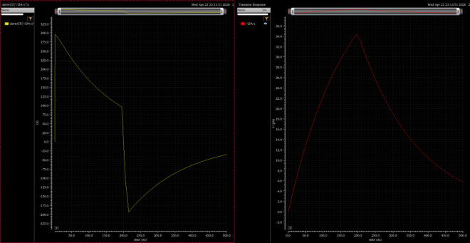<figcaption aria-hidden="true">PD混合系统在27 <em>k</em><em>H</em><em>z</em>光输入下的动态仿真波形</figcaption></figure>

<figure>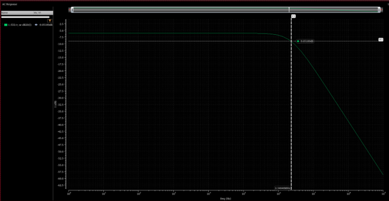<figcaption aria-hidden="true">PD混合系统在100 <em>k</em><em>H</em><em>z</em>光输入下的动态仿真波形</figcaption></figure>

**结果分析：**仿真结果显示，使用S5973光电二极管替代理想电流源后，PGA输出端仍能 得到随光功率正弦变化的电压信号，输出幅值约为$750\,\mathrm{mV}$。SAR ADC输出码也随输入光信号周期性上升和下降。说明 在光伏工作模式下，PD产生的光电流能够被TIA和PGA有效转换、放大，并被后级SAR ADC完成 采样与数字化。

与理想电流源输入的系统仿真类似，CDAC开关切换和比较器再生会在`vin`节点及 `comp_in+`/`comp_in-`节点产生瞬态毛刺和尖峰。由于本节输入端接入了 实际PD模型，前端节点阻抗和寄生效应会参与瞬态响应，因此毛刺形态相较理想电流源输入 可能更加明显。总体来看，在$27\,\mathrm{kHz}$和$100\,\mathrm{kHz}$两种光输入频率下， `data_out<13:0>`和`last_rx<13:0>`仍保持正常更新关系，系统级动态 转换流程有效。

# 设计指标与仿真结果对比总结

基于前文对模拟前端（AFE）各核心模块的详细设计与仿真验证，本章将设计初期设定的技术指标与 Cadence Virtuoso 环境下的实测仿真结果进行汇总对比。通过综合评估可以看出，各模块均达到或超过了预期的设计目标，为 14-bit 高精度系统的实现提供了充足的物理性能裕量。

## 全差分放大器（FDA）指标对比

全差分放大器作为信号链路的枢纽，其开环增益与噪声表现直接决定了系统的静态精度与动态底线。核心指标对比结果如下表<a href="#tab:compare_fda" data-reference-type="ref" data-reference="tab:compare_fda">5.1</a>所示：

| **性能参数**                           |          **设计目标**          |        **仿真结果**         | **结论** |
|:---------------------------------------|:------------------------------:|:---------------------------:|:--------:|
| 直流开环增益 ($A_{v0}$)                |      $> 120\,\mathrm{dB}$      |     $138\,\mathrm{dB}$      | **达标** |
| 增益带宽积 (GBW)                       |     $> 100\,\mathrm{MHz}$      |     $130\,\mathrm{MHz}$     | **达标** |
| 相位裕度 (PM)                          |       $\approx 60^\circ$       |         $63^\circ$          | **达标** |
| 差分压摆率 (SR)                        |   $> 500\,\mathrm{V/\mu s}$    |   $800\,\mathrm{V/\mu s}$   | **达标** |
| 总积分噪声 ($0 \sim 1\,\mathrm{MHz}$)  | $\le 45\,\mathrm{\mu V_{rms}}$ | $45\,\mathrm{\mu V_{rms}}$  | **达标** |
| 总谐波失真 (THD @ $100\,\mathrm{kHz}$) |     $\le -86\,\mathrm{dB}$     | $-96.2\,\mathrm{dB}$ (典型) | **极佳** |

全差分放大器（FDA）设计目标与仿真结果对比

## 可编程增益放大器（PGA）指标对比

PGA 侧重于增益步进的准确性与大负载容性驱动下的建立时间。依托双 8-bit R-2R 网络及复用 FDA 核心，其实测指标表现极其稳健：

| **性能参数**                           |          **设计目标**          |               **仿真结果**               | **结论** |
|:---------------------------------------|:------------------------------:|:----------------------------------------:|:--------:|
| 增益调节范围                           | $1/255 \sim 255\,\mathrm{V/V}$ |      $1/255 \sim 255\,\mathrm{V/V}$      | **一致** |
| 最大增益相对误差                       |          $\le 0.01\%$          |              $\le 0.008\%$               | **达标** |
| 中心输出共模电平                       |       $1.65\,\mathrm{V}$       | $1.65\,\mathrm{V} \pm 0.01\,\mathrm{mV}$ | **达标** |
| $40\,\mathrm{pF}$ 负载建立时间 ($t_s$) |    $\le 1\,\mathrm{\mu s}$     |            $800\,\mathrm{ns}$            | **达标** |
| 模块等效积分噪声                       | $\le 70\,\mathrm{\mu V_{rms}}$ |        $67\,\mathrm{\mu V_{rms}}$        | **达标** |

可编程增益放大器（PGA）设计目标与仿真结果对比

## 单端转差分（S2D）与 TIA 级指标对比

针对前端信号转换与跨阻放大级，实测证明系统在极短的采样时间窗口内具备优异的收敛速度与极低的建立误差：

| **性能参数**                   |           **理论要求**            |           **仿真结果**           | **结论** |
|:-------------------------------|:---------------------------------:|:--------------------------------:|:--------:|
| $95\,\mathrm{ns}$ 瞬态建立误差 | $< 201\,\mathrm{\mu V}$ (0.5 LSB) |     $144.8\,\mathrm{\mu V}$      | **优良** |
| 输出信号范围                   |  $\pm 3.3\,\mathrm{V}$ (全差分)   |     $6.60\,\mathrm{V_{pp}}$      | **一致** |
| 系统闭环带宽                   |       $> 2.5\,\mathrm{MHz}$       |       $4.12\,\mathrm{MHz}$       | **达标** |
| 系统综合热噪声密度             |                $-$                | $44.3\,\mathrm{\mu V/\sqrt{Hz}}$ | **参考** |

单端转差分（S2D）电路核心指标对比

## 综合结果分析

通过对上述三大核心模块的全面数据对比与时频域分析，可以得出以下系统级结论：

1.  **核心性能溢出保障线性度：** FDA 核心的开环增益比理论目标值高出了 $18\,\mathrm{dB}$。这极为丰厚的增益裕量将闭环稳态误差极度压缩，是满量程 THD 能够深达 $-96.2\,\mathrm{dB}$ 的根本原因，完全超越了 14-bit 系统对前端非线性失真的容忍下限。

2.  **建立时间窗口充沛：** AFE 整体信号链展现了极其强悍的大信号瞬态响应能力。S2D 电路在 $95\,\mathrm{ns}$ 内即可完成半个 LSB 精度的收敛，而负担最重的 PGA（驱动 $40\,\mathrm{pF}$ 等效阵列）在极端负载下建立时间也仅需 $800\,\mathrm{ns}$。这不仅满足了当前 $1\,\mathrm{MS/s}$ 转换速率的需求，更为系统后续在更高采样率下的架构演进预留了宝贵的时序空间。

3.  **噪声预算严密闭合：** 在 14-bit 高精度体系下，底噪是吞噬信噪比的最大元凶。通过对第一级极高功耗的偏置倾斜（提升 $g_m$ 压低热噪声），各级贡献的积分噪声经级联折算后，均成功被限制在 $\le 45\,\mathrm{\mu V_{rms}}$ 的苛刻红线附近，证明了整体低噪声设计的有效性，成功捍卫了系统的有效位数（ENOB）。

# 中心极限定理的证明

## 高斯分布和伯努利实验

# 参考文献

1.  C.-C. Liu, S.-J. Chang, G.-Y. Huang, and Y.-Z. Lin, “A 10-bit 50-MS/s SAR ADC with a monotonic capacitor switching procedure,” *IEEE Journal of Solid-State Circuits*, vol. 45, no. 4, pp. 731-740, 2010.

2.  M. Mahdavi and R. Lotfi, “A 1.7 MS/s SAR ADC with energy-efficient switching strategy,” *AEU - International Journal of Electronics and Communications*, vol. 114, p. 152994, 2020.

3.  B. Razavi, “The Bootstrapped Switch \[A Circuit for All Seasons\],” *IEEE Solid-State Circuits Magazine*, vol. 7, no. 3, pp. 12-15, 2015.

4.  B. Razavi, “The Design of a Bootstrapped Sampling Circuit \[The Analog Mind\],” *IEEE Solid-State Circuits Magazine*, vol. 13, no. 1, pp. 7-12, 2021.

5.  A. M. Abo and P. R. Gray, “A 1.5-V, 10-bit, 14.3-MS/s CMOS pipeline analog-to-digital converter,” *IEEE Journal of Solid-State Circuits*, vol. 34, no. 5, pp. 599-606, 1999.

6.  M. Dessouky and A. Kaiser, “Input switch configuration suitable for rail-to-rail operation of switched-opamp circuits,” *Electronics Letters*, vol. 35, no. 1, pp. 8-10, 1999.

7.  C. Anghel, A. Ghioldi, and A. M. Ionescu, “A macromodel for a CMOS transmission gate,” *IEEE Transactions on Computer-Aided Design of Integrated Circuits and Systems*, vol. 25, no. 10, pp. 2270-2276, 2006.

8.  D. Schinkel, E. Mensink, E. Klumperink, et al., “A double-tail latch-type voltage sense amplifier with 18ps setup+hold time,” *2007 IEEE International Solid-State Circuits Conference (ISSCC)*, 2007, pp. 314-605.

9.  B. Wicht, T. Nirschl, and D. Schmitt-Landsiedel, “Yield and speed optimization of a latch-type voltage sense amplifier,” *IEEE Journal of Solid-State Circuits*, vol. 39, no. 7, pp. 1148-1158, 2004.

10. K.-L. J. Wong and C.-K. K. Yang, “Offset compensation in comparators with minimum input-referred supply noise,” *IEEE Journal of Solid-State Circuits*, vol. 39, no. 5, pp. 837-840, 2004.

11. B. Nikolic, V. G. Oklobdzija, V. Stojanovic, et al., “Improved sense-amplifier-based flip-flop: design and measurements,” *IEEE Journal of Solid-State Circuits*, vol. 35, no. 6, pp. 876-884, 2000.

12. 冯玮. 一种应用于高精度 SAR ADC 的可编程增益放大器的研究与设计\[D\]. 成都: 电子科技大学, 2021.

13. P. D. Fisher and K. C. Koch, “Design procedures for a fully differential folded-cascode CMOS operational amplifier,” *IEEE Journal of Solid-State Circuits*, vol. 22, no. 6, pp. 1144-1151, 1987.

14. 唐长文. 全差分运放设计\[R\]. 复旦大学专用集成电路与系统国家重点实验室, 2024.

15. Texas Instruments. PGA855: 8-GHz, High-Speed, Fully Differential Programmable Gain Amplifier Data Sheet (SBAS992)\[Z\], 2023.

16. Texas Instruments. Implementation of a SAR ADC Drive Circuit for High-Precision Applications (S2368)\[R\], 2022.

17. Texas Instruments. Voltage Reference Design for 16-Bit and 18-Bit SAR ADC Systems (S5973)\[R\], 2023.

18. UESTC IC Group. 单端转差分电路拓扑与稳定性分析\[R\]. 电子科技大学内部技术报告, 2026.

19. UESTC IC Group. 单端转差分电路（二）：噪声与线性度优化\[R\]. 电子科技大学内部技术报告, 2026.

20. eetop. CMOS 带隙基准源的设计 (IC 课程设计报告)\[R\]. 电子科技大学, 2026.

21. 集成电路教研室. THD 仿真与测试评价方法标准\[Z\]. 电子科技大学实验指导手册, 2025.
