# Circuit Analysis and Hand Calculation

In this design, we choose the simplest bandgap circuit topology.

<figure>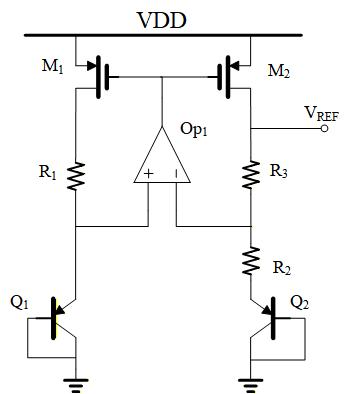<figcaption aria-hidden="true">Bandgap Circuit Topology</figcaption></figure>

In this topology, the output voltage is defined by $V_{BE2}$, the number of $Q_2$, and the ratio of $R_2$ and $R_3$. $R_1 = R_3$ is selected to make the current of each branch equal.

The Op. Amp. used in this design is based on the we designed in $REPORT 1$, which has a self-biased current source.

Taken offset coltage into acount, the output reference voltage is defined as follows: 

$$\begin{aligned}
    V_{out}=V_{BE2}+\left(1+\frac{R_3}{R_2}\right)(V_T\ln n-V_{OS})\\
  V_{T}=kT/q,  k/q \approx 0.087mV/K\\
  V_T\ln n = I_dR_2\end{aligned}$$

In order to make $\frac{\partial V_{out}}{\partial T} = 0$, The following equation needs to be satisfied: $$\begin{aligned}
    \frac{\partial V_{BE2}}{\partial T} + \frac{k}{q}\left(1+\frac{R_2}{R_3}\right) \ln n = 0\end{aligned}$$

The Temperature Coefficient of a pnp transistor can be obtained by scaning a diode connected pnp transistor,. The circuit is shown in Figure [1-2](#fig:pnp-scan):

<figure>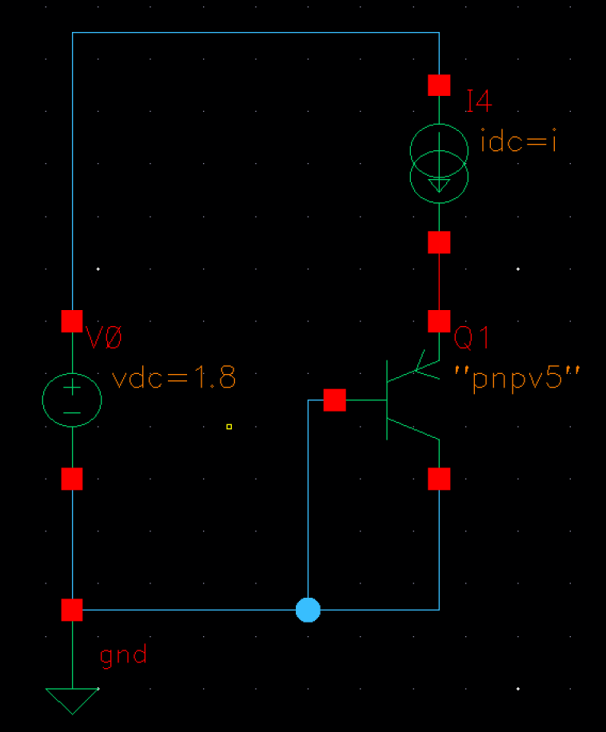<figcaption aria-hidden="true">Pnp Scan Circuit</figcaption></figure>

with a constant current $I_{C} = 10\mu A$, the TC of pnp from 0 to 100°C is shown in Figure [1-3](#fig:pnp-TC):

<figure>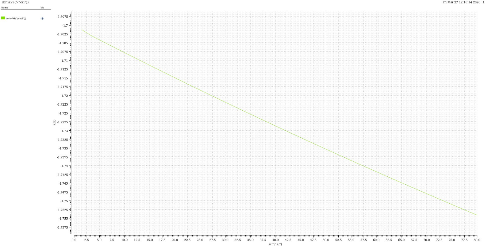<figcaption aria-hidden="true">$\frac{\partial V_{BE2}}{\partial T}$ - <em>T</em> Curve</figcaption></figure>

At 300K, the TC of pnp is approximately $$\begin{aligned}
    \frac{\partial V_{BE2}}{\partial T} \approx -1.72mV/K\end{aligned}$$

if we select the current, number of $Q_2$ and the overdrive of $M_1, M_2$ as follows: $$\begin{aligned}
    I_d = 10\mu A\\
  n = 3 \\
  V_{OD} = 0.1V\end{aligned}$$

Then the following parameters can be obtained: $$\begin{aligned}
    R_2 = \frac{V_T\ln n}{I_d} = 2.867k\Omega \\
  R_3 \approx 18R_2 = 51.6k\Omega \\
  (\frac{W}{L})_{1}=(\frac{W}{L})_{2}=\frac{2I_{d}}{\mu_{p}C_{ox}V_{OD}^{2}}=\frac{34.1\mu m}{1\mu m}\end{aligned}$$

All the parameters are listed as follows:

| Param             |       Hand Calculation Value       |
|:------------------|:----------------------------------:|
| $R_1$             |       $51.6\,\text{k}\Omega$       |
| $R_2$             |      $2.867\,\text{k}\Omega$       |
| $R_2$             |       $51.6\,\text{k}\Omega$       |
| $n$               |                $3$                 |
| $(\frac{W}{L})_1$ | $34.1\,\mu\text{m}/1\,\mu\text{m}$ |
| $(\frac{W}{L})_2$ | $34.1\,\mu\text{m}/1\,\mu\text{m}$ |

Hand Calculation Parameters

# Simulation and Results

## Basic Simulation

The circuit is supplied with a 1.8 V power supply, and the reference voltage output obtained by sweeping the temperature from 0 to 80 °C is as follows.

<figure>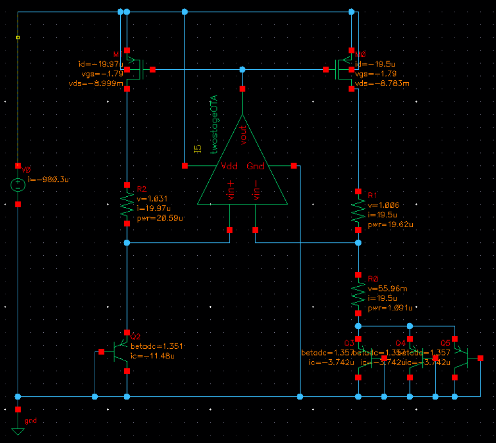</figure>

<figure>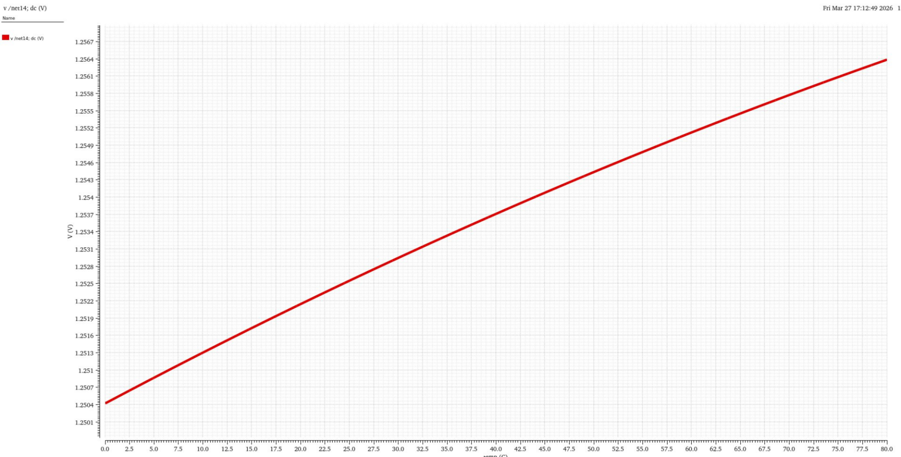</figure>

Observing that the output voltage is around $1.25V$ and is almost constant, the circuit is working as expected.

## Power Consumption Reduction

Before performing more precise adjustment, the power problem should be solved first.

The op. amp. used in this design has excellent frequency response, which is not required in the bandgap circuit. Infact, the close-loop DC system can work as expected, As long as the input CM range includes the range of $V_{BE}$, and the phase margin is adequate.

Therefore, the "Scaling Principle" is applied to reduce the power consumption. By reduce the length of every mosfet by 10. the power consumption is reduced considerably in theory.

Before replace the op. amp. in the circuit, test for phase margin and ICMR is necessary.

The test on phase margin is shown in Figure [2-2](#fig:phase-margin):

<figure>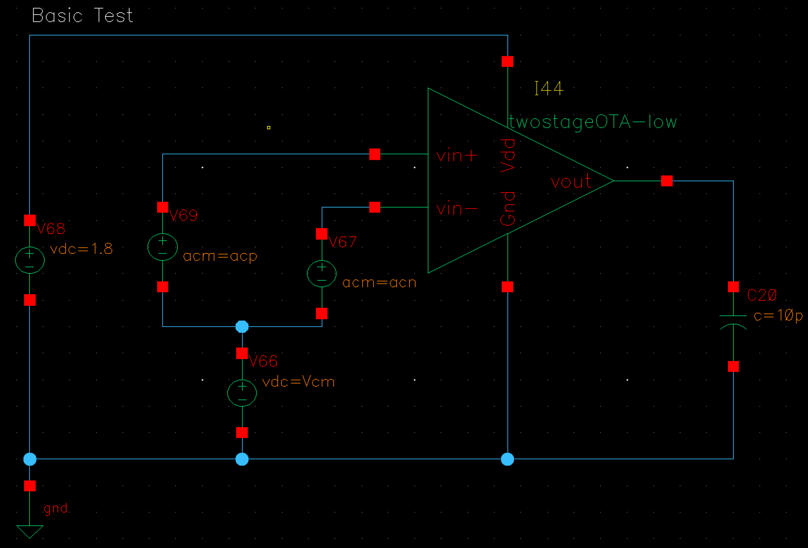</figure>

<figure>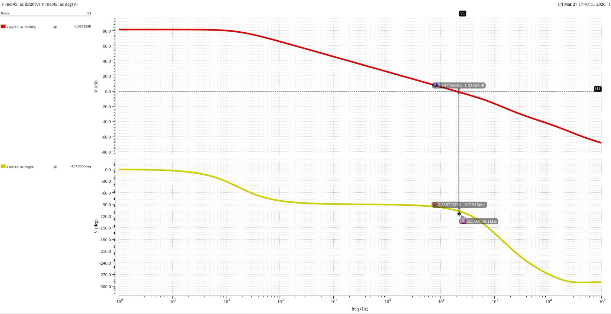</figure>

The gain at low frequency is more than 80dB, and the phase margin is about 70°. The requirement is meet well.

The test on ICMR is shown in Figure [2-3](#fig:ICMR):

<figure>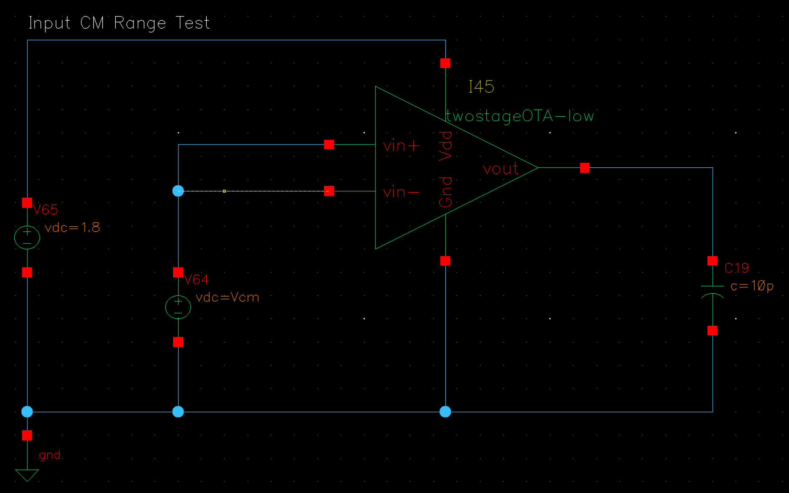</figure>

<figure>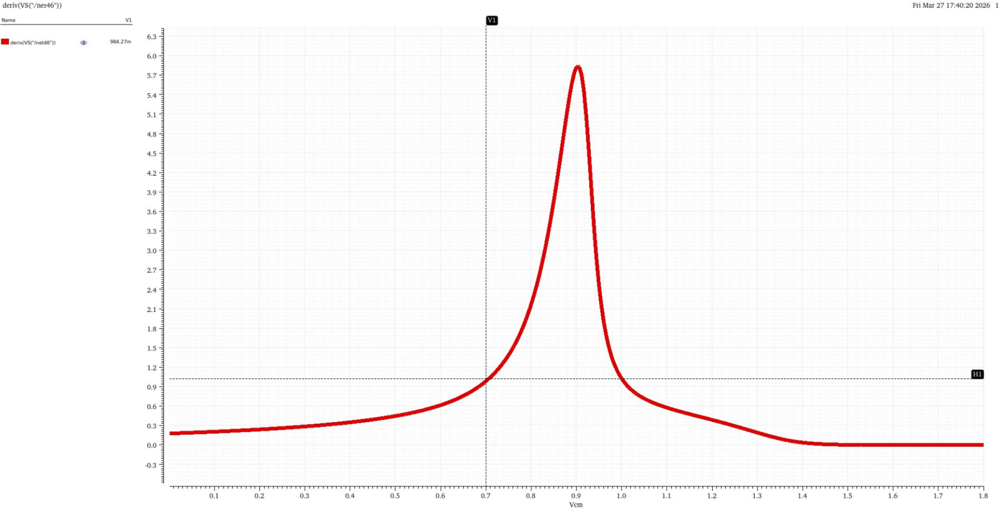</figure>

The figure shows $\frac{\partial V_{out}}{\partial V_{in}}$ curve, which shows that the ICMR of the Amp. is significantly reduced. However, at the operating point around $V_{BE}$(about 0.7V), the $\frac{\partial V_{out}}{\partial V_{in}}\approx 1$, thus it can be considered suitable for pur need.

More precise adjustments will be performed next.

## Precise Voltage Adjustment

According to [1-1](#eq:out-voltage), the output voltage can be adjusted by changing the value of $R_2$. Scan the value of $R_2$ from $2.8k\Omega$ to $3.1k\Omega$, and the output voltage is shown in Figure [2-4](#fig:resscan).

<figure>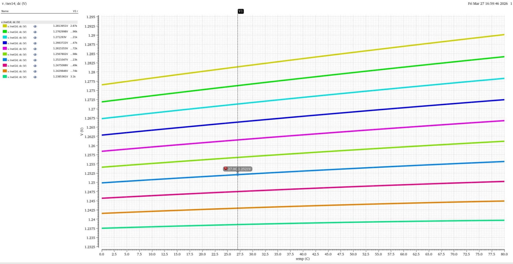<figcaption aria-hidden="true"><em>R</em>2 Scan Curve</figcaption></figure>

From the curve, $R_2 = 3.02K\Omega$ is the best choice for a $V_{REF} = 1.25V$

# Co-simulation With The Two-Stage OTA

## Generation of The $I_{REF}$

The reference current $I_{REF}$ is generated by the reference voltage $V_{REF}$ through the topology shown in Figure [3-1](#fig:i_generate).

<figure>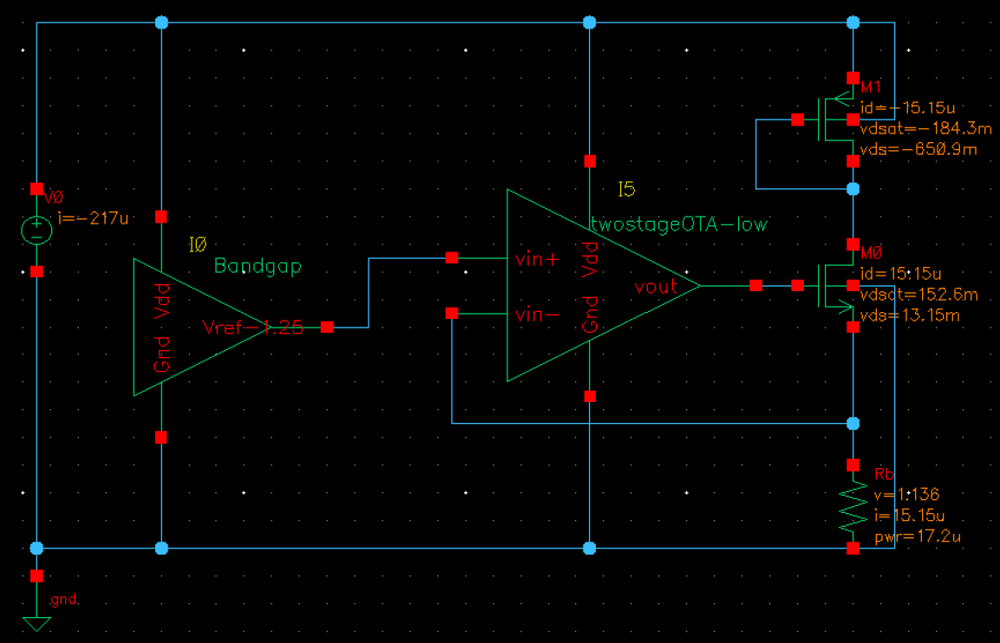<figcaption aria-hidden="true"><em>I</em><em>R</em><em>E</em><em>F</em> Generation Topology</figcaption></figure>

The dimension of $M_1$ and $M_0$ is selected the same as that in the bias circuit in $REPORT1$ for better matching. $$\begin{aligned}
  (\frac{W}{L})_{1}=\frac{10.24\mu m}{0.8\mu m} \\
  (\frac{W}{L})_{0}=\frac{40\mu m}{1.5\mu m}\end{aligned}$$

The low-voltage amp. we got in the previous part is connected in negative feedback, and act as a "buffer".

In order to get a $I_{REF} = 15 \mu A$, the value of resistor $R_2$ is calculated as follows: $$\begin{aligned}
  R_2 = \frac{V_{REF}}{I_{REF}} = \approx 8.333K\Omega\end{aligned}$$

## Temperature Drift Coefficient

By sweeping the temperature from 0 to 80 °C, the temperature drift coefficient can be obtained through the curve shown in Figure [3-2](#fig:tdc).

<figure>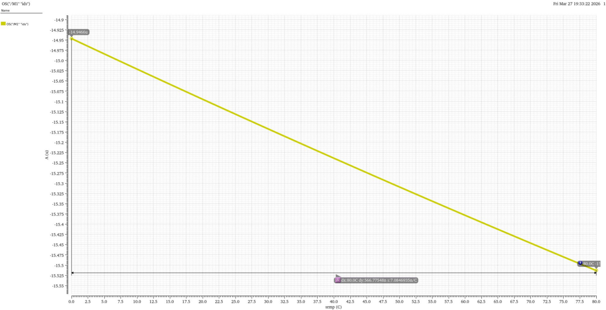<figcaption aria-hidden="true"><em>I</em><em>R</em><em>E</em><em>F</em> vs <em>T</em> Curve</figcaption></figure>

the temperature drift coefficient is as follows: $$\begin{aligned}
  tds = \frac{\Delta I_{REF}}{\Delta T \cdot I_{REF}} = \approx 0.2\%\end{aligned}$$

## Complement Two-Stage OTA Design

With the $I_{REF}$ we’ve got, the complementary two-stage OTA design can be performed as shown in Figure [3-3](#fig:complementota).

<figure>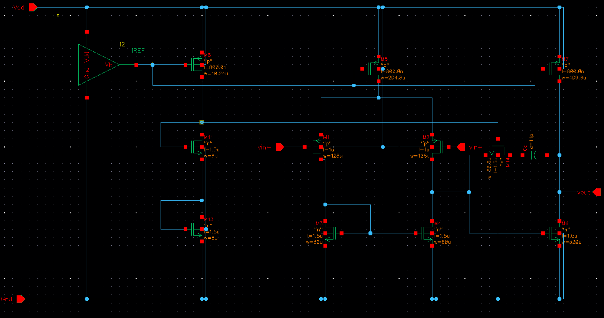<figcaption aria-hidden="true">Complement Two-Stage OTA Design</figcaption></figure>

The same tests as those in $REPORT1$ were performed on the complete two-stage op-amp, and the following specifications were obtained (with the same testbench as in $REPORT1$). The curve for each specification is shown in the following sections, and the result is listed in $Chapter 4$

### GBW, Open-Loop Gain and Phase Margin

<figure>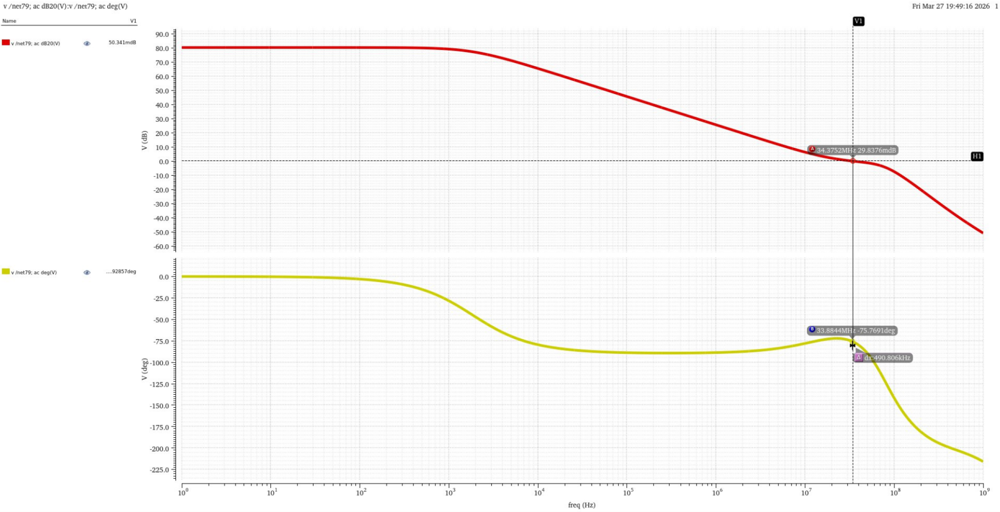<figcaption aria-hidden="true">Phase Margin Curve</figcaption></figure>

### ICMR

<figure>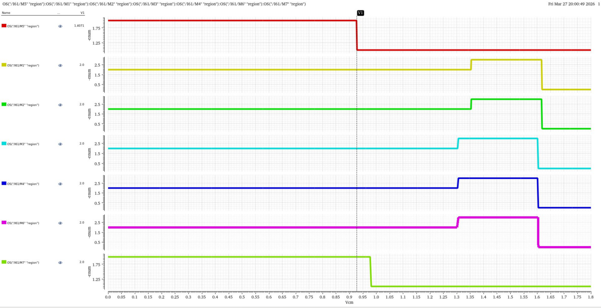<figcaption aria-hidden="true">ICMR Curve</figcaption></figure>

### Output Swing

<figure>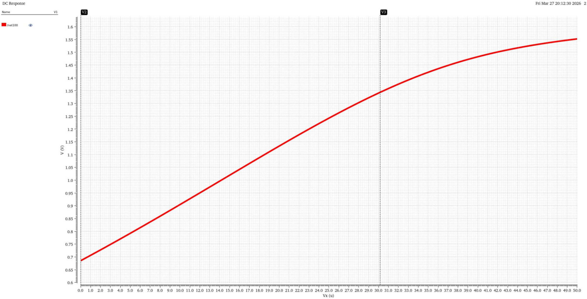<figcaption aria-hidden="true">Output Swing Curve</figcaption></figure>

### CMRR

<figure>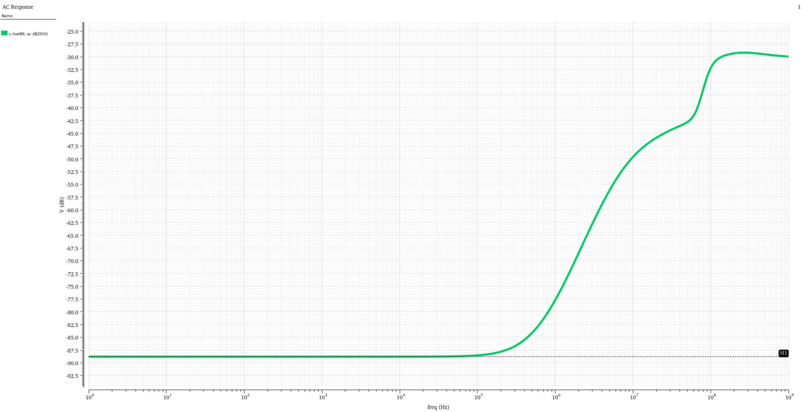<figcaption aria-hidden="true">CMRR Curve</figcaption></figure>

### SR

<figure>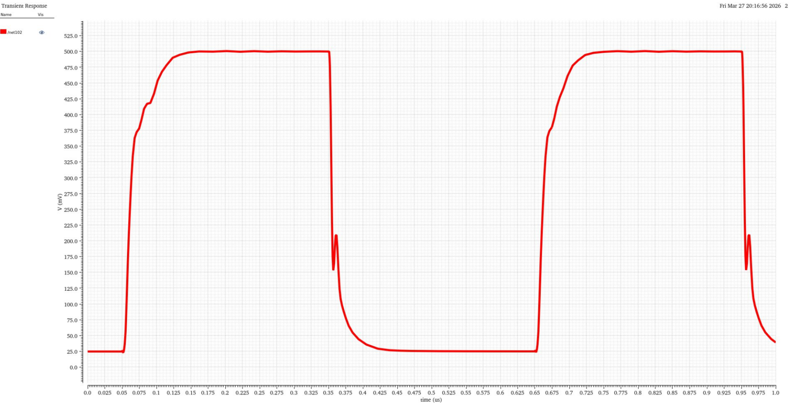<figcaption aria-hidden="true">SR Curve</figcaption></figure>

# Summary

The final performance summary of the operational amplifier is as follows:

| Parameter      |          Value in Theory           |       Specification        |        Actual Value        |
|:---------------|:----------------------------------:|:--------------------------:|:--------------------------:|
| Open-Loop Gain |     $\approx 93.5\,\text{dB}$      |      $>60\,\text{dB}$      |      $80\,\text{dB}$       |
| CMRR           |     $\approx 95.0\,\text{dB}$      |      $>65\,\text{dB}$      |     $88.8\,\text{dB}$      |
| PSRR           |     $\approx 95.6\,\text{dB}$      |      $>65\,\text{dB}$      |      $82\,\text{dB}$       |
| Input CM Range |      $\approx 0.94\,\text{V}$      |      $>0.8\,\text{V}$      |      $0.92\,\text{V}$      |
| Output Swing   |      $\approx 1.25\,\text{V}$      |      $>1.2\,\text{V}$      |      $1.4\,\text{V}$       |
| GBW            |     $\approx 47.7\,\text{MHz}$     |      $>3\,\text{MHz}$      |      $34\,\text{MHz}$      |
| Slew Rate      | $\approx 30\,\text{V}/\mu\text{s}$ | $>5\,\text{V}/\mu\text{s}$ | $35\,\text{V}/\mu\text{s}$ |
| Phase Margin   |             $60^\circ$             |        $>60^\circ$         |        $105^\circ$         |
| TDS            |                 —                  |     $<200\,\text{ppm}$     |     $200\,\text{ppm}$      |

Performance Summary of the Operational Amplifier

# References

1.  拉扎维, 陈贵灿, 程军. 模拟CMOS集成电路设计\[M\]. 西安: 西安交通大学出版社, 2003, 120-180.

2.  唐长文，菅洪彦。全差分运算放大器设计 \[R\]. 复旦大学专用集成电路与系统国家重点实验室《通信系统混合信号 VLSI 设计》课程设计报告，2003.

3.  尹睿。二级密勒补偿运算放大器设计教程 \[R\]. 复旦大学专用集成电路与系统国家重点实验室RFIC.
