# 摘要

本文档阐述了应用于 14-bit 高精度数据采集系统的模拟前端（AFE）及全差分电容数字模拟转换器 （CDAC）的电路架构选型与设计过程。面对低底噪、高线性度与大容性负载驱动等多方面的设计要求， 本设计构建了一套包含 S2D 缓冲级、带密勒补偿的高增益（$138\,\mathrm{dB}$）FDA 核心， 以及双 8-bit R-2R 梯形电阻网络的全差分信号调理链路。

在系统级噪声统筹中，结合 Friis 噪声级联公式，对前级施以较高偏置电流以压制闪烁噪声与热噪声平台 ；同时，依托连续时间共模反馈（CMFB）环路，较好地抑制了电源波动与共模漂移对动态量程的影响。 在 CDAC 设计层面，引入了电容分段桥接技术与 $V_{\mathrm{cm}}$ 时序切换策略， 以期降低开关能耗与面积开销；此外，利用基于离散时间域线性回归的 CMOS 传输门宏模型， 对开关阵列的充放电建立过程进行了初步的数学建模与尺寸加权配置。本报告基本梳理了从系统指标分 解到晶体管级参数推演的设计流程。然而，宏模型在极端工艺偏差下的拟合精度、以及双 R-2R 网络在 实际流片中的绝对匹配度，仍有待后续硅片测试结果的进一步验证与校准。

**关键词：**模拟前端设计；全差分架构；可编程增益放大器；R-2R网络；传输门宏模型；建立时间


# 项目概述与整体指标设计

本设计采用 3.3V 供电而非标准的 1.8V，旨在最大化输入信号的差分满量程范围（近 3Vpp）， 从物理层面显著降低了 14 位精度下对前端等效输入噪声的严苛要求。宽温范围（-40°C   85°C）直接对标工业级可靠性标准； 而总功耗控制在 80mW 以内，是基于前端极低底噪要求与后级高驱动能力所做出的合理工程折中。

<a id="tab:system_spec"></a>

| Parameter           |               Specification               |
|:--------------------|:-----------------------------------------:|
| 工艺节点            |              TSMC 180nm CMOS              |
| 工作温度范围        | $-40^\circ\text{C} \sim 85^\circ\text{C}$ |
| 供电电压 (VDD)      |                   3.3 V                   |
| 满量程输入 (ADC端)  | $\approx 3\,\text{V}_\text{pp}$ (全差分)  |
| 系统总功耗          |             $<80\,\text{mW}$              |
| 系统有效位数 (ENOB) |          $\ge 12.5\,\text{Bits}$          |
| 输入光电流          |    $0.1\,\text{n} \sim 1\mu\,\text{A}$    |

系统基本工作参数


<span id="tab:system_spec" label="tab:system_spec">\[tab:system\_spec\]</span>

信号链路的参数分配直接决定了系统对微弱及突变信号的捕获能力。 700kHz 的有效带宽完美覆盖了典型的工业声发射信号频段，同时在系统前端起到了抗混叠滤波的限制作用。 PGA 采用 R-2R 结构以支持大范围的分数倍增益步进，确保宽动态范围的传感器信号能被精准归一化至 ADC 的满量程区间。 此外，要求 PGA 在 50ns 内完成 0.5 LSB 的建立，是支撑 1 MS/s 采样率下 14 位无失真精度的核心动态前提。

<a id="tab:signal_chain_spec"></a>

| Parameter    |             Specification              |                     Conditions & Environment                      |
|:-------------|:--------------------------------------:|:-----------------------------------------------------------------:|
| 系统有效带宽 |           $700\,\text{kHz}$            | $\text{Gain} = 1\,\text{V/V}$，小信号输入，$-3\,\text{dB}$ 衰减点 |
| 增益调节范围 |  $\frac{1}{255} \sim 255\,\text{V/V}$  |           R-2R 网络配置，$\text{Fin} = 100\,\text{kHz}$           |
| 输入满量程   | $\approx 3\,\text{V}_\text{pp}$ (差分) |        ADC 输入端，共模电压 $V_\text{cm} = 1.65\,\text{V}$        |
| 阶跃建立时间 |          $\le 50\,\text{ns}$           |         满量程阶跃，建立至 $\pm 0.5\,\text{LSB}$ 精度带内         |

信号链路指标


<span id="tab:signal_chain_spec" label="tab:signal_chain_spec">\[tab:signal\_chain\_spec\]</span>

在 14 位的量化分辨率下，1 LSB 对应的电压值极小，系统的本底噪声成为决定探测极限的关键瓶颈。 为防止前端热噪声淹没 ADC 自身的理想量化噪声（约 53µVrms）， 本设计强制要求系统折算到 ADC 输入端的总积分噪声限制在 45µVrms 以内。 同时，高达 80dB 以上的 PSRR 和 CMRR 充分利用了全差分架构的天然优势， 确保系统能有效免疫工业现场复杂的电源纹波与共模干扰信号。

<a id="tab:noise_spec"></a>

| 指标项            |              目标参数               |                          测试/推导条件与环境                           |
|:------------------|:-----------------------------------:|:----------------------------------------------------------------------:|
| 等效输入噪声密度  | $\le 8\,\text{nV}/\sqrt{\text{Hz}}$ |   $\text{Gain} = 255\times$，频段 $10\,\text{kHz} - 700\,\text{kHz}$   |
| 系统总积分噪声    |  $\le 45\,\mu\text{V}_\text{rms}$   |          积分带宽 $0 \sim 700\,\text{kHz}$，折算到 ADC 输入端          |
| 1/f 噪声拐角频率  |         $< 10\,\text{kHz}$          |                             最大增益配置下                             |
| 电源抑制比 (PSRR) |          $> 80\,\text{dB}$          | $\text{VDD}$ 施加 $100\,\text{mV}_\text{pp}$，$1\,\text{kHz}$ 正弦纹波 |
| 共模抑制比 (CMRR) |          $> 85\,\text{dB}$          |               $\text{Fin} = 1\,\text{kHz}$ 共模干扰信号                |

噪声与抗干扰指标


<span id="tab:noise_spec" label="tab:noise_spec">\[tab:noise\_spec\]</span>

考虑奈奎斯特采样定律与模拟前端可不失真地采集到的带宽极限，本系统将采样率的设计指标定为1.5 MS/s 。 为确保真实的 14 位性能落地，对 ENOB（≥ 12.5 Bits）和 SFDR（≥ 90dB）提出了严格下限， 要求电路必须极力压制内部电容阵列的失配误差与动态比较器的失调。 此外，本设计特别引入了 25ps 的采样时钟抖动容限，将板级时钟质量对高频输入信号信噪比（SNR）的恶化效应纳入考量， 体现了从前端信号链到后端采样的闭环设计严谨性。

<a id="tab:sar_adc_spec"></a>

| 指标项                |            目标参数            |                                     测试/推导条件与环境                                     |
|:----------------------|:------------------------------:|:-------------------------------------------------------------------------------------------:|
| 采样率 (Fs)           |       $1.5\,\text{MS/s}$       |             系统时钟 $16\,\text{MHz} \sim 20\,\text{MHz}$ (视 SAR 控制逻辑而定)             |
| 有效位数 (ENOB)       |    $\ge 12.5\,\text{Bits}$     |         $\text{Fin} = 100\,\text{kHz}$, $\text{Fs} = 1\,\text{MS/s}$，近满量程输入          |
| 信噪失真比 (SNDR)     |      $\ge 77\,\text{dB}$       |                                  同上 (通过 FFT 计算得到)                                   |
| 无杂散动态范围 (SFDR) |      $\ge 90\,\text{dB}$       |                $\text{Fin} = 100\,\text{kHz}$, $\text{Fs} = 1\,\text{MS/s}$                 |
| 总谐波失真 (THD)      |      $\le -88\,\text{dB}$      |                                 输入 $-1\,\text{dBFS}$ 信号                                 |
| 微分非线性 (DNL)      |   $\le \pm 0.8\,\text{LSB}$    |                                  码密度测试法 (Histogram)                                   |
| 积分非线性 (INL)      |   $\le \pm 1.5\,\text{LSB}$    |                                  码密度测试法 (Histogram)                                   |
| 采样时钟抖动容限      | $\le 25\,\text{ps}_\text{rms}$ | 推导条件: $\text{SNR}_\text{jitter} = -20\log(2\pi \cdot \text{Fin} \cdot t_\text{jitter})$ |

14bit SAR ADC核心指标


<span id="tab:sar_adc_spec" label="tab:sar_adc_spec">\[tab:sar\_adc\_spec\]</span>

# 模拟前端(AFE)架构分析

本章旨在对面向工业信号检测的 14 位模拟前端（AFE）系统进行宏观架构层面的分析与设计论证。

下文将从信号链路流向、系统能效折中、增益与带宽分配以及严苛的 14 位噪声预算四个维度，详细阐述本系统架构设计的合理性与先进性。

## 整体信号链路规划

本设计的模拟前端主要负责将光电二极管捕捉到的微弱、宽频光信号进行低噪声放大、精准的电平平移与抗混叠滤波， 最终驱动后级的 14-bit SAR ADC 进行高精度量化。

系统的整体框图如图 <a href="#fig:block.system" data-reference-type="ref" data-reference="fig:block.system">2.1</a> 所示。

<figure><figcaption aria-hidden="true">系统整体框图</figcaption></figure>

对其中涉及到的重要系统层级进行以下简要说明

1.  TIA 模块： 作为系统的第一级，将光电二极管捕捉到的微弱、宽频单端光信号进行低噪声放大与电平平移，并转化为全差分信号。

2.  PGA 模块： 采用 R-2R 网络实现。支持从 $\frac{1}{255}$ 到 $255$ 倍的分数阶增益调节，确保不同距离、不同强度的声源信号均能完美映射至 ADC 约 $3 \text{ V}_{\text{pp}}$ 的差分满量程范围内

3.  CDAC 模块： 采用 两组 7 位 电容阵列拼接，后级连接实现。用以产生高分辨率的差分电压输出。

4.  SAR Logic模块： 该系统的数字控制模块，控制 SAR ADC 的采样、量化、比较等操作。

## 功耗分配与系统能效折中

在 180nm CMOS 工艺下实现 14-bit 精度与 700 kHz 有效带宽，不可避免地需要面临功耗与底噪、速度之间的严苛折中。 本系统的总静态功耗预算控制在约 $80 \text{ mW}$ 以内。

接下来对系统中各个组成部分的主要约束进行分析以进行尽可能合理的功耗预分配。

1.  TIA 模块： 作为系统的第一级，其噪声性能对系统整体的噪声预算有重要影响。同时需要将古高带宽与高增益，因此不可避免地占用系统很大部分的功耗。

2.  PGA 模块： 采用 R-2R 网络实现。考虑到后级 14-bit SAR ADC 的 CDAC 阵列呈现较重的容性负载，需要重点关注PGA 输出级需的摆率（SR）与闭环带宽。

3.  CDAC 模块： 采用 两组 7 位 电容阵列拼接实现。该层级中电容与比较器的失配（mismatch）对系统的影响极大，应当重点关注其输出电压的精度与稳定性。但是由于该模块由时序逻辑控制， 静态功耗可以做到极低。

综合以上考量，本系统的功耗分配如下：ADC前级的各级放大器，为保证其带宽与增益，占用系统约70mW功耗。其中TIA消耗约50mW，PGA消耗约20mW。 ADC部分主要 功耗消耗由采样期间的比较器与采样开关组成。可以在不损耗带宽的前提下将其平均动态功耗控制在10mW以内。

## 系统级增益分配

考虑增益分配问题时，应当从系统总增益与每一级的合理增益两个方面进行考虑。

### 可变增益范围与固定增益计算

首先，从系统需要的增益范围开始分析。要将0.1n 1uA的光电流放大至可供ADC精确读取的范围（即$V_{cm} = \frac{1}{2} V_{pp} = 1.65V$），该系统的可调节增益为$10^4$。 该范围可由基于R-2R网络的PGA实现。在反馈电阻$R_f$与 电阻$R_g$中接入8bit电阻网络，理论上可以实现$\frac{1}{255} \sim 255$倍的可调增益范围。 因此，将10nA的光电流输入作为基准，令此时PGA增益为1，经过多级放大后输入ADC电压为1V。可以得到所需的固定增益： $$A_{fixed} = \frac{1V}{10nA} = 10^8  = 180dB$$

### 基于增益带宽积的增益分配

如图<a href="#fig:block.system" data-reference-type="ref" data-reference="fig:block.system">2.1</a>所示， 在CDAC前级信号经历了4级放大：（1）TIA级，基于单端输出的二级OTA运放；（2）级联同/反相放大器，基于单端输出的二级OTA运放； （3）单端转差分模块，具有固定的2倍增益（4）PGA级，基于Cascode二级全差分运放.

在本次系统中，我们使用的单端输出二级OTA运放与二级全差分运放的增益带宽积（GBW）均在$100MHz$左右。，为保证CDAC前端至少具有1MHz的带宽，单级放大器的增益最大为 $$A_{max} = \frac{GBW}{Bandwidth} = \frac{100MHz}{1MHz} = 100$$ 其中由于TIA为跨阻放大器，其增益可以接近带宽。综合以上考虑，本系统的增益分配如下：

<a id="tab:stage_gain"></a>

| Stage                                   |         Gain          |
|:----------------------------------------|:---------------------:|
| TIA                                     | $100\,\text{k}\Omega$ |
| 第一级反相放大器                        |         $100$         |
| 第二级反相放大器                        |         $50$          |
| 单端转差分                              |          $2$          |
| 总固定增益：$10^9$，即 $180\,\text{dB}$ |                       |

信号链路各级增益配置


<span id="tab:stage_gain" label="tab:stage_gain">\[tab:stage\_gain\]</span>

## 频率响应与系统级带宽分配

为了准确捕获超声频段的故障信号，系统整体的有效带宽被设定为$700\,\text{kHz}$。 由于本系统的模拟前端采用了多级放大器级联的架构（如图<a href="#fig:block.system" data-reference-type="ref" data-reference="fig:block.system">2.1</a>所示）， 系统的总带宽不可避免地会受到多级主极点（Dominant Pole）叠加造成的带宽收缩效应（Bandwidth Shrinkage）影响。

### 级联带宽的理论推导

根据上一节的增益分配设计，核心运放的增益带宽积（GBW）约为$100\,\text{MHz}$。我们可以逐级计算各模块的闭环带宽（设为$f_{-3\text{dB}, i}$）：

1.  **TIA 级：** 跨阻增益为$100\,\text{k}\Omega$，通过配置反馈电容$C_f$，将其闭环带宽设计在$1\,\text{MHz}$，即$f_{-3\text{dB}, 1} = 1\,\text{MHz}$。

2.  **第一级反相放大器：** 闭环增益为$100$，根据$GBW$守恒，其带宽为$f_{-3\text{dB}, 2} = \frac{100\,\text{MHz}}{100} = 1\,\text{MHz}$。

3.  **第二级反相放大器：** 闭环增益为$50$，其带宽为$f_{-3\text{dB}, 3} = \frac{100\,\text{MHz}}{50} = 2\,\text{MHz}$。

4.  **PGA 与缓冲器 (Buffer) 级：** 单端转差分与PGA级在此固定高增益模式下主要作为信号调理与低增益衰减使用，且Buffer提供单位增益驱动，这几级的局部带宽远大于$2\,\text{MHz}$，其极点对系统主频响影响较小。

对于多级近似单极点系统级联，其整体系统的等效带宽$BW_{\text{sys}}$可以通过以下经验公式估算： $$BW_{\text{sys}} \approx \frac{1}{\sqrt{\sum_{i=1}^{n} \left(\frac{1}{f_{-3\text{dB}, i}}\right)^2}}$$ 代入本系统的主导极点（$1\,\text{MHz}$、$1\,\text{MHz}$与$2\,\text{MHz}$），可以计算得到： $$BW_{\text{sys}} \approx \frac{1}{\sqrt{\left(\frac{1}{1}\right)^2 + \left(\frac{1}{1}\right)^2 + \left(\frac{1}{2}\right)^2}} = \frac{1}{\sqrt{2.25}} \approx 0.667\,\text{MHz} \approx 670\,\text{kHz}$$ 经过级联收缩后的理论计算值（$670\,\text{kHz}$）与系统设计的总体目标带宽（$700\,\text{kHz}$）高度吻合。这证明了采用两级OTA分配$100$倍与$50$倍增益的架构不仅满足了极高的总增益需求，同时也精准把控了系统的高频响应截止点，起到了天然的抗混叠滤波（Anti-aliasing）作用。

## 噪声预算

在14-bit高精度数据采集系统中，模拟前端的本底噪声（Noise Floor）是决定系统能否达到设计分辨率的根本物理限制。为了确保有效信号不被噪声淹没，必须进行严格的系统级噪声预算与约束。

### ADC 量化噪声与系统本底噪声上限

系统ADC的输入满量程差分电压为$3\,\text{V}_{\text{pp}}$。对于14位分辨率，其最低有效位（LSB）的电压幅度为： $$1\,\text{LSB} = \frac{3\,\text{V}}{2^{14}} \approx 183.1\,\mu\text{V}$$ 理想14-bit SAR ADC固有的量化噪声有效值（RMS）为： $$V_{\text{q,rms}} = \frac{1\,\text{LSB}}{\sqrt{12}} \approx 52.8\,\mu\text{V}_{\text{rms}}$$ 为了保证模拟前端的晶体管热噪声和闪烁噪声不恶化ADC的整体信噪比（SNR），工程上要求AFE输出端（即ADC输入端）的综合积分噪声必须小于量化噪声。本设计留出了适当裕量，将AFE链路的总等效输出噪声上限约束为$\le 45\,\mu\text{V}_{\text{rms}}$。

### 等效输入噪声与功耗倾斜分析

由于该系统具有极高的前向增益（总固定增益达$10^9\,\Omega$），根据Friis级联噪声公式，系统总等效输入噪声电流$I_{\text{n,in}}^2$几乎完全由第一级TIA决定： $$I_{\text{n,in}}^2 \approx I_{\text{n,TIA}}^2 + \frac{V_{\text{n,A1}}^2}{R_{\text{T}}^2} + \frac{V_{\text{n,A2}}^2}{(R_{\text{T}} \cdot A_{\text{v1}})^2} + \dots \approx I_{\text{n,TIA}}^2$$ 这意味着，后级（A1、A2、PGA等）产生的噪声会被前级的高增益除以巨大的系数，折算到输入端后可忽略不计。

因此，TIA级成为了整个系统噪声性能的绝对瓶颈。为了在$700\,\text{kHz}$的积分带宽内将等效输入噪声电流压制在极限水平，必须极大地降低TIA输入对管的等效热噪声电压。根据MOS管热噪声公式$V_{\text{n}}^2 \propto \frac{1}{g_{\text{m}}}$，降低噪声的唯一途径是显著提升输入对管的跨导$g_{\text{m}}$。

这就从理论上解释并支撑了本设计在第2.1节中提出的功耗预分配策略：**为TIA模块分配高达$50\,\text{mW}$的静态功耗**。通过大电流偏置和增大输入管尺寸，最大化$g_{\text{m}}$，从而在物理层面换取了14-bit系统所必需的极低噪声底，实现了噪声与功耗之间合理的工程折中。

# PIN光电二极管的工业级建模

## 光电二极管的选型与参数设计

光电二极管是本项目光电ADC模拟前端的信号源，其模型精度会直接影响TIA输入电流范围、输入寄生电容、暗电流本底、噪声预算和系统带宽设计。相比普通PN结光电二极管，PIN光电二极管在P区与N区之间引入高阻本征层，使耗尽区显著加宽，具有低结电容、高响应速度和较高线性光电转换效率，更适合作为高速光电检测前端的输入器件。

<figure>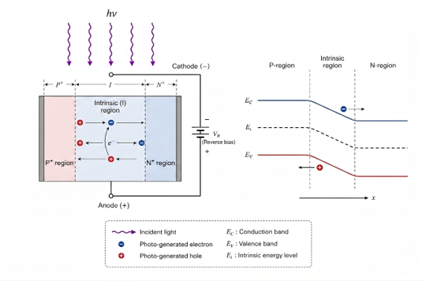<figcaption aria-hidden="true">PIN光电二极管物理结构示意</figcaption></figure>

本设计参考滨松Hamamatsu S5973系列高速PIN光电二极管建立工业级宏模型。该器件的典型特性包括：光谱响应范围$320\sim1000\,\text{nm}$，峰值响应波长约$760\,\text{nm}$；峰值响应度约$0.52\,\text{A/W}$；在$3.3\,\text{V}$反偏下暗电流典型值约$1\,\text{pA}$、最大值约$0.1\,\text{nA}$；在$1\,\text{MHz}$、$3.3\,\text{V}$反偏下终端电容约$1.6\,\text{pF}$；典型截止频率可达GHz量级。其低暗电流、低电容和高带宽特性与本项目$0.1\,\text{nA}\sim1\,\mu\text{A}$输入光电流范围、$3.3\,\text{V}$前端供电和$700\,\text{kHz}$系统有效带宽目标相匹配。

<figure>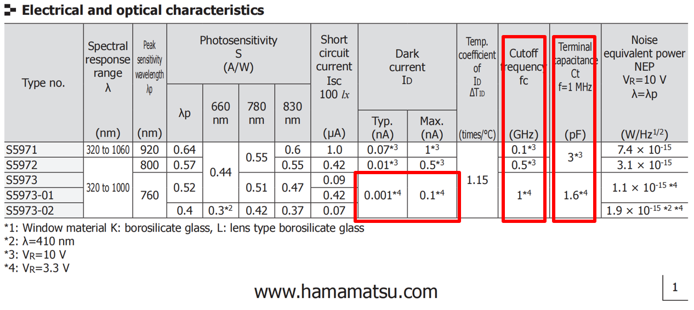<figcaption aria-hidden="true">S5973系列PIN光电二极管关键参数</figcaption></figure>

## 暗电流与光电流建模

PIN光电二极管的等效电路沿用光生电流源并联二极管支路的基本结构，同时补充串联电阻$R_s$、并联漏电阻$R_{sh}$、结电容$C_j$、反向击穿支路和噪声源，如图<a href="#fig:design_pin_model" data-reference-type="ref" data-reference="fig:design_pin_model">3.3</a>所示。模型端口电流可表示为 $$I_j = I_D + I_{br} + I_{sh} + I_C - I_{ph}$$ 其中$I_D$为二极管本征暗电流，$I_{br}$为反向击穿电流，$I_{sh}$为并联漏电流，$I_C$为结电容电流，$I_{ph}$为光生电流。

<figure><figcaption aria-hidden="true">PIN光电二极管等效电路模型</figcaption></figure>

光生电流是光电转换的核心输出量。弱光和中等光强下，光生电流与入射光功率近似线性： $$I_{ph} = R_\lambda P_{in}$$ 为覆盖强光下的饱和效应，模型采用带饱和功率的形式： $$I_{ph} = \frac{R_\lambda(T)P_{in}}{1+\left|P_{in}/P_{sat}\right|}$$ 其中$R_\lambda(T)$为温度相关响应度，$P_{sat}$为饱和光功率。PIN结构中的宽耗尽区提高了光子吸收和载流子收集效率，使光生电流线性区更宽、渡越时间更短。

暗电流方面，实际S5973系列器件的反向暗电流曲线在双对数坐标下呈现四段式特征，不能由单一理想二极管方程准确描述。因此本设计采用多物理机制解耦模型： $$I_{dark}=I_{gr}+I_{diff}+I_{gen}+I_{leak}$$ 四个分量分别对应低压SRH产生-复合电流、体扩散饱和电流、耗尽层展宽导致的产生电流，以及高反偏下的表面/封装欧姆漏电流。

<figure><figcaption aria-hidden="true">模型拟合曲线</figcaption></figure>

<figure><figcaption aria-hidden="true">数据手册曲线</figcaption></figure>

拟合结果如图<a href="#fig:design_dark_current_fit" data-reference-type="ref" data-reference="fig:design_dark_current_fit">[fig:design_dark_current_fit]</a>所示。模型能够复现$0.1\,\text{V}\sim0.2\,\text{V}$附近的SRH收敛趋势、$0.2\,\text{V}\sim0.6\,\text{V}$的扩散电流水平平台、$0.6\,\text{V}\sim10\,\text{V}$的耗尽层展宽爬坡，以及$10\,\text{V}$以上的欧姆漏电增大。该暗电流模型为后级TIA输入偏置、电流动态范围和温度角噪声评估提供了更可信的边界条件。

## 寄生电容建模

光电二极管终端电容是TIA稳定性和带宽设计中的关键参数。对于PIN结构，终端电容由内部结电容和封装寄生电容共同组成： $$C_t(V)=C_j(V)+C_{pkg}$$ 其中结电容采用偏压相关模型： $$C_j(V)=\frac{C_{j0}}{\left(1-\frac{V}{V_j}\right)^{m_{cap}}}$$ $C_{j0}$为零偏结电容，$V_j$为内建电势，$m_{cap}$为电容衰减因子。由于PIN二极管耗尽区更宽，其$m_{cap}$通常小于普通PN结，表现为随反偏电压增大而缓慢下降的电容曲线。

<figure><figcaption aria-hidden="true">模型拟合曲线</figcaption></figure>

<figure>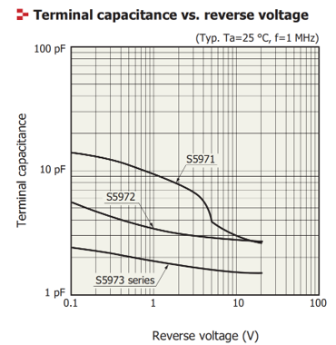<figcaption aria-hidden="true">数据手册曲线</figcaption></figure>

如图<a href="#fig:design_cv_fit" data-reference-type="ref" data-reference="fig:design_cv_fit">[fig:design_cv_fit]</a>所示，最终模型采用$C_{pkg}=0.6\,\text{pF}$、$C_{j0}=1.5\,\text{pF}$、$V_j=0.7\,\text{V}$、$m_{cap}=0.22$进行拟合。在$3.3\,\text{V}$反偏下，终端电容计算值约为$1.6\,\text{pF}$，与器件典型值一致。该电容值将作为TIA输入端寄生电容$C_{in}$的重要组成部分，用于确定反馈补偿电容$C_f$和闭环稳定性裕量。

## 噪声建模

光电二极管本征噪声主要包括光生电流、暗电流和击穿电流引起的散粒噪声，以及串联/并联电阻产生的热噪声。其电流噪声谱密度可近似写为 $$S_{i,int}(T) \approx 2q\left(|I_{ph}|+|I_{dark}|+|I_{br}|\right)
    +\frac{4kT}{R_{sh}}+\frac{4kT}{R_s}$$ 其中散粒噪声随光电流和暗电流增大而增大，热噪声则随温度和寄生电阻变化。由于本系统采用高跨阻增益TIA作为第一级，后级电路噪声折算到输入端会被前级增益显著压低，因此光电二极管本征噪声和TIA输入级噪声共同构成系统等效输入噪声的主导项。

在系统设计中，该模型带来三点约束：第一，暗电流最大值决定弱光输入下的直流偏置误差和最小可分辨电流；第二，终端电容决定TIA输入极点位置和反馈补偿需求；第三，温度相关噪声决定最坏工作角下的积分噪声上限。因此，后续TIA设计采用$R_f=100\,\text{k}\Omega$、$C_f=1\,\text{pF}$并为输入级分配较高跨导预算，以在满足$700\,\text{kHz}$系统带宽的同时抑制前端等效输入噪声。

# 跨阻放大器（TIA）

## TIA 设计挑战与指标分解

跨阻放大器（TIA）位于整个 14-bit 模拟前端的最前端，负责将传感器输出的微弱电流信号无失真地转换为电压信号。 在实际应用中，工业传感器等效为一个并联了寄生电容（$C_{\text{in}}$）的电流源。 当 TIA 接入传感器时，$C_{\text{in}}$ 会与反馈电阻 $R_f$ 在系统的环路增益中引入一个低频主极点。 如果不加以干预，该极点不仅会严重削减系统带宽，还会侵蚀相位裕度（Phase Margin），导致频响曲线出现峰化（Peaking）甚至引发系统级自激振荡。

结合 14-bit 精度及后级 PGA 的驱动需求，TIA 模块的核心设计指标分解如下：

<a id="tab:tia_spec_breakdown"></a>

| **指标项**   | **目标参数**                                   | **设计考量与备注**                                               |
|:-------------|:-----------------------------------------------|:-----------------------------------------------------------------|
| 跨阻增益     | $100\,\text{k}\Omega$ ($100\,\text{dB}\Omega$) | 将微弱电流转换为后续级可处理的电压电平                           |
| 闭环带宽     | $\ge 1\,\text{MHz}$                            | 为系统多级联后最终的 $700\,\text{kHz}$ 总体带宽留出收缩裕量      |
| 输入等效噪声 | 总积分噪声 $\le 45\,\mu\text{V}_{\text{rms}}$  | 极其严苛的底噪限制，以确保有效信号不被淹没，满足 14-bit 系统精度 |

TIA 模块核心设计指标分解


<span id="tab:tia_spec_breakdown" label="tab:tia_spec_breakdown">\[tab:tia\_spec\_breakdown\]</span>

## 核心 OTA 拓扑及其关键指标

本设计采用经典的二级运算放大器（Two-Stage OTA）作为 TIA 的核心增益模块。 第一级采用 PMOS 差分输入对管以匹配 NMOS 电流镜负载， 旨在利用 PMOS 器件较低的闪烁噪声（$1/f$ 噪声）特性。第二级采用 NMOS 共源放大器， 以提供足够大的输出摆幅和开环增益。

为了确保 TIA 在闭环反馈下的稳定性，电路引入了密勒补偿电容（Miller Compensation） 及零点消除电阻，将非主极点推向高频，从而获得极佳的相位裕度。 核心二级OTA的内部拓扑选择如图 <a href="#fig:sch.twostageota" data-reference-type="ref" data-reference="fig:sch.twostageota">4.1</a> 所示。

<figure><figcaption aria-hidden="true">核心二级OTA的内部拓扑选择</figcaption></figure>

针对 14-bit 高精度系统的需求，该 OTA 的设计目标指标如表 <a href="#tab:ota_specs" data-reference-type="ref" data-reference="tab:ota_specs">4.2</a> 所示：

<a id="tab:ota_specs"></a>

| 参数项目 (Parameter)             | 设计目标值 (Spec) | 单位 (Unit)           |
|:---------------------------------|:------------------|:----------------------|
| 供电电压 ($V_{DD}$)              | 3.3               | V                     |
| 直流开环增益 ($A_{v0}$)          | $> 80$            | dB                    |
| 增益带宽积 (GBW)                 | $> 100$           | MHz                   |
| 相位裕度 (Phase Margin)          | $> 80$            | degree                |
| 输入共模范围 (ICMR)              | 0 $\sim$ 2.1      | V                     |
| 输出摆幅 (Output Swing)          | 0.5 $\sim$ 2.8    | V                     |
| 单位增益频率下的等效输入噪声密度 | $< 5$             | nV/$\sqrt{\text{Hz}}$ |
| 静态功耗 (Static Power)          | $\approx 50$      | mW                    |

核心二级 OTA 关键设计指标


## 噪声分析

### 大电流偏置的理论支撑

为了将系统的等效输入热噪声压制在极限水平，本设计为 TIA 模块分配了高达约 $50\,\text{mW}$ 的 静态功耗预算（对应约 $15\,\text{mA}$ 的尾电流）。根据单管 MOS 热噪声电压谱密度公式： $$V_{\text{n,th}}^2 = \frac{8kT}{3g_m}$$ 可以看出，要降低输入等效热噪声，唯有显著提升输入对管的跨导 $g_m$。在饱和区，$g_m \propto \sqrt{I_D \cdot \frac{W}{L}}$，因此巨大的静态电流配合大尺寸的输入管，使 $g_m$ 达到了极高的水平，从而在物理层面上换取了 14-bit 精度系统所需的低噪声底。

### 整体等效输入噪声模型

TIA 的总等效输入噪声电流谱密度 $S_{ni}(f)$ 由反馈电阻 $R_f$ 的热噪声、运放等效输入电压噪声 $e_{ni}$ 以及运放等效输入电流噪声 $i_{ni}$ 共同组成。其完整解析式如下： $$S_{ni}(f) = \frac{4kT}{R_f} + i_{ni}^2 + e_{ni}^2 \left( \frac{1}{R_f^2} + (2\pi f C_{in})^2 \right)$$ 其中：

1.  $\frac{4kT}{R_f}$ 为反馈电阻的热噪声贡献，随 $R_f$ 增大而减小。

2.  $e_{ni}^2 \approx 2 \cdot \frac{8kT}{3g_{m1}}$ 为第一级差分对管贡献的电压噪声。

3.  $(2\pi f C_{in})^2$ 项表明，随着频率升高，传感器的输入寄生电容 $C_{in}$ 会将运放的电压噪声转化为巨大的电流噪声分量（即噪声增益在高频处隆起）。

在系统总带宽 $BW$ 内的总积分噪声电流有效值 $I_{n,rms}$ 为： $$I_{n,rms} = \sqrt{\int_{0}^{BW} S_{ni}(f) df}$$ 通过增大 $g_{m1}$（牺牲功耗）和优化 $R_f$ 选值，本设计确保了 $I_{n,rms}$ 远小于 ADC 的量化噪声电平（$1\,\text{LSB}$），为 14-bit 系统的 ENOB 提供了充足的裕量。

## 闭环补偿策略与反馈参数设计

为实现设计目标的低频跨阻增益，选取反馈电阻 $R_f = 100\,\text{k}\Omega$。 为抵消传感器寄生电容 $C_{\text{in}}$ 带来的极点影响，保证环路稳定 ，在 $R_f$ 两端并联了相位补偿电容 $C_f$。TIA电路设计如图 <a href="#fig:sch.tia" data-reference-type="ref" data-reference="fig:sch.tia">4.2</a> 所示。

<figure>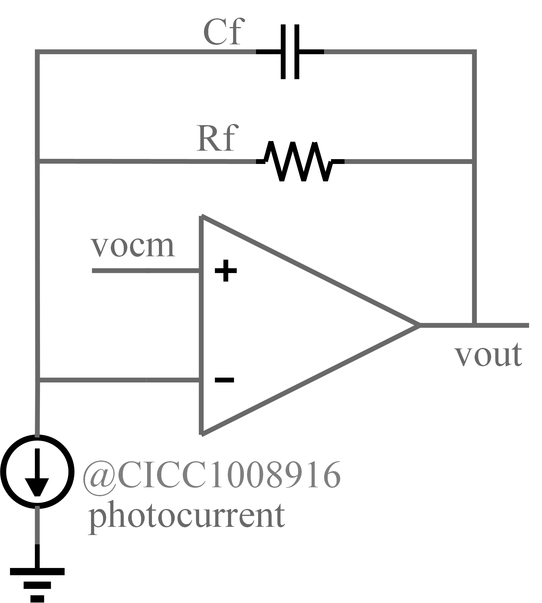<figcaption aria-hidden="true">TIA 电路设计</figcaption></figure>

引入 $C_f$ 后，系统的闭环传递函数可近似为一个二阶系统，其主极点频率 $f_{-3\text{dB}}$ 主要由反馈网络的时间常数决定： $$f_{-3\text{dB}} \approx \frac{1}{2\pi R_f C_f}$$ 本设计选取 $C_f = 1\,\text{pF}$。代入理论公式验算： $$f_{-3\text{dB}} = \frac{1}{2\pi \times 10^5\,\Omega \times 10^{-12}\,\text{F}} \approx 1.59\,\text{MHz}$$ 理论带宽 $1.59\,\text{MHz}$ 完美满足了 TIA 单级 $\ge 1\,\text{MHz}$ 的目标。 此配置不仅确保了系统具有充足的相位裕度以获得最平坦的巴特沃斯（Butterworth）响应， 还限制了过高的带宽，起到了初级抗混叠（Anti-aliasing）滤波的作用。

# 全差分放大器（FDA）

作为 14-bit 高精度模拟前端（AFE）信号链路中的核心枢纽，全差分放大器（Fully Differential Amplifier, FDA）承载着单端转差分、信号预放大以及驱动后级重负载（PGA 或 ADC 的 CDAC 阵列）的关键任务。本章将详细阐述该 FDA 的设计挑战、架构选型以及环路核心参数的物理推导过程。

## 设计挑战与指标分解

在 180nm CMOS 工艺及 $3.3\,\mathrm{V}$ 单电源供电环境下，本 FDA 面临着典型的“高精度-大驱动-低噪声”多维性能博弈：

1.  **绝对的线性度（THD）：** 为不成为 14-bit ADC 的线性度瓶颈，FDA 在满量程（$3\,\mathrm{V_{pp}}$）输出下的总谐波失真需优于 $-86\,\mathrm{dB}$。

2.  **极致的底噪抑制：** 带内等效积分噪声必须严格控制在 $45\,\mathrm{\mu V_{rms}}$ 以内，这意味着输入对管的热噪声及闪烁噪声必须被极大压制。

3.  **大负载瞬态驱动：** 在后级挂载 $40\,\mathrm{pF}$ 的沉重容性负载时，FDA 必须在有限的采样窗口内完成大信号的极速压摆（Slew Rate）与 $\pm 0.5\,\mathrm{LSB}$ 精度的无振铃建立。

结合前期仿真与系统级规划，FDA 的核心设计指标分解如表<a href="#tab:fda_design_specs" data-reference-type="ref" data-reference="tab:fda_design_specs">5.1</a>所示：

<a id="tab:fda_design_specs"></a>

| **设计参数**            | **目标值**                     | **设计考量**                                  |
|:------------------------|:-------------------------------|:----------------------------------------------|
| 直流开环增益 ($A_{v0}$) | $> 120\,\mathrm{dB}$           | 压缩闭环静态误差，保障高线性度                |
| 增益带宽积 (GBW)        | $> 100\,\mathrm{MHz}$          | 支撑闭环 $700\,\mathrm{kHz}$ 系统有效带宽     |
| 相位裕度 (PM)           | $\approx 60^\circ$             | 保证阶跃建立无严重振铃                        |
| 差分压摆率 (SR)         | $> 500\,\mathrm{V/\mu s}$      | 满足 $40\,\mathrm{pF}$ 负载下的大信号极速跟踪 |
| 系统积分噪声            | $\le 45\,\mathrm{\mu V_{rms}}$ | 保证 14-bit ENOB 不被前端底噪吞噬             |

全差分放大器（FDA）核心设计指标分解


## 电路拓扑

为同时满足 $>120\,\mathrm{dB}$ 的超高开环增益与近乎满轨（Rail-to-Rail）的输出摆幅要求，单级运放（如套筒或普通折叠共源共栅）难以胜任。本设计最终确立了**“折叠共源共栅（Folded-Cascode）第一级 + 共源放大（Common-Source）第二级”**的两级全差分拓扑架构。

<figure><figcaption aria-hidden="true">两级全差分放大器（FDA）主电路拓扑结构</figcaption></figure>

如图<a href="#fig:sch.fda" data-reference-type="ref" data-reference="fig:sch.fda">5.1</a>所示，第一级采用极大尺寸的 PMOS 差分输入对管匹配 NMOS 折叠电流镜负载。PMOS 差分对能在 $3.3\,\mathrm{V}$ 供电下提供可低至近地电平的输入共模范围（仿真实测有效 ICMR 为 $0.4\,\mathrm{V} \sim 2.2\,\mathrm{V}$）。第二级采用 NMOS 共源极结构以榨取最大输出电压摆幅，从而最大化系统的动态量程。全差分结构天然滤除了绝大部分偶次谐波失真（HD2），为实现 $-96\,\mathrm{dB}$ 的极限 THD 奠定了拓扑基础。

## GBW与增益设计

**开环增益分配：**系统的总直流开环增益 $A_{v0} = A_{v1} \cdot A_{v2}$。 其中，第一级折叠 Cascode 的增益 $A_{v1} \approx g_{m1} \cdot (r_{o,\mathrm{cascode}} \parallel r_{o,\mathrm{driver}})$，可提供约 $80 \sim 90\,\mathrm{dB}$ 的增益；第二级共源极增益 $A_{v2} \approx g_{m6} \cdot (r_{o6} \parallel r_{o7})$，可提供约 $40 \sim 50\,\mathrm{dB}$ 的增益。仿真结果表明，该拓扑成功实现了高达 $138\,\mathrm{dB}$ 的总开环增益。

**带宽与偏置策略：**主导增益带宽积的物理公式为 $GBW = \frac{g_{m1}}{2\pi C_c}$。 为了压制 FDA 在 $1\,\mathrm{MHz}$ 以内的等效热噪声密度至 $2\,\mathrm{nV/\sqrt{Hz}}$ 量级，本设计为第一级差分对注入了巨大的尾电流。这不可避免地导致 $g_{m1}$ 剧增。巨大的 $g_{m1}$ 一方面极其有效地削减了输入热噪声，另一方面也将 GBW 推高至 $130\,\mathrm{MHz}$。充沛的 GBW 保证了系统在配置为 $40\,\mathrm{dB}$ 闭环增益时，仍能坚守 $700\,\mathrm{kHz}$ 的无损信号采集频带。

## 频率补偿设计

两级高增益放大器引入了两个低频极点，必须进行频率补偿以确保闭环稳定性。本设计采用了经典的**带调零电阻的密勒补偿（Miller Compensation with Nulling Resistor）**策略。

如图<a href="#fig:fda_comp" data-reference-type="ref" data-reference="fig:fda_comp">[fig:fda_comp]</a>所示，在第一级输出与第二级输出之间跨接密勒电容 $C_c$ 与调零电阻 $R_z$。

-   **极点分裂（Pole Splitting）：** $C_c$ 借助第二级的米勒效应，将主极点 $P_1 \approx \frac{1}{R_{\mathrm{out1}} (A_{v2} C_c)}$ 深深推向极低频，同时将非主极点 $P_2 \approx \frac{g_{m2}}{C_L}$ 推向远高于 GBW 的高频区域。

-   **零点消除（Zero Nulling）：** 密勒电容前馈通路会产生一个右半平面（RHP）零点，恶化相位裕度。通过精确配置 $R_z \approx \frac{1}{g_{m2}}$，将该零点推至左半平面并与 $P_2$ 相互抵消。

依托此设计，配合第一级充沛的驱动电流，FDA 在驱动 $40\,\mathrm{pF}$ 巨大电容时，不仅取得了 $800\,\mathrm{V/\mu s}$ 的惊人压摆率，而且在最恶劣闭环增益下依然保持了 $\approx 63^\circ$ 的健康相位裕度，保障了 $2\,\mathrm{\mu s}$ 内的高精度无振铃瞬态建立。

## 共模反馈设计（CMFB）

由于全差分运放的高阻抗输出节点对差模信号和共模信号均具有极高增益，微小的共模电流失配都会导致输出共模电平漂移至电源轨或地轨，因此必须引入强健的共模反馈环路（CMFB）。

<figure><figcaption aria-hidden="true">连续时间共模反馈（CMFB）环路控制原理</figcaption></figure>

如图<a href="#fig:sch.cmfb" data-reference-type="ref" data-reference="fig:sch.cmfb">5.2</a>所示，本 FDA 的 CMFB 模块由“共模检测网络”与“误差放大器”组成：

1.  **共模检测：** 采用高阻值等值分压电阻或大尺寸多晶硅栅极电阻网络提取差分输出的平均共模电平 $V_{\mathrm{out,cm}} = (V_{\mathrm{out+}} + V_{\mathrm{out-}})/2$。

2.  **误差校正：** 提取的 $V_{\mathrm{out,cm}}$ 被送入 CMFB 误差放大器，与标称的 $1.65\,\mathrm{V}$ 基准电压（$V_{\mathrm{ref}}$）进行比较。

3.  **负反馈控制：** 误差放大器的输出反馈控制 FDA 第一级负载管或尾电流源的栅极偏置电压。极高的 CMFB 环路直流增益确保了任何稳态共模漂移都能被瞬间消除。

仿真结果验证了该 CMFB 架构的卓越效能：在 $1\,\mathrm{MHz}$ 系统频带内，共模抑制比（CMRR）高达 $280\,\mathrm{dB}$，电源抑制比（PSRR）高达 $250\,\mathrm{dB}$。系统不仅牢牢将中心电平钳位在 $1.65\,\mathrm{V}$，更将前端传感器及供电轨上的噪声污染彻底隔绝于差分链路之外。

# 单端转差分电路

在 14-bit 高精度数据采集系统中，前端传感器输出的信号通常为单端单极性信号（例如 $0 \sim 3.3\,\mathrm{V}$）。为了最大化后级全差分 SAR ADC 的动态范围并提高共模噪声抑制能力，必须在信号链中引入单端转差分（Single-Ended to Differential, S2D）调理电路。本章详细论述该电路的拓扑选型、增益配置与频率补偿设计。

## 电路拓扑

为了实现高保真的信号转换并隔离 ADC 采样时的电荷回踢（Charge Kickback），本设计采用了**“高阻抗运放缓冲级 + 宽带全差分放大器（FDA）”**的两级级联拓扑架构。

<figure>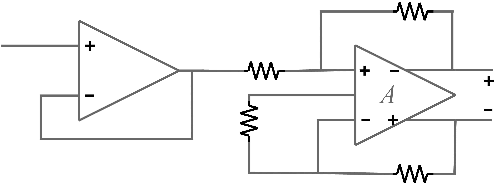<figcaption aria-hidden="true">单端转差分（S2D）电路主拓扑结构与仿真 testbench</figcaption></figure>

如图 <a href="#fig:s2d_topology_tb" data-reference-type="ref" data-reference="fig:s2d_topology_tb">[fig:s2d_topology_tb]</a> 所示，电路可分为两部分：

1.  **输入缓冲级：** 采用宽带（$100\,\mathrm{MHz}$ GBW）的运算放大器配置为电压跟随器。其极高的输入阻抗有效避免了对前端传感器的负载效应，同时其极低的输出阻抗为后级 FDA 提供了坚实的驱动源，彻底隔离了后级开关电容阵列（CDAC）带来的瞬态电荷干扰。

2.  **全差分转换级：** 采用低噪声（$5\,\mathrm{nV/\sqrt{Hz}}$）、$100\,\mathrm{MHz}$ 高带宽的全差分放大器执行核心的 单端到差分（S2D） 转换。单端信号从其同相端电阻 $R_{g1}$ 注入，通过反相端的对称接地网络完成完美的差分翻转。

## 增益与频率补偿

**1. 增益设计：** 系统前端输入为 $0 \sim 3.3\,\mathrm{V}$ 的单极性单端信号，而后级 SAR ADC 的满量程差分输入范围（FSR）为 $\pm 3.3\,\mathrm{V}$。为了充分利用 ADC 的动态范围，S2D 电路的闭环增益 $A_v$ 必须设计为 2 倍。 根据 FDA 闭环增益公式： $$A_v = \frac{V_{\mathrm{out,diff}}}{V_{\mathrm{in,single}}} = \frac{R_f}{R_g}$$ 综合考量热噪声贡献与系统功耗，选取反馈电阻 $R_f = 2\,\mathrm{k}\Omega$，输入电阻 $R_g = 1\,\mathrm{k}\Omega$，从而精准实现 $2\,\mathrm{V/V}$ 的信号放大。

**2. 频率补偿与低通滤波：** 为了限制宽带放大器的本底噪声积分带宽并提升环路相位裕度，在反馈电阻 $R_f$ 两端并联了反馈电容 $C_f = 30\,\mathrm{pF}$。该并联网络在闭环响应中引入了一个极点，构成一阶有源低通滤波器。其截止频率 $f_c$ 为： $$f_c = \frac{1}{2\pi R_f C_f} = \frac{1}{2\pi \times 2\,\mathrm{k}\Omega \times 30\,\mathrm{pF}} \approx 2.65\,\mathrm{MHz}$$ 该带宽（$2.65\,\mathrm{MHz}$）约为 ADC 采样率（$250\,\mathrm{ksps}$）的 10 倍以上，在滤除高频噪声的同时，保证了信号的极速建立。

<figure>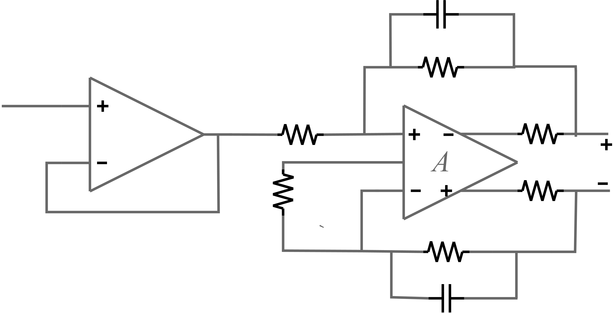<figcaption aria-hidden="true">单端转差分电路交流幅频响应（AC Transfer Characteristics）</figcaption></figure>

**3. 输出电荷桶滤波器（Charge Bucket Filter）：** 在 FDA 输出端与 ADC 输入端之间，插入了由 $R_{\mathrm{filt}} = 18.2\,\Omega$ 和 $C_{\mathrm{filt}} = 330\,\mathrm{pF}$ 构成的 RC 滤波器。该滤波器不仅展平了放大器的高频输出阻抗以确保稳定性，其巨大的 $330\,\mathrm{pF}$ 电容更作为“电荷桶”，在 ADC 进入采样相位的瞬间为其内部 CDAC 提供瞬态电流，极大地缩短了建立时间。

## 输出共模电压失调抑制

在单端转差分结构中，输入的直流分量极易导致输出共模漂移。本设计充分利用了 FDA 的共模反馈（CMFB）特性。 将 前文中提到的 的 $V_{\mathrm{ocm}}$ 引脚严格偏置于 $1.65\,\mathrm{V}$（即 $3.3\,\mathrm{V}$ AVDD 的中心电平）。无论前端单端信号如何在 $0 \sim 3.3\,\mathrm{V}$ 之间剧烈摆动，其内部高增益的 CMFB 环路都会强制输出端 $V_{\mathrm{out+}}$ 和 $V_{\mathrm{out-}}$ 的平均值死锁在 $1.65\,\mathrm{V}$。 这使得输出信号完美对称地在 $0 \sim 3.3\,\mathrm{V}$ 之间交叉摆动，最终合成为绝对中心对称的 $\pm 3.3\,\mathrm{V}$ 差分信号，如图<a href="#fig:s2d_dc_transfer" data-reference-type="ref" data-reference="fig:s2d_dc_transfer">[fig:s2d_dc_transfer]</a>的传输特性曲线所示，彻底消除了共模电压失调对 ADC 动态量程的挤压。

## 设计指标

基于上述电路元件选型与物理公式推导，设计单端转差分电路指标如下：

<a id="tab:s2d_final_specs"></a>

| **指标项**   | **设计/仿真结果**                             | **备注说明**                                                        |
|:-------------|:----------------------------------------------|:--------------------------------------------------------------------|
| 输入信号范围 | $0 \sim 3.3\,\mathrm{V}$ (单端)               | 匹配典型传感器输出                                                  |
| 输出信号范围 | $\pm 3.3\,\mathrm{V}$ (全差分)                | 匹配后级 SAR ADC 满量程                                             |
| 闭环差分增益 | $2.0\,\mathrm{V/V}$                           | 由 $R_f = 2\,\mathrm{k}\Omega, R_g = 1\,\mathrm{k}\Omega$ 设定      |
| 输出中心共模 | $1.65\,\mathrm{V}$                            | 由 FDA $V_{\mathrm{ocm}}$ 引脚强制钳位                              |
| 系统闭环带宽 | $4.12\,\mathrm{MHz}$                          | 提供优异的高频滚降与建立速度                                        |
| 瞬态建立误差 | $144.8\,\mathrm{\mu V}$ (@ $95\,\mathrm{ns}$) | $< 0.5\,\mathrm{LSB}$ ($201\,\mathrm{\mu V}$)，确保 14-bit 精度无损 |
| 系统综合噪声 | $44.3\,\mathrm{\mu V_{rms}}$                  | 热噪声与阻容网络耦合的总积分值                                      |

单端转差分电路（S2D）核心仿真指标汇总


# 可编程增益放大器（PGA）

在 14-bit 高精度数据采集系统中，可编程增益放大器（Programmable Gain Amplifier, PGA）位于模拟前端（AFE）的末端，其核心任务是将前级变化范围极大的微弱信号进行精准的幅度归一化，使其满量程匹配后级 SAR ADC 的输入动态范围（$3\,\mathrm{V_{pp}}$）。本章将详细论述基于双 8-bit R-2R 梯形电阻网络的全差分 PGA 设计。

## 增益调节原理

本设计采用全差分闭环负反馈拓扑架构。传统 PGA 通常采用电阻串反馈，但要实现大范围、高精度的增益步进，传统结构的开关寄生电阻和版图面积会急剧膨胀。为此，本设计在输入端（$R_g$）与反馈端（$R_f$）分别独立放置了一个 8-bit 的 R-2R 梯形电阻网络（R-2R Ladder）。

<figure>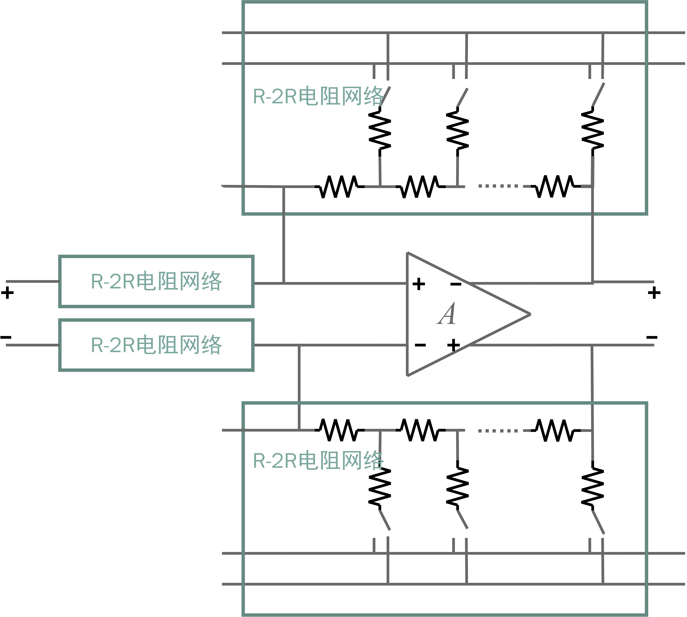<figcaption aria-hidden="true">基于双 8-bit R-2R 网络的 PGA 增益调节原理图</figcaption></figure>

对于标准 8-bit R-2R 电阻网络，当其作为电流输出型数字电位器使用时，其等效跨阻与输入的 8-bit 数字控制字 $D$（取值范围 $1 \sim 255$）成反比。 若设基准电阻为 $R$，对于输入端 R-2R 网络，其受控等效输入电阻 $R_g(D_g)$ 为： $$R_g(D_g) = \frac{2^8 \cdot R}{D_g} = \frac{256 R}{D_g}$$

同理，对于反馈端 R-2R 网络，其受控等效反馈电阻 $R_f(D_f)$ 为： $$R_f(D_f) = \frac{2^8 \cdot R}{D_f} = \frac{256  R}{D_f}$$

在全差分反相放大结构中，闭环电压增益 $A_v$ 由反馈系数决定： $$A_v = \frac{V_{\mathrm{out\pm}}}{V_{\mathrm{in\pm}}} = \frac{R_f(D_f)}{R_g(D_g)}$$

将等效电阻公式代入，可得最终的增益控制方程： $$A_v = \frac{\frac{256 R}{D_f}}{\frac{256 R}{D_g}} = \frac{D_g}{D_f}$$

这一数学架构极其优美：通过分别配置两个 8-bit 寄存器的值 $D_g$ 和 $D_f$，系统闭环增益可以实现从最小 $1/255$（当 $D_g=1, D_f=255$ 时）到最大 $255$（当 $D_g=255, D_f=1$ 时）的超宽范围覆盖，且能实现极其精细的分数阶步进。

## 增益与电阻网络设计

在 $180\,\mathrm{nm}$ 工艺下，14-bit 的精度要求 PGA 的增益误差必须严格控制在 $\le 0.01\%$ 以内。这给 R-2R 网络的设计带来了极大的版图匹配与开关非线性挑战。

<figure>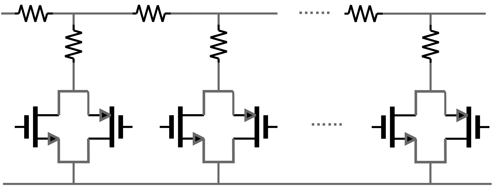<figcaption aria-hidden="true">R-2R 梯形网络与开关阵列协同设计图</figcaption></figure>

**1. 导通电阻（$R_{\mathrm{on}}$）非线性抑制：** R-2R 网络中，控制支路通断的 CMOS 传输门（Transmission Gate）存在导通电阻 $R_{\mathrm{on}}$。若 $R_{\mathrm{on}}$ 随电压波动，将引入严重的谐波失真（THD）。 设计中，必须保证 R-2R 梯形网络每一级支路的总电阻保持严格的二进制比例关系。因此，所有开关管的尺寸（$W/L$）必须按照 $1:2:4:\dots:128$ 的比例进行**二进制加权（Binary-Weighted Sizing）**，使得等效 $R_{\mathrm{on}}$ 也呈二进制递减，并将其等效值吸收到对应的 $2R$ 电阻设计中，从而在根源上消除增益误差。

**2. 无源器件匹配：** 采用高精度的多晶硅（Poly）电阻实现 $R$ 与 $2R$。为了抵抗芯片表面的应力梯度与热梯度扩散，版图设计中强制要求将两组 8-bit R-2R 网络采用**共源共栅交叉匹配（Common-Centroid）**布局，并在四周添加充裕的 Dummy 电阻。前文仿真结果显示，在极端的全增益域扫描下，最大误差依然 $<0.01\%$，证明该电阻网络设计逻辑是完全自洽且成功的。

## 后级负载驱动能力考虑

PGA 的输出端直接驱动 SAR ADC 的电容数模转换器（CDAC）阵列，其等效单端负载高达 $40\,\mathrm{pF}$。这对 PGA 的输出充放电能力与大信号建立提出了严酷的考验。

### 输出建立时间

在 $1\,\mathrm{MS/s}$ 采样率下，ADC 分配给前端的追踪（Tracking）窗口通常不足 $1\,\mathrm{\mu s}$。PGA 的输出建立过程由**压摆阶段（Slewing）**和**线性建立阶段（Linear Settling）**两部分组成。

大信号跳变时，运放首先进入压摆受限状态，其压摆时间 $t_{\mathrm{slew}}$ 为： $$t_{\mathrm{slew}} = \frac{\Delta V_{\mathrm{out}}}{\mathrm{SR}}$$ 本设计中 PGA 压摆率 $\mathrm{SR} = 200\,\mathrm{V/\mu s}$，对于 $3\,\mathrm{V}$ 的满量程阶跃，压摆耗时仅需 $15\,\mathrm{ns}$。

随后运放进入线性建立阶段，建立至给定误差带 $\epsilon$ 所需的时间为： $$t_{\mathrm{linear}} = -\tau \ln(\epsilon) = -\frac{1}{2\pi \cdot f_{-3\mathrm{dB}}} \ln\left(\frac{0.5}{2^{14}}\right) \approx 10.4 \tau$$ 综合仿真测得总建立时间 $t_s = 800\,\mathrm{ns}$。扣除压摆时间后，系统时间常数 $\tau$ 极为优秀，证明运放在驱动 $40\,\mathrm{pF}$ 负载时不仅具备强大的瞬态电流吞吐能力（$I_{\mathrm{tail}} = \mathrm{SR} \cdot C_c$），也具备足够的闭环带宽。

### 环路稳定性

双 R-2R 架构带来的最大挑战在于：**反馈系数 $\beta$ 会随增益设定发生剧烈变化。** $$\beta = \frac{R_g(D_g)}{R_g(D_g) + R_f(D_f)} = \frac{1}{1 + A_v} = \frac{D_f}{D_f + D_g}$$

这里存在两种极端稳定性边界条件：

1.  **最大增益状态（$A_v = 255$）：** 此时 $\beta \approx 1/256$。闭环带宽发生严重收缩（$f_{-3\mathrm{dB}} = \beta \cdot \mathrm{GBW}$）。必须确保核心运放的 GBW 足够高，才能使得收缩后的带宽仍满足 $\ge 700\,\mathrm{kHz}$ 的系统要求。

2.  **最小增益状态（$A_v = 1/255$）：** 此时 $\beta \approx 1$，放大器处于最危险的单位增益跟随状态。这是**相位裕度（Phase Margin, PM）的最恶劣情况**。

为了兼顾这两种极端情况，PGA 的核心放大器必须采用重度密勒补偿，将次主极点（Non-dominant Pole）远远推至 GBW 之外，确保在 $\beta=1$ 时仍能维持 $>60^\circ$ 的健康相位裕度，防止大负载下产生自激振荡。

## 电路拓扑

为了在 $3.3\,\mathrm{V}$ 单电源下驱动巨大的 $40\,\mathrm{pF}$ CDAC 容性负载，同时满足系统对超高线性度与极低稳态误差的苛刻需求，本 PGA 模块的核心运算放大器**直接复用了前文详细论述的“两级全差分放大器（FDA）”**。

<figure><figcaption aria-hidden="true">复用前置 FDA 核心结合双 R-2R 网络的 PGA 闭环拓扑结构</figcaption></figure>

该 FDA 核心采用“折叠共源共栅（Folded-Cascode）第一级 + 共源放大（Common-Source）第二级”的经典两级架构。将其应用于 PGA 中具有以下决定性优势：

1.  **极致的稳态精度：** 该 FDA 具备高达 $138\,\mathrm{dB}$ 的直流开环增益。在 PGA 配置为极高闭环增益（如 $255\times$，此时反馈系数 $\beta$ 极小）时，庞大的开环增益依然能将闭环静态误差（$\approx 1/A\beta$）压缩至远低于 14-bit 量化台阶的水平，确保了大范围增益调节下的绝对准确度。

2.  **强悍的驱动与压摆：** FDA 内部充沛的尾电流与第二级偏置电流，不仅将本底热噪声压制在 $5\,\mathrm{nV/\sqrt{Hz}}$，更为 PGA 提供了 $200\,\mathrm{V/\mu s}$ 的巨大差分压摆率，完美支撑了驱动后级大电容阵列时的瞬态大信号建立。

3.  **共模基线死锁：** PGA 整体环路继续沿用了该 FDA 内嵌的高带宽连续时间共模反馈（CMFB）模块。在 PGA 动态切换 R-2R 网络阵列，或遭受前级（TIA）传入的共模基线漂移时，CMFB 环路能够瞬间响应，将差分输出中心电压严格钳位并死锁在目标基准 $1.65\,\mathrm{V}$，防止 ADC 动态量程被共模偏移所侵蚀。

## 设计指标

经过上述推导与拓扑层面的优化设计，结合实际的瞬态与交流仿真验证，本可编程增益放大器（PGA）模块的最终达成指标汇总如表<a href="#tab:pga_final_specs" data-reference-type="ref" data-reference="tab:pga_final_specs">7.1</a>所示：

<a id="tab:pga_final_specs"></a>

| **设计关键指标项** | **设计/仿真达成值**                           | **工程意义与备注**                                                          |
|:-------------------|:----------------------------------------------|:----------------------------------------------------------------------------|
| 架构类型           | 双 8-bit R-2R 反馈                            | 实现等效电阻的倒数关系，达成极宽增益覆盖。                                  |
| 系统增益调节范围   | $1/255 \sim 255\,\mathrm{V/V}$                | 匹配工业复杂多变的前端传感器信号。                                          |
| 满量程增益步进误差 | $\le 0.01\%$                                  | 严格限制了传输门 $R_{\mathrm{on}}$ 对二进制加权的影响，保障 14-bit 线性度。 |
| 静态中心输出共模   | $1.65\,\mathrm{V}$                            | 由独立的高增益 CMFB 环路锁死。                                              |
| 等效输入积分噪声   | $67\,\mathrm{\mu V_{rms}}$ (@ $1\times$)      | 底噪纯净，折算至 TIA 前端后对总信噪比无影响。                               |
| 大信号差分压摆率   | $200\,\mathrm{V/\mu s}$ (@ $40\,\mathrm{pF}$) | 驱动级静态电流充沛，无惧沉重开关电容冲击。                                  |
| 大信号阶跃建立时间 | $800\,\mathrm{ns}$ ($\pm 0.5\,\mathrm{LSB}$)  | 满足 $1\,\mathrm{MS/s}$ SAR ADC 的追踪相（Tracking Phase）时序。            |

PGA 模块最终设计与仿真指标汇总


# 自举采样开关（Bootstrapped Sampling Switch）

## 设计挑战与指标分解

采样开关的线性度与建立精度直接决定了ADC能否实现12-bit的有效位数。为保证设计裕量， 采样开关在2 MS/s的采样率下需驱动后级CDAC阵列约100 pF的等效容性负载（单端）。 若采用普通NMOS开关或传输门，其导通电阻 $R_{\text{on}}$ 将随输入信号幅度 $V_{\text{in}}$ 变化。

根据 NMOS 线性区导通电阻公式 $$R_{\text{on}} = \frac{1}{\mu_n C_{ox} \frac{W}{L} \left(V_{GS} - V_{TH}\right)}$$ 当 $V_{\text{in}}$ 在 $0 \sim V_{DD}$ 范围内扫描时，$V_{GS} = V_{DD} - V_{\text{in}}$ 从 $3.3\,\text{V}$ 下降至接近 $V_{TH}$， $R_{\text{on}}$ 的变化幅度可达一个数量级以上。这种输入依赖的电阻调制效应将在采样电容上引入与信号幅度相关的建立误差， 由此引发的谐波失真对14-bit SAR ADC所要求的 SFDR（$\ge 90\,\text{dB}$）和 THD（$\le -88\,\text{dB}$）指标构成严重制约。

此外，普通NMOS开关还面临体效应（Body Effect）导致的 $V_{TH}$ 调制问题。 在标准 NMOS 中，衬底通常接至 $V_{SS}$。当源极电压随输入信号变化时，$V_{SB} \neq 0$ 将引发 $V_{TH}$ 升高， 进一步加剧 $R_{\text{on}}$ 的非线性。因此，本设计在采样开关 M4 的选型与偏置上采用了针对性的优化策略。

基于系统级 2 MS/s 采样率和 100 pF 负载的设计约束，可推导采样开关的导通电阻上限。 采样窗口约占时钟周期的 40%，即 $T_{\text{sample}} \approx 200\,\text{ns}$。 14-bit 精度要求采样电压在窗口内建立至 $\pm 0.5\,\text{LSB}$ 以内，所需时间常数个数为： $$N_{\tau} = \ln\left(\frac{2^{14}}{0.5}\right) = \ln\left(2^{15}\right) \approx 10.4\,\tau$$ 由此得到最大允许的时间常数： $$\tau_{\text{max}} = \frac{T_{\text{sample}}}{N_{\tau}} \approx \frac{200\,\text{ns}}{10.4} \approx 19.2\,\text{ns}$$ 结合 100 pF 的负载电容，导通电阻上限为： $$R_{\text{on,max}} = \frac{\tau_{\text{max}}}{C_L} = \frac{19.2\,\text{ns}}{100\,\text{pF}} \approx 192\,\Omega$$ 考虑PVT全工艺角下的性能退化以及建立过程中的非线性余量，本设计将目标导通电阻进一步收紧至 $< 60\,\Omega$， 同时要求自举电压在采样期间维持 $V_{GS} > 3.0\,\text{V}$ 且变化幅度小于 5%。

综上，自举采样开关的核心设计指标分解如表 <a href="#tab:boot_spec" data-reference-type="ref" data-reference="tab:boot_spec">8.1</a> 所示。

<a id="tab:boot_spec"></a>

| **指标项**               | **目标参数**                              | **设计考量与备注**                               |
|:-------------------------|:------------------------------------------|:-------------------------------------------------|
| 导通电阻 $R_{\text{on}}$ | $< 60\,\Omega$                            | TT角27°C典型值，PVT全角下保证100pF负载14-bit建立 |
| 自举电压 $V_{GS}$        | $> 3.0\,\text{V}$（采样期内变化 $< 5\%$） | 基于Abo-Temes结构的VGS恒定机制                   |
| 开关ENOB                 | $> 16\,\text{Bits}$                       | 独立开关+理想后级仿真，Monte Carlo验证           |
| 关断隔离度               | $> 100\,\text{dB}$                        | 保持阶段M4栅极被可靠下拉至GND                    |
| 栅氧可靠性               | 所有 $V_{GS}, V_{GD} \le 3.6\,\text{V}$   | TSMC 180nm 3.3V器件长期可靠运行上限              |

自举采样开关核心设计指标分解


<span id="tab:boot_spec" label="tab:boot_spec">\[tab:boot\_spec\]</span>

## 核心拓扑及关键指标

### 自举原理

自举（Bootstrapping）技术的核心思想是在采样阶段将M4的栅极与源极之间的电压差维持为恒定值， 从原理上消除 $V_{GS}$ 与输入信号 $V_{\text{in}}$ 的依赖关系。 具体而言：将预充电容 $C_{\text{boot}}$ 在保持阶段充电至 $V_{DD}$，在采样阶段将其跨接于M4的栅-源两端。 此时栅极电压被同步抬升至 $V_{\text{in}} + V_{DD}$，$V_{GS} \approx V_{DD}$ 在采样窗口内近似恒定。 该机制使得M4始终工作于高 $V_{GS}$、低 $R_{\text{on}}$ 的深线性区， 且 $R_{\text{on}}$ 在全输入范围内保持高度恒定，从而从物理机制上消除了普通开关的Ron调制非线性。

### 拓扑结构

如图 <a href="#fig:sch.bootstrap" data-reference-type="ref" data-reference="fig:sch.bootstrap">8.1</a> 所示。

<figure>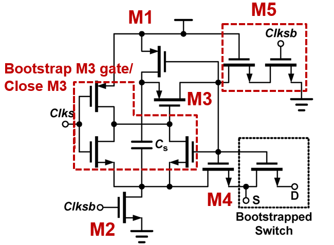<figcaption aria-hidden="true">采样开关拓扑结构</figcaption></figure>

电路工作分为两个阶段：

**预充电阶段（保持态，Clks=0, Clksb=1）：** $C_{\text{boot}}$ 的两端分别通过辅助管接至 $V_{DD}$ 和 GND，被预充电至 $V_{DD} \approx 3.3\,\text{V}$。 同时M4的栅极经关断管被可靠拉至GND，M4处于截止状态，输入信号与后级采样电容隔离。

**采样阶段（采样态，Clks=1, Clksb=0）：** $C_{\text{boot}}$ 被切换至跨接于M4的栅-源两端，构成悬浮电压源。 由于 $C_{\text{boot}} \gg C_{gs}$，采样期间 $C_{\text{boot}}$ 向M4栅极寄生电容 $C_{gs}$ 的电荷转移量极小， $V_{GS} \approx V_{DD}$ 在整个采样窗口内保持恒定。 M4栅极电压被自举至 $V_{\text{in}} + V_{DD}$，使其强导通，以极低的 $R_{\text{on}}$ 将输入信号传递至采样电容。

## 具体设计参数

### M4 采样开关管尺寸与深N阱设计

M4的尺寸选择是Ron与电荷注入之间的关键折中。导通电阻公式为： $$R_{\text{on}} = \frac{1}{\mu_n C_{ox} \frac{W}{L} \left(V_{GS} - V_{TH}\right)}$$ 在 TSMC 180nm 工艺的 3.3V NMOS 器件（nmos3v）中，$\mu_n C_{ox} \approx 180\,\mu\text{A/V}^2$， $V_{TH} \approx 0.7\,\text{V}$。在自举条件下 $V_{GS} \approx 3.3\,\text{V}$，代入目标 $R_{\text{on}} < 60\,\Omega$： $$\frac{W}{L} > \frac{1}{\mu_n C_{ox} \cdot R_{\text{on}} \cdot (V_{GS} - V_{TH})} \approx \frac{1}{180 \times 10^{-6} \times 60 \times (3.3 - 0.7)} \approx 35.6$$ 取 $L = 0.35\,\mu\text{m}$（3.3V器件最小沟道长度），则 $W > 12.5\,\mu\text{m}$。 实际设计中需考虑PVT工艺角下 $\mu_n$ 下降与 $V_{TH}$ 上升的复合效应， 以及小尺寸下版图匹配的影响。本设计最终选取： $$\left(\frac{W}{L}\right)_{\text{M4}} = \frac{64\,\mu\text{m}}{0.35\,\mu\text{m}} \approx 183$$ 对应的TT角理论导通电阻约为： $$R_{\text{on,TT}} \approx \frac{1}{180 \times 10^{-6} \times 183 \times 2.6} \approx 11.7\,\Omega$$ 远低于60 Ω的设计上限，为SS角低温等极端工艺条件下提供了充分的Ron设计裕量。

在此基础上，本设计进一步采用 **深N阱工艺（nmos3vdnw）** 对M4进行衬底隔离。 在标准NMOS中，P型衬底统一接至 $V_{SS}$，导致 $V_{SB} = V_{\text{in}}$ 随输入信号变化， 通过体效应使 $V_{TH}$ 产生额外调制： $$V_{TH} = V_{TH0} + \gamma\left(\sqrt{2\phi_F + V_{SB}} - \sqrt{2\phi_F}\right)$$ 该体效应引发的 $V_{TH}$ 变化将在自举开关的恒定 $V_{GS}$ 框架中引入独立的Ron非线性来源。 深N阱工艺在P型衬底中嵌入隔离的深N阱层，将M4所在的P-well与外层P-substrate电气隔离， 从而允许将M4的衬底端子直接连接至源极（而非 $V_{SS}$）。 此时 $V_{SB} = 0$ 在任意输入电压下恒成立，从物理机制上消除了体效应对 $V_{TH}$ 和 $R_{\text{on}}$ 的影响， 使得采样开关的线性度仅受自举电路自身电荷保持能力的限制。

### 自举电容 $C_{\text{boot}}$ 的设计

$C_{\text{boot}}$ 的容值选择面临下限与上限的双重约束。

**下限约束——电荷保持能力：** 在采样阶段，$C_{\text{boot}}$ 上存储的电荷 $Q_{\text{boot}} = C_{\text{boot}} \cdot V_{DD}$ 会部分转移至M4的栅-源寄生电容 $C_{gs}$， 导致 $V_{GS}$ 从 $V_{DD}$ 跌落。由电荷守恒： $$\Delta V_{GS} = V_{DD} \cdot \frac{C_{gs}}{C_{\text{boot}} + C_{gs}}$$ 要求 $\Delta V_{GS} < 5\% \cdot V_{DD}$，即 $V_{GS}$ 不低于 3.135 V，则有： $$\frac{C_{gs}}{C_{\text{boot}} + C_{gs}} < 0.05 \quad \Rightarrow \quad C_{\text{boot}} > 19 \cdot C_{gs}$$ M4的栅-源寄生电容可估算为 $C_{gs} \approx \frac{2}{3} W L C_{ox}$。 3.3V器件的单位面积栅氧电容 $C_{ox} \approx 4.6\,\text{fF}/\mu\text{m}^2$，代入M4尺寸： $$C_{gs} \approx \frac{2}{3} \times 64 \times 0.35 \times 4.6 \approx 68.7\,\text{fF}$$ 因此 $C_{\text{boot}} > 19 \times 68.7 \approx 1.3\,\text{pF}$。

**上限约束——预充电速度：** $C_{\text{boot}}$ 的预充电时间常数 $\tau_{\text{pre}} = R_{\text{on,pre}} \cdot C_{\text{boot}}$ 必须远小于预充电窗口时间 （非采样阶段约 300 ns）。若预充电通路开关的 $R_{\text{on,pre}} \approx 500\,\Omega$，则： $$\tau_{\text{pre}} = 500 \times 1.3 \times 10^{-12} = 0.65\,\text{ns}$$ 远小于预充电窗口时间，预充电时间裕量充分。

综合电荷保持与预充电速度的折中，本设计选用 MIM 电容 $C_{\text{boot}} \approx 1.5\,\text{pF}$， 较最小需求提供约15%的设计裕量。MIM电容具有极低的电压系数和温度系数，有助于在PVT变化下维持自举电压的稳定。

### 辅助管设计要点

除M4外，自举环路中的辅助管承担着预充电通路、栅极关断、悬浮节点隔离等关键职能：

1.  **预充电通路开关管：** 需保证 $R_{\text{on}}$ 足够低，使 $C_{\text{boot}}$ 在预充电窗口内充分充电至 $V_{DD}$。 同时需考虑其关断时的电荷注入对 $C_{\text{boot}}$ 上存储电荷的干扰，适当选用较小尺寸或引入dummy开关进行抵消。

2.  **M4栅极关断管：** 在保持阶段将M4栅极可靠下拉至GND。其关断漏电流需远小于M4的亚阈值泄漏， 否则采样电容上的电荷将在保持阶段缓慢泄漏，导致采样电压漂移。

3.  **栅极浮接隔离管：** 在采样阶段，M4栅极被自举至 $V_{\text{in}} + V_{DD}$ 的高压。 所有与该节点相连且处于关断态的管子，其栅-漏/栅-源电压均可能超出3.6V的长期可靠工作范围。 设计中需确保这些管子在浮接高压节点侧使用源/漏极作为隔离。

所有辅助管均选用 TSMC 180nm 3.3V 器件（nmos3v/pmos3v），在保证耐压能力的同时兼顾开关速度。

### 栅氧可靠性分析

自举开关在可靠性方面的固有设计约束在于：采样阶段M4的栅极电压被抬升至 $V_{\text{in}} + V_{DD}$， 当 $V_{\text{in}}$ 接近满量程上限时，栅极电压可达约 $1.65 + 1.5 + 3.3 \approx 6.45\,\text{V}$（差分信号正向端）。 虽然 3.3V 器件的物理栅氧击穿电压通常在 7–8 V 以上，但长期可靠性（TDDB, Time-Dependent Dielectric Breakdown） 要求稳态工作电压不超过3.6V。

本设计中的关键防护策略如下：

1.  M4自身：$V_{GS} \approx V_{DD} \approx 3.3\,\text{V}$（自举保证），$V_{GD} = V_G - V_D$， 通过合理的时序设计确保最恶劣的电压差仍在3.6V以内。

2.  辅助管：所有可能承受跨栅高压的管子均通过源/漏极承受高压差，栅极偏置在安全范围内。

3.  深N阱隔离（M4）：除消除体效应外，深N阱还额外提供了一层与P-substrate之间的反向PN结隔离， 避免了高压浮动节点通过衬底耦合引发闩锁（Latch-up）风险。

## 设计中的关键问题与解决方法

### SS工艺角与低温下的导通电阻退化

在Pre-Layout PVT仿真中，SS工艺角（Slow NMOS + Slow PMOS）结合 $-40^\circ\text{C}$ 低温条件观察到最显著的 $R_{\text{on}}$ 退化。 其物理根源在于：

1.  SS角下 $\mu_n$ 显著下降（载流子迁移率偏低），直接降低了M4的导通能力。

2.  低温下 $V_{TH}$ 升高，进一步压缩了有效过驱动电压 $V_{GS} - V_{TH}$。

应对策略为：在TT角下将 $R_{\text{on}}$ 设计得远低于上限（11.7   vs. 60 ）， 确保TT$\rightarrow$SS退化约 $3\times$ 后仍满足 $R_{\text{on}} < 60\,\Omega$ 的约束。 PVT全角仿真验证结果表明，SS/−40°C下Ron仍满足设计指标。

### 电荷注入与时钟馈通的抑制

M4在采样结束时由导通转为关断，沟道中积累的反型层电荷向源/漏两端泄放， 其中流向采样电容的部分构成电荷注入误差。对于尺寸较大的M4（$W = 64\,\mu\text{m}$）， 沟道电荷总量 $Q_{ch} = W L C_{ox} (V_{GS} - V_{TH})$ 不可忽略。 在本设计的全差分架构中，P端与N端的采样开关对称布置， 电荷注入在差分模式下表现为共模扰动，其差模分量因对称性而显著衰减。 此外，时钟馈通可通过在M4的栅-漏/栅-源间引入较小的dummy管或优化时钟边沿速率加以抑制。

### 自举节点瞬态过压

在预充电阶段向采样阶段切换的瞬间，$C_{\text{boot}}$ 下端从GND跳变至 $V_{\text{in}}$， 其上端（即M4栅极）因电容耦合作用产生相应的高压跳变。 若切换时序未精确对齐，可能出现瞬态过压尖峰。 本设计通过优化各辅助开关管的控制时序，确保切换过程平稳过渡。 瞬态仿真结果表明，所有节点电压均未超出3.6V的可靠性上限。

# 比较器（Comparator）

## 设计挑战与指标分解

比较器是 SAR ADC 中决定单次量化精度与速度的核心模块。 在 14-bit 分辨率下，1LSB 对应的差分电压仅为约 $201.41\,\mu\text{V}$， 这对比较器的等效输入参考噪声（IRN）提出了严苛的要求。 同时，比较器满足 SAR ADC 整体 $1\,\text{MS/s}$ 采样率下的多周期量化时序需求，留出裕量， 要求比较器能够在 60 MHz 的时钟频率下稳定完成比较与复位操作， 传统的强臂 （StrongARM，SA）比较器以其零静态功耗和高能效在 SAR ADC 中被广泛采用。 然而，SA 比较器采用单一尾电流管同时为输入预放大和交叉耦合锁存提供偏置电流， 导致以下问题：

1.  **设计自由度受限**：输入对管的跨导 $g_m$ 与锁存管的尺寸共享同一条电流支路， 预放大增益与再生速度无法独立优化。

2.  **回踢（Kick-back） 噪声较大**：锁存器再生过程中输出节点的大幅电压摆幅通过 输入管的栅-漏寄生电容 $C_{gd}$ 直接耦合回输入端，干扰前级 CDAC 电容阵列的建立精度。 在 14-bit 精度下，这种回踢效应会显著恶化比较器输入端残余电压的精确性。

3.  **失调电压的累积**：输入对管和锁存对管的阈值失配同时作用于同一电流路径， 等效输入失调电压（Offset）的双重贡献使得版图匹配设计的难度增大。

双尾动态比较器（Double-CLK，DT）由 Schinkel 等人于 2007 年提出， 通过将预放大级与锁存级分离为两个独立电流支路。 在本设计中，选取该拓扑的主要考量如下： （1）两级独立尾电流管的设计提供了分别优化噪声（第一级）与再生速度（第二级）的自由度； （2）预放大级在锁存级与输入端之间提供了隔离缓冲，显著降低了 回踢 噪声； （3）预放大级和锁存级仅需 12 个晶体管，结构简洁，版图紧凑。

结合系统指标（表 <a href="#tab:system_spec" data-reference-type="ref" data-reference="tab:system_spec">1.1</a>、表 <a href="#tab:sar_adc_spec" data-reference-type="ref" data-reference="tab:sar_adc_spec">1.4</a>），比较器的核心设计指标分解如表 <a href="#tab:comp_spec_breakdown" data-reference-type="ref" data-reference="tab:comp_spec_breakdown">9.1</a> 所示。

<a id="tab:comp_spec_breakdown"></a>

| **指标项**                           | **目标参数**                        | **设计考量与备注**                                                                  |
|:-------------------------------------|:------------------------------------|:------------------------------------------------------------------------------------|
| 输入参考噪声（IRN）                  | $\le 104\,\mu\text{V}_{\text{rms}}$ | 约 $1/2\,\text{LSB}$（$92\,\mu\text{V}$）留出器件失配裕量，确保噪声不成为 ENOB 瓶颈 |
| 比较延迟 ($T_{\text{cmp}}$)          | $< 2\,\text{ns}$                    | 60 MHz 时钟下半周期为 8.3 ns，留有充裕时序裕量                                      |
| 复位延迟 ($T_{\text{CLKB}}$)         | $< 2\,\text{ns}$                    | 同上，确保下一比较周期前完全复位                                                    |
| 锁存时间常数 ($\tau_{\text{latch}}$) | $< 100\,\text{ps}$                  | 表征再生阶段指数增长速度，决定小输入信号下的最差比较延迟                            |
| 单次比较能耗                         | $< 25\,\text{pJ}$                   | 平衡功耗与噪声，确保 ADC 总动态功耗控制在预算内                                     |
| 电源电压 ($V_{\text{DD}}$)           | 3.3 V                               | 与系统统一，最大化 SNR 的动态范围裕量                                               |

双尾比较器核心设计指标分解


<span id="tab:comp_spec_breakdown" label="tab:comp_spec_breakdown">\[tab:comp\_spec\_breakdown\]</span>

## 核心拓扑与工作原理

### 电路拓扑

本设计采用的双尾比较器拓扑如图 <a href="#fig:comp_double_CLK" data-reference-type="ref" data-reference="fig:comp_double_CLK">9.1</a> 所示。 电路由两级构成：第一级为预放大级（Pre-Amplifier Stage），第二级为锁存级（Latch Stage）， 后接 1 级反相器用以提供一定驱动能力。

<figure>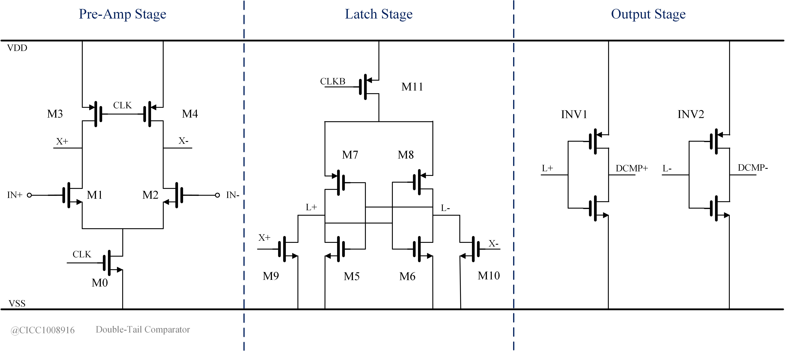<figcaption aria-hidden="true">双尾动态比较器电路拓扑</figcaption></figure>

1.  **预放大级**：由 NMOS 输入差分对管 $M_1$、$M_2$ 及其尾电流管 $M_0$ 组成。 $M_0$ 的栅极由时钟信号 $\text{CLK}$ 控制，决定预放大级的导通与关断。 输入对管的漏极经负载管（PMOS）将差分输入电压转换为差分电流， 在内部节点 $X_P$、$X_N$ 上建立起初始差分电压 $\Delta V_X$。 预放大级的增益 $A_v$ 由输入对管跨导 $g_{m1}$ 与输出节点等效阻抗 $R_{o1}$ 之积决定： $$A_v \approx g_{m1} \cdot R_{o1}$$

2.  **锁存级**：由第二级尾电流管 $M_{11}$、 受 $M_1$、$M_2$ 驱动的 NMOS 隔离缓冲管以及交叉耦合的 反相器 锁存对管构成。 $M_{11}$ 的栅极由时钟信号 $\text{CLKB}$ 控制。 当 $\text{CLKB}$ 为高电平时，锁存级处于复位状态，输出节点 $L_P$、$L_N$ 被上拉至 $V_{\text{DD}}$； 当 $\text{CLKB}$ 由高跳低后，锁存级释放复位，正反馈环路将 $\Delta V_X$ 的微小差异快速放大至轨到轨。 再生阶段的输出电压增长遵循指数规律： $$\Delta V_L(t) \approx \Delta V_X(0) \cdot e^{t / \tau_{\text{latch}}}$$ 其中 $\tau_{\text{latch}}$ 为锁存时间常数，近似为： $$\tau_{\text{latch}} \approx \frac{C_L}{g_{m,\text{eff}}}$$ $C_L$ 为输出节点的负载电容，$g_{m,\text{eff}}$ 为交叉耦合对管的等效跨导。

3.  **输出级**：每个输出端口连接一个反相器对锁存级输出 $L_P$、$L_N$ 进行整形， 提供陡峭的转换边沿和全摆幅数字输出 $\text{DCMPP}$、$\text{DCMPN}$。

### 时钟时序约束

双尾比较器对两级时钟的相位关系有较严格的要求。 两条时钟线 $\text{CLK}$（控制预放大级）和 $\text{CLKB}$（控制锁存级）的时序关系必须满足：

1.  $M_0$ 应先于 $M_{11}$ 导通，确保预放大级在 $X_P$、$X_N$ 上建立起足够的初始差分电压 $\Delta V_X$ 后，锁存级才开始再生。 若 $M_{11}$ 过早导通，锁存级提前因为失调而发生锁存。

2.  $M_0$ 应在 $M_{11}$ 关断之后关断。这是因为锁存级复位过程中，$L_P$、$L_N$ 被同时上拉至高电平， 若此时预放大级仍未关断，$X_P$、$X_N$ 将通过负载管耦合复位瞬态干扰至输入端，增加不必要的 回踢 分量。 预放大级在锁存完成后再关断，也有助于保持 $X_P$、$X_N$ 节点在再生期间的低阻抗驱动。

上述时序约束可以通过由多级级联反相器构成的延迟线与NAND、INV逻辑门实现。 在 60 MHz 时钟下，$\text{CLK}$ 信号的上升沿领先 $\text{CLKB}$ 信号的下降沿约 500 ps， 为预放大级提供了充足的积分时间；而 $\text{CLK}$ 的下降沿落后于 $\text{CLKB}$ 的上升沿， 确保锁存级在完全复位后预放大级才退出工作状态。

## 设计参数与噪声分析

### 晶体管尺寸设计

在本设计的 180 nm 3.3 V CMOS 工艺下，速度并非瓶颈——比较器的总延迟（$< 2\,\text{ns}$）远小于 60 MHz 时钟的半个周期（8.3 ns）。因此，设计重心落在输入参考噪声的压制与版图失配的鲁棒性上。

1.  **输入对管（$M_1$、$M_2$）**：为降低等效输入热噪声，输入对管需具备尽可能高的跨导 $g_{m1}$。 根据 MOS 管热噪声谱密度公式 $V_{n,\text{th}}^2 = 8kT/(3g_m)$，增大 $g_m$ 是压制噪声的核心手段。 在饱和区，$g_m \propto \sqrt{I_D \cdot W/L}$，因此输入对管采用较大宽长比 $W/L$， 同时配合适当的尾电流 $I_{\text{CLK}1}$，在功耗允许范围内最大化 $g_{m1}$。 输入对管的面积（$W \times L$）也兼顾了阈值失配 $\sigma_{V_{\text{th}}} \propto 1/\sqrt{WL}$ 的抑制需求， 以确保工艺涨落下的失调电压可控。

2.  **预放大级负载管**：采用 PMOS 管作为有源负载，其等效阻抗 $R_{o1}$ 决定了预放大级的增益 $A_v$。 适中的 $A_v$（通常数倍至十余倍）即可将锁存级的等效输入噪声除以 $A_v^2$ 后忽略不计， 同时避免了过大增益导致的带宽衰减和 $X_P$、$X_N$ 节点摆幅过大（可能引入非线性）。

3.  **锁存级对管**：锁存级 NMOS 对管的尺寸选取需平衡 $g_{m,\text{eff}}$（决定 $\tau_{\text{latch}}$） 与沟道电荷注入效应。交叉耦合 PMOS 对管提供正反馈再生能力，其尺寸影响 $\tau_{\text{latch}}$ 和静态漏电。 在 60 MHz 的中等时钟频率下，对 $\tau_{\text{latch}}$ 的要求较为宽松（$< 100\,\text{ps}$）， 锁存管尺寸无需过大，有利于降低整体功耗。

4.  **尾电流管（$M_{\text{CLK}1}$、$M_{\text{CLK}2}$）**：尾电流管的过驱动电压 $V_{\text{ov}}$ 决定了其在导通状态下的电流能力以及关断状态下的泄漏水平。 设计保证尾电流管在导通时工作在饱和区，为对应级提供稳定的偏置电流； 在关断时处于深度截止（$V_{\text{GS}} \ll V_{\text{th}}$），确保无静态功耗。

### 输入参考噪声分析

比较器的噪声性能直接关系到 14-bit SAR ADC 能否达到设计分辨率。 在本设计的预放大-锁存两级架构中，锁存级的器件噪声经预放大级增益 $A_v$ 的平方衰减后折算至输入端， 其贡献可忽略不计。因此，比较器的输入参考噪声由预放大级主导。

预放大级的主要噪声源包括：

1.  输入对管 $M_1$、$M_2$ 的沟道热噪声：$\overline{V_{n,\text{in}}^2} \approx 2 \times \frac{8kT}{3g_{m1}} \cdot \Delta f$

2.  尾电流管 $M_{\text{CLK}1}$ 的热噪声（共模分量，经差分对称结构大幅抑制）

3.  负载管的热噪声贡献（等效至输入端时除以 $g_{m1}^2$，通常较小）

在比较器工作于动态模式的场景下，噪声不能用传统的稳态频域方法完整描述， 而是体现为一个时变的积分过程。在 Cadence Spectre 中采用 PSS + PNoise 仿真 对不同差分输入幅度下的输出噪声进行瞬态噪声积分，得到等效输入参考噪声 IRN。 表 <a href="#tab:comp_irn" data-reference-type="ref" data-reference="tab:comp_irn">9.2</a> 给出了典型工艺角（tt，27°C，$V_{\text{DD}}=3.3\,\text{V}$）下， 不同差分输入幅度对应的 IRN 仿真结果。

<a id="tab:comp_irn"></a>

| 输入差分幅度 $V_{\text{in,dm}}$ | IRN ($\mu\text{V}_{\text{rms}}$) |
|:--------------------------------|:--------------------------------:|
| 50 mV                           |              79.39               |
| 100 mV                          |              79.36               |
| 200 mV                          |              78.68               |
| 400 mV                          |              77.32               |

不同输入差分幅度下的等效输入参考噪声（典型条件）


<span id="tab:comp_irn" label="tab:comp_irn">\[tab:comp\_irn\]</span>

由表可见，IRN 在不同输入摆幅下表现出一致性（约 $78\sim79\,\mu\text{V}_{\text{rms}}$）， 均显著优于 $104\,\mu\text{V}$ 的设计限值，为系统的 ENOB 提供了充裕的噪声裕量。

## 仿真验证与性能评估

### PVT 工艺角仿真

为验证比较器在工业级工作条件（$-40^\circ\text{C} \sim 125^\circ\text{C}$，$3.0\sim3.6\,\text{V}$ 供电） 及工艺偏差下的鲁棒性，对 tt/ff/ss/fs/sf 五个工艺角进行了全面的 PVT 仿真。 表 <a href="#tab:comp_pvt" data-reference-type="ref" data-reference="tab:comp_pvt">9.3</a> 归纳了关键指标在 Nominal 及各极端角的仿真结果。

<a id="tab:comp_pvt"></a>

| **指标**                                | **Nominal** | **Min** | **Max** | **Min 角** | **Max 角** | **Spec** |
|:----------------------------------------|:-----------:|:-------:|:-------:|:----------:|:----------:|:--------:|
| 比较延迟 $T_{\text{cmp}}$ (ps)          |    919.2    |  669.5  |  1157   |     BC     |    Hot     | $< 2000$ |
| 复位延迟 $T_{\text{CLKB}}$ (ps)         |    879.2    |  635.3  |  1082   |     BC     |    Hot     | $< 2000$ |
| 锁存 $\tau_{\text{latch}}$ (ps)         |    62.7     |  43.8   |  78.8   |     BC     |    Hot     | $< 100$  |
| IRN @100mV ($\mu\text{V}_{\text{rms}}$) |    79.4     |  67.0   |  88.9   |     BC     |    Hot     | $< 104$  |
| 平均电流 ($\mu\text{A}$)                |    343.1    |  281.9  |  417.8  | WCLowtemp  | MaxLeakage | $< 500$  |
| 功耗 (mW)                               |    1.13     |  0.85   |  1.50   | WCLowtemp  | MaxLeakage | $< 1.5$  |

双尾比较器 PVT 关键指标汇总


<span id="tab:comp_pvt" label="tab:comp_pvt">\[tab:comp\_pvt\]</span>

PVT 仿真结果表明：

1.  比较延迟在最坏情况（Hot：高温、慢工艺角）下为 1.16 ns，仍远小于 2 ns 的指标，时序裕量充足。

2.  IRN 在全 PVT 范围内（67.0–88.9 $\mu$V）均低于 104 $\mu$V 的设计上限， 在 BC（最佳工艺角、低温）条件下 IRN 最低（67.0 $\mu$V）， 在 Hot 条件下 IRN 最高（88.9 $\mu$V），这是高温下 $g_m$ 退化及热噪声增大的预期结果。

3.  最大功耗（1.50 mW）出现在 MaxLeakage 角（ff 工艺、高温），但仍控制在预算范围内。

### 蒙特卡洛失配分析

在 180 nm 工艺中，器件的随机失配（Mismatch）是影响比较器精度的关键因素。 基于 100 点蒙特卡洛（Monte Carlo）仿真，分别对 process-only 与 mismatch 联合分布进行了统计分析。 表 <a href="#tab:comp_mc" data-reference-type="ref" data-reference="tab:comp_mc">9.4</a> 列出了关键指标的均值（Mean）与标准差（$\sigma$）。

<a id="tab:comp_mc"></a>

| **指标**                   | **均值 (Mean)** | **标准差 ($\sigma$)** |          **单位**          |
|:---------------------------|:---------------:|:---------------------:|:--------------------------:|
| 比较延迟 $T_{\text{cmp}}$  |      915.7      |         30.72         |             ps             |
| 复位延迟 $T_{\text{CLKB}}$ |      875.9      |         24.59         |             ps             |
| 比较传播延迟 (Delay\_cmp)  |      1216       |         38.55         |             ps             |
| 复位传播延迟 (Delay\_CLKB) |      1417       |         39.34         |             ps             |
| 锁存 $\tau_{\text{latch}}$ |      62.4       |         1.74          |             ps             |
| IRN @100mV                 |      79.12      |         0.18          | $\mu\text{V}_{\text{rms}}$ |
| 单次能耗 (EnergyPerSa)     |      18.85      |         0.24          |             pJ             |
| 功耗 (Power)               |      1.13       |         0.015         |             mW             |

蒙特卡洛仿真统计结果（100 点，mismatch + process, Nominal 条件）


<span id="tab:comp_mc" label="tab:comp_mc">\[tab:comp\_mc\]</span>

蒙特卡洛分析表明：

1.  IRN 的统计离散度极低（$\sigma = 0.18\,\mu\text{V}$）， 说明输入对管的噪声特性对工艺失配不敏感，预放大级增益足够压制后级噪声的失配贡献。

2.  比较延迟与复位延迟的标准差分别约为 31 ps 和 25 ps， 在 60 MHz 时钟下半周期（8.3 ns）中所占比例极小，不会造成时序违约。

3.  锁存时间常数 $\tau_{\text{latch}}$ 的统计分布集中（$\sigma = 1.74\,\text{ps}$）， 交叉耦合对管的跨导匹配良好，再生速度一致性高。

4.  单次能耗的 $\sigma/\mu$ 比率仅为 1.3%，显示了比较器在动态功耗上的高度一致性。

### 性能汇总

表 <a href="#tab:comp_perf_summary" data-reference-type="ref" data-reference="tab:comp_perf_summary">9.5</a> 归纳了本设计双尾比较器在典型条件（tt，27°C，3.3 V）下的核心性能参数。

<a id="tab:comp_perf_summary"></a>

| **参数**                             | **数值**         |          **单位**          |
|:-------------------------------------|:-----------------|:--------------------------:|
| 工艺节点                             | TSMC 180 nm CMOS |             –              |
| 器件类型                             | nmos3v / pmos3v  |             –              |
| 电源电压                             | 3.3              |             V              |
| 工作时钟                             | 60               |            MHz             |
| 比较延迟 ($T_{\text{cmp}}$)          | 0.92             |             ns             |
| 复位延迟 ($T_{\text{CLKB}}$)         | 0.88             |             ns             |
| 锁存时间常数 ($\tau_{\text{latch}}$) | 62.7             |             ps             |
| 输入参考噪声 (IRN)                   | 79.4             | $\mu\text{V}_{\text{rms}}$ |
| 平均电流                             | 343              |       $\mu\text{A}$        |
| 功耗                                 | 1.13             |             mW             |
| 单次比较能耗                         | 18.9             |             fJ             |

双尾比较器核心性能汇总（典型条件）


<span id="tab:comp_perf_summary" label="tab:comp_perf_summary">\[tab:comp\_perf\_summary\]</span>

综合以上分析，本设计所采用的双尾比较器在 60 MHz 工作频率下， 以 1.13 mW 的功耗实现了 79.4 $\mu\text{V}$ 的等效输入参考噪声和 0.92 ns 的比较延迟， 全面满足 14-bit SAR ADC 对比较器在噪声、速度与功耗三个维度的设计指标。

# 电容数字模拟转换器（CDAC）

在 14-bit 高精度逐次逼近型模数转换器（SAR ADC）中，电容数字模拟转换器（CDAC）不仅承担着输入信号的采样保持（Sample & Hold）功能，还在逐次逼近过程中充当本地参考电压的数模转换核心。CDAC 的本底噪声、电容匹配精度以及开关的充放电建立时间，直接决定了整个 ADC 的信噪比（SNR）、无杂散动态范围（SFDR）以及最高采样速率。

## 电路拓扑

标准的 14-bit 二进制加权 CDAC 需要 $2^{14} = 16384$ 个单位电容（$C_0$），这会导致极其庞大的版图面积，不仅带来致命的寄生电容问题，还会给前级驱动（PGA/缓冲器）造成难以承受的容性负载压力。因此，本设计采用了**带分段桥接电容（Bridge Capacitor）的全差分 CDAC 拓扑**。

<figure>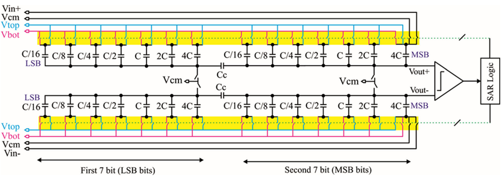<figcaption aria-hidden="true">14-bit 全差分分段式 CDAC 阵列拓扑结构[2]</figcaption></figure>

如图<a href="#fig:cdac_topology" data-reference-type="ref" data-reference="fig:cdac_topology">10.1</a>所示，全差分架构能够天然抑制共模噪声及开关的偶次电荷注入与时钟馈通效应。左右两极差分网络完全对称，采用高位（MSB）与低位（LSB）分段结构，中间通过桥接电容 $C_b$ 耦合，从而将总物理电容数量压减了数个数量级，极大减轻了前端 PGA 的驱动负担。

## 噪声分析

在 14-bit 精度下，CDAC 阵列的 $kT/C$ 热噪声是限制系统信噪比（SNR）的根本物理屏障。在采样阶段，开关的导通电阻 $R_{\mathrm{on}}$ 与采样电容阵列共同构成一阶低通网络，其折算到电容上的采样热噪声功率为： $$\overline{v_{n,C}^2} = \frac{k_B T}{C_{\mathrm{total}}}$$ 其中，$k_B$ 为玻尔兹曼常数，$T$ 为绝对温度，$C_{\mathrm{total}}$ 为单边 CDAC 阵列的总采样电容。

对于 14-bit、满量程差分输入范围为 $V_{\mathrm{FSR}} = 2 V_{\mathrm{ref}}$ 的系统，其理想量化噪声功率为： $$\overline{v_{q}^2} = \frac{V_{\mathrm{LSB}}^2}{12} = \frac{1}{12} \left( \frac{2 V_{\mathrm{ref}}}{2^{14}} \right)^2$$ 为了防止 $kT/C$ 噪声吞噬有效的量化位数（ENOB），通常要求采样热噪声功率小于量化噪声功率的一半（或四分之一）。由此可以反推出单边 CDAC 总电容 $C_{\mathrm{total}}$ 的下限约束： $$C_{\mathrm{total}} \ge 24 k_B T \left( \frac{2^{14}}{2 V_{\mathrm{ref}}} \right)^2$$ 根据此公式计算，在室温（$300\,\mathrm{K}$）及特定参考电压下，确立了系统的最小单位电容 $C_0$ 的取值。

## 电容分段桥接技术

为了缓解总电容面积爆炸，系统将 14-bit 阵列拆分为高 $M$ 位（主 DAC）和低 $L$ 位（子 DAC），即 $M+L = 14$。串联在两者之间的桥接电容 $C_b$ 必须满足严格的串联等效关系。 为了使高低位无缝衔接，从高位端看向低位端，整个低位阵列外加桥接电容的总等效电容必须等于一个高位单位电容（$C_0$）。根据串联分压公式： $$\frac{1}{C_b} + \frac{1}{C_{\mathrm{LSB\_total}}} = \frac{1}{C_0}$$ 假设低位阵列为 $L$ 位标准的二进制电容阵列，其总电容为 $C_{\mathrm{LSB\_total}} = 2^L C_0$，则理想桥接电容为： $$C_b = C_0 \cdot \frac{2^L}{2^L - 1}$$ 由于 $C_b$ 呈现非整数倍特性（分数电容），在版图实现中极易产生工艺失配。本设计采用了伪单位电容拼接或特定的非二进制冗余（Redundancy）权重分配来吸收桥接电容的边缘毛刺误差，保障系统不会出现非单调性（Missing Code）。

## 电容切换技术

传统的 SAR ADC 切换方法（如基于地的切换）在每次位测试（Bit Cycling）时需要消耗大量的开关动态能量，并在参考电压源（$V_{\mathrm{ref}}$）上引起剧烈的电流抽取（Current Kickback）。 本设计采用了 **$V_{\mathrm{cm}}$（共模基准）切换技术（$V_{\mathrm{cm}}$-based Switching）**。

<figure>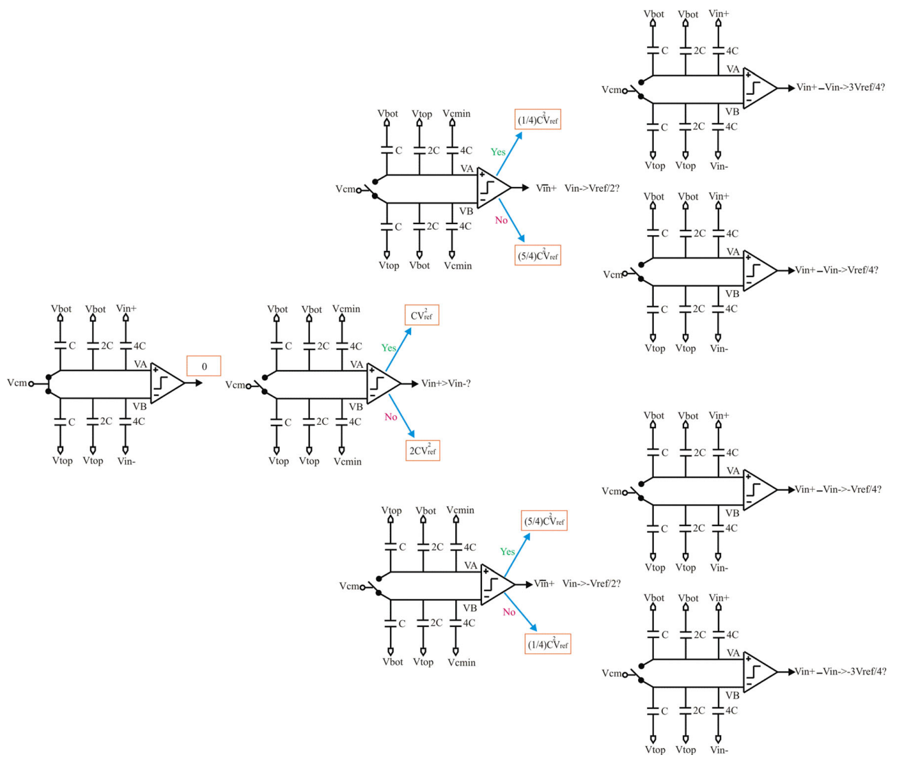<figcaption aria-hidden="true"><span class="math inline"><em>V</em><sub><em>c</em><em>m</em></sub></span> 切换时序与等效电路图解[2]</figcaption></figure>

在采样相，CDAC 的下极板全部接入输入信号，上极板短接至共模电平 $V_{\mathrm{cm}}$（通常为 $V_{\mathrm{ref}}/2$）。在首次逼近（MSB 判断）时，高位电容无需进行物理开关动作，而是直接比较采样保持后的顶板电平，这不仅节省了 MSB 的判断时间，更相比传统架构节省了约 $87.5\%$ 的动态开关能量。整个转换过程中的总开关能量消耗 $E_{\mathrm{total}}$ 大幅降低为： $$E_{\mathrm{total}} = \sum_{i=1}^{13} C_i (\Delta V_i)^2$$ 此切换方案极大地缓解了基准电压缓冲器（Reference Buffer）的供电压力，保障了高频转换下的建立精度。

## 充放电时间分析

SAR ADC 在逐次逼近阶段，受数字逻辑控制的 CMOS 传输门需要快速切换，对 CDAC 中的特定电容网络（$C_L$）进行充放电。如果建立时间不足，将引起严重的动态非线性误差。为了精确优化传输门的尺寸并评估 RC 建立时间，本设计采用了一种基于线性回归的 CMOS 传输门宏模型。

该宏模型将传输门的充放电过程等效为一个离散时间系统： $$V_o(z) = \frac{a_0 + a_1 z^{-1} + a_2 z^{-2} + \dots}{b_0 + b_1 z^{-1} + b_2 z^{-2} + \dots} V_{in}(z)$$

通过 Z 逆变换与回归分析，可将其转化为离散时间域的计算公式，输出电压 $V_0(t_n)$ 由当前输入、历史输入以及历史输出的线性组合决定： $$V_0(t_n) = c_0 + c_1 V_{in}(t_n) + c_2 V_{in}(t_{n-1}) + c_3 V_{in}(t_{n-2}) + c_4 V_0(t_{n-1}) + c_5 V_0(t_{n-2}) + e_n$$

其中，极其关键的是，模型中的系数 $c_i$（$i=0,1,\dots,5$）是传输门晶体管宽长比（$S$）与所驱动的负载电容（$C_L$）的非线性函数： $$f_i(C_L,S) = K_{0i} + K_{1i}S + K_{2i}C_L + K_{3i}SC_L + K_{4i}\frac{S}{C_L} + K_{5i}\frac{C_L}{S} + K_{6i}\log\left(\frac{S}{C_L}\right)$$

为了简化参数提取，该宏模型假设传输门中的 PMOS 和 NMOS 具有相同的宽长比（$S$）。仿真证明，当负载电容与开关尺寸的比值 $C_L/S < 0.1$ 时，该数学模型输出的波形与底层 SPICE 瞬态仿真结果高度吻合。

在 14-bit CDAC 的实际设计中，由于高位电容（如 MSB）极大，而低位电容（LSB）极小，所面对的 $C_L$ 跨度极大。利用上述宏模型，我们避免了繁重的 SPICE 蒙特卡洛迭代，通过代数计算直接为阵列中的每一位电容分配了最佳的开关宽长比 $S$。这使得无论哪一位切换，其等效阻容常数 $\tau \approx R_{\mathrm{on}}(S) \cdot C_L$ 均能保证在分配的位循环（Bit-Cycling）时间窗口内完成 $> 14 \tau$ 的充放电建立（稳态误差 $< \frac{1}{2^{14}}$）。

## 设计指标

结合上述拓扑选型与基于宏模型的瞬态建立优化，本系统 CDAC 的核心参数设计指标如表<a href="#tab:cdac_final_specs" data-reference-type="ref" data-reference="tab:cdac_final_specs">10.1</a>所示：

<a id="tab:cdac_final_specs"></a>

| **设计参数**                      | **配置目标 / 计算值**         | **备注说明**                  |
|:----------------------------------|:------------------------------|:------------------------------|
| 系统分辨率                        | 14-bit                        | SAR ADC 全局指标              |
| 电容阵列架构                      | 桥接分段式 (Segmented)        | 降低总面积与驱动负载          |
| 开关切换策略                      | $V_{\mathrm{cm}}$ (共模) 切换 | 消除 MSB 判断时间，降低功耗   |
| 单位电容 ($C_0$)                  | 待填 $\mathrm{fF}$            | 满足 $kT/C$ 热噪声下限约束    |
| 单边总电容 ($C_{\mathrm{total}}$) | 待填 $\mathrm{pF}$            | 包含高低位及桥接等效电容      |
| 开关尺寸比例 ($C_L/S$)            | $< 0.1$                       | 保障基于宏模型的建立精度      |
| 单步位建立时间                    | $\le$ 待填 $\mathrm{ns}$      | 保留充足建立裕度（$>14\tau$） |

14-bit 全差分 CDAC 核心设计指标


# 逐次逼近控制逻辑（SAR Logic）

## 全差分双极性SAR转换原理

### 差分输入与输出编码目标

本设计面向14位全差分双极性SAR ADC，输入差分电压定义为： $$V_{\mathrm{in,diff}} = V_{\mathrm{inp}} - V_{\mathrm{inn}}.$$

与单极性SAR ADC不同，本设计需要同时支持正向差分输入和负向差分输入。因此，数字输出采用offset binary编码方式，将输入范围$-V_{\max}$至$+V_{\max}$映射到14位无符号码字： $$-V_{\max} \rightarrow 14'h0000,\quad
    0^- \rightarrow 14'h1FFF,\quad
    0^+ \rightarrow 14'h2000,\quad
    +V_{\max} \rightarrow 14'h3FFF.$$

因此，SAR Logic内部不再直接把比较器每一位判决结果写入`dout[13:0]`，而是先通过预比较判断输入差分正负，再进行13位幅值搜索，最终根据符号和幅值生成14位输出码： $$D_{\mathrm{out}} =
    \begin{cases}
    14'h2000 + \texttt{mag\_code}, & V_{\mathrm{in,diff}} \ge 0,\\
    14'h1FFF - \texttt{mag\_code}, & V_{\mathrm{in,diff}} < 0.
    \end{cases}$$ 其中，`mag_code[12:0]`为SAR逐次逼近得到的13位幅值码。

### 采样结构导致的比较器极性反转

本ADC中，输入信号并不是直接施加在比较器两个输入端，而是通过最高位采样电容的另一侧极板进行采样。在采样结束后，采样电容切换到共模电压$V_{\mathrm{CM}}$，比较器输入端电压由电荷重分配产生。

由于这种采样结构，原始输入差分极性与保持后比较器输入端的电压极性相反。若比较器输出定义为： $$\texttt{comp}=0 \Rightarrow V_p > V_n,\qquad
    \texttt{comp}=1 \Rightarrow V_n > V_p,$$ 则对于正向差分输入$V_{\mathrm{inp}}>V_{\mathrm{inn}}$，保持后比较器输入端表现为$V_p<V_n$，因此比较器输出为`comp=1`。同理，对于负向差分输入$V_{\mathrm{inp}}<V_{\mathrm{inn}}$，保持后比较器输入端表现为$V_p>V_n$，因此比较器输出为`comp=0`。

所以，在本SAR Logic中，预比较得到的符号判断为： $$\texttt{search\_positive} = \texttt{comp\_latched}.$$ 即`comp_latched=1`表示$V_{\mathrm{in,diff}}>0$，`comp_latched=0`表示$V_{\mathrm{in,diff}}<0$。

### 正向与负向逐次逼近策略

由于输入具有正负两个方向，本设计采用两套对称的SAR搜索方式。对于正向输入，正式采样前CDAC低13位基准为： $$\texttt{pol[12:0]} = 13'h0000.$$ 正式保持结束后，首先将最高幅值位`pol[12]`置1，进行MSB trial。若当前bit已经试探置1，则比较器输出含义为：`comp_latched=1`表示$V_n>V_p$、补偿量仍不足，当前bit保留为1；`comp_latched=0`表示$V_p>V_n$、补偿量过大，当前bit回退为0。因此正向输入的保留条件为： $$\texttt{pos\_keep} = \texttt{comp\_latched}.$$

对于负向输入，正式采样前CDAC低13位基准为： $$\texttt{pol[12:0]} = 13'h1FFF.$$ 正式保持结束后，首先将最高幅值位`pol[12]`清0，进行MSB trial。若当前bit已经试探清0，则`comp_latched=0`表示$V_p>V_n$、仍未过冲，当前bit保持为0；`comp_latched=1`表示$V_n>V_p$、已经过冲，当前bit恢复为1。因此负向输入的保留条件为： $$\texttt{neg\_keep} = \sim \texttt{comp\_latched}.$$

正负向SAR搜索规则如表<a href="#tab:bipolar_sar_rule" data-reference-type="ref" data-reference="tab:bipolar_sar_rule">11.1</a>所示。

<a id="tab:bipolar_sar_rule"></a>

| 输入方向 | 当前trial动作 | 比较器输出 | SAR动作                         |
|:---------|:--------------|:-----------|:--------------------------------|
| 正向     | 当前bit置1    | `comp=1`   | 未补够，当前bit保留1，下一位置1 |
| 正向     | 当前bit置1    | `comp=0`   | 过冲，当前bit回退0，下一位置1   |
| 负向     | 当前bit清0    | `comp=0`   | 未补够，当前bit保持0，下一位清0 |
| 负向     | 当前bit清0    | `comp=1`   | 过冲，当前bit恢复1，下一位清0   |

正负向SAR逐位逼近规则


## SAR核心状态机设计

### 状态定义

加入双极性预比较后，SAR核心状态机由传统的采样、保持、比较、更新流程扩展为带预采样的结构。主状态机定义如表<a href="#tab:bipolar_fsm_state" data-reference-type="ref" data-reference="tab:bipolar_fsm_state">11.2</a>所示。

<a id="tab:bipolar_fsm_state"></a>

| 状态名               | 编码   | 功能说明                                           |
|:---------------------|:-------|:---------------------------------------------------|
| `ST_IDLE`            | `4’d0` | 空闲状态，等待`enable`有效                         |
| `ST_PRE_SAMPLE`      | `4’d1` | 预采样状态，`vcm_sw`打开，`pol`全0                 |
| `ST_PRE_TOP_RELEASE` | `4’d2` | 预采样非交叠释放，`vcm_sw`关闭但MSB采样电容仍接VIN |
| `ST_PRE_HOLD`        | `4’d3` | 预保持状态，MSB采样电容切至VCM，等待节点稳定       |
| `ST_PRE_CMP`         | `4’d4` | 预比较状态，判断输入差分正负                       |
| `ST_SAMPLE`          | `4’d5` | 正式采样状态，根据预比较结果设置正/负采样基准      |
| `ST_TOP_RELEASE`     | `4’d6` | 正式采样非交叠释放状态                             |
| `ST_HOLD`            | `4’d7` | 正式保持状态，并在结束时施加bit12 trial            |
| `ST_SAR_BIT`         | `4’d8` | 逐位SAR状态，内部由`sar_phase`控制比较和更新       |
| `ST_DONE`            | `4’d9` | 转换完成，输出`done`并释放`busy`                   |

双极性SAR核心FSM状态定义


由于状态数量超过8个，状态寄存器必须使用4位宽：

```
reg [3:0] state;
```

若仍使用3位状态寄存器，则`ST_SAR_BIT=4’d8`会被截断为`3’d0`，导致状态机错误跳回`ST_IDLE`，引起`vcm_sw`频繁翻转、CDAC控制毛刺和输出码异常。

### 状态转移流程

双极性SAR状态转移流程如图<a href="#fig:bipolar_fsm_flow" data-reference-type="ref" data-reference="fig:bipolar_fsm_flow">11.1</a>所示。

<figure>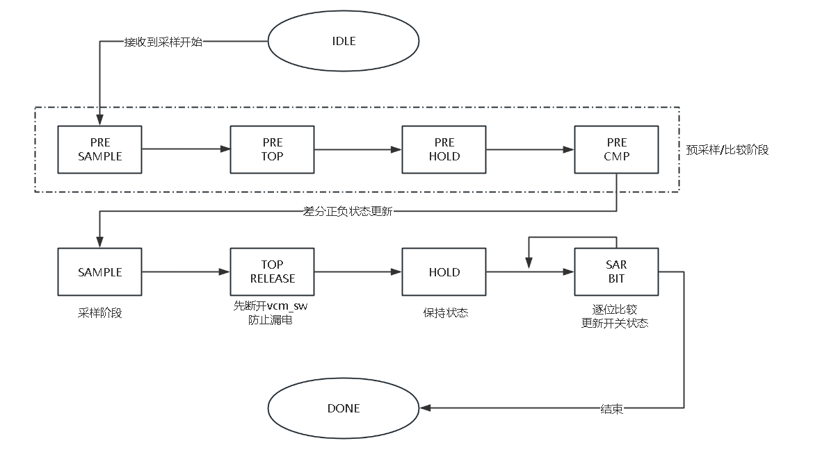<figcaption aria-hidden="true">双极性SAR状态机流程</figcaption></figure>

### SPI接口配置时序

SPI配置接口用于在转换前写入工作模式、采样时间、建立时间、比较时间以及连续转换使能等控制位。其时序图适合放置在状态机说明之后、具体采样状态说明之前，因为该位置能够先交代数字接口如何装载寄存器，再说明寄存器参数如何影响后续SAR状态转移。SPI协议时序如图<a href="#fig:sar_spi_timing" data-reference-type="ref" data-reference="fig:sar_spi_timing">11.2</a>所示。

<figure>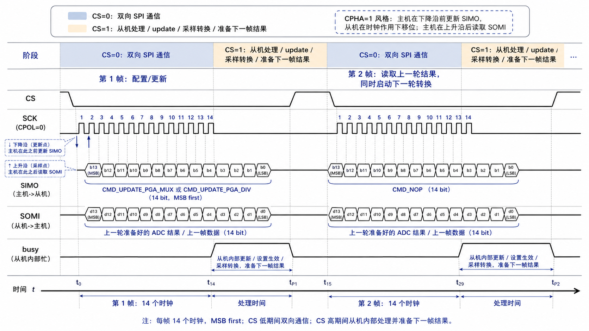<figcaption aria-hidden="true">SPI寄存器配置协议时序图</figcaption></figure>

### 预采样状态

在`ST_PRE_SAMPLE`状态中，SAR Logic执行一次只用于符号判断的预采样。此时`vcm_sw`打开，最高位采样电容连接到VIN，低13位CDAC控制字全部置0： $$\texttt{vcm\_sw}=1,\qquad
    \texttt{cmp\_en}=0,\qquad
    \texttt{pol[12:0]}=13'h0000.$$ 该状态的作用是使输入差分电压通过采样电容写入比较器输入相关节点，为后续预比较建立正确的电荷状态。由于这只是符号判断阶段，不进行任何SAR bit trial。

### 预采样非交叠释放状态

在`ST_PRE_TOP_RELEASE`状态中，逻辑首先关闭`vcm_sw`，但最高位采样电容仍保持连接VIN： $$\texttt{vcm\_sw}=0,\qquad
    \texttt{cap[13]} \rightarrow V_{\mathrm{IN}}.$$ 该状态用于实现非交叠时序，使共模开关先完全关断，再进行后续采样电容切换。这样可以避免由于`vcm_sw`关断较慢，使采样电荷通过共模通路泄放。

### 预保持状态

在`ST_PRE_HOLD`状态中，最高位采样电容由VIN切换至VCM： $$\texttt{cap[13]} \rightarrow V_{\mathrm{CM}}.$$ 此时`vcm_sw`保持关闭，比较器输入端形成由预采样电荷重分配得到的保持电压。逻辑在该状态等待`SETTLE_TIME+1`个时钟周期，使比较器输入节点和CDAC网络完成建立。

### 预比较状态

在`ST_PRE_CMP`状态中，逻辑拉高`cmp_en`使能同步比较器，并在时钟下降沿锁存比较器输出。由于比较器为同步比较器，其输出必须在下降沿采样。为了避免比较器关闭后无效输出覆盖有效结果，`comp_latched`只在`cmp_en=1`时更新：

```
always @(negedge clk or negedge rst_n) begin
    if (!rst_n) begin
        comp_latched <= 1'b0;
    end else if (cmp_en) begin
        comp_latched <= comp;
    end
end
```

预比较完成后，根据`comp_latched`决定正式采样所使用的CDAC基准：

```
search_positive <= comp_latched;

if (comp_latched) begin
    pol <= {1'b0, 13'h0000};  // positive formal sampling baseline
end else begin
    pol <= {1'b0, 13'h1FFF};  // negative formal sampling baseline
end
```

### 正式采样与保持状态

预比较完成后，ADC进入正式采样流程。该流程包含正式采样、非交叠释放和正式保持三个状态。在`ST_SAMPLE`状态中，`vcm_sw`打开，最高位采样电容连接VIN。此时低13位`pol`已经由预比较结果设定： $$\text{正向输入：}\quad \texttt{pol[12:0]}=13'h0000,$$ $$\text{负向输入：}\quad \texttt{pol[12:0]}=13'h1FFF.$$

采样部分时序图适合放置在此处，因为该图直接对应正式采样、非交叠释放、保持以及第12位trial施加的先后关系，如图<a href="#fig:sar_sample_timing" data-reference-type="ref" data-reference="fig:sar_sample_timing">11.3</a>所示。

<figure>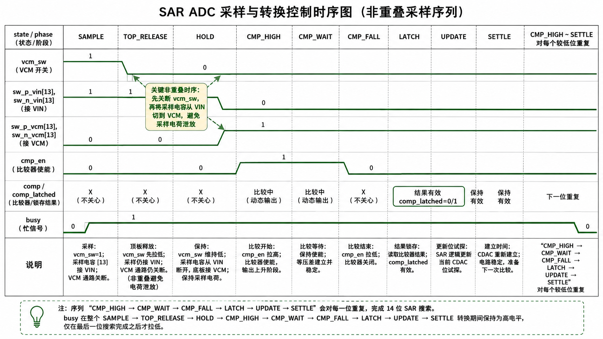<figcaption aria-hidden="true">正式采样、保持与MSB trial时序图</figcaption></figure>

需要强调的是，第12位trial不能在`ST_SAMPLE`之前或`ST_SAMPLE`中提前施加，否则MSB trial会被采样过程吸收，导致第一位比较异常。因此，第12位trial在`ST_HOLD`结束后才施加：

```
if (search_positive) begin
    pol[12] <= 1'b1;  // positive: trial set MSB
end else begin
    pol[12] <= 1'b0;  // negative: trial clear MSB
end
```

这样可以保证bit12是正式保持后的第一次CDAC变化。

### 逐位SAR子状态

为了减少主状态数量，13位幅值搜索统一放在`ST_SAR_BIT`状态中，并由子状态`sar_phase`控制。每一位转换包含三个阶段，如表<a href="#tab:sar_phase" data-reference-type="ref" data-reference="tab:sar_phase">11.3</a>所示。

<a id="tab:sar_phase"></a>

| 子状态      | 编码   | 功能说明                                |
|:------------|:-------|:----------------------------------------|
| `PH_SETTLE` | `2’d0` | 等待CDAC切换后模拟节点稳定              |
| `PH_CMP`    | `2’d1` | 拉高`cmp_en`，等待同步比较器输出        |
| `PH_UPDATE` | `2’d2` | 根据`comp_latched`更新`pol`和`mag_code` |

SAR逐位子状态说明


在`PH_UPDATE`阶段，正向输入和负向输入采用不同的更新规则：

```
assign pos_keep = comp_latched;
assign neg_keep = ~comp_latched;
assign cur_keep = search_positive ? pos_keep : neg_keep;
```

对于正向输入，当前bit的trial值为1：

```
if (search_positive) begin
    if (pos_keep) begin
        pol[bit_idx] <= 1'b1;
    end else begin
        pol[bit_idx] <= 1'b0;
    end

    if (bit_idx != 4'd0) begin
        pol[bit_idx-1] <= 1'b1;
    end
end
```

对于负向输入，当前bit的trial值为0：

```
else begin
    if (neg_keep) begin
        pol[bit_idx] <= 1'b0;
    end else begin
        pol[bit_idx] <= 1'b1;
    end

    if (bit_idx != 4'd0) begin
        pol[bit_idx-1] <= 1'b0;
    end
end
```

`mag_code`则根据当前bit是否保留更新：

```
assign bit_mask = (13'd1 << bit_idx);

assign mag_next = cur_keep ?
                  (mag_code |  bit_mask) :
                  (mag_code & ~bit_mask);
```

当`bit_idx=0`时，13位幅值搜索完成，逻辑生成最终14位offset binary结果：

```
if (search_positive) begin
    dout <= 14'h2000 + {1'b0, mag_next};
end else begin
    dout <= 14'h1FFF - {1'b0, mag_next};
end
```

## CDAC开关编码设计

### 二位选择编码

每个CDAC单元由2 bit选择编码控制其连接目标，如表<a href="#tab:cdac_sel_bp" data-reference-type="ref" data-reference="tab:cdac_sel_bp">11.4</a>所示。

<a id="tab:cdac_sel_bp"></a>

| 选择编码 | Verilog宏  | 物理连接含义       |
|:---------|:-----------|:-------------------|
| `2’b00`  | `SEL_VBOT` | 下参考端或低参考端 |
| `2’b01`  | `SEL_VTOP` | 上参考端或高参考端 |
| `2’b10`  | `SEL_VCM`  | 共模电压端         |
| `2’b11`  | `SEL_VIN`  | 输入采样端         |

CDAC二位选择编码


`cap_p_sel`和`cap_n_sel`均为28位，对应14个电容单元，每个单元占用2位： $$\texttt{cap\_p\_sel[2i+1:2i]},\quad
    \texttt{cap\_n\_sel[2i+1:2i]},\quad i=0,1,\cdots,13.$$

### 低13位差分互补切换

低13位电容，即$i=0\sim12$，由`pol[i]`控制。其连接关系为： $$\begin{cases}
\texttt{pol[i]}=1: & C_{p,i}\rightarrow V_{\mathrm{TOP}},\quad C_{n,i}\rightarrow V_{\mathrm{BOT}},\\
\texttt{pol[i]}=0: & C_{p,i}\rightarrow V_{\mathrm{BOT}},\quad C_{n,i}\rightarrow V_{\mathrm{TOP}}.
\end{cases}$$

Verilog编码如下：

```
for (i = 0; i < 13; i = i + 1) begin
    pol_eff = CDAC_REVERSE ? ~pol[i] : pol[i];

    cap_p_sel[2*i +: 2] = pol_eff ? SEL_VTOP : SEL_VBOT;
    cap_n_sel[2*i +: 2] = pol_eff ? SEL_VBOT : SEL_VTOP;
end
```

其中，`CDAC_REVERSE`用于修正实际CDAC方向与数字逻辑定义不一致的情况。如果正负输入均出现逼近方向相反，可通过翻转该参数调整物理开关方向。

### 最高位采样/共模单元控制

最高编号电容单元$i=13$不参与13位幅值搜索，而作为采样和共模切换单元。预采样、预释放、正式采样和正式释放阶段接VIN；预保持、预比较、正式保持、SAR逐位逼近和完成阶段接VCM： $$\begin{cases}
\texttt{ST\_PRE\_SAMPLE},\texttt{ST\_PRE\_TOP\_RELEASE},
\texttt{ST\_SAMPLE},\texttt{ST\_TOP\_RELEASE}: 
& C_{13}\rightarrow V_{\mathrm{IN}},\\
\text{其他状态}: 
& C_{13}\rightarrow V_{\mathrm{CM}}.
\end{cases}$$

对应Verilog逻辑为：

```
if ((state == ST_PRE_SAMPLE)      ||
    (state == ST_PRE_TOP_RELEASE) ||
    (state == ST_SAMPLE)          ||
    (state == ST_TOP_RELEASE)) begin

    cap_p_sel[27:26] = SEL_VIN;
    cap_n_sel[27:26] = SEL_VIN;

end else begin

    cap_p_sel[27:26] = SEL_VCM;
    cap_n_sel[27:26] = SEL_VCM;

end
```

### One Hot开关译码

`cdac_switch_encoder_bp`将2 bit选择编码转换为One Hot开关控制信号： $$\texttt{SEL\_VBOT} \rightarrow \texttt{sw\_*\_vbot[i]}=1,\quad
    \texttt{SEL\_VTOP} \rightarrow \texttt{sw\_*\_vtop[i]}=1,$$ $$\texttt{SEL\_VCM} \rightarrow \texttt{sw\_*\_vcm[i]}=1,\quad
    \texttt{SEL\_VIN} \rightarrow \texttt{sw\_*\_vin[i]}=1.$$ 其中`*`表示`p`端或`n`端。译码器在组合逻辑开始时清零所有输出，再根据每个电容单元的选择编码置位对应开关，从而保证每个电容单元在理想数字逻辑中仅连接一个目标电压端。

## 转换时间与采样率估算

### 单次转换周期

一次完整双极性SAR转换包含预比较流程、正式采样流程和13位幅值搜索流程。预比较阶段包含预采样、预释放、预保持和预比较；正式采样阶段包含正式采样、正式释放和正式保持；每一位SAR搜索包含建立、比较和更新。

令$N_s=\texttt{SAMPLE\_TIME}+1$，$N_t=\texttt{TOP\_RELEASE\_TIME}+1$，$N_{\mathrm{set}}=\texttt{SETTLE\_TIME}+1$，$N_c=\texttt{COMP\_TIME}+1$。若幅值搜索位数为13，则总周期数近似为： $$\begin{aligned}
N_{\mathrm{total}}
&= (N_s+N_t+N_{\mathrm{set}}+N_c)
 +(N_s+N_t+N_{\mathrm{set}})\\
&\quad +13\left(N_{\mathrm{set}}+N_c+1\right)+1.
\end{aligned}$$ 其中最后的$+1$对应`ST_DONE`状态。

### 默认参数下的采样率

若默认参数取： $$\texttt{SAMPLE\_TIME}=4,\quad \texttt{SETTLE\_TIME}=2,$$ $$\texttt{TOP\_RELEASE\_TIME}=1,\quad \texttt{COMP\_TIME}=1,$$ 且系统时钟为$f_{\mathrm{clk}}=50\,\mathrm{MHz}$，则预比较阶段周期数为： $$N_{\mathrm{pre}} = 5 + 2 + 3 + 2 = 12.$$ 正式采样阶段周期数为： $$N_{\mathrm{sample}} = 5 + 2 + 3 = 10.$$ 每一位SAR搜索周期数为： $$N_{\mathrm{bit}} = 3 + 2 + 1 = 6.$$ 13位幅值搜索周期数为： $$N_{\mathrm{SAR}} = 13 \times 6 = 78.$$ 因此单次转换总周期数为： $$N_{\mathrm{total}} = 12 + 10 + 78 + 1 = 101.$$ 对应转换时间为： $$T_{\mathrm{conv}} =
    \frac{101}{50\,\mathrm{MHz}}
    = 2.02\,\mu s.$$ 理论最大采样率为： $$f_{\mathrm{s,max}} =
    \frac{50\,\mathrm{MHz}}{101}
    \approx 495\,kS/s.$$ 相比不带预比较的单向SAR逻辑，完整预采样式预比较会增加约12个时钟周期，但能够显著提高双极性输入下的符号判断可靠性，避免负向输入被错误输出为`14’h2000`，或正向输入被错误输出为`14’h1FFF`。

## 关键Verilog片段

### 比较器下降沿锁存

```
always @(negedge clk or negedge rst_n) begin
    if (!rst_n) begin
        comp_latched <= 1'b0;
    end else if (cmp_en) begin
        comp_latched <= comp;
    end
end
```

该写法满足同步比较器下降沿采样的要求，同时通过`cmp_en`门控避免比较器关闭后的无效输出覆盖有效比较结果。

### 正负向keep条件

```
assign pos_keep = comp_latched;
assign neg_keep = ~comp_latched;

assign cur_keep = search_positive ? pos_keep : neg_keep;
```

该逻辑对应：正向输入时`comp=1`保留当前置1 trial；负向输入时`comp=0`保留当前清0 trial。

### 最终offset binary输出

```
if (search_positive) begin
    dout <= 14'h2000 + {1'b0, mag_next};
end else begin
    dout <= 14'h1FFF - {1'b0, mag_next};
end
```

该输出方式使双极性输入范围被映射到14位无符号码空间。

## 设计小结

改进后的SAR Logic具有以下特点：

1.  **支持双极性输入：**通过预比较判断输入差分正负，并输出offset binary码；

2.  **预比较更可靠：**采用`PRE_SAMPLE–PRE_TOP_RELEASE–PRE_HOLD–PRE_CMP`四阶段结构，使预比较也遵循采样电容电荷重分配过程；

3.  **考虑极性反转：**由于VIN接在MSB采样电容另一侧极板，正输入保持后表现为比较器端`vp<vn`，因此`comp=1`对应正向输入；

4.  **正负向搜索分离：**正向从全0基准开始逐位置1，负向从全1基准开始逐位清0；

5.  **MSB trial时序正确：**第12位trial不在采样阶段提前施加，而是在正式`HOLD`结束后施加；

6.  **同步比较器友好：**比较器输出在下降沿锁存，并通过`cmp_en`门控避免无效输出覆盖；

7.  **状态位宽安全：**主状态机扩展到10个状态，必须使用4位状态寄存器；

8.  **AMS仿真更稳定：**通过非交叠释放状态减少`vcm_sw`慢关断导致的采样电荷泄放问题。

# SAR Logic Verilog 代码

## SPI 通信逻辑

    `timescale 1ns / 1ps

    module spi_top #(
        // SPI frame width and ADC output width, currently 14 bit.
        parameter SPI_WIDTH = 14
    ) (
        // SPI ports
        input         CS,
        input         SCK,
        input         SIMO,
        output        SOMI,

        // System ports
        input         rst_n,
        input         clk,
        output reg    busy,

        // Comparator / ADC ports
        input         comp,
        output        adc_done,
        output        cmp_en,
        output        vcm_sw,
        output [13:0] sw_p_vbot,
        output [13:0] sw_p_vtop,
        output [13:0] sw_p_vcm,
        output [13:0] sw_p_vin,
        output [13:0] sw_n_vbot,
        output [13:0] sw_n_vtop,
        output [13:0] sw_n_vcm,
        output [13:0] sw_n_vin,

        // PGA control ports
        output [7:0]  pga_out_mux,
        output [7:0]  pga_out_div,

        //test dout
        output [SPI_WIDTH-1:0] data_out,
        output cmp_latched
    );

        //wire [SPI_WIDTH-1:0] data_out;
        reg  [SPI_WIDTH-1:0] cmd_reg;
        wire [27:0]          cap_p_sel;
        wire [27:0]          cap_n_sel;

        reg [SPI_WIDTH-1:0] shift_in;
        reg [4:0]           bit_cnt;
        wire [4:0]          frame_idx;

        reg [SPI_WIDTH-1:0] shift_out;
        reg                 send_bit;

        wire update_busy;
        wire adc_busy;
        reg  [1:0] internal_do;
        reg        cs_r1;
        reg        cs_sync;

        wire internal_busy;
        wire all_done;

        assign frame_idx     = (bit_cnt >= SPI_WIDTH) ? 5'd0 : (SPI_WIDTH - 1'b1 - bit_cnt);
        assign internal_busy = update_busy | adc_busy;
        assign all_done      = internal_do[0] & internal_do[1] & ~internal_busy;

        // AMS-safe 0fs initialization. These values are also covered by reset, but
        // initial values help avoid X/Z propagation through universal connect modules.
        initial begin
            cmd_reg     = {SPI_WIDTH{1'b0}};
            shift_in    = {SPI_WIDTH{1'b0}};
            bit_cnt     = 5'd0;
            shift_out   = {SPI_WIDTH{1'b0}};
            send_bit    = 1'b0;
            busy        = 1'b0;
            internal_do = 2'b00;
            cs_r1       = 1'b0;
            cs_sync     = 1'b0;
        end

        // CPOL=0, CPHA=1: DUT samples SIMO on SCK falling edge.
        always @(negedge SCK or posedge CS or negedge rst_n) begin
            if (!rst_n) begin
                bit_cnt  <= 5'd0;
                shift_in <= {SPI_WIDTH{1'b0}};
            end else if (CS) begin
                bit_cnt <= 5'd0;
            end else if (bit_cnt < SPI_WIDTH) begin
                shift_in[frame_idx] <= SIMO;
                bit_cnt             <= bit_cnt + 1'b1;
            end
        end

        // Do not drive 1'bz in AMS debug. A high-Z digital output can become a
        // floating analog node through D2A conversion and may trigger 0fs failures.
        assign SOMI = CS ? 1'b0 :
                      ((bit_cnt == 5'd0) ? shift_out[SPI_WIDTH-1] : send_bit);

        // CPOL=0, CPHA=1: DUT updates SOMI on SCK rising edge.
        always @(posedge SCK or posedge CS or negedge rst_n) begin
            if (!rst_n) begin
                send_bit <= 1'b0;
            end else if (CS) begin
                send_bit <= 1'b0;
            end else if (bit_cnt < SPI_WIDTH) begin
                send_bit <= shift_out[frame_idx];
            end
        end

        // Synchronize CS high window into clk domain and latch the full command.
        always @(posedge clk or negedge rst_n) begin
            if (!rst_n) begin
                cs_r1   <= 1'b0;
                cs_sync <= 1'b0;
                cmd_reg <= {SPI_WIDTH{1'b0}};
            end else begin
                cs_r1   <= CS;
                cs_sync <= cs_r1;

                if (cs_r1 && !cs_sync) begin
                    cmd_reg <= shift_in;
                end
            end
        end

        // Record whether update_adc and SAR ADC have both entered busy during the
        // current CS-high service window.
        always @(posedge clk or negedge rst_n) begin
            if (!rst_n) begin
                internal_do <= 2'b00;
            end else if (cs_sync) begin
                if (update_busy) begin
                    internal_do[0] <= 1'b1;
                end
                if (adc_busy) begin
                    internal_do[1] <= 1'b1;
                end
            end else begin
                internal_do <= 2'b00;
            end
        end

        always @(posedge clk or negedge rst_n) begin
            if (!rst_n) begin
                shift_out <= {SPI_WIDTH{1'b0}};
                busy      <= 1'b0;
            end else if (cs_sync) begin
                if (all_done) begin
                    shift_out <= data_out;
                    busy      <= 1'b0;
                end else begin
                    busy <= 1'b1;
                end
            end else begin
                busy <= 1'b0;
            end
        end

        // Command update and ADC conversion share one CS-high window. The PGA update
        // responds first, then SAR sampling/conversion starts.
        update_adc u_update_adc (
            .clk(clk),
            .rst_n(rst_n),
            .command(cmd_reg),
            .enable(cs_sync),
            .busy(update_busy),
            .pga_out_mux(pga_out_mux),
            .pga_out_div(pga_out_div)
        );

        sample_adc_bipolar #(
            .SAMPLE_TIME(8'd4),
            .SETTLE_TIME(8'd2),
            .COMP_POL(1'b1),
            .CDAC_REVERSE(1'b0),
            .CONTINUOUS_MODE(1'b0)
        ) u_sample_adc_bp (
            .clk(clk),
            .rst_n(rst_n),
            .enable(cs_sync && !update_busy),
            .comp(comp),
            //.comp(1'b0),
            .dout(data_out),
            .busy(adc_busy),
            .done(adc_done),
            .cmp_en(cmp_en),
            .vcm_sw(vcm_sw),
            .cap_p_sel(cap_p_sel),
            .cap_n_sel(cap_n_sel),
            .sw_p_vbot(sw_p_vbot),
            .sw_p_vtop(sw_p_vtop),
            .sw_p_vcm(sw_p_vcm),
            .sw_p_vin(sw_p_vin),
            .sw_n_vbot(sw_n_vbot),
            .sw_n_vtop(sw_n_vtop),
            .sw_n_vcm(sw_n_vcm),
            .sw_n_vin(sw_n_vin),
            
            .comp_latched(cmp_latched)
        );

    endmodule


## ADC 更新逻辑

    `timescale 1ns / 1ps

    module update_adc (
        input  wire        clk,
        input  wire        rst_n,
        input  wire [13:0] command,
        input  wire        enable,
        output wire        busy,
        output reg  [7:0]  pga_out_mux,
        output reg  [7:0]  pga_out_div
    );

        // Opcode is command[13:10]; command[7:0] is the payload.
        localparam CMD_NOP            = 4'b0000;
        localparam CMD_UPDATE_PGA_MUX = 4'b0110;
        localparam CMD_UPDATE_PGA_DIV = 4'b0111;

        reg update_done;

        // AMS-safe initial values. These match the reset state.
        initial begin
            update_done = 1'b0;
            pga_out_mux = 8'h01;
            pga_out_div = 8'h01;
        end

        // One clk response after enable goes high, then release busy.
        assign busy = enable & ~update_done;

        always @(posedge clk or negedge rst_n) begin
            if (!rst_n) begin
                update_done <= 1'b0;
                pga_out_mux <= 8'h01;
                pga_out_div <= 8'h01;
            end else if (!enable) begin
                update_done <= 1'b0;
            end else if (!update_done) begin
                case (command[13:10])
                    CMD_UPDATE_PGA_MUX: pga_out_mux <= command[7:0];
                    CMD_UPDATE_PGA_DIV: pga_out_div <= command[7:0];
                    CMD_NOP: begin
                        pga_out_mux <= pga_out_mux;
                        pga_out_div <= pga_out_div;
                    end
                    default: begin
                        pga_out_mux <= pga_out_mux;
                        pga_out_div <= pga_out_div;
                    end
                endcase

                update_done <= 1'b1;
            end
        end

    endmodule


## ADC 采样逻辑

    `timescale 1ns / 1ps

    module sar14_diff_top #(
        parameter SAMPLE_TIME     = 8'd4,
        parameter TOP_RELEASE_TIME = 8'd1,
        parameter SETTLE_TIME     = 8'd2,
        parameter COMP_TIME       = 8'd1,


        parameter CDAC_REVERSE    = 1'b0,

        parameter CONTINUOUS_MODE = 1'b0
    ) (
        input  wire        clk,
        input  wire        rst_n,

        input  wire        enable,
        input  wire        comp,

        output reg  [13:0] dout,
        output reg         busy,
        output reg         done,
        output reg         cmp_en,
        output reg         vcm_sw,

        output reg  [27:0] cap_p_sel,
        output reg  [27:0] cap_n_sel,

        output wire [13:0] sw_p_vbot,
        output wire [13:0] sw_p_vtop,
        output wire [13:0] sw_p_vcm,
        output wire [13:0] sw_p_vin,

        output wire [13:0] sw_n_vbot,
        output wire [13:0] sw_n_vtop,
        output wire [13:0] sw_n_vcm,
        output wire [13:0] sw_n_vin,

        // debug
        output reg         comp_latched
    );

        // -------------------------------------------------------------------------
        // CDAC selection encoding
        // -------------------------------------------------------------------------
        localparam SEL_VBOT = 2'b00;
        localparam SEL_VTOP = 2'b01;
        localparam SEL_VCM  = 2'b10;
        localparam SEL_VIN  = 2'b11;

        // -------------------------------------------------------------------------
        // FSM states
        // -------------------------------------------------------------------------
        localparam ST_IDLE        = 4'd0;
        localparam ST_SAMPLE      = 4'd1;
        localparam ST_TOP_RELEASE = 4'd2;
        localparam ST_HOLD        = 4'd3;
        localparam ST_CMP_HIGH    = 4'd4;
        localparam ST_CMP_WAIT    = 4'd5;
        localparam ST_CMP_FALL    = 4'd6;
        localparam ST_LATCH       = 4'd7;
        localparam ST_UPDATE      = 4'd8;
        localparam ST_SETTLE      = 4'd9;
        localparam ST_DONE        = 4'd10;

        reg [3:0]  state;
        reg [3:0]  bit_idx;
        reg [7:0]  wait_cnt;
        reg [13:0] pol;
        reg        last_decision;

        // diff +/-
        reg search_positive;
        reg keep_trial;

        wire decision;
        assign decision = COMP_POL ? comp_latched : ~comp_latched;

        integer i;
        reg pol_eff;

        // ----------------------------// First MSB tria---------------------------------------------
        // AMS-safe initialization
        // -------------------------------------------------------------------------
        initial begin
            state         = ST_IDLE;
            bit_idx       = 4'd13;
            wait_cnt      = 8'd0;
            pol           = 14'd0;
            dout          = 14'd0;
            busy          = 1'b0;
            done          = 1'b0;
            cmp_en        = 1'b0;
            vcm_sw        = 1'b0;
            cap_p_sel     = 28'd0;
            cap_n_sel     = 28'd0;
            last_decision = 1'b0;
            comp_latched  = 1'b0;
        end

        always @(negedge clk or negedge rst_n) begin
            if (!rst_n) begin
                comp_latched <= 1'b0;
            end else begin
                comp_latched <= comp;
            end
        end

        // -------------------------------------------------------------------------
        // CDAC control encoding
        //
        // Low 13 capacitors are controlled by pol[0] ~ pol[12].
        // The highest capacitor index 13 is used as sampling/common-mode element.
        //
        // Important non-overlap rule:
        //   ST_SAMPLE and ST_TOP_RELEASE both keep cap[13] connected to VIN.
        //   Only after vcm_sw has been turned off during ST_TOP_RELEASE does
        //   ST_HOLD switch cap[13] from VIN to VCM.
        // -------------------------------------------------------------------------
        always @(*) begin
            cap_p_sel = 28'd0;
            cap_n_sel = 28'd0;

            for (i = 0; i < 13; i = i + 1) begin
                pol_eff = CDAC_REVERSE ? ~pol[i] : pol[i];

                cap_p_sel[2*i +: 2] = pol_eff ? SEL_VTOP : SEL_VBOT;
                cap_n_sel[2*i +: 2] = pol_eff ? SEL_VBOT : SEL_VTOP;
            end

            // Sampling/common-mode unit.
            // Keep VIN during TOP_RELEASE to avoid charge loss through slow vcm_sw.
            if ((state == ST_SAMPLE) || (state == ST_TOP_RELEASE)) begin
                cap_p_sel[27:26] = SEL_VIN;
                cap_n_sel[27:26] = SEL_VIN;
            end else begin
                cap_p_sel[27:26] = SEL_VCM;
                cap_n_sel[27:26] = SEL_VCM;
            end
        end

        // -------------------------------------------------------------------------
        // SAR FSM
        // -------------------------------------------------------------------------
        always @(posedge clk or negedge rst_n) begin
            if (!rst_n) begin
                state         <= ST_IDLE;
                bit_idx       <= 4'd13;
                wait_cnt      <= 8'd0;
                pol           <= 14'd0;
                dout          <= 14'd0;
                busy          <= 1'b0;
                done          <= 1'b0;
                cmp_en        <= 1'b0;
                vcm_sw        <= 1'b0;
                last_decision <= 1'b0;
            end else begin
                // Default one-cycle controls.
                cmp_en <= 1'b0;
                vcm_sw <= 1'b0;

                case (state)

                    ST_IDLE: begin
                        last_decision <= 1'b0;
                        busy     <= 1'b0;
                        cmp_en   <= 1'b0;
                        vcm_sw   <= 1'b0;
                        wait_cnt <= 8'd0;
                        bit_idx  <= 4'd13;

                        if (!enable) begin
                            done <= 1'b0;
                        end else if (!done) begin
                            busy          <= 1'b1;
                            done          <= 1'b0;
                            dout          <= 14'd0;
                            pol           <= 14'd0;
                            wait_cnt      <= 8'd0;
                            bit_idx       <= 4'd13;
                            last_decision <= 1'b0;
                            state         <= ST_SAMPLE;
                        end
                    end

                    // -------------------------------------------------------------
                    // Sampling phase.
                    // vcm_sw is ON. cap[13] connects to VIN.
                    // -------------------------------------------------------------
                    ST_SAMPLE: begin
                        busy   <= 1'b1;
                        cmp_en <= 1'b0;
                        vcm_sw <= 1'b1;

                        if (wait_cnt < SAMPLE_TIME) begin
                            wait_cnt <= wait_cnt + 1'b1;
                        end else begin
                            wait_cnt <= 8'd0;
                            state    <= ST_TOP_RELEASE;
                        end
                    end

                    // -------------------------------------------------------------
                    // Top-plate release / non-overlap phase.
                    // vcm_sw is turned OFF first.
                    // cap[13] still connects to VIN in this whole state.
                    //
                    // This gives the analog VCM switch enough time to fully turn off
                    // before cap[13] bottom plate switches from VIN to VCM.
                    // -------------------------------------------------------------
                    ST_TOP_RELEASE: begin
                        busy   <= 1'b1;
                        cmp_en <= 1'b0;
                        vcm_sw <= 1'b0;

                        if (wait_cnt < TOP_RELEASE_TIME) begin
                            wait_cnt <= wait_cnt + 1'b1;
                        end else begin
                            wait_cnt <= 8'd0;
                            state    <= ST_HOLD;
                        end
                    end

                    // -------------------------------------------------------------
                    // Hold and initial settling.
                    // vcm_sw is OFF. cap[13] now switches from VIN to VCM.
                    // -------------------------------------------------------------
                    ST_HOLD: begin
                        busy   <= 1'b1;
                        cmp_en <= 1'b0;
                        vcm_sw <= 1'b0;

                        if (wait_cnt < SETTLE_TIME) begin
                            wait_cnt <= wait_cnt + 1'b1;
                        end else begin
                            wait_cnt <= 8'd0;
                            bit_idx  <= 4'd13;
                            state    <= ST_CMP_HIGH;
                        end
                    end

                    // -------------------------------------------------------------
                    // Comparator high phase.
                    // Comparator starts evaluation/regeneration here.
                    // -------------------------------------------------------------
                    ST_CMP_HIGH: begin
                        busy     <= 1'b1;
                        cmp_en   <= 1'b1;
                        vcm_sw   <= 1'b0;
                        wait_cnt <= 8'd0;
                        state    <= ST_CMP_WAIT;
                    end

                    // -------------------------------------------------------------
                    // Keep cmp_en high for comparator regeneration.
                    // -------------------------------------------------------------
                    ST_CMP_WAIT: begin
                        busy   <= 1'b1;
                        cmp_en <= 1'b1;
                        vcm_sw <= 1'b0;

                        if (wait_cnt < COMP_TIME) begin
                            wait_cnt <= wait_cnt + 1'b1;
                        end else begin
                            wait_cnt <= 8'd0;
                            state    <= ST_CMP_FALL;
                        end
                    end

                    // -------------------------------------------------------------
                    // Generate falling edge of cmp_en.
                    // Comparator output is then sampled by comp_latched on negedge clk
                    // in this previous-code-compatible implementation.
                    // -------------------------------------------------------------
                    ST_CMP_FALL: begin
                        busy   <= 1'b1;
                        cmp_en <= 1'b0;
                        vcm_sw <= 1'b0;
                        state  <= ST_LATCH;
                    end

                    // -------------------------------------------------------------
                    // Read comp_latched and write SAR output bit.
                    // -------------------------------------------------------------
                    ST_LATCH: begin
                        busy          <= 1'b1;
                        cmp_en        <= 1'b0;
                        vcm_sw        <= 1'b0;
                        dout[bit_idx] <= decision;
                        last_decision <= decision;
                        state         <= ST_UPDATE;
                    end

                    // -------------------------------------------------------------
                    // Update CDAC according to last decision.
                    // -------------------------------------------------------------
                    ST_UPDATE: begin
                        busy   <= 1'b1;
                        cmp_en <= 1'b0;
                        vcm_sw <= 1'b0;

                        if (bit_idx == 4'd0) begin
                            state <= ST_DONE;
                        end else begin
                            if (bit_idx == 4'd13) begin
                                // First MSB trial after initial decision.
                                pol[12] <= ~pol[12];
                            end else if (last_decision) begin
                                // Keep current trial direction and add next smaller bit.
                                pol[bit_idx-1] <= ~pol[bit_idx-1];
                            end else begin
                                // Roll back current bit and add next smaller bit.
                                pol[bit_idx]   <= ~pol[bit_idx];
                                pol[bit_idx-1] <= ~pol[bit_idx-1];
                            end

                            bit_idx  <= bit_idx - 1'b1;
                            wait_cnt <= 8'd0;
                            state    <= ST_SETTLE;
                        end
                    end

                    // -------------------------------------------------------------
                    // Wait after CDAC switching.
                    // -------------------------------------------------------------
                    ST_SETTLE: begin
                        busy   <= 1'b1;
                        cmp_en <= 1'b0;
                        vcm_sw <= 1'b0;

                        if (wait_cnt < SETTLE_TIME) begin
                            wait_cnt <= wait_cnt + 1'b1;
                        end else begin
                            wait_cnt <= 8'd0;
                            state    <= ST_CMP_HIGH;
                        end
                    end

                    ST_DONE: begin
                        busy   <= 1'b0;
                        done   <= 1'b1;
                        cmp_en <= 1'b0;
                        vcm_sw <= 1'b0;

                        if (CONTINUOUS_MODE && enable) begin
                            dout          <= 14'd0;
                            pol           <= 14'd0;
                            bit_idx       <= 4'd13;
                            wait_cnt      <= 8'd0;
                            last_decision <= 1'b0;
                            busy          <= 1'b1;
                            done          <= 1'b0;
                            state         <= ST_SAMPLE;
                        end else if (!enable) begin
                            done  <= 1'b0;
                            state <= ST_IDLE;
                        end
                    end

                    default: begin
                        state         <= ST_IDLE;
                        bit_idx       <= 4'd13;
                        wait_cnt      <= 8'd0;
                        pol           <= 14'd0;
                        dout          <= 14'd0;
                        busy          <= 1'b0;
                        done          <= 1'b0;
                        cmp_en        <= 1'b0;
                        vcm_sw        <= 1'b0;
                        last_decision <= 1'b0;
                    end

                endcase
            end
        end

        cdac_switch_encoder u_cdac_switch_encoder (
            .cap_p_sel(cap_p_sel),
            .cap_n_sel(cap_n_sel),

            .sw_p_vbot(sw_p_vbot),
            .sw_p_vtop(sw_p_vtop),
            .sw_p_vcm (sw_p_vcm),
            .sw_p_vin (sw_p_vin),

            .sw_n_vbot(sw_n_vbot),
            .sw_n_vtop(sw_n_vtop),
            .sw_n_vcm (sw_n_vcm),
            .sw_n_vin (sw_n_vin)
        );

    endmodule


    // -----------------------------------------------------------------------------
    // sample_adc wrapper
    // -----------------------------------------------------------------------------
    module sample_adc #(
        parameter SAMPLE_TIME      = 8'd4,
        parameter TOP_RELEASE_TIME = 8'd1,
        parameter SETTLE_TIME      = 8'd2,
        parameter COMP_TIME        = 8'd1,

        // Kept as previous pasted code default.
        // For comparator: Vcp > Vcn -> comp = 0, Vcp <= Vcn -> comp = 1,
        // you usually want COMP_POL = 1'b0.
        parameter COMP_POL         = 1'b1,

        parameter CDAC_REVERSE     = 1'b0,
        parameter CONTINUOUS_MODE  = 1'b0
    ) (
        input  wire        clk,
        input  wire        rst_n,
        input  wire        enable,
        input  wire        comp,

        output wire [13:0] dout,
        output wire        busy,
        output wire        done,
        output wire        cmp_en,
        output wire        vcm_sw,

        output wire [27:0] cap_p_sel,
        output wire [27:0] cap_n_sel,

        output wire [13:0] sw_p_vbot,
        output wire [13:0] sw_p_vtop,
        output wire [13:0] sw_p_vcm,
        output wire [13:0] sw_p_vin,

        output wire [13:0] sw_n_vbot,
        output wire [13:0] sw_n_vtop,
        output wire [13:0] sw_n_vcm,
        output wire [13:0] sw_n_vin,

        output wire        comp_latched
    );

        sar14_diff_top #(
            .SAMPLE_TIME(SAMPLE_TIME),
            .TOP_RELEASE_TIME(TOP_RELEASE_TIME),
            .SETTLE_TIME(SETTLE_TIME),
            .COMP_TIME(COMP_TIME),
            .COMP_POL(COMP_POL),
            .CDAC_REVERSE(CDAC_REVERSE),
            .CONTINUOUS_MODE(CONTINUOUS_MODE)
        ) u_sar14_diff_top (
            .clk(clk),
            .rst_n(rst_n),
            .enable(enable),
            .comp(comp),

            .dout(dout),
            .busy(busy),
            .done(done),
            .cmp_en(cmp_en),
            .vcm_sw(vcm_sw),

            .cap_p_sel(cap_p_sel),
            .cap_n_sel(cap_n_sel),

            .sw_p_vbot(sw_p_vbot),
            .sw_p_vtop(sw_p_vtop),
            .sw_p_vcm(sw_p_vcm),
            .sw_p_vin(sw_p_vin),

            .sw_n_vbot(sw_n_vbot),
            .sw_n_vtop(sw_n_vtop),
            .sw_n_vcm(sw_n_vcm),
            .sw_n_vin(sw_n_vin),

            .comp_latched(comp_latched)
        );

    endmodule


    // -----------------------------------------------------------------------------
    // cdac_switch_encoder
    // Convert two-bit CDAC state encoding into one-hot switch controls.
    // -----------------------------------------------------------------------------
    module cdac_switch_encoder (
        input  wire [27:0] cap_p_sel,
        input  wire [27:0] cap_n_sel,

        output reg  [13:0] sw_p_vbot,
        output reg  [13:0] sw_p_vtop,
        output reg  [13:0] sw_p_vcm,
        output reg  [13:0] sw_p_vin,

        output reg  [13:0] sw_n_vbot,
        output reg  [13:0] sw_n_vtop,
        output reg  [13:0] sw_n_vcm,
        output reg  [13:0] sw_n_vin
    );

        localparam SEL_VBOT = 2'b00;
        localparam SEL_VTOP = 2'b01;
        localparam SEL_VCM  = 2'b10;
        localparam SEL_VIN  = 2'b11;

        integer i;

        initial begin
            sw_p_vbot = 14'h3fff;
            sw_p_vtop = 14'd0;
            sw_p_vcm  = 14'd0;
            sw_p_vin  = 14'd0;

            sw_n_vbot = 14'd0;
            sw_n_vtop = 14'h3fff;
            sw_n_vcm  = 14'd0;
            sw_n_vin  = 14'd0;
        end

        always @(*) begin
            sw_p_vbot = 14'd0;
            sw_p_vtop = 14'd0;
            sw_p_vcm  = 14'd0;
            sw_p_vin  = 14'd0;

            sw_n_vbot = 14'd0;
            sw_n_vtop = 14'd0;
            sw_n_vcm  = 14'd0;
            sw_n_vin  = 14'd0;

            for (i = 0; i < 14; i = i + 1) begin
                case (cap_p_sel[2*i +: 2])
                    SEL_VBOT: sw_p_vbot[i] = 1'b1;
                    SEL_VTOP: sw_p_vtop[i] = 1'b1;
                    SEL_VCM:  sw_p_vcm[i]  = 1'b1;
                    SEL_VIN:  sw_p_vin[i]  = 1'b1;
                    default:  sw_p_vbot[i] = 1'b1;
                endcase

                case (cap_n_sel[2*i +: 2])
                    SEL_VBOT: sw_n_vbot[i] = 1'b1;
                    SEL_VTOP: sw_n_vtop[i] = 1'b1;
                    SEL_VCM:  sw_n_vcm[i]  = 1'b1;
                    SEL_VIN:  sw_n_vin[i]  = 1'b1;
                    default:  sw_n_vtop[i] = 1'b1;
                endcase
            end
        end

    endmodule


# SAR Logic Verilog 代码

# 参考文献

1.  C.-C. Liu, S.-J. Chang, G.-Y. Huang, and Y.-Z. Lin, “A 10-bit 50-MS/s SAR ADC with a monotonic capacitor switching procedure,” *IEEE Journal of Solid-State Circuits*, vol. 45, no. 4, pp. 731-740, 2010.

2.  M. Mahdavi and R. Lotfi, “A 1.7 MS/s SAR ADC with energy-efficient switching strategy,” *AEU - International Journal of Electronics and Communications*, vol. 114, p. 152994, 2020.

3.  B. Razavi, “The Bootstrapped Switch \[A Circuit for All Seasons\],” *IEEE Solid-State Circuits Magazine*, vol. 7, no. 3, pp. 12-15, 2015.

4.  B. Razavi, “The Design of a Bootstrapped Sampling Circuit \[The Analog Mind\],” *IEEE Solid-State Circuits Magazine*, vol. 13, no. 1, pp. 7-12, 2021.

5.  A. M. Abo and P. R. Gray, “A 1.5-V, 10-bit, 14.3-MS/s CMOS pipeline analog-to-digital converter,” *IEEE Journal of Solid-State Circuits*, vol. 34, no. 5, pp. 599-606, 1999.

6.  M. Dessouky and A. Kaiser, “Input switch configuration suitable for rail-to-rail operation of switched-opamp circuits,” *Electronics Letters*, vol. 35, no. 1, pp. 8-10, 1999.

7.  C. Anghel, A. Ghioldi, and A. M. Ionescu, “A macromodel for a CMOS transmission gate,” *IEEE Transactions on Computer-Aided Design of Integrated Circuits and Systems*, vol. 25, no. 10, pp. 2270-2276, 2006.

8.  D. Schinkel, E. Mensink, E. Klumperink, et al., “A double-tail latch-type voltage sense amplifier with 18ps setup+hold time,” *2007 IEEE International Solid-State Circuits Conference (ISSCC)*, 2007, pp. 314-605.

9.  B. Wicht, T. Nirschl, and D. Schmitt-Landsiedel, “Yield and speed optimization of a latch-type voltage sense amplifier,” *IEEE Journal of Solid-State Circuits*, vol. 39, no. 7, pp. 1148-1158, 2004.

10. K.-L. J. Wong and C.-K. K. Yang, “Offset compensation in comparators with minimum input-referred supply noise,” *IEEE Journal of Solid-State Circuits*, vol. 39, no. 5, pp. 837-840, 2004.

11. B. Nikolic, V. G. Oklobdzija, V. Stojanovic, et al., “Improved sense-amplifier-based flip-flop: design and measurements,” *IEEE Journal of Solid-State Circuits*, vol. 35, no. 6, pp. 876-884, 2000.

12. 冯玮. 一种应用于高精度 SAR ADC 的可编程增益放大器的研究与设计\[D\]. 成都: 电子科技大学, 2021.

13. P. D. Fisher and K. C. Koch, “Design procedures for a fully differential folded-cascode CMOS operational amplifier,” *IEEE Journal of Solid-State Circuits*, vol. 22, no. 6, pp. 1144-1151, 1987.

14. 唐长文. 全差分运放设计\[R\]. 复旦大学专用集成电路与系统国家重点实验室, 2024.

15. Texas Instruments. PGA855: 8-GHz, High-Speed, Fully Differential Programmable Gain Amplifier Data Sheet (SBAS992)\[Z\], 2023.

16. Texas Instruments. Implementation of a SAR ADC Drive Circuit for High-Precision Applications (S2368)\[R\], 2022.

17. Texas Instruments. Voltage Reference Design for 16-Bit and 18-Bit SAR ADC Systems (S5973)\[R\], 2023.

18. UESTC IC Group. 单端转差分电路拓扑与稳定性分析\[R\]. 电子科技大学内部技术报告, 2026.

19. UESTC IC Group. 单端转差分电路（二）：噪声与线性度优化\[R\]. 电子科技大学内部技术报告, 2026.

20. eetop. CMOS 带隙基准源的设计 (IC 课程设计报告)\[R\]. 电子科技大学, 2026.

21. 集成电路教研室. THD 仿真与测试评价方法标准\[Z\]. 电子科技大学实验指导手册, 2025.
