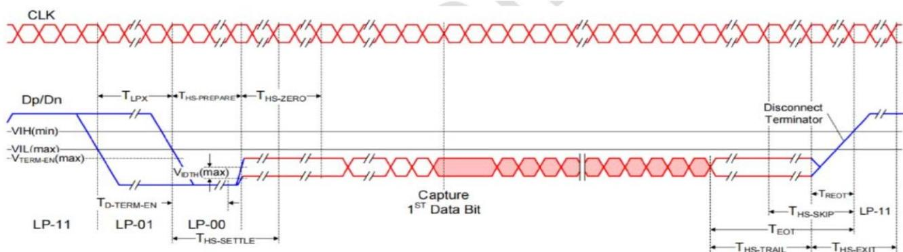
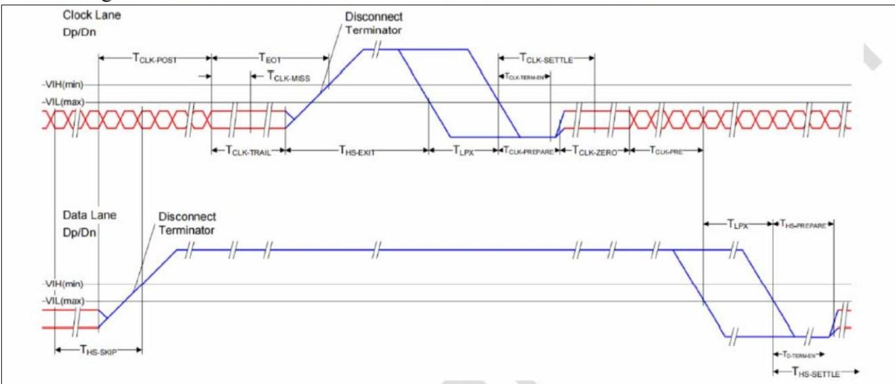
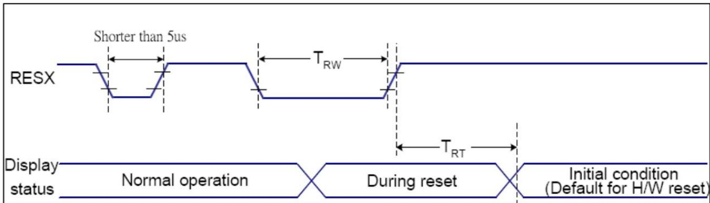
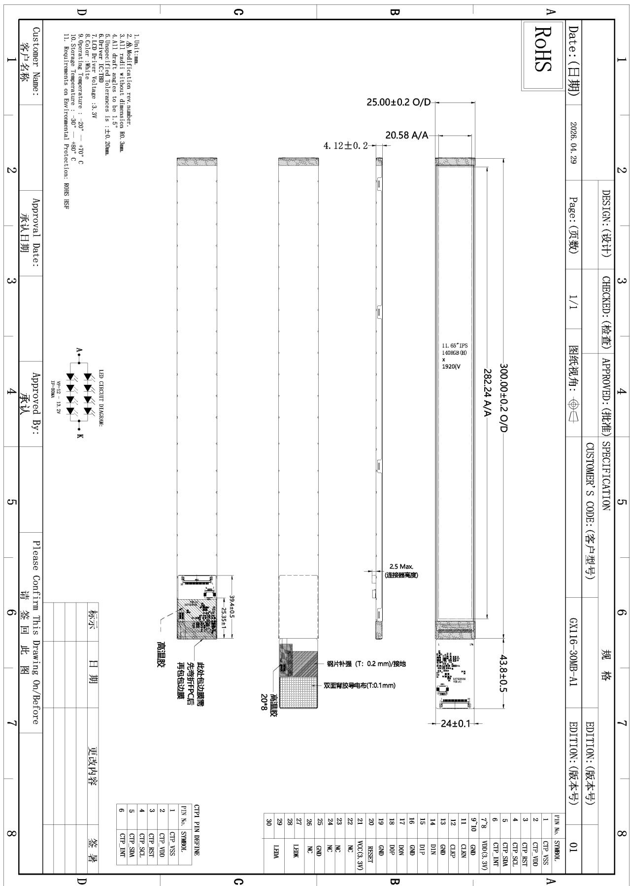
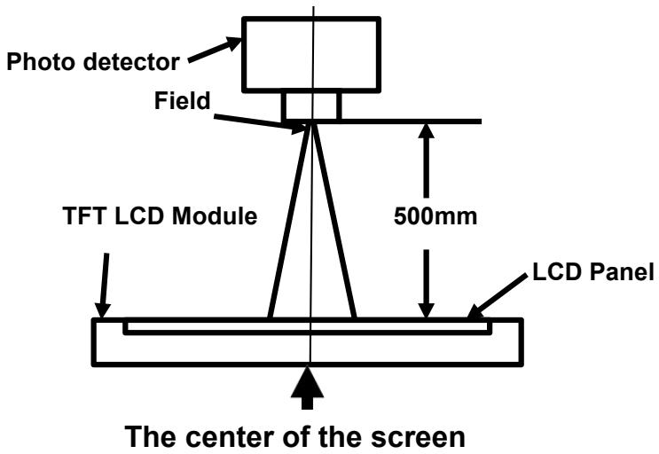
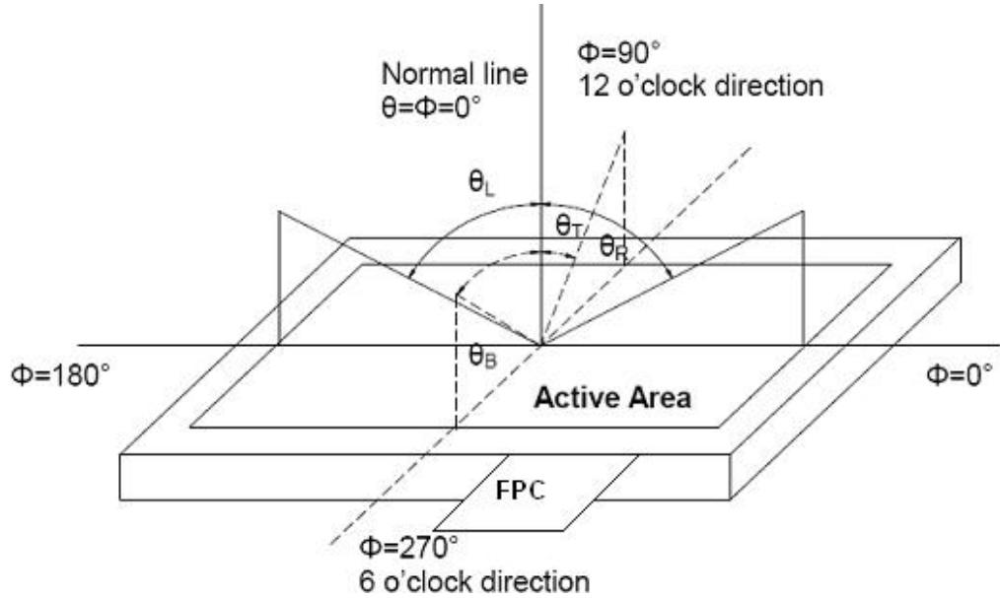
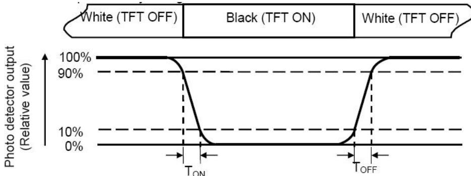
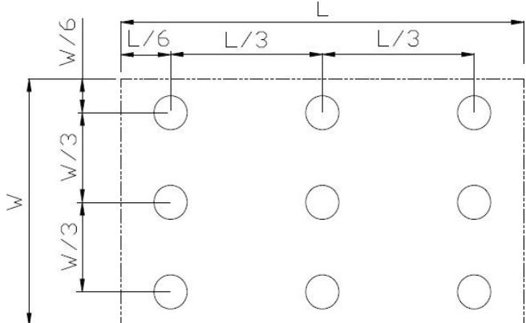

# 深圳市高信技术有限公司

# 液晶显示模块规格书

客户：

客户料号

型号：GX116-30MB-A1

版本 V00

日期 2022-08-05

客户最终确认

<table><tr><td>LCM 结构 OK ☐</td><td>审核人</td><td></td></tr><tr><td>LCM 显示 OK ☐</td><td>审核人</td><td></td></tr><tr><td>LCM NG ☐ LCM OK ☐</td><td>批准人</td><td></td></tr></table>

## 深圳高信确认：

<table><tr><td>设计</td><td>检查</td><td>批准</td></tr><tr><td></td><td></td><td></td></tr></table>

联系人：岳爱福 15989334751 地址：深圳市光明区玉塘街道田寮社区田阔路15号三楼

## 目录

1. 版本记录......3
2. 一般规格......4
3. 引脚定义......5
4. 绝对最大额定值......6
5. 电气特性......6
6. 时序图......8
7. 机械图......11
8. 光学特性......12
9. 环境 / 可靠性试验......15
10. LCD 模块使用注意事项......16

1.版本记录

<table><tr><td>版本</td><td>发行日期</td><td>说明</td><td>编制</td></tr><tr><td>1.0</td><td>2026-04-29</td><td>首次发行</td><td>Chen</td></tr><tr><td></td><td></td><td></td><td></td></tr><tr><td></td><td></td><td></td><td></td></tr><tr><td></td><td></td><td></td><td></td></tr><tr><td></td><td></td><td></td><td></td></tr><tr><td></td><td></td><td></td><td></td></tr><tr><td></td><td></td><td></td><td></td></tr><tr><td></td><td></td><td></td><td></td></tr><tr><td></td><td></td><td></td><td></td></tr><tr><td></td><td></td><td></td><td></td></tr><tr><td></td><td></td><td></td><td></td></tr><tr><td></td><td></td><td></td><td></td></tr><tr><td></td><td></td><td></td><td></td></tr><tr><td></td><td></td><td></td><td></td></tr><tr><td></td><td></td><td></td><td></td></tr></table>

## 2.一般规格

注 1：最佳图像质量的观看方向与 TFT 定义不同，存在 180° 的偏移。

注 2：符合 ROHS 要求。

<table><tr><td>项目</td><td>规格</td><td>单位</td></tr><tr><td>LCD 尺寸</td><td>11.65</td><td>inch</td></tr><tr><td>显示模式</td><td>常黑</td><td>--</td></tr><tr><td>分辨率</td><td>140RGB(H) x 1920(V)</td><td>Pixel</td></tr><tr><td>像素间距</td><td>0.1470 x 0.1470</td><td>um</td></tr><tr><td>像素排列</td><td>RGB 条纹</td><td></td></tr><tr><td>观看方向</td><td>全视角</td><td>-</td></tr><tr><td>模组外形尺寸</td><td>25.00(H) x 300.00(V) x 4.12(D)</td><td>mm</td></tr><tr><td>LCD 有效显示区</td><td>20.58 x 282.24</td><td>mm</td></tr><tr><td>颜色数</td><td>16.7M</td><td>-</td></tr><tr><td>驱动 IC</td><td>待定</td><td>-</td></tr><tr><td>接口</td><td>MIPI</td><td>--</td></tr><tr><td>背光</td><td>白色 LED</td><td>--</td></tr><tr><td>工作温度</td><td>-20°C~ +70°C</td><td>--</td></tr><tr><td>存储温度</td><td>-30°C~ +80°C</td><td>--</td></tr></table>

## 3.引脚定义

<table><tr><td>引脚</td><td>符号</td><td>描述</td><td>备注</td></tr><tr><td>1</td><td>CTP_VSS</td><td>接地</td><td></td></tr><tr><td>2</td><td>CTP_VDD</td><td>CTP 电源</td><td></td></tr><tr><td>3</td><td>CTP_RST</td><td>触摸复位信号</td><td></td></tr><tr><td>4</td><td>CTP_SCL</td><td>IIC 时钟信号</td><td></td></tr><tr><td>5</td><td>CTP_SDA</td><td>IIC 数据信号</td><td></td></tr><tr><td>6</td><td>CTP_INT</td><td>触摸中断</td><td></td></tr><tr><td>7</td><td>VDD</td><td>电源</td><td></td></tr><tr><td>8</td><td>VDD</td><td>电源</td><td></td></tr><tr><td>9</td><td>GND</td><td>接地</td><td></td></tr><tr><td>10</td><td>GND</td><td>接地</td><td></td></tr><tr><td>11</td><td>CLKN</td><td>MIPI_DSI 时钟输入引脚</td><td></td></tr><tr><td>12</td><td>CLKP</td><td>MIPI_DSI 时钟输入引脚</td><td></td></tr><tr><td>13</td><td>GND</td><td>接地</td><td></td></tr><tr><td>14</td><td>D1N</td><td>MIPI-DSI 数据输入引脚 1</td><td></td></tr><tr><td>15</td><td>D1P</td><td>MIPI-DSI 数据输入引脚 1</td><td></td></tr><tr><td>16</td><td>GND</td><td>接地</td><td></td></tr><tr><td>17</td><td>DON</td><td>MIPI-DSI 数据输入引脚 0</td><td></td></tr><tr><td>18</td><td>DOP</td><td>MIPI-DSI 数据输入引脚 0</td><td></td></tr><tr><td>19</td><td>GND</td><td>接地</td><td></td></tr><tr><td>20</td><td>RESET</td><td>该信号用于复位器件，必须施加该信号才能正确初始化芯片。该信号为低电平有效</td><td></td></tr><tr><td>21</td><td>VCC</td><td>3.3V</td><td></td></tr><tr><td>22</td><td>NC</td><td>NC</td><td></td></tr><tr><td>23</td><td>NC</td><td>NC</td><td></td></tr><tr><td>24</td><td>NC</td><td>NC</td><td></td></tr><tr><td>25</td><td>GND</td><td>接地</td><td></td></tr><tr><td>26</td><td>NC</td><td>NC</td><td></td></tr><tr><td>27</td><td>LEDK</td><td>LED 阴极</td><td></td></tr><tr><td>28</td><td>LEDK</td><td>LED 阴极</td><td></td></tr><tr><td>29</td><td>LEDA</td><td>LED 阳极</td><td></td></tr><tr><td>30</td><td>LEDA</td><td>LED 阳极</td><td></td></tr></table>

## 4.绝对最大额定值

<table><tr><td>项目</td><td>符号</td><td>最小值</td><td>最大值</td><td>单位</td><td>备注</td></tr><tr><td rowspan="3">电源电压</td><td>VDD</td><td>-0.30</td><td>+3.6</td><td>V</td><td></td></tr><tr><td>TP_VCI</td><td>/</td><td>/</td><td>V</td><td></td></tr><tr><td>TP_IOVCC</td><td>/</td><td>/</td><td>V</td><td></td></tr><tr><td>工作温度</td><td>Top</td><td>-20.0</td><td>70.0</td><td>°C</td><td></td></tr><tr><td>存储温度</td><td> $T_{st}$ </td><td>-30.0</td><td>80.0</td><td>°C</td><td></td></tr><tr><td>工作及存储湿度</td><td> $H_{stg}$ </td><td>10%</td><td>90%</td><td>%(RH)</td><td></td></tr></table>

## 5.电气特性

## 5.1推荐工作条件

VCI=3.3V，GND=0V，Ta = 25℃

<table><tr><td colspan="2">项目</td><td>符号</td><td>最小值</td><td>典型值</td><td>最大值</td><td>单位</td><td>备注</td></tr><tr><td colspan="2">模拟电源电压</td><td>VDD</td><td>2.8</td><td>3.3</td><td>3.5</td><td>V</td><td></td></tr><tr><td colspan="2">TP 电源</td><td>TP_VCI</td><td>/</td><td>/</td><td>/</td><td>V</td><td></td></tr><tr><td colspan="2">TP 电源</td><td>TP_IOVCC</td><td>/</td><td>/</td><td>/</td><td>V</td><td>注释</td></tr><tr><td rowspan="2">输入信号电压</td><td>低电平</td><td> $V_{IL}$ </td><td>GND</td><td>-</td><td>0.2x VDD</td><td>V</td><td rowspan="2"></td></tr><tr><td>高电平</td><td> $V_{IH}$ </td><td>0.8 x VDD</td><td>-</td><td>VDD</td><td>V</td></tr><tr><td colspan="2">数字电源电流</td><td> $I_{IOVCC}$ </td><td>-</td><td>/</td><td>/</td><td>Ma</td><td></td></tr><tr><td colspan="2">模拟电源电流</td><td> $I_{VCI}$ </td><td>-</td><td>/</td><td>/</td><td>Ma</td><td></td></tr></table>

## 5.2 背光单元驱动条件

<table><tr><td>项目</td><td>符号</td><td>最小值</td><td>典型值</td><td>最大值</td><td>单位</td><td>备注</td></tr><tr><td>正向电流</td><td> $I_F$ </td><td>-</td><td>80</td><td>-</td><td>Ma</td><td rowspan="2"></td></tr><tr><td>正向电压</td><td> $V_F$ </td><td>12</td><td>12.8</td><td>13.2</td><td>V</td></tr><tr><td>工作寿命</td><td>--</td><td>30000</td><td>--</td><td>--</td><td>hrs</td><td>注 2、注 3</td></tr></table>

注1：LED 驱动条件针对每个模组定义。

注2：LCM 工作时，应输入稳定的正向电流。正向电压仅供参考。

注3：光学性能应在 Ta=25℃ 条件下评估。当 LED 在高电流、高环境温湿度条件下驱动时，LED 的寿命将会缩短。工作寿命是指亮度下降至初始亮度的 50%。典型工作寿命为估算数据。

注4：LED 驱动条件针对每个 LED 模组定义。

## 6.时序特性

## 6.1 MIPI 接口特性：

<table><tr><td>参数</td><td>描述</td><td>最小值</td><td>典型值</td><td>最大值</td><td>单位</td></tr><tr><td> $T_{LPX}$ </td><td>任意低功耗状态周期的传输长度</td><td>50</td><td>-</td><td>-</td><td>ns</td></tr><tr><td> $T_{HS-PREPARE}$ </td><td>发送端在启动 HS 传输的 HS-0 线路状态之前，立即驱动数据通道 LP-00 线路状态的时间</td><td>40 + 4*UI</td><td>-</td><td>85 + 6*UI</td><td>ns</td></tr><tr><td> $T_{HS-PREPARE}+T_{HS-ZERO}$ </td><td> $T_{HS-PREPARE}+发送端在发送同步序列之前驱动 HS-0 状态的时间。</td><td>145 + 10*UI</td><td>-</td><td>-</td><td>ns</td></tr><tr><td>\(T_{D-TERM-EN}$ </td><td>数据通道接收端使能 HS 线路终端匹配所需的时间。</td><td>-</td><td>-</td><td>35 + 4*UI</td><td>ns</td></tr><tr><td> $T_{HS-SETTLE}$ </td><td>HS 接收端应忽略任何数据通道 HS 跳变的时间间隔。</td><td>85 + 6*UI</td><td>-</td><td>145 + 10*UI</td><td>ns</td></tr><tr><td> $T_{HS-TRAIL}$ </td><td>发送端在一次 HS 传输突发的最后一个有效负载数据位之后驱动翻转差分状态的时间</td><td>Max( n*8*UI, 60+n*4*UI)</td><td>-</td><td>-</td><td>ns</td></tr><tr><td> $T_{HS-EXIT}$ </td><td>HS 突发结束后，发送端驱动 LP-11 的时间。</td><td>100</td><td>-</td><td>-</td><td>ns</td></tr></table>

\* 时钟通道在时钟传输与低功耗之间的切换  

<table><tr><td>参数</td><td>描述</td><td>最小值</td><td>典型值</td><td>最大值</td><td>单位</td></tr><tr><td> $T_{CLK-POST}$ </td><td>在最后一个相关数据通道转入 LP 模式后，发送端继续发送 HS 时钟的时间。</td><td>60 + 52*UI</td><td>-</td><td>-</td><td>ns</td></tr><tr><td> $T_{CLK-PRE}$ </td><td>在任何相关数据通道开始由 LP 模式向 HS 模式转换之前，发送端应驱动 HS 时钟的时间。</td><td>8*UI</td><td>-</td><td>-</td><td>ns</td></tr><tr><td> $T_{CLK-PREPARE}$ </td><td>发送端在启动 HS 传输的 HS-0 线路状态之前，立即驱动时钟通道 LP-00 线路状态的时间。</td><td>38</td><td>-</td><td>95</td><td>ns</td></tr><tr><td> $T_{CLK-PREPARE}+ T_{CLK-ZERO}$ </td><td> $T_{CLK-PREPARE}+ 发送端在启动时钟之前驱动 HS-0 状态的时间。$ </td><td>300</td><td>-</td><td>-</td><td>ns</td></tr><tr><td> $T_{CLK-TERM-EN}$ </td><td>时钟通道接收端使能 HS 线路终端匹配所需的时间。</td><td>-</td><td>-</td><td>38</td><td>ns</td></tr><tr><td> $T_{CLK-TRAIL}$ </td><td>发送端在一次 HS 传输突发的最后一个有效负载时钟位之后驱动 HS-0 状态的时间。</td><td>60</td><td>-</td><td>-</td><td>ns</td></tr><tr><td> $T_{HS-EXIT}$ </td><td>HS 突发结束后，发送端驱动 LP-11 的时间。</td><td>100</td><td>-</td><td>-</td><td>ns</td></tr></table>

## 6.2 复位时序

<table><tr><td>相关引脚</td><td>符号</td><td>参数</td><td>最小值</td><td>最大值</td><td>单位</td></tr><tr><td rowspan="3">RESX</td><td>TRW</td><td>复位脉冲宽度</td><td>10</td><td>-</td><td>us</td></tr><tr><td rowspan="2">TRT</td><td rowspan="2">复位解除</td><td>-</td><td>5 (注 1, 5)</td><td>ms</td></tr><tr><td></td><td>120(注 1, 6, 7)</td><td>ms</td></tr></table>

## 8.光学特性

<table><tr><td colspan="2">项目</td><td>符号</td><td>条件</td><td>最小值</td><td>典型值</td><td>最大值</td><td>单位</td><td>备注</td></tr><tr><td rowspan="4" colspan="2">视角</td><td> $\theta T$ </td><td rowspan="4">CR $\geqq 10$ </td><td>80</td><td>85</td><td>-</td><td rowspan="4">Degree</td><td rowspan="4">注 2</td></tr><tr><td> $\theta B$ </td><td>80</td><td>85</td><td>-</td></tr><tr><td> $\theta L$ </td><td>80</td><td>85</td><td>-</td></tr><tr><td> $\theta R$ </td><td>80</td><td>85</td><td>-</td></tr><tr><td colspan="2">对比度</td><td>CR</td><td> $\theta=0^{\circ}$ </td><td>1000</td><td>1200</td><td>-</td><td></td><td>注1 注3</td></tr><tr><td rowspan="2" colspan="2">响应时间</td><td> $T_{ON}$ </td><td rowspan="2">25°C</td><td rowspan="2"></td><td rowspan="2">-</td><td rowspan="2">35</td><td rowspan="2">ms</td><td rowspan="2">注1 注4</td></tr><tr><td> $T_{OFF}$ </td></tr><tr><td rowspan="2">色度</td><td rowspan="2">白色</td><td>x</td><td rowspan="2">背光点亮</td><td>-</td><td>0.30</td><td>-</td><td rowspan="2"></td><td rowspan="2">注1 注5</td></tr><tr><td>y</td><td>-</td><td>0.33</td><td>-</td></tr><tr><td colspan="2">均匀度</td><td>U</td><td></td><td>80</td><td>85</td><td>-</td><td>%</td><td>注1 注6</td></tr><tr><td colspan="2">NTSC</td><td></td><td></td><td>-</td><td>-</td><td>-</td><td>%</td><td>注 5</td></tr><tr><td colspan="2">亮度</td><td>L</td><td></td><td>-</td><td>400</td><td>-</td><td>CD/ $m^{2}$ </td><td>注1 注7</td></tr></table>

测试条件：  
2.测试系统参见注 1 和注 2。  
1.IF= 80 Ma, VF=12 - 13.2 V，环境温度为 $2 5 { \pm 2 } ^ { \circ } \mathrm { C }$ ，湿度为 65±7%

## 注 1：光学测量系统的定义。

特性在 LCD 屏幕的中心点处测量。测量面板中心区域时，LCD 面板的所有输入端必须接地。

  
注 2：视角范围及测量系统的定义。

视角使用 CONOSCOPE(ergo-80) 在 LCD 中心点处测量。

  
注 3：对比度的定义

$$
\text { 对比度 (CR) } = \frac {\text { LCD 处于 "白" 态时测得的亮度 }}{\text { LCD 处于 "黑" 态时测得的亮度 }}
$$

## 注 4：响应时间的定义

响应时间定义为 LCD 在“白”态与“黑”态之间的光学切换时间间隔。上升时间（TON）是指光电探测器输出强度从 90%

到 10% 所需的时间。下降时间（TOFF）是指光电探测器输出强度从 10% 变化到 90% 所需的时间。

## 注 5：色度（CIE1931）的定义

色坐标在 LCD 的中心点处测量。

## 注 6：亮度均匀度的定义

有效显示区被划分为 9 个测量区域（参见图 2）。每个测量点均位于各测量区域的中心。

亮度均匀度 (U) = 最小亮度 / 最大亮度

L-------有效显示区长度 W----- 有效显示区宽度

最大亮度：所有测量位置中测得的最大亮度。最小亮度：所有测量位置中测得的最小亮度。

## 注 7：亮度的定义：

在中心点处测量白色状态的亮度

9.环境 / 可靠性试验

<table><tr><td>序号</td><td>项目</td><td>条件</td><td>测试后检查</td></tr><tr><td>1</td><td>高温存储</td><td>T = 80°C，持续 96 hr</td><td rowspan="7">在室温下放置 4 小时后进行检查，样品不得存在以下缺陷：1.LCD 内有气泡 2.密封泄漏；3.不显示；4.缺段；5.玻璃破裂；6.电流 IDD 高于初始值两倍。</td></tr><tr><td>2</td><td>低温存储</td><td>T = -30°C，持续 96 hr</td></tr><tr><td>3</td><td>高温工作</td><td>T = 70°C，持续 96 hr</td></tr><tr><td>4</td><td>低温工作</td><td>T = -20°C，持续 96 hr（但不得有结露）</td></tr><tr><td>5</td><td>高温高湿工作</td><td>T = 60°C/90%，持续 96 hr（但不得有结露）</td></tr><tr><td>6</td><td>冷热冲击</td><td>-20~25~70°C×10cycles (30min.) (5min.) (30min.)</td></tr><tr><td>7</td><td>ESD</td><td>Voltage:±8KV R: 330Ω C: 150pF 空气放电，10 次</td></tr></table>

注1：Ts 为面板表面的温度。  
注2：Ta 为样品的环境温度

## 10.LCD 模块使用注意事项 操作注意事项

## 10.1操作注意事项

10.1.1 显示面板由玻璃制成。请勿使其受到机械冲击，例如从高处跌落等。

10.1.2 若显示面板破损导致内部液晶物质泄漏，切勿将其放入口中；若该物质接触到皮肤或衣物，请立即用肥皂和水清洗干净。

10.1.3 请勿对显示面及其周边区域施加过大的力，否则可能导致色调发生变化。

10.1.4 覆盖 LCD 模块显示面的偏光片质地柔软，极易被划伤，请小心处理。

10.1.5 若显示面受到污染，请对着表面哈气，再用柔软的干布轻轻擦拭。若仍无法完全清洁，可用下列溶剂之一润湿软布：

－ 异丙醇

－ 乙醇

除上述溶剂以外的其他溶剂可能会损坏偏光片。尤其不得使用以下物质：

－ 水

－ 酮类

－ 芳香族溶剂

10.1.6 请勿尝试拆卸 LCD 模块。

10.1.7 逻辑电路电源关闭时，请勿施加输入信号。

10.1.8 为防止静电损坏元件，请注意保持最佳的工作环境。

10.1.8.1 操作 LCD 模块时，务必使人体接地。

组装所需的工具（如电烙铁）必须正确接地。

10.1.8.2 为减少静电的产生，请勿在干燥环境下进行组装及其他作业。

10.1.8.3 LCD 模块表面覆有一层保护膜，用于保护显示面。撕下该保护膜时请务必小心，因为可能会产生静电。

## 10.2 存储注意事项

10.2.1存放 LCD 模块时，应避免阳光直射或荧光灯照射。

10.2.2LCD 模块应在存储温度范围内存放。若需长期存放 LCD 模块，推荐条件为：温度：$0 ^ { \circ } \mathrm { C } \ \sim \ 4 0 ^ { \circ } \mathrm { C }$ 相对湿度：≤80%

10.2.3LCD 模块应存放在无酸、无碱且无有害气体的室内。

## 10.3运输注意事项

LCD 模块在运输过程中不得跌落和受到剧烈冲击，同时还应避免过度挤压、水浸、潮湿和日晒。
