# GO

南京观海微电子有限公司 GoHi Microelectronics Co., Ltd.

GX610 数据手册

16.7M 色 LCD 单芯片驱动（preliminary v0.00）

## Revision History

<table><tr><td>Version</td><td>Date</td><td>Description of modification</td></tr><tr><td>Preliminary v0.00</td><td>2024/09/13</td><td>New setup</td></tr></table>

## 目录

1 概述....9
2 特性....9
3 器件概览....11
3.1 器件框图....11
3.2 上电/断电时序....12
3.2.1 上电时序....12
3.2.2 断电时序....17
3.3 输出电压范围....23
3.4 LCD 电源生成方案....24
3.5 DC/DC 转换器电路....25
3.5.1 转换器电路（PM[1:0]=00）....25
3.5.2 内部电荷泵（Charge Pump）外部元件表（PM[1:0]=00）....26
3.5.3 转换器电路（PM[1:0]=01）....27
3.5.4 内部电荷泵（Charge Pump）外部元件表（PM[1:0]=01）....28
3.5.5 转换器电路（PM[1:0]=10）....29
3.5.6 内部电荷泵（Charge Pump）外部元件表（PM[1:0]=10）....30
3.5.7 转换器电路（PM[1:0]=11）....31
3.5.8 内部电荷泵（Charge Pump）外部元件表（PM[1:0]=11）....32
4 最大布线电阻....33
5 引脚说明....34
5.1 LVDS/MIPI 接口输入映射表....37
6 接口....38
6.1 I2C 接口....38
6.1.1 I2C 格式....38
6.1.2 I2C 接口的命令写入时序....39
6.1.3 I2C 接口的命令读取时序....39
6.2 RGB 接口....40
6.2.1 通用时序图....40
6.2.2 RGB 数据格式....42
6.2.3 RGB 接口模式选择....43
6.3 Dual-SPI 接口....44
6.4 RGB 输入时序表....46
6.5 MCU 接口....47
6.5.1 8080 系列并行接口....47
6.5.2 写周期时序....48

6.5.3 读周期时序....48
6.5.4 数据传输模式....49
6.5.5 数据传输方式 1....49
6.5.6 数据传输方式 2....50
6.5.7 并行 MCU 接口....50
6.5.8 存储器数据格式....51
6.6 串行接口....52
6.6.1 写周期时序....52
6.6.2 读周期时序....54
6.6.3 3 线串行接口....57
6.6.4 4 线串行接口....58
6.7 LVDS 接口....61
6.7.1 LVDS 数据格式....61
6.7.2 LVDS 数据输入时序....62
6.8 DSI 系统接口....65
6.8.1 Command 模式、Video 模式与虚拟通道....66
6.8.2 DSI 格式....68
6.8.3 DSI 协议....70
6.8.4 每次传输多个数据包....70
6.8.5 字节序策略....72
6.8.6 数据包结构....72
6.8.7 长数据包....72
6.8.8 短数据包....74
6.8.9 通用数据包元素....74
6.8.10 数据标识字节....74
6.8.11 虚拟通道标识符 – VC 字段，DI[7:6]....75
6.8.12 数据类型字段 DT[5:0]....75
6.8.13 ECC....75
6.8.14 DSI 数据包....75
6.8.15 处理器发出的数据包....75
6.8.16 打包像素流，16 位格式，长数据包....76
6.8.17 打包像素流，18 位格式，长数据包....76
6.8.18 像素流，18 位松散格式，长数据包....77
6.8.19 打包像素流，24 位格式，长数据包....78
6.8.20 外设到处理器的传输....78

6.8.21 对命令和 ACK 请求的适当响应....79
6.8.22 外设到处理器数据包说明....80
6.8.23 确认、错误报告和读取响应数据类型的格式....80
6.8.24 Video 模式接口时序....81
6.8.25 传输数据包序列....81
6.8.26 非突发同步脉冲模式....82
6.8.27 非突发同步事件模式....83
6.8.28 突发模式....83
6.9 纠错码与校验和....84
6.9.1 纠错码（ECC）....84
6.9.2 长数据包有效载荷的校验和生成....85
6.10 DPHY....86
6.10.1 通道模块....86
6.10.2 时钟通道、Data0、Data1 和 Data2 的通道模块类型....86
6.10.3 主设备与从设备....87
6.10.4 通道状态与线电平....87
6.10.5 双向数据通道换向....88
6.11 逃逸模式（Escape Mode）....88
6.12 低功耗数据传输（LPDT）....90
6.13 超低功耗状态（ULPS）....90
6.14 高速传输....90
6.14.1 突发有效载荷数据....90
6.14.2 传输开始....90
6.14.3 传输结束....91
6.14.4 高速数据传输....91
6.14.5 高速时钟传输....92
6.15 系统电源状态....92
6.16 初始化....92
6.17 全局操作流程图....93
7 Gamma 特性校正功能....94
8 功能说明....95
8.1 数字 Gamma（独立 RGB gamma）....95
8.2 BIST....95
8.2.1 BIST 功能....95
8.2.2 BIST 图案....95

命令 97
9.1 命令列表 97
9.1.1 标准命令 97
9.1.2 标准命令可访问性 101
9.1.3 标准命令默认模式与数值 102
9.2 命令说明 103
9.2.1 NoP (00h) 103
9.2.2 SWRESET：软件复位 (01h) 103
9.2.3 RDDIDIF：读取显示识别信息 (04h) 104
9.2.4 RDNUMED：读取 DSI 上的错误数量 (05h) 105
9.2.5 RDDST：读取显示状态 (09h) 106
9.2.6 RDDPM：读取显示电源模式 (0Ah) 108
9.2.7 RDDMATCDL：读取显示 MADCTL (0Bh) 109
9.2.8 RDDCOLMOD：读取显示 COLMOD (0Ch) 110
9.2.9 读取显示图像模式 (0Dh) 111
9.2.10 RDDSM：读取显示信号模式 (0Eh) 112
9.2.11 RDDSDR：读取显示自诊断结果 (0Fh) 113
9.2.12 PARON：局部显示模式开启 (12h) 117
9.2.13 NORON：进入正常模式 (13h) 118
9.2.14 INVOFF：显示反转关闭 (20h) 119
9.2.15 INVON：显示反转开启 (21h) 120
9.2.16 ALLPOFF：所有像素关闭 (22h) 121
9.2.17 ALLPON：所有像素开启 (23h) 122
9.2.18 GAMSET：Gamma 设置 (26h) 123
9.2.19 DISPOFF：显示关闭 (28h) 124
9.2.20 DISPON：显示开启 (29h) 125
9.2.21 CASET：设置列起始地址 (2Ah) 126
9.2.22 RASET：设置行起始地址 (2Bh) 128
9.2.23 RAMWR：存储器开始写入 (2Ch) 130
9.2.24 PTLAR：设置垂直局部区域 (30h) 131
9.2.25 PTLAR\_H：设置水平局部区域 (31h) 133
9.2.26 TEOFF：撕裂效应线关闭 (34h) 135
9.2.27 TEON：撕裂效应线开启 (35h) 136
9.2.28 MADCTL：存储器访问控制 (36h) 137
9.2.29 IDMOFF：空闲模式关闭 (38h) 139

9.2.30 IDMON：空闲模式开启 (39h)....140
9.2.31 COLMOD：接口像素格式 (3Ah)....141
9.2.32 RAMWR：存储器连续写入 (3Ch)....142
9.2.33 TESL：设置撕裂效应扫描线 (44h)....143
9.2.34 GETSCAN：获取当前扫描线 (45h)....144
9.2.35 DSTBON：深度待机模式开启 (4Fh)....145
9.2.36 WRDISBV：写入显示亮度 (51h)....146
9.2.37 RDDISBV：读取显示亮度值 (52h)....147
9.2.38 WRCTRLD：写入 CTRL 显示 (53h)....148
9.2.39 RDCTRLD：读取 CTRL 值显示 (54h)....149
9.2.40 WRACL：读取 ACL 控制 (55h)....150
9.2.41 RDACL：读取 ACL 控制 (56h)....151
9.2.42 WRCABCMB：写入 CABC 最小亮度 (5Eh)....152
9.2.43 RDCABCMB：读取 CABC 最小亮度 (5Fh)....153
9.2.44 RDDDB：读取 DDB 开始 (A1h)....154
9.2.45 RDDDBCON：读取 DDB 继续 (A8h)....156
9.2.46 SetDISPMode：设置显示模式 (C2h)....157
9.2.47 RDID1：读取 ID1 (DAh)....158
9.2.48 RDID2：读取 ID2 (DBh)....159
9.2.49 RDID3：读取 ID3 (DCh)....160

10 电气规格 .... 161
10.1 绝对最大额定值 .... 161
10.2 DC 特性 .... 161
10.2.1 LVDS DC 电气特性 .... 161
10.3 AC 特性 .... 163
10.3.1 复位输入时序 .... 163
10.3.2 SPI 电气特性 .... 164
10.3.3 LVDS 电气特性 .... 165
10.3.4 DSI D-PHY 电气特性 .... 167

11 芯片信息 .... 176
11.1 PAD 分配 .... 176
11.2 对准标记（单位：um） .... 177

12 与面板的应用电路图 .... 178
12.1 单栅极驱动 .... 178
12.2 单栅极 + 锯齿（Zigzag）Type1 驱动 .... 178

12.3 单栅极 + 锯齿（Zigzag）Type 2 驱动....179

## 1 概述

GX610 是一款面向小尺寸至中尺寸 α-Si 及 LTPS TFT-LCD 面板的高集成度解决方案。该芯片集成了 1080+2 通道源极驱动器和时序控制器（Timing Controller），用于彩色 TFT LCD 面板。该芯片支持多种接口，并支持通过 R/W I2C/SPI 接口进行功能设置。

## 2 特性

<sup>⚫</sup> 集成 1080+2 通道源极驱动器和时序控制器

<sup>⚫</sup> 显示分辨率：（NL≤3200）

<sup>◼</sup> 200RGB \* NL

<sup>◼</sup> 240RGB \* NL

<sup>◼</sup> 250RGB \* NL

<sup>◼</sup> 256RGB \* NL

<sup>◼</sup> 260RGB \* NL

<sup>◼</sup> 268RGB \* NL

<sup>◼</sup> 270RGB \* NL

<sup>◼</sup> 272RGB \* NL

<sup>◼</sup> 300RGB \* NL

<sup>◼</sup> 320RGB \* NL

<sup>◼</sup> 360RGB \* NL

<sup>⚫</sup> 显示接口

<sup>◼</sup> MIPI-DSI（Display Serial Interface）接口

◆ 支持 DSI Version 1.1

◆ 支持 D-PHY version 1.00

<sup>◼</sup> LVDS 接口（VESA/JEIDA）

⚫ 支持常黑（normally black）和常白（normally white）面板

⚫ 提供共 17 个寄存器值用于 gamma 校正调整

⚫ 支持 BIST 模式

⚫ 支持用于异常断电的 GAS 功能

⚫ 支持 SPI/I2C 命令接口

<sup>⚫</sup> 支持 Zigzag

⚫ 支持 1/2/4 dot 及列反转

⚫ 支持 2MUX/ 3MUX/ 6MUX LTPS 面板

<sup>⚫</sup> 支持单栅极非晶硅 GIP LC 面板

⚫ 源极驱动器输出采用 8 位 DAC

⚫ OTP 存储器用于存储初始化寄存器设置

◼ 用于 GOA 设置的 OTP

◼ 用于 Gamma 设置的 OTP

◼ 用于 VCOMO 设置的 4 次 OTP

⚫ 输入电源：

◼ VDDI =1.65V 至 3.6V

◼ VCIP/VCI = 2.5V 至 3.6V（模拟/电荷泵电路电源）

◼ VCOMO = -3.8V 至 0V

◼ VSP = 4.5V 至 7.65V（源极电路电源）

◼ VSN = -4.5V 至 -7.65V（源极电路电源）

◼ VGH = 7.3V 至 20.2V（GOA 电路电源）

◼ VGL = -7.0V 至 -20.8V（GOA 电路电源）

<sup>◼</sup> VGH/VGL：VGH-VGL≤ 31V

⚫ 输出电压范围：

<sup>◼</sup> VSP 的模拟电压范围 = 4.5V 至 7.65V

<sup>◼</sup> VSN 的模拟电压范围 = -4.5V 至 -7.65V

<sup>◼</sup> 正极性源极输出电压电平：VGMPH = 4.0V 至 VSP-0.2V

<sup>◼</sup> 负极性源极输出电压电平：VGMNH = -4.0V 至 VSN+0.2V

<sup>◼</sup> 正极性栅极驱动输出电压电平：VGH = 7.3V 至 20.2V

<sup>◼</sup> 负极性栅极驱动输出电压电平：VGL= -7.0V 至 -20.8V

<sup>◼</sup> 内置 VCOMO 调整（15mV/Step）：VCOMO = -3.8V 至 0V

<sup>◼</sup> VGH/VGL：VGH-VGL≤ 31V

<sup>⚫</sup> COG 封装

⚫ 工作温度 $( \mathsf { T } _ { \mathsf { A } } ) \colon - 4 0 ^ { \circ } \mathrm { C } ~ { \mathsf { t } } 0 + 8 5 ^ { \circ } \mathrm { C }$

⚫ 存储温度 $( \mathsf { T } _ { \mathsf { S T G } } ) \colon - 5 5 ^ { \circ } \mathrm { C } \ \mathsf { t 0 } + 1 2 5 ^ { \circ } \mathrm { C }$

## 3 器件概览

## 3.1 器件框图

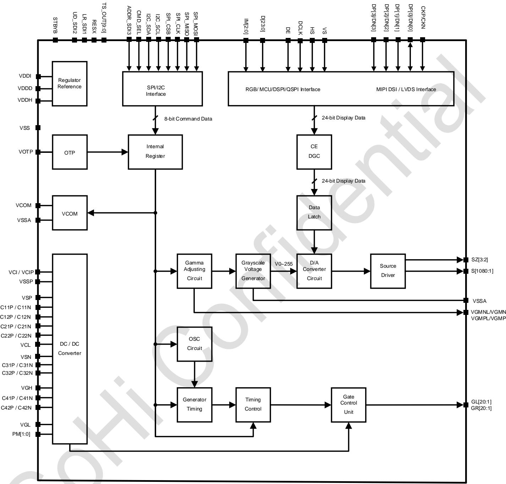

## 3.2 上电/断电时序

## 3.2.1 上电时序

不同电源输入模式和接口的上电时序如下图所示。

<table><tr><td rowspan="2">Symbol</td><td colspan="3">Value</td><td rowspan="2">Unit</td><td rowspan="2">Remark</td></tr><tr><td>Min</td><td>Typ</td><td>Max</td></tr><tr><td> $t_{PWON1}$ </td><td>0</td><td>5</td><td>-</td><td>ms</td><td></td></tr><tr><td> $t_{PWON2}$ </td><td>0</td><td>5</td><td>-</td><td>ms</td><td></td></tr><tr><td> $t_{PWON3}$ </td><td>0</td><td>5</td><td></td><td>ms</td><td></td></tr><tr><td> $t_{PWON4}$ </td><td>0</td><td>5</td><td></td><td>ms</td><td></td></tr><tr><td> $t_{ramp1}$ </td><td>0.2</td><td>-</td><td>20</td><td>ms</td><td>VDDI, VCI, VCIP</td></tr><tr><td> $t_{ramp2}$ </td><td>0.2</td><td>-</td><td>20</td><td>ms</td><td>VSP</td></tr><tr><td> $t_{ramp3}$ </td><td>0.2</td><td>-</td><td>20</td><td>ms</td><td>VSN</td></tr><tr><td> $t_{ramp4}$ </td><td>0.2</td><td>-</td><td>-</td><td>ms</td><td>VGL</td></tr><tr><td> $t_{ramp5}$ </td><td>0.2</td><td>-</td><td>-</td><td>ms</td><td>VGH</td></tr><tr><td> $t_{RPWIRES1}$ </td><td>10</td><td>-</td><td>-</td><td>ms</td><td></td></tr><tr><td> $t_{RPWIRES2}$ </td><td>1</td><td>-</td><td>-</td><td>ms</td><td></td></tr><tr><td> $t_{MIPI_LP11}$ </td><td>-</td><td>-</td><td> $t_{RPWIRES1}$ </td><td>ms</td><td></td></tr><tr><td> $t_{RESETL}$ </td><td>20</td><td>-</td><td>-</td><td>μs</td><td></td></tr><tr><td> $t_1$ </td><td>5</td><td>-</td><td>-</td><td>ms</td><td></td></tr><tr><td> $t_{SLPOUT}$ </td><td>120</td><td>-</td><td>-</td><td>ms</td><td></td></tr><tr><td> $t_{PWSLPOUT}$ </td><td>-</td><td>45</td><td>-</td><td>ms</td><td></td></tr><tr><td> $t_{BLON}$ </td><td>2</td><td>-</td><td>-</td><td>VS</td><td></td></tr></table>

2 路输入电源模式（PM [1:0]=01）

\- 内部 DC/DC 电源模式 - 电荷泵。

\- VDDI=1.65\~3.6V

\- VCI=VCIP=2.5\~3.6V

2 路电源模式上电时序 – DSI：

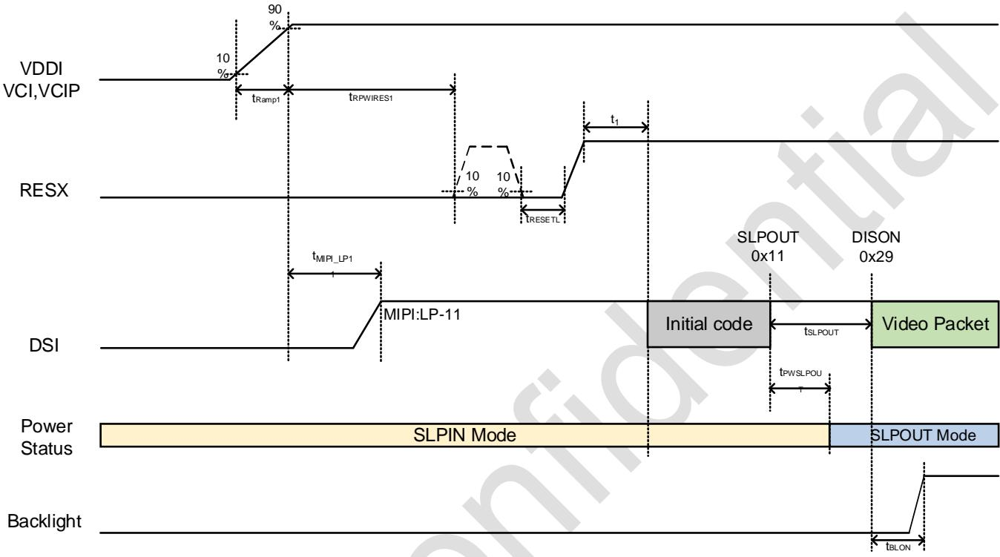

2 路电源模式上电时序 – LVDS：

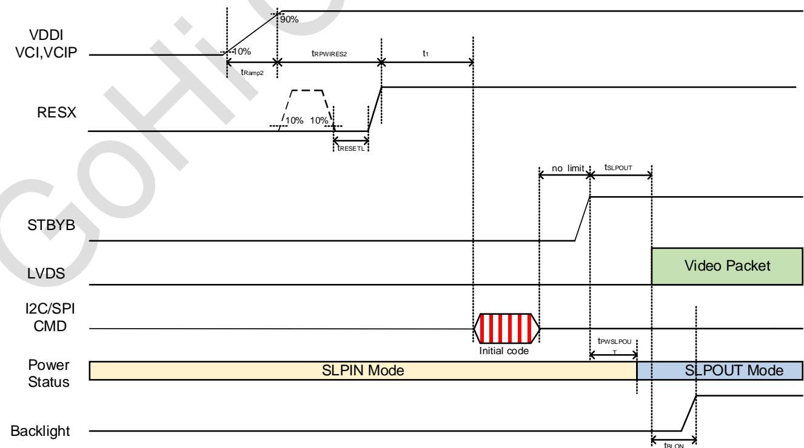

3 路输入电源模式（PM [1:0]=10）

\- 外部 VDDI、VSP、VSN 电源。

\- VDDI=1.65\~3.6V

\- VCI=VCIP=2.5\~3.6V，VSP=4.5\~7.65V，VSN=-4.5\~-7.65V。

3 路电源模式上电时序 – DSI：

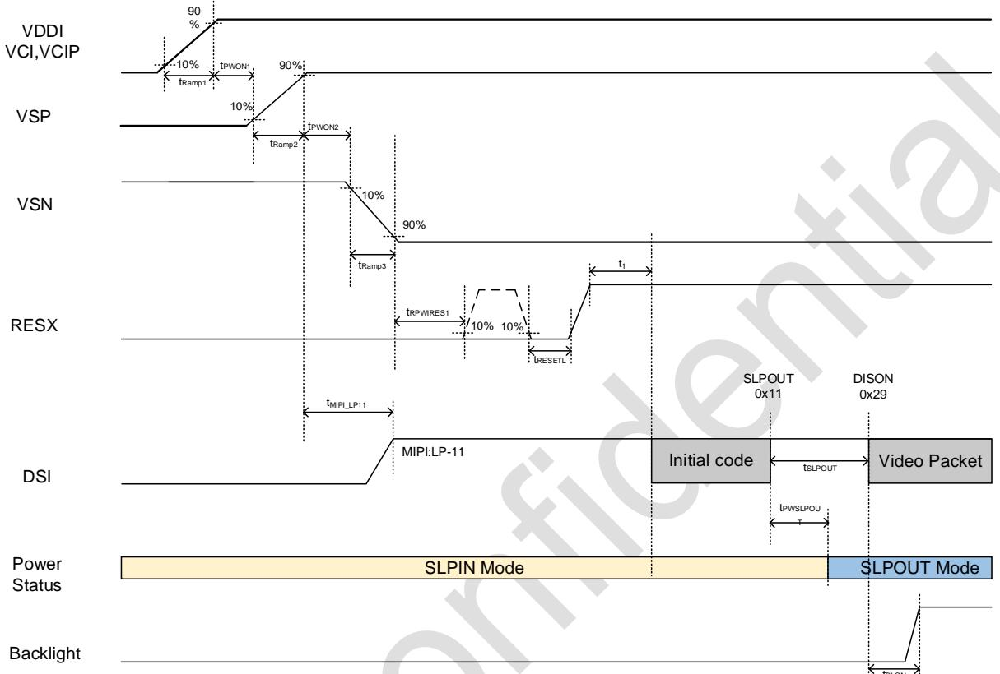

3 路电源模式上电时序 – LVDS:  
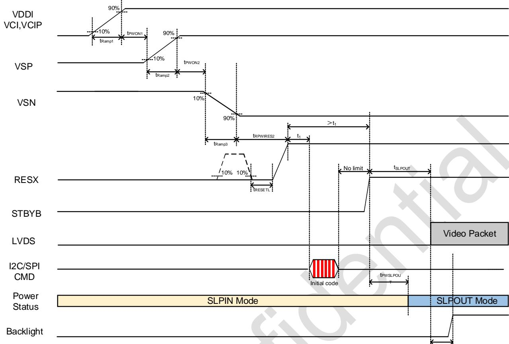

5 路输入电源模式（PM [1:0]=00）

\- 外部 VDDI、VSP、VSN、VGH、VGL。

\- VDDI=1.65\~3.6V

\- VCI=VCIP=2.5\~3.6V，VSP=4.5\~7.65V，VSN=-4.5\~-7.65V。

\- VGH= 7.3\~20.2V，VGL= -7.0\~-20.8V（VGH +|VGL| < 31V）。

5 路电源模式上电时序 – DSI：

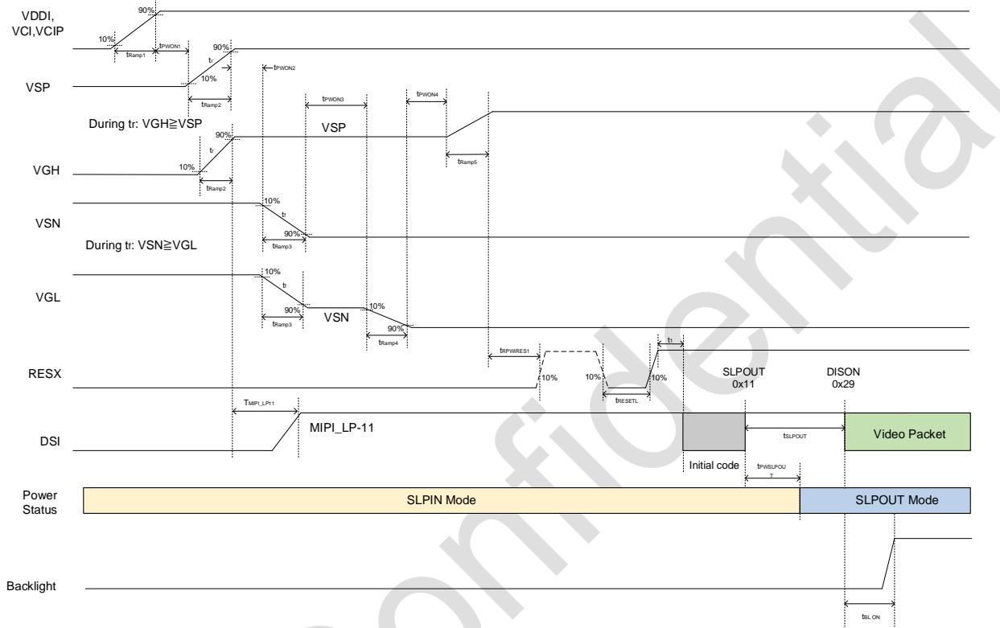

5 路电源模式上电时序 – LVDS：

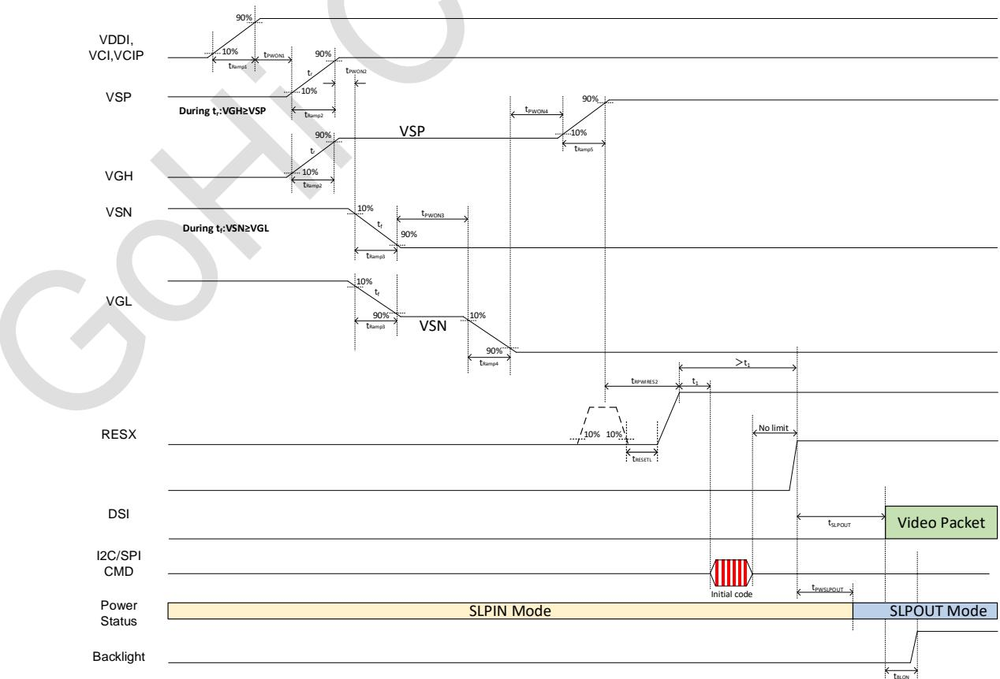

## 3.2.2 断电时序

不同电源输入模式和接口的断电时序如下图所示。

<table><tr><td rowspan="2">Symbol</td><td colspan="3">Value</td><td rowspan="2">Unit</td><td rowspan="2">Remark</td></tr><tr><td>Min</td><td>Typ</td><td>Max</td></tr><tr><td> $t_{PWOFF1}$ </td><td>0</td><td>5</td><td>-</td><td>ms</td><td></td></tr><tr><td> $t_{PWOFF2}$ </td><td>0</td><td>5</td><td>-</td><td>ms</td><td></td></tr><tr><td> $t_{PWOFF3}$ </td><td>0</td><td>5</td><td>-</td><td>ms</td><td></td></tr><tr><td> $t_{PWOFF4}$ </td><td>0</td><td>5</td><td>-</td><td>ms</td><td></td></tr><tr><td> $t_{ramp1}$ </td><td>0.2</td><td>-</td><td>20</td><td>ms</td><td>VDDI, VCI, VCIP</td></tr><tr><td> $t_{ramp2}$ </td><td>0.2</td><td>-</td><td>20</td><td>ms</td><td>VSP</td></tr><tr><td> $t_{ramp3}$ </td><td>0.2</td><td>-</td><td>20</td><td>ms</td><td>VSN</td></tr><tr><td> $t_{ramp4}$ </td><td>0.2</td><td>-</td><td>-</td><td>ms</td><td>5Power: VGL</td></tr><tr><td> $t_{ramp5}$ </td><td>0.2</td><td>-</td><td>-</td><td>ms</td><td>5Power: VGH</td></tr><tr><td> $t_{PWOFF}$ </td><td>120</td><td>-</td><td>-</td><td>ms</td><td></td></tr><tr><td> $t_{MIPI_LP11}$ </td><td>0</td><td>-</td><td> $t_{PWOFF}$ </td><td>ms</td><td></td></tr><tr><td> $t_{DISPOFF}$ </td><td>50</td><td>-</td><td> $t_{PWOFF}$ </td><td>ms</td><td></td></tr><tr><td> $t_{RSTHtoL}$ </td><td>50</td><td>-</td><td> $t_{PWOFF}$ </td><td>ms</td><td></td></tr><tr><td> $t_{Video_OFF}$ </td><td>0</td><td>-</td><td> $t_{PWOFF}$ </td><td>ms</td><td></td></tr><tr><td> $t_{BLOFF}$ </td><td>0</td><td>-</td><td>-</td><td>ms</td><td></td></tr></table>

2 路输入电源模式（ PM [1:0]=01）

\- 内部 DC/DC 电源模式 - 电荷泵。

\- VDDI=1.65\~3.6V

\- VCI=VCIP=2.5\~3.6V

2 路电源模式断电时序 – DSI：

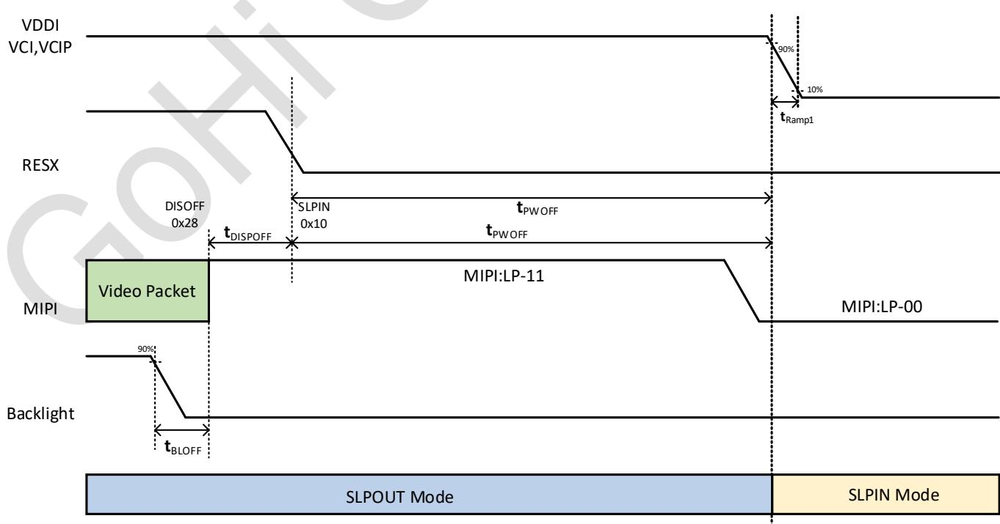

2 路电源模式断电时序 – LVDS:  
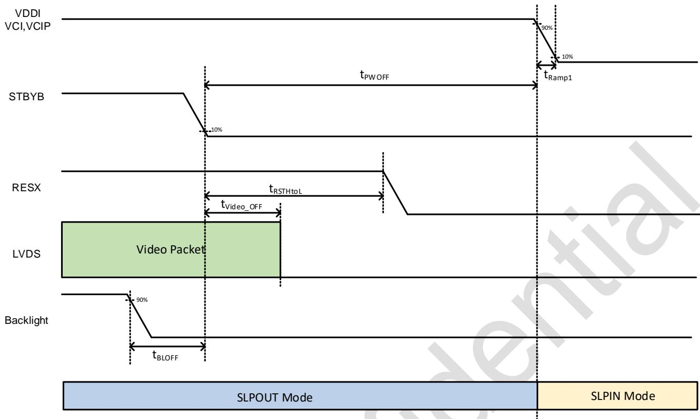

3 路输入电源模式（PM [1:0]=10）

\- 外部 VDDI、VSP、VSN 电源。

\- VDDI=1.65\~3.6V

\- VCI=VCIP=2.5\~3.6V，VSP=4.5\~7.65V，VSN=-4.5\~-7.65V。

3 路电源模式断电时序 – DSI：

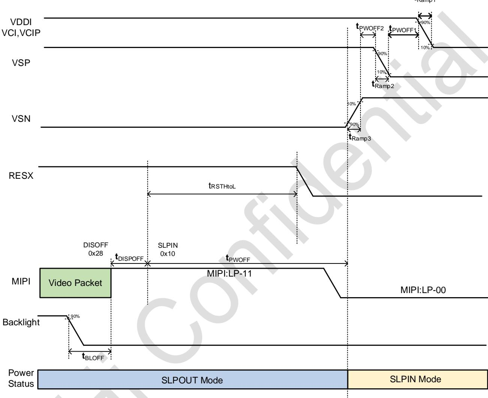

3 路电源模式断电时序 – LVDS:  
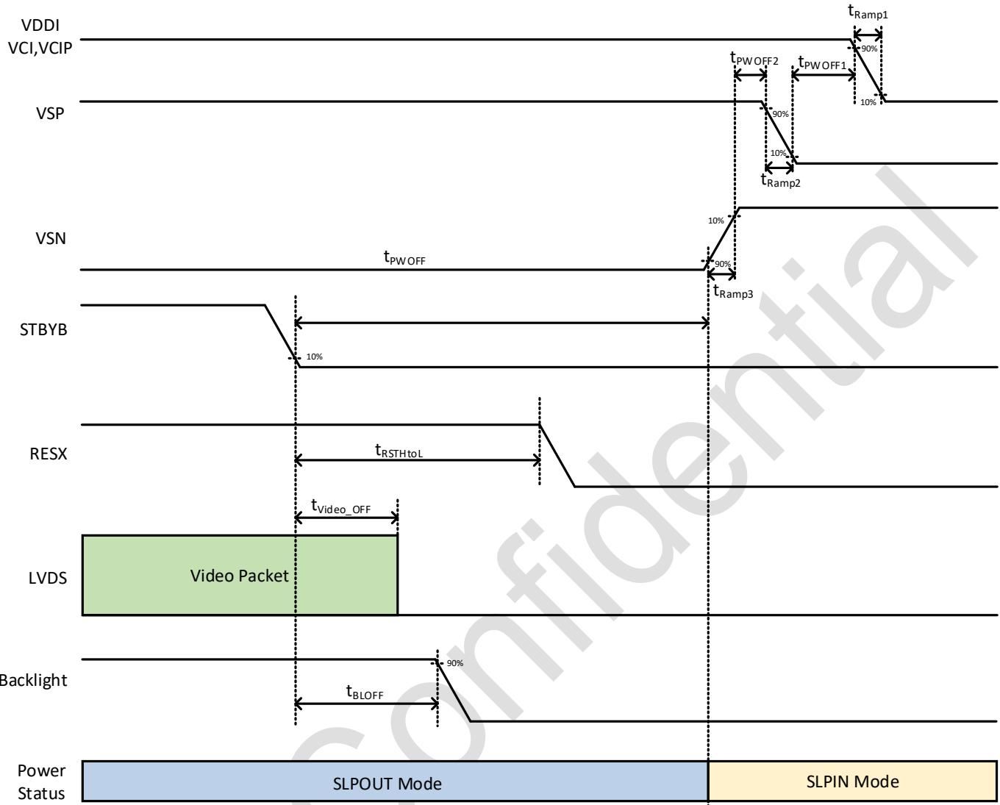

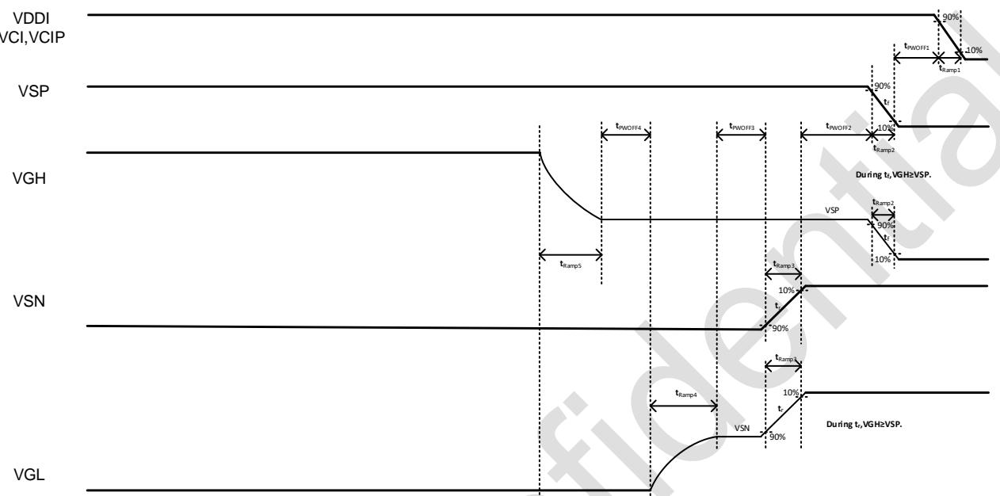

5 路输入电源模式（PM [1:0]=00）

\- 外部 VDDI、VSP、VSN、VGH、VGL。

\- VDDI=1.65\~3.6V

\- VCI=VCIP=2.5\~3.6V，VSP=4.5\~7.65V，VSN=-4.5\~-7.65V。

\- VGH= 7\~20.2V，VGL= -7\~-20.8V（VGH +|VGL| < 31V）。

5 路电源模式断电时序 – DSI：

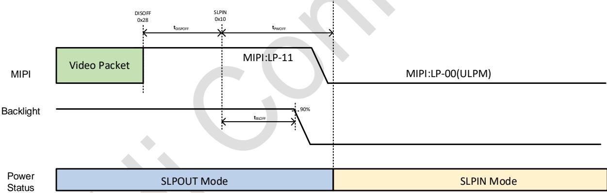

5 路电源模式断电时序 – LVDS：

<table><tr><td colspan="3">VDDI</td></tr><tr><td colspan="3">VCI,VCIP</td></tr><tr><td colspan="3">VSP</td></tr><tr><td colspan="3">VGH</td></tr><tr><td colspan="3">VSN</td></tr><tr><td colspan="3">VGL</td></tr><tr><td colspan="3">STBYB</td></tr><tr><td colspan="3">RESX</td></tr><tr><td colspan="3">LVDS</td></tr><tr><td colspan="3">Backlight</td></tr><tr><td>Power Status</td><td>SLPOUT Mode</td><td>SLPIN Mode</td></tr></table>

## 3.3 输出电压范围

GX610 通过内部电源电路为 α-Si LCD 面板生成相应的电压。请根据 LCD 面板设置各输出电压。
<table><tr><td>名称</td><td>功能</td><td>设定值</td><td>备注</td></tr><tr><td>VSP</td><td>DC/DC 转换电路输出</td><td>+4.5V ~ +7.65V</td><td></td></tr><tr><td>VSN</td><td>DC/DC 转换电路输出</td><td>-4.5V ~ -7.65V</td><td></td></tr><tr><td>VGMPH</td><td>Gamma 电路参考电压</td><td>+4.0V ~ (VSP - 0.2V)</td><td>参考寄存器</td></tr><tr><td>VGMNH</td><td>Gamma 电路参考电压</td><td>-4.0V ~ (VSN + 0.2V)</td><td>参考寄存器</td></tr><tr><td>VGH</td><td>栅极驱动正输出电压电平</td><td>+7.3V ~ +20.2V</td><td>取决于 VSP &amp; VSN</td></tr><tr><td>VGL</td><td>栅极驱动负输出电压电平</td><td>-7.0V ~ -20.8V</td><td>取决于 VSP &amp; VSN</td></tr><tr><td>VCOMO</td><td>VCOMO 直流电压</td><td>-3.8V ~ 0V</td><td></td></tr><tr><td>VDDH</td><td>高速接口电路的模拟电源</td><td>1.5V</td><td>取决于 DSI 与 LVDS IF</td></tr><tr><td>VDDD</td><td>内部数字电路的数字电源。</td><td>1.5V</td><td></td></tr></table>

3.4 LCD 电源生成方案  
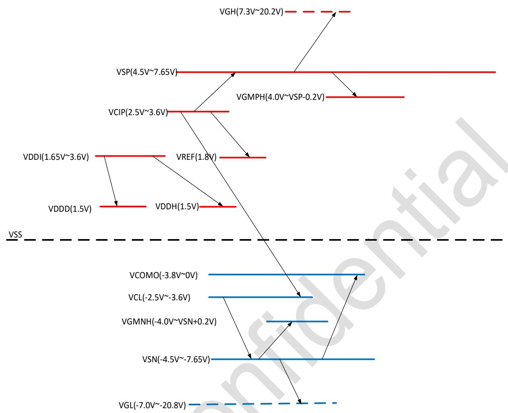  
图 3.1：电源生成方案

## 3.5 DC/DC 转换电路

## 3.5.1 转换电路(PM[1:0]=00)

PM=00 电源结构  
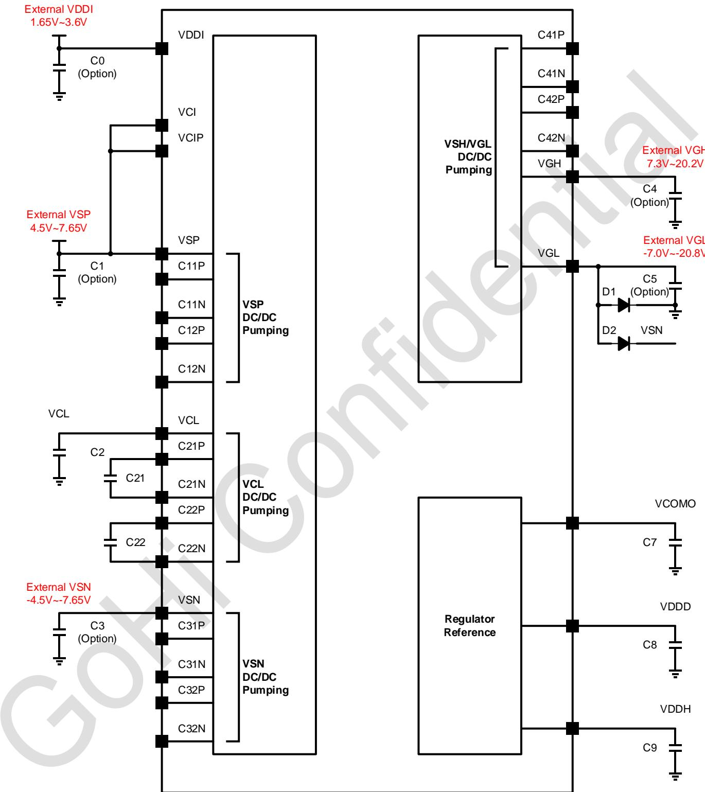

3.5.2 内部电荷泵（Charge Pump）外部元件表(PM[1:0]=00)

<table><tr><td>焊盘名称</td><td>符号</td><td>连接方式</td><td>典型值</td></tr><tr><td>VDDI</td><td>C0 (选项)</td><td>连接电容：VCI/VCIP/VDDI ---(+)----| |--- (-) ----VSSA</td><td>2.2 μF / 6.3V</td></tr><tr><td>VCI/VCIP/VSP</td><td>C1 (选项)</td><td>连接电容：VSP ---(+)----| |--- (-) ----VSSA</td><td>2.2 μF / 10V</td></tr><tr><td>C21P / C21N</td><td>C21</td><td>连接电容：C21P ---(+)----| |--- (-) ----C21N</td><td>1.0 μF / 10V</td></tr><tr><td>C22P / C22N</td><td>C22</td><td>连接电容：C22P ---(+)----| |--- (-) ----C22N</td><td>1.0 μF / 10V</td></tr><tr><td>VCL</td><td>C2</td><td>连接电容：VCL ---(+)----| |--- (-) ----VSSA</td><td>2.2 μF / 10V</td></tr><tr><td>VSN</td><td>C3 (选项)</td><td>连接电容：VSP ---(+)----| |--- (-) ----VSSA</td><td>2.2 μF / 10V</td></tr><tr><td>VGH</td><td>C4 (选项)</td><td>连接电容：VGH ---(+)----| |--- (-) ----VSSA</td><td>2.2 μF / 25V</td></tr><tr><td rowspan="2">VGL</td><td>C5 (选项)</td><td>连接电容：VSSA ---(+)----| |--- (-) ----VGL</td><td>1.0 μF / 25V</td></tr><tr><td>D1</td><td>连接肖特基二极管（Schottky Diode）(VR≥30V)：VGL ---(-)----▶∫--- (+) ----VSSA</td><td>VF &lt; 0.4V / 20mA@25°C,VR ≥30V(推荐二极管: RB521S-30)</td></tr><tr><td>VGL/VSN</td><td>D2</td><td>连接肖特基二极管(VR≥30V)：VGL ---(-)----▶∫--- (+) ----VSN</td><td>VF &lt; 0.4V / 20mA@25°C,VR ≥30V(推荐二极管: RB521S-30)</td></tr><tr><td>VCOMO</td><td>C7</td><td>连接电容：VCOMO ---(-)----| |--- (+) ----VSSA</td><td>2.2 μF / 6.3V</td></tr><tr><td>VDDD</td><td>C8</td><td>连接电容：VDDD ---(+)----| |--- (-) ----VSS</td><td>2.2 μF / 6.3V</td></tr><tr><td>VDDH</td><td>C9</td><td>连接电容：VDDH ---(+)----| |--- (-) ----VSS</td><td>2.2 μF / 6.3V</td></tr></table>

## 3.5.3 转换电路(PM[1:0]=01)

PM=01 电源结构  
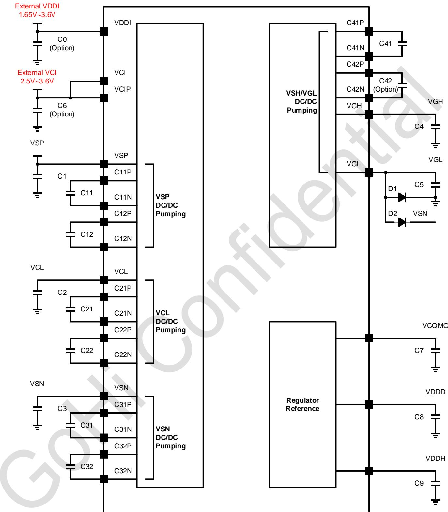

3.5.4 内部电荷泵外部元件表(PM[1:0]=01)

<table><tr><td>焊盘名称</td><td>符号</td><td>连接方式</td><td>典型值</td></tr><tr><td>VDDI</td><td>C0 (选项)</td><td>连接电容：VCI/VCIP/VDDI ---(+)----|---(-)----VSSA</td><td>2.2 μF / 6.3V</td></tr><tr><td>VCI/VCIP</td><td>C6 (选项)</td><td>连接电容：VCI/VCIP/VDDI ---(+)----|---(-) VSSA</td><td>2.2 μF / 6.3V</td></tr><tr><td>C11P / C11N</td><td>C11</td><td>连接电容：C11P ---(+)----|---(-)----C11N</td><td>1.0 μF / 10V</td></tr><tr><td>C12P / C12N</td><td>C12</td><td>连接电容：C12P ---(+)----|---(-)----C12N</td><td>1.0 μF / 10V</td></tr><tr><td>VSP</td><td>C1</td><td>连接电容：VSP ---(+)----|---(-)----VSSA</td><td>2.2 μF / 10V</td></tr><tr><td>C21P / C21N</td><td>C21</td><td>连接电容：C21P ---(+)----|---(-)----C21N</td><td>1.0 μF / 10V</td></tr><tr><td>C22P / C22N</td><td>C22</td><td>连接电容：C22P ---(+)----|---(-)----C22N</td><td>1.0 μF / 10V</td></tr><tr><td>VCL</td><td>C2</td><td>连接电容：VCL ---(+)----|---(-)----VSSA</td><td>2.2 μF / 10V</td></tr><tr><td>C31P / C31N</td><td>C31</td><td>连接电容：C31P ---(+)----|---(-)----C31N</td><td>1.0 μF / 10V</td></tr><tr><td>C32P / C32N</td><td>C32</td><td>连接电容：C32P ---(+)----|---(-)----C32N</td><td>1.0 μF / 10V</td></tr><tr><td>VSN</td><td>C3</td><td>连接电容：VSP ---(+)----|---(-)----VSSA</td><td>2.2 μF / 10V</td></tr><tr><td>C41P / C41N</td><td>C41</td><td>连接电容：C41P ---(+)----|---(-)----C41N</td><td>1.0 μF / 25V</td></tr><tr><td>C42P / C42N</td><td>C42 (选项)</td><td>连接电容：C42P ---(+)----|---(-)----C42N</td><td>1.0 μF / 25V</td></tr><tr><td>VGH</td><td>C4</td><td>连接电容：VGH ---(+)----|---(-)----VSSA</td><td>2.2 μF / 25V</td></tr><tr><td rowspan="2">VGL</td><td>C5</td><td>连接电容：VSSA ---(+)----|---(-) VGL</td><td>1.0 μF / 25V</td></tr><tr><td>D1</td><td>连接肖特基二极管(VR≥30V)：VGL ---(-)----▶---(+)VSSA</td><td>VF &lt; 0.4V / 20mA@25°C,VR ≥30V(推荐二极管: RB521S-30)</td></tr><tr><td>VGL/VSN</td><td>D2</td><td>连接肖特基二极管(VR≥30V)：VGL ---(-)----▶---(+)VSN</td><td>VF &lt; 0.4V / 20mA@25°C,VR ≥30V(推荐二极管: RB521S-30)</td></tr><tr><td>VCOMO</td><td>C7</td><td>连接电容：VCOMO ---(-)----|---(+)----VSSA</td><td>2.2 μF / 6.3V</td></tr><tr><td>VDDD</td><td>C8</td><td>连接电容：VDDD ---(+)----|---(-)----VSS</td><td>2.2 μF / 6.3V</td></tr><tr><td>VDDH</td><td>C9</td><td>连接电容：VDDH ---(+)----|---(-)----VSS</td><td>2.2 μF / 6.3V</td></tr></table>

## 3.5.5 转换电路(PM[1:0]=10)

PM=10 电源结构  
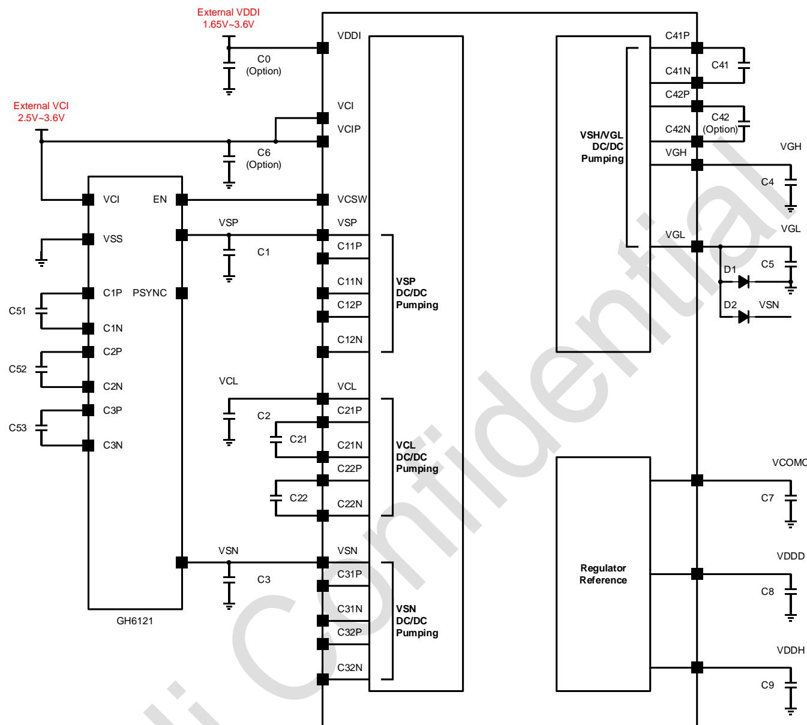

3.5.6 内部电荷泵外部元件表(PM[1:0]=10)

<table><tr><td>焊盘名称</td><td>符号</td><td>连接方式</td><td>典型值</td></tr><tr><td>VDDI</td><td>C0 (选项)</td><td>连接电容：VCI/VCIP/VDDI ---(+)----|---(-)----VSSA</td><td>2.2 μF / 6.3V</td></tr><tr><td>VCI/VCIP</td><td>C6 (选项)</td><td>连接电容：VCI/VCIP/VDDI ---(+)----|---(-) VSSA</td><td>2.2 μF / 6.3V</td></tr><tr><td>VSP</td><td>C1</td><td>连接电容：VSP ---(+)----|---(-)----VSSA</td><td>2.2 μF / 10V</td></tr><tr><td>C21P / C21N</td><td>C21</td><td>连接电容：C21P ---(+)----|---(-)----C21N</td><td>1.0 μF / 10V</td></tr><tr><td>C22P / C22N</td><td>C22</td><td>连接电容：C22P ---(+)----|---(-)----C22N</td><td>1.0 μF / 10V</td></tr><tr><td>VCL</td><td>C2</td><td>连接电容：VCL ---(+)----|---(-)----VSSA</td><td>2.2 μF / 10V</td></tr><tr><td>VSN</td><td>C3</td><td>连接电容：VSP ---(+)----|---(-)----VSSA</td><td>2.2 μF / 10V</td></tr><tr><td>C51P / C51N</td><td>C15</td><td>连接电容：C1P ---(+)----|---(-)----C1N</td><td>2.2 μF / 10V</td></tr><tr><td>C52P / C52N</td><td>C16</td><td>连接电容：C2P ---(+)----|---(-)----C2N</td><td>2.2 μF / 10V</td></tr><tr><td>C53P/ C53N</td><td>C17</td><td>连接电容：C3P ---(+)----|---(-)----C3N</td><td>2.2 μF / 10V</td></tr><tr><td>C41P / C41N</td><td>C41</td><td>连接电容：C41P ---(+)----|---(-)----C41N</td><td>1.0 μF / 25V</td></tr><tr><td>C42P / C42N</td><td>C42 (选项)</td><td>连接电容：C42P ---(+)----|---(-)----C42N</td><td>1.0 μF / 25V</td></tr><tr><td>VGH</td><td>C4</td><td>连接电容：VGH ---(+)----|---(-)----VSSA</td><td>2.2 μF / 25V</td></tr><tr><td rowspan="2">VGL</td><td>C5</td><td>连接电容：VSSA ---(+)----|---(-)----VGL</td><td>1.0 μF / 25V</td></tr><tr><td>D1</td><td>连接肖特基二极管(VR≥30V)：VGL ---(-)----▶j---(+)----VSSA</td><td>VF &lt; 0.4V / 20mA@25°C,VR ≥30V(推荐二极管:RB521S-30)</td></tr><tr><td>VGL/VSN</td><td>D2</td><td>连接肖特基二极管(VR≥30V)：VGL ---(-)----▶j---(+)----VSN</td><td>VF &lt; 0.4V / 20mA@25°C,VR ≥30V(推荐二极管:RB521S-30)</td></tr><tr><td>VCOMO</td><td>C7</td><td>连接电容：VCOMO ---(-)----|---(+)----VSSA</td><td>2.2 μF / 6.3V</td></tr><tr><td>VDDD</td><td>C8</td><td>连接电容：VDDD ---(+)----|---(-)----VSS</td><td>2.2 μF / 6.3V</td></tr><tr><td>VDDH</td><td>C9</td><td>连接电容：VDDH ---(+)----|---(-)----VSS</td><td>2.2 μF / 6.3V</td></tr></table>

## 3.5.7 转换电路(PM[1:0]=11)

PM=11 电源结构  
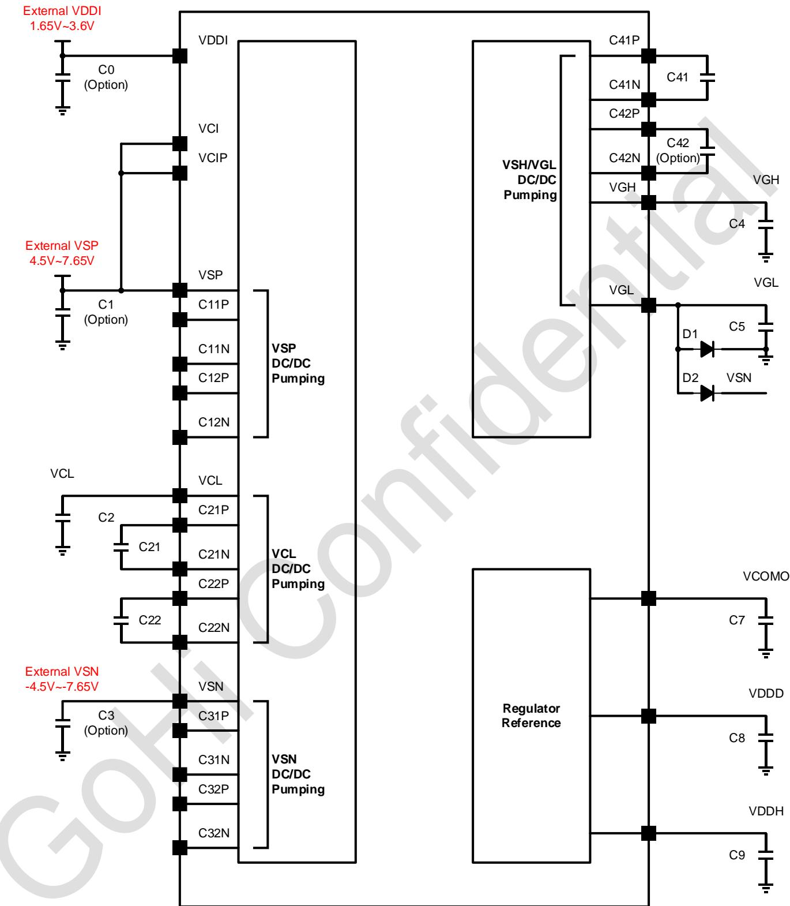

3.5.8 内部电荷泵外部元件表(PM[1:0]=11)

<table><tr><td>焊盘名称</td><td>符号</td><td>连接方式</td><td>典型值</td></tr><tr><td>VDDI</td><td>C0 (选项)</td><td>连接电容：VCI/VCIP/VDDI ---(+)----| |--- (-) -VSSA</td><td>2.2 μF / 6.3V</td></tr><tr><td>VCI/VCIP/VSP</td><td>C1 (选项)</td><td>连接电容：VSP ---(+)----| |--- (-) ----VSSA</td><td>2.2 μF / 10V</td></tr><tr><td>C21P / C21N</td><td>C21</td><td>连接电容：C21P ---(+)----| |--- (-) ----C21N</td><td>1.0 μF / 10V</td></tr><tr><td>C22P / C22N</td><td>C22</td><td>连接电容：C22P ---(+)----| |--- (-) ----C22N</td><td>1.0 μF / 10V</td></tr><tr><td>VCL</td><td>C2</td><td>连接电容：VCL ---(+)----| |--- (-) ----VSSA</td><td>2.2 μF / 10V</td></tr><tr><td>VSN</td><td>C3 (选项)</td><td>连接电容：VSP ---(+)----| |--- (-) ----VSSA</td><td>2.2 μF / 10V</td></tr><tr><td>C41P / C41N</td><td>C41</td><td>连接电容：C41P ---(+)----| |--- (-) ----C41N</td><td>1.0 μF / 25V</td></tr><tr><td>C42P / C42N</td><td>C42 (选项)</td><td>连接电容：C42P ---(+)----| |--- (-) ----C42N</td><td>1.0 μF / 25V</td></tr><tr><td>VGH</td><td>C4</td><td>连接电容：VGH ---(+)----| |--- (-) ----VSSA</td><td>2.2 μF / 25V</td></tr><tr><td rowspan="2">VGL</td><td>C5</td><td>连接电容：VSSA ---(+)----| |--- (-) ----VGL</td><td>1.0 μF / 25V</td></tr><tr><td>D1</td><td>连接肖特基二极管(VR≥30V)：VGL ---(-) ----▶∫--- (+) ----VSSA</td><td>VF &lt; 0.4V / 20mA@25°C,VR ≥30V(推荐二极管:RB521S-30)</td></tr><tr><td>VGL/VSN</td><td>D2</td><td>连接肖特基二极管(VR≥30V)：VGL ---(-) ----▶∫--- (+) ----VSN</td><td>VF &lt; 0.4V / 20mA@25°C,VR ≥30V(推荐二极管:RB521S-30)</td></tr><tr><td>VCOMO</td><td>C7</td><td>连接电容：VCOMO ---(-)----| |--- (+) ----VSSA</td><td>2.2 μF / 6.3V</td></tr><tr><td>VDDD</td><td>C8</td><td>连接电容：VDDD ---(+)----| |--- (-) ----VSS</td><td>2.2 μF / 6.3V</td></tr><tr><td>VDDH</td><td>C9</td><td>连接电容：VDDH ---(+)----| |--- (-) ----VSS</td><td>2.2 μF / 6.3V</td></tr></table>

4 最大布线电阻

<table><tr><td>名称</td><td>引脚定义</td><td>最大串联电阻</td><td>单位</td></tr><tr><td>VCI, VCIP, VDDI</td><td>电源</td><td>5</td><td>Ω</td></tr><tr><td>VCOMO, VCOML_OUT, VCOMR_OUT</td><td>输出，电容连接</td><td>5</td><td>Ω</td></tr><tr><td>VDDD, VDDH</td><td>输出，电容连接</td><td>5</td><td>Ω</td></tr><tr><td>VGMNL, VGMNH, VGMPL, VGMPH</td><td>输入/输出</td><td>5</td><td>Ω</td></tr><tr><td>VSP, VSN, VCL</td><td>输入/输出，电容连接</td><td>5</td><td>Ω</td></tr><tr><td>VGH, VGL</td><td>输入/输出，电容连接</td><td>10</td><td>Ω</td></tr><tr><td>C11P, C11N, C12P, C12N, C21P, C21N, C22P, C22N, C31P, C31N, C32P, C32N, C41P, C41N, C42P, C42N,</td><td>电容连接</td><td>5</td><td>Ω</td></tr><tr><td>VSS, VSSA, VSSP, VSSI</td><td>电源</td><td>5</td><td>Ω</td></tr><tr><td>DP[0], DN[0]</td><td>输入/输出</td><td>5</td><td>Ω</td></tr><tr><td>DP[1], DN[1]</td><td>输入</td><td>5</td><td>Ω</td></tr><tr><td>DP[2], DN[2]</td><td>输入</td><td>5</td><td>Ω</td></tr><tr><td>DP[3], DN[3]</td><td>输入</td><td>5</td><td>Ω</td></tr><tr><td>CKP, CKN</td><td>输入</td><td>5</td><td>Ω</td></tr><tr><td>IM[2:0], PM[1:0]</td><td>输入</td><td>100</td><td>Ω</td></tr><tr><td>LR_SDI1, UD_SDI2</td><td>输入</td><td>100</td><td>Ω</td></tr><tr><td>RESX, STBYB, SPI_CSB, SCL, SPI_MOSI, CMD_SEL, ADDR_SDI3, GIP_PIN1</td><td>输入</td><td>100</td><td>Ω</td></tr><tr><td>SPI_MISO, SYNCR[5:0],T[12:0]</td><td>输入/输出</td><td>100</td><td>Ω</td></tr><tr><td>DCLK, VS, HS, DE</td><td>输入</td><td>100</td><td>Ω</td></tr><tr><td>D[7:0], D8_DSW0, D9_DSW1, D10_PNSW,D11_LVFMT, D12_LVBIT, D13_CASC, D[17:14], D18_SYNCL5,D19_SYNCL4, D20_SYNCL3 D21_SYNCL2, D22_SYNCL1, D23_SYNCL0</td><td>输入</td><td>100</td><td>Ω</td></tr><tr><td>TS_EN, TS_SET[3:0]</td><td>输入</td><td>100</td><td>Ω</td></tr><tr><td>TS_OP, TS_ON, TS_OUT[9:0], ERR, VCSW, TE, PWM, GPO, CRACK_L, CRACK_R</td><td>输出</td><td>100</td><td>Ω</td></tr><tr><td>GL[1~20], GR[1~20]</td><td>输出</td><td>10</td><td>Ω</td></tr><tr><td>VCOMIN</td><td>输入</td><td>&lt; 5</td><td>Ω</td></tr></table>

## 5 引脚说明

<table><tr><td>引脚名称</td><td>引脚类型</td><td colspan="5">说明</td></tr><tr><td>D[23:0]</td><td>I</td><td colspan="5">显示接口。若不使用，请将其悬空或接 GND。</td></tr><tr><td>DCLK</td><td>I</td><td colspan="5">RGB 接口的像素时钟输入。若不使用，请保持悬空。</td></tr><tr><td>DE</td><td>I</td><td colspan="5">RGB 接口的数据使能输入。若不使用，请保持悬空。</td></tr><tr><td>HS</td><td>I</td><td colspan="5">RGB 接口的水平同步输入。若不使用，请保持悬空。</td></tr><tr><td>VS</td><td>I</td><td colspan="5">RGB 接口的垂直同步输入。若不使用，请保持悬空。</td></tr><tr><td>DP[0]/DN[0]DP[1]/DN[1]DP[2]/DN[2]DP[3]/DN[3]</td><td>I</td><td colspan="5">MIPI 或 LVDS 数据输入，由 LANE[1:0] 选择</td></tr><tr><td>CKP/CKN</td><td>I</td><td colspan="5">MIPI/LVDS 时钟输入</td></tr><tr><td>IM[2:0]</td><td>I</td><td colspan="5">接口选择0: MIPI(默认)1: LVDS注: 复用 ADDR，即 I2C 从机地址。若不使用，请保持悬空。</td></tr><tr><td>UD_SDI2</td><td>I</td><td colspan="5">栅极驱动上/下顺序控制H: 从上到下扫描L: 从下到上扫描(默认)若不使用，请保持悬空。</td></tr><tr><td>LR_SDI1</td><td>I</td><td colspan="5">源极驱动右/左顺序控制H: S[1]→S[2] →...→S[1080] (默认)L: S[1080] →S[1079] →...→S[1]若不使用，请保持悬空。</td></tr><tr><td>ADDR_SDI3</td><td>I</td><td colspan="5">面板芯片 ID 设置 (默认:00)ADDR: H: 芯片 ID1 L: 芯片 ID0ADDR: I2C 从机地址</td></tr><tr><td rowspan="7">PM[1:0]</td><td rowspan="7">I</td><td colspan="5">电源模式:</td></tr><tr><td>PM[1:0]</td><td>VDDI</td><td>VCI</td><td>VSP/VSN</td><td>VGH/VGL</td></tr><tr><td>00</td><td>外部</td><td>VSP</td><td>外部</td><td>外部</td></tr><tr><td>01 (默认)</td><td>外部</td><td>外部</td><td>内部</td><td>内部</td></tr><tr><td>10</td><td>外部</td><td>外部</td><td>PMIC</td><td>内部</td></tr><tr><td>11</td><td>外部</td><td>VSP</td><td>外部</td><td>内部</td></tr><tr><td colspan="5">注: PM[1] 复用 ADDR[1]，即 I2C 从机地址。若不使用，请保持悬空。</td></tr><tr><td>RESX</td><td>I</td><td colspan="5">复位输入引脚，由主机控制复位，或通过 RC 复位电路将其连接至 VDDI 以保证稳定性。H: 正常工作。(默认)L: 复位状态</td></tr><tr><td>STBYB</td><td>I</td><td colspan="5">待机模式。H: 正常工作。(默认)L: 时序控制器、源极驱动将关闭，所有输出为高阻态（High-Z）。若不使用，请保持悬空。</td></tr><tr><td>CMD_SEL</td><td>I</td><td colspan="5">命令接口选择。H: SPI L: I2C (默认)若不使用，请保持悬空。</td></tr><tr><td>SPI_CSB</td><td>I</td><td colspan="5">SPI 接口的片选引脚H: 无法访问芯片。(默认)L: 可访问芯片若不使用，请将其连接至 VDDI。</td></tr><tr><td>SCL</td><td>I</td><td colspan="5">SPI(SPI_CLK) 与 I2C(I2C_SCL) 的串行通信时钟信号注: I2C 模式下通常上拉为高电平。(默认)SPI 模式下通常下拉为低电平。若不使用，请保持悬空。</td></tr><tr><td>SPI_MISO</td><td>I/O</td><td colspan="5">SPI 的串行数据输入。在 I2C 接口工作时为串行数据输入/输出引脚(I2C_SDA)。若不使用，请保持悬空</td></tr><tr><td>SPI_MOSI</td><td>I</td><td colspan="5">SPI 接口工作时的串行数据输入引脚。若不使用，请保持悬空。</td></tr><tr><td>S[1080:1]</td><td>O</td><td colspan="5">源极驱动电压输出，未使用的引脚请保持悬空。</td></tr></table>
<table><tr><td rowspan="20"></td><td rowspan="20"></td><td>通道选择</td><td>使能通道</td><td>禁止通道</td></tr><tr><td>390</td><td>217~411, 670~864</td><td>1~216, 412~669, 865~1080</td></tr><tr><td>400</td><td>217~416, 665~864</td><td>1~216, 417~664, 865~1080</td></tr><tr><td>480</td><td>217~456, 625~864</td><td>1~216, 457~624, 865~1080</td></tr><tr><td>512</td><td>217~472, 609~864</td><td>1~216, 473~608, 865~1080</td></tr><tr><td>540</td><td>217~486, 595~864</td><td>1~216, 487~594, 865~1080</td></tr><tr><td>600</td><td>217~516, 565~864</td><td>1~216, 517~564, 865~1080</td></tr><tr><td>640</td><td>217~536, 545~864</td><td>1~216, 537~544, 865~1080</td></tr><tr><td>720</td><td>1~360,721~1080</td><td>361~720</td></tr><tr><td>750</td><td>1~375,706~1080</td><td>376~705</td></tr><tr><td>768</td><td>1~384,697~1080</td><td>385~696</td></tr><tr><td>780</td><td>1~390,691~1080</td><td>391~690</td></tr><tr><td>800</td><td>1~400,681~1080</td><td>401~680</td></tr><tr><td>804</td><td>1~402,679~1080</td><td>403~678</td></tr><tr><td>810</td><td>1~405,676~1080</td><td>406~675</td></tr><tr><td>816</td><td>1~408,673~1080</td><td>409~672</td></tr><tr><td>900</td><td>1~450,631~1080</td><td>451~630</td></tr><tr><td>960</td><td>1~480,601~1080</td><td>481~600</td></tr><tr><td>1024</td><td>1~512,569~1080</td><td>513~568</td></tr><tr><td>1080</td><td>1~1080</td><td></td></tr><tr><td>SZ[3:2]</td><td>O</td><td colspan="3">SZ[3:2] 用于 Zig-zag 面板。</td></tr><tr><td>GL[20:1]</td><td>O</td><td colspan="3">这些引脚用于面板栅极控制信号。如不使用，请保持开路。</td></tr><tr><td>GR[20:1]</td><td>O</td><td colspan="3">这些引脚用于面板栅极控制信号。如不使用，请保持开路。</td></tr><tr><td>TS_OUT[9:0]</td><td>T</td><td colspan="3">测试引脚。正常工作时请将这些引脚悬空。</td></tr><tr><td>TS_SET[3:0]</td><td>T</td><td colspan="3">测试引脚。正常工作时请将这些引脚悬空。</td></tr><tr><td>TS_EN</td><td>T</td><td colspan="3">测试引脚。正常工作时请将这些引脚悬空。如不使用，请保持开路。</td></tr><tr><td>ERR</td><td>T</td><td colspan="3">测试引脚。正常工作时请将这些引脚悬空。</td></tr><tr><td>VCSW</td><td>O</td><td colspan="3">使能外部电源 IC 的电源。</td></tr><tr><td>TS_OP</td><td>T</td><td colspan="3">测试引脚。正常工作时请将这些引脚悬空。</td></tr><tr><td>TS_ON</td><td>T</td><td colspan="3">测试引脚。正常工作时请将这些引脚悬空。</td></tr><tr><td>TS RAM[ [12:0]</td><td>T</td><td colspan="3">测试引脚。正常工作时请将这些引脚悬空。</td></tr><tr><td>CRACK_L</td><td>T</td><td colspan="3">测试引脚。正常工作时请将这些引脚悬空。</td></tr><tr><td>CRACK_R</td><td>T</td><td colspan="3">测试引脚。正常工作时请将这些引脚悬空。</td></tr><tr><td>TE</td><td>O</td><td colspan="3">如不使用，请保持开路</td></tr><tr><td>PWM</td><td>O</td><td colspan="3">如不使用，请保持开路</td></tr><tr><td>GPO</td><td>O</td><td colspan="3">如不使用，请保持开路</td></tr><tr><td>DUMMY</td><td>-</td><td colspan="3">-</td></tr><tr><td colspan="5">电源</td></tr><tr><td>VDDD</td><td>PO</td><td colspan="3">逻辑电路的内部电源。请连接稳定电容。</td></tr><tr><td>VSS</td><td>PI</td><td colspan="3">内部逻辑的 GND。VSS=0V。采用 COG 方式时，请连接到 FPC 上的 VSSA 以防止噪声。</td></tr><tr><td>VDDI</td><td>PI</td><td colspan="3">I/O 电路的电源。VDDI=1.65V 至 3.6V</td></tr><tr><td>VDDH</td><td>PO</td><td colspan="3">LVDS/MIPI 的内部电源。请连接稳定电容。</td></tr><tr><td>VCI/VCIP</td><td>PI</td><td colspan="3">模拟电路的电源。VCI=2.5V 至 3.6V</td></tr><tr><td>VSSI</td><td>PI</td><td colspan="3">LVDS/MIPI 的 GND。VSSI=0V。采用 COG 方式时，请连接到 FPC 上的 VSSA 以防止噪声。</td></tr><tr><td>VSSA</td><td>PI</td><td colspan="3">模拟地。VSSA=0V</td></tr><tr><td>VSSP</td><td>PI</td><td colspan="3">电荷泵（Charge Pump）的接地</td></tr><tr><td>VSP</td><td>PI/PO</td><td colspan="3">正电源。</td></tr><tr><td>VCL</td><td>PI/PO</td><td colspan="3">负电源。</td></tr><tr><td>VSN</td><td>PI/PO</td><td colspan="3">负电源。</td></tr><tr><td>VGH</td><td>PO</td><td colspan="3">升压电路的输出电压。请在 VGH 与系统地之间连接稳定电容。</td></tr><tr><td>VGL</td><td>PO</td><td colspan="3">升压电路的输出电压。请在 VGL 与系统地之间连接稳定电容。</td></tr><tr><td>VCOMO</td><td>PO</td><td colspan="3">DC COM 驱动中公共电压的电源。请在 VCOMO 与系统地之间连接稳定电容。</td></tr><tr><td>VOTP</td><td>I</td><td colspan="3">外部高压引脚，用于 OTP 编程模式。工作电源为 9.5V~10.0V。如不使用，请保持开路。</td></tr><tr><td>VCOMIN</td><td>I</td><td colspan="3">用于将 VCOMO 连接到 PANEL</td></tr><tr><td>VGMNL</td><td>PO</td><td colspan="3">源极驱动器内部负伽马（Gamma）电阻串底部电压。</td></tr><tr><td>VGMNH</td><td>PO</td><td colspan="3">源极驱动器内部负伽马（Gamma）电阻串顶部电压。</td></tr><tr><td>VGMPL</td><td>PO</td><td colspan="3">源极驱动器内部正伽马（Gamma）电阻串底部电压</td></tr><tr><td>VGMPH</td><td>PO</td><td colspan="3">源极驱动器内部正伽马（Gamma）电阻串顶部电压</td></tr><tr><td>VCOML_OUT</td><td>PO</td><td colspan="3">VCOML_OUT 与 VCOMO 相连。</td></tr><tr><td>VCOMR_OUT</td><td>PO</td><td colspan="3">芯片内部 VCOMIN 与 VCOMR_OUT 相连。</td></tr><tr><td colspan="5">DC/DC 泵浦</td></tr><tr><td>C11P, C11N</td><td rowspan="2">I/O</td><td colspan="3" rowspan="2">根据 DC/DC 泵浦倍率连接升压电容，对 VSP 电压进行泵浦。如不使用，请保持开路。</td></tr><tr><td colspan="3">C12P, C12N</td></tr><tr><td>C21P, C21N</td><td rowspan="2">I/O</td><td colspan="3" rowspan="2">根据 DC/DC 泵浦倍率连接升压电容，对 VCL 电压进行泵浦。如不使用，请保持开路。</td></tr><tr><td colspan="3">C22P, C22N</td></tr><tr><td>C31P, C31N</td><td rowspan="2">I/O</td><td colspan="3" rowspan="2">根据 DC/DC 泵浦倍率连接升压电容，对 VSN 电压进行泵浦。如不使用，请保持开路。</td></tr><tr><td colspan="3">C32P, C32N</td></tr><tr><td>C41P, C41N</td><td rowspan="2">I/O</td><td colspan="3" rowspan="2">根据 DC/DC 泵浦倍率连接升压电容，对 VGH/VGL 电压进行泵浦。如不使用，请保持开路。</td></tr><tr><td colspan="3">C42P, C42N</td></tr></table>

## 5.1 LVDS/MIPI 接口输入映射表

## MIPI 数据通道交换选择引脚

<table><tr><td colspan="12">MIPI 接口</td></tr><tr><td>DSW&lt;1:0&gt;</td><td>PNSW</td><td>DP[0]</td><td>DN[0]</td><td>DP[1]</td><td>DN[1]</td><td>CKP</td><td>CKN</td><td>DP[2]</td><td>DN[2]</td><td>DP[3]</td><td>DN[3]</td></tr><tr><td rowspan="2">2&#x27;b00</td><td>0</td><td>D3P</td><td>D3N</td><td>D2P</td><td>D2N</td><td>CKP</td><td>CKN</td><td>D1P</td><td>D1N</td><td>D0P</td><td>D0N</td></tr><tr><td>1</td><td>D3N</td><td>D3P</td><td>D2N</td><td>D2P</td><td>CKN</td><td>CKP</td><td>D1N</td><td>D1P</td><td>D0N</td><td>D0P</td></tr><tr><td rowspan="2">2&#x27;b01</td><td>0</td><td>D0P</td><td>D0N</td><td>D1P</td><td>D1N</td><td>CKP</td><td>CKN</td><td>D2P</td><td>D2N</td><td>D3P</td><td>D3N</td></tr><tr><td>1</td><td>D0N</td><td>D0P</td><td>D1N</td><td>D1P</td><td>CKN</td><td>CKP</td><td>D2N</td><td>D2P</td><td>D3N</td><td>D3P</td></tr><tr><td rowspan="2">2&#x27;b10</td><td>0</td><td>D2P</td><td>D2N</td><td>D1P</td><td>D1N</td><td>CKP</td><td>CKN</td><td>D0P</td><td>D0N</td><td>D3P</td><td>D3N</td></tr><tr><td>1</td><td>D2N</td><td>D2P</td><td>D1N</td><td>D1P</td><td>CKN</td><td>CKP</td><td>D0N</td><td>D0P</td><td>D3N</td><td>D3P</td></tr><tr><td rowspan="2">2&#x27;b11</td><td>0</td><td>D3P</td><td>D3N</td><td>D0P</td><td>D0N</td><td>CKP</td><td>CKN</td><td>D1P</td><td>D1N</td><td>D2P</td><td>D2N</td></tr><tr><td>1</td><td>D3N</td><td>D3P</td><td>D0N</td><td>D0P</td><td>CKN</td><td>CKP</td><td>D1N</td><td>D1P</td><td>D2N</td><td>D2P</td></tr></table>

LVDS 数据/时钟通道交换选择引脚

<table><tr><td colspan="12">LVDS 接口</td></tr><tr><td>DSW&lt;1:0&gt;</td><td>PNSW</td><td>DP[0]</td><td>DN[0]</td><td>DP[1]</td><td>DN[1]</td><td>CKP</td><td>CKN</td><td>DP[2]</td><td>DN[2]</td><td>DP[3]</td><td>DN[3]</td></tr><tr><td rowspan="2">2&#x27;b00</td><td>0</td><td>D3P</td><td>D3N</td><td>CKP</td><td>CKN</td><td>D2P</td><td>D2N</td><td>D1P</td><td>D1N</td><td>D0P</td><td>D0N</td></tr><tr><td>1</td><td>D3N</td><td>D3P</td><td>CKN</td><td>CKP</td><td>D2N</td><td>D2P</td><td>D1N</td><td>D1P</td><td>D0N</td><td>D0P</td></tr><tr><td rowspan="2">2&#x27;b01</td><td>0</td><td>D0P</td><td>D0P</td><td>D1P</td><td>D1N</td><td>D2P</td><td>D2N</td><td>CKP</td><td>CKN</td><td>D3P</td><td>D3N</td></tr><tr><td>1</td><td>D0N</td><td>D0N</td><td>D1N</td><td>D1P</td><td>D2N</td><td>D2P</td><td>CKN</td><td>CKP</td><td>D3N</td><td>D3P</td></tr><tr><td rowspan="2">2&#x27;b10</td><td>0</td><td>D3P</td><td>D3N</td><td>D2P</td><td>D2N</td><td>CKP</td><td>CKN</td><td>D1P</td><td>D1N</td><td>D0P</td><td>D0N</td></tr><tr><td>1</td><td>D3N</td><td>D3P</td><td>D2N</td><td>D2P</td><td>CKN</td><td>CKP</td><td>D1N</td><td>D1P</td><td>D0N</td><td>D0P</td></tr><tr><td rowspan="2">2&#x27;b11</td><td>0</td><td>D0P</td><td>D0N</td><td>D1P</td><td>D1N</td><td>CKP</td><td>CKN</td><td>D2P</td><td>D2N</td><td>D3P</td><td>D3N</td></tr><tr><td>1</td><td>D0N</td><td>D0P</td><td>D1N</td><td>D1P</td><td>CKN</td><td>CKP</td><td>D2N</td><td>D2P</td><td>D3N</td><td>D3P</td></tr></table>

## 6 接口

GX610 支持 SPI / I2C（命令读写）、RGB、LVDS、DSI（Display Serial Interface，显示串行接口）。接口模式可通过 IM[1:0] 与 CMD\_SEL 引脚的设置来选择，如表 6.1 所示。

<table><tr><td>CMD_SEL</td><td>命令接口</td></tr><tr><td>0</td><td>I2C</td></tr><tr><td>1</td><td>SPI</td></tr></table>

<table><tr><td colspan="3">IM[2:0]</td><td>显示接口</td></tr><tr><td>0</td><td>0</td><td>0</td><td>MIPI</td></tr><tr><td>0</td><td>0</td><td>1</td><td>LVDS</td></tr><tr><td>0</td><td>1</td><td>0</td><td>RGB</td></tr><tr><td>0</td><td>1</td><td>1</td><td>QSPI</td></tr><tr><td>1</td><td>0</td><td>0</td><td>MCU</td></tr><tr><td>1</td><td>0</td><td>1</td><td>DSPI</td></tr><tr><td>1</td><td>1</td><td>0</td><td>3line-SPI</td></tr><tr><td>1</td><td>1</td><td>1</td><td>4line-SPI</td></tr></table>

表 6.1：接口选择

## 6.1 I2C 接口

## 6.1.1 I2C 格式

I2C 总线用于不同 LCD 或模块之间的双向两线通信。这两条线分别是串行数据线（I2C\_SDA）和串行时钟线（I2C\_SCL）。两条线都必须通过上拉电阻连接到正电源。只有在总线不忙时才能启动数据传输。每个 8 位字节之后都跟随一个应答位。应答位是由发送器置于总线上的高电平（HIGH）信号，在此期间主器件会产生一个额外的应答相关时钟脉冲。被寻址的从接收器必须在接收到每个字节后产生应答。同样，主接收器在从从发送器时钟读出每个字节后也必须产生应答。

I2C 总线协议：

在 I2C 总线上传输任何数据之前，首先寻址应当响应的器件。MCU 可选择四个从地址。从地址寻址始终通过 START 过程之后发送的第一个字节来完成。

定义：

- 发送器（Transmitter）：向总线发送数据的器件。

接收器（Receiver）：从总线接收数据的器件。

- 主器件（Master）：启动传输、产生时钟信号并终止传输的器件。

- 从器件（Slave）：被主器件寻址的器件。

- 多主器件（Multi-master）：允许多个主器件同时尝试控制总线而不破坏报文。

- 仲裁（Arbitration）：确保当多个主器件同时尝试控制总线时，只允许其中一个控制总线且报文不被破坏的过程。

- 同步（Synchronization）：使两个或多个器件的时钟信号同步的过程。

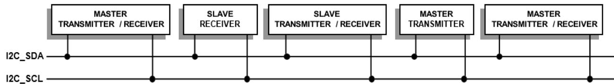

## 6.1.2 I2C 接口的命令写序列

GX610 支持通过 I2C 总线传输进行寄存器写序列。寄存器写入支持单寄存器写入模式和多寄存器写入模式。详细的传输序列如下所示并说明。

1) 寄存器写入的数据传输采用如下所示的格式。

2) 在 START 条件（S）之后，发送从地址。写操作时 R/W 位设置为“0”。

3) 从器件向主器件发出 ACK。

4) 先传输 8 位命令地址，然后传输寄存器数据参数。

5) 数据传输始终由 STOP 条件终止。

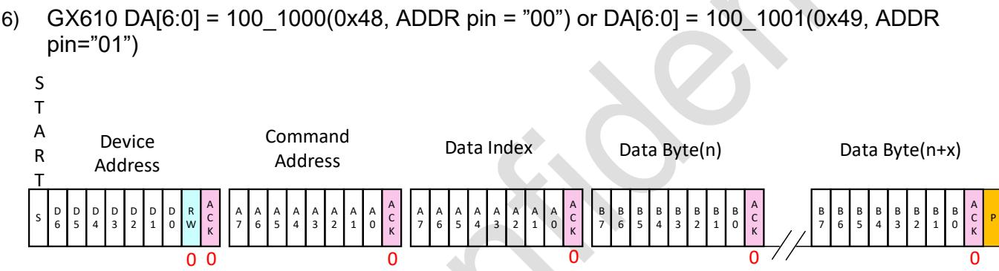

图 6.4：I2C 写命令 + 数据发送  
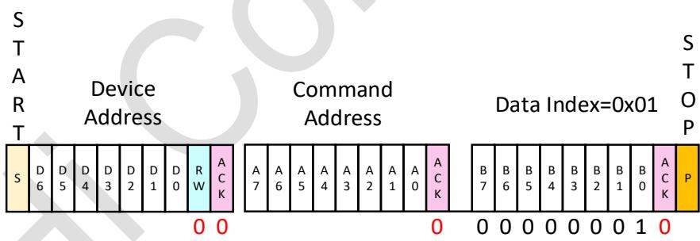  
图 6.5：仅 I2C 写命令发送

## 6.1.3 I2C 接口的命令读序列

GX610 支持通过 I2C 总线传输进行寄存器读序列。寄存器数据读取传输采用如下所示格式。

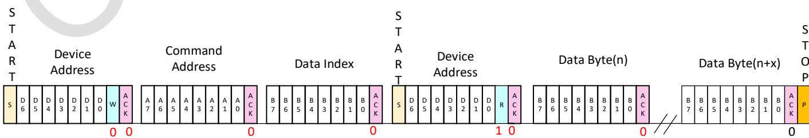  
图 6.6：I2C 读命令 + 数据发送

## 6.2 RGB 接口

## 6.2.1 通用时序图

当接口上的时序超出范围时，显示器上的图像信息可能不正确（超出范围的时序不会对显示模块造成任何损坏，也不会对主机侧造成任何损坏）。如果时序从超出范围恢复到范围内，则显示模块必须在下一帧（垂直同步）自动显示正确的图像。

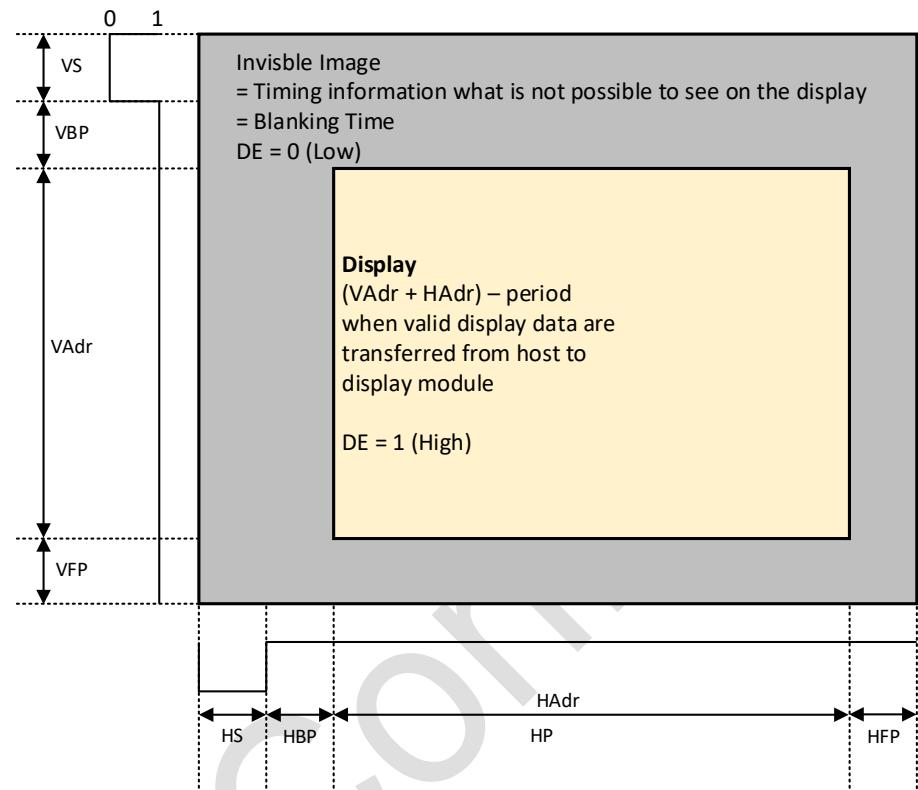  
图 6.7：通用时序图

同步模式  
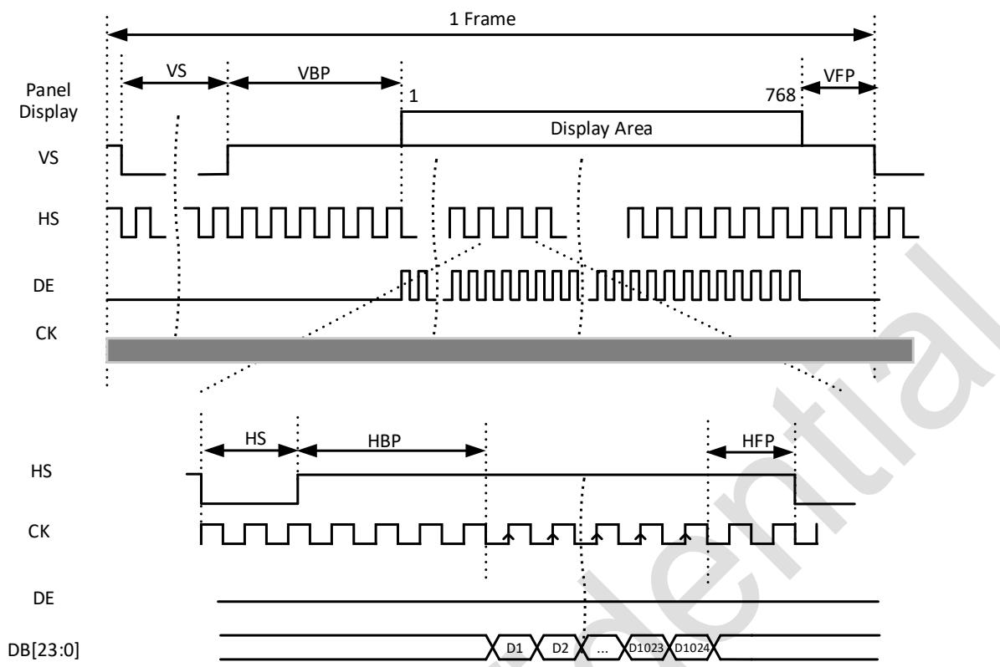  
图 6.8：RGB（1024RGB x768）时序图

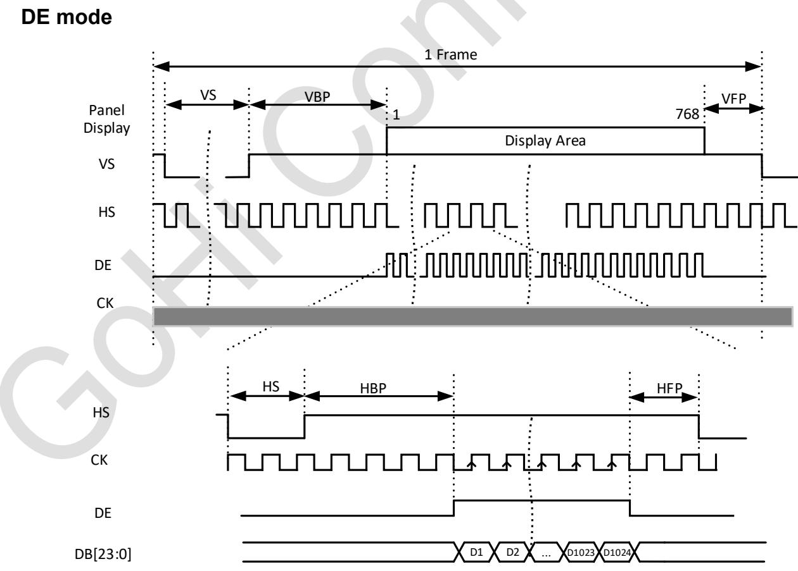  
图：DE 模式

## 6.2.2 RGB 数据格式

GX610 支持 16 位、18 位或 24 位并行 RGB 接口，其中包括：HS、VS、DE、DCLK、D[23:0]。该接口在上电（Power On）序列之后生效。像素时钟（DCLK）始终不间断运行，用于在 DCLK 的上升沿锁存 HS、VS、DE 和 D[23:0] 各线的状态。DCLK 不能用作显示模块其他功能（例如 Sleep In– 模式等）的持续内部时钟。垂直同步（VS）是接收显示“新帧”的起始信号。该信号为负极性（$( ^ { 6 6 } - ^ { 6 6 } , ^ { 6 6 } \bar { 0 } ^ { 3 9 }$，低电平有效），在 DCLK 线的上升沿有效。水平同步（HS）是接收帧“新行”的起始信号。该信号为负极性（$( ^ { 6 6 } , ^ { 6 6 } 0 ^ { 3 9 }$，低电平有效），在 DCLK 线的上升沿有效。数据使能（DE）用于接收应传输到显示器上的 RGB 信息。该信号为正极性（$( ^ { 6 } + ^ { 3 } )$，“1”，高电平有效），在 DCLK 线的上升沿有效。

像素时钟周期如下图所示。

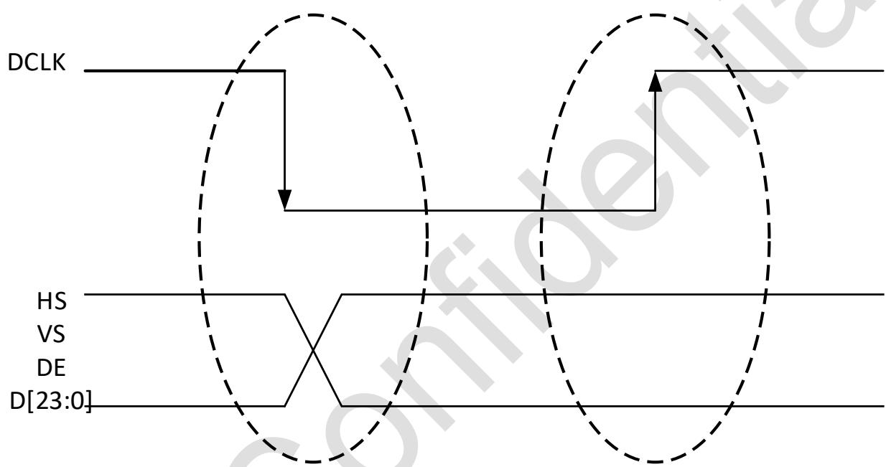  
注：DCLK 是非同步信号（可以停止）。  
图 6.9：DCLK 周期

<table><tr><td colspan="26">24bit 模式</td></tr><tr><td></td><td>23b</td><td>22b</td><td>21b</td><td>20b</td><td>19b</td><td>18b</td><td>17b</td><td>16b</td><td>15b</td><td>14b</td><td>13b</td><td>12b</td><td>11b</td><td>10b</td><td>9b</td><td>8b</td><td>7b</td><td>6b</td><td>5b</td><td>4b</td><td>3b</td><td>2b</td><td>1b</td><td>0b</td><td></td></tr><tr><td>24bit</td><td>R7</td><td>R6</td><td>R5</td><td>R4</td><td>R3</td><td>R2</td><td>R1</td><td>R0</td><td>G7</td><td>G6</td><td>G5</td><td>G4</td><td>G3</td><td>G2</td><td>G1</td><td>G0</td><td>B7</td><td>B6</td><td>B5</td><td>B4</td><td>B3</td><td>B2</td><td>B1</td><td>B0</td><td></td></tr><tr><td>18bit-0</td><td>R5</td><td>R4</td><td>R3</td><td>R2</td><td>R1</td><td>R0</td><td></td><td></td><td>G5</td><td>G4</td><td>G3</td><td>G2</td><td>G1</td><td>G0</td><td></td><td></td><td>B5</td><td>B4</td><td>B3</td><td>B2</td><td>B1</td><td>B0</td><td></td><td></td><td></td></tr><tr><td>18bit-1</td><td></td><td></td><td>R5</td><td>R4</td><td>R3</td><td>R2</td><td>R1</td><td>R0</td><td></td><td></td><td>G5</td><td>G4</td><td>G3</td><td>G2</td><td>G1</td><td>G0</td><td></td><td></td><td>B5</td><td>B4</td><td>B3</td><td>B2</td><td>B1</td><td>B0</td><td></td></tr><tr><td>18bit-2</td><td></td><td></td><td></td><td></td><td></td><td></td><td>R5</td><td>R4</td><td>R3</td><td>R2</td><td>R1</td><td>R0</td><td>G5</td><td>G4</td><td>G3</td><td>G2</td><td>G1</td><td>G0</td><td>B5</td><td>B4</td><td>B3</td><td>B2</td><td>B1</td><td>B0</td><td></td></tr><tr><td>16bit-0</td><td>R4</td><td>R3</td><td>R2</td><td>R1</td><td>R0</td><td></td><td></td><td></td><td>G5</td><td>G4</td><td>G3</td><td>G2</td><td>G1</td><td>G0</td><td></td><td></td><td>B4</td><td>B3</td><td>B2</td><td>B1</td><td>B0</td><td></td><td></td><td></td><td></td></tr><tr><td>16bit-1</td><td></td><td></td><td></td><td>R4</td><td>R3</td><td>R2</td><td>R1</td><td>R0</td><td></td><td></td><td>G5</td><td>G4</td><td>G3</td><td>G2</td><td>G1</td><td>G0</td><td></td><td></td><td></td><td>B4</td><td>B3</td><td>B2</td><td>B1</td><td>B0</td><td></td></tr><tr><td>16bit-2</td><td></td><td></td><td></td><td></td><td></td><td></td><td></td><td></td><td>R4</td><td>R3</td><td>R2</td><td>R1</td><td>R0</td><td>G5</td><td>G4</td><td>G3</td><td>G2</td><td>G1</td><td>G0</td><td>B4</td><td>B3</td><td>B2</td><td>B1</td><td>B0</td><td></td></tr><tr><td colspan="25">8bit 模式</td><td></td></tr><tr><td></td><td>23b</td><td>22b</td><td>21b</td><td>20b</td><td>19b</td><td>18b</td><td>17b</td><td>16b</td><td>15b</td><td>14b</td><td>13b</td><td>12b</td><td>11b</td><td>10b</td><td>9b</td><td>8b</td><td>7b</td><td>6b</td><td>5b</td><td> $4\mathrm{\;b}$ </td><td>3b</td><td>2b</td><td>1b</td><td>0b</td><td></td></tr><tr><td rowspan="3">8bit</td><td></td><td></td><td></td><td></td><td></td><td></td><td></td><td></td><td></td><td></td><td></td><td></td><td></td><td></td><td></td><td></td><td>R7</td><td>R6</td><td>R5</td><td>R4</td><td>R3</td><td>R2</td><td>R1</td><td>R0</td><td></td></tr><tr><td></td><td></td><td></td><td></td><td></td><td></td><td></td><td></td><td></td><td></td><td></td><td></td><td></td><td></td><td></td><td></td><td>R7</td><td>R6</td><td>R5</td><td>R4</td><td>R3</td><td>R2</td><td>R1</td><td>R0</td><td></td></tr><tr><td></td><td></td><td></td><td></td><td></td><td></td><td></td><td></td><td></td><td></td><td></td><td></td><td></td><td></td><td></td><td></td><td>R7</td><td>R6</td><td>R5</td><td>R4</td><td>R3</td><td>R2</td><td>R1</td><td>R0</td><td></td></tr><tr><td rowspan="3">6bit-0</td><td></td><td></td><td></td><td></td><td></td><td></td><td></td><td></td><td></td><td></td><td></td><td></td><td></td><td></td><td></td><td></td><td>R5</td><td>R4</td><td>R3</td><td>R2</td><td>R1</td><td>R0</td><td></td><td></td><td></td></tr><tr><td></td><td></td><td></td><td></td><td></td><td></td><td></td><td></td><td></td><td></td><td></td><td></td><td></td><td></td><td></td><td></td><td>R5</td><td>R4</td><td>R3</td><td>R2</td><td>R1</td><td>R0</td><td></td><td></td><td></td></tr><tr><td></td><td></td><td></td><td></td><td></td><td></td><td></td><td></td><td></td><td></td><td></td><td></td><td></td><td></td><td></td><td></td><td>R5</td><td>R4</td><td>R3</td><td>R2</td><td>R1</td><td>R0</td><td></td><td></td><td></td></tr><tr><td rowspan="3">6bit-1</td><td></td><td></td><td></td><td></td><td></td><td></td><td></td><td></td><td></td><td></td><td></td><td></td><td></td><td></td><td></td><td></td><td></td><td></td><td>R5</td><td>R4</td><td>R3</td><td>R2</td><td>R1</td><td>R0</td><td></td></tr><tr><td></td><td></td><td></td><td></td><td></td><td></td><td></td><td></td><td></td><td></td><td></td><td></td><td></td><td></td><td></td><td></td><td></td><td></td><td>R5</td><td>R4</td><td>R3</td><td>R2</td><td>R1</td><td>R0</td><td></td></tr><tr><td></td><td></td><td></td><td></td><td></td><td></td><td></td><td></td><td></td><td></td><td></td><td></td><td></td><td></td><td></td><td></td><td></td><td></td><td>R5</td><td>R4</td><td>R3</td><td>R2</td><td>R1</td><td>R0</td><td></td></tr><tr><td rowspan="3">5bit-0</td><td></td><td></td><td></td><td></td><td></td><td></td><td></td><td></td><td></td><td></td><td></td><td></td><td></td><td></td><td></td><td></td><td>R4</td><td>R3</td><td>R2</td><td>R1</td><td>R0</td><td></td><td></td><td></td><td></td></tr><tr><td></td><td></td><td></td><td></td><td></td><td></td><td></td><td></td><td></td><td></td><td></td><td></td><td></td><td></td><td></td><td></td><td>R5</td><td>R4</td><td>R3</td><td>R2</td><td>R1</td><td>R0</td><td></td><td></td><td></td></tr><tr><td></td><td></td><td></td><td></td><td></td><td></td><td></td><td></td><td></td><td></td><td></td><td></td><td></td><td></td><td></td><td></td><td>R5</td><td>R4</td><td>R3</td><td>R2</td><td>R1</td><td></td><td></td><td></td><td></td></tr><tr><td rowspan="3">5bit-1</td><td></td><td></td><td></td><td></td><td></td><td></td><td></td><td></td><td></td><td></td><td></td><td></td><td></td><td></td><td></td><td></td><td></td><td></td><td></td><td>R4</td><td>R3</td><td>R2</td><td>R1</td><td>R0</td><td></td></tr><tr><td></td><td></td><td></td><td></td><td></td><td></td><td></td><td></td><td></td><td></td><td></td><td></td><td></td><td></td><td></td><td></td><td></td><td></td><td>R5</td><td>R4</td><td>R3</td><td>R2</td><td>R1</td><td>R0</td><td></td></tr><tr><td></td><td></td><td></td><td></td><td></td><td></td><td></td><td></td><td></td><td></td><td></td><td></td><td></td><td></td><td></td><td></td><td></td><td></td><td></td><td>R5</td><td>R4</td><td>R3</td><td>R2</td><td>R1</td><td></td></tr></table>

表 6.2：RGB 接口数据格式

## 6.2.3 RGB 接口模式选择

GX610 支持 RGB 接口模式 1（DE 模式）和模式 2（SYNC 模式），可通过 USER 命令进行选择。

在 RGB 模式 1（DE 模式）下，当 DE 为高电平时，通过 CK 和视频数据总线（Video Data Bus，D[23:0]）将数据写入行缓冲器。外部时钟（DCLK、VS 和 HS）用作内部显示时钟。因此，控制器必须始终向 GX610 传输 DCLK、VS 和 HS 信号。

在 RGB 模式 2（SYNC 模式）下，VS 的后沿 VBP 由 VBP[7:0] 定义，HS 的后沿 HBP 由 HBP[7:0] 定义；VS 的前沿 VFP 由 VFP[7:0] 定义，HS 的前沿 HFP 由 HFP[7:0] 定义。

<table><tr><td>RGB 模式</td><td>VS</td><td>HS</td><td>DE</td><td>DCLK</td><td>D[23:0]</td><td>寄存器 VFP[7:0],VBP[7:0], HFP[7:0], HBP[7:0]</td></tr><tr><td>DE 模式</td><td>使用</td><td>使用</td><td>使用</td><td>使用</td><td>使用</td><td>不使用</td></tr><tr><td>SYNC 模式</td><td>使用</td><td>使用</td><td>不使用</td><td>使用</td><td>使用</td><td>使用</td></tr></table>

## 6.3 Dual-SPI 接口

## 通过 SPI3 接口实现 DUAL SPI

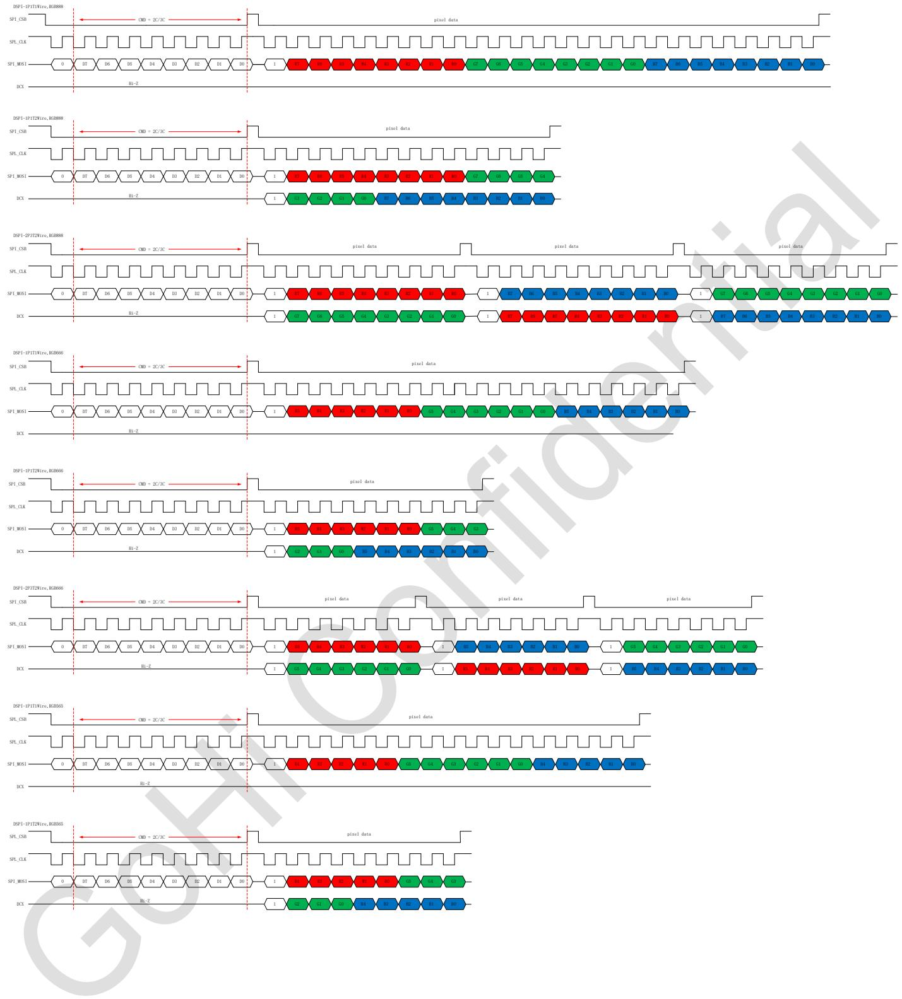

通过 SPI4 接口实现 DUAL SPI：  
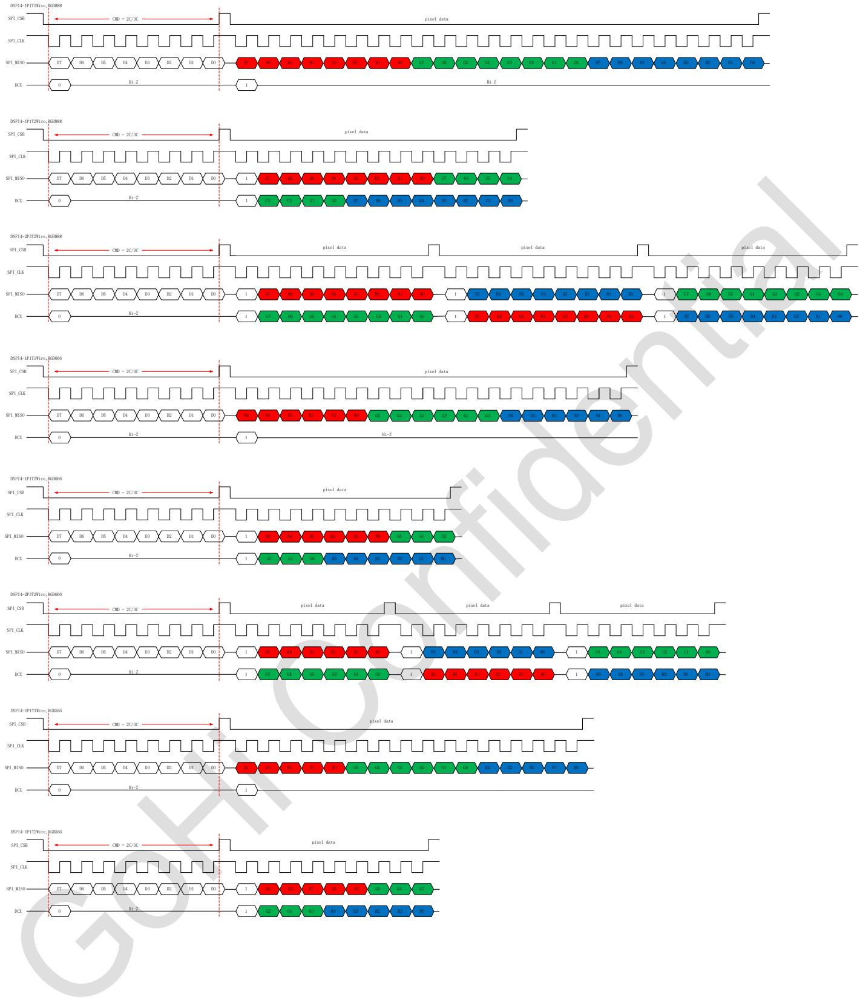

## 6.4 RGB 输入时序表

适用于 320RGBx240

<table><tr><td rowspan="2" colspan="2">参数</td><td rowspan="2">符号</td><td colspan="3">值</td><td rowspan="2">单位</td></tr><tr><td>最小值</td><td>典型值</td><td>最大值</td></tr><tr><td colspan="2">DCLK 频率 @帧速率=60Hz (RGB)</td><td> $F_{DCLK}$ </td><td>7.8</td><td>8.6</td><td>9.6</td><td>MHz</td></tr><tr><td colspan="2">HSYNC 周期时间</td><td> $T_H$ </td><td>480</td><td>504</td><td>540</td><td>DCLK</td></tr><tr><td colspan="2">水平显示区域</td><td> $T_{HD}$ </td><td colspan="3">320</td><td>DCLK</td></tr><tr><td rowspan="3">HSYNC 脉冲宽度</td><td>最小值</td><td rowspan="3"> $T_{HPW}$ </td><td colspan="3">20</td><td>DCLK</td></tr><tr><td>典型值</td><td colspan="3">24</td><td>DCLK</td></tr><tr><td>最大值</td><td colspan="3">40</td><td>DCLK</td></tr><tr><td colspan="2">HSYNC 后沿</td><td> $T_{HBP}$ </td><td>100</td><td>100</td><td>100</td><td>DCLK</td></tr><tr><td colspan="2">HSYNC 前沿</td><td> $T_{HFP}$ </td><td>40</td><td>60</td><td>80</td><td>DCLK</td></tr><tr><td colspan="2">VSYNC 周期时间</td><td> $T_v$ </td><td>272</td><td>284</td><td>297</td><td>H</td></tr><tr><td colspan="2">垂直显示区域</td><td> $T_{VD}$ </td><td colspan="3">240</td><td>H</td></tr><tr><td rowspan="3">VSYNC 脉冲宽度</td><td>最小值</td><td rowspan="3"> $T_{VPW}$ </td><td colspan="3">2</td><td>H</td></tr><tr><td>典型值</td><td colspan="3">6</td><td>H</td></tr><tr><td>最大值</td><td colspan="3">10</td><td>H</td></tr><tr><td colspan="2">VSYNC 后沿</td><td> $T_{VBP}$ </td><td>22</td><td>22</td><td>22</td><td>H</td></tr><tr><td colspan="2">VSYNC 前沿</td><td> $T_{VFP}$ </td><td>8</td><td>16</td><td>25</td><td>H</td></tr></table>

## 6.5 MCU 接口

## 6.5.1 8080 系列并行接口

GX610 可通过 8 位 MCU 8080 系列并行接口访问。片选信号 CSX（低电平有效）用于使能或禁用 GX610 芯片。RESX（低电平有效）为外部复位信号。WRX 为并行数据写选通信号，RDX 为并行数据读选通信号，D[7:0] 为并行数据总线。

GX610 在 WRX 信号的上升沿锁存输入数据。D/CX 为数据/命令选择信号。当 D/CX=’1’ 时，D[7:0] 位为显示 RAM 数据或命令的参数；当 D/CX=’0’ 时，D[7:0] 位为命令。

8080 系列双向接口可用于 MCU 控制器与 LCD 驱动芯片之间的通信。当 P68 引脚为低电平（DGND 电平）时，即完成 8080 接口的选择。8080 系列并行接口的选择如下表所示。

<table><tr><td>MPU 接口</td><td>CSX</td><td>WRX</td><td>RDX</td><td>D/CX</td><td>功能</td></tr><tr><td rowspan="4">8080 MCU 8 位总线接口 I</td><td>“L”</td><td>↑</td><td>“H”</td><td>“L”</td><td>写入命令代码。</td></tr><tr><td>“L”</td><td>“H”</td><td>↑</td><td>“H”</td><td>读取内部状态。</td></tr><tr><td>“L”</td><td>↑</td><td>“H”</td><td>“H”</td><td>写入参数或显示数据。</td></tr><tr><td>“L”</td><td>“H”</td><td>↑</td><td>“H”</td><td>读取参数或显示数据。</td></tr><tr><td rowspan="4">8080 MCU 16 位总线接口 I</td><td>“L”</td><td>↑</td><td>“H”</td><td>“L”</td><td>写入命令代码。</td></tr><tr><td>“L”</td><td>“H”</td><td>↑</td><td>“H”</td><td>读取内部状态。</td></tr><tr><td>“L”</td><td>↑</td><td>“H”</td><td>“H”</td><td>写入参数或显示数据。</td></tr><tr><td>“L”</td><td>“H”</td><td>↑</td><td>“H”</td><td>读取参数或显示数据。</td></tr><tr><td rowspan="4">800 MCU 9 位总线接口 I</td><td>“L”</td><td>↑</td><td>“H”</td><td>“L”</td><td>写入命令代码。</td></tr><tr><td>“L”</td><td>“H”</td><td>↑</td><td>“H”</td><td>读取内部状态。</td></tr><tr><td>“L”</td><td>↑</td><td>“H”</td><td>“H”</td><td>写入参数或显示数据。</td></tr><tr><td>“L”</td><td>“H”</td><td>↑</td><td>“H”</td><td>读取参数或显示数据。</td></tr><tr><td rowspan="4">805 MCU 18 位总线接口 I</td><td>“L”</td><td>↑</td><td>“H”</td><td>“L”</td><td>写入命令代码。</td></tr><tr><td>“L”</td><td>“H”</td><td>↑</td><td>“H”</td><td>读取内部状态。</td></tr><tr><td>“L”</td><td>↑</td><td>“H”</td><td>“H”</td><td>写入参数或显示数据。</td></tr><tr><td>“L”</td><td>“H”</td><td>↑</td><td>“H”</td><td>读取参数或显示数据。</td></tr><tr><td rowspan="4">880 MCU 24 位总线接口 I</td><td>“L”</td><td>↑</td><td>“H”</td><td>“L”</td><td>写入命令代码。</td></tr><tr><td>“L”</td><td>“H”</td><td>↑</td><td>“H”</td><td>读取内部状态。</td></tr><tr><td>“L”</td><td>↑</td><td>“H”</td><td>“H”</td><td>写入参数或显示数据。</td></tr><tr><td>“L”</td><td>“H”</td><td>↑</td><td>“H”</td><td>读取参数或显示数据。</td></tr></table>

## 6.5.2 写周期时序

在写周期内，WRX 信号由高电平驱动至低电平，然后再被拉回高电平。显示模块在 WRX 的上升沿从主机处理器捕获信息，主机处理器则在写周期内提供信息。当 D/CX 信号被驱动为低电平时，接口上的输入数据被解释为命令信息。当接口上的数据为 RAM 数据或命令参数时，D/CX 信号也可被拉为高电平。

下图所示为 8080 MCU 接口的写周期。

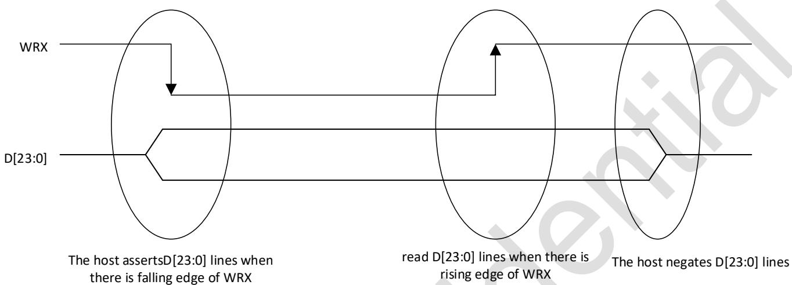  
注：WRX 为非同步信号（可停止）

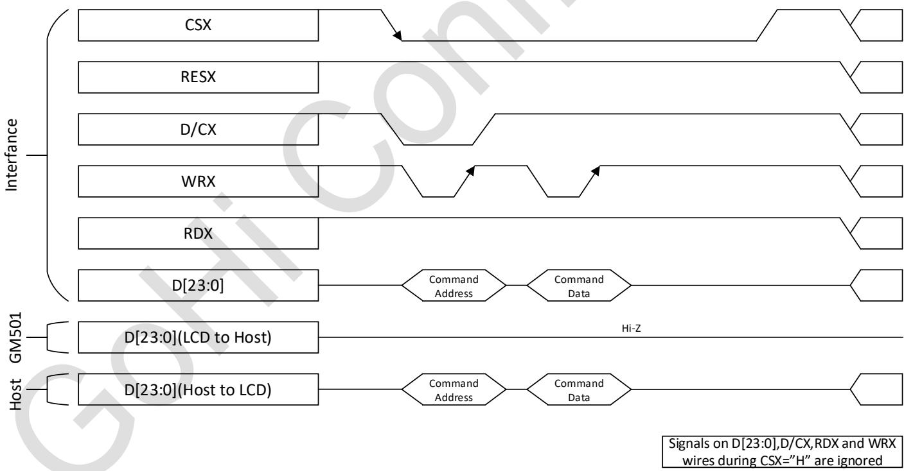

## 6.5.3 读周期时序

在读周期内，RDX 信号由高电平驱动至低电平，然后允许被拉回高电平。显示模块在读周期内向主机处理器提供信息，而主机处理器在 RDX 信号的上升沿读取显示模块的信息。当 D/CX 信号被驱动为低电平时，接口上的输入数据被解释为命令。当接口上的数据为 RAM 数据或命令参数时，D/CX 信号也可被拉为高电平。

下图所示为 8080 MCU 接口的读周期。  
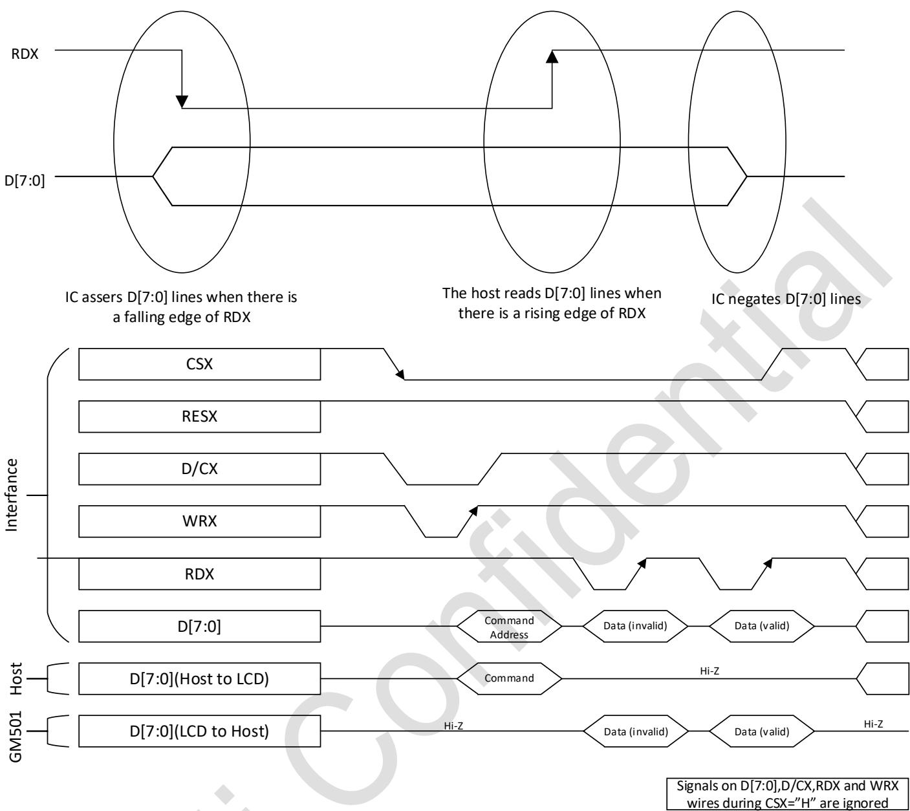  
注：仅当 D/CX 输入被拉为高电平时，读取的数据才有效。若在读取期间将 D/CX 驱动为低电平，则显示信息输出将处于高阻态（High-Z）。

## 6.5.4 数据传输模式

GX610 可向图形 RAM 提供两种不同色深（16 位/像素和 18 位/像素）的显示数据。每种接口的数据格式均有说明。可通过 2 种方法将数据下载到帧存储器。

## 6.5.5 数据传输方法 1

图像数据在连续的帧写入过程中被发送到帧存储器，每当帧存储器被图像数据填满时，帧存储器指针便复位到起始点，然后写入下一帧。

<table><tr><td>开始帧存储器写入</td><td>图像数据帧 1</td><td>图像数据帧 2</td><td>图像数据帧 3</td><td>- - - - -</td><td>任意命令</td></tr></table>

## 6.5.6 数据传输方法 2

发送图像数据，并在每帧存储器下载结束时发送一条命令以停止帧存储器写入。随后发送开始存储器写入命令，并下载新的一帧。

开始  
停止

<table><tr><td>开始帧存储器写入</td><td>图像数据帧 1</td><td>任意命令</td><td>开始帧存储器写入</td><td>图像数据帧 2</td><td>任意命令</td><td>— — — —</td><td>任意命令</td></tr></table>

注 1：这些方法适用于串行和并行接口上的所有数据传输色彩模式 注 2：对于这两种方法，帧存储器均可包含奇数或偶数个像素。只有完整的像素数据才会被存储到帧存储器中

## 6.5.7 并行 MCU 接口

下图所示为与 8 位 MCU 系统接口连接的示例。

MPU

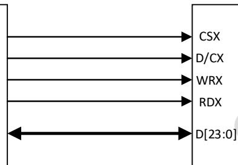

IC

下面列出了所支持的三种色深可用的不同显示数据格式。

\- 4K 色，RGB 4, 4, 4 位输入数据。

\- 65K 色，RGB 5, 6, 5 位输入数据。

\- 262K 色，RGB 6, 6, 6 位输入数据。

\- 16.7M 色，RGB 8, 8, 8 位输入数据。

## 6.5.8 存储器数据格式

并行接口

下表列出了存储器可用的数据格式

<table><tr><td></td><td>B23</td><td>B22</td><td>B21</td><td>B20</td><td>B19</td><td>B18</td><td>B17</td><td>B16</td><td>B15</td><td>B14</td><td>B13</td><td>B12</td><td>B11</td><td>B10</td><td>B9</td><td>B8</td><td>B7</td><td>B6</td><td>B5</td><td>B4</td><td>B3</td><td>B2</td><td>B1</td><td>B0</td></tr><tr><td></td><td></td><td></td><td></td><td></td><td></td><td></td><td></td><td></td><td></td><td></td><td></td><td></td><td></td><td></td><td></td><td></td><td></td><td></td><td></td><td></td><td></td><td></td><td></td><td></td></tr><tr><td>8位总线24位色</td><td></td><td></td><td></td><td></td><td></td><td></td><td></td><td></td><td></td><td></td><td></td><td></td><td></td><td></td><td></td><td></td><td>R7</td><td>R6</td><td>R5</td><td>R4</td><td>R3</td><td>R2</td><td>R1</td><td>R0</td></tr><tr><td></td><td></td><td></td><td></td><td></td><td></td><td></td><td></td><td></td><td></td><td></td><td></td><td></td><td></td><td></td><td></td><td></td><td>G7</td><td>G6</td><td>G5</td><td>G4</td><td>G3</td><td>G2</td><td>G1</td><td>G0</td></tr><tr><td></td><td></td><td></td><td></td><td></td><td></td><td></td><td></td><td></td><td></td><td></td><td></td><td></td><td></td><td></td><td></td><td></td><td>B7</td><td>B6</td><td>B5</td><td>B4</td><td>B3</td><td>B2</td><td>B1</td><td>B0</td></tr><tr><td></td><td></td><td></td><td></td><td></td><td></td><td></td><td></td><td></td><td></td><td></td><td></td><td></td><td></td><td></td><td></td><td></td><td></td><td></td><td></td><td></td><td></td><td></td><td></td><td></td></tr><tr><td>8位总线18位色</td><td></td><td></td><td></td><td></td><td></td><td></td><td></td><td></td><td></td><td></td><td></td><td></td><td></td><td></td><td></td><td></td><td>R5</td><td>R4</td><td>R3</td><td>R2</td><td>R1</td><td>R0</td><td></td><td></td></tr><tr><td></td><td></td><td></td><td></td><td></td><td></td><td></td><td></td><td></td><td></td><td></td><td></td><td></td><td></td><td></td><td></td><td></td><td>G5</td><td>G4</td><td>G3</td><td>G2</td><td>G1</td><td>G0</td><td></td><td></td></tr><tr><td></td><td></td><td></td><td></td><td></td><td></td><td></td><td></td><td></td><td></td><td></td><td></td><td></td><td></td><td></td><td></td><td></td><td>B5</td><td>B4</td><td>B3</td><td>B2</td><td>B1</td><td>B0</td><td></td><td></td></tr><tr><td></td><td></td><td></td><td></td><td></td><td></td><td></td><td></td><td></td><td></td><td></td><td></td><td></td><td></td><td></td><td></td><td></td><td></td><td></td><td></td><td></td><td></td><td></td><td></td><td></td></tr><tr><td>8位总线16位色</td><td></td><td></td><td></td><td></td><td></td><td></td><td></td><td></td><td></td><td></td><td></td><td></td><td></td><td></td><td></td><td></td><td>R4</td><td>R3</td><td>R2</td><td>R1</td><td>R0</td><td>G5</td><td>G4</td><td>G3</td></tr><tr><td></td><td></td><td></td><td></td><td></td><td></td><td></td><td></td><td></td><td></td><td></td><td></td><td></td><td></td><td></td><td></td><td></td><td>G2</td><td>G1</td><td>G0</td><td>B4</td><td>B3</td><td>B2</td><td>B1</td><td>B0</td></tr><tr><td></td><td></td><td></td><td></td><td></td><td></td><td></td><td></td><td></td><td></td><td></td><td></td><td></td><td></td><td></td><td></td><td></td><td></td><td></td><td></td><td></td><td></td><td></td><td></td><td></td></tr><tr><td>9位总线24位色/0</td><td></td><td></td><td></td><td></td><td></td><td></td><td></td><td></td><td></td><td></td><td></td><td></td><td></td><td></td><td></td><td></td><td>R7</td><td>R6</td><td>R5</td><td>R4</td><td>R3</td><td>R2</td><td>R1</td><td>R0</td></tr><tr><td></td><td></td><td></td><td></td><td></td><td></td><td></td><td></td><td></td><td></td><td></td><td></td><td></td><td></td><td rowspan="2"></td><td rowspan="2"></td><td rowspan="2"></td><td>G7</td><td>G6</td><td>G5</td><td>G4</td><td>G3</td><td>G2</td><td>G1</td><td>G0</td></tr><tr><td></td><td></td><td></td><td></td><td></td><td></td><td></td><td></td><td></td><td></td><td></td><td></td><td></td><td></td><td>B7</td><td>B6</td><td>B5</td><td>B4</td><td>B3</td><td>B2</td><td>B1</td><td>B0</td></tr><tr><td></td><td></td><td></td><td></td><td></td><td></td><td></td><td></td><td></td><td></td><td></td><td></td><td></td><td></td><td></td><td></td><td></td><td></td><td></td><td></td><td></td><td></td><td></td><td></td><td></td></tr><tr><td>9位总线24位色/1</td><td></td><td></td><td></td><td></td><td></td><td></td><td></td><td></td><td></td><td></td><td></td><td></td><td></td><td rowspan="10"></td><td rowspan="10"></td><td>R7</td><td>R6</td><td>R5</td><td>R4</td><td>R3</td><td>R2</td><td>R1</td><td>R0</td><td></td></tr><tr><td></td><td></td><td></td><td></td><td></td><td></td><td></td><td></td><td></td><td></td><td></td><td></td><td></td><td></td><td>G7</td><td>G6</td><td>G5</td><td>G4</td><td>G3</td><td>G2</td><td>G1</td><td>G0</td><td></td></tr><tr><td></td><td></td><td></td><td></td><td></td><td></td><td></td><td></td><td></td><td></td><td></td><td></td><td></td><td></td><td rowspan="2">B7</td><td rowspan="2">B6</td><td rowspan="2">B5</td><td rowspan="2">B4</td><td rowspan="2">B3</td><td rowspan="2">B2</td><td rowspan="2">B1</td><td rowspan="2">B0</td><td rowspan="2"></td></tr><tr><td></td><td></td><td></td><td></td><td></td><td></td><td></td><td></td><td></td><td></td><td></td><td></td><td></td><td></td></tr><tr><td>9位总线18位色</td><td></td><td></td><td></td><td></td><td></td><td></td><td></td><td></td><td></td><td></td><td></td><td></td><td rowspan="6"></td><td>R5</td><td>R4</td><td>R3</td><td>R2</td><td>R1</td><td>R0</td><td>G5</td><td>G4</td><td>G3</td></tr><tr><td></td><td></td><td></td><td></td><td></td><td></td><td></td><td></td><td></td><td></td><td></td><td></td><td></td><td rowspan="5">G2</td><td rowspan="2">G1</td><td rowspan="2">G0</td><td rowspan="2">B5</td><td rowspan="2">B4</td><td rowspan="2">B3</td><td rowspan="2">B2</td><td rowspan="2">B1</td><td rowspan="2">B0</td></tr><tr><td></td><td></td><td></td><td></td><td></td><td></td><td></td><td></td><td></td><td></td><td></td><td></td><td></td></tr><tr><td>9位总线16位色</td><td></td><td></td><td></td><td></td><td></td><td></td><td></td><td></td><td></td><td></td><td></td><td></td><td>R4</td><td>R3</td><td>R2</td><td>R1</td><td>R0</td><td>G5</td><td>G4</td><td>G3</td></tr><tr><td></td><td></td><td></td><td></td><td></td><td></td><td></td><td></td><td></td><td></td><td></td><td></td><td></td><td rowspan="2">G2</td><td rowspan="2">G1</td><td rowspan="2">G0</td><td rowspan="2">B4</td><td rowspan="2">B3</td><td rowspan="2">B2</td><td rowspan="2">B1</td><td rowspan="2">B0</td></tr><tr><td></td><td></td><td></td><td></td><td></td><td></td><td></td><td></td><td></td><td></td><td></td><td></td><td></td></tr><tr><td>16位总线24位色</td><td></td><td></td><td></td><td></td><td></td><td></td><td></td><td></td><td>RR7</td><td>RR6</td><td>RR5</td><td>RR4</td><td>RR3</td><td>RR2</td><td>R1</td><td>R0</td><td>G7</td><td>G6</td><td>G5</td><td>G4</td><td>G3</td><td>G2</td><td>G1</td><td>G0</td></tr><tr><td></td><td></td><td></td><td></td><td></td><td></td><td></td><td></td><td></td><td>B7</td><td>B6</td><td>B5</td><td>B4</td><td>B3</td><td>B2</td><td>B1</td><td>B0</td><td>R7</td><td>R6</td><td>R5</td><td>R4</td><td>R3</td><td>R2</td><td>R1</td><td>R0</td></tr><tr><td></td><td></td><td></td><td></td><td></td><td></td><td></td><td></td><td></td><td>G7</td><td>G6</td><td>G5</td><td>G4</td><td rowspan="2">G3</td><td rowspan="2">G2</td><td rowspan="2">G1</td><td rowspan="2">G0</td><td rowspan="2">B7</td><td rowspan="2">B6</td><td rowspan="2">B5</td><td rowspan="2">B4</td><td rowspan="2">B3</td><td rowspan="2">B2</td><td rowspan="2">B1</td><td rowspan="2">B0</td></tr><tr><td></td><td></td><td></td><td></td><td></td><td></td><td></td><td></td><td></td><td></td><td></td><td></td><td></td></tr><tr><td>16位总线18位色</td><td></td><td></td><td></td><td></td><td></td><td></td><td></td><td></td><td>R5</td><td>R4</td><td>R3</td><td>R2</td><td>R1</td><td>R0</td><td rowspan="4"></td><td rowspan="4"></td><td>G5</td><td>G4</td><td>G3</td><td>G2</td><td>G1</td><td>G0</td><td></td><td></td></tr><tr><td></td><td></td><td></td><td></td><td></td><td></td><td></td><td></td><td></td><td>B5</td><td>B4</td><td>B3</td><td>B2</td><td>B1</td><td>B0</td><td>R5</td><td>R4</td><td>R3</td><td>R2</td><td>R1</td><td>R0</td><td></td><td></td></tr><tr><td></td><td></td><td></td><td></td><td></td><td></td><td></td><td></td><td></td><td>G5</td><td>G4</td><td>G3</td><td>G2</td><td rowspan="2">G1</td><td rowspan="2">G0</td><td rowspan="2">B5</td><td rowspan="2">B4</td><td rowspan="2">B3</td><td rowspan="2">B2</td><td rowspan="2">B1</td><td rowspan="2">B0</td><td rowspan="2"></td><td rowspan="2"></td></tr><tr><td></td><td></td><td></td><td></td><td></td><td></td><td></td><td></td><td></td><td></td><td></td><td></td><td></td></tr><tr><td>16位总线16位色</td><td></td><td></td><td></td><td></td><td></td><td></td><td></td><td></td><td>R4</td><td>R3</td><td>R2</td><td>R1</td><td rowspan="2">R0</td><td rowspan="2">G5</td><td rowspan="2">G4</td><td rowspan="2">G3</td><td rowspan="2">G2</td><td rowspan="2">G1</td><td rowspan="2">G0</td><td rowspan="2">B4</td><td rowspan="2">B3</td><td rowspan="2">B2</td><td rowspan="2">B1</td><td rowspan="2">B0</td></tr><tr><td></td><td></td><td></td><td></td><td></td><td></td><td></td><td></td><td></td><td></td><td></td><td></td><td></td></tr><tr><td>18位总线24位色</td><td></td><td></td><td></td><td></td><td></td><td></td><td></td><td></td><td>R7</td><td>R6</td><td>R5</td><td>R4</td><td>R3</td><td>R2</td><td>R1</td><td>R0</td><td>G7</td><td>G6</td><td>G5</td><td>G4</td><td>G3</td><td>G2</td><td>G1</td><td>G0</td></tr><tr><td></td><td></td><td></td><td></td><td></td><td></td><td></td><td rowspan="2"></td><td rowspan="2"></td><td>B7</td><td>B6</td><td>B5</td><td>B4</td><td>B3</td><td>B2</td><td>B1</td><td>B0</td><td>R7</td><td>R6</td><td>R5</td><td>R4</td><td>R3</td><td>R2</td><td>R1</td><td>R0</td></tr><tr><td></td><td></td><td></td><td></td><td></td><td></td><td></td><td>G7</td><td>G6</td><td>G5</td><td>G4</td><td rowspan="2">G3</td><td rowspan="2">G2</td><td rowspan="2">G1</td><td rowspan="2">G0</td><td rowspan="2">B7</td><td rowspan="2">B6</td><td rowspan="2">B5</td><td rowspan="2">B4</td><td rowspan="2">B3</td><td rowspan="2">B2</td><td rowspan="2">B1</td><td rowspan="2">B0</td></tr><tr><td></td><td></td><td></td><td></td><td></td><td></td><td></td><td></td><td></td><td></td><td></td><td></td><td></td></tr><tr><td>18位总线18位色/1</td><td></td><td></td><td></td><td></td><td></td><td></td><td></td><td></td><td>R5</td><td>R4</td><td>R3</td><td>R2</td><td>R1</td><td>R0</td><td rowspan="4"></td><td rowspan="4"></td><td>G5</td><td>G4</td><td>G3</td><td>G2</td><td>G1</td><td>G0</td><td></td><td></td></tr><tr><td></td><td></td><td></td><td></td><td></td><td></td><td></td><td></td><td></td><td>B5</td><td>B4</td><td>B3</td><td>B2</td><td>B1</td><td>B0</td><td>R5</td><td>R4</td><td>R3</td><td>R2</td><td>R1</td><td>R0</td><td></td><td></td></tr><tr><td></td><td></td><td></td><td></td><td></td><td></td><td></td><td></td><td></td><td>G5</td><td>G4</td><td>G3</td><td>G2</td><td rowspan="2">G1</td><td rowspan="2">G0</td><td rowspan="2">B5</td><td rowspan="2">B4</td><td rowspan="2">B3</td><td rowspan="2">B2</td><td rowspan="2">B1</td><td rowspan="2">B0</td><td rowspan="2"></td><td rowspan="2"></td></tr><tr><td></td><td></td><td></td><td></td><td></td><td></td><td></td><td></td><td></td><td></td><td></td><td></td><td></td></tr><tr><td>18位总线16位色/0</td><td></td><td></td><td></td><td></td><td></td><td></td><td>R5</td><td>R4</td><td>R3</td><td>R2</td><td>R1</td><td>R0</td><td rowspan="2">G5</td><td rowspan="2">G4</td><td rowspan="2">G3</td><td rowspan="2">G2</td><td rowspan="2">G1</td><td rowspan="2">G0</td><td rowspan="2">B5</td><td rowspan="2">B4</td><td rowspan="2">B3</td><td rowspan="2">B2</td><td rowspan="2">B1</td><td rowspan="2">B0</td></tr><tr><td></td><td></td><td></td><td></td><td></td><td></td><td></td><td></td><td></td><td></td><td></td><td></td><td></td></tr><tr><td>18位总线16位色</td><td></td><td></td><td></td><td></td><td></td><td></td><td></td><td></td><td>RR4</td><td>RR3</td><td>RR2</td><td rowspan="2">RR1</td><td rowspan="2">RR0</td><td rowspan="2">G5</td><td rowspan="2">G4</td><td rowspan="2">G3</td><td rowspan="2">G2</td><td rowspan="2">G1</td><td rowspan="2">G0</td><td rowspan="2">B4</td><td rowspan="2">B3</td><td rowspan="2">B2</td><td rowspan="2">B1</td><td rowspan="2">B0</td></tr><tr><td></td><td></td><td></td><td></td><td></td><td></td><td></td><td></td><td></td><td></td><td></td><td></td></tr><tr><td>24位总线24位色</td><td>R7</td><td>R6</td><td>R5</td><td>R4</td><td>R3</td><td>R2</td><td>R1</td><td>R0</td><td>G7</td><td>G6</td><td>G5</td><td rowspan="2">G4</td><td rowspan="2">G3</td><td rowspan="2">G2</td><td rowspan="2">G1</td><td rowspan="2">G0</td><td rowspan="2">B7</td><td rowspan="2">B6</td><td rowspan="2">B5</td><td rowspan="2">B4</td><td rowspan="2">B3</td><td rowspan="2">B2</td><td rowspan="2">B1</td><td rowspan="2">B0</td></tr><tr><td></td><td></td><td></td><td></td><td></td><td></td><td></td><td></td><td></td><td></td><td></td><td></td></tr><tr><td>24位总线18位色</td><td></td><td></td><td></td><td></td><td></td><td></td><td>R5</td><td>R4</td><td>R3</td><td>R2</td><td>R1</td><td rowspan="2">R0</td><td rowspan="2">G5</td><td rowspan="2">G4</td><td rowspan="2">G3</td><td rowspan="2">G2</td><td rowspan="2">G1</td><td rowspan="2">G0</td><td rowspan="2">B5</td><td rowspan="2">B4</td><td rowspan="2">B3</td><td rowspan="2">B2</td><td rowspan="2">B1</td><td rowspan="2">B0</td></tr><tr><td></td><td></td><td></td><td></td><td></td><td></td><td></td><td></td><td></td><td></td><td></td><td></td></tr><tr><td>24位总线16位色</td><td></td><td></td><td></td><td></td><td></td><td></td><td></td><td></td><td>R4</td><td>R3</td><td>R2</td><td>R1</td><td>R0</td><td>G5</td><td>G4</td><td>G3</td><td>G2</td><td>G1</td><td>G0</td><td>B4</td><td>B3</td><td>B2</td><td>B1</td><td>B0</td></tr></table>

## 6.6 串行接口

接口的选择由 IM[3:0] 位决定。请参考下表。

<table><tr><td>MCU 接口模式</td><td>SPI_CSB</td><td>D/CX</td><td>SPI_CLK</td><td>功能</td></tr><tr><td>3 线串行接口</td><td>“L”</td><td>-</td><td></td><td>读/写命令、参数或显示数据。</td></tr><tr><td>4 线串行接口</td><td>“L”</td><td>‘H/L”</td><td></td><td>读/写命令、参数或显示数据。</td></tr></table>

GX610 提供 3 线/9 位和 4 线/8 位双向串行接口，用于主机与 GX610 之间的通信。3 线串行模式由芯片使能输入（SPI\_CSB）、串行时钟输入（SPI\_CLK）和串行数据输入/输出（SPI\_MOSI/SPI\_MISO）组成。4 线串行模式由数据/命令选择输入（D/CX）、芯片使能输入（SPI\_CSB）、串行时钟输入（SPI\_CLK）以及用于数据传输的串行数据输入/输出（SPI\_MOSI/SPI\_MISO）组成。串行时钟（SPI\_CLK）仅用于与 MCU 的接口，因此在无需通信时可以停止。

## 6.6.1 写周期时序

接口的写模式是指主机向 GX610 写入命令或数据。3 线串行数据包包含一个数据/命令选择位（D/CX）和一个传输字节。如果 D/CX 位为“低”，则该传输字节被解释为命令字节。如果 D/CX 位为“高”，则该传输字节被存储为显示数据 RAM（存储器写命令），或作为参数存储到命令寄存器中。

可以向 GX610 以任意顺序发送任意指令，且 MSB 先传输。当 SPI\_CSB 为高电平时，串行接口被初始化。在此状态下，SPI\_CLK 时钟脉冲和 SPI\_MOSI 数据均无效。SPI\_CSB 上的下降沿使能串行接口，表示数据传输开始。3/4 线串行接口的详细数据格式见下文。

## 3 线串行接口的数据格式

传输字节可以是命令或数据

<table><tr><td colspan="8">MSB</td><td>LSB</td></tr><tr><td>D/CX</td><td>D7</td><td>D6</td><td>D5</td><td>D4</td><td>D3</td><td>D2</td><td>D1</td><td>D0</td></tr></table>

<table><tr><td>D/CX</td><td>8 位传输字节</td><td>D/CX</td><td>8 位传输字节</td></tr></table>

数据/命令选择位

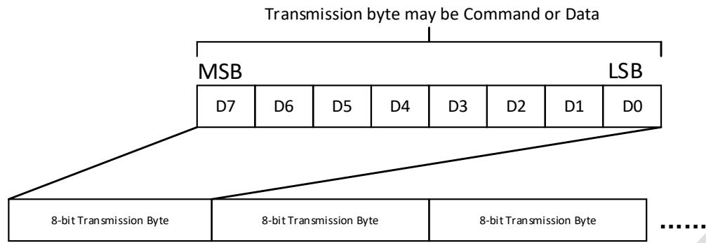

主处理器将 SPI\_CSB 引脚驱动为低电平，并首先在 SPI\_MOSI 上设置 D/CX 位。该位在 SPI\_CLK 信号的第一个上升沿被 GX610 读取。在 SPI\_CLK 的下一个下降沿，主机将 MSB 数据位（D7）设置到 SPI\_MOSI 上。在 SPI\_CLK 的下一个下降沿，将下一位（D6）设置到 SPI\_MOSI 上。如果使用可选的 D/CX 信号，则一个字节的宽度为 8 个读周期。3/4 线串行接口的写时序如下图所示。

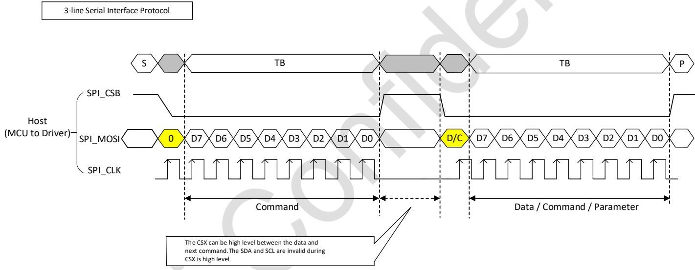

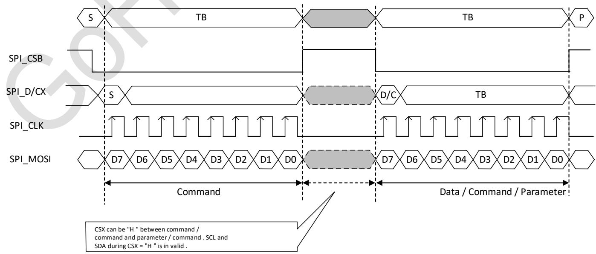

3 线串行接口协议

## 6.6.2 读周期时序

接口的读模式是指主机从 GX610 读取寄存器参数或显示数据。主机必须先发送一条命令（读 ID 或寄存器命令），随后紧跟的字节沿相反方向传输。GX610 在 SPI\_CLK（串行时钟）的上升沿锁存 SPI\_MOSI（输入数据），然后在 SPI\_CLK（串行时钟）的下降沿移出 SPI\_MOSI（输出数据）。在发送读状态命令之后，SPI\_MOSI 线必须被置为三态，且不得迟于最后一位的 SPI\_CLK 下降沿。读模式根据命令码有三种发送命令数据类型（8/24/32 位）。
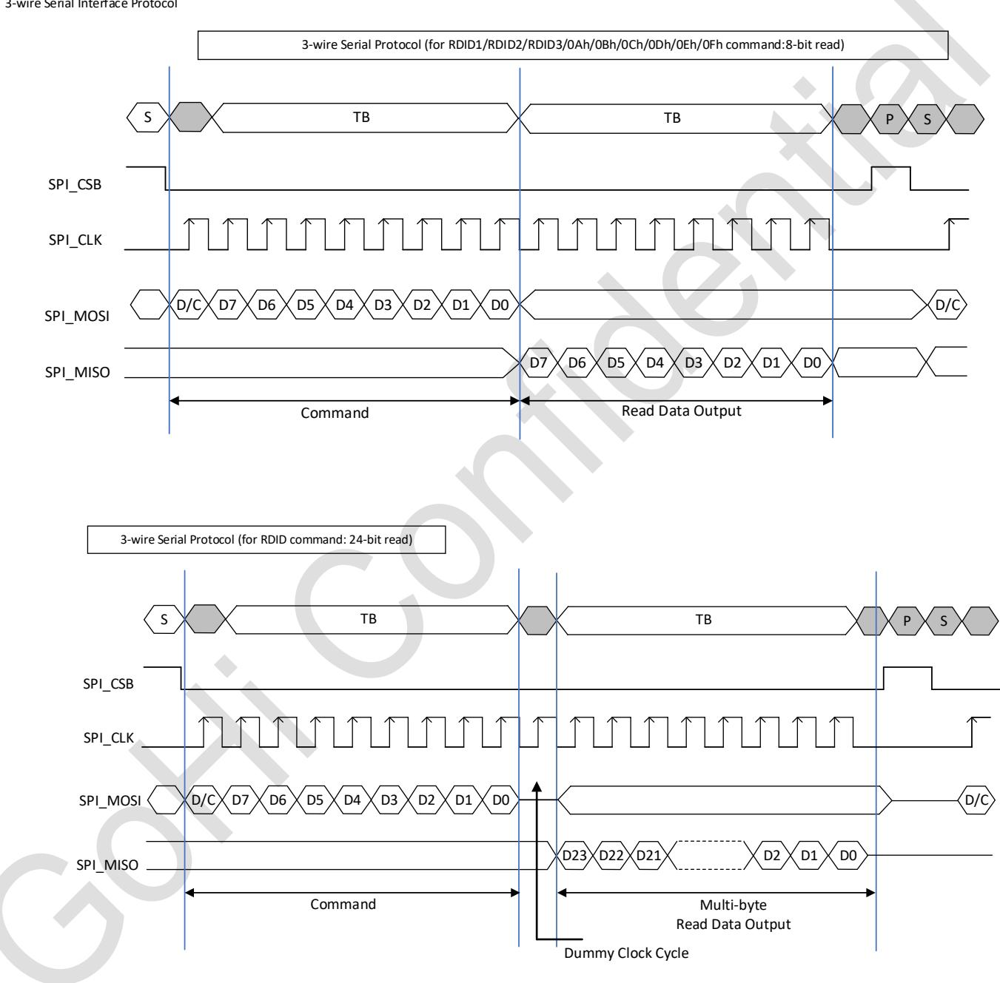

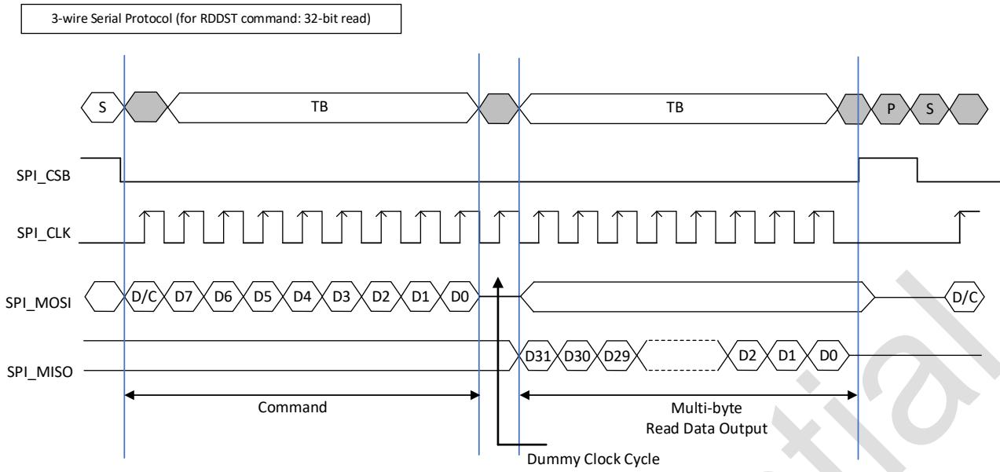

4 线串行接口协议  
4 线串行协议（用于 RDID1/RDID2/RDID3/0Ah/0Bh/0Ch/0Dh/0Eh/0Fh 命令：8 位读取）  
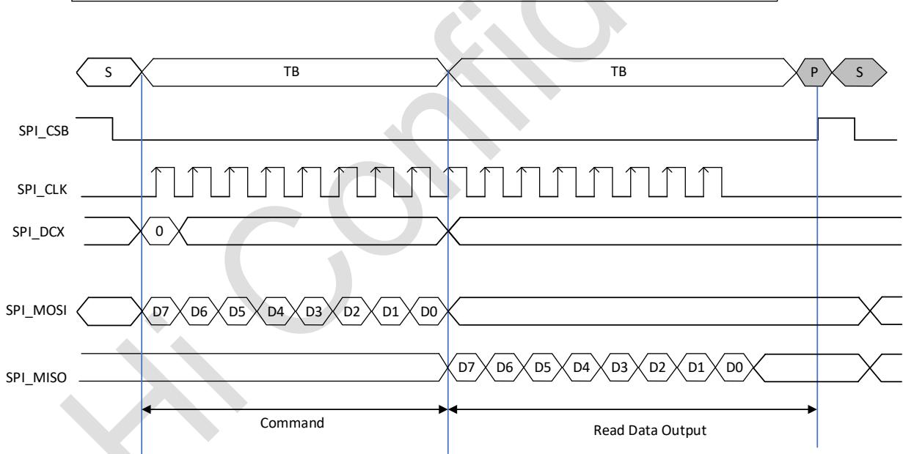

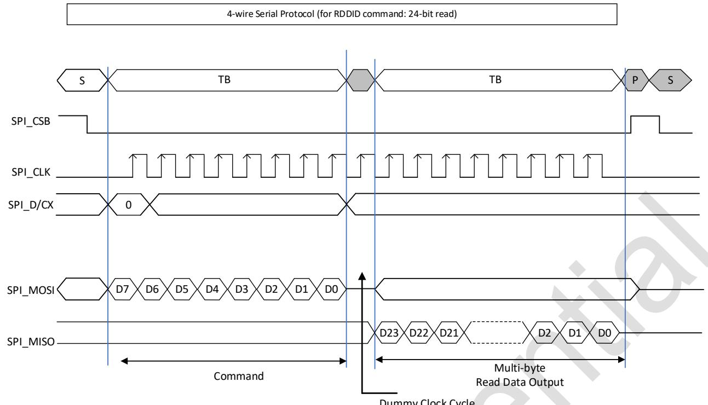

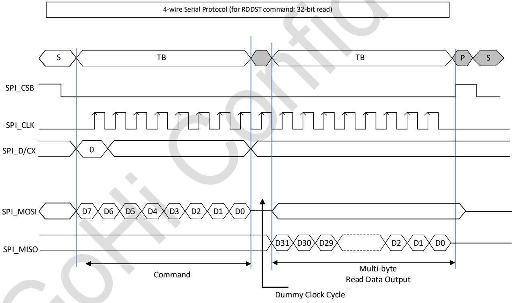

## 6.6.3 3 线串行接口

下图所示为 3 线 SPI 接口的示例。

3 线串行接口 I  
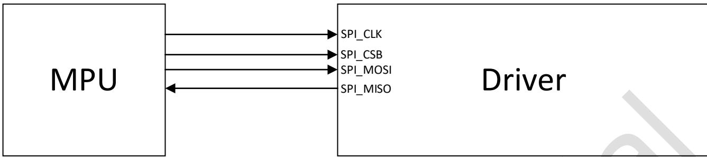

在 3 线串行接口中，对于 LCM 所支持的以下两种色深，可采用不同的显示数据格式。

-65k 色，RGB 5、6、5 位输入

-262k 色，RGB 6、6、6 位输入。

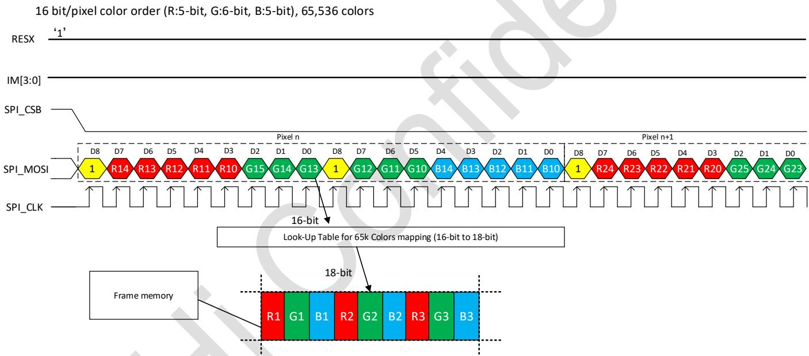

注 1：该像素数据带有 16 位色深信息。

注 2：最高有效位为：Rx4、Gx5 和 Bx4。

注 3：最低有效位为：Rx0、Gx0 和 Bx0。

注 4：‘-’= 无关（Don’t care）–可设置为“0”或“1”。

18 位/像素色彩顺序（R:6 位，G:6 位，B:6 位），262,144 色  
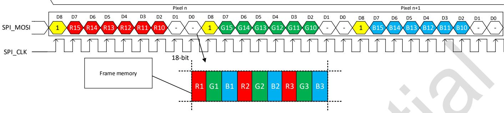  
注 1：该像素数据带有 18 位色深信息。注 2：最高有效位为：Rx5、Gx5 和 Bx5。注 3：最低有效位为：Rx0、Gx0 和 Bx0。注 4：‘-’= 无关 - 可设置为“0”或“1”。

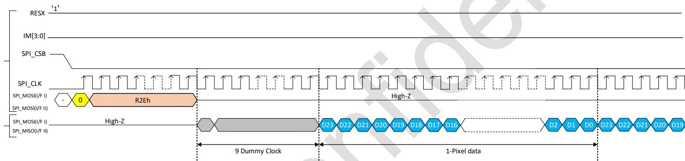  
注 1：‘-’= 无关 –可设置为“0”或“1”。

## 6.6.4 4 线串行接口

下图所示为 4 线 SPI 接口的示例。

4 线串行接口 I  


在 4 线串行接口中，对于 LCM 所支持的以下两种色深，可采用不同的显示数据格式。

-65k 色，RGB 5、6、5 位输入。-262k 色，RGB 6、6、6 位输入。

16 位/像素色彩顺序（R:5 位，G:6 位，B:5 位），65,536 色

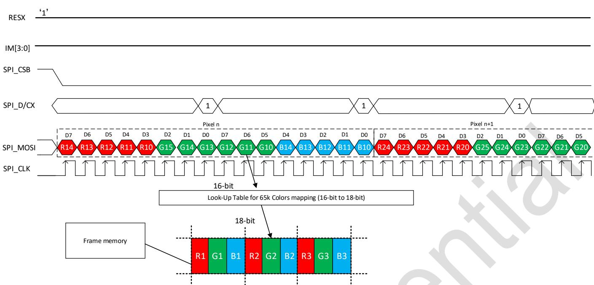

注 1：该像素数据带有 16 位色深信息。

注 2：最高有效位为：Rx4、Gx5 和 Bx4。

注 3：最低有效位为：Rx0、Gx0 和 Bx0。

注 4：‘-’= 无关 –可设置为“0”或“1”。

18 位/像素色彩顺序（R:6 位，G:6 位，B:6 位），262,144 色

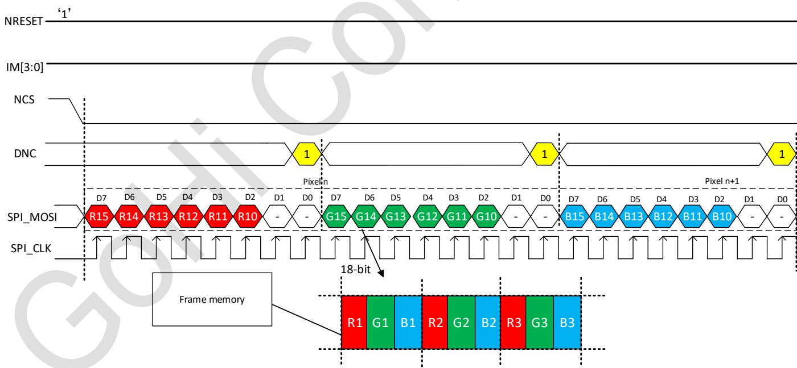

注 1：该像素数据带有 18 位色深信息。

注 2：最高有效位为：Rx5、Gx5 和 Bx5。

注 3：最低有效位为：Rx0、Gx0 和 Bx0。

注 4：‘-’= 无关 –可设置为“0”或“1”。

通过 4 线 SPI 模式读取数据

注 1：‘-’= 无关 – 可设置为“0”或“1”。

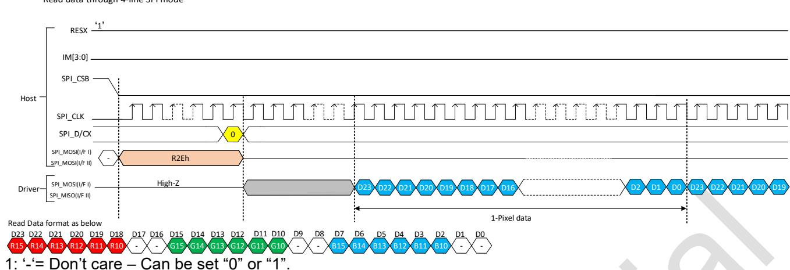

## 6.7 LVDS 接口

## 6.7.1 LVDS 数据格式

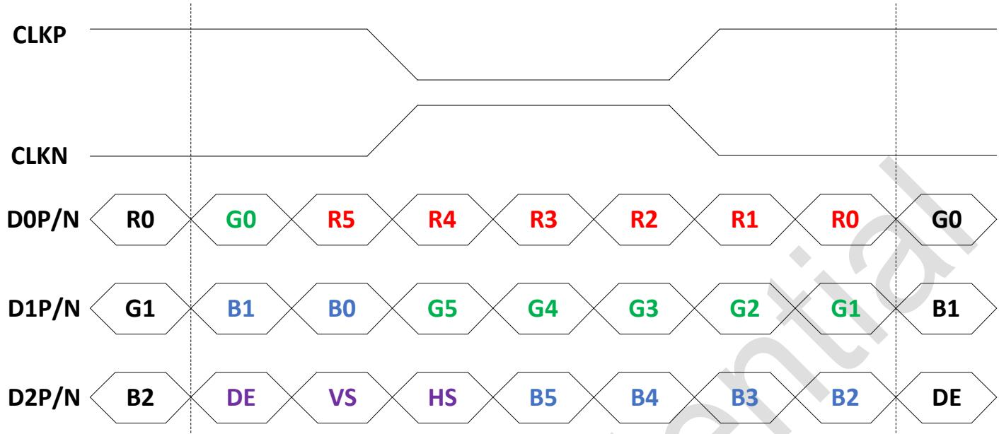  
图 6.10：6 位 LVDS 输入（LVBIT=0，LVFMT=0）

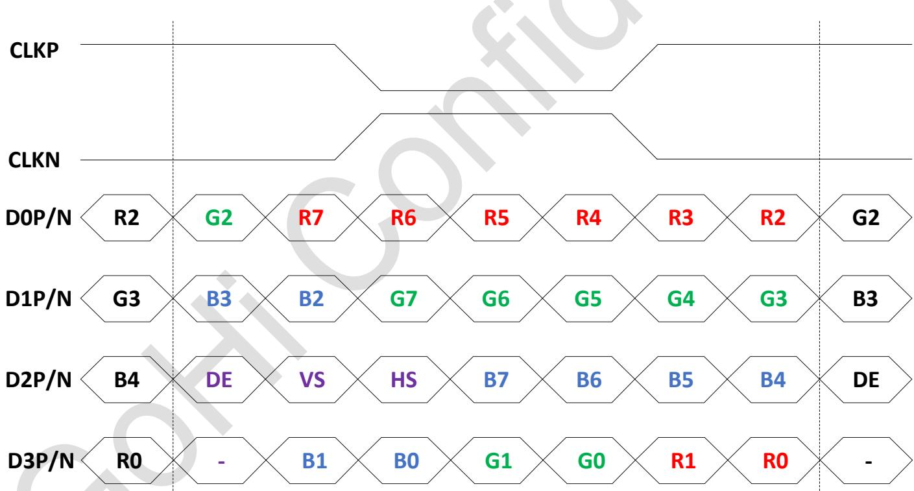  
图 6.11：8 位 LVDS 输入（LVBIT=1，LVFMT=1(JEIDA)）

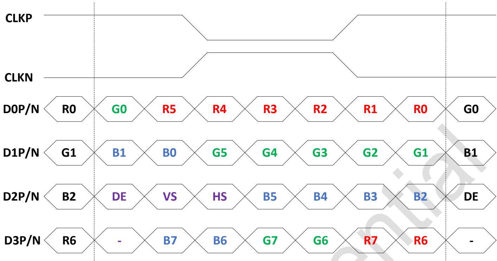  
图 6.12：8 位 LVDS 输入（LVBIT=1，LVFMT=0(VESA)）

## 6.7.2 LVDS 数据输入时序

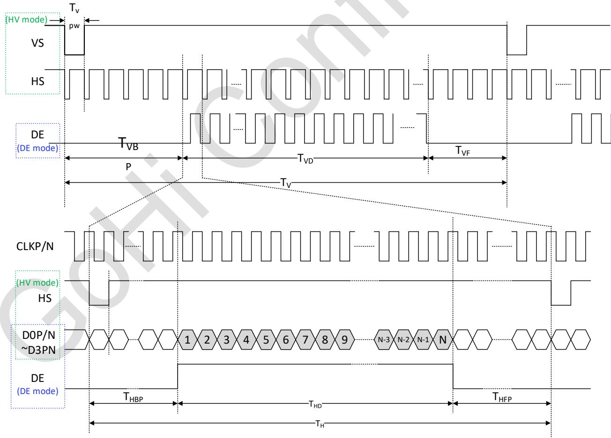  
图：LVDS 输入时序格式

单端口 LVDS 输入

<table><tr><td>参数</td><td>符号</td><td>最小值</td><td>典型值</td><td>最大值</td><td>单位</td></tr><tr><td>CLKP/N 频率</td><td> $F_{CLK}$ </td><td>-</td><td> $T_H \times T_V \times 60$ </td><td>-</td><td>MHz</td></tr><tr><td>水平显示区</td><td> $T_{HD}$ </td><td colspan="3">H 分辨率</td><td>CLK</td></tr><tr><td>Hsync 周期时间</td><td> $T_H$ </td><td>-</td><td> $T_{HD} \times T_{HBP} \times T_{FBP}$ </td><td>-</td><td>CLK</td></tr><tr><td>Hsync 脉冲宽度</td><td> $T_{HPW}$ </td><td></td><td>1</td><td>-</td><td>CLK</td></tr><tr><td>Hsync 后肩</td><td> $T_{HRP}$ </td><td colspan="3">32</td><td>CLK</td></tr><tr><td>Hsync 前肩</td><td> $T_{FRP}$ </td><td>34(*)</td><td>60</td><td>-</td><td>CLK</td></tr><tr><td>垂直显示区</td><td> $T_{VD}$ </td><td colspan="3">V 分辨率</td><td>H</td></tr><tr><td>Vsync 周期时间</td><td> $T_V$ </td><td>-</td><td> $T_{VD} \times T_{VRP} \times T_{VFP}$ </td><td>-</td><td>H</td></tr><tr><td>Vsync 脉冲宽度</td><td> $T_{VPW}$ </td><td>1</td><td>1</td><td>-</td><td>H</td></tr><tr><td>Vsync 后肩</td><td> $T_{VRP}$ </td><td colspan="3">25</td><td>H</td></tr><tr><td>Vsync 前肩</td><td> $T_{VFP}$ </td><td>由客户设定</td><td>35</td><td>-</td><td>H</td></tr></table>

表：HV 模式时序

<table><tr><td>参数</td><td>符号</td><td>最小值</td><td>典型值</td><td>最大值</td><td>单位</td></tr><tr><td>CLKP/N 频率</td><td> $F_{CLK}$ </td><td>-</td><td> $T_H \times T_V \times 60$ </td><td>-</td><td>MHz</td></tr><tr><td>水平显示区</td><td> $T_{HD}$ </td><td colspan="3">H 分辨率</td><td>CLK</td></tr><tr><td>Hsync 周期时间</td><td> $T_H$ </td><td>-</td><td> $T_{HD} \times T_{HBP} \times T_{FBP}$ </td><td>-</td><td>CLK</td></tr><tr><td>Hsync 消隐期</td><td> $T_{HBP} + T_{HFP}$ </td><td>-</td><td>92</td><td>-</td><td>CLK</td></tr><tr><td>垂直显示区</td><td> $T_{VD}$ </td><td colspan="3">V 分辨率</td><td>H</td></tr><tr><td>Vsync 周期时间</td><td> $T_V$ </td><td>-</td><td> $T_V \times T_{VBP} \times T_{VFP}$ </td><td>-</td><td>H</td></tr><tr><td>Vsync 消隐期</td><td> $T_{VBP} + T_{VFP}$ </td><td>由客户设定</td><td>60</td><td>-</td><td>H</td></tr></table>

表：DE 模式时序

双端口 LVDS 输入时序表

<table><tr><td>参数</td><td>符号</td><td>最小值</td><td>典型值</td><td>最大值</td><td>单位</td></tr><tr><td>CLKP/N 频率</td><td> $F_{CLK}$ </td><td>-</td><td> $T_H \times T_V \times 60$ </td><td>-</td><td>MHz</td></tr><tr><td>水平显示区</td><td> $T_{HD}$ </td><td colspan="3">H 分辨率/2</td><td>CLK</td></tr><tr><td>Hsync 周期时间</td><td> $T_H$ </td><td>-</td><td> $T_{HD} \times T_{HBP} \times T_{FBP}$ </td><td>-</td><td>CLK</td></tr><tr><td>Hsync 脉冲宽度</td><td> $T_{HPW}$ </td><td>1</td><td>1</td><td>-</td><td>CLK</td></tr><tr><td>Hsync 后肩</td><td> $T_{HBP}$ </td><td colspan="3">32</td><td>CLK</td></tr><tr><td>Hsync 前肩</td><td> $T_{FBP}$ </td><td>34(*)</td><td>60</td><td>-</td><td>CLK</td></tr><tr><td>垂直显示区</td><td> $T_{VD}$ </td><td colspan="3">V 分辨率</td><td>H</td></tr><tr><td>Vsync 周期时间</td><td> $T_V$ </td><td>-</td><td> $T_{VD} + T_{VBP} + T_{VFP}$ </td><td>-</td><td>H</td></tr><tr><td>Vsync 脉冲宽度</td><td> $T_{VPW}$ </td><td>1</td><td>1</td><td>-</td><td>H</td></tr><tr><td>Vsync 后肩</td><td> $T_{VBP}$ </td><td colspan="3">25</td><td>H</td></tr><tr><td>Vsync 前肩</td><td> $T_{VFP}$ </td><td>由客户设定</td><td>35</td><td>-</td><td>H</td></tr></table>

表：HV 模式时序

<table><tr><td>参数</td><td>符号</td><td>最小值</td><td>典型值</td><td>最大值</td><td>单位</td></tr><tr><td>CLKP/N 频率</td><td> $F_{CLK}$ </td><td>待定</td><td> $T_{H} \times T_{V} \times 60$ </td><td>-</td><td>MHz</td></tr><tr><td>水平显示区</td><td> $T_{HD}$ </td><td colspan="3">H 分辨率/2</td><td>CLK</td></tr><tr><td>Hsync 周期时间</td><td> $T_{H}$ </td><td>-</td><td> $T_{HD} + T_{HBP} + T_{FBP}$ </td><td>-</td><td>CLK</td></tr><tr><td>Hsync 消隐期</td><td> $T_{HBP} + T_{HFP}$ </td><td>-</td><td>92</td><td>-</td><td>CLK</td></tr><tr><td>垂直显示区</td><td> $T_{VD}$ </td><td colspan="3">V 分辨率</td><td>H</td></tr><tr><td>Vsync 周期时间</td><td> $T_{V}$ </td><td>-</td><td> $T_{VD} \times T_{VBP} \times T_{VFP}$ </td><td>-</td><td>H</td></tr><tr><td>Vsync 消隐期</td><td> $T_{VBP} + T_{VFP}$ </td><td>由客户设定</td><td>60</td><td>-</td><td>H</td></tr></table>

表：DE 模式时序  
注：（*）此最小值为 CE 和 CABC 功能关闭时的数值。另请参阅“10.1 最小消隐期时序”。

## 6.8 DSI 系统接口

显示串行接口（Display Serial Interface，DSI）规定了主机处理器与外设之间的接口。DSI 基于现有的 MIPI Alliance 规范，采用 DPI-2、DBI-2 和 DCS 标准中规定的像素格式和命令集。

图 7.13 DSI 发送器和接收器接口展示了简化的 DSI 接口。DSI 向外部设备发送显示数据或命令，并可从外部设备读回状态或像素信息。其主要区别在于：在传统或旧式接口中，所有像素数据、命令和事件通常通过带有附加控制信号的并行数据总线与外部设备之间传输，而 DSI 将这些内容全部串行化。

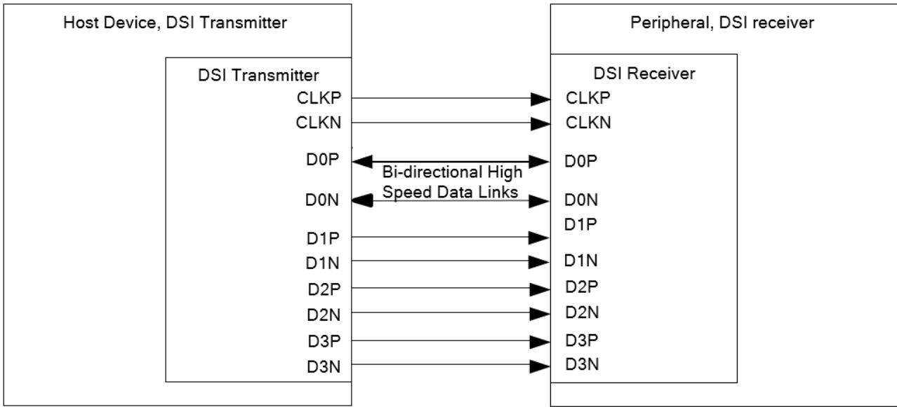  
图 6.13 DSI 发送器和接收器接口

DSI 的概念视图将该接口划分为若干功能层。各层的说明如下，并如图 6.14 所示。

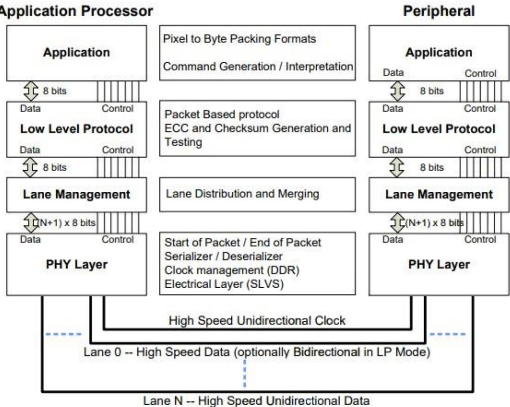  
图 6.14：DSI 层

PHY 层（PHY Layer）：PHY 层规定传输介质（导电体）、输入/输出电路以及从串行位流中捕获“1”和“0”的时钟机制。位级和字节级同步机制也作为 PHY 的一部分包含在内。

Lane 管理层（Lane Management Layer）：DSI 可通过扩展 Lane 数量来提升性能。数据信号的数量可为 1、2、3 或 4 条，具体取决于应用的带宽需求。接口的发送端将输出的数据流分配到一条或多条 Lane（“分配器”功能）。在接收端，接口从各 Lane 收集字节并将其合并成重组数据流，从而恢复原始的数据流顺序（“合并器”功能）。

协议层（Protocol Layer）：在最底层，DSI 协议规定穿过接口的位和字节的顺序与取值。它规定如何将字节组织成称为数据包（packet）的确定分组。协议定义了每个数据包所需的包头，以及包头信息如何生成和解析。接口的发送侧为所发送的数据附加包头和错误校验信息。在接收侧，包头被剥离并由接收器中相应的逻辑进行解析。错误校验信息可用于检测输入数据的完整性。DSI 协议还说明了如何对数据包进行标记，以便使用单条 DSI 将多个命令流或数据流交织（interleave）并送往不同目的地。

应用层（Application Layer）：该层描述对数据流中所含数据的更高层编码和解析。根据显示子系统架构的不同，它可能由具有规定格式的像素组成，也可能由显示模块内部的显示控制器所解析的命令组成。DSI 规范描述了在数据包组装过程中像素值、命令和命令参数到字节的映射。

## 6.8.1 命令模式、视频模式和虚拟通道

符合 DSI 规范的外设支持两种基本工作模式之一：命令模式（Command Mode）和视频模式（Video Mode）。采用哪种模式取决于外设的架构和能力。

通常，外设能够以命令模式或视频模式工作。某些视频模式显示模块还包含简化形式的命令模式操作，此时显示模块可从缩减尺寸的或部分的帧缓冲区刷新屏幕，并且与主机处理器之间的接口（DSI）可被关闭以降低功耗。

## 命令模式

命令模式是指这样一类操作：事务主要表现为向包含显示控制器的外设（例如显示模块）发送命令和数据。显示控制器可包含本地寄存器和帧缓冲区。使用命令模式的系统对寄存器和帧缓冲区存储器进行读写。主机处理器通过向显示控制器发送命令、参数和数据来间接控制外设的活动。主机处理器还可读取显示模块的状态信息或帧存储器的内容。命令模式操作需要双向接口。

## 视频模式

视频模式是指主机处理器到外设的传输以实时像素流形式进行的操作。在正常工作状态下，显示模块依赖主机处理器以足够的带宽提供图像数据，以避免显示图像出现闪烁或其他可见缺陷。视频信息只应使用高速模式（High Speed Mode）传输。

某些视频模式架构可能包含简单的时序控制器和部分帧缓冲区，用于在待机或低功耗模式下维持部分屏幕或较低分辨率的图像。这样便可将接口关闭以降低功耗。为降低复杂度和成本，仅以视频模式工作的系统可采用单向数据路径。

## 虚拟通道能力

虽然本规范仅涉及主机处理器与单个外设的连接，但 DSI 引入了虚拟通道能力，用于主机处理器与多个物理显示模块之间的通信。由于接口带宽在各外设之间共享，因此存在一些限制多外设系统物理规模和性能的约束。DSI 协议最多允许四个虚拟通道，使多个外设的流量能够共享同一条 DSI Link。DSI 规范未对用于指示隔行场的各虚拟通道的具体取值提出任何要求。为清晰起见，可将第一个隔行视频场指定为 DI[7:6] = 2'b00，将第二个隔行视频场指定为 DI[7:6] = 2'b01。

注 1：GX610 同时支持命令模式和视频模式。

## 6.8.2 DSI 格式

信息通过一条或多条串行数据信号以及随附的串行时钟在主机处理器与外设之间传输。在总线上发送高速串行数据的动作称为 HS 传输（HS transmission）或突发（burst）。在两次传输之间，差分数据信号（即 Lane）进入低功耗状态（LPS）。当接口未在主动发送或接收高速数据时，应处于 LPS 状态。图 7.4 示出了 HS 传输的基本结构。N 为此次传输中发送的总字节数。

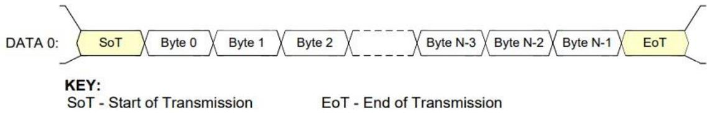  
图 6.16：HS 传输基本结构

## 多 Lane 分配与合并

DSI 是一种 Lane 数量可扩展的接口。需要比单条数据 Lane 所能提供的带宽更高的应用，可将数据通路扩展到两条、三条或四条 Lane 宽，从而获得近似线性的峰值总线带宽提升。

多 Lane 实现应使用由所有数据 Lane 共享的单一公共时钟信号。从概念上讲，在 PHY 与更高层功能模块之间存在一个支持多 Lane 操作的层。

由于一次 HS 传输由任意数量的字节组成，而该数量可能并非 Lane 数量的整数倍，因此某些 Lane 可能会先于其他 Lane 用完数据。因此，Lane 管理层在缓冲最后不足 N 字节的一组数据时，会对所有已无后续数据的 Lane 撤销其“有效数据”信号。

尽管所有 Lane 同时以并行的 SoT 开始，但每条 Lane 独立工作，可能会早于其他 Lane 完成 HS 传输，提前一个周期（字节）发送 EoT。

链路接收端的 N 个 PHY 并行收集字节并将其送入 Lane 管理层。Lane 管理层重建传输中字节的原始顺序。图 6.17 和图 6.18 示出了在 Lane 数量和包长度不同的情况下 HS 传输结束的多种方式。

发送的字节数 N 是 Lane 数量的整数倍：

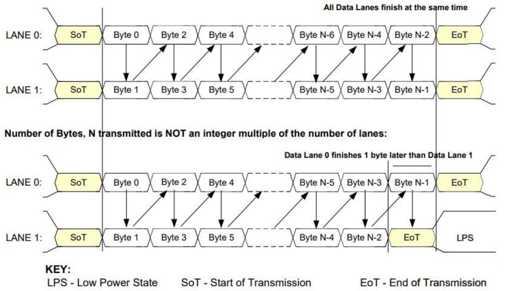  
图 6.17：双 Lane HS 传输示例

发送的字节数 N 是 Lane 数量的整数倍：  
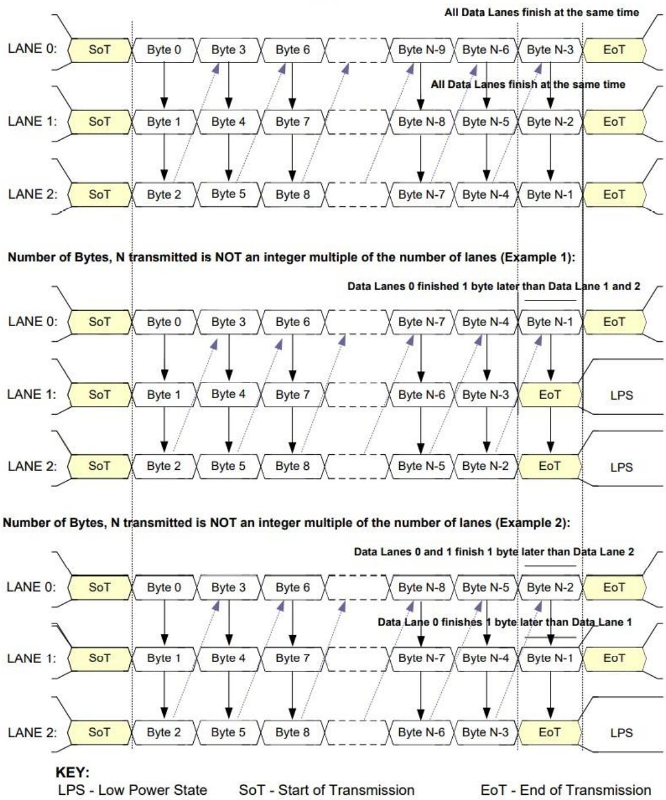  
图 6.18：三 Lane HS 传输示例

## 6.8.3 DSI 协议

在 DSI Link 的发送侧，并行数据、信号事件和命令在协议层中按照本节所述的数据包组织方式转换为数据包。协议层附加数据包协议信息和包头，然后通过 Lane 管理层将完整的字节发送到 PHY。

## 6.8.4 每次传输多个数据包

在最简单的形式下，一次传输可以只包含一个数据包。如果需要传输多个数据包，而数据包是分别发送的（例如每次传输只发送一个数据包），那么频繁在 LPS 与高速模式（High-Speed Mode）之间切换所带来的开销将严重限制带宽。

DSI 协议允许多个数据包级联（concatenate），从而大幅提升有效带宽。这对于外设初始化等场景很有用，此时许多

## 寄存器可在系统启动时通过各自的写命令进行加载。

在 PHY 层存在两种数据传输模式，即 HS 和 LP 传输模式。在开始一次 HS 传输之前，发送端 PHY 会向接收端发出 SoT 序列。此后，数据包或命令包即可在 HS 模式下传输。一次 HS 传输中可以存在多个数据包，而传输的结束始终由 PHY 层使用专用的 EoT 序列来指示。为了增强系统的整体稳健性，DSI 在协议层定义了专用的 EoT 包（EoTp），用于指示 HS 传输的结束。为了与早期的 DSI 系统保持向后兼容，生成和解析该 EoTp 的能力可以被使能或禁用。使能或禁用该能力的方法不在本文档的讨论范围内。

图 7.19 中的上图展示了在禁用 EoTp 支持的情况下多个数据包被分别发送的情形。在 HS 模式下，数据包之间的时间间隔应导致每个数据包各自构成一次独立的 HS 传输，包与包之间由 PHY 层发出 SoT、LPS 和 EoT。该约束不适用于 LP 传输。图 7.19 中的下图展示了在单次 HS 传输中级联多个数据包的情形。

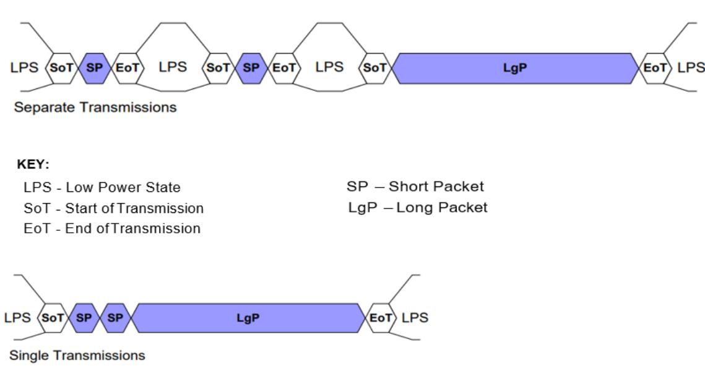  
图 6.19：禁用 EoTp 时的 HS 传输示例

图 6.20 描述了使能 EoTp 生成时的 HS 传输情形。在图中，EoT 短包以红色突出显示。上图展示的是主机打算通过两次独立的传输先后发送一个短包和一个长包的情形。在这种情况下，每次传输结束前都会额外生成一个 EoT 短包。与禁用 EoTp 生成（即系统仅依靠 PHY 层 EoT 序列来指示 HS 传输结束）的情况相比，该机制提供了更稳健的环境（robust environment），但代价是增加了开销（每次传输多出四个字节）。如图 6.8 中下图所示，通过在单次传输中发送多个长包和短包，可以将使能 EoTp 所带来的开销降至最低。

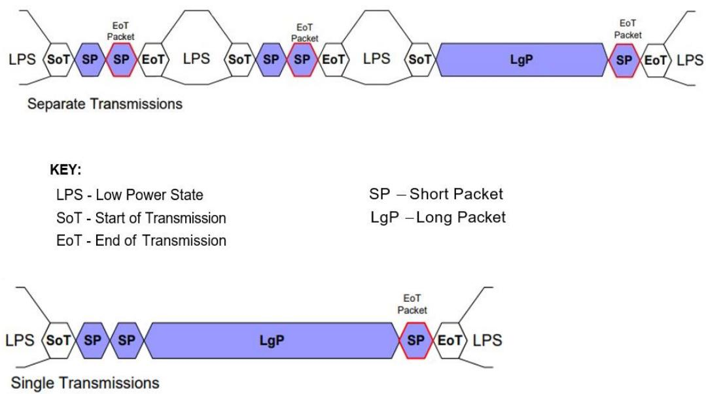  
图 6.20：使能 EoTp 时的 HS 传输示例

## 6.8.5 字节序策略（Endian Policy）

所有数据包数据都以字节形式通过接口传输。在顺序上，发送端应先发送 LSB，最后发送 MSB。对于包含多字节字段的数据包，除非另有说明，应先发送最低有效字节。图 6.21 展示了一次完整的长包数据传输。注意，图中字节值采用标准的位置记数法表示，即 MSB 在左、LSB 在右；而比特则按时间顺序表示，LSB 在左、MSB 在右，时间自左向右递增。

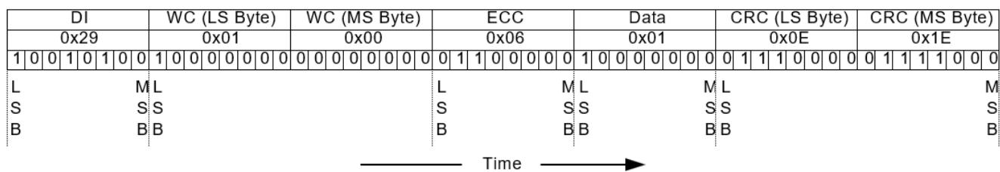  
图 6.21：字节序示例（长包）

## 6.8.6 包结构（Packet Structure）

数据包的第一个字节是数据标识符（Data Identifier，DI），其中包含用于指定该包类型的信息。包的长度分为两类：

•长包（Long packet）使用两字节的 Word Count 字段来指定载荷长度。载荷长度可为 0 至 216- 1 字节。因此，一个长包的长度最多可达 65,541 字节。长包允许传输大块的像素数据或其他数据。

•短包（Short packet）的长度为四字节（包含 ECC）。短包用于大多数命令模式（Command Mode）命令及相关参数。其他短包用于传递 H Sync 和 V Sync 边沿等事件。由于它们是短包，因此能够向外设中的逻辑传递精确的时序信息。

Set Maximum Return Packet Size 命令允许主机处理器限制来自外设的响应包的大小。

## 6.8.7 长包（Long Packet）

图 6.22 展示了长包的结构。长包应由三个元素组成：32 位的包头（Packet Header，PH）、字节数可变的应用专用数据载荷（Data Payload），以及 16 位的包尾（Packet Footer，PF）。包头又由三个元素组成：8 位数据标识符、16 位 Word Count 和 8 位 ECC。包尾包含一个元素，即 16 位校验和。长包的长度可为 6 至 65,541 字节

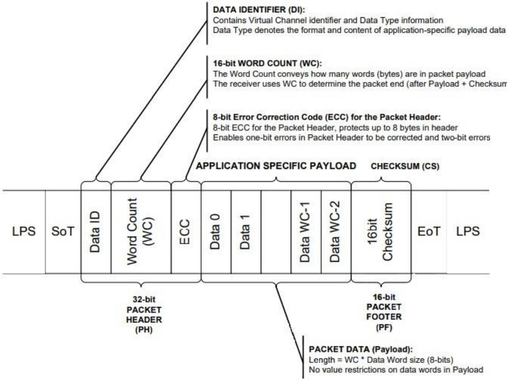  
图 6.22：长包结构

数据标识符定义数据所属的虚拟通道（Virtual Channel），以及应用专用载荷数据的数据类型（Data Type）。

Word Count 定义数据载荷中从包头结束处到包尾开始处之间的字节数。包头和包尾均不应计入 Word Count。

纠错码（Error Correction Code，ECC）字节使得包头中的单比特错误可以被纠正、2 比特错误可以被检测。这包括数据标识符和 Word Count 两个字段。

包头结束后，接收端读取数据载荷中接下来的 Word Count \* 个字节。在数据载荷块内，数据字的值没有限制，即不使用任何嵌入式编码。

接收端读取完数据载荷后，会读取包尾中的校验和。主机处理器应始终计算并在包尾中发送校验和。外设无需计算校验和。另请注意数据载荷为零字节的特殊情况：如果载荷长度为 0，则校验和的计算结果为 (0xFFFF)。如果未计算校验和，包尾应由两个全零字节（0x0000）组成。在一般情况下，数据载荷的长度应为字节的整数倍。

每个字节都应先发送最低有效位。载荷数据可以按任意字节顺序传输，仅受数据格式要求的限制。多字节元素（如 Word Count 和校验和）应先发送最低有效字节。

## 6.8.8 短包（Short Packet）

图 6.23 展示了短包的结构。短包应包含一个 8 位 Data ID，其后是两个命令字节或数据字节，以及一个 8 位 ECC；短包中不应存在包尾。短包的长度应为四字节。纠错码（Error Correction Code，ECC）字节使得短包中的单比特错误可以被纠正、2 比特错误可以被检测。

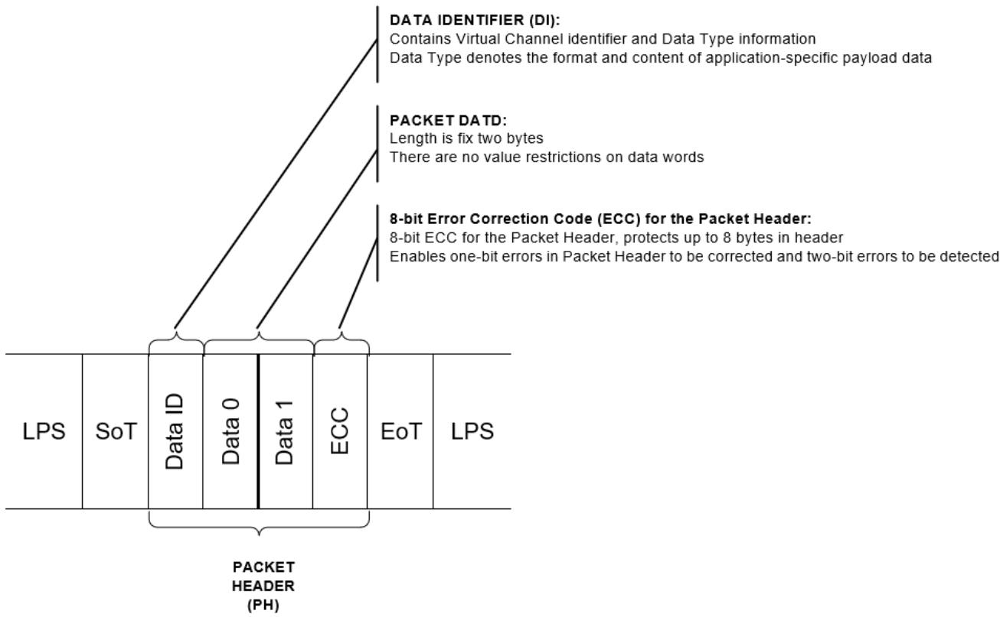  
图 6.23：短包结构

## 6.8.9 公共包元素（Common Packet Elements）

长包和短包具有若干公共元素，本节将对这些元素进行说明。

## 6.8.10 数据标识符字节（Data Identifier Byte）

任何数据包的第一个字节都是 DI（Data Identifier，数据标识符）字节。图 6.12 展示了数据标识符（DI）字节的构成。DI[7:6]：这两位标识该数据被定向到四个虚拟通道中的哪一个。DI[5:0]：这六位指定数据类型。

<table><tr><td>B7 B6</td><td>B5 B4</td><td>B3 B2</td><td>B1 B0</td></tr><tr><td>VC</td><td colspan="3">DT</td></tr><tr><td>虚拟通道标识符（VC）</td><td colspan="3">数据类型（DT）</td></tr></table>

图 6.24：数据标识符字节

## 6.8.11 虚拟通道标识符 – VC 字段，DI[7:6]

处理器最多可以服务四个外设，方法是利用包头中的虚拟通道 ID 字段，将带标签的命令或数据块发送给不同的外设。虚拟通道 ID 通过将数据包复用到同一条传输通道上，使单条串行数据流能够服务两个或更多虚拟外设。

## 6.8.12 数据类型字段 DT[5:0]

数据类型（Data Type）字段指定该包是长包还是短包类型以及包的格式。数据类型字段与长包的 Word Count 字段一起，告知接收端该包剩余部分应期待多少字节。这是必要的，因为不存在用于指示包起始和结束的特殊包起始/结束同步码。这使数据包能够承载任意数据，但也要求包头明确指定包的长度。当接收逻辑递减计数到包的末尾时，它应假定接下来的数据要么是新包的包头，要么是 EoT（End of Transmission，传输结束）序列。

## 6.8.13 ECC

纠错码（Error Correction Code）使得包头中的单比特错误可以被纠正、2 比特错误可以被检测。主机处理器应始终计算并发送 ECC 字节。外设应在前向和反向通信中均支持 ECC。

## 6.8.14 DSI 包

DSI 协议允许使用多个数据包，这对于外设初始化等场景很有用，此时许多寄存器可在系统启动时通过各自的写命令加载。下图展示了多个 HS 传输包。

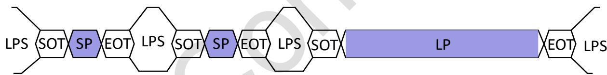

LPS：低功耗状态（Low power state）

SOT：传输起始（Start of Transmission）

SP：短包（Short Packet）

LP：长包（Long Packet）

EOT：传输结束（End of Transmission）

## 6.8.15 处理器发出的数据包（Processor-sourced Packets）

从主机处理器发送到外设（例如显示模块）的事务类型集合如表 6.4 所示。

<table><tr><td>数据类型（十六进制）</td><td>数据类型（二进制）</td><td>描述</td><td>包类型</td></tr><tr><td>0x01</td><td>00 0001</td><td>同步事件，V Sync 起始</td><td>短包</td></tr><tr><td>0x11</td><td>01 0001</td><td>同步事件，V Sync 结束</td><td>短包</td></tr><tr><td>0x21</td><td>10 0001</td><td>同步事件，H Sync 起始</td><td>短包</td></tr><tr><td>0x31</td><td>11 0001</td><td>同步事件，H Sync 结束</td><td>短包</td></tr><tr><td>0x08</td><td>00 1000</td><td>传输结束包（EoTp）</td><td>短包</td></tr><tr><td>0x02</td><td>00 0010</td><td>色彩模式（CM）关闭命令</td><td>短包</td></tr><tr><td>0x12</td><td>01 0010</td><td>色彩模式（CM）开启命令</td><td>短包</td></tr><tr><td>0x22</td><td>10 0010</td><td>关闭外设命令</td><td>短包</td></tr><tr><td>0x32</td><td>11 0010</td><td>开启外设命令</td><td>短包</td></tr><tr><td>0x03</td><td>00 0011</td><td>通用短写（WRITE），无参数</td><td>短包</td></tr><tr><td>0x13</td><td>01 0011</td><td>通用短写（WRITE），1 个参数</td><td>短包</td></tr><tr><td>0x23</td><td>10 0011</td><td>通用短写（WRITE），2 个参数</td><td>短包</td></tr><tr><td>0x04</td><td>00 0100</td><td>通用读（READ），无参数</td><td>短包</td></tr><tr><td>0x14</td><td>01 0100</td><td>通用读（READ），1 个参数</td><td>短包</td></tr><tr><td>0x24</td><td>10 0100</td><td>通用读（READ），2 个参数</td><td>短包</td></tr><tr><td>0x05</td><td>00 0101</td><td>DCS 短写（WRITE），无参数</td><td>短包</td></tr><tr><td>0x15</td><td>01 0101</td><td>DCS 短写（WRITE），1 个参数</td><td>短包</td></tr><tr><td>0x06</td><td>00 0110</td><td>DCS 读（READ），无参数</td><td>短包</td></tr><tr><td>0x37</td><td>11 0111</td><td>设置最大返回包长度</td><td>短包</td></tr><tr><td>0x09</td><td>00 1001</td><td>空包（Null Packet），无数据</td><td>长包</td></tr><tr><td>0x19</td><td>01 1001</td><td>消隐包（Blanking Packet），无数据</td><td>长包</td></tr><tr><td>0x29</td><td>10 1001</td><td>通用长写（Generic Long Write）</td><td>长包</td></tr><tr><td>0x39</td><td>11 1001</td><td>DCS 长写/write_LUT 命令包</td><td>长包</td></tr><tr><td>0x0E</td><td>00 1110</td><td>打包像素流，16 位 RGB，5-6-5 格式</td><td>长包</td></tr><tr><td>0x1E</td><td>01 1110</td><td>打包像素流，18 位 RGB，6-6-6 格式</td><td>长包</td></tr><tr><td>0x2E</td><td>10 1110</td><td>松散打包像素流，18 位 RGB，6-6-6 格式</td><td>长包</td></tr><tr><td>0x3E</td><td>11 1110</td><td>打包像素流，24 位 RGB，8-8-8 格式</td><td>长包</td></tr><tr><td>0xX0 和 0xXF 未指定</td><td>xx 0000 xx 1111</td><td>请勿使用。所有未指定的代码均为保留。</td><td></td></tr></table>

## 6.8.16 打包像素流（Packed Pixel Stream），16 位格式，长包

图 6.25 所示的打包像素流 16 位格式是一种长包，用于向视频模式（Video Mode）显示模块传输格式化为 16 位像素的图像数据。该包由 DI 字节、两字节 WC、ECC 字节、长度为 WC 字节的载荷以及两字节校验和组成。像素格式依次为红色五位、绿色六位、蓝色五位。在每种颜色分量内部，先发送 LSB，最后发送 MSB。总行宽（显示像素加非显示像素）应为两字节的整数倍。

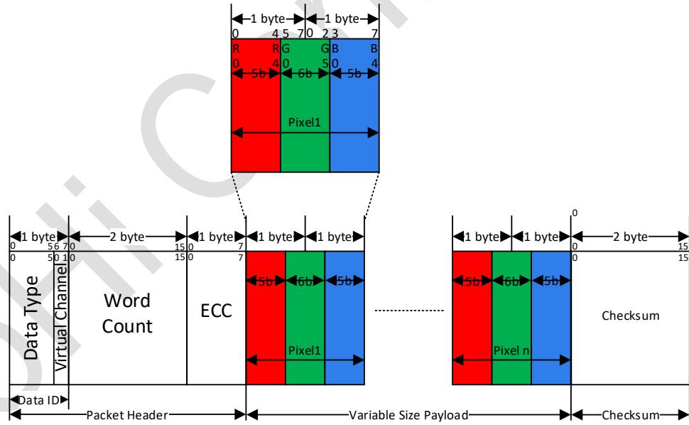  
图 6.25：每像素 16 位 – RGB 颜色格式，长包

## 6.8.17 打包像素流，18 位格式，长包

图 6.26 所示的打包像素流 18 位格式（打包型）是一种长包。它用于向显示 18 位像素的视频模式显示模块传输格式化为像素的 RGB 图像数据。该包由 DI 字节、两字节 WC、ECC 字节、长度为 WC 字节的载荷以及两字节校验和组成。像素格式依次为红色（6 位）、绿色（6 位）和蓝色（6 位）。在每种颜色分量内部，先发送 LSB，最后发送 MSB。

注意，像素边界每四个像素（九个字节）才与字节边界对齐。采用该格式的显示模块最好具有能被四整除的水平范围（以像素为单位的宽度），这样在显示行数据末尾就不会残留不完整的字节。如果有效（显示）水平宽度不是四像素的整数倍，发送端应在显示行末尾发送额外的填充像素，使发送宽度成为四像素的整数倍。外设在刷新显示器件时不会显示填充像素。

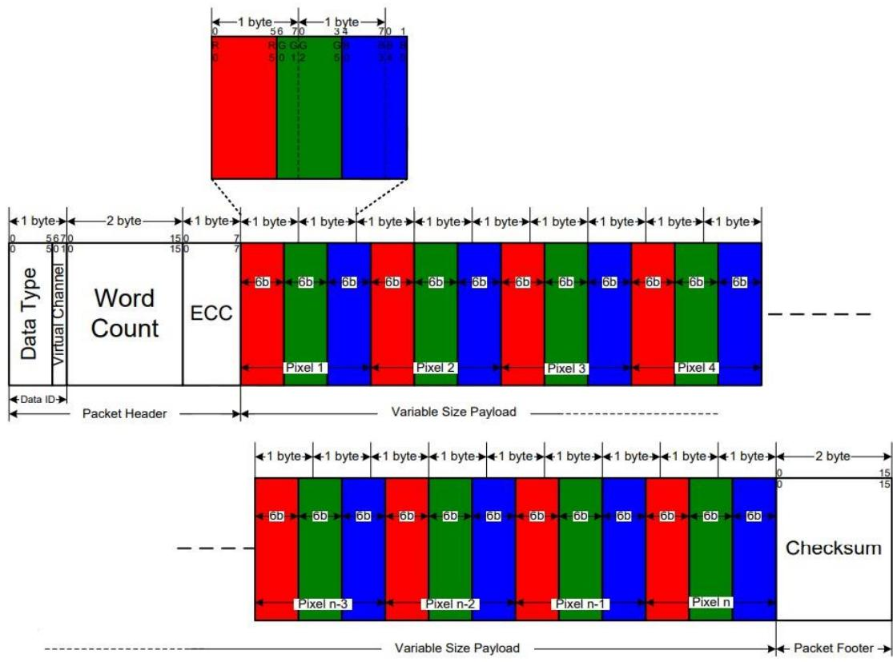  
图 6.26：每像素 18 位（打包型）– RGB 颜色格式，长包

## 6.8.18 像素流，18 位松散格式，长包

在 18 位像素松散打包（Loosely Packed）格式中，每个 R、G 或 B 颜色分量均为六位，但被移位到字节的高位，因此有效像素位占据每个字节的位 [7:2]，如图 6.27 所示。表示有效像素的每个载荷字节的位 [1:0] 被忽略。因此，每个像素在链路上传输时需要三个字节。与“打包”格式相比，这需要更大的带宽，但链路两端在打包和解包功能中所需的移位和复用逻辑更少。采用该格式时，像素边界每三个字节与字节边界对齐。总行宽（显示像素加非显示像素）应为三字节的整数倍。

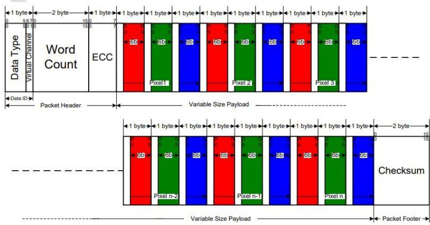

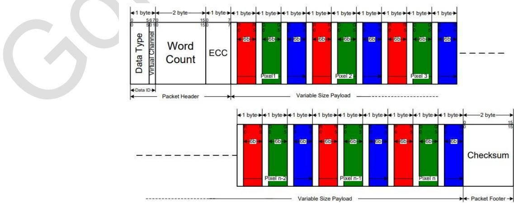  
图 6.27：每像素 18 位（松散打包）– RGB 颜色格式，长包

## 6.8.19 打包像素流，24 位格式，长包

图 6.28 所示的打包像素流 24 位格式是一种长包。它用于向视频模式显示模块传输格式化为 24 位像素的图像数据。该包由 DI 字节、两字节 WC、ECC 字节、长度为 WC 字节的载荷以及两字节校验和组成。像素格式依次为红色（8 位）、绿色（8 位）和蓝色（8 位）。每个颜色分量在像素流中占一个字节；没有任何分量跨字节边界拆分。在每种颜色分量内部，先发送 LSB，最后发送 MSB。采用该格式时，像素边界每三个字节与字节边界对齐。总行宽（显示像素加非显示像素）应为三字节的整数倍。

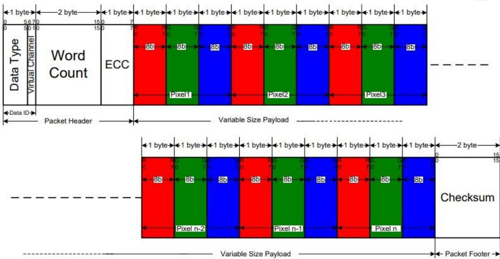  
图 6.28：每像素 24 位 – RGB 颜色格式，长包

## 6.8.20 外设到处理器的传输（Peripheral to Processor Transmission）

GX610 具备双向能力，可将 READ 数据、应答或错误信息返回给主机处理器。每次外设到处理器的事务之后都应进行 BTA。这在外设完成 LP 传输后将总线控制权交还给主机处理器。

外设到处理器的事务有四种基本类型：

•撕裂效应（Tearing Effect，TE）是一种触发消息（Trigger message），用于向主机处理器传递显示时序信息。触发消息是外设 PHY 层响应 DSI 协议层的信号而发送的单字节包。

•应答（Acknowledge）是一种触发消息，当本次传输以及自上一次外设到主机通信以来的所有先前传输（即触发消息或数据包）被外设无差错接收时发送。

•应答与错误报告（Acknowledge and Error Report）是一种短包，当在来自主机处理器的先前传输中检测到任何错误时发送。一旦报告，错误寄存器中累积的错误将被清除。

•读请求响应（Response to Read Request）可以是一个短包或长包，用于返回处理器先前 READ 命令所请求的数据。
## 6.8.21 对命令和 ACK 请求的适当响应

一般而言，如果主处理器在置位 BTA 的情况下完成向从设备的传输，则从设备应响应一个或多个适当的报文，然后将总线所有权交还给主处理器。如果在主处理器传输之后未置位 BTA，则从设备不应向主处理器回传 Acknowledge 或错误信息。

对于置位 BTA 的处理器到从设备事务的解读，以及预期的响应如下：

•在非读命令之后，如果自上次从设备到主处理器通信（即触发或报文）以来未检测并存储任何错误，从设备应响应 Acknowledge。

•在读请求之后，如果自上次从设备到主处理器通信（即触发或报文）以来未检测并存储任何错误，从设备应发送所请求的 READ 数据。

•在读请求之后，如果仅检测到并纠正了单位 ECC 错误，则从设备应在同一个 LP 传输中发送所请求的 READ 数据（以长报文或短报文形式），随后发送一个 4 字节的 Acknowledge and Error Report 报文。该 Error Report 应置位 ECC Error – Single Bit 标志，并包含自上次从设备到主处理器通信以来所存储的任何先前传输中的错误位。

•在非读命令之后，如果仅检测到并纠正了单位 ECC 错误，则从设备应继续执行该命令，并应通过发送一个 4 字节的 Acknowledge and Error Report 报文来响应 BTA。该 Error Report 应置位 ECC Error – Single Bit 标志，并包含自上次从设备到主处理器通信以来所存储的任何先前传输中的错误位。

•在读请求之后，如果检测到多位 ECC 错误且未纠正，则从设备应发送一个 4 字节的 Acknowledge and Error Report 报文，而不发送 Read 数据。该 Error Report 应置位 ECC Error – Multi-Bit 标志，并包含自上次从设备到主处理器通信以来所存储的任何先前传输中的错误位。

•在非读命令之后，如果检测到多位 ECC 错误且未纠正，则从设备不应执行该命令，而应发送一个 4 字节的 Acknowledge and Error Report 报文。该 Error Report 应置位 ECC Error – Multi-Bit 标志，并包含自上次从设备到主处理器通信以来所存储的任何先前传输中的错误位。

•在任何命令之后，如果检测到 SoT Error、SoT Sync Error 或 DSI VC ID Invalid 或 DSI 协议违例，或者未识别出该 DSI 命令，则从设备应发送一个 4 字节的 Acknowledge and Error Report 响应，其中置位相应的错误标志，并在两字节错误字段中包含自上次从设备到主处理器通信以来所存储的任何先前传输中的错误位。此时仅传输 Acknowledge and Error Report 报文；从设备不应因此执行任何读或写访问。

•在任何命令之后，如果检测到 EoT Sync Error 或 LP Transmit Sync Error，或者在有效载荷中检测到校验和错误，则从设备应发送一个 4 字节的 Acknowledge and Error Report 报文，其中置位相应的错误标志，并包含自上次从设备到主处理器通信以来所存储的任何先前传输中的错误位。对于读命令，此时仅传输 Acknowledge and Error Report 报文；从设备不应因此发送任何读数据。

一旦报告给主处理器，本节所述的所有错误都将从 Error Register 中清除。

## 6.8.22 从设备到处理器的报文说明

表 6.5 列出了从设备到处理器的完整 Data Type 集合。

<table><tr><td>Data Type (Hex)</td><td>Data Type (Binary)</td><td>Description</td><td>Packet Size</td></tr><tr><td>0x02</td><td>00 0010</td><td>Acknowledge and Error Report</td><td>Short</td></tr><tr><td>0x08</td><td>00 1000</td><td>End of Transmission packet</td><td>Short</td></tr><tr><td>0x1C</td><td>01 1100</td><td>DCS Long READ Response</td><td>Long</td></tr></table>

表 6.5：源自从设备的报文的 Data Type

## 6.8.23 Acknowledge and Error Report 与 Read Response Data Type 的格式

Acknowledge 使用 Trigger 消息发送。

Byte 0：00100001（此处按首位［左］到最后一位［右］的顺序表示）

对 Read Request 的响应返回处理器此前 READ 命令所请求的数据。这些数据可以是短报文或长报文。短 READ 报文响应的格式为：

•Byte 0：Data Identifier（Virtual Channel ID + Data Type）

•Byte 1、2：READ 数据，可以为一个或两个字节。对于单字节参数，该参数应在 Byte 1 中返回，而 Byte 2 应设置为 0x00。

•覆盖报头的 ECC 字节

Acknowledge and Error Report 确认来自主处理器发往从设备的先前命令或数据已被接收，并指明在该次传输以及任何先前传输中检测到何种类型的错误。请注意，如果错误从多次先前传输中累积，可能难以或无法确定哪次传输包含了该错误。此消息为四字节的短报文，格式如下：

•Byte 0：Data Identifier（Virtual Channel ID + Acknowledge Data Type）

•Byte 1：Error Report 位 0-7

•Byte 2：Error Report 位 8-15

•覆盖报头的 ECC 字节

错误报告（Error Report）是紧跟在 DI 字节之后的、由两个字节组成的短报文，其后跟随一个 ECC 字节。按照惯例，每种错误类型的检测与报告通过将对应位设置为“1”来表示。表 6.6 给出了所有错误报告的位分配。

<table><tr><td>Bit</td><td>Description</td></tr><tr><td>0</td><td>SoT Error</td></tr><tr><td>1</td><td>SoT Sync Error</td></tr><tr><td>2</td><td>EoT Sync Error</td></tr><tr><td>3</td><td>Escape Mode Entry Command Error</td></tr><tr><td>4</td><td>Low-Power Transmit Sync Error</td></tr><tr><td>5</td><td>Peripheral Timeout Error</td></tr><tr><td>6</td><td>False Control Error</td></tr><tr><td>7</td><td>Contention Detected</td></tr><tr><td>8</td><td>ECC Error, Single-bit (detected and corrected)</td></tr><tr><td>9</td><td>ECC Error, Multi-bit (detected, not corrected)</td></tr><tr><td>10</td><td>Checksum Error (Long packet only)</td></tr><tr><td>11</td><td>DSI Data Type Not Recognized</td></tr><tr><td>12</td><td>DSI VC ID Invalid</td></tr><tr><td>13</td><td>Invalid Transmission Length</td></tr><tr><td>14</td><td>Reserved</td></tr><tr><td>15</td><td>DSI Protocol Violation</td></tr></table>

表 6.6：Error Report 位定义

前八个位，即位 0 至位 7，与物理层错误相关。位 8 和位 9 与单位及多位 ECC 错误相关。其余位表示 DSI 协议特有的错误。

## 6.8.24 视频模式接口时序

视频模式（Video Mode）从设备要求实时提供像素数据。本节规定此类显示模块的 DSI 流量的格式与时序。

## 6.8.25 传输报文序列

DSI 支持多种用于视频模式数据传输的格式，即报文序列。在以下各节中，突发模式（Burst Mode）是指对传输中的 RGB 像素（有效视频）部分进行时间压缩。此外，以下各节中通篇使用以下术语：

•带同步脉冲的非突发模式（Non-Burst Mode with Sync Pulses）——使从设备能够准确重建原始视频时序，包括同步脉冲宽度。

•带同步事件的非突发模式（Non-Burst Mode with Sync Events）——与上述类似，但不要求准确重建同步脉冲宽度，因此以单个 Sync Event 代替。

•突发模式（Burst mode）——RGB 像素报文被时间压缩，从而在一条扫描线内留出更多时间用于 LP 模式（节省功耗）或将其他传输复用到 DSI 链路上。

在以下各图中，消隐或低功耗间隔（BLLP）定义为这样一段时间：在此期间，诸如像素流和同步事件报文之类的视频报文不被主动传输到从设备。

为实现 PHY 同步，主处理器应周期性地结束 HS 传输并将 Data Lane 驱动到 LP 状态。此转换应至少每帧发生一次；在本节各图中表示为 LPM。主处理器应在水平消隐期间每条扫描线返回一次 LP 状态。

在 BLLP 期间，DSI Link 可以执行以下任一操作：

•保持空闲模式（Idle Mode），主处理器处于 LP-11 状态，从设备处于 LP-RX

•主处理器使用 Escape Mode 向从设备发送一个或多个非视频报文

•主处理器使用 HS Mode 向从设备发送一个或多个非视频报文

•如果上一次处理器到从设备的传输以 BTA 结束，则从设备使用 Escape Mode 向主处理器发送一个或多个报文

•主处理器使用不同的 Virtual Channel ID 向另一个从设备发送一个或多个报文

BLLP 内或 HS 传输的 RGB 部分内的报文序列是任意的。主处理器可以在报文格式定义的限制内组合任意报文序列，包括重复迭代。对于所有时序情况，一帧的第一行应以 VSS 开始；所有其他行应以 VSE 或 HSS 开始。请注意，诸如 VSS 和 HSS 等同步报文在时间上的位置极为重要，因为这直接影响显示面板的视觉性能。

通常，RGB 像素数据以单个报文发送一整条扫描线的像素。

除非另有说明，本节各图中所使用的传输报文组成部分定义见图 6.29 Video Mode Interface Timing Legend。

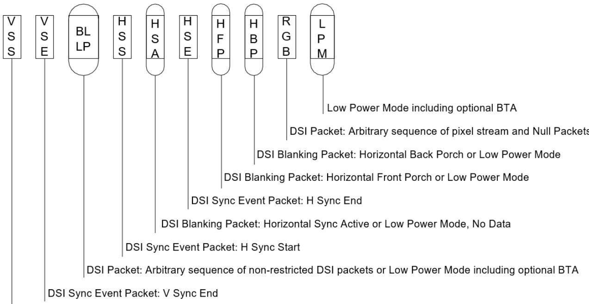  
DSI Sync Event Packet: V Sync Start  
图 6.29 视频模式接口时序图例

如果从设备时序规范中 HBP 或 HFP 的最短时间为零，则相应的 Blanking Packet 可以省略。如果 HBP 或 HFP 的最长时间为零，则相应的消隐报文应省略。

## 6.8.26 非突发同步脉冲模式

采用此格式时，其目标是通过 DSI 串行链路准确传达 DPI 类型的时序。这包括匹配 DPI 像素传输速率，以及诸如同步脉冲等时序事件的宽度。相应地，同步周期通过同时传输同步脉冲起始与结束的报文来定义。此模式的一个示例如图 6.30 所示。

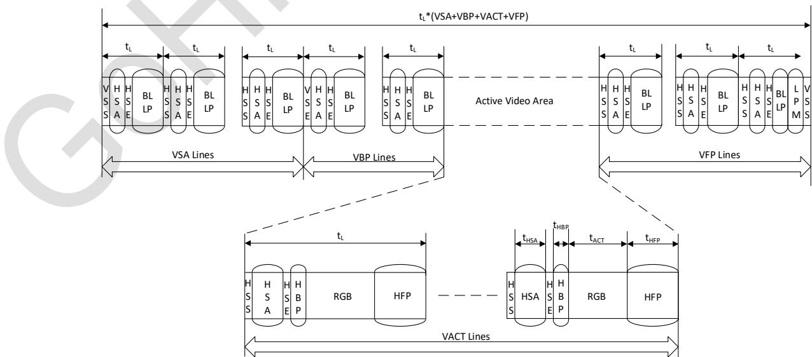  
图 6.30：视频模式接口时序：带 Sync Start 和 End 的非突发传输

通常，图中所示 HSA（Horizontal Sync Active）、HBP（Horizontal Back Porch）和 HFP（Horizontal Front Porch）的时段由 Blanking Packet 填充，其长度（包括报文开销）经计算以匹配从设备数据手册所规定的时段。或者，如果有足够时间从 HS 模式转换到 LP 模式再转换回来，则 LP 模式下的一段定时区间可以替代 Blanking Packet，从而节省功耗。在 HSA、HBP 和 HFP 期间，总线应保持在 LP-11 状态。

## 6.8.27 非突发同步事件模式

此模式是“带同步脉冲的非突发模式”格式的简化形式。仅传输每个同步脉冲的起始。从设备可以根据接收到的每个 Sync Event 报文按需重新生成同步脉冲。此模式的一个示例如图 6.31 所示。

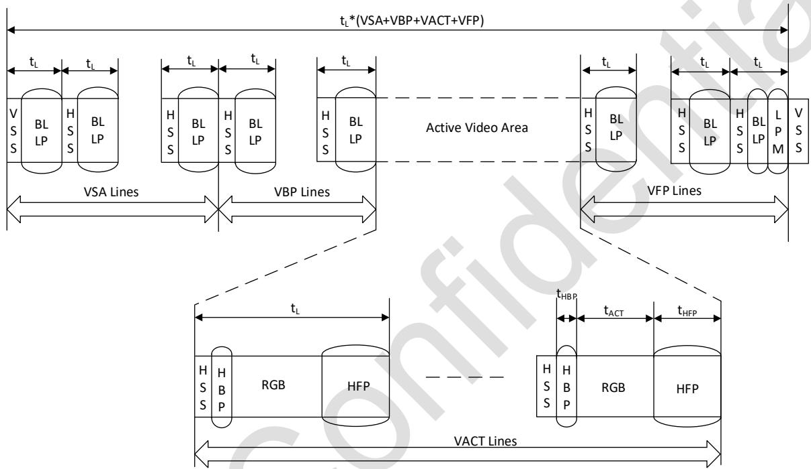  
图 6.31：视频模式接口时序：带 Sync Event 的非突发传输

与前述非突发模式一样，如果有足够时间从 HS 模式转换到 LP 模式再转换回来，则 LP 模式下的一段定时区间可以替代 Blanking Packet，从而节省功耗。

## 6.8.28 突发模式

在此模式下，可以使用时间压缩的突发格式在更短的时间内传输像素数据块。这是一种降低 DSI 整体功耗的良好策略，同时也为链路上任一方向的其他数据传输留出更大的时间块。

在 HS 像素数据传输之后，总线可以保持在 HS 模式以发送消隐报文，或者进入低功耗模式；在低功耗模式下，总线可以保持空闲，即主处理器保持 LP-11 状态，或者可以在任一方向上进行 LP 传输。如果从设备取得总线控制权以向主处理器发送数据，则应限制其传输时间，以确保从其内部缓冲存储器到显示设备的数据不会发生下溢。此模式的一个示例如

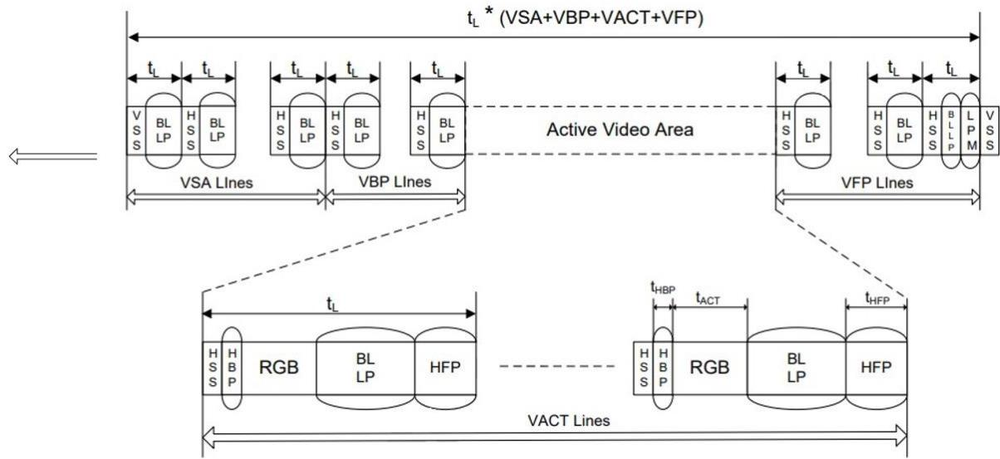

与非突发模式的情形类似，如果有足够时间从 HS 模式转换到 LP 模式再转换回来，则 LP 模式下的一段定时区间可以替代 Blanking Packet，从而节省功耗。

## 6.9 纠错码与校验和

## 6.9.1 纠错码（ECC）

MIPI DSI 使用汉明码理论（Hamming Code Theory）作为 ECC 生成规则。ECC 中各位的奇偶性如下所示。

```txt
P7=0
```

$$
\mathrm{P6=0}
$$

$$
P 5 = D 1 0 ^ {\wedge} D 1 1 ^ {\wedge} D 1 2 ^ {\wedge} D 1 3 ^ {\wedge} D 1 4 ^ {\wedge} D 1 5 ^ {\wedge} D 1 6 ^ {\wedge} D 1 7 ^ {\wedge} D 1 8 ^ {\wedge} D 1 9 ^ {\wedge} D 2 1 ^ {\wedge} D 2 2 ^ {\wedge} D 2 3
$$

$$
P 4 = D 4 ^ {\wedge} D 5 ^ {\wedge} D 6 ^ {\wedge} D 7 ^ {\wedge} D 8 ^ {\wedge} D 9 ^ {\wedge} D 1 6 ^ {\wedge} D 1 7 ^ {\wedge} D 1 8 ^ {\wedge} D 1 9 ^ {\wedge} D 2 0 ^ {\wedge} D 2 2 ^ {\wedge} D 2 3
$$

$$
P 3 = D 1 ^ {\wedge} D 2 ^ {\wedge} D 3 ^ {\wedge} D 7 ^ {\wedge} D 8 ^ {\wedge} D 9 ^ {\wedge} D 1 3 ^ {\wedge} D 1 4 ^ {\wedge} D 1 5 ^ {\wedge} D 1 9 ^ {\wedge} D 2 0 ^ {\wedge} D 2 1 ^ {\wedge} D 2 3
$$

$$
P 2 = D 0 ^ {\wedge} D 2 ^ {\wedge} D 3 ^ {\wedge} D 5 ^ {\wedge} D 6 ^ {\wedge} D 9 ^ {\wedge} D 1 1 ^ {\wedge} D 1 2 ^ {\wedge} D 1 5 ^ {\wedge} D 1 8 ^ {\wedge} D 2 0 ^ {\wedge} D 2 1 ^ {\wedge} D 2 2
$$

$$
P 1 = D 0 ^ {\wedge} D 1 ^ {\wedge} D 3 ^ {\wedge} D 4 ^ {\wedge} D 6 ^ {\wedge} D 8 ^ {\wedge} D 1 0 ^ {\wedge} D 1 2 ^ {\wedge} D 1 4 ^ {\wedge} D 1 7 ^ {\wedge} D 2 0 ^ {\wedge} D 2 1 ^ {\wedge} D 2 2 ^ {\wedge} D 2 3
$$

$$
P 0 = D 0 ^ {\wedge} D 1 ^ {\wedge} D 2 ^ {\wedge} D 4 ^ {\wedge} D 5 ^ {\wedge} D 7 ^ {\wedge} D 1 0 ^ {\wedge} D 1 1 ^ {\wedge} D 1 3 ^ {\wedge} D 1 6 ^ {\wedge} D 2 0 ^ {\wedge} D 2 1 ^ {\wedge} D 2 2 ^ {\wedge} D 2 3
$$

ECC 由图 6.33 所示 Packet Header 中的二十四个位生成，该图同时作为一个 ECC 计算示例。

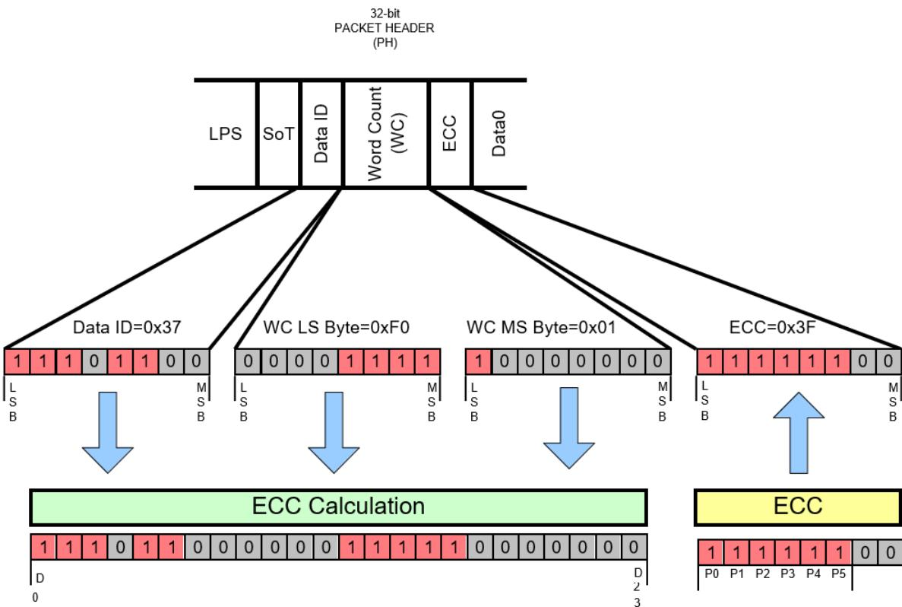  
图 6.33：24 位 ECC 生成示例

## 6.9.2 长报文有效载荷的校验和生成

为检测长报文传输中的错误，会针对数据包的有效载荷部分计算校验和。请注意，对于零长度有效载荷的特殊情况，2 字节校验和被设置为 0xFFFF。该校验和应实现为生成多项式为 x^16+x^12+x^5+x^0 的 16 位 CRC。

校验和的传输如图 7.34 所示。先发送 LS 字节，随后发送 MS 字节。请注意，在字节内部，先发送 LS 位。

16 位校验和

<table><tr><td>CRC LS Byte</td><td>CRC MS Byte</td></tr></table>

16 位 PACKET FOOTER（PF）  
图 6.34：校验和传输

CRC 的实现如图 6.35 所示。在数据包数据进入之前，CRC 移位寄存器应初始化为 0xFFFF。随后，不包含 Packet Header 的数据包数据以位流形式从左侧进入，LS 位在先。每个位在被送往输出以传输到从设备之前，都要经过 CRC 移位寄存器。在数据包有效载荷中的所有字节都经过 CRC 移位寄存器之后，移位寄存器中即为校验和。C15 包含校验和的 MSB，C0 包含 16 位校验和的 LSB。随后将校验和附加到数据流中并发送给接收器。接收器使用其自身生成的 CRC 来验证传输过程中未发生错误。

$$
\text { Polynomial: } x ^ {\wedge} 1 6 + x ^ {\wedge} 1 2 + x ^ {\wedge} 5 + x ^ {\wedge} 0
$$

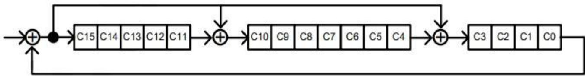  
图 6.35：使用移位寄存器生成 16 位 CRC

## 6.10 DPHY

## 6.10.1 Lane Module

一个 PHY 配置包含一个 Clock Lane Module 和一个或多个 Data Lane Module。这些 PHY Lane Module 中的每一个都通过两条 Line 与 Lane Interconnect 另一端的互补部分通信。每个 Lane Module 由一个或多个差分高速（High-Speed）功能（同时利用两条互连线）、一个或多个单端低功耗（Low-Power）功能（分别在每条互连线上工作）以及控制和接口逻辑组成。为正确工作，Lane Interconnect 两侧 Lane Module 中的功能集必须匹配。

## 6.10.2 Clock Lane、Data0、Data1 和 Data2 的 Lane Module 类型

Lane Module 中所需的功能取决于 Lane 类型以及 Lane Module 位于 Lane Interconnect 的哪一侧（主机或从机）。主要有三种 Lane 类型：Clock Lane、单向 Data Lane 和双向 Data Lane。使用这些 Lane 类型可以构建多种 PHY 配置。在 GX610 中，下文展示了各 lane 的 lane module 架构。

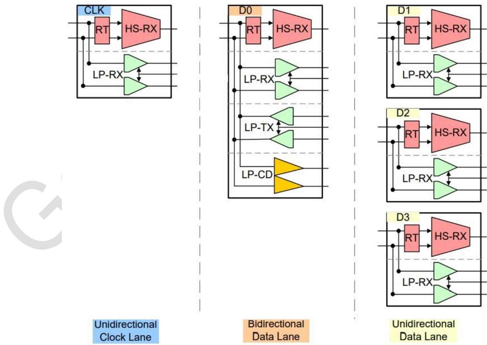  
图 6.36：Lane Module 类型
## 6.10.3 主端（Master）与从端（Slave）

每条 Link 都有 Master 侧和 Slave 侧。Master 向 Clock Lane 提供高速 DDR 时钟信号，是主要的数据源；Slave 在 Clock Lane 接收时钟信号，是主要的数据接收方。数据通信的主要方向（从源到宿）称为正向（Forward）方向，反方向的数据通信称为反向传输（Reverse transmission）。只有双向 Data Lane 才能进行反向传输。在所有情况下，Clock Lane 始终保持正向，但双向 Data Lane 可以翻转方向，由 Slave 侧提供数据。

GX610 作为 Slave 侧。

## 6.10.4 Lane 状态与线电平

发送器功能通过驱动特定的 Line 电平来确定 Lane 状态。在正常工作期间，由 HS-TX 或 LP-TX 驱动 Lane。HS-TX 始终以差分方式驱动 Lane。两个 LP-TX 各自独立、以单端方式驱动 Lane 的两条 Line。这样就产生了两种可能的高速 Lane 状态和四种可能的低功耗 Lane 状态。高速 Lane 状态为 Differential-0 和 Differential-1。低功耗 Lane 状态的解释取决于工作模式。LP 接收器（LP-Receiver）应始终将两种高速差分状态都解释为 LP-00。

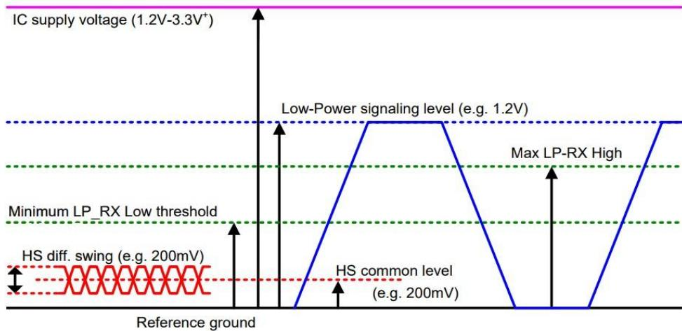  
图 6.37：线电平

Stop 状态具有非常独特且核心的作用。如果 Line 电平保持 Stop 状态达到最短所需时间，则无论先前处于何种状态，PHY 状态机都应返回 Stop 状态。根据最近一次的工作方向，这可能处于 RX 或 TX 模式。表 6.7 列出了正常工作期间 Lane 上可能出现的所有状态。所有 LP 状态周期时长至少应为 TLPX。状态转换应平滑，不应出现毛刺效应。通过对 Dp 和 Dn 两条 Line 进行异或（exclusive-OR）运算可以重建时钟信号。理想情况下，重建时钟的持续时间至少为 2\*TLPX，但由于信号斜率和跳变电平的影响，其占空比可能不是 50%。

<table><tr><td rowspan="2">Start Code</td><td colspan="2">线电压电平</td><td>高速</td><td colspan="2">低功耗</td></tr><tr><td>Dp 线</td><td>Dn 线</td><td>突发模式</td><td>控制模式</td><td>Escape 模式</td></tr><tr><td>HS-0</td><td>HS Low</td><td>HS High</td><td>Differential-0</td><td>N/A</td><td>N/A</td></tr><tr><td>HS-1</td><td>HS High</td><td>HS Low</td><td>Differential-1</td><td>N/A</td><td>N/A</td></tr><tr><td>LP-00</td><td>LP Low</td><td>LP Low</td><td>N/A</td><td>Bridge</td><td>Space</td></tr><tr><td>LP-01</td><td>LP Low</td><td>LP High</td><td>N/A</td><td>HS-Rqst</td><td>Mark-0</td></tr><tr><td>LP-10</td><td>LP High</td><td>LP Low</td><td>N/A</td><td>LP-Rqst</td><td>Mark-1</td></tr><tr><td>LP-11</td><td>LP High</td><td>LP High</td><td>N/A</td><td>Stop</td><td>N/A</td></tr></table>

## 6.10.5 双向 Data Lane 方向翻转（Turnaround）

双向 Data Lane 的传输方向可以通过 Link Turnaround（链路翻转）过程进行交换。该过程可实现与当前方向相反方向的信息传输。无论是由正向变为反向，还是由反向变为正向，该过程都相同。需要注意，Master 侧和 Slave 侧不应因 Turnaround 而改变。

图 6.38 以图形方式展示了 Turnaround 过程。  
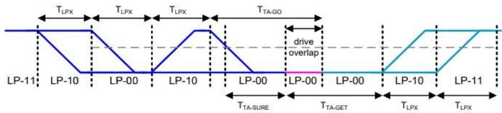  
图 6.38：Turnaround 过程

## 6.11 Escape 模式

Escape 模式是 Data Lane 使用低功耗状态的一种特殊工作模式。在该模式下可以使用一些附加功能。Data Lane 应通过 Escape 模式进入过程（LP-11、LP-10、LP-00、LP-01、LP-00）进入 Escape 模式。一旦在 Line 上观察到最终的 Bridge 状态（LP-00），Lane 就应在 Space 状态（LP-00）下进入 Escape 模式。如果在最终的 Bridge 状态（LP-00）之前的任何时刻检测到 LP-11，则应中止 Escape 模式进入过程，接收侧应等待或返回 Stop 状态。

对于 Data Lane，一旦进入 Escape 模式，发送器应通过 Spaced-One-Hot 编码发送 8 位进入命令（entry command），以指示所请求的操作。表 6.8 列出了所有支持的 Escape 模式命令及操作。

Spaced-One-Hot 编码是指每个 Mark 状态之间都插入一个 Space 状态。因此每个符号由两部分组成：One-Hot 阶段（Mark-0 或 Mark-1）和 Space 阶段。TX 应先发送 Mark-0 再发送 Space 来表示“0 位”，先发送 Mark-1 再发送 Space 来表示“1 位”。若某个 Mark 之后没有跟随 Space，则它不表示任何位。在以 Stop 状态退出 Escape 模式之前的最后一个阶段应为 Mark-1 状态，该状态不属于所通信的位，因为它后面没有跟随 Space 状态。

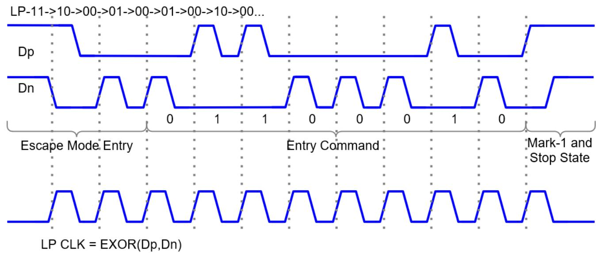  
图 6.39：Escape 模式下的 Trigger-Reset 命令

<table><tr><td>Escape 模式操作</td><td>命令类型</td><td>进入命令码型（从最先发送的位到最后发送的位）</td></tr><tr><td>低功耗数据传输（LPDT）</td><td>mode</td><td>11100001</td></tr><tr><td>超低功耗状态（ULPS）</td><td>mode</td><td>00011110</td></tr><tr><td>Reset-Trigger（复位触发）</td><td>Trigger</td><td>01100010</td></tr><tr><td>TE-Trigger（TE 触发）</td><td>Trigger</td><td>01011101</td></tr><tr><td>Acknowledge（应答）</td><td>Trigger</td><td>00100001</td></tr></table>

表 6.8：Escape 进入码

## 6.12 低功耗数据传输（LPDT）

如果在 Escape 模式进入过程之后跟随的是低功耗数据传输（LPDT）进入命令，则协议可以在 Lane 保持低功耗模式的情况下以低速传输数据。数据应使用与进入命令相同的 Spaced-One-Hot 编码在 Line 上编码。数据通过所采用的位编码自带时钟，不依赖 Clock Lane。在使用 LPDT 时，Lane 可以通过在 Line 上保持 Space 状态来暂停。Line 上的 Stop 状态会停止 LPDT、退出 Escape 模式，并将 Lane 切换到控制模式。Stop 状态之前的最后一个阶段应为 Mark-1 状态，它不表示数据位。LPDT 结束时，Lane 应返回 Stop 状态。

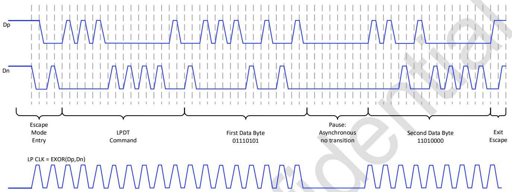  
图 6.40：两字节数据低功耗数据传输示例

## 6.13 超低功耗状态（ULPS）

如果在 Escape 模式进入命令之后发送超低功耗状态进入命令，则 Lane 应进入超低功耗状态（ULPS）。该命令应标记给接收侧协议。在此状态下，Line 处于 Space 状态（LP-00）。通过一个长度为 TWAKEUP 的 Mark-1 状态后接 Stop 状态即可退出超低功耗状态。

## 6.14 高速传输

## 6.14.1 突发有效载荷数据

突发的有效载荷数据应始终表示整数个有效载荷数据字节，最小长度为 1 字节。请注意，对于短突发，起始和结束开销所消耗的时间远多于有效载荷数据的实际传输时间。

PHY 不隐含最大字节数限制。然而，PHY 内部在 HS 数据突发期间没有自主的差错恢复机制，实际 BER 不会为零。因此，对于每种具体协议，都需要考虑最大突发长度的最佳选择。

## 6.14.2 传输开始（SoT）

在发送请求之后，Data Lane 离开 Stop 状态，并通过传输开始（SoT，Start-of-Transmission）过程为高速模式做准备。表 6.6 描述了 TX 侧和 RX 侧的事件序列。

<table><tr><td>TX 侧</td><td>RX 侧</td></tr><tr><td>驱动 Stop 状态（LP-11）</td><td>观察到 Stop 状态</td></tr><tr><td>驱动 HS-Rqst 状态（LP-01）持续 $T_{LPX}$ 时间</td><td>观察到 Line 上由 LP-11 到 LP-01 的转换</td></tr><tr><td>驱动 Bridge 状态（LP-00）持续 $T_{HS-PREPARE}$ 时间</td><td>观察到 Line 上由 LP-01 到 LP-00 的转换，在 $T_{D-TERM-EN}$ 时间后使能 Line 端接（Line Termination）</td></tr><tr><td>同时使能高速驱动器并禁用低功耗驱动器。</td><td></td></tr><tr><td>驱动 HS-0 持续 $T_{HS-ZERO}$ 时间</td><td>使能 HS-RX，并等待定时器 $T_{HS-SETTLE}$ 超时，以忽略转换效应</td></tr><tr><td></td><td>开始搜索 Leader-Sequence（前导序列）</td></tr><tr><td>从时钟上升沿开始插入 HS Sync-Sequence ‘00011101’</td><td></td></tr><tr><td></td><td>识别到 Leader Sequence ‘011101’ 后进行同步</td></tr><tr><td>继续发送高速有效载荷数据</td><td></td></tr><tr><td></td><td>接收有效载荷数据</td></tr></table>

表 6.9：传输开始序列

## 6.14.3 传输结束（EoT）

在数据突发结束时，Data Lane 通过传输结束（EoT，End-of-Transmission）过程离开高速传输模式并进入 Stop 状态。表 6.7 展示了 EoT 过程中可能的事件序列。注意，EoT 处理可由协议或由 D-PHY 完成。

<table><tr><td>TX 侧</td><td>RX 侧</td></tr><tr><td>完成有效载荷数据的发送</td><td>接收有效载荷数据</td></tr><tr><td>在最后一个有效载荷数据位之后立即翻转差分状态，并保持该状态 THS-TRAIL 时间</td><td></td></tr><tr><td>禁用 HS-TX、使能 LP-TX，并驱动 Stop 状态（LP-11）持续 THS-EXIT 时间</td><td>检测到 Line 离开 LP-00 状态并进入 Stop 状态（LP-11），并禁用端接</td></tr><tr><td></td><td>忽略最后一段 THS-SKIP 期间的位，以隐藏转换效应</td></tr><tr><td></td><td>检测有效数据中的最后一次转换，确定最后一个有效数据字节并跳过尾部序列</td></tr></table>

## 6.14.4 高速数据传输

图 6.41 展示了数据突发传输期间的事件序列。协议可以独立地为任意 Lane 启动和结束传输。然而，在大多数应用中，各 Lane 会同步启动，但由于每条 Lane 发送的字节数不等，可能在不同时刻结束。

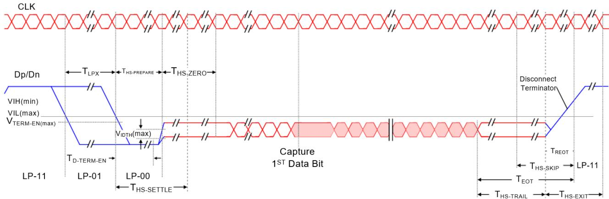  
图 6.41：突发方式的高速数据传输

## 6.14.5 高速时钟传输

在高速模式下，Clock Lane 从 Master 向 Slave 提供低摆幅、差分 DDR（半速率）时钟信号，用于高速数据传输。时钟信号应与正向 Data Lane 上翻转的位序列保持正交相位关系，且其上升沿位于突发中第一个发送位的中心。详细的时钟启动和停止过程如图 6.42 所示。

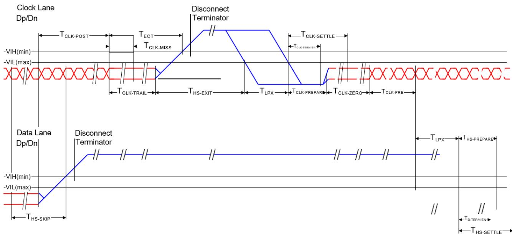  
图 6.42：Clock Lane 在时钟传输与低功耗模式之间的切换

## 6.15 系统电源状态

在 PHY 配置中，每条已上电并使能的 Lane 都可能具有三种不同的功耗水平：高速传输模式、低功耗模式和超低功耗状态。

## 6.16 初始化

上电后，当 Master PHY 驱动 Stop 状态（LP-11）的持续时间长于 TINIT 时，Slave 侧 PHY 应被初始化。第一个长于规定 TINIT 的 Stop 状态称为初始化周期。Master 侧应确保在 Master 完成初始化之前，Line 上不会出现长于 TINIT 的 Stop 状态。

TINIT 必须大于 500us。

## 6.17 全局操作流程图

图 6.43 展示了 Data Lane 模块的操作流程图。在 TX 和 RX 内部都可以区分出四个主要过程：高速传输、Escape 模式、Turnaround 和初始化。

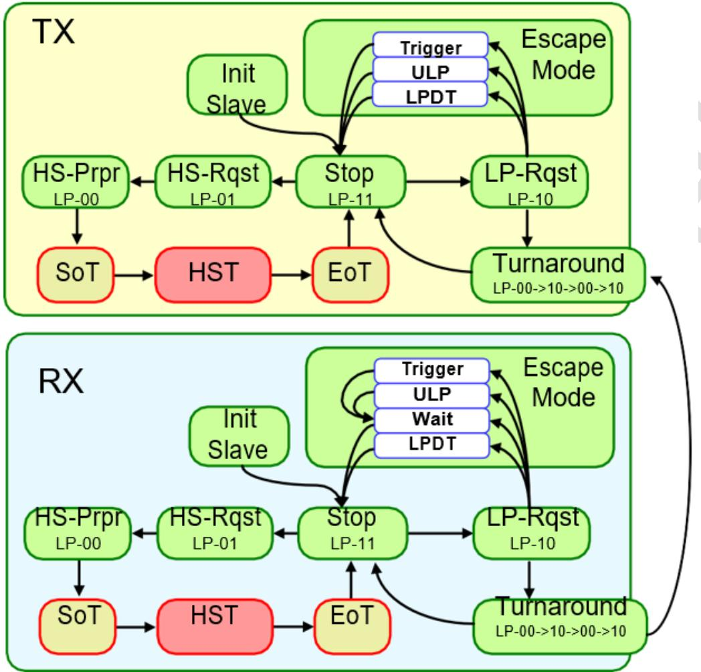  
图 6.43：Data Lane 模块状态图

图 6.44 展示了 Clock Lane 模块的状态图。Clock Lane 模块有四个主要工作状态：Init（时长未指定）、低功耗 Stop 状态、超低功耗状态和高速时钟传输。

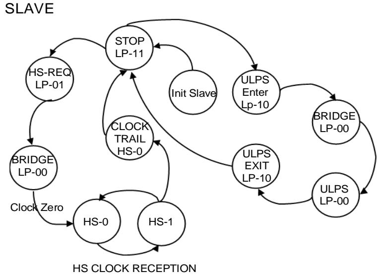  
图 6.44：Clock Lane 模块状态图

## 7 Gamma 特性校正功能

GX610 内置用于 1670 万色显示的 gamma 调整功能。Gamma 调整操作通过在 gamma 调整控制寄存器中首先确定 17 个灰阶电平来匹配 LCD 面板。这些寄存器对正极性和负极性均可用。

该模块由两条 gamma 电阻串组成，一条用于正极性，另一条用于负极性，每条包含 17 个 gamma 参考电压。VGM P/N (0, 4, 8, 12, 28, 52, 76, 100, 131, 155, 179, 203, 227, 243, 247, 251, 255)。

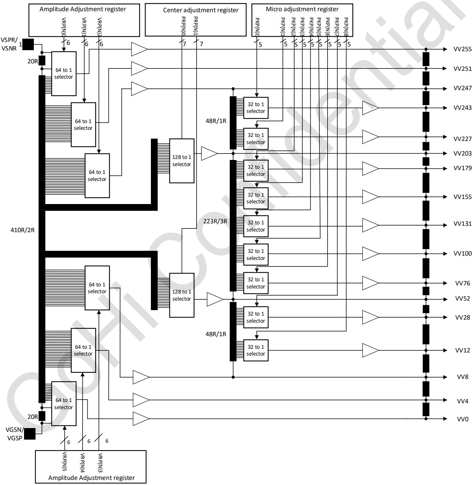

## 8 功能描述

## 8.1 数字 Gamma（独立 RGB gamma）TBD

## 8.2 BIST

## 8.2.1 BIST 功能

当 BIST 被触发为低电平时，GX610 将离开正常工作模式，并在没有 MIPI 输入信号的情况下开始向 LCD 面板生成 BIST 图案。

## 8.2.2 BIST 图案

我们支持 BIST 模式用于面板测试和调试。当 BIST 置为低电平时，可以随时停止图案。图案序列如下所列。

配置 reg\_bist\_pause[3:0]，可以显示不同的图案。

<table><tr><td>黑色=4&#x27;h0</td><td>白色=4&#x27;h1</td><td>红色=4&#x27;h2</td><td>绿色=4&#x27;h3</td></tr><tr><td></td><td></td><td></td><td></td></tr><tr><td>蓝色=4&#x27;h4</td><td>彩条=4&#x27;h5</td><td>帧边缘=4&#x27;h6</td><td>灰度 H=4&#x27;h7</td></tr><tr><td></td><td></td><td></td><td></td></tr><tr><td>灰度 V=4&#x27;h8</td><td>棋盘格=4&#x27;h9</td><td></td><td></td></tr></table>


## 9 命令

## 9.1 命令列表

9.1.1 标准命令
<table><tr><td>地址</td><td>操作码</td><td>R/W</td><td>D7</td><td>D6</td><td>D5</td><td>D4</td><td>D3</td><td>D2</td><td>D1</td><td>D0</td><td>功能</td></tr><tr><td>00</td><td>NOP</td><td>W</td><td>0</td><td>0</td><td>0</td><td>0</td><td>0</td><td>0</td><td>0</td><td>0</td><td>空操作</td></tr><tr><td>01</td><td>SWRESET</td><td>W</td><td>0</td><td>0</td><td>0</td><td>0</td><td>0</td><td>0</td><td>0</td><td>1</td><td>软件复位</td></tr><tr><td rowspan="4">04</td><td rowspan="4">RDDIDIF</td><td>W</td><td>0</td><td>0</td><td>0</td><td>0</td><td>0</td><td>1</td><td>0</td><td>0</td><td rowspan="4">读取显示屏识别信息</td></tr><tr><td>R</td><td colspan="8">ID1[7:0]</td></tr><tr><td>R</td><td colspan="8">ID2[7:0]</td></tr><tr><td>R</td><td colspan="8">ID3[7:0]</td></tr><tr><td>05</td><td>RDNUMED</td><td>R</td><td>Errover</td><td colspan="7">Err[6:0]</td><td>读取 DSI 上的错误数量</td></tr><tr><td rowspan="5">09</td><td rowspan="5">RDDST</td><td>W</td><td>0</td><td>0</td><td>0</td><td>0</td><td>1</td><td>0</td><td>0</td><td>1</td><td rowspan="4">读取显示状态</td></tr><tr><td>R</td><td colspan="8">D[31:24]</td></tr><tr><td>R</td><td colspan="8">D[23:16]</td></tr><tr><td>R</td><td colspan="8">D[15:8]</td></tr><tr><td>R</td><td colspan="8">D[7:0]</td><td></td></tr><tr><td rowspan="2">0A</td><td rowspan="2">RDDPM</td><td>W</td><td>0</td><td>0</td><td>0</td><td>0</td><td>1</td><td>0</td><td>1</td><td>0</td><td rowspan="2">读取显示电源模式</td></tr><tr><td>R</td><td>D7</td><td>D6</td><td>D5</td><td>D4</td><td>D3</td><td>D2</td><td>0</td><td>0</td></tr><tr><td rowspan="2">0B</td><td rowspan="2">RDDMADCTL</td><td>W</td><td>0</td><td>0</td><td>0</td><td>1</td><td>0</td><td>0</td><td>0</td><td>0</td><td rowspan="2">读取显示 MADCTL</td></tr><tr><td>R</td><td>D7</td><td>D6</td><td>D5</td><td>D4</td><td>D3</td><td>D2</td><td>D1</td><td>D0</td></tr><tr><td rowspan="2">0C</td><td rowspan="2">RDDCOLMOD</td><td>W</td><td>0</td><td>0</td><td>0</td><td>0</td><td>1</td><td>1</td><td>0</td><td>0</td><td rowspan="2">读取显示像素格式</td></tr><tr><td>R</td><td>0</td><td>D6</td><td>D5</td><td>D4</td><td>0</td><td>D2</td><td>D1</td><td>D0</td></tr><tr><td rowspan="2">0D</td><td rowspan="2">RDDIM</td><td>W</td><td>0</td><td>0</td><td>0</td><td>0</td><td>1</td><td>1</td><td>0</td><td>1</td><td rowspan="2">读取显示图像模式</td></tr><tr><td>R</td><td>D7</td><td>D6</td><td>D5</td><td>D4</td><td>D3</td><td>D2</td><td>D1</td><td>D0</td></tr><tr><td rowspan="2">0E</td><td rowspan="2">RDDSM</td><td>W</td><td>0</td><td>0</td><td>0</td><td>0</td><td>1</td><td>1</td><td>1</td><td>0</td><td rowspan="2">读取显示信号模式</td></tr><tr><td>R</td><td>D7</td><td>D6</td><td>D5</td><td>D4</td><td>D3</td><td>D2</td><td>D1</td><td>D0</td></tr><tr><td rowspan="2">0F</td><td>RDDSDR</td><td rowspan="2">R</td><td>0</td><td>0</td><td>0</td><td>0</td><td>1</td><td>1</td><td>1</td><td>1</td><td rowspan="2">读取显示自诊断结果</td></tr><tr><td>参数</td><td>0</td><td>0</td><td>0</td><td>0</td><td>0</td><td>0</td><td>0</td><td>Checksum_comp</td></tr><tr><td>10</td><td>SLPIN</td><td>W</td><td>0</td><td>0</td><td>0</td><td>1</td><td>0</td><td>0</td><td>0</td><td>0</td><td>睡眠进入</td></tr><tr><td>11</td><td>SLPOUT</td><td>W</td><td>0</td><td>0</td><td>0</td><td>1</td><td>0</td><td>0</td><td>0</td><td>1</td><td>睡眠退出</td></tr><tr><td>12</td><td>NOERON</td><td>W</td><td>0</td><td>0</td><td>0</td><td>1</td><td>0</td><td>0</td><td>1</td><td>1</td><td>部分显示模式开启</td></tr><tr><td>13</td><td>NORON</td><td>W</td><td>0</td><td>0</td><td>0</td><td>1</td><td>0</td><td>0</td><td>1</td><td>1</td><td>正常显示模式开启</td></tr><tr><td>20</td><td>INVOFF</td><td>W</td><td>0</td><td>0</td><td>1</td><td>0</td><td>0</td><td>0</td><td>0</td><td>0</td><td>显示反转关闭</td></tr><tr><td>21</td><td>INVON</td><td>W</td><td>0</td><td>0</td><td>1</td><td>0</td><td>0</td><td>0</td><td>0</td><td>1</td><td>显示反转开启</td></tr><tr><td>22</td><td>ALLPOFF</td><td>W</td><td>0</td><td>0</td><td>1</td><td>0</td><td>0</td><td>0</td><td>1</td><td>0</td><td>全部像素关闭</td></tr><tr><td>23</td><td>ALLPON</td><td>W</td><td>0</td><td>0</td><td>1</td><td>0</td><td>0</td><td>0</td><td>1</td><td>1</td><td>全部像素开启</td></tr><tr><td>26</td><td>GAMSET</td><td>W</td><td>-</td><td>-</td><td>-</td><td>-</td><td colspan="4">GC[3:0]</td><td>Gamma 设置</td></tr><tr><td>28</td><td>DISPOFF</td><td>W</td><td>0</td><td>0</td><td>1</td><td>0</td><td>1</td><td>0</td><td>0</td><td>0</td><td>显示关闭</td></tr><tr><td>29</td><td>DISPON</td><td>W</td><td>0</td><td>0</td><td>1</td><td>0</td><td>1</td><td>0</td><td>0</td><td>1</td><td>显示开启</td></tr><tr><td rowspan="5">2A</td><td rowspan="5">CASET</td><td rowspan="5">W/R</td><td>0</td><td>0</td><td>1</td><td>0</td><td>1</td><td>0</td><td>1</td><td>0</td><td rowspan="5">设置列起始地址</td></tr><tr><td colspan="6"></td><td colspan="2">SC[9:8]</td></tr><tr><td colspan="8">SC[7:0]</td></tr><tr><td colspan="6"></td><td colspan="2">SE[9:8]</td></tr><tr><td colspan="8">SE[7:0]</td></tr><tr><td rowspan="5">2B</td><td rowspan="5">RASET</td><td rowspan="5">W/R</td><td>0</td><td>0</td><td>1</td><td>0</td><td>1</td><td>0</td><td>1</td><td>0</td><td rowspan="5">设置行起始地址</td></tr><tr><td colspan="6"></td><td colspan="2">SP[9:8]</td></tr><tr><td colspan="8">SP[7:0]</td></tr><tr><td colspan="6"></td><td colspan="2">EP[9:8]</td></tr><tr><td colspan="8">EP[7:0]</td></tr><tr><td rowspan="4">2C</td><td rowspan="4">RAMWR</td><td rowspan="4">W</td><td>0</td><td>0</td><td>1</td><td>0</td><td>1</td><td>1</td><td>0</td><td>0</td><td rowspan="4">存储器开始写入</td></tr><tr><td>D17</td><td>D16</td><td>D15</td><td>D14</td><td>D13</td><td>D12</td><td>D11</td><td>D10</td></tr><tr><td colspan="8">...</td></tr><tr><td>DN7</td><td>DN6</td><td>DN5</td><td>DN4</td><td>DN3</td><td>DN2</td><td>DN1</td><td>DN0</td></tr><tr><td rowspan="5">30</td><td rowspan="5">PTLAR</td><td rowspan="5">W/R</td><td>0</td><td>0</td><td>1</td><td>1</td><td>0</td><td>0</td><td>0</td><td>0</td><td rowspan="5">设置垂直部分区域</td></tr><tr><td colspan="6"></td><td colspan="2">PSL[9:8]</td></tr><tr><td colspan="8">PSL[7:0]</td></tr><tr><td colspan="6"></td><td colspan="2">PEL[9:8]</td></tr><tr><td colspan="8">PEL[7:0]</td></tr><tr><td rowspan="5">31</td><td rowspan="5">PTLAR_H</td><td rowspan="5">W/R</td><td>0</td><td>0</td><td>1</td><td>1</td><td>0</td><td>0</td><td>0</td><td>1</td><td rowspan="5">设置水平部分区域</td></tr><tr><td colspan="6">-</td><td colspan="2">PSC[8]</td></tr><tr><td colspan="8">PSC[7:0]</td></tr><tr><td colspan="6">-</td><td colspan="2">PEC[8]</td></tr><tr><td colspan="8">PEC[7:0]</td></tr><tr><td>34</td><td>TEOFF</td><td>W</td><td>0</td><td>0</td><td>1</td><td>1</td><td>0</td><td>1</td><td>0</td><td>0</td><td>撕裂效应线关闭</td></tr><tr><td rowspan="2">35</td><td rowspan="2">TEON</td><td>W</td><td>0</td><td>0</td><td>1</td><td>1</td><td>0</td><td>1</td><td>0</td><td>1</td><td rowspan="2">撕裂效应线开启</td></tr><tr><td>W</td><td>X</td><td>X</td><td>X</td><td>X</td><td>X</td><td>X</td><td>X</td><td>M</td></tr><tr><td rowspan="2">36</td><td rowspan="2">MADCTL</td><td>W</td><td>0</td><td>0</td><td>1</td><td>1</td><td>0</td><td>1</td><td>1</td><td>0</td><td rowspan="2">存储器访问控制</td></tr><tr><td>W</td><td>MY</td><td>MX</td><td>X</td><td>X</td><td>BGR</td><td>-</td><td>LR</td><td>UD</td></tr><tr><td>38</td><td>IDMOFF</td><td>W</td><td>0</td><td>0</td><td>1</td><td>1</td><td>1</td><td>0</td><td>0</td><td>0</td><td>空闲模式关闭</td></tr><tr><td>39</td><td>IDMON</td><td>W</td><td>0</td><td>0</td><td>1</td><td>1</td><td>1</td><td>0</td><td>0</td><td>1</td><td>空闲模式开启</td></tr><tr><td rowspan="2">3A</td><td rowspan="2">COLMOD</td><td>W</td><td>0</td><td>0</td><td>1</td><td>1</td><td>1</td><td>0</td><td>1</td><td>0</td><td rowspan="2">接口像素格式，</td></tr><tr><td>W</td><td>X</td><td>D6</td><td>D5</td><td>D4</td><td>X</td><td>X</td><td>X</td><td>X</td></tr><tr><td>3C</td><td>RAMWR</td><td>W</td><td>0</td><td>0</td><td>1</td><td>1</td><td>1</td><td>1</td><td>0</td><td>0</td><td>存储器连续</td></tr><tr><td rowspan="3"></td><td rowspan="3"></td><td rowspan="3"></td><td> $D_{1}7$ </td><td> $D_{1}6$ </td><td> $D_{1}5$ </td><td> $D_{1}4$ </td><td> $D_{1}3$ </td><td> $D_{1}2$ </td><td> $D_{1}1$ </td><td> $D_{1}0$ </td><td rowspan="3">写入</td></tr><tr><td colspan="8">...</td></tr><tr><td> $D_{N}7$ </td><td> $D_{N}6$ </td><td> $D_{N}5$ </td><td> $D_{N}4$ </td><td> $D_{N}3$ </td><td> $D_{N}2$ </td><td> $D_{N}1$ </td><td> $D_{N}0$ </td></tr><tr><td rowspan="3">44</td><td rowspan="3">TESL</td><td>W</td><td>0</td><td>1</td><td>0</td><td>0</td><td>0</td><td>1</td><td>0</td><td>0</td><td rowspan="3">设置撕裂效应扫描行</td></tr><tr><td>W</td><td colspan="8">TELINE[15:8]</td></tr><tr><td>W</td><td colspan="8">TELINE[7:0]</td></tr><tr><td rowspan="3">45</td><td rowspan="3">GETSCAN</td><td>W</td><td>0</td><td>1</td><td>0</td><td>0</td><td>0</td><td>1</td><td>0</td><td>1</td><td rowspan="3">返回当前扫描行</td></tr><tr><td>R</td><td colspan="8">SLN[15:8]</td></tr><tr><td>R</td><td colspan="8">SLN[7:0]</td></tr><tr><td>4F</td><td></td><td></td><td colspan="8"></td><td></td></tr><tr><td rowspan="2">51</td><td rowspan="2">WRDISBV</td><td>W</td><td>0</td><td>1</td><td>0</td><td>1</td><td>0</td><td>0</td><td>0</td><td>1</td><td rowspan="2">写入显示亮度</td></tr><tr><td>W</td><td colspan="8">DBV[7:0]</td></tr><tr><td rowspan="2">52</td><td rowspan="2">RDDISBV</td><td>W</td><td>0</td><td>1</td><td>0</td><td>1</td><td>0</td><td>0</td><td>1</td><td>0</td><td rowspan="2">读取显示亮度值</td></tr><tr><td>R</td><td colspan="8">DBV[7:0]</td></tr><tr><td rowspan="2">53</td><td rowspan="2">WRCTRLD</td><td>W</td><td>0</td><td>1</td><td>0</td><td>1</td><td>0</td><td>0</td><td>1</td><td>1</td><td rowspan="2">写入 CTRL 显示</td></tr><tr><td>W</td><td>X</td><td>X</td><td>BCTRL</td><td>X</td><td>DD</td><td>BL</td><td>X</td><td>X</td></tr><tr><td rowspan="2">54</td><td rowspan="2">RDCTRLD</td><td>W</td><td>0</td><td>1</td><td>0</td><td>1</td><td>0</td><td>0</td><td>1</td><td>1</td><td rowspan="2">读取控制值显示-</td></tr><tr><td>R</td><td>X</td><td>X</td><td>BCTRL</td><td>0</td><td>DD</td><td>BL</td><td>0</td><td>0</td></tr><tr><td rowspan="2">55</td><td rowspan="2">WRCABC</td><td rowspan="2">w</td><td>0</td><td>1</td><td>0</td><td>1</td><td>0</td><td>1</td><td>0</td><td>1</td><td rowspan="2">写入 CABC 模式</td></tr><tr><td>-</td><td>-</td><td>-</td><td>-</td><td>-</td><td>-</td><td>-</td><td>-</td></tr><tr><td rowspan="3">56</td><td rowspan="3">RDCABC</td><td rowspan="3">R</td><td>0</td><td>1</td><td>0</td><td>1</td><td>0</td><td>1</td><td>1</td><td>0</td><td rowspan="3">读取 CABC 模式</td></tr><tr><td>-</td><td>-</td><td>-</td><td>-</td><td>-</td><td>-</td><td>-</td><td>-</td></tr><tr><td>-</td><td>-</td><td>-</td><td>-</td><td>-</td><td>-</td><td>C1</td><td>C0</td></tr><tr><td rowspan="2">5E</td><td rowspan="2">WRCABCMB</td><td>W</td><td>D7</td><td>D6</td><td>D5</td><td>D4</td><td>D3</td><td>D2</td><td>D1</td><td>D0</td><td rowspan="2">写入 CABC 最低亮度</td></tr><tr><td>R</td><td>0</td><td>1</td><td>0</td><td>1</td><td>1</td><td>1</td><td>1</td><td>0</td></tr><tr><td rowspan="2">5F</td><td rowspan="2">RDCABCMB</td><td>W</td><td>D7</td><td>D6</td><td>D5</td><td>D4</td><td>D3</td><td>D2</td><td>D1</td><td>D0</td><td rowspan="2">（读取 CABC 最低亮度</td></tr><tr><td>R</td><td>0</td><td>1</td><td>0</td><td>1</td><td>1</td><td>1</td><td>1</td><td>1</td></tr><tr><td rowspan="4">A1</td><td rowspan="4">RDDDB</td><td>W</td><td>1</td><td>0</td><td>1</td><td>0</td><td>0</td><td>0</td><td>0</td><td>1</td><td rowspan="4">读取 DDB 起始</td></tr><tr><td>R</td><td>X</td><td>X</td><td>X</td><td>X</td><td>X</td><td>X</td><td>X</td><td>X</td></tr><tr><td>R</td><td>X</td><td>X</td><td>X</td><td>X</td><td>X</td><td>X</td><td>X</td><td>X</td></tr><tr><td>R</td><td>X</td><td>X</td><td>X</td><td>X</td><td>X</td><td>X</td><td>X</td><td>X</td></tr><tr><td rowspan="4">A8</td><td rowspan="4">RDDBCON</td><td>W</td><td>1</td><td>0</td><td>1</td><td>0</td><td>1</td><td>0</td><td>0</td><td>0</td><td rowspan="4">读取 DDB 继续</td></tr><tr><td>R</td><td>X</td><td>X</td><td>X</td><td>X</td><td>X</td><td>X</td><td>X</td><td>X</td></tr><tr><td>R</td><td>X</td><td>X</td><td>X</td><td>X</td><td>X</td><td>X</td><td>X</td><td>X</td></tr><tr><td>R</td><td>X</td><td>X</td><td>X</td><td>X</td><td>X</td><td>X</td><td>X</td><td>X</td></tr><tr><td rowspan="2">C2</td><td rowspan="2">RDCCS</td><td rowspan="2">W</td><td>1</td><td>1</td><td>0</td><td>0</td><td>0</td><td>0</td><td>1</td><td>0</td><td rowspan="2">设置显示模式</td></tr><tr><td></td><td></td><td></td><td></td><td>RM_B</td><td></td><td colspan="2">DM[1:0]</td></tr><tr><td rowspan="2">C4</td><td rowspan="2">RDDCCS</td><td rowspan="2">W/R</td><td>1</td><td>1</td><td>0</td><td>0</td><td>0</td><td>1</td><td>0</td><td>0</td><td rowspan="2">设置双 SPI 模式</td></tr><tr><td>SPI_WR AM</td><td>0</td><td colspan="2">DSPI_CEG[1:0]</td><td>0</td><td>0</td><td>Dual_single_DCX</td><td>DSPI_EN</td></tr><tr><td rowspan="2">DA</td><td rowspan="2">RDID1</td><td>W</td><td>1</td><td>1</td><td>0</td><td>1</td><td>1</td><td>0</td><td>1</td><td>0</td><td rowspan="2">读取 ID4</td></tr><tr><td>R</td><td colspan="8">RDID4</td></tr><tr><td rowspan="2">DB</td><td rowspan="2">RDID2</td><td>W</td><td>1</td><td>1</td><td>0</td><td>1</td><td>1</td><td>0</td><td>1</td><td>1</td><td rowspan="2">读取 ID5</td></tr><tr><td>R</td><td colspan="8">RDID5</td></tr><tr><td rowspan="2">DC</td><td rowspan="2">RDDI3</td><td>W</td><td>1</td><td>1</td><td>0</td><td>1</td><td>1</td><td>1</td><td>0</td><td>0</td><td rowspan="2">读取 ID3</td></tr><tr><td>R</td><td colspan="8">LCD module/driver ID[7:0]</td></tr><tr><td rowspan="2">DC</td><td rowspan="2">RDID3</td><td>W</td><td>1</td><td>1</td><td>0</td><td>1</td><td>1</td><td>1</td><td>0</td><td>0</td><td rowspan="2">读取 ID6</td></tr><tr><td>R</td><td colspan="8">RDID6</td></tr><tr><td rowspan="10">A1</td><td rowspan="10">RDDDB</td><td>W</td><td>1</td><td>0</td><td>1</td><td>0</td><td>0</td><td>0</td><td>0</td><td>1</td><td rowspan="10">从指定位置读取 DDB。</td></tr><tr><td>R</td><td>x</td><td>x</td><td>x</td><td>x</td><td>x</td><td>x</td><td>x</td><td>x</td></tr><tr><td>R</td><td>x</td><td>x</td><td>x</td><td>x</td><td>x</td><td>x</td><td>x</td><td>x</td></tr><tr><td>R</td><td>x</td><td>x</td><td>x</td><td>x</td><td>x</td><td>x</td><td>x</td><td>x</td></tr><tr><td>R</td><td>x</td><td>x</td><td>x</td><td>x</td><td>x</td><td>x</td><td>x</td><td>x</td></tr><tr><td>R</td><td>x</td><td>x</td><td>x</td><td>x</td><td>x</td><td>x</td><td>x</td><td>x</td></tr><tr><td>R</td><td>X</td><td>x</td><td>x</td><td>x</td><td>x</td><td>x</td><td>x</td><td>x</td></tr><tr><td>R</td><td>x</td><td>x</td><td>x</td><td>x</td><td>x</td><td>x</td><td>x</td><td>x</td></tr><tr><td>R</td><td>x</td><td>x</td><td>x</td><td>x</td><td>x</td><td>x</td><td>x</td><td>x</td></tr><tr><td>R</td><td>x</td><td>x</td><td>x</td><td>x</td><td>x</td><td>x</td><td>x</td><td>x</td></tr><tr><td rowspan="8">A8</td><td rowspan="8">RDDDBCON</td><td>W</td><td>1</td><td>0</td><td>1</td><td>0</td><td>1</td><td>0</td><td>0</td><td>0</td><td rowspan="8">从上次读取位置继续读取 DDB。</td></tr><tr><td>R</td><td>x</td><td>x</td><td>x</td><td>x</td><td>x</td><td>x</td><td>x</td><td>x</td></tr><tr><td>R</td><td>x</td><td>x</td><td>x</td><td>x</td><td>x</td><td>x</td><td>x</td><td>x</td></tr><tr><td>R</td><td>x</td><td>x</td><td>x</td><td>x</td><td>x</td><td>x</td><td>x</td><td>x</td></tr><tr><td>R</td><td>x</td><td>x</td><td>x</td><td>x</td><td>x</td><td>x</td><td>x</td><td>x</td></tr><tr><td>LRR</td><td>x</td><td>x</td><td>x</td><td>x</td><td>x</td><td>x</td><td>x</td><td>x</td></tr><tr><td>R</td><td>x</td><td>x</td><td>x</td><td>x</td><td>x</td><td>x</td><td>x</td><td>x</td></tr><tr><td>R</td><td>x</td><td>x</td><td>x</td><td>x</td><td>x</td><td>x</td><td>x</td><td>x</td></tr></table>

9.1.2 标准命令可访问性

<table><tr><td>十六进制代码</td><td>操作码</td><td>正常模式开，空闲模式关，睡眠模式关</td><td>正常模式开，空闲模式开，睡眠模式关</td><td>部分模式开，空闲模式关，睡眠模式关</td><td>部分模式开，空闲模式开，睡眠模式关</td><td>睡眠模式开</td></tr><tr><td>00</td><td>NOP</td><td>是</td><td>是</td><td>是</td><td>是</td><td>是</td></tr><tr><td>01</td><td>SWRESET</td><td>是</td><td>是</td><td>是</td><td>是</td><td>是</td></tr><tr><td>04</td><td>RDDIDIF</td><td>是</td><td>是</td><td>是</td><td>是</td><td>是</td></tr><tr><td>09</td><td>RDDST</td><td>是</td><td>是</td><td>是</td><td>是</td><td>是</td></tr><tr><td>0A</td><td>RDDPM</td><td>是</td><td>是</td><td>是</td><td>是</td><td>是</td></tr><tr><td>0B</td><td>RDDMADCTL</td><td>是</td><td>是</td><td>是</td><td>是</td><td>是</td></tr><tr><td>0C</td><td>RDDCOLMOD</td><td>是</td><td>是</td><td>是</td><td>是</td><td>是</td></tr><tr><td>0D</td><td>RDDIM</td><td>是</td><td>是</td><td>是</td><td>是</td><td>是</td></tr><tr><td>0E</td><td>RDDSM</td><td>是</td><td>是</td><td>是</td><td>是</td><td>是</td></tr><tr><td>10</td><td>SLPIN</td><td>是</td><td>是</td><td>是</td><td>是</td><td>是</td></tr><tr><td>11</td><td>SLPOUT</td><td>是</td><td>是</td><td>N/A</td><td>N/A</td><td>是</td></tr><tr><td>20</td><td>INVOFF</td><td>是</td><td>是</td><td>是</td><td>是</td><td>是</td></tr><tr><td>21</td><td>INVON</td><td>是</td><td>是</td><td>是</td><td>是</td><td>是</td></tr><tr><td>22</td><td>ALLPOFF</td><td>是</td><td>是</td><td>是</td><td>是</td><td>是</td></tr><tr><td>23</td><td>ALLPON</td><td>是</td><td>是</td><td>是</td><td>是</td><td>是</td></tr><tr><td>28</td><td>DISPOFF</td><td>是</td><td>是</td><td>是</td><td>是</td><td>是</td></tr><tr><td>29</td><td>DISPON</td><td>是</td><td>是</td><td>是</td><td>是</td><td>是</td></tr><tr><td>34</td><td>TEOFF</td><td>是</td><td>是</td><td>是</td><td>是</td><td>是</td></tr><tr><td>35</td><td>TEON</td><td>是</td><td>是</td><td>是</td><td>是</td><td>是</td></tr><tr><td>36</td><td>MADCTL</td><td>是</td><td>是</td><td>是</td><td>是</td><td>是</td></tr><tr><td>38</td><td>IDMOFF</td><td>是</td><td>是</td><td>是</td><td>是</td><td>是</td></tr><tr><td>39</td><td>IDMON</td><td>是</td><td>是</td><td>是</td><td>是</td><td>是</td></tr><tr><td>3A</td><td>COLMOD</td><td>是</td><td>是</td><td>是</td><td>是</td><td>是</td></tr><tr><td>44</td><td>TESL</td><td>是</td><td>是</td><td>是</td><td>是</td><td>是</td></tr><tr><td>45</td><td>GETSCAN</td><td>是</td><td>是</td><td>是</td><td>是</td><td>是</td></tr><tr><td>51</td><td>WRDISBV</td><td>是</td><td>是</td><td>是</td><td>是</td><td>是</td></tr><tr><td>52</td><td>RDDISBV</td><td>是</td><td>是</td><td>是</td><td>是</td><td>是</td></tr><tr><td>53</td><td>WRCTRLD</td><td>是</td><td>是</td><td>是</td><td>是</td><td>是</td></tr><tr><td>54</td><td>RDCTRLD</td><td>是</td><td>是</td><td>是</td><td>是</td><td>是</td></tr><tr><td>55</td><td>WRCABC</td><td>是</td><td>是</td><td>是</td><td>是</td><td>是</td></tr><tr><td>56</td><td>RDCABC</td><td>是</td><td>是</td><td>是</td><td>是</td><td>是</td></tr><tr><td>5e</td><td>WRCABCMB</td><td>是</td><td>是</td><td>是</td><td>是</td><td>是</td></tr><tr><td>5f</td><td>RDCABCMB</td><td>是</td><td>是</td><td>是</td><td>是</td><td>是</td></tr><tr><td>DA</td><td>RDID1</td><td>是</td><td>是</td><td>是</td><td>是</td><td>是</td></tr><tr><td>DB</td><td>RDID2</td><td>是</td><td>是</td><td>是</td><td>是</td><td>是</td></tr><tr><td>DC</td><td>RDID3</td><td>是</td><td>是</td><td>是</td><td>是</td><td>是</td></tr><tr><td>A1</td><td>RDDDB</td><td>是</td><td>是</td><td>是</td><td>是</td><td>是</td></tr><tr><td>A8</td><td>RDDDBCON</td><td>是</td><td>是</td><td>是</td><td>是</td><td>是</td></tr></table>

9.1.3 标准命令的默认模式与默认值

<table><tr><td>十六进制代码</td><td>操作码</td><td>参数</td><td>上电时序</td><td>软复位</td><td>硬复位</td></tr><tr><td>00</td><td>NOP</td><td>无</td><td>N/A</td><td>N/A</td><td>N/A</td></tr><tr><td>01</td><td>SWRESET</td><td>无</td><td>N/A</td><td>N/A</td><td>N/A</td></tr><tr><td>04</td><td>RDDIDIF</td><td>3</td><td>OTP 值</td><td>OTP 值</td><td>OTP 值</td></tr><tr><td>09</td><td>RDDST</td><td>1</td><td>参见相应命令参数</td><td>参见相应命令参数</td><td>参见相应命令参数</td></tr><tr><td>0A</td><td>RDDPM</td><td>1</td><td>08h</td><td>08h</td><td>08h</td></tr><tr><td>0B</td><td>RDDMADCTL</td><td>1</td><td>00h</td><td>参见相应命令参数</td><td>00h</td></tr><tr><td>0C</td><td>RDDCOLMOD</td><td>1</td><td>07h</td><td>07h</td><td>07h</td></tr><tr><td>0D</td><td>RDDIM</td><td>1</td><td>00h</td><td>00h</td><td>00h</td></tr><tr><td>0E</td><td>RDDSM</td><td>1</td><td>00h</td><td>00h</td><td>00h</td></tr><tr><td>10</td><td>SLPIN</td><td>无</td><td>睡眠进入模式</td><td>睡眠进入模式</td><td>睡眠进入模式</td></tr><tr><td>11</td><td>SLPOUT</td><td>无</td><td>睡眠进入模式</td><td>睡眠进入模式</td><td>睡眠进入模式</td></tr><tr><td>20</td><td>INVOFF</td><td>无</td><td>显示反转关闭</td><td>显示反转关闭</td><td>显示反转关闭</td></tr><tr><td>21</td><td>INVON</td><td>无</td><td>显示反转关闭</td><td>显示反转关闭</td><td>显示反转关闭</td></tr><tr><td>22</td><td>ALLPOFF</td><td>无</td><td>全像素关闭</td><td>全像素关闭</td><td>全像素关闭</td></tr><tr><td>23</td><td>ALLPON</td><td>无</td><td>全像素关闭</td><td>全像素关闭</td><td>全像素关闭</td></tr><tr><td>28</td><td>DISPOFF</td><td>无</td><td>显示关闭</td><td>显示关闭</td><td>显示关闭</td></tr><tr><td>29</td><td>DISPON</td><td>无</td><td>显示关闭</td><td>显示关闭</td><td>显示关闭</td></tr><tr><td>34</td><td>TEOFF</td><td>无</td><td>TE 关闭</td><td>TE 关闭</td><td>TE 关闭</td></tr><tr><td>35</td><td>TEON</td><td>1</td><td>TE 关闭</td><td>TE 关闭</td><td>TE 关闭</td></tr><tr><td>36</td><td>MADCTL</td><td>1</td><td>00h</td><td>无变化</td><td>00h</td></tr><tr><td>38</td><td>IDMOFF</td><td>无</td><td>空闲模式关闭</td><td>空闲模式关闭</td><td>空闲模式关闭</td></tr><tr><td>39</td><td>IDMON</td><td>无</td><td>空闲模式关闭</td><td>空闲模式关闭</td><td>空闲模式关闭</td></tr><tr><td>3A</td><td>COLMOD</td><td>1</td><td>07h</td><td>无变化</td><td>07h</td></tr><tr><td>44</td><td>TESL</td><td>2</td><td>0000h</td><td>0000h</td><td>0000h</td></tr><tr><td>45</td><td>GETSCAN</td><td>2</td><td>0000h</td><td>0000h</td><td>0000h</td></tr><tr><td>51</td><td>WRDISBV</td><td>1</td><td>00h</td><td>00h</td><td>00h</td></tr><tr><td>52</td><td>RDDISB</td><td>1</td><td>00h</td><td>00h</td><td>00h</td></tr><tr><td>53</td><td>WRCTRLD</td><td>1</td><td>00h</td><td>00h</td><td>00h</td></tr><tr><td>54</td><td>RDCTRLD</td><td>1</td><td>00h</td><td>00h</td><td>00h</td></tr><tr><td>55</td><td>WRCABC</td><td>1</td><td>00h</td><td>00h</td><td>00h</td></tr><tr><td>56</td><td>RDCABC</td><td>1</td><td>00h</td><td>00h</td><td>00h</td></tr><tr><td>5e</td><td>WRCABCMB</td><td>1</td><td>00h</td><td>00h</td><td>00h</td></tr><tr><td>5f</td><td>RDCABCMB</td><td>1</td><td>00h</td><td>00h</td><td>00h</td></tr><tr><td>DA</td><td>RDID1</td><td>1</td><td>OTP 值</td><td>OTP 值</td><td>OTP 值</td></tr><tr><td>DB</td><td>RDID2</td><td>1</td><td>OTP 值</td><td>OTP 值</td><td>OTP 值</td></tr><tr><td>DC</td><td>RDID3</td><td>1</td><td>OTP 值</td><td>OTP 值</td><td>OTP 值</td></tr><tr><td>A1</td><td>RDDDB</td><td>全部</td><td>OTP 值</td><td>OTP 值</td><td>OTP 值</td></tr><tr><td>A8</td><td>RDDDBCON</td><td>全部</td><td>OTP 值</td><td>OTP 值</td><td>OTP 值</td></tr></table>

## 9.2 命令说明

## 9.2.1 NoP (00h)

<table><tr><td>CMD/PAs</td><td>R/W</td><td>D7</td><td>D6</td><td>D5</td><td>D4</td><td>D3</td><td>D2</td><td>D1</td><td>D0</td><td>HEX</td></tr><tr><td>命令</td><td>W</td><td>0</td><td>0</td><td>0</td><td>0</td><td>0</td><td>0</td><td>0</td><td>0</td><td>00</td></tr><tr><td>描述</td><td colspan="10">该命令对显示模块没有任何影响。NOP 命令可用于终止帧存储器读（Frame Memory Read）或帧存储器写（Frame Memory Write）。</td></tr><tr><td>限制</td><td colspan="10">-</td></tr><tr><td>流程图</td><td colspan="10">-</td></tr></table>

## 9.2.2 SWRESET：软件复位（Software Reset）(01h)

<table><tr><td>CMD/PAs</td><td>R/W</td><td>D7</td><td>D6</td><td>D5</td><td>D4</td><td>D3</td><td>D2</td><td>D1</td><td>D0</td><td>HEX</td></tr><tr><td>命令</td><td>W</td><td>0</td><td>0</td><td>0</td><td>0</td><td>0</td><td>0</td><td>0</td><td>1</td><td>01</td></tr><tr><td>描述</td><td colspan="10">显示模块执行软件复位。寄存器被写入其软复位默认值。帧存储器内容不受该命令影响</td></tr><tr><td>限制</td><td colspan="10">在该命令之后，主机处理器必须等待 5 毫秒才能向显示模块发送任何新命令。显示模块在此期间更新寄存器。若在显示模块处于 SLPIN 模式时发送 SWRESET，则主机处理器必须等待 120 毫秒后才能发送 SLPOUT 命令。当显示模块未处于 SLPIN 模式时，不应发送 SWRESET。</td></tr><tr><td>流程图</td><td colspan="10"></td></tr></table>

9.2.3 RDDIDIF：读取显示识别信息（Read Display Identification Information）(04h)

<table><tr><td>CMD/PAs</td><td>R/W</td><td>D7</td><td>D6</td><td>D5</td><td>D4</td><td>D3</td><td>D2</td><td>D1</td><td>D0</td><td>HEX</td></tr><tr><td>命令</td><td>W</td><td>0</td><td>0</td><td>0</td><td>0</td><td>0</td><td>1</td><td>0</td><td>0</td><td>04</td></tr><tr><td>参数 1</td><td>R</td><td colspan="8">ID1[7:0]</td><td></td></tr><tr><td>参数 2</td><td>R</td><td colspan="8">ID2[7:0]</td><td></td></tr><tr><td>参数 3</td><td>R</td><td colspan="8">ID3[7:0]</td><td></td></tr><tr><td rowspan="9">描述</td><td colspan="10">该读取字节返回 24 位显示识别信息。第 $1^{st}$ 个参数标识 LCD 模块的制造商。它由显示器供应商指定，对于 xx 定义为 xxHEX。第 $2^{nd}$ 个参数有 2 个用途。Bit7（MSB）定义面板类型。0=驱动器（Driver，STN 黑白），1=模块（Module，彩色）。Bits 6~0 用于跟踪 LCD 模块/驱动器的版本。它由显示器供应商定义，每当对显示器、材料或结构规格进行修订时都会改变。参见下表：</td></tr><tr><td colspan="4">ID 字节值 V[7:0]</td><td>版本</td><td colspan="5">变更</td></tr><tr><td colspan="4">80h</td><td></td><td colspan="5"></td></tr><tr><td colspan="4">81h</td><td></td><td colspan="5"></td></tr><tr><td colspan="4">82h</td><td></td><td colspan="5"></td></tr><tr><td colspan="4">83h</td><td></td><td colspan="5"></td></tr><tr><td colspan="4">84h</td><td></td><td colspan="5"></td></tr><tr><td colspan="4">85h</td><td></td><td colspan="5"></td></tr><tr><td colspan="10">第 $3^{rd}$ 个参数标识 LCD 模块/驱动器。它由显示器供应商指定，对于该 LCD 项目模块定义为 xxHEX。</td></tr><tr><td>限制</td><td colspan="10">-</td></tr><tr><td>流程图</td><td colspan="10"></td></tr></table>

9.2.4 RDNUMED：读取 DSI 上的错误数量（Read Number of Errors on DSI）(05h)

<table><tr><td>05H</td><td colspan="12">RDNUMED</td></tr><tr><td rowspan="2">指令/参数</td><td rowspan="2">R/W</td><td colspan="2">地址</td><td rowspan="2">D15-8</td><td rowspan="2">D7</td><td rowspan="2">D6</td><td rowspan="2">D5</td><td rowspan="2">D4</td><td rowspan="2">D3</td><td rowspan="2">D2</td><td rowspan="2">D1</td><td rowspan="2">D0</td></tr><tr><td>其他</td><td>SPI-16</td></tr><tr><td>RDNUMED</td><td>R</td><td>05h</td><td>X</td><td>X</td><td>Errover</td><td colspan="7">Err[6:0]</td></tr><tr><td>描述</td><td colspan="12">第一个参数表示 DSI 上的奇偶校验错误数量。各位的更详细说明如下。Err[6:0] 位表示奇偶校验错误的数量。如果 P[6..0] 位发生溢出，Errover 被置为 &quot;1&quot;。该命令仅用于 MIPI DSI。对其他接口操作无功能。</td></tr><tr><td>限制</td><td colspan="12">-</td></tr><tr><td rowspan="6">寄存器可用性</td><td colspan="5">状态</td><td colspan="7">可用性</td></tr><tr><td colspan="5">正常模式开，空闲模式关，睡眠退出</td><td colspan="7">是</td></tr><tr><td colspan="5">正常模式开，空闲模式开，睡眠退出</td><td colspan="7">是</td></tr><tr><td colspan="5">部分模式开，空闲模式关，睡眠退出</td><td colspan="7">是</td></tr><tr><td colspan="5">部分模式开，空闲模式开，睡眠退出</td><td colspan="7">是</td></tr><tr><td colspan="5">睡眠进入</td><td colspan="7">是</td></tr><tr><td rowspan="5">默认值</td><td rowspan="2" colspan="3">状态</td><td colspan="9">默认值</td></tr><tr><td colspan="3">Errover</td><td colspan="6">Err[6:0]</td></tr><tr><td colspan="3">上电时序</td><td colspan="3">0</td><td colspan="6">000-0000</td></tr><tr><td colspan="3">软复位</td><td colspan="3">0</td><td colspan="6">000-0000</td></tr><tr><td colspan="3">硬复位</td><td colspan="3">0</td><td colspan="6">000-0000</td></tr><tr><td>流程图</td><td colspan="8">RDNUMED(05h)主机驱动器发送第 1 个参数图例RDNUMED(05h)参数显示动作模式顺序传送</td><td colspan="4"></td></tr></table>

9.2.5 RDDST：读取显示状态（Read Display Status）(09h)
<table><tr><td>CMD/PAs</td><td>R/W</td><td>D7</td><td>D6</td><td>D5</td><td>D4</td><td>D3</td><td>D2</td><td>D1</td><td>D0</td><td>HEX</td></tr><tr><td>指令</td><td>W</td><td>0</td><td>0</td><td>0</td><td>0</td><td>1</td><td>0</td><td>0</td><td>1</td><td>09</td></tr><tr><td>参数 1</td><td>R</td><td colspan="8">D[31:24]</td><td></td></tr><tr><td>参数 2</td><td>R</td><td colspan="8">D[23:16]</td><td></td></tr><tr><td>参数 3</td><td>R</td><td colspan="8">D[15:8]</td><td></td></tr><tr><td>参数 4</td><td>R</td><td colspan="8">D[7:0]</td><td></td></tr><tr><td rowspan="30">描述</td><td colspan="10">该命令用于指示显示的当前状态，具体如下表所述：</td></tr><tr><td>位</td><td colspan="2">描述</td><td colspan="7">值</td></tr><tr><td>D31</td><td colspan="2">升压（Booster）电压状态</td><td colspan="7">‘0’ = 升压关闭。‘1’ = 升压开启。</td></tr><tr><td>D30</td><td colspan="2">页地址顺序</td><td colspan="7">‘0’ = 从上到下（MADCTL B7=‘0’）。‘1’ = 从下到上（MADCTL B7=‘1’）。</td></tr><tr><td>D29</td><td colspan="2">列地址顺序</td><td colspan="7">‘0’ = 从左到右（MADCTL B6=‘0’）。‘1’ = 从右到左（MADCTL B6=‘1’）</td></tr><tr><td>D28</td><td colspan="2">页/列顺序</td><td colspan="7">‘0’ = 正常（MADCTL B5=‘0’）。‘1’ = 旋转（MADCTL B5=‘1’）。</td></tr><tr><td>D27</td><td colspan="2">显示器件行刷新顺序</td><td colspan="7">‘0’ = 从上到下刷新（MADCTL B4=‘0’）。‘1’ = 从下到上刷新（MADCTL B4=‘1’）。</td></tr><tr><td>D26</td><td colspan="2">RGB/BGR 顺序</td><td colspan="7">‘0’ = RGB（MADCTL B3=‘0’）。‘1’ = BGR（MADCTL B3=‘1’）。</td></tr><tr><td>D25</td><td colspan="2">显示数据锁存数据顺序</td><td colspan="7">‘0’ = 从左到右刷新（MADCTL B2=‘0’）。‘1’ = 从右到左刷新（MADCTL B2=‘1’）。</td></tr><tr><td>D24</td><td colspan="2">源极扫描顺序</td><td colspan="7">‘0’ = 源极输出从左到右（MADCTL B1=‘0’）。‘1’ = 源极输出从右到左（MADCTL B1=‘1’）</td></tr><tr><td>D23</td><td colspan="2">栅极扫描顺序</td><td colspan="7">‘0’ = 栅极输出从上到下（MADCTL B0=‘0’）。‘1’ = 栅极输出从下到上（MADCTL B0=‘1’）</td></tr><tr><td rowspan="3">D22</td><td colspan="2" rowspan="9">接口色彩像素格式定义</td><td rowspan="9"></td><td colspan="2">接口格式</td><td>D22</td><td>D21</td><td>D20</td><td rowspan="9"></td></tr><tr><td colspan="2">未定义</td><td>0</td><td>0</td><td>0</td></tr><tr><td colspan="2">未定义</td><td>0</td><td>0</td><td>1</td></tr><tr><td rowspan="3">D21</td><td colspan="2">未定义</td><td>0</td><td>1</td><td>0</td></tr><tr><td colspan="2">未定义</td><td>0</td><td>1</td><td>1</td></tr><tr><td colspan="2">未定义</td><td>1</td><td>0</td><td>0</td></tr><tr><td rowspan="3">D20</td><td colspan="2">16 位/像素</td><td>1</td><td>0</td><td>1</td></tr><tr><td colspan="2">18 位/像素</td><td>1</td><td>1</td><td>0</td></tr><tr><td colspan="2">24 位/像素</td><td>1</td><td>1</td><td>1</td></tr><tr><td>D19</td><td colspan="2">空闲模式开/关</td><td colspan="7">‘0’ = 空闲模式关闭。 ‘1’ = 空闲模式开启。</td></tr><tr><td>D18</td><td colspan="2">部分模式开/关</td><td colspan="7">‘0’ = 部分模式关闭， ‘1’ = 部分模式开启。</td></tr><tr><td>D17</td><td colspan="2">睡眠进入/退出</td><td colspan="7">‘0’ = 睡眠进入模式。‘1’ = 睡眠退出模式。</td></tr><tr><td>D16</td><td colspan="2">显示正常模式开/关</td><td colspan="7">‘0’ = 部分或滚动模式。‘1’ = 正常模式。</td></tr><tr><td>D15</td><td colspan="2">垂直滚动状态</td><td colspan="7">‘0’ = 垂直滚动关闭。‘1’ = 垂直滚动开启。</td></tr><tr><td>D14</td><td colspan="2">水平滚动状态</td><td colspan="7">本项目中不使用该位，因此设置为 ‘0’</td></tr><tr><td>D13</td><td colspan="2">反转（Inversion）状态</td><td colspan="7">‘0’ = 反转关闭。‘1’ = 反转开启。</td></tr><tr><td>D12</td><td colspan="2">全部像素开启</td><td colspan="7">‘0’ = 正常模式。‘1’ = 全部像素开启。</td></tr><tr><td>D11</td><td colspan="2">全部像素关闭</td><td colspan="7">‘0’ = 正常模式。‘1’ = 全部像素关闭。</td></tr><tr><td>D10D9</td><td colspan="2">显示开/关Tearing Effect 线开/关‘0’ = Tearing Effect 线关闭。‘1’ = Tearing Effect 开启。</td><td colspan="7">‘0’ = 显示关闭。‘1’ = 显示开启。</td></tr><tr><td rowspan="15"></td><td>D8</td><td></td><td>选择的 Gamma 曲线Gamma 曲线 1</td><td>B80</td><td>B70</td><td colspan="5">B60</td></tr><tr><td></td><td></td><td>Gamma 曲线 2</td><td>0</td><td>0</td><td colspan="5">1</td></tr><tr><td></td><td></td><td>Gamma 曲线 3</td><td>0</td><td>1</td><td colspan="5">0</td></tr><tr><td>D7</td><td>Gamma 曲线选择</td><td>Gamma 曲线 4</td><td>0</td><td>1</td><td colspan="5">1</td></tr><tr><td rowspan="2"></td><td></td><td>未定义</td><td>1</td><td>0</td><td colspan="5">0</td></tr><tr><td></td><td>未定义</td><td>1</td><td>0</td><td colspan="5">1</td></tr><tr><td></td><td></td><td></td><td></td><td></td><td colspan="5"></td></tr><tr><td>D6</td><td></td><td>未定义未定义</td><td>11</td><td>11</td><td colspan="5">01</td></tr><tr><td>D5</td><td>Tearing Effect 输出线模式</td><td colspan="8">‘0’ = 模式 1，仅 V-Blanking。’1’ = 模式 2，H-Blanking 与 V-Blanking 均有。</td></tr><tr><td>D4</td><td>水平同步（Horizontal Sync.，HS，DPI I/F）</td><td colspan="8">‘0’ = 水平同步线关闭（“低电平”）。‘1’ = 水平同步线开启（“高电平”）。</td></tr><tr><td>D3</td><td>垂直同步（Vertical Sync.，VS，DPI I/F）</td><td colspan="8">‘0’ = 垂直同步线关闭（“低电平”）。‘1’ = 垂直同步线开启（“高电平”）。</td></tr><tr><td>D2</td><td>像素时钟（Pixel Clock，DCK，DPI I/F）</td><td colspan="8">‘0’ = CK 线关闭（“低电平”）。 ‘1’= CK 线开启（“高电平”）。</td></tr><tr><td>D1</td><td>保留</td><td colspan="8">始终 = ‘0’</td></tr><tr><td>D0</td><td>DSI 奇偶校验错误</td><td colspan="8">‘0’=无奇偶校验错误。’1’=奇偶校验错误。</td></tr><tr><td colspan="10">注：该位表示发送此命令时该线的当前状态。</td></tr><tr><td>限制</td><td colspan="10">-</td></tr><tr><td>流程图</td><td colspan="10">RDDST (09h)发送 D[31:24]发送 D[23:16]发送 D[15:8]发送 D[7:0]</td></tr></table>

9.2.6 RDDPM：读取显示电源模式（Read Display Power Mode）(0Ah)

<table><tr><td>CMD/PAs</td><td>R/W</td><td></td><td>D7</td><td>D6</td><td>D5</td><td>D4</td><td>D3</td><td>D2</td><td>D1</td><td>D0</td><td>HEX</td></tr><tr><td>指令</td><td>W</td><td></td><td>0</td><td>0</td><td>0</td><td>0</td><td>1</td><td>0</td><td>1</td><td>0</td><td>0A</td></tr><tr><td>参数 1</td><td>R</td><td></td><td>D7</td><td>D6</td><td>0</td><td>D4</td><td>D3</td><td>D2</td><td>0</td><td>0</td><td></td></tr><tr><td rowspan="9"></td><td rowspan="9"></td><td colspan="10">该命令用于指示显示的当前状态，具体如下表所述：</td></tr><tr><td>位</td><td colspan="3">描述</td><td colspan="6">值</td></tr><tr><td>D7</td><td colspan="3">未定义</td><td colspan="6">设置为 &#x27;0&#x27;</td></tr><tr><td>D6</td><td colspan="3">空闲模式开/关</td><td colspan="6">‘0’ = 空闲模式关闭。‘1’ = 空闲模式开启。</td></tr><tr><td>D4</td><td colspan="3">睡眠进入/退出</td><td colspan="6">0&#x27; = 睡眠进入模式。‘1’ = 睡眠退出模式。</td></tr><tr><td>D3</td><td colspan="3">显示正常模式开/关</td><td colspan="6">‘0’ = 显示正常模式关闭。‘1’ = 显示正常模式开启。</td></tr><tr><td>D2</td><td colspan="3">显示开/关</td><td colspan="6">‘0’ = 显示关闭。‘1’ = 显示开启。</td></tr><tr><td>D1</td><td colspan="3">未定义</td><td colspan="6">设置为 ‘0’</td></tr><tr><td>D0</td><td colspan="3">未定义</td><td colspan="6">设置为 ‘0’</td></tr><tr><td>限制</td><td></td><td colspan="10">-</td></tr><tr><td>流程图</td><td></td><td colspan="10"></td></tr></table>

## 9.2.7 RDDMATCDL：读取显示 MADCTL（Read Display MADCTL）(0Bh)

<table><tr><td>CMD/PAs</td><td>R/W</td><td>D7</td><td>D6</td><td>D5</td><td>D4</td><td>D3</td><td>D2</td><td>D1</td><td>D0</td><td>HEX</td></tr><tr><td>指令</td><td>W</td><td>0</td><td>0</td><td>0</td><td>0</td><td>1</td><td>0</td><td>1</td><td>1</td><td>0B</td></tr><tr><td>参数 1</td><td>R</td><td>D7</td><td>D6</td><td>0</td><td>0</td><td>D3</td><td>0</td><td>D1</td><td>D0</td><td></td></tr><tr><td rowspan="7">描述</td><td colspan="10">该命令用于指示显示的当前状态，具体如下表所述：</td></tr><tr><td>位</td><td colspan="2">描述</td><td colspan="7">值</td></tr><tr><td>D7</td><td colspan="2">页地址顺序</td><td colspan="7">‘0’ = 从上到下（MADCTL B7=’0’ 时）。‘1’ = 从下到上（MADCTL B7=’1’ 时）。</td></tr><tr><td>D6</td><td colspan="2">列地址顺序</td><td colspan="7">‘0’ = 从左到右（MADCTL B6=’0’ 时）。‘1’ = 从右到左（MADCTL B6=’1’ 时）。</td></tr><tr><td>D3</td><td colspan="2">RGB/BGR 顺序</td><td colspan="7">‘0’ = RGB（MADCTL B3=’0’ 时）。‘1’ = BGR（MADCTL B3=’1’ 时）。</td></tr><tr><td>D1</td><td colspan="2">源极扫描顺序</td><td colspan="7">‘0’ = 源极输出从左到右（MADCTL B1=’0’ 时）。‘1’ = 源极输出从右到左（MADCTL B1=’1’ 时）。</td></tr><tr><td>D0</td><td colspan="2">栅极扫描顺序</td><td colspan="7">‘0’ = 栅极输出从上到下（MADCTL B0=’0’ 时）。‘1’ = 栅极输出从下到上（MADCTL B0=’1’ 时）。</td></tr><tr><td>限制</td><td colspan="10">-</td></tr><tr><td>流程图</td><td colspan="10">RDDMADCTR (0Bh)发送 D[7:0]</td></tr></table>

## 9.2.8 RDDCOLMOD：读取显示 COLMOD（Read Display COLMOD）(0Ch)

<table><tr><td>CMD/PAs</td><td>R/W</td><td>D7</td><td>D6</td><td>D5</td><td>D4</td><td>D3</td><td>D2</td><td>D1</td><td>D0</td><td>HEX</td></tr><tr><td>指令</td><td>W</td><td>0</td><td>0</td><td>0</td><td>0</td><td>1</td><td>1</td><td>0</td><td>0</td><td>0C</td></tr><tr><td>参数 1</td><td>R</td><td>-</td><td>D6</td><td>D5</td><td>D4</td><td>-</td><td>D2</td><td>D1</td><td>D0</td><td></td></tr><tr><td>描述</td><td colspan="10">该命令用于获取接口所用 RGB 图像数据的像素格式。D[6:4] – DPI 接口色彩像素格式定义，固定为 @111D[2:0] – DBI 接口色彩像素格式定义，固定为 @000。若某个接口（DBI 或 DPI）未使用，则显示模组返回的参数中相应位为未定义。因此，对于 DBI 显示模组，主机应忽略 D[6:4]；对于 DPI 显示模组，主机应忽略 D[2:0]。</td></tr><tr><td>限制</td><td colspan="10">-</td></tr><tr><td>流程图</td><td colspan="10">RDDCOLMOD (0Ch)发送 D[7:0]</td></tr></table>

9.2.9 读取显示图像模式（Read Display Image Mode）(0Dh)

<table><tr><td>CMD/PAs</td><td>R/W</td><td>D7</td><td>D6</td><td>D5</td><td>D4</td><td>D3</td><td>D2</td><td>D1</td><td>D0</td><td>HEX</td></tr><tr><td>指令</td><td>W</td><td>0</td><td>0</td><td>0</td><td>0</td><td>1</td><td>1</td><td>0</td><td>1</td><td>0D</td></tr><tr><td>参数 1</td><td>R</td><td>0</td><td>0</td><td>D5</td><td>D4</td><td>D3</td><td>D2</td><td>D1</td><td>D0</td><td></td></tr><tr><td rowspan="15">描述</td><td colspan="10">该命令用于指示显示的当前状态，具体如下表所述：</td></tr><tr><td>位</td><td colspan="2">描述</td><td colspan="6">值</td><td rowspan="14"></td></tr><tr><td>D5</td><td colspan="2">反转开/关</td><td colspan="6">‘0’ = 反转关闭。‘1’ = 反转开启。</td></tr><tr><td>D4</td><td colspan="2">全部像素开启</td><td colspan="6">‘0’ = 正常显示‘1’ = 白色显示</td></tr><tr><td>D3</td><td colspan="2">全部像素关闭</td><td colspan="6">‘0’ = 正常显示‘1’ = 黑色显示</td></tr><tr><td rowspan="2">D2</td><td rowspan="10" colspan="2">Gamma 曲线选择</td><td>GammaCurveSelected</td><td>D2</td><td>D1</td><td>D0</td><td colspan="2">GammaSet(26h)</td></tr><tr><td>GammaCurve1</td><td>0</td><td>0</td><td>0</td><td colspan="2">CG0</td></tr><tr><td rowspan="3">D1</td><td>GammaCurve2</td><td>0</td><td>0</td><td>1</td><td colspan="2">CG1</td></tr><tr><td>GammaCurve3</td><td>0</td><td>1</td><td>0</td><td colspan="2">CG2</td></tr><tr><td>GammaCurve4</td><td>0</td><td>1</td><td>1</td><td colspan="2">CG3</td></tr><tr><td rowspan="5">D0</td><td>未定义</td><td>1</td><td>0</td><td>0</td><td colspan="2"></td></tr><tr><td>未定义</td><td>1</td><td>0</td><td>1</td><td colspan="2"></td></tr><tr><td>未定义</td><td>1</td><td>1</td><td>0</td><td colspan="2"></td></tr><tr><td>未定义</td><td>1</td><td>1</td><td>1</td><td colspan="2"></td></tr><tr><td colspan="6"></td></tr><tr><td>限制</td><td colspan="10">-</td></tr><tr><td>流程图</td><td colspan="10">RDDIM (0Dh)发送 D[7:0]</td></tr></table>

## 9.2.10 RDDSM：读取显示信号模式（Read Display Signal Mode）(0Eh)

<table><tr><td>CMD/PAs</td><td>R/W</td><td>D7</td><td>D6</td><td>D5</td><td>D4</td><td>D3</td><td>D2</td><td>D1</td><td>D0</td><td>HEX</td></tr><tr><td>指令</td><td>W</td><td>0</td><td>0</td><td>0</td><td>0</td><td>1</td><td>1</td><td>1</td><td>0</td><td>0E</td></tr><tr><td>参数 1</td><td>R</td><td>D7</td><td>D6</td><td>D5</td><td>D4</td><td>D3</td><td>D2</td><td>D1</td><td>D0</td><td></td></tr><tr><td rowspan="10">描述</td><td colspan="10">该命令用于指示显示的当前状态，具体如下表所述：</td></tr><tr><td>位</td><td colspan="4">描述</td><td colspan="5">值</td></tr><tr><td>D7</td><td colspan="4">Tearing Effect 线开/关</td><td colspan="5">‘0’ = Tearing Effect 线关闭。‘1’ = Tearing Effect 开启。</td></tr><tr><td>D6</td><td colspan="4">Tearing Effect 线输出模式</td><td colspan="5">‘0’ = 模式 1。‘1’ = 模式 2。</td></tr><tr><td>D5</td><td colspan="4">水平同步（RGB I/F）开/关。</td><td colspan="5">‘0’ = 水平同步线关闭（“低电平”）。‘1’ = 水平同步线开启（“高电平”）。</td></tr><tr><td>D4</td><td colspan="4">垂直同步（RGB I/F）开/关。</td><td colspan="5">‘0’ = 垂直同步线关闭（“低电平”）。‘1’ = 垂直同步线开启（“高电平”）。</td></tr><tr><td>D3</td><td colspan="4">像素时钟（CK，RGB I/F）开/关。</td><td colspan="5">‘0’ = CK 线关闭（“低电平”）。‘1’ = CK 线开启（“高电平”）。</td></tr><tr><td>D2</td><td colspan="4">数据使能（DE，RGB I/F））开/关。</td><td colspan="5">‘0’ = DE 线关闭（“低电平”）。‘1’ = DE 线开启（“高电平”）。</td></tr><tr><td>D1</td><td colspan="4">未定义</td><td colspan="5">保留供将来使用，设置为 ‘0’。</td></tr><tr><td>D0</td><td colspan="4">DSI 奇偶校验错误</td><td colspan="5">‘0’=无奇偶校验错误。‘1’=奇偶校验错误。</td></tr><tr><td>限制</td><td colspan="10">-</td></tr><tr><td>流程图</td><td colspan="10">RDDSM (0Eh)发送 D[7:0]</td></tr></table>

9.2.11 RDDSDR：读取显示自诊断结果（Read Display Self-Diagnostic Result）(0Fh)

<table><tr><td colspan="2">命令集</td><td colspan="9">RDDSDR</td></tr><tr><td>指令/参数</td><td>W/R</td><td>D[7]</td><td>D[6]</td><td>D[5]</td><td>D[4]</td><td>D[3]</td><td>D[2]</td><td>D[1]</td><td>D[0]</td><td>默认值</td></tr><tr><td>RDDSDR</td><td rowspan="2">R</td><td>0</td><td>0</td><td>0</td><td>0</td><td>1</td><td>1</td><td>1</td><td>1</td><td>0Fh</td></tr><tr><td>参数</td><td>0</td><td>0</td><td>0</td><td>0</td><td>0</td><td>0</td><td>0</td><td>Checksum_comp</td><td>00h</td></tr></table>

注：“-” 表示无关项

<table><tr><td rowspan="10">描述</td><td colspan="3">该命令用于指示显示的当前状态，具体如下表所述：</td></tr><tr><td>位</td><td>描述</td><td>值</td></tr><tr><td>D7</td><td>未使用</td><td>“0”</td></tr><tr><td>D6</td><td>未使用</td><td>“0”</td></tr><tr><td>D5</td><td>未使用</td><td>“0”</td></tr><tr><td>D4</td><td>未使用</td><td>“0”</td></tr><tr><td>D3</td><td>未使用</td><td>“0”</td></tr><tr><td>D2</td><td>未使用</td><td>“0”</td></tr><tr><td>D1</td><td>未使用</td><td>“0”</td></tr><tr><td>D0</td><td>校验和（Checksum）比较结果标志</td><td>“1”=错误， “0”=无错误</td></tr><tr><td>限制</td><td colspan="3">-</td></tr><tr><td rowspan="7">寄存器可用性（Register Availability）</td><td colspan="3"></td></tr><tr><td colspan="2">状态</td><td>可用性</td></tr><tr><td colspan="2">正常模式开启，空闲模式关闭，睡眠退出</td><td>是</td></tr><tr><td colspan="2">正常模式开启，空闲模式开启，睡眠退出</td><td>是</td></tr><tr><td colspan="2">部分模式开启，空闲模式关闭，睡眠退出</td><td>是</td></tr><tr><td colspan="2">部分模式开启，空闲模式开启，睡眠退出</td><td>是</td></tr><tr><td colspan="2">睡眠进入</td><td>是</td></tr><tr><td rowspan="4">默认</td><td colspan="2">状态</td><td>默认值</td></tr><tr><td colspan="2">上电时序（Power On Sequence）</td><td>00h</td></tr><tr><td colspan="2">软复位（S/W Reset）</td><td>00h</td></tr><tr><td colspan="2">硬复位（H/W Reset）</td><td>00h</td></tr></table>

LPIN：进入睡眠模式 (10h)
<table><tr><td>CMD/PAs</td><td>R/W</td><td>D7</td><td>D6</td><td>D5</td><td>D4</td><td>D3</td><td>D2</td><td>D1</td><td>D0</td><td>HEX</td></tr><tr><td>指令</td><td>W</td><td>0</td><td>0</td><td>0</td><td>1</td><td>0</td><td>0</td><td>0</td><td>0</td><td>10</td></tr><tr><td>描述</td><td colspan="10">该指令使 LCD 模块进入最小功耗模式（Minimum Power Consumption Mode）。在此模式下，除接口通信外，显示模块内部所有不必要的模块均被关闭。这是显示模块支持的最低功耗模式。DBI 或 DSI Command Mode 仍可正常工作，帧存储器（Frame Memory）保持其内容不变。当显示模块处于正常模式（Normal Mode）时，主机处理器在本指令发出后仍需继续向 DPI IF 发送两帧的 CK、HS 和 VS 信息。在此模式下，DC/DC 转换器停止工作，内部振荡器停止，面板扫描停止。</td></tr><tr><td>限制条件</td><td colspan="10">当模块已处于睡眠进入模式（Sleep In Mode）时，该指令无效。Sleep In Mode 只能通过睡眠退出指令（Sleep Out Command，11h）退出。发送下一条指令前必须等待 5msec，以便电源电压和时钟电路稳定。在（处于 Sleep In Mode 时）发送 Sleep Out 指令后，必须等待 120msec 才能发送 Sleep In 指令。</td></tr><tr><td>流程图</td><td colspan="10">发出 SLPIN 指令后，需要 120msec 才能进入 Sleep In Mode。</td></tr></table>

LPOUT：退出 Sleep In Mode(11h)

<table><tr><td>CMD/PAs</td><td>R/W</td><td>D7</td><td>D6</td><td>D5</td><td>D4</td><td>D3</td><td>D2</td><td>D1</td><td>D0</td><td>HEX</td></tr><tr><td>指令</td><td>W</td><td>0</td><td>0</td><td>0</td><td>1</td><td>0</td><td>0</td><td>0</td><td>1</td><td>11</td></tr><tr><td>描述</td><td colspan="10">该指令关闭睡眠模式。在此模式下，DC/DC 转换器使能，内部振荡器启动，面板扫描启动。当显示模块处于 Normal Mode On 时，若要从 Sleep In mode 切换到 Sleep Out mode，用户可以在 Sleep Out 指令之前开始在 DPI IF 上发送 CK、HS 和 VS 信息，且该信息在 Sleep Out 指令之前至少 2 帧内有效。空白显示使用内部振荡器。</td></tr><tr><td>限制条件</td><td colspan="10">当模块已处于睡眠退出模式（Sleep Out Mode）时，该指令无效。Sleep Out Mode 只能通过 Sleep In 指令（10h）退出。发送下一条指令前必须等待 5msec，以便电源电压和时钟电路稳定。显示模块在这 5msec 期间将显示屏供应商的所有出厂默认值加载到寄存器中；如果在本次加载完成时以及显示模块已处于 Sleep Out mode 时，出厂默认值与寄存器值相同，则显示图像上不会出现任何异常视觉效果。显示模块在这 5msec 期间执行自诊断功能。在（处于 Sleep Out mode 时）发送 Sleep In 指令后，必须等待 120msec 才能发送 Sleep Out 指令。</td></tr><tr><td>流程图</td><td colspan="10">发出 SLPOUT 指令后，需要 120msec 才能进入 Sleep Out mode。</td></tr></table>

## 9.2.12 PARON：局部显示模式开启 (12h)

<table><tr><td colspan="2">指令集</td><td colspan="9">PARON</td></tr><tr><td>指令/参数</td><td>W/R</td><td>D[7]</td><td>D[6]</td><td>D[5]</td><td>D[4]</td><td>D[3]</td><td>D[2]</td><td>D[1]</td><td>D[0]</td><td>默认值</td></tr><tr><td>NORON</td><td rowspan="2">W</td><td>0</td><td>0</td><td>0</td><td>1</td><td>0</td><td>0</td><td>1</td><td>1</td><td>12h</td></tr><tr><td>参数 1</td><td colspan="9">无参数</td></tr></table>

NOTE:” -” 不关心

<table><tr><td>描述</td><td colspan="2">该指令使显示模块进入局部显示模式（Partial Display Mode）。局部显示模式的窗口见相关说明。要退出局部显示模式，应写入正常显示模式开启（Normal Display Mode On，13h）指令。当显示模块处于 Normal Display Mode 时，主机处理器在本指令发出后仍需继续向显示模块发送两帧的 PCLK、HS 和 VS 信息。</td></tr><tr><td>限制条件</td><td colspan="2">当 Normal Display mode 处于活动状态时，该指令无效。</td></tr><tr><td rowspan="7">寄存器可用性</td><td colspan="2"></td></tr><tr><td>状态</td><td>可用性</td></tr><tr><td>正常模式开启，空闲模式关闭，睡眠退出</td><td>是</td></tr><tr><td>正常模式开启，空闲模式开启，睡眠退出</td><td>是</td></tr><tr><td>局部模式开启，空闲模式关闭，睡眠退出</td><td>是</td></tr><tr><td>局部模式开启，空闲模式开启，睡眠退出</td><td>是</td></tr><tr><td>睡眠进入</td><td>是</td></tr><tr><td colspan="3"></td></tr><tr><td rowspan="4">默认</td><td>状态</td><td>默认值</td></tr><tr><td>上电时序</td><td>正常模式开启</td></tr><tr><td>软复位</td><td>正常模式开启</td></tr><tr><td>硬复位</td><td>正常模式开启</td></tr><tr><td>流程图</td><td colspan="2"></td></tr></table>

## 9.2.13 NORON：进入正常模式 (13h)

<table><tr><td>CMD/PAs</td><td>R/W</td><td>D7</td><td>D6</td><td>D5</td><td>D4</td><td>D3</td><td>D2</td><td>D1</td><td>D0</td><td>HEX</td></tr><tr><td>指令</td><td>W</td><td>0</td><td>0</td><td>0</td><td>1</td><td>0</td><td>0</td><td>1</td><td>1</td><td>13</td></tr><tr><td>描述</td><td colspan="10">该指令使显示返回正常模式。正常显示模式是指局部模式关闭、滚动模式关闭。从 Partial mode On 切换到 Normal mode On 期间不会出现异常视觉效果。</td></tr><tr><td>限制条件</td><td colspan="10">当 Normal Display mode 处于活动状态时，该指令无效。</td></tr><tr><td>流程图</td><td colspan="10">有关何时使用该指令的详细信息，请参见局部区域与垂直滚动定义（Partial Area and Vertical Scrolling Definition）的说明。</td></tr></table>

## 9.2.14 INVOFF：显示反转关闭 (20h)

<table><tr><td>CMD/PAs</td><td>R/W</td><td>D7</td><td>D6</td><td>D5</td><td>D4</td><td>D3</td><td>D2</td><td>D1</td><td>D0</td><td>HEX</td></tr><tr><td>指令</td><td>W</td><td>0</td><td>0</td><td>1</td><td>0</td><td>0</td><td>0</td><td>0</td><td>0</td><td>20</td></tr><tr><td rowspan="2">描述</td><td colspan="10">该指令用于从显示反转模式（Display Inversion Mode）恢复。该指令不改变帧存储器（Frame Memory）的内容。该指令不改变任何其他状态。</td></tr><tr><td colspan="3">存储器</td><td colspan="3">（示例）</td><td colspan="4"></td></tr><tr><td>限制条件</td><td colspan="10">当模块已处于反转关闭模式时，该指令无效。</td></tr><tr><td>流程图</td><td colspan="10">显示反转开启模式INVOFF显示反转关闭模式</td></tr></table>

## 9.2.15 INVON：显示反转开启 (21h)

<table><tr><td>CMD/PAs</td><td>R/W</td><td>D7</td><td>D6</td><td>D5</td><td>D4</td><td>D3</td><td>D2</td><td>D1</td><td>D0</td><td>HEX</td></tr><tr><td>指令</td><td>W</td><td>0</td><td>0</td><td>1</td><td>0</td><td>0</td><td>0</td><td>0</td><td>1</td><td>21</td></tr><tr><td>描述</td><td colspan="10">该指令用于进入显示反转模式。该指令不改变帧存储器的内容。从帧存储器到显示器的每一位均被反转。该指令不改变任何其他状态。（示例）存储器显示</td></tr><tr><td>限制条件</td><td colspan="10">当模块已处于反转开启模式时，该指令无效。</td></tr><tr><td>流程图</td><td colspan="10"></td></tr></table>

## 9.2.16 ALLPOFF：全像素关闭 (22h)

<table><tr><td>CMD/PAs</td><td>R/W</td><td>D7</td><td>D6</td><td>D5</td><td>D4</td><td>D3</td><td>D2</td><td>D1</td><td>D0</td><td>HEX</td></tr><tr><td>指令</td><td>W</td><td>0</td><td>0</td><td>1</td><td>0</td><td>0</td><td>0</td><td>1</td><td>0</td><td>22</td></tr><tr><td>描述</td><td colspan="10">该指令使显示面板在“Sleep Out”模式下变为黑色，此时“Display On/Off”寄存器的状态可以是“on”或“off”。该指令不改变帧存储器的内容。该指令不改变任何其他状态（示例）“All Pixels On”、“Normal Display Mode On”或“Partial Mode On”指令可用于退出该模式。在执行“Normal Display Mode On”和“Partial Mode On”指令之后，显示面板将显示帧存储器的内容。</td></tr><tr><td>限制条件</td><td colspan="10">当模块已处于 All Pixel Off 模式时，该指令无效。</td></tr><tr><td>流程图</td><td colspan="10">正常显示模式ALLPOFF黑色显示</td></tr></table>

9.2.17 ALLPON：全像素开启 (23h)

<table><tr><td>CMD/PAs</td><td>R/W</td><td>D7</td><td>D6</td><td>D5</td><td>D4</td><td>D3</td><td>D2</td><td>D1</td><td>D0</td><td>HEX</td></tr><tr><td>指令</td><td>W</td><td>0</td><td>0</td><td>1</td><td>0</td><td>0</td><td>0</td><td>1</td><td>1</td><td>23</td></tr><tr><td>描述</td><td colspan="10">该指令使显示面板在“Sleep out”模式下变为白色，此时“Display On/Off”寄存器的状态可以是“on”或“off”。该指令不改变帧存储器的内容。该指令不改变任何其他状态。（示例）“All Pixels Off”、“Normal Display Mode On”或“Partial Mode On”指令可用于退出该模式。在执行“Normal Display Mode On”和“Partial Mode On”指令之后，显示器将显示帧存储器的内容。</td></tr><tr><td>限制条件</td><td colspan="10">当模块已处于 All Pixel On 模式时，该指令无效。</td></tr><tr><td>流程图</td><td colspan="10">正常显示模式ALLPON白色显示</td></tr></table>

9.2.18 GAMSET：Gamma 设置 (26h)

<table><tr><td>26H</td><td colspan="12">GAMSET</td></tr><tr><td rowspan="2">指令/参数</td><td rowspan="2">R/W</td><td colspan="2">地址</td><td rowspan="2">D15-8</td><td rowspan="2">D7</td><td rowspan="2">D6</td><td rowspan="2">D5</td><td rowspan="2">D4</td><td rowspan="2">D3</td><td rowspan="2">D2</td><td rowspan="2">D1</td><td rowspan="2">D0</td></tr><tr><td>MIPI</td><td>SPI-16</td></tr><tr><td>GAMSET</td><td>W</td><td>23h</td><td>2300h</td><td>X</td><td>--</td><td>--</td><td>--</td><td>--</td><td colspan="4">GC[3:0]</td></tr><tr><td rowspan="7">描述</td><td colspan="12">该指令用于为当前显示选择所需的 Gamma 曲线。最多可选择 4 条曲线。按照表中所述，通过设置参数中相应的位来选择曲线。</td></tr><tr><td colspan="2">GC[3:0]</td><td colspan="2">参数</td><td colspan="8">所选曲线</td></tr><tr><td colspan="2">01h</td><td colspan="2">GC0</td><td colspan="8">Gamma 曲线 1 (G=2.2)</td></tr><tr><td colspan="2">02h</td><td colspan="2">GC1</td><td colspan="8">保留</td></tr><tr><td colspan="2">04h</td><td colspan="2">GC2</td><td colspan="8">保留</td></tr><tr><td colspan="2">08h</td><td colspan="2">GC3</td><td colspan="8">保留</td></tr><tr><td colspan="12">注：所有其他值均未定义。</td></tr><tr><td>限制条件</td><td colspan="12">上表中未列出的 GC [7:0] 值均无效，在收到有效值之前不会改变当前选定的 Gamma 曲线。</td></tr><tr><td rowspan="7">寄存器可用性</td><td colspan="12"></td></tr><tr><td colspan="4">状态</td><td colspan="8">可用性</td></tr><tr><td colspan="4">正常模式开启，空闲模式关闭，睡眠退出</td><td colspan="8">是</td></tr><tr><td colspan="4">正常模式开启，空闲模式开启，睡眠退出</td><td colspan="8">是</td></tr><tr><td colspan="4">局部模式开启，空闲模式关闭，睡眠退出</td><td colspan="8">是</td></tr><tr><td colspan="4">局部模式开启，空闲模式开启，睡眠退出</td><td colspan="8">是</td></tr><tr><td colspan="4">睡眠进入</td><td colspan="8">是</td></tr><tr><td rowspan="5">默认</td><td colspan="12"></td></tr><tr><td colspan="4">状态</td><td colspan="8">默认值(D7 至 D0)</td></tr><tr><td colspan="4">上电时序</td><td colspan="8">保留</td></tr><tr><td colspan="4">软复位</td><td colspan="8">保留</td></tr><tr><td colspan="4">硬复位</td><td colspan="8">保留</td></tr><tr><td rowspan="7">流程图</td><td rowspan="7" colspan="4"></td><td colspan="4">图例</td><td rowspan="7" colspan="4"></td></tr><tr><td colspan="4">指令</td></tr><tr><td colspan="4">参数</td></tr><tr><td colspan="4">显示</td></tr><tr><td colspan="4">动作</td></tr><tr><td colspan="4">模式</td></tr><tr><td colspan="4">顺序传输</td></tr></table>

## 9.2.19 DISPOFF：显示关闭 (28h)

<table><tr><td>CMD/PAs</td><td>R/W</td><td>D7</td><td>D6</td><td>D5</td><td>D4</td><td>D3</td><td>D2</td><td>D1</td><td>D0</td><td>HEX</td></tr><tr><td>指令</td><td>W</td><td>0</td><td>0</td><td>1</td><td>0</td><td>1</td><td>0</td><td>0</td><td>0</td><td>28</td></tr><tr><td>描述</td><td colspan="10">该指令用于进入 DISPLAY OFF 模式。在此模式下，帧存储器的输出被禁止，并插入空白页。该指令不改变帧存储器的内容。该指令不改变任何其他状态。显示器上不会出现异常可见效果。示例  </td></tr><tr><td>限制条件</td><td colspan="10">当模块已处于显示关闭模式时，该指令无效。</td></tr><tr><td>流程图</td><td colspan="10"></td></tr></table>

## 9.2.20 DISPON：显示开启 (29h)

<table><tr><td>CMD/PAs</td><td>R/W</td><td>D7</td><td>D6</td><td>D5</td><td>D4</td><td>D3</td><td>D2</td><td>D1</td><td>D0</td><td>HEX</td></tr><tr><td>指令</td><td>W</td><td>0</td><td>0</td><td>1</td><td>0</td><td>1</td><td>0</td><td>0</td><td>1</td><td>29</td></tr><tr><td>描述</td><td colspan="10">该指令用于从 DISPLAY OFF 模式恢复。帧存储器的输出被使能。该指令不改变帧存储器的内容。该指令不改变任何其他状态。（示例）</td></tr><tr><td>限制条件</td><td colspan="10">当模块已处于显示开启模式时，该指令无效。</td></tr><tr><td>流程图</td><td colspan="10"></td></tr></table>

## 9.2.21 CASET：设置列起始地址 (2Ah)

<table><tr><td colspan="2">指令集</td><td colspan="9">CASET</td></tr><tr><td>指令/参数</td><td>W/R</td><td>D[7]</td><td>D[6]</td><td>D[5]</td><td>D[4]</td><td>D[3]</td><td>D[2]</td><td>D[1]</td><td>D[0]</td><td>默认值</td></tr><tr><td>CASET</td><td rowspan="5">W/R</td><td>0</td><td>0</td><td>1</td><td>0</td><td>1</td><td>0</td><td>1</td><td>0</td><td>2Ah</td></tr><tr><td>参数 1</td><td colspan="6"></td><td colspan="2">SC[9:8]</td><td>00h</td></tr><tr><td>参数 2</td><td colspan="8">SC[7:0]</td><td>00h</td></tr><tr><td>参数 3</td><td colspan="6"></td><td colspan="2">SE[9:8]</td><td>01h</td></tr><tr><td>参数 4</td><td colspan="8">SE[7:0]</td><td>C5h</td></tr><tr><td colspan="11">NOTE:&quot; -” 不关心</td></tr><tr><td>描述</td><td colspan="10">该指令定义主机处理器通过 read_memory_continue 和 write_memory_continue 访问的帧存储器的列范围。该指令不改变其他驱动器状态。当 RAMWR 指令到来时，将参考 SC[9:0] 和 EC[9:0] 的值。每个值代表帧存储器中的一条列线。</td></tr><tr><td>限制条件</td><td colspan="10">- SC[9:0] 必须始终小于或等于 EC[9:0]。- SC[9:0] 与 EC[9:0]-SC[9:0]+1 必须能被 2 整除。</td></tr><tr><td rowspan="6">寄存器可用性</td><td rowspan="6"></td><td colspan="5">状态</td><td colspan="4">可用性</td></tr><tr><td colspan="5">正常模式开启，空闲模式关闭，睡眠退出</td><td colspan="4">是</td></tr><tr><td colspan="5">正常模式开启，空闲模式开启，睡眠退出</td><td colspan="4">是</td></tr><tr><td colspan="5">局部模式开启，空闲模式关闭，睡眠退出</td><td colspan="4">是</td></tr><tr><td colspan="5">局部模式开启，空闲模式开启，睡眠退出</td><td colspan="4">是</td></tr><tr><td colspan="5">睡眠进入</td><td colspan="4">是</td></tr><tr><td rowspan="5">默认</td><td rowspan="5"></td><td rowspan="2" colspan="5">状态</td><td colspan="4">默认值</td></tr><tr><td colspan="2">SC[9:0]</td><td colspan="2">SE[9:0]</td></tr><tr><td colspan="5">上电时序</td><td colspan="2">0000h</td><td colspan="2">01C5h</td></tr><tr><td colspan="5">软复位</td><td colspan="2">0000h</td><td colspan="2">01C5h</td></tr><tr><td colspan="5">硬复位</td><td colspan="2">0000h</td><td colspan="2">01C5h</td></tr></table>

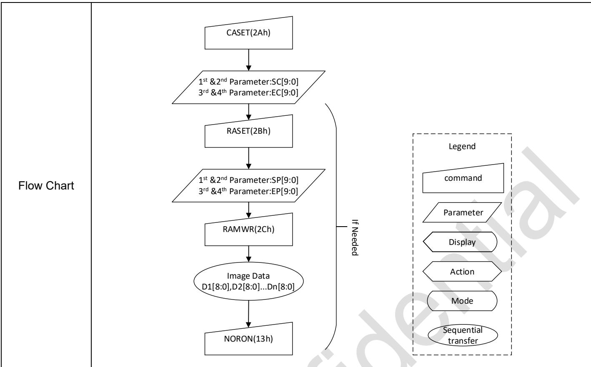

## 9.2.22 RASET：设置行起始地址 (2Bh)

<table><tr><td colspan="2">指令集</td><td colspan="9">RASET</td></tr><tr><td>指令/参数</td><td>W/R</td><td>D[7]</td><td>D[6]</td><td>D[5]</td><td>D[4]</td><td>D[3]</td><td>D[2]</td><td>D[1]</td><td>D[0]</td><td>默认值</td></tr><tr><td>RAMWR</td><td rowspan="5">W/R</td><td>0</td><td>0</td><td>1</td><td>0</td><td>1</td><td>0</td><td>1</td><td>0</td><td>2Bh</td></tr><tr><td>参数 1</td><td colspan="6"></td><td colspan="2">SP[9:8]</td><td>00h</td></tr><tr><td>参数 2</td><td colspan="8">SP[7:0]</td><td>00h</td></tr><tr><td>参数 3</td><td colspan="6"></td><td colspan="2">EP[9:8]</td><td>01h</td></tr><tr><td>参数 4</td><td colspan="8">EP[7:0]</td><td>C5h</td></tr></table>

NOTE:” -” 不关心

<table><tr><td>描述</td><td colspan="3">本指令定义主机处理器通过 read_memory_continue 和 write_memory_continue 访问的帧存储器的列范围。本指令不改变其他驱动状态。当 RAMWR 指令到来时，将参考 SP[9:0] 和 EP[9:0] 的值。每个值代表帧存储器中的一条列线。</td></tr><tr><td>限制条件</td><td colspan="3">- SP[9:0] 必须始终等于或小于 EC[9:0]。- SCP9:0] 与 EP[9:0]-SP[9:0]+1 必须能被 2 整除</td></tr><tr><td rowspan="7">寄存器可用性</td><td colspan="3"></td></tr><tr><td>状态</td><td colspan="2">可用性</td></tr><tr><td>正常模式开启，空闲模式关闭，退出睡眠</td><td colspan="2">是</td></tr><tr><td>正常模式开启，空闲模式开启，退出睡眠</td><td colspan="2">是</td></tr><tr><td>局部模式开启，空闲模式关闭，退出睡眠</td><td colspan="2">是</td></tr><tr><td>局部模式开启，空闲模式开启，退出睡眠</td><td colspan="2">是</td></tr><tr><td>进入睡眠</td><td colspan="2">是</td></tr><tr><td colspan="4"></td></tr><tr><td rowspan="5">默认值</td><td rowspan="2">状态</td><td colspan="2">默认值</td></tr><tr><td>SP[9:0]</td><td>EP[9:0]</td></tr><tr><td>上电时序</td><td>0000h</td><td>01C5h</td></tr><tr><td>软复位</td><td>0000h</td><td>01C5h</td></tr><tr><td>硬复位</td><td>0000h</td><td>01C5h</td></tr></table>

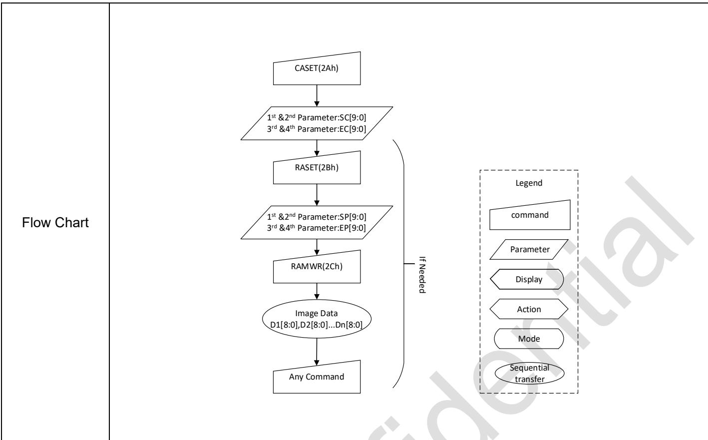

9.2.23 RAMWR：存储器起始写 (2Ch)

<table><tr><td colspan="2">指令集</td><td colspan="9">RAMWR</td></tr><tr><td>指令/参数</td><td>W/R</td><td>D[7]</td><td>D[6]</td><td>D[5]</td><td>D[4]</td><td>D[3]</td><td>D[2]</td><td>D[1]</td><td>D[0]</td><td>默认值</td></tr><tr><td>RAMWR</td><td rowspan="5">W</td><td>0</td><td>0</td><td>1</td><td>0</td><td>1</td><td>1</td><td>0</td><td>0</td><td>2Ch</td></tr><tr><td>参数 1</td><td> $D_{1}7$ </td><td> $D_{1}6$ </td><td> $D_{1}5$ </td><td> $D_{1}4$ </td><td> $D_{1}3$ </td><td> $D_{1}2$ </td><td> $D_{1}1$ </td><td> $D_{1}0$ </td><td>-</td></tr><tr><td>...</td><td colspan="8">...</td><td>-</td></tr><tr><td>...</td><td colspan="8">...</td><td>-</td></tr><tr><td>参数 n</td><td> $D_{N}7$ </td><td> $D_{N}6$ </td><td> $D_{N}5$ </td><td> $D_{N}4$ </td><td> $D_{N}3$ </td><td> $D_{N}2$ </td><td> $D_{N}1$ </td><td> $D_{N}0$ </td><td>-</td></tr></table>

NOTE:” -” 不关心

<table><tr><td>描述</td><td colspan="2">本指令将图像数据从主机处理器传输到显示模组的帧存储器，起始位置为前面的 CASET (2Ah) 和 RASET (2Bh) 指令所指定的像素位置。</td></tr><tr><td>限制条件</td><td colspan="2">存储器写操作之前应先执行 CASET(2Ah)、RASET(2Bh) 或 MADCTR(36h) 以定义写入位置。否则，通过 RAMWR(2Ch) 及后续任何 RAMWRC(3Ch) 指令写入的数据将被写入未定义的位置。</td></tr><tr><td rowspan="7">寄存器可用性</td><td colspan="2"></td></tr><tr><td>状态</td><td>可用性</td></tr><tr><td>正常模式开启，空闲模式关闭，退出睡眠</td><td>是</td></tr><tr><td>正常模式开启，空闲模式开启，退出睡眠</td><td>是</td></tr><tr><td>局部模式开启，空闲模式关闭，退出睡眠</td><td>是</td></tr><tr><td>局部模式开启，空闲模式开启，退出睡眠</td><td>是</td></tr><tr><td>进入睡眠</td><td>是</td></tr><tr><td colspan="3"></td></tr><tr><td rowspan="4">默认值</td><td>状态</td><td>默认值</td></tr><tr><td>上电时序</td><td>存储器内容随机设置</td></tr><tr><td>软复位</td><td>存储器内容不被清除</td></tr><tr><td>硬复位</td><td>存储器内容不被清除</td></tr><tr><td>流程图</td><td colspan="2"> </td></tr></table>

## 9.2.24 PTLAR：设置垂直局部区域 (30h)

<table><tr><td colspan="2">指令集</td><td colspan="9">PTLAR</td></tr><tr><td>指令/参数</td><td>W/R</td><td>D[7]</td><td>D[6]</td><td>D[5]</td><td>D[4]</td><td>D[3]</td><td>D[2]</td><td>D[1]</td><td>D[0]</td><td>默认值</td></tr><tr><td>PTLAR</td><td rowspan="5">W/R</td><td>0</td><td>0</td><td>1</td><td>1</td><td>0</td><td>0</td><td>0</td><td>0</td><td>30h</td></tr><tr><td>参数 1</td><td colspan="6"></td><td colspan="2">PSL[9:8]</td><td>00h</td></tr><tr><td>参数 2</td><td colspan="8">PSL[7:0]</td><td>00h</td></tr><tr><td>参数 3</td><td colspan="6"></td><td colspan="2">PEL[9:8]</td><td>01h</td></tr><tr><td>参数 4</td><td colspan="8">PEL[7:0]</td><td>C5h</td></tr><tr><td colspan="11">NOTE:&quot; - &quot; 不关心</td></tr><tr><td>描述</td><td colspan="10">本指令定义局部显示模式的显示区域。本指令有两个参数，第一个定义起始行 (SR)，第二个定义结束行 (ER)。如果结束行 &gt; 起始行，则起始行为 PSL[9:0]，结束行为 PEL[9:0]。如果结束行 &lt; 起始行，则 PEL[9:0]、PSL[9:0]。如果结束行 = 起始行，则局部区域的深度为一行。</td></tr><tr><td>限制条件</td><td colspan="10">PSL[9:0] 和 PEL[9:0] 的设置应基于最大可用显示区域。</td></tr><tr><td rowspan="6">寄存器可用性</td><td rowspan="6"></td><td colspan="5">状态</td><td colspan="4">可用性</td></tr><tr><td colspan="5">正常模式开启，空闲模式关闭，退出睡眠</td><td colspan="4">是</td></tr><tr><td colspan="5">正常模式开启，空闲模式开启，退出睡眠</td><td colspan="4">是</td></tr><tr><td colspan="5">局部模式开启，空闲模式关闭，退出睡眠</td><td colspan="4">是</td></tr><tr><td colspan="5">局部模式开启，空闲模式开启，退出睡眠</td><td colspan="4">是</td></tr><tr><td colspan="5">进入睡眠</td><td colspan="4">是</td></tr><tr><td rowspan="5">默认值</td><td rowspan="5"></td><td rowspan="2" colspan="5">状态</td><td colspan="4">默认值</td></tr><tr><td colspan="2">PSL[9:0]</td><td colspan="2">PEL[9:0]</td></tr><tr><td colspan="5">上电时序</td><td colspan="2">0000h</td><td colspan="2">01C5h</td></tr><tr><td colspan="5">软复位</td><td colspan="2">0000h</td><td colspan="2">01C5h</td></tr><tr><td colspan="5">硬复位</td><td colspan="2">0000h</td><td colspan="2">01C5h</td></tr></table>

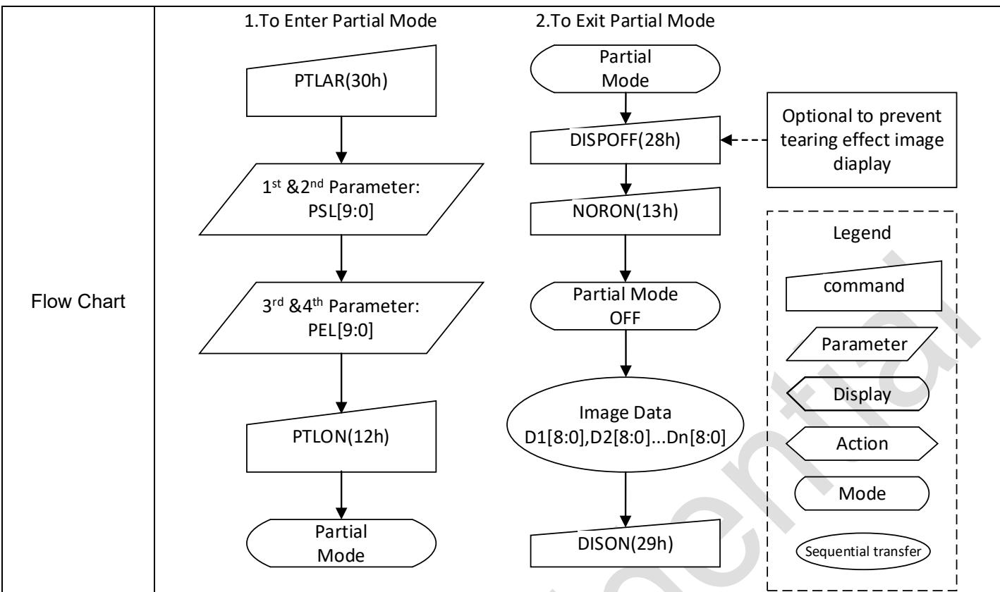

9.2.25 PTLAR\_H：设置水平局部区域 (31h)

<table><tr><td colspan="2">指令集</td><td colspan="9">PTLAR_H</td></tr><tr><td>指令/参数</td><td>W/R</td><td>D[7]</td><td>D[6]</td><td>D[5]</td><td>D[4]</td><td>D[3]</td><td>D[2]</td><td>D[1]</td><td>D[0]</td><td>默认值</td></tr><tr><td>PTLAR_H</td><td rowspan="5">W/R</td><td>0</td><td>0</td><td>1</td><td>1</td><td>0</td><td>0</td><td>0</td><td>1</td><td>31h</td></tr><tr><td>参数 1</td><td colspan="6">-</td><td colspan="2">PSC[8]</td><td>00h</td></tr><tr><td>参数 2</td><td colspan="8">PSC[7:0]</td><td>00h</td></tr><tr><td>参数 3</td><td colspan="6">-</td><td colspan="2">PEC[8]</td><td>01h</td></tr><tr><td>参数 4</td><td colspan="8">PEC[7:0]</td><td>C5h</td></tr><tr><td colspan="11">NOTE:" -” 不关心</td></tr><tr><td>描述</td><td colspan="10">本指令定义水平局部显示模式的显示区域。本指令有两个参数，第一个定义起始列 (PSC)，第二个定义结束列 (PEC)。如果结束列 &gt; 起始列如果结束列 &lt; 起始列如果结束列 = 起始列，则局部区域的深度为一列。</td></tr><tr><td>限制条件</td><td colspan="10">PSL[9:0] 和 PEL[9:0] 的设置应基于最大可用显示区域。</td></tr><tr><td rowspan="7">寄存器可用性</td><td colspan="10"></td></tr><tr><td>状态</td><td colspan="9">可用性</td></tr><tr><td>正常模式开启，空闲模式关闭，退出睡眠</td><td colspan="9">是</td></tr><tr><td>正常模式开启，空闲模式开启，退出睡眠</td><td colspan="9">是</td></tr><tr><td>局部模式开启，空闲模式关闭，退出睡眠</td><td colspan="9">是</td></tr><tr><td>局部模式开启，空闲模式开启，退出睡眠</td><td colspan="9">是</td></tr><tr><td>进入睡眠</td><td colspan="9">是</td></tr><tr><td colspan="11"></td></tr><tr><td rowspan="5">默认值</td><td rowspan="2">状态</td><td colspan="9">默认值</td></tr><tr><td>PSL[9:0]</td><td colspan="8">PEL[9:0]</td></tr><tr><td>上电时序</td><td>0000h</td><td colspan="8">01C5h</td></tr><tr><td>软复位</td><td>0000h</td><td colspan="8">01C5h</td></tr><tr><td>硬复位</td><td>0000h</td><td colspan="8">01C5h</td></tr><tr><td>流程图</td><td>1.进入局部模式 PTLAR(31h) 第 1 和第 2 参数：PSC[9:0] 第 3 和第 4 参数：PEC[9:0] PTLON(12h) 局部模式</td><td>2.退出局部模式 局部模式 DISPOFF(28h) NORON(13h) 局部模式关闭 图像数据 D1[8:0],D2[8:0]...Dn[8:0] DISON(29h)</td><td colspan="8">可选，用于防止撕裂效应的图像显示 图例 指令 参数 显示 动作 模式 顺序传输</td></tr></table>

9.2.26 TEOFF：撕裂效应线关闭 (34h)

<table><tr><td>CMD/PAs</td><td>R/W</td><td>D7</td><td>D6</td><td>D5</td><td>D4</td><td>D3</td><td>D2</td><td>D1</td><td>D0</td><td>HEX</td></tr><tr><td>指令</td><td>W</td><td>0</td><td>0</td><td>1</td><td>1</td><td>0</td><td>1</td><td>0</td><td>0</td><td>34</td></tr><tr><td>描述</td><td colspan="10">本指令用于关闭（低电平有效）来自 TE 信号线的撕裂效应输出信号。</td></tr><tr><td>限制条件</td><td colspan="10">当撕裂效应输出已关闭时，本指令无效。</td></tr><tr><td>流程图</td><td colspan="10"></td></tr></table>

## 9.2.27 TEON：撕裂效应线开启 (35h)

<table><tr><td>CMD/PAs</td><td>R/W</td><td>D7</td><td>D6</td><td>D5</td><td>D4</td><td>D3</td><td>D2</td><td>D1</td><td>D0</td><td>HEX</td></tr><tr><td>指令</td><td>W</td><td>0</td><td>0</td><td>1</td><td>1</td><td>0</td><td>1</td><td>0</td><td>1</td><td>35</td></tr><tr><td>参数 1</td><td>W</td><td>X</td><td>X</td><td>X</td><td>X</td><td>X</td><td>X</td><td>X</td><td>M</td><td></td></tr><tr><td>描述</td><td colspan="10">本指令用于开启来自 TE 信号线的撕裂效应输出信号。该输出不受修改 MADCTL 位 B4 的影响。撕裂效应线开启指令有一个参数，用于描述撕裂效应输出线的模式。（X=不关心）。当 M=0 时：撕裂效应输出线仅包含 V-Blanking 信息：当 M=1 时：撕裂效应输出线同时包含 V-Blanking 和 H-Blanking 信息：注：在进入睡眠模式且撕裂效应线开启期间，撕裂效应输出引脚将为低电平有效。</td></tr><tr><td>限制条件</td><td colspan="10">当撕裂效应输出已开启时，本指令无效。</td></tr><tr><td>流程图</td><td colspan="10"></td></tr></table>

9.2.28 MADCTL：存储器访问控制(36h)

<table><tr><td>CMD/PAs</td><td>R/W</td><td>D7</td><td>D6</td><td>D5</td><td>D4</td><td>D3</td><td>D2</td><td>D1</td><td>D0</td><td>HEX</td></tr><tr><td>指令</td><td>W</td><td>0</td><td>0</td><td>1</td><td>1</td><td>0</td><td>1</td><td>1</td><td>0</td><td>36</td></tr><tr><td>参数 1</td><td>W</td><td>B7</td><td>B6</td><td>0</td><td>0</td><td>B3</td><td>0</td><td>B1</td><td>B0</td><td></td></tr><tr><td rowspan="8">描述</td><td colspan="10">本指令定义帧存储器的读/写扫描方向。本指令不改变其他驱动状态。</td></tr><tr><td>位</td><td colspan="4">名称</td><td colspan="5">说明</td></tr><tr><td>B7</td><td colspan="4">页地址顺序 (MY)</td><td colspan="5">选择面板模组上 Gate 驱动器的扫描方向</td></tr><tr><td>B6</td><td colspan="4">列地址顺序 (MX)</td><td colspan="5">选择面板模组上 Source 驱动器的扫描方向</td></tr><tr><td>B3</td><td colspan="4">RGB-BGR 顺序 (BGR)</td><td colspan="5">色彩选择开关控制 0=RGB 彩色滤光片面板 1=BGR 彩色滤光片面板</td></tr><tr><td>B1</td><td colspan="4">水平翻转 (LR)</td><td colspan="5">选择面板模组上 Source 驱动器的扫描方向</td></tr><tr><td>B0</td><td colspan="4">垂直翻转 (GS)</td><td colspan="5">选择面板模组上 Gate 驱动器的扫描方向</td></tr><tr><td colspan="10">RGB-BGR 顺序 (BGR)：RGB-BGR 顺序源扫描顺序 (LR)：SS=0 SS=1 左上 左上栅极扫描顺序 (UD)：GS=0 GS=1 左上 显示器件   注：左上角 (0,0) 表示一个物理存储器位置。</td></tr><tr><td>限制条件</td><td colspan="10">-</td></tr><tr><td>流程图</td><td colspan="10"></td></tr></table>

## 9.2.29 IDMOFF：空闲模式关闭 (38h)

<table><tr><td>CMD/PAs</td><td>R/W</td><td>D7</td><td>D6</td><td>D5</td><td>D4</td><td>D3</td><td>D2</td><td>D1</td><td>D0</td><td>HEX</td></tr><tr><td>指令</td><td>W</td><td>0</td><td>0</td><td>1</td><td>1</td><td>1</td><td>0</td><td>0</td><td>0</td><td>38</td></tr><tr><td>描述</td><td colspan="10">本指令用于从空闲模式开启状态恢复。在空闲模式关闭状态下，LCD 最多可显示 16.7M 色。</td></tr><tr><td>限制条件</td><td colspan="10">当模组已处于空闲模式关闭状态时，本指令无效。</td></tr><tr><td>流程图</td><td colspan="10"></td></tr></table>

9.2.30 IDMON：空闲模式开启 (39h)

<table><tr><td>CMD/PAs</td><td>R/W</td><td>D7</td><td>D6</td><td>D5</td><td>D4</td><td>D3</td><td>D2</td><td>D1</td><td>D0</td><td>HEX</td></tr><tr><td>命令</td><td>W</td><td>0</td><td>0</td><td>1</td><td>1</td><td>1</td><td>0</td><td>0</td><td>0</td><td>39</td></tr><tr><td rowspan="11">描述</td><td colspan="10">本命令用于进入空闲开启（Idle Mode On）模式。在空闲开启模式下，色彩表现能力降低。使用帧存储器（Frame Memory）中每个 R、G 和 B 的 MSB 构成的主色与二次色，显示 8 色深数据。（示例）显示存储器内容与显示颜色</td></tr><tr><td colspan="3"></td><td colspan="2">R7-R0</td><td colspan="2">G7-G0</td><td colspan="3">B7-B0</td></tr><tr><td colspan="3">黑</td><td colspan="2">0XXXXXXXX</td><td colspan="2">0XXXXXXXX</td><td colspan="3">0XXXXXXXX</td></tr><tr><td colspan="3">蓝</td><td colspan="2">0XXXXXXXX</td><td colspan="2">0XXXXXXXX</td><td colspan="3">1XXXXXXXX</td></tr><tr><td colspan="3">红</td><td colspan="2">1XXXXXXXX</td><td colspan="2">0XXXXXXXX</td><td colspan="3">0XXXXXXXX</td></tr><tr><td colspan="3">品红</td><td colspan="2">1XXXXXXXX</td><td colspan="2">0XXXXXXXX</td><td colspan="3">1XXXXXXXX</td></tr><tr><td colspan="3">绿</td><td colspan="2">0XXXXXXXX</td><td colspan="2">1XXXXXXXX</td><td colspan="3">0XXXXXXXX</td></tr><tr><td colspan="3">青</td><td colspan="2">0XXXXXXXX</td><td colspan="2">1XXXXXXXX</td><td colspan="3">1XXXXXXXX</td></tr><tr><td colspan="3">黄</td><td colspan="2">1XXXXXXXX</td><td colspan="2">1XXXXXXXX</td><td colspan="3">0XXXXXXXX</td></tr><tr><td colspan="3">白</td><td colspan="2">1XXXXXXXX</td><td colspan="2">1XXXXXXXX</td><td colspan="3">1XXXXXXXX</td></tr><tr><td colspan="10">X=无关项</td></tr><tr><td>限制</td><td colspan="10">当模块已处于空闲开启模式时，本命令无效。</td></tr><tr><td>流程图</td><td colspan="10"></td></tr></table>

## 9.2.31 COLMOD：接口像素格式（3Ah）

<table><tr><td>CMD/PAs</td><td>R/W</td><td>D7</td><td>D6</td><td>D5</td><td>D4</td><td>D3</td><td>D2</td><td>D1</td><td>D0</td><td>HEX</td></tr><tr><td>命令</td><td>W</td><td>0</td><td>0</td><td>1</td><td>1</td><td>1</td><td>0</td><td>1</td><td>0</td><td>3A</td></tr><tr><td>参数 1</td><td>W</td><td>X</td><td>D6</td><td>D5</td><td>D4</td><td>X</td><td>D2</td><td>D1</td><td>D0</td><td></td></tr><tr><td>描述</td><td colspan="10">本命令用于定义 RGB 图像数据的格式。D6~D4：DPI 像素格式定义，固定为 @111。D2~D0：DBI 像素格式定义，固定为 @000。如果某个特定接口（DBI 或 DPI）未被使用，则显示模块返回的参数中对应位未定义。参考：7.3.2 RGB 数据格式</td></tr><tr><td>限制</td><td colspan="10">在向帧存储器（Frame Memory）写入数据之前，不会产生可见效果。</td></tr><tr><td>流程图</td><td colspan="10">位/像素模式设置像素格式参数新的 n 位/像素模式</td></tr></table>

## 9.2.32 RAMWR：存储器连续写入（3Ch）

<table><tr><td colspan="2">命令集</td><td colspan="9">RAMWRC</td></tr><tr><td>指令/参数</td><td>W/R</td><td>D[7]</td><td>D[6]</td><td>D[5]</td><td>D[4]</td><td>D[3]</td><td>D[2]</td><td>D[1]</td><td>D[0]</td><td>默认值</td></tr><tr><td>RAMWRC</td><td rowspan="5">W</td><td>0</td><td>0</td><td>1</td><td>1</td><td>1</td><td>1</td><td>0</td><td>0</td><td>3Ch</td></tr><tr><td>参数 1</td><td> $D_{1}7$ </td><td> $D_{1}6$ </td><td> $D_{1}5$ </td><td> $D_{1}4$ </td><td> $D_{1}3$ </td><td> $D_{1}2$ </td><td> $D_{1}1$ </td><td> $D_{1}0$ </td><td>-</td></tr><tr><td>...</td><td colspan="8">...</td><td>-</td></tr><tr><td>...</td><td colspan="8">...</td><td>-</td></tr><tr><td>参数 n</td><td> $D_{N}7$ </td><td> $D_{N}6$ </td><td> $D_{N}5$ </td><td> $D_{N}4$ </td><td> $D_{N}3$ </td><td> $D_{N}2$ </td><td> $D_{N}1$ </td><td> $D_{N}0$ </td><td>-</td></tr></table>

注意：“-” 表示无关项

<table><tr><td>描述</td><td colspan="2">本命令将图像数据从主机处理器传输到显示模块的帧存储器（Frame Memory），并从上一个 write_memory_continue 或 write_memory_start 命令之后的像素位置继续写入。</td></tr><tr><td>限制</td><td colspan="2">存储器写入操作应跟在 CASET(2Ah)、RASET(2Bh) 或 MADCTR(36h) 之后，以定义写入位置。否则，通过 RAMWR(2Ch) 及后续任何 RAMWRC(3Ch) 命令写入的数据将被写入未定义的位置。</td></tr><tr><td rowspan="7">寄存器可用性</td><td colspan="2"></td></tr><tr><td>状态</td><td>可用性</td></tr><tr><td>正常模式开启，空闲模式关闭，睡眠退出</td><td>是</td></tr><tr><td>正常模式开启，空闲模式开启，睡眠退出</td><td>是</td></tr><tr><td>部分模式开启，空闲模式关闭，睡眠退出</td><td>是</td></tr><tr><td>部分模式开启，空闲模式开启，睡眠退出</td><td>是</td></tr><tr><td>睡眠进入</td><td>是</td></tr><tr><td colspan="3"></td></tr><tr><td rowspan="4">默认</td><td>状态</td><td>默认值</td></tr><tr><td>上电时序</td><td>存储器内容随机</td></tr><tr><td>软件复位</td><td>存储器内容不清除</td></tr><tr><td>硬件复位</td><td>存储器内容不清除</td></tr><tr><td>流程图</td><td colspan="2"></td></tr></table>

9.2.33 TESL：设置撕裂效应扫描线（44h）

<table><tr><td>CMD/PAs</td><td>R/W</td><td>D7</td><td>D6</td><td>D5</td><td>D4</td><td>D3</td><td>D2</td><td>D1</td><td>D0</td><td>HEX</td></tr><tr><td>命令</td><td>W</td><td>0</td><td>1</td><td>0</td><td>0</td><td>0</td><td>1</td><td>0</td><td>0</td><td>44</td></tr><tr><td>参数 1</td><td>W</td><td colspan="8">TELINE[15:8]</td><td></td></tr><tr><td>参数 2</td><td>W</td><td colspan="8">TELINE[7:0]</td><td></td></tr><tr><td>描述</td><td colspan="10">本命令用于在显示模块到达 TELINE 行时，使能显示模块在 TE 信号线上输出 Tearing Effect（撕裂效应）信号。改变 MADCTL 的 B4 位不会影响 TE 信号。Tearing Effect Line On 有一个参数，用于描述 Tearing Effect 输出线的模式。Tearing Effect 输出线仅包含 V-Blanking（场消隐）信息：注：TELINE=0 等效于 TEMODE=0。当显示模块处于睡眠模式时，Tearing Effect 输出线应为低电平有效。</td></tr><tr><td>限制</td><td colspan="10">当 Tearing Effect 输出已开启时，本命令无效。</td></tr><tr><td>流程图</td><td colspan="10">( )</td></tr></table>

## 9.2.34 GETSCAN：获取当前扫描线（45h）

<table><tr><td>CMD/PAs</td><td>R/W</td><td>D7</td><td>D6</td><td>D5</td><td>D4</td><td>D3</td><td>D2</td><td>D1</td><td>D0</td><td>HEX</td></tr><tr><td>命令</td><td>W</td><td>0</td><td>1</td><td>0</td><td>0</td><td>0</td><td>1</td><td>0</td><td>1</td><td>45</td></tr><tr><td>参数 1</td><td>W</td><td colspan="8">SLN[15:8](8&#x27;b0)</td><td></td></tr><tr><td>参数 2</td><td>W</td><td colspan="8">SLN[7:0](8&#x27;b0)</td><td></td></tr><tr><td>描述</td><td colspan="10">显示模块返回用于更新显示装置的当前扫描线 N。显示装置上的扫描线总数为 VS + VBP + VACT + VFP。第一条扫描线定义为 V Sync 的第一行，记为 Line 0。当处于睡眠模式时，get scanline 返回的值未定义。</td></tr><tr><td>限制</td><td colspan="10">-</td></tr><tr><td>流程图</td><td colspan="10"></td></tr></table>

## 9.2.35 DSTBON：深度待机模式开启（4Fh）

<table><tr><td>指令/参数</td><td>W/R</td><td>D[7]</td><td>D[6]</td><td>D[5]</td><td>D[4]</td><td>D[3]</td><td>D[2]</td><td>D[1]</td><td>D[0]</td><td>默认值</td></tr><tr><td>DSTBON</td><td rowspan="2">W</td><td>0</td><td>1</td><td>0</td><td>0</td><td>1</td><td>1</td><td>0</td><td>0</td><td>4Fh</td></tr><tr><td>参数 1</td><td>-</td><td>-</td><td>-</td><td>-</td><td>-</td><td>-</td><td>-</td><td>DSTB</td><td>00h</td></tr><tr><td colspan="11">注意：“-” 表示无关项</td></tr><tr><td>描述</td><td colspan="10">本命令用于进入深度待机模式。DSTB=&quot;1&quot; 时，进入深度待机模式。注：1. 要退出深度待机模式，请向 RESX 引脚输入大于 3 msec 的低电平脉冲。2. 对于 MIPI IF，若使用深度待机模式，请在执行深度待机命令后将 HSSI_CLK_P/N 及 HSSI_D0~D1_P/N 拉到 GND。</td></tr><tr><td>限制</td><td colspan="10">-</td></tr><tr><td rowspan="6">寄存器可用性</td><td colspan="5">状态</td><td colspan="5">可用性</td></tr><tr><td colspan="5">正常模式开启，空闲模式关闭，睡眠退出</td><td colspan="5">是</td></tr><tr><td colspan="5">正常模式开启，空闲模式开启，睡眠退出</td><td colspan="5">是</td></tr><tr><td colspan="5">部分模式开启，空闲模式关闭，睡眠退出</td><td colspan="5">是</td></tr><tr><td colspan="5">部分模式开启，空闲模式开启，睡眠退出</td><td colspan="5">是</td></tr><tr><td colspan="5">睡眠进入</td><td colspan="5">是</td></tr><tr><td rowspan="4">默认</td><td colspan="5">状态</td><td colspan="5">默认值</td></tr><tr><td colspan="5">上电时序</td><td colspan="5">00h</td></tr><tr><td colspan="5">软件复位</td><td colspan="5">00h</td></tr><tr><td colspan="5">硬件复位</td><td colspan="5">00h</td></tr><tr><td>流程图</td><td colspan="10"></td></tr></table>

## 9.2.36 WRDISBV：写入显示亮度（51h）

<table><tr><td>CMD/PAs</td><td>R/W</td><td>D7</td><td>D6</td><td>D5</td><td>D4</td><td>D3</td><td>D2</td><td>D1</td><td>D0</td><td>HEX</td></tr><tr><td>命令</td><td>W</td><td>0</td><td>1</td><td>0</td><td>1</td><td>0</td><td>0</td><td>0</td><td>1</td><td>51</td></tr><tr><td>参数 1</td><td>W</td><td colspan="8">DBV[7:0]</td><td></td></tr><tr><td>描述</td><td colspan="10">本命令用于调整显示的亮度值。应确认所写入的值与显示输出亮度之间的关系。该关系在显示模块规格书中定义。原则上，00h 表示最低亮度，FFh 表示最高亮度。</td></tr><tr><td>限制</td><td colspan="10">-</td></tr><tr><td>流程图</td><td colspan="10">新的显示亮度值已加载</td></tr></table>

## 9.2.37 RDDISBV：读取显示亮度值（52h）

<table><tr><td>CMD/PAs</td><td>R/W</td><td>D7</td><td>D6</td><td>D5</td><td>D4</td><td>D3</td><td>D2</td><td>D1</td><td>D0</td><td>HEX</td></tr><tr><td>命令</td><td>W</td><td>0</td><td>1</td><td>0</td><td>1</td><td>0</td><td>0</td><td>1</td><td>0</td><td>52</td></tr><tr><td>参数 1</td><td>R</td><td colspan="8">DBV[7:0]</td><td></td></tr><tr><td>描述</td><td colspan="10">本命令返回显示的亮度值。应确认所返回的值与显示输出亮度之间的关系。该关系在显示模块规格书中定义。原则上，00h 表示最低亮度，FFh 表示最高亮度。</td></tr><tr><td>限制</td><td colspan="10">-</td></tr><tr><td>流程图</td><td colspan="10">读取 RDDISBV 发送 DBV</td></tr></table>

## 9.2.38 WRCTRLD：写入 CTRL Display（53h）

<table><tr><td>CMD/PAs</td><td>R/W</td><td>D7</td><td>D6</td><td>D5</td><td>D4</td><td>D3</td><td>D2</td><td>D1</td><td>D0</td><td>HEX</td></tr><tr><td>命令</td><td>W</td><td>0</td><td>1</td><td>0</td><td>1</td><td>0</td><td>0</td><td>1</td><td>1</td><td>53</td></tr><tr><td>参数 1</td><td>W</td><td>X</td><td>X</td><td>BCTRL</td><td>X</td><td>DD</td><td>BL</td><td>X</td><td>X</td><td></td></tr><tr><td>描述</td><td colspan="10">本命令用于控制显示亮度。BCTRL：亮度控制模块开/关，该位始终用于切换显示的亮度。0 = 关（亮度寄存器为 DBV[7..0]）；1 = 开（亮度寄存器有效，具体取决于其他参数）。显示调光（Display Dimming，DD）：（仅用于手动亮度设置）DD = 0：显示调光关闭；DD = 1：显示调光开启。BL：背光控制开/关。0 = 关（完全关闭背光电路，控制线必须为低电平）；1 = 开。当 DD=1 时改变 BCTRL 位（例如 BCTRL：0 -&gt; 1 或 1-&gt; 0），调光功能会适配显示的亮度寄存器。当 BL 位从“On”变为“Off”时，即使选择了调光开启（DD=1），背光也会关闭而不会逐渐调光。X = 无关项。</td></tr><tr><td>限制</td><td colspan="10">-</td></tr><tr><td>流程图</td><td colspan="10"></td></tr></table>

## 9.2.39 RDCTRLD：读取 CTRL 值显示（54h）

<table><tr><td>CMD/PAs</td><td>R/W</td><td>D7</td><td>D6</td><td>D5</td><td>D4</td><td>D3</td><td>D2</td><td>D1</td><td>D0</td><td>HEX</td></tr><tr><td>命令</td><td>W</td><td>0</td><td>1</td><td>0</td><td>1</td><td>0</td><td>1</td><td>0</td><td>0</td><td>54</td></tr><tr><td>参数 1</td><td>R</td><td>0</td><td>0</td><td>BCTRL</td><td>0</td><td>DD</td><td>BL</td><td>0</td><td>0</td><td></td></tr><tr><td>描述</td><td colspan="10">本命令返回环境光和亮度控制值，请参见相关章节：BCTRL：亮度控制模块开/关，该位始终用于切换显示的亮度。0 = 关；1 = 开。显示调光（DD）：DD = 0：显示调光关闭；DD = 1：显示调光开启。BL：背光控制开/关。0 = 关（完全关闭背光电路）；1 = 开。</td></tr><tr><td>限制</td><td colspan="10">-</td></tr><tr><td>流程图</td><td colspan="10">读取 RDCTRL 发送 1 个参数</td></tr></table>

## 9.2.40 WRACL：读取 ACL 控制（55h）

<table><tr><td colspan="2">命令集</td><td colspan="9">WRACL</td></tr><tr><td>指令/参数</td><td>W/R</td><td>D[7]</td><td>D[6]</td><td>D[5]</td><td>D[4]</td><td>D[3]</td><td>D[2]</td><td>D[1]</td><td>D[0]</td><td>默认值</td></tr><tr><td>WRACL</td><td rowspan="2">W</td><td>0</td><td>1</td><td>0</td><td>1</td><td>0</td><td>1</td><td>0</td><td>1</td><td>55h</td></tr><tr><td>参数 1</td><td>-</td><td>-</td><td>-</td><td>-</td><td>-</td><td>-</td><td colspan="2">RAD_ACL[1:0]</td><td>00h</td></tr></table>

注意：“-” 表示无关项

<table><tr><td rowspan="4">描述</td><td colspan="2">本命令用于控制 ACL（Auto Current Limit，自动电流限制）功能。- ACL[1:0]：控制 ACL（Auto Current Limit）功能。</td></tr><tr><td>值</td><td>描述</td></tr><tr><td>00</td><td>禁用 ACL 功能。</td></tr><tr><td>11</td><td>使能 ACL 功能</td></tr><tr><td colspan="3"></td></tr><tr><td>限制</td><td colspan="2">-</td></tr><tr><td rowspan="6">寄存器可用性</td><td>状态</td><td>可用性</td></tr><tr><td>正常模式开启，空闲模式关闭，睡眠退出</td><td>是</td></tr><tr><td>正常模式开启，空闲模式开启，睡眠退出</td><td>是</td></tr><tr><td>部分模式开启，空闲模式关闭，睡眠退出</td><td>是</td></tr><tr><td>部分模式开启，空闲模式开启，睡眠退出</td><td>是</td></tr><tr><td>睡眠进入</td><td>是</td></tr><tr><td colspan="3"></td></tr><tr><td rowspan="4">默认</td><td>状态</td><td>默认值</td></tr><tr><td>上电时序</td><td>00h</td></tr><tr><td>软件复位</td><td>00h</td></tr><tr><td>硬件复位</td><td>00h</td></tr><tr><td colspan="3"></td></tr><tr><td>流程图</td><td colspan="2">WRRADACL(55hH) 主机驱动发送参数 RAD_ACL[1:0]</td></tr></table>

9.2.41 RDACL：读取 ACL 控制（56h）

<table><tr><td colspan="2">命令集</td><td colspan="9">RDACL</td></tr><tr><td>指令/参数</td><td>W/R</td><td>D[7]</td><td>D[6]</td><td>D[5]</td><td>D[4]</td><td>D[3]</td><td>D[2]</td><td>D[1]</td><td>D[0]</td><td>默认值</td></tr><tr><td>RDACL</td><td rowspan="2">R</td><td>0</td><td>1</td><td>0</td><td>1</td><td>0</td><td>1</td><td>1</td><td>0</td><td>56h</td></tr><tr><td>参数 1</td><td>-</td><td>-</td><td>-</td><td>-</td><td>-</td><td>-</td><td colspan="2">RAD_ACL[1:0]</td><td>00h</td></tr></table>

注意：“-” 表示无关项

<table><tr><td rowspan="4">描述</td><td colspan="2">本命令用于控制 ACL（Auto Current Limit，自动电流限制）功能。- ACL[1:0]：控制 ACL（Auto Current Limit）功能。</td></tr><tr><td>值</td><td>描述</td></tr><tr><td>00</td><td>禁用 ACL 功能。</td></tr><tr><td>11</td><td>使能 ACL 功能</td></tr><tr><td>限制</td><td colspan="2">-</td></tr><tr><td rowspan="6">寄存器可用性</td><td>状态</td><td>可用性</td></tr><tr><td>正常模式开启，空闲模式关闭，睡眠退出</td><td>是</td></tr><tr><td>正常模式开启，空闲模式开启，睡眠退出</td><td>是</td></tr><tr><td>部分模式开启，空闲模式关闭，睡眠退出</td><td>是</td></tr><tr><td>部分模式开启，空闲模式开启，睡眠退出</td><td>是</td></tr><tr><td>睡眠进入</td><td>是</td></tr><tr><td rowspan="4">默认</td><td>状态</td><td>默认值</td></tr><tr><td>上电时序</td><td>00h</td></tr><tr><td>软件复位</td><td>00h</td></tr><tr><td>硬件复位</td><td>00h</td></tr><tr><td>流程图</td><td>WRRADACL(55hH) 主机驱动发送参数 RAD_ACL[1:0]</td><td>图例命令参数显示操作模式顺序传输</td></tr></table>
9.2.42 WRCABCMB：写入 CABC 最小亮度（5Eh）

<table><tr><td>5EH</td><td colspan="12">WRCABCMB</td></tr><tr><td rowspan="2">指令 / 参数</td><td rowspan="2">R/W</td><td colspan="2">地址</td><td rowspan="2">D15-8</td><td rowspan="2">D7</td><td rowspan="2">D6</td><td rowspan="2">D5</td><td rowspan="2">D4</td><td rowspan="2">D3</td><td rowspan="2">D2</td><td rowspan="2">D1</td><td rowspan="2">D0</td></tr><tr><td>其他</td><td>SPI-16</td></tr><tr><td>WRCABCMB</td><td>W</td><td>5Eh</td><td>5E00h</td><td>X</td><td colspan="8">CMB[7:0]</td></tr><tr><td>描述</td><td colspan="12">该指令用于设置 CABC 功能下显示屏的最小亮度值。原则上，00h 值表示 CABC 的最低亮度，FFh 值表示 CABC 的亮度。</td></tr><tr><td>限制条件</td><td colspan="12">-</td></tr><tr><td rowspan="6">寄存器可用性</td><td colspan="5">状态</td><td colspan="7">可用性</td></tr><tr><td colspan="5">正常模式开启，空闲模式关闭，退出睡眠模式</td><td colspan="7">是</td></tr><tr><td colspan="5">正常模式开启，空闲模式开启，退出睡眠模式</td><td colspan="7">是</td></tr><tr><td colspan="5">部分模式开启，空闲模式关闭，退出睡眠模式</td><td colspan="7">是</td></tr><tr><td colspan="5">部分模式开启，空闲模式开启，退出睡眠模式</td><td colspan="7">是</td></tr><tr><td colspan="5">进入睡眠模式</td><td colspan="7">是</td></tr><tr><td rowspan="4">默认值</td><td colspan="3">状态</td><td colspan="9">默认值</td></tr><tr><td colspan="3">上电时序</td><td colspan="9">00h</td></tr><tr><td colspan="3">软件复位</td><td colspan="9">00h</td></tr><tr><td colspan="3">硬件复位</td><td colspan="9">00h</td></tr><tr><td>流程图</td><td colspan="5">WRCABCME(5Eh)参数：CMB新的显示亮度值已载入</td><td colspan="4">图例指令参数显示动作模式顺序传输</td><td colspan="3"></td></tr></table>

9.2.43 RDCABCMB：读取 CABC 最小亮度（5Fh）

<table><tr><td>5FH</td><td colspan="12">WRCABCMB</td></tr><tr><td rowspan="2">指令 / 参数</td><td rowspan="2">R/W</td><td colspan="2">地址</td><td rowspan="2">D15-8</td><td rowspan="2">D7</td><td rowspan="2">D6</td><td rowspan="2">D5</td><td rowspan="2">D4</td><td rowspan="2">D3</td><td rowspan="2">D2</td><td rowspan="2">D1</td><td rowspan="2">D0</td></tr><tr><td>其他</td><td>SPI-16</td></tr><tr><td>WRCABCMB</td><td>R</td><td>5Fh</td><td>5F00h</td><td>X</td><td colspan="8">CMB[7:0]</td></tr><tr><td>描述</td><td colspan="12">该指令返回 CABC 功能的最小亮度值。原则上，00h 值表示 CABC 的最低亮度，FFh 值表示 CABC 的亮度。</td></tr><tr><td>限制条件</td><td colspan="12">-</td></tr><tr><td rowspan="6">寄存器可用性</td><td colspan="5">状态</td><td colspan="7">可用性</td></tr><tr><td colspan="5">正常模式开启，空闲模式关闭，退出睡眠模式</td><td colspan="7">是</td></tr><tr><td colspan="5">正常模式开启，空闲模式开启，退出睡眠模式</td><td colspan="7">是</td></tr><tr><td colspan="5">部分模式开启，空闲模式关闭，退出睡眠模式</td><td colspan="7">是</td></tr><tr><td colspan="5">部分模式开启，空闲模式开启，退出睡眠模式</td><td colspan="7">是</td></tr><tr><td colspan="5">进入睡眠模式</td><td colspan="7">是</td></tr><tr><td rowspan="4">默认值</td><td colspan="3">状态</td><td colspan="9">默认值（D7 至 D0）</td></tr><tr><td colspan="3">上电时序</td><td colspan="9">00h</td></tr><tr><td colspan="3">软件复位</td><td colspan="9">00h</td></tr><tr><td colspan="3">硬件复位</td><td colspan="9">00h</td></tr><tr><td>流程图</td><td colspan="5">RDCABCMB(5Fh)主机驱动发送参数 CMB图例指令参数显示动作模式顺序传输</td><td colspan="4">图例指令参数显示动作模式顺序传输</td><td colspan="3"></td></tr></table>

9.2.44 RDDDB：读取 DDB 起始（A1h）

<table><tr><td>指令/参数</td><td>R/W</td><td>D7</td><td>D6</td><td>D5</td><td>D4</td><td>D3</td><td>D2</td><td>D1</td><td>D0</td><td>HEX</td></tr><tr><td>指令</td><td>W</td><td>1</td><td>0</td><td>1</td><td>0</td><td>0</td><td>0</td><td>0</td><td>1</td><td>A1</td></tr><tr><td>参数 1</td><td>R</td><td>X</td><td>X</td><td>X</td><td>X</td><td>X</td><td>X</td><td>X</td><td>X</td><td></td></tr><tr><td>:</td><td>R</td><td>X</td><td>X</td><td>X</td><td>X</td><td>X</td><td>X</td><td>X</td><td>X</td><td></td></tr><tr><td>参数 n</td><td>R</td><td>X</td><td>X</td><td>X</td><td>X</td><td>X</td><td>X</td><td>X</td><td>X</td><td></td></tr><tr><td>描述</td><td colspan="10">该指令从外设读取标识与描述信息。这些信息组织在外设内部存储的设备描述符块（Device Descriptor Block，DDB）中。对该指令的响应会返回一串字节，其长度最长可达 64K 字节。请注意，返回的字节序列不一定对应整个 DDB，它可能是更大数据块的一部分。返回数据的格式如下：参数 1：供应商 ID 的最低有效字节（LS，least significant）。供应商 ID 是 MIPI 组织分配给每个外设供应商的唯一值。参数 2：供应商 ID 的最高有效字节（MS，most significant）。参数 3：供应商自选数据（Supplier Elective Data）的最低有效字节（LS）。这是由供应商确定的一个字节的信息，例如可包含型号或版本信息。参数 4：供应商自选数据（Supplier Elective Data）的最高有效字节（MS）参数 5：单字节转义或退出码（EEC，Escape or Exit Code）。该码的含义如下：- FFh - 退出码 – 描述符块中没有更多数据- 00h - 转义码 – 描述符块中包含供应商专有数据（不符合任何 MIPI 标准）- 其他任何值 – 描述符块中包含 DDB 数据。该数据的格式与含义在《MIPI Alliance Standard for Device Descriptor Block (DDB)》中有详细说明。DDB 中可能包含更多提供外设信息的数据字段。在 DSI 系统中，读取活动通过总线上的两个独立事务来完成：首先是主机处理器发送给外设的读指令 RDDDB: Read DDB Start (A1h)，其中包含总线换向（bus turn-around）令牌。随后外设取得总线控制权并返回所请求的数据。外设对 RDDDB: Read DDB Start (A1h) 的响应属于长包（Long Packet）类型，因此除非受先前 set_max_return_size 指令的限制，其长度最长可达 64K 字节。对 RDDDB: Read DDB Start (A1h) 指令的响应总是从设备描述符块的起始位置开始。主机处理器在接收到第一个数据包并处理返回的 DDB 数据后，可以发起 RDDDBCON: Read DDB Continue (A8h) 指令以访问 DDB 的下一部分。RDDDBCON: Read DDB Continue (A8h) 指令从上次从 DDB 读取的最后一个字节之后的位置开始下一次读取。后续的 RDDDBCON: Read DDB Continue (A8h) 指令可用于读取任意大小的 DDB 或供应商专有数据块。不过，并没有义务读取整个块。主机处理器可以选择在执行任意Read DDB xxx指令完成后停止读取。</td></tr><tr><td>限制条件</td><td colspan="10">-</td></tr><tr><td>流程图</td><td colspan="10"></td></tr></table>

## 9.2.45 RDDDBCON：读取 DDB 继续（A8h）

<table><tr><td>指令/参数</td><td>R/W</td><td>D7</td><td>D6</td><td>D5</td><td>D4</td><td>D3</td><td>D2</td><td>D1</td><td>D0</td><td>HEX</td></tr><tr><td>指令</td><td>W</td><td>1</td><td>0</td><td>1</td><td>0</td><td>1</td><td>0</td><td>0</td><td>0</td><td>A8</td></tr><tr><td>参数 1</td><td>R</td><td>X</td><td>X</td><td>X</td><td>X</td><td>X</td><td>X</td><td>X</td><td>X</td><td></td></tr><tr><td>:</td><td>R</td><td>X</td><td>X</td><td>X</td><td>X</td><td>X</td><td>X</td><td>X</td><td>X</td><td></td></tr><tr><td>参数 n</td><td>R</td><td>X</td><td>X</td><td>X</td><td>X</td><td>X</td><td>X</td><td>X</td><td>X</td><td></td></tr><tr><td>描述</td><td colspan="10">在执行 RDDDBCON: Read DDB Continue (A8h) 指令之前，应至少先执行一次 RDDDB: Read DDB Start (A1h) 指令以确定读取位置。否则，使用 RDDDBCON: Read DDB Continue (A8h) 指令读取的数据是不确定的。</td></tr><tr><td>限制条件</td><td colspan="10">-</td></tr><tr><td>流程图</td><td colspan="10">Read_DDB_continueDDBD1[7:0],D2[7:0],...,Dn[7:0]任意指令</td></tr></table>

## 9.2.46 SetDISPMode：设置显示模式（C2h）

<table><tr><td colspan="2">指令集</td><td colspan="9">RDCCS</td></tr><tr><td>指令/参数</td><td>W/R</td><td>D[7]</td><td>D[6]</td><td>D[5]</td><td>D[4]</td><td>D[3]</td><td>D[2]</td><td>D[1]</td><td>D[0]</td><td>默认值</td></tr><tr><td>RDCCS</td><td rowspan="2">W</td><td>1</td><td>1</td><td>0</td><td>0</td><td>0</td><td>0</td><td>1</td><td>0</td><td>C2h</td></tr><tr><td>参数 1</td><td></td><td></td><td></td><td></td><td>RM_B</td><td></td><td colspan="2">DM[1:0]</td><td>00h</td></tr></table>

注：“-”表示不关心

<table><tr><td rowspan="10">描述</td><td colspan="2">- RM [1:0]：显示 RAM 选择</td></tr><tr><td>取值</td><td>描述</td></tr><tr><td>0</td><td>经由 RAM</td></tr><tr><td>1</td><td>旁路 RAM</td></tr><tr><td colspan="2">- DM [1:0]：显示时序模式选择</td></tr><tr><td>取值</td><td>描述</td></tr><tr><td>00</td><td>内部时序</td></tr><tr><td>01</td><td>保留</td></tr><tr><td>10</td><td>保留</td></tr><tr><td>11</td><td>外部时序（VSYNC + HSYNC 对齐模式）</td></tr><tr><td>限制条件</td><td colspan="2">注：若为视频模式，需设置 DM[1:0] = 2&#x27;b11</td></tr><tr><td rowspan="7">寄存器可用性</td><td colspan="2"></td></tr><tr><td>状态</td><td>可用性</td></tr><tr><td>正常模式开启，空闲模式关闭，退出睡眠模式</td><td>是</td></tr><tr><td>正常模式开启，空闲模式开启，退出睡眠模式</td><td>是</td></tr><tr><td>部分模式开启，空闲模式关闭，退出睡眠模式</td><td>是</td></tr><tr><td>部分模式开启，空闲模式开启，退出睡眠模式</td><td>是</td></tr><tr><td>进入睡眠模式</td><td>是</td></tr><tr><td colspan="3"></td></tr><tr><td rowspan="4">默认值</td><td>状态</td><td>默认值</td></tr><tr><td>上电时序</td><td>00h</td></tr><tr><td>软件复位</td><td>00h</td></tr><tr><td>硬件复位</td><td>00h</td></tr><tr><td colspan="3"></td></tr><tr><td>流程图</td><td colspan="2"></td></tr></table>

## 9.2.47 RDID1：读取 ID1（DAh）

<table><tr><td>指令/参数</td><td>R/W</td><td>D7</td><td>D6</td><td>D5</td><td>D4</td><td>D3</td><td>D2</td><td>D1</td><td>D0</td><td>HEX</td></tr><tr><td>指令</td><td>W</td><td>1</td><td>1</td><td>0</td><td>1</td><td>1</td><td>0</td><td>1</td><td>0</td><td>DA</td></tr><tr><td>参数 1</td><td>R</td><td colspan="8">模块制造商[7:0]</td><td></td></tr><tr><td>描述</td><td colspan="10">该读取字节标识 LCD 模块的制造商。它由显示屏供应商规定，对于 xx 定义为 xxHEX。</td></tr><tr><td>限制条件</td><td colspan="10">-</td></tr><tr><td>流程图</td><td colspan="10">Read ID1发送 1 个参数</td></tr></table>

## 9.2.48 RDID2：读取 ID2（DBh）

<table><tr><td>指令/参数</td><td>R/W</td><td>D7</td><td>D6</td><td>D5</td><td>D4</td><td>D3</td><td>D2</td><td>D1</td><td>D0</td><td>HEX</td></tr><tr><td>指令</td><td>W</td><td>1</td><td>1</td><td>0</td><td>1</td><td>1</td><td>0</td><td>1</td><td>1</td><td>DB</td></tr><tr><td>参数 1</td><td>R</td><td colspan="8">LCD 模块/驱动版本 [7:0]</td><td></td></tr><tr><td>描述</td><td colspan="10">该读取字节用于跟踪 LCD 模块/驱动的版本。它由显示屏供应商定义，每当显示屏、材料或结构规格发生修订时都会更改。参见表：X= 不关心</td></tr><tr><td>限制条件</td><td colspan="10">-</td></tr><tr><td>流程图</td><td colspan="10">Read ID2发送 1 个参数</td></tr></table>

## 9.2.49 RDID3：读取 ID3（DCh）

<table><tr><td>指令/参数</td><td>R/W</td><td>D7</td><td>D6</td><td>D5</td><td>D4</td><td>D3</td><td>D2</td><td>D1</td><td>D0</td><td>HEX</td></tr><tr><td>指令</td><td>W</td><td>1</td><td>1</td><td>0</td><td>1</td><td>1</td><td>1</td><td>0</td><td>0</td><td>DC</td></tr><tr><td>参数 1</td><td>R</td><td colspan="8">LCD 模块/驱动 ID[7:0]</td><td></td></tr><tr><td>描述</td><td colspan="10">该读取字节标识 LCD 模块/驱动。它由显示屏供应商规定，对于本 LCD 项目模块定义为 xxHEX。</td></tr><tr><td>限制条件</td><td colspan="10">-</td></tr><tr><td>流程图</td><td colspan="10">Read ID13发送 1 个参数</td></tr></table>

## 10 电气规格

## 10.1 绝对最大额定值

<table><tr><td>符号</td><td>参数</td><td>单位</td><td>值</td><td>备注</td></tr><tr><td>VCI</td><td>模拟电源电压</td><td>V</td><td>-0.3 ~ +6.6</td><td> $Note^{(3)(4)}$ </td></tr><tr><td>VDDI</td><td>接口电源电压</td><td>V</td><td>-0.3 ~ +6.6</td><td> $Note^{(3),(4)}$ </td></tr><tr><td>VSP</td><td>正电压输入</td><td>V</td><td>-0.3 ~ +7.65</td><td> $Note^{(5)}$ </td></tr><tr><td>VSN</td><td>负电压输入</td><td>V</td><td>-0.3 ~ - 7.65</td><td> $Note^{(6)}$ </td></tr><tr><td>VGH</td><td>电源电压</td><td>V</td><td>-0.3 ~ +20.2</td><td> $Note^{(7)(9)}$ </td></tr><tr><td>VGL</td><td>电源电压</td><td>V</td><td>-0.3 ~ -20.8</td><td> $Note^{(8)(9)}$ </td></tr><tr><td>Top</td><td>工作温度</td><td>°C</td><td>-40 ~ +85</td><td> $Note^{(10)}$ </td></tr><tr><td>Stg</td><td>存储温度</td><td>°C</td><td>-55 ~ +125</td><td> $Note^{(11)}$ </td></tr></table>

## 注：

1. 如果超出绝对最大额定条件，可能会导致器件永久性损坏。

2. 功能操作应限制在 DC 特性（DC Characteristics）中所述的条件范围内。

3. 必须维持 VDDI、VSS。

4. 确保 VDDI ≥ VSS、VCI ≥ VSSA 。

5. 确保 VSP ≥ VSSA。

6. 确保 VSSA ≥ VSN

7. 确保 VGH ≥ VSSA。

8. 确保 VSSA ≥ VGL

9. VGH +|VGL| ≤ 31V

10. 对于裸片（die）和晶圆（wafer）产品，最高规定至 +85℃。

11. 本温度规格适用于 COG 封装。

## 10.2 DC 特性

## 10.2.1 LVDS DC 电气特性

(T =-40 \~ 85 C)

<table><tr><td>项目</td><td>符号</td><td>条件</td><td>最小值</td><td>典型值</td><td>最大值</td><td>单位</td></tr><tr><td>差分输入高阈值电压</td><td> $Rx_{VTH}$ </td><td rowspan="2"> $Rx_{VCM}=1.2V$ </td><td>+0.1</td><td>0.2</td><td>0.3</td><td>V</td></tr><tr><td>差分输入低阈值电压</td><td> $Rx_{VTL}$ </td><td>-0.3</td><td>-0.2</td><td>-0.1</td><td>V</td></tr><tr><td>输入电压范围（单端）</td><td> $Rx_{VIN}$ </td><td></td><td>0.7</td><td>-</td><td>1.7</td><td>V</td></tr><tr><td>差分输入共模电压</td><td> $Rx_{VCM}$ </td><td>|VID|=0.2</td><td>1</td><td>1.2</td><td>1.4</td><td>V</td></tr><tr><td>差分输入阻抗</td><td>ZID</td><td></td><td>80</td><td>100</td><td>125</td><td>ohm</td></tr><tr><td>差分输入电压</td><td>|VID|</td><td></td><td>0.2</td><td>-</td><td>0.6</td><td>V</td></tr><tr><td>差分输入漏电流</td><td> $I_{LCLVDS}$ </td><td></td><td>-10</td><td>-</td><td>+10</td><td>uA</td></tr><tr><td>LVDS 数字待机电流</td><td> $I_{STLVDS}$ </td><td>时钟及所有功能停止</td><td>-</td><td>TBD</td><td>-</td><td>uA</td></tr></table>

表 10.3：LVDS DC 特性

单端信号

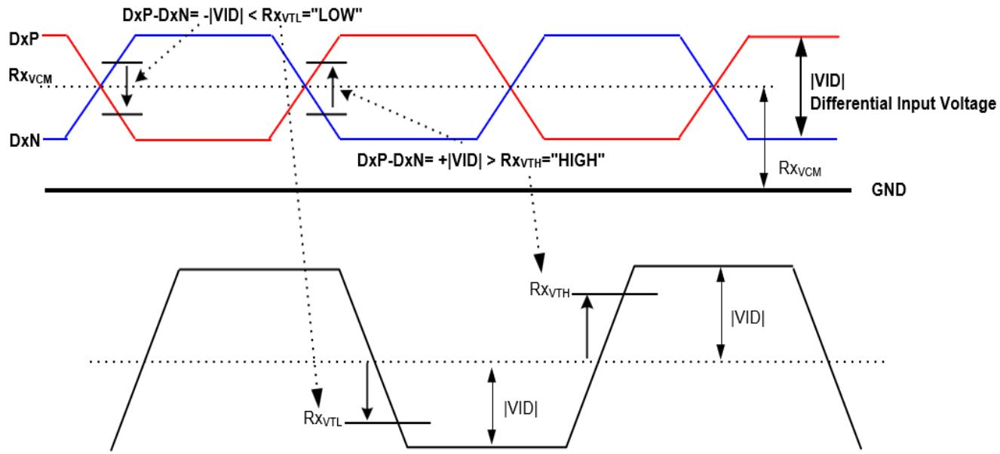  
图 10.1：LVDS 输入时序

## 10.3 AC 特性

## 10.3.1 复位输入时序

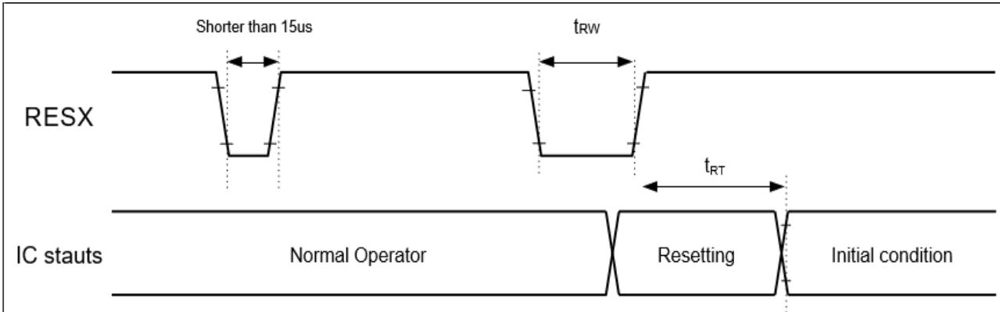

图 10.2：复位输入时序

<table><tr><td>符号</td><td>参数</td><td>相关引脚</td><td>最小值</td><td>最大值</td><td>单位</td></tr><tr><td> $t_{RW}$ </td><td>复位 “L” 脉冲宽度(2)</td><td>RESX</td><td>30</td><td>-</td><td>us</td></tr><tr><td rowspan="2"> $t_{RT}$ </td><td rowspan="2">复位完成时间(3)</td><td>-</td><td>-</td><td>5(5)</td><td>ms</td></tr><tr><td>-</td><td>-</td><td>120(6)(7)(8)</td><td>ms</td></tr></table>

## 注：

1. 复位完成时间还包括将 ID 字节从 OTP 加载到寄存器所需的时间。每当 RESX 上升沿之后 5 ms 内出现硬件复位完成时间（t ）时，都会执行该加载。

2. 根据下表，RESX 线路上的静电放电引起的尖峰不会导致系统异常复位。

<table><tr><td>RESX 脉冲</td><td>动作</td></tr><tr><td>短于 25 μs</td><td>复位被拒绝</td></tr><tr><td>长于 30 μs</td><td>复位</td></tr><tr><td>25 μs 至 30 μs 之间</td><td>复位启动</td></tr></table>

3. 在复位期间，显示屏将被消隐（当在 Sleep Out 模式下启动复位时，显示屏进入消隐序列，其最长时间为 120 ms；在 Sleep In 模式下显示屏保持消隐状态），随后恢复为硬件复位的默认状态。

4. 如下所示，尖峰抑制在有效复位脉冲期间同样适用：

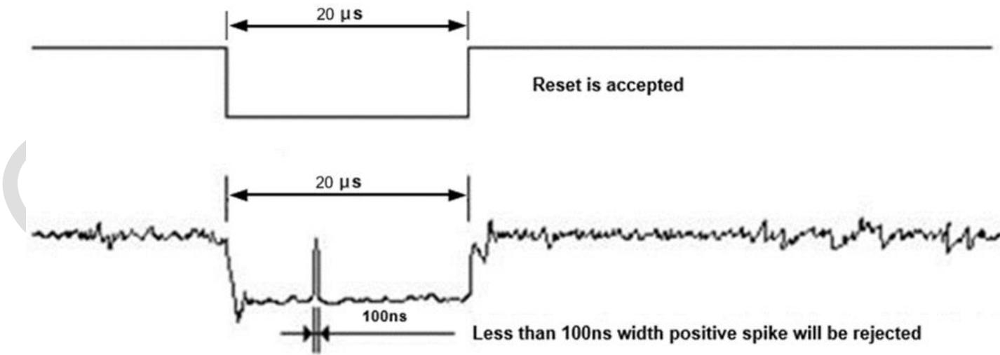  
表 10.4：复位时序  
1. 在 Sleep In 模式下施加复位时。  
2. 在 Sleep Out 模式下施加复位时。

3. 释放 RESX 后必须等待 5msec 才能发送指令。此外，在 120msec 内不能发送 Sleep Out 指令。

4. 发送 Sleep Out 指令后，必须等待 120msec 再发送 RESX。

## 10.3.2 SPI 电气特性
<table><tr><td>SPI CSB</td><td> $t_{css}$ </td><td> $t_{csh}$ </td></tr><tr><td rowspan="2">SPI_CLK</td><td colspan="2"> $t_{wc}/t_{rc}$ </td></tr><tr><td> $t_{wrl}/t_{rdl}$ </td><td> $t_{wrh}/t_{rdh}$ </td></tr><tr><td>SPI_MOSI(Write)</td><td> $t_{ds}$ </td><td> $t_{dh}$ </td></tr><tr><td>SPI_MISO(Read)</td><td> $t_{acc}$ </td><td> $t_{od}$ </td></tr></table>

图 10.3：SPI 接口 AC 特性

$( T _ { \mathsf { A } } { = } 2 5 ^ { \circ } \mathsf { C }$ , VDDI=3.3V, VCI=3.3V)

<table><tr><td>信号</td><td>符号</td><td>参数</td><td>最小值</td><td>最大值</td><td>单位</td><td>描述</td></tr><tr><td>SPI_CSB</td><td> $t_{css}$  $t_{csh}$ </td><td>片选建立时间（写） 片选建立时间（读）</td><td>4040</td><td>--</td><td>ns</td><td>-</td></tr><tr><td>SPI_CLK (写)</td><td> $t_{wc}$  $t_{wrh}$  $t_{wrl}$ </td><td>写周期控制脉冲“H”持续时间 控制脉冲“L”持续时间</td><td>1004040</td><td>--</td><td>ns</td><td>-</td></tr><tr><td>SPI_CLK (读)</td><td> $t_{rc}$  $t_{rdh}$  $t_{rdl}$ </td><td>读周期控制脉冲“H”持续时间 控制脉冲“L”持续时间</td><td>1506060</td><td>--</td><td>ns</td><td>-</td></tr><tr><td>SPI_MOSI (写)</td><td> $t_{ds}$  $t_{dt}$ </td><td>数据建立时间 数据保持时间</td><td>3030</td><td>--</td><td>ns</td><td rowspan="2">注（1）</td></tr><tr><td>SPI_MISO (读)</td><td> $t_{acc}$  $t_{od}$ </td><td>读访问时间 输出禁用时间</td><td>- 10</td><td>3550</td><td>ns</td></tr></table>

注：  
1. 对于最大值，C =30pF；对于最小值，C =8pF。  
2. 输入信号的上升时间和下降时间（tr、tf）规定为 15 ns 或更小。  
3. 对于输入信号，逻辑高电平和低电平分别规定为 VDDI 的 30% 和 70%。

表 10.5：SPI 接口 AC 特性

## 10.3.3 LVDS 电气特性

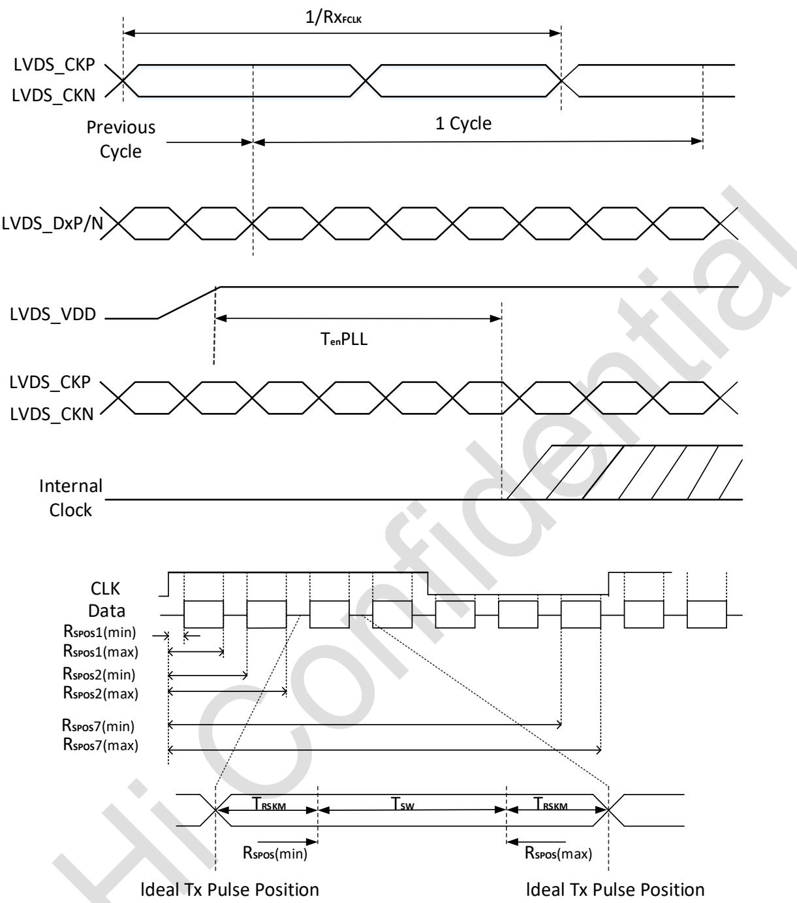  
图 10.4：LVDS AC 特性

TSW：选通宽度（内部数据采样窗口）

Rspos：接收器选通位置

TRSKM：接收器选通裕量

<table><tr><td>信号</td><td>符号</td><td>最小值</td><td>典型值</td><td>最大值</td><td>单位</td><td>描述</td></tr><tr><td>时钟频率</td><td> $R_{XFCLK}$ </td><td>20</td><td></td><td>TBD</td><td>MHz</td><td>请参考各显示分辨率对应的输入时序表</td></tr><tr><td>输入数据偏斜裕量</td><td> $T_{RSKM}$ </td><td>50</td><td></td><td>-</td><td>ps</td><td>|VID| = 200mVRxVCM = 1.2VRxFCLK = 81MHz</td></tr><tr><td>时钟高电平时间</td><td> $T_{LVCH}$ </td><td>-</td><td>4/(7x  $R_{XFCLK}$ )</td><td>-</td><td>ns</td><td>-</td></tr><tr><td>时钟低电平时间</td><td> $T_{LVCL}$ </td><td>-</td><td>3/(7x $R_{XFCLK}$ )</td><td>-</td><td>ns</td><td></td></tr><tr><td>PLL 唤醒时间</td><td> $T_{enPLL}$ </td><td>-</td><td></td><td>150</td><td>us</td><td></td></tr></table>

表 10.6：LVDS AC 特性

LVDS 接口 AC 电气特性

$$
(\mathrm{VDDI} = 3. 3 \text { to } 3. 6 \mathrm{V}, \mathrm{VSS} = \mathrm{VSSA} = 0 \mathrm{V}, \mathrm{TA} = - 4 0 \text { to } + 8 5 ^ {\circ} \mathrm{C})
$$

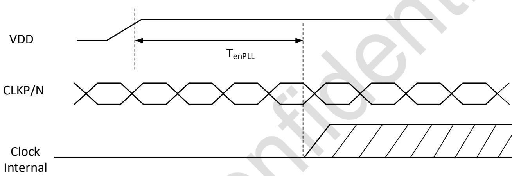  
图：VDD、LVDS 时钟与内部时钟之间的关系

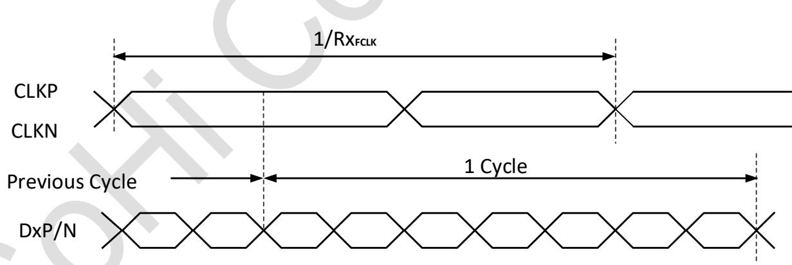  
图：LVDS 周期时间

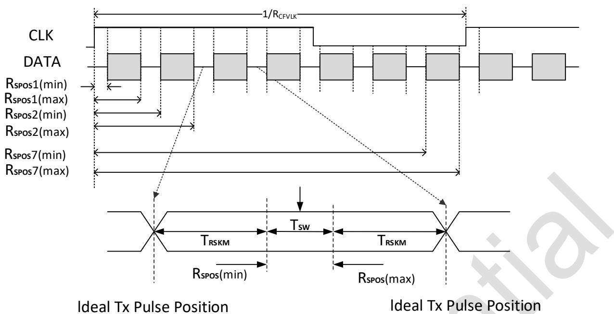

TRSKM：接收器选通裕量

RSPOS：接收器选通位置

TSW：选通宽度（内部数据采样窗口）

图：LVDS 数据偏斜

(VDDI=3.3 to 3.6V, VSS=VSSA= 0V, TA= -40 to $+ 8 5 ^ { \circ } \mathsf { C } )$

<table><tr><td>参数</td><td>符号</td><td>最小值</td><td>典型值</td><td>最大值</td><td>单位</td><td>条件</td></tr><tr><td>调制频率</td><td>SSCMF</td><td>23</td><td>-</td><td>93</td><td>KHz</td><td></td></tr><tr><td>调制速率</td><td>SSCMR</td><td>-</td><td>-</td><td>+3</td><td>%</td><td>LVDS 时钟 = 85MHz 中心扩展</td></tr></table>

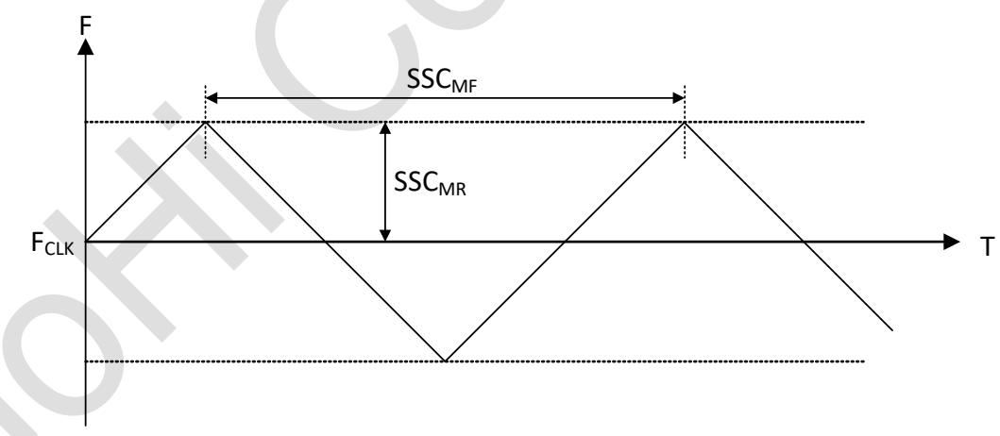  
图：频率调制

## 10.3.4 DSI D-PHY 电气特性

## D-PHY 层说明

一般而言，DSI-PHY 可能包含以下电气功能：低功耗接收器（LP-RX）、高速接收器（HS-RX）、低功耗竞争检测器（LP-CD）以及低功耗发送器（LP-TX）。图 11.5 展示了功能完备的 PHY 收发器所需的完整电气功能集合。

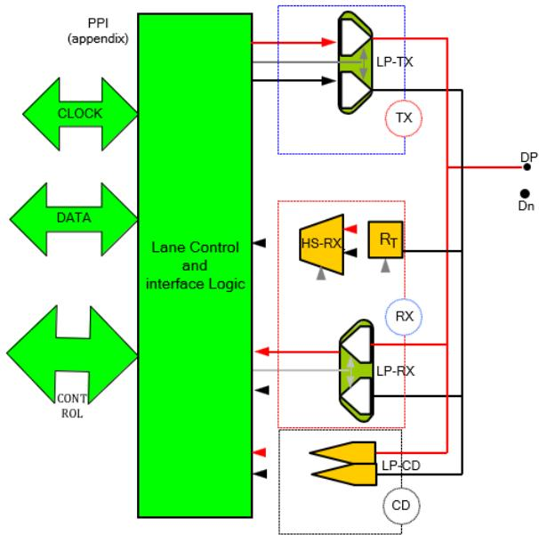  
图 10.5：D-PHY 收发器的电气功能

图 11.6 分别展示了 HS 和 LP 的电气特性信号电平。其中，HS 接收器采用低电压摆幅差分信号，LP 发送器和 LP 接收器采用低电压摆幅单端信号。由于 HS 信号电平低于 LP 低电平输入阈值，因此在正常工作过程中 Lane 会在低功耗模式与高速模式之间切换。

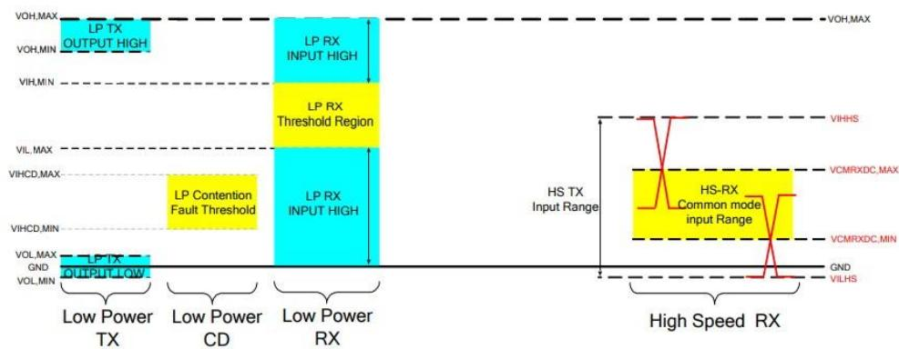  
图 10.6：HS 与 LP 信号电平

## 低功耗发送器（TX）的电气特性

低功耗 TX 应为压摆率可控的推挽驱动器，用于在所有低功耗模式下驱动线路。因此，保持 LP TX 的静态功耗尽可能低非常重要。下表列出了低功耗发送器的 DC 和 AC 特性。

<table><tr><td>参数</td><td>描述</td><td>最小值</td><td>典型值</td><td>最大值</td><td>单位</td><td>注释</td></tr><tr><td> $V_{OH}$ </td><td>戴维南输出高电平</td><td>1.1</td><td>1.2</td><td>1.3</td><td>V</td><td>-</td></tr><tr><td> $V_{OL}$ </td><td>戴维南输出低电平</td><td>-50</td><td>-</td><td>50</td><td>mV</td><td></td></tr><tr><td> $Z_{OLP}$ </td><td>LP-TX 的输出阻抗</td><td>110</td><td>-</td><td>-</td><td>Ω</td><td>(1)</td></tr></table>

注：（1）虽然未规定 $\mathsf { Z o } _ { \mathsf { L P } }$ 的最大值，但 LP 发送器的输出阻抗应确保满足 t /t 规格要求。

表 10.7：LP-TX DC 规格

<table><tr><td>参数</td><td>描述</td><td>最小值</td><td>典型值</td><td>最大值</td><td>单位</td><td>注释</td></tr><tr><td> $t_{\text{RLP/tFLP}}$ </td><td>15%-85% 上升时间和下降时间</td><td>-</td><td>-</td><td>25</td><td>ns</td><td>(1)</td></tr><tr><td> $T_{\text{LP-PER-TX}}$ </td><td>LP 异或时钟周期</td><td>90</td><td></td><td></td><td>ns</td><td></td></tr><tr><td rowspan="7">δV/δtSR</td><td>压摆率 @ CLOAD = 0pF</td><td>30</td><td>-</td><td>500</td><td>mV/ns</td><td>(1),(3),(5),(6)</td></tr><tr><td>压摆率 @ CLOAD = 5pF</td><td>-</td><td>-</td><td>300</td><td>mV/ns</td><td>(1),(3),(5),(6)</td></tr><tr><td>压摆率 @ CLOAD = 20pF</td><td>-</td><td>-</td><td>250</td><td>mV/ns</td><td>(1),(3),(5),(6)</td></tr><tr><td>压摆率 @ CLOAD = 70pF</td><td>-</td><td>-</td><td>150</td><td>mV/ns</td><td>(1),(3),(5),(6)</td></tr><tr><td>压摆率 @ CLOAD = 0 to 70pF（仅上升沿）</td><td>30</td><td>-</td><td>-</td><td>mV/ns</td><td>(1),(3),(7)</td></tr><tr><td>压摆率 @ CLOAD = 0 to 70pF（仅上升沿）</td><td>30-0.075 * (VO, INST-700)</td><td>-</td><td>-</td><td>mV/ns</td><td>(1),(8),(9)</td></tr><tr><td>压摆率 @ CLOAD = 0 to 70pF（仅下降沿）</td><td>30</td><td>-</td><td>-</td><td>mV/ns</td><td>(1),(2),(3)</td></tr><tr><td> $C_{\text{LOAD}}$ </td><td>负载电容</td><td>-</td><td>-</td><td>70</td><td>pF</td><td>-</td></tr></table>

注：  
1. CLOAD 包含低频等效传输线电容。假定 TX 和 RX 的电容始终 <10pF。对于延迟为 2ns 的传输线，分布线电容可高达 50pF。  
2. 当输出电压介于 400 mV 与 930 mV 之间时。  
3. 以输出信号跳变中任意 50 mV 区段的平均值来测量。  
4. 由于上升与下降信号斜率、翻转电平的差异以及 Dp 与 Dn LP 发送器之间的失配，该参数值可能低于 TLPX。  
5. 该值表示分段线性曲线中的一个拐点。  
6. 当输出电压处于 VPIN(absmax) 规定的范围内时。  
7. 当输出电压介于 400 mV 与 700 mV 之间时。  
8. 其中 ${ \mathsf { V O } } , { \mathsf { I N S T } }$ 为瞬时输出电压 VDP 或 VDN，单位为毫伏。  
9. 当输出电压介于 700 mV 与 930 mV 之间时。

表 10.8：LP-TX AC 规格

## 接收器（RX）的电气特性

本部分包含低功耗 RX 和高速 RX 两部分。由于二者具有不同的 DC 和 AC 特性，因此先介绍 LP-RX，再介绍 HS-RX。

## 低功耗接收器（RX）

低功耗接收器是一种未端接的单端接收器电路。LP 接收器用于检测每个引脚上的低功耗状态。为获得高鲁棒性，LP 接收器应滤除噪声脉冲和 RF 干扰。建议实现者针对低功耗优化 LP 接收器的设计。当输入毛刺小于 eSPIKE 时，LP 接收器应将其抑制。滤波器应允许宽度大于 TMIN 的脉冲通过 LP 接收器传播。图 11.7 展示了低功耗 RX 的输入毛刺抑制。此外，下表列出了 LP-RX 的 DC 和 AC 特性。

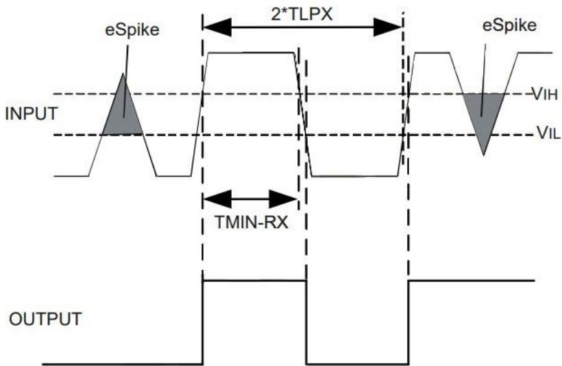

图 10.7：低功耗接收器的输入毛刺抑制

<table><tr><td>参数</td><td>描述</td><td>最小值</td><td>典型值</td><td>最大值</td><td>单位</td><td>注释</td></tr><tr><td> $V_{IH}$ </td><td>逻辑 1 输入阈值</td><td>880</td><td>-</td><td>-</td><td>mV</td><td>-</td></tr><tr><td> $V_{IL}$ </td><td>逻辑 0 输入阈值，非 ULP 状态</td><td>-</td><td>-</td><td>550</td><td>mV</td><td>-</td></tr></table>

表 10.9：LP-RX DC 规格

<table><tr><td>参数</td><td>描述</td><td>最小值</td><td>典型值</td><td>最大值</td><td>单位</td><td>注释</td></tr><tr><td> $e_{SPIKE}$ </td><td>输入脉冲抑制</td><td>-</td><td>-</td><td>300</td><td>V.ps</td><td>1, 2, 3</td></tr><tr><td> $T_{MIN}$ </td><td>最小脉冲宽度响应</td><td>20</td><td>-</td><td>-</td><td>ns</td><td>4</td></tr><tr><td> $V_{INT}$ </td><td>峰峰值干扰电压</td><td>-</td><td>-</td><td>200</td><td>mV</td><td>-</td></tr><tr><td> $f_{INT}$ </td><td>干扰频率</td><td>450</td><td>-</td><td>-</td><td>MHz</td><td>-</td></tr></table>

注：

1. 处于 LP-0 状态时高于 VIL、或处于 LP-1 状态时低于 VIH 的尖峰的时间-电压积分

2. 小于该值的脉冲不会改变接收器状态。

3. 除所需的毛刺抑制外，实现者还应确保抑制已知的 RF 干扰源。

4. 大于该值的输入脉冲应使输出翻转。

表 10.10：LP-RX AC 规格

## 线路竞争检测

可通过以下条件推断竞争：

1. 当 LP 发送器驱动高电平且引脚电压低于 VIL 时，检测到 LP 高电平故障。

2. 当 LP 发送器驱动低电平且焊盘引脚电压高于 VIHCD 时，应检测到 LP 低电平故障。

<table><tr><td>参数</td><td>描述</td><td>最小值</td><td>典型值</td><td>最大值</td><td>单位</td><td>注释</td></tr><tr><td> $V_{IHCD}$ </td><td>逻辑 1 竞争阈值</td><td>450</td><td>-</td><td>-</td><td>mV</td><td>-</td></tr><tr><td> $V_{ILCD}$ </td><td>逻辑 0 竞争阈值</td><td>-</td><td>-</td><td>200</td><td>mV</td><td>-</td></tr></table>

表 10.11：竞争检测器 DC 规格

## 高速接收器（RX）

HS 接收器是一种差分线路接收器。它在正输入引脚 Dp 与负输入引脚 Dn 之间包含一个可切换的并联输入端接 ZID。下表列出了 HS-RX 的 DC 和 AC 特性

<table><tr><td>参数</td><td>描述</td><td>最小值</td><td>典型值</td><td>最大值</td><td>单位</td><td>注释</td></tr><tr><td> $V_{CMRXDC}$ </td><td>HS 接收模式共模电压</td><td>70</td><td>-</td><td>330</td><td>mV</td><td>(1),(2)</td></tr><tr><td> $V_{IDTH}$ </td><td>差分输入高阈值</td><td>-</td><td>-</td><td>70</td><td>mV</td><td>-</td></tr><tr><td> $V_{IDTL}$ </td><td>差分输入低阈值</td><td>-70</td><td>-</td><td>-</td><td>mV</td><td>-</td></tr><tr><td> $V_{IHHS}$ </td><td>单端输入高电压</td><td>-</td><td>-</td><td>460</td><td>mV</td><td>(1)</td></tr><tr><td> $V_{ILHS}$ </td><td>单端输入低电压</td><td>-40</td><td>-</td><td>-</td><td>mV</td><td>(1)</td></tr><tr><td> $Z_{ID}$ </td><td>差分输入阻抗</td><td>80</td><td>100</td><td>125</td><td>Ω</td><td>-</td></tr></table>

注：  
1. 不包括 450MHz 以上 100mV 峰值正弦波可能带来的额外 RF 干扰。

2. 表中数值已包含发送器与接收器之间 50mV 的地电位差、静态共模电平容差以及 450MHz 以下的波动

表 10.12：HS 接收器 DC 规格

<table><tr><td>参数</td><td>描述</td><td>最小值</td><td>典型值</td><td>最大值</td><td>单位</td><td>注释</td></tr><tr><td> $\Delta V_{CMRX(HF)}$ </td><td>450 MHz 以上的共模干扰</td><td>-</td><td>-</td><td>100</td><td> $mV_{pp}$ </td><td>(1)</td></tr><tr><td> $C_{CM}$ </td><td>共模端接</td><td>-</td><td>-</td><td>60</td><td>pF</td><td>(2)</td></tr></table>

## 注：

1. ΔVCMRX(HF) 是叠加在接收器输入端上的正弦波峰值幅度。

2. 对于更高的比特率，需要 14pF 电容才能满足共模回波损耗规格。

表 10.13：HS 接收器 AC 规格

## 高速数据时钟时序

本节规定高速信号接口所需的时序，与信号的电气特性无关。PHY 在前向（Forward）方向上为源同步接口。无论处于前向还是反向信令模式，都应只有一个时钟源。在反向方向上，时钟沿前向方向发送，并使用四种可能边沿中的一种来发送数据。

链路的 Master 侧应向 Slave 侧发送差分时钟信号，用于数据采样。该信号应为 DDR（半速率）时钟，每个数据比特时间应有一个跳变。正确数据采样所需的所有时序关系均相对于时钟跳变来定义。因此，实现中可以对时钟使用扩频调制以降低 EMI。

DDR 时钟信号应与数据信号保持正交相位关系。数据应在时钟信号的上升沿和下降沿均被采样。“上升沿”一词指“差分信号（即 CLKP – CLKN）的上升沿”，下降沿同理。因此，时钟信号的周期应为两个连续瞬时数据比特时间之和。该关系如图 10.8 所示。

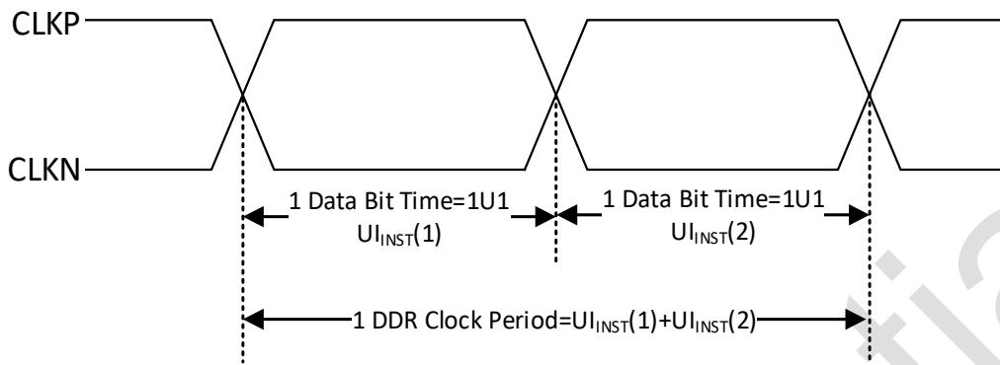  
图 10.8：DDR 时钟定义

同一时钟源用于生成 DDR 时钟并发送串行数据。由于时钟和数据信号在具有规定偏斜的信道上一起传播，因此可以直接使用时钟在接收器中采样数据线。这样的系统能够容忍 UI 的较大瞬时变化。

允许的瞬时 UI 变化可能导致较大的瞬时数据速率变化。因此，器件应通过 PHY 之外适当的 FIFO 逻辑来容忍这些瞬时变化，或者向 Lane 模块提供精确的时钟源以消除这些瞬时变化。

时钟信号的 UIINST 规格汇总于下表。

<table><tr><td>参数</td><td>符号</td><td>最小值</td><td>典型值</td><td>最大值</td><td>单位</td><td>注释</td></tr><tr><td>UI 瞬时值</td><td> $UI_{INST}$ </td><td>-</td><td>-</td><td>3.33</td><td>ns</td><td>(1), (2), (3), (4), (5)</td></tr></table>

## 注：

1. 该值对应于最低 300 Mbps 的数据速率。

2. 对于任何单个比特周期（即数据突发中的任何 DDR 半周期），都不得违反最小 UI。

3. 对于 2 条数据 lane、24 位数据格式，最大总比特率为 700Mbps/lane

4. 对于 3 条数据 lane、24 位数据格式，最大总比特率为 700Mbps/lane

5. 对于 4 条数据 lane、24 位数据格式，最大总比特率为 500Mbps/lane

## 表 10.14：反向 HS 数据传输时序参数

DDR 时钟差分信号与数据差分信号的时序关系如图 11.9 所示。数据以与时钟正交的关系发送，从而接收器可以直接使用时钟信号边沿对接收到的数据进行采样。

发送器应确保在传输突发的第一个有效载荷比特期间发送 DDR 时钟的上升沿，使得接收器可以在时钟上升沿采样第一个有效载荷比特，在下降沿采样第二个比特，并以此类推在交替的上升沿和下降沿采样后续所有比特。

所有时序值均相对于实际观测到的时钟差分信号交叉点来测量。由该电平变化引起的效应已包含在时钟到数据的时序预算中。

接收器输入失调和阈值效应应作为接收器建立

和保持参数的一部分加以考虑。
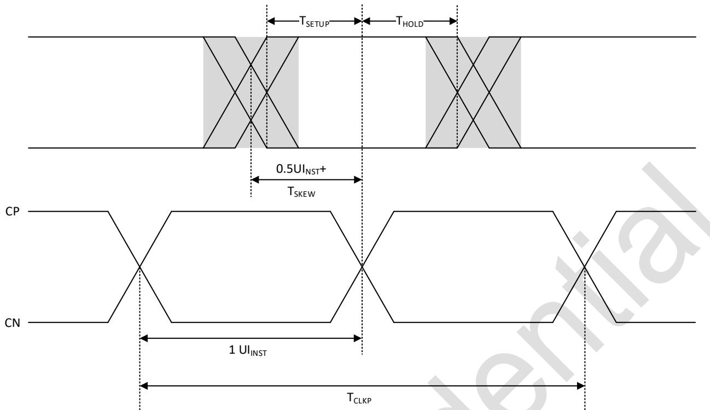  
图 10.9：数据到时钟的时序定义

## 数据-时钟时序规范

数据-时钟时序规范如表 11.15 所示。实现者应指定一个值 UIINST,MIN，它表示在给定的实现方案中，高速数据传输内可能出现的最小瞬时 UI。表 11.15 中的参数均以该值为基准来规定。建立时间和保持时间分别为 TSETUP[RX] 和 THOLD[RX]，它们描述数据信号与时钟信号之间的时序关系。T 是数据在时钟上升沿或下降沿之前必须保持有效的最短时间，而 THOLD[RX] 是数据在时钟上升沿或下降沿之后必须保持其当前状态的最短时间。接收器的时序预算规范应表示在接收器于规定的最大可接受误码率下工作时，接收器端可观测到的最小变化量。

时序预算的意图是留出 0.4\*UI，即 ±0.2\*UI，作为互连所贡献的劣化余量。

<table><tr><td>参数</td><td>符号</td><td>最小值</td><td>典型值</td><td>最大值</td><td>单位</td><td>备注</td></tr><tr><td>数据到时钟的建立时间 [RX]</td><td> $T_{SETUP[RX]}$ </td><td>0.15</td><td>-</td><td>-</td><td>UIINST</td><td>1</td></tr><tr><td>时钟到数据的保持时间 [RX]</td><td> $T_{HOLD[RX]}$ </td><td>0.15</td><td>-</td><td>-</td><td>UIINST</td><td>1</td></tr></table>

## 备注：

1. 接收器总的建立与保持窗口为 0.3\*UIINST。

表 10.15：数据到时钟的时序规范  
突发模式数据传输  
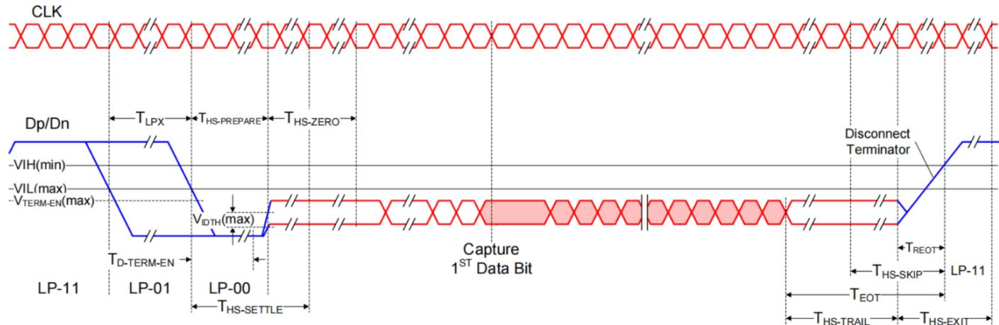

图 11.10：突发模式下的高速数据传输

<table><tr><td>参数</td><td>说明</td><td>最小值</td><td>典型值</td><td>最大值</td><td>单位</td></tr><tr><td> $T_{LPX}$ </td><td>任一低功耗（Low-Power）状态周期被发送的持续时间长度</td><td>50</td><td>-</td><td>-</td><td>ns</td></tr><tr><td> $T_{HS-PREPARE}$ </td><td>发送器在启动 HS 传输的 HS-0 线路状态之前，立即驱动数据通道 LP-00 线路状态的时间</td><td>40 + 4*UI</td><td>-</td><td>85 + 6*UI</td><td>ns</td></tr><tr><td> $T_{HS-PREPARE}+T_{HS-ZERO}$ </td><td> $T_{HS-PREPARE}+发送器在发送 Sync 序列之前驱动 HS-0 状态的时间。$ </td><td>145 + 10*UI</td><td>-</td><td>-</td><td>ns</td></tr><tr><td> $T_{D-TERM-EN}$ </td><td>数据通道接收器使能 HS 线路终端（termination）所需的时间。</td><td>-</td><td>-</td><td>35 + 4*UI</td><td>ns</td></tr><tr><td> $T_{HS-SETTLE}$ </td><td>HS 接收器应忽略任何数据通道 HS 跳变的时间间隔。</td><td>85 + 6*UI</td><td>-</td><td>145 + 10*UI</td><td>ns</td></tr><tr><td> $T_{HS-TRAIL}$ </td><td>在一次 HS 传输突发的最后一个有效载荷数据位之后，发送器驱动翻转差分状态的时间</td><td>Max( n*8*UI, 60+n*4*UI)</td><td>-</td><td>-</td><td>ns</td></tr><tr><td> $T_{HS-EXIT}$ </td><td>在一次 HS 突发之后，发送器驱动 LP-11 的时间。</td><td>100</td><td>-</td><td>-</td><td>ns</td></tr></table>

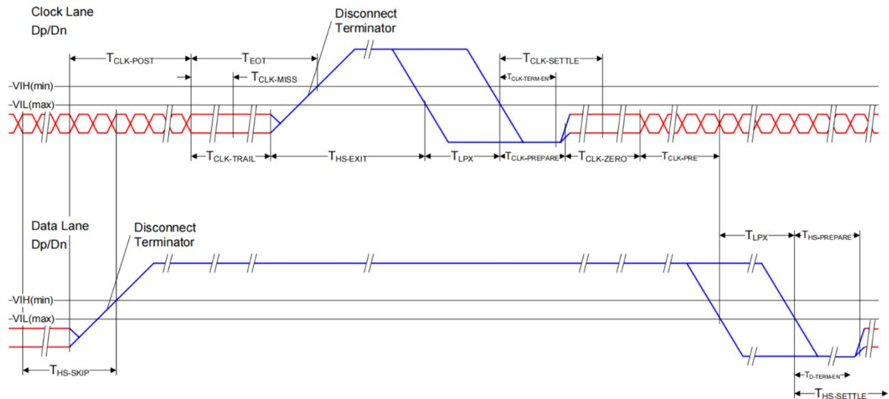

图 10.11：时钟通道在时钟传输与低功耗模式之间的切换

<table><tr><td>参数</td><td>说明</td><td>最小值</td><td>典型值</td><td>最大值</td><td>单位</td></tr><tr><td> $T_{CLK-POST}$ </td><td>在最后一条关联的数据通道转换到 LP 模式之后，发送器继续发送 HS 时钟的时间。</td><td>60 + 52*UI</td><td>-</td><td>-</td><td>ns</td></tr><tr><td> $T_{CLK-PRE}$ </td><td>在任一关联的数据通道开始从 LP 模式向 HS 模式转换之前，发送器应驱动 HS 时钟的时间。</td><td>8*UI</td><td>-</td><td>-</td><td>ns</td></tr><tr><td> $T_{CLK-PREPARE}$ </td><td>发送器在启动 HS 传输的 HS-0 线路状态之前，立即驱动时钟通道 LP-00 线路状态的时间。</td><td>38</td><td>-</td><td>95</td><td>ns</td></tr><tr><td> $T_{CLK-PREPARE}+ T_{CLK-ZERO}$ </td><td> $T_{CLK-PREPARE}+发送器在启动时钟之前驱动 HS-0 状态的时间。$ </td><td>300</td><td>-</td><td>-</td><td>ns</td></tr><tr><td> $T_{CLK-TERM-EN}$ </td><td>时钟通道接收器使能 HS 线路终端（termination）所需的时间。</td><td>-</td><td>-</td><td>38</td><td>ns</td></tr><tr><td> $T_{CLK-TRAIL}$ </td><td>在一次 HS 传输突发的最后一个有效载荷时钟位之后，发送器驱动 HS-0 状态的时间。</td><td>60</td><td>-</td><td>-</td><td>ns</td></tr><tr><td> $T_{HS-EXIT}$ </td><td>在一次 HS 突发之后，发送器驱动 LP-11 的时间。</td><td>100</td><td>-</td><td>-</td><td>ns</td></tr></table>

11 芯片信息

11.1 PAD 分配 待定

11.2 对准标记（单位：um）待定

12 面板应用图 12.1 单栅极驱动  
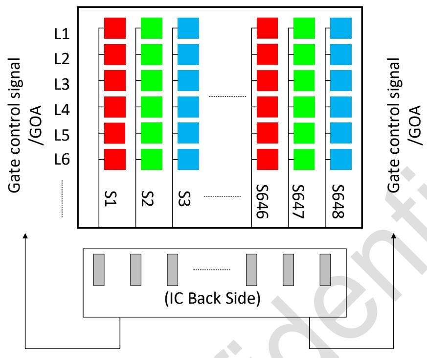

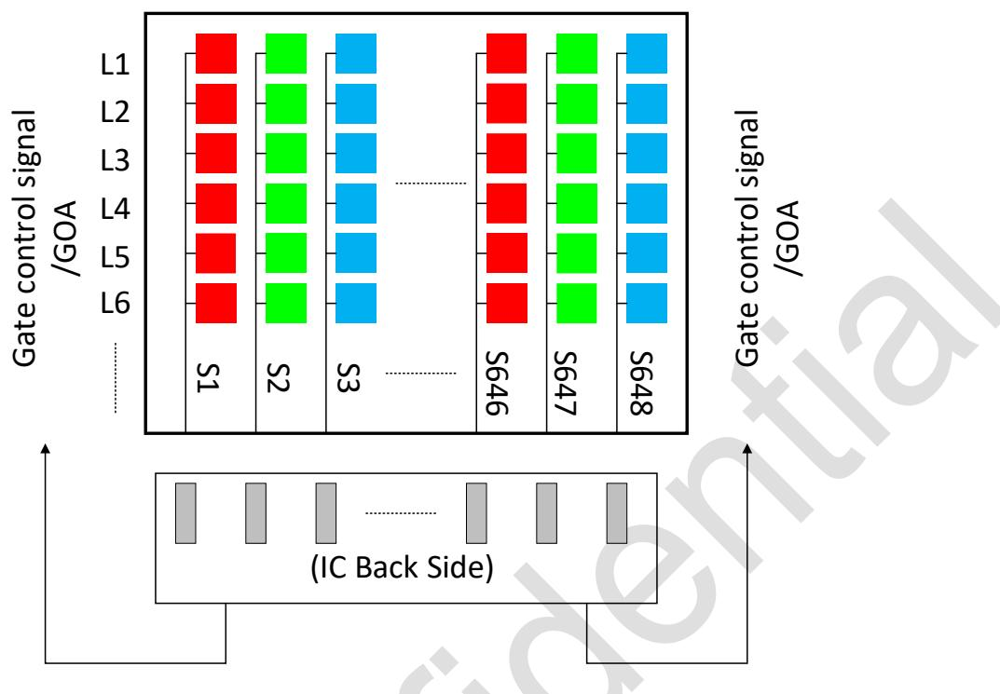

12.2 单栅极 + Zigzag Type1 驱动 ZigZag Type A  
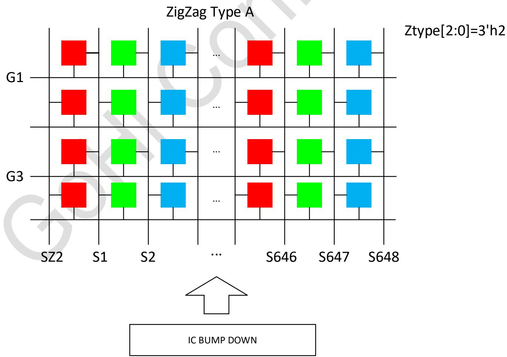

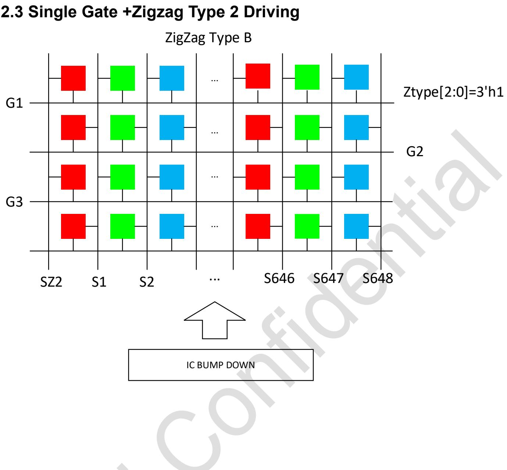