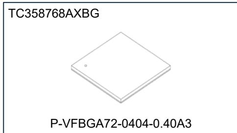
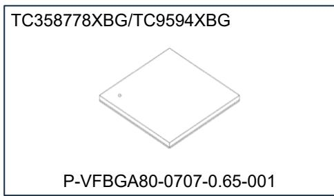
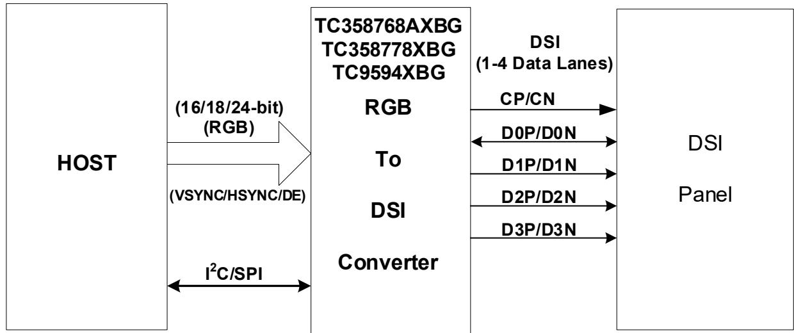
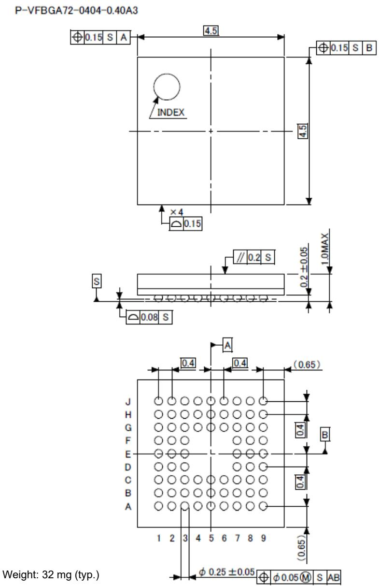
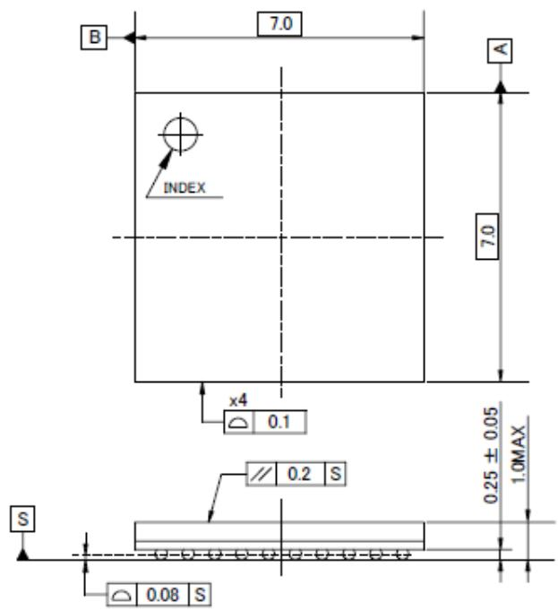
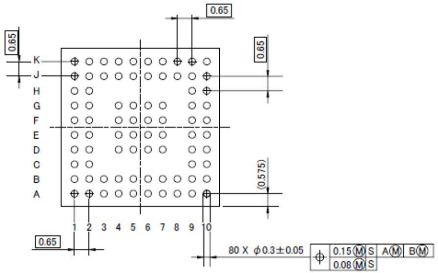

CMOS 数字集成电路 硅单片

# TC358768AXBG/TC358778XBG/TC9594XBG

## 移动外设器件

## 概述

并行端口转 MIPI® DSI®（TC358768AXBG/TC358778XBG/ TC9594XBG）是一款将 RGB 转换为 DSI 的桥接器件。所有内部寄存器均可通过 I2C 或 SPI 访问。

  
重量：32 mg（典型值）

## 特性

## ● DSI-TX 接口

\- 符合 MIPI DSI 规范

支持 DSI Video Mode（视频模式）数据传输。通过 DCSSM 命令访问面板寄存器。

\- 每条数据通道最高支持 1 Gbps。

  
重量：68 mg（典型值）

\- 支持 1、2、3 或 4 条数据通道。

\- 支持 RGB888/666/565 视频数据格式。

## ● RGB 接口

\- 支持 RGB888/666/565 数据格式。

\- 输入时钟最高 166 MHz。

\- 支持 VSYNC/HSYNC 极性可选（默认低电平）。

\- 支持 DE 极性可选（默认高电平）。

● I2C/SPI 目标接口（可选择 I2C 或 SPI 接口）

\- I2C 接口（当 CS = L 时）

支持标准模式（100 kHz）、快速模式（400 kHz）和特殊模式（1 MHz）。配置 TC358768AXBG/

TC358778XBG/TC9594XBG 的所有内部寄存器。

写入 DCS 寄存器将触发通过 DSI 发送 DCS 命令。

## - SPI 接口（当 CS = H 时）

SPI 接口最高支持 25 MHz 工作频率。

配置 TC358768AXBG/

TC358778XBG/TC9594XBG 的所有内部寄存器。

写入 DCS 寄存器将触发 DCS

命令通过 DSI 发送。

## ● GPIO 信号

\- 2 个 GPIO 信号

两个 GPIO 信号可配置为 SPI 信号（SPI\_SS 和 SPI\_MISO）。或者一个 GPIO 信号可配置为中断输出信号 INT。

## ● 系统

\- 支持时钟和电源管理，以实现低功耗状态。

● 电源输入

\- 内核与 MIPI D-PHYSM：1.2 V

\- I/O：1.8 V 或 3.3 V

● 典型功耗 - WXGA @60 fps：Pixel Clk：74.25 MHz，DSIClk：312 MHz → 66.7 mW

1080P @60 fps：Pixel Clk：148.5 MHz，DSIClk：471 MHz → 91.5 mW

\- 通过关闭时钟源 PCLK 和 REFCLK 进入断电（Power Down）状态。

## 目录

特性 .... 1
参考文献 .... 4
1. 概述 .... 5
2. 特性 .... 6
3. 外部引脚 .... 7
3.1. TC358768AXBG 引脚说明 .... 7
3.2. TC358768AXBG BGA72 引脚数量汇总 .... 8
3.3. TC358778XBG/TC9594XBG 引脚说明 .... 9
3.4. TC358778XBG/TC9594XBG BGA80 引脚数量汇总 .... 10
3.5. TC358768AXBG 引脚布局.... 11
3.6. TC358778XBG/TC9594XBG 引脚布局 .... 12
4. 封装 .... 13
4.1. TC358768AXBG 封装.... 13
4.2. TC358778XBG/TC9594XBG 封装 .... 14
5. 电气特性 .... 15
5.1. 绝对最大额定值.... 15
5.2. 工作条件.... 15
5.3. 直流电气规格 .... 16
6. 修订历史 .... 17
产品使用限制 .... 18

## 图目录

图 1.1 采用 TC358768AXBG/TC358778XBG/TC9594XBG 实现 RGB 转 DSI-TX 的系统概览 .... 5
图 3.1 TC358768AXBG 72 引脚布局（俯视图）.... 11
图 3.2 TC358778XBG/TC9594XBG 80 引脚布局（俯视图）.... 12
图 4.1 TC358768AXBG P-VFBGA72-0404-0.40A3 封装.... 13
图 4.2 TC358778XBG/TC9594XBG P-VFBGA80-0707-0.65-001 封装.... 14

## 表目录

表 3.1 TC358768AXBG 功能信号列表....7
表 3.2 TC358768AXBG BGA 72 引脚数量汇总....8
表 3.3 TC358778XBG/TC9594XBG 功能信号列表....9
表 3.4 TC358778XBG/TC9594XBG BGA 80 引脚数量汇总....10
表 4.1 TC358768AXBG P-VFBGA72-0404-0.40A3 机械尺寸....13
表 4.2 TC358778XBG/TC9594XBG P-VFBGA80-0707-0.65-001 机械尺寸....14
表 6.1 修订历史....17

## 免责声明通知

本文所含材料并不构成对本材料或 MIPI 的任何作者或开发者所拥有或控制的任何知识产权（IPR）的明示或默示许可。本文所含材料按“原样”（AS IS）提供，并且在适用法律允许的最大范围内，本材料按“原样”且“连同一切瑕疵”（AS IS AND WITH ALL FAULTS）提供，本材料及 MIPI 的作者和开发者特此否认所有其他明示、默示或法定的保证和条件，包括但不限于任何（如有）关于适销性、特定用途适用性、答复的准确性或完整性、结果、专业水准的努力、无病毒以及无过失的默示保证、义务或条件。

本文所含的所有材料均受版权法保护，未经 MIPI Alliance 事先明确书面许可，不得以任何方式复制、再出版、分发、传输、展示、广播或以其他方式利用。MIPI、MIPI Alliance 以及点状彩虹弧标志和所有相关商标、商号及其他知识产权均为 MIPI Alliance 的专有财产，未经其事先明确书面许可不得使用。

此外，对于本材料或本文档内容，不存在关于所有权状况、平静享有、平静占有、与描述相符或不侵权的保证。在任何情况下，本材料或本文档内容的任何作者或开发者或 MIPI 均不对任何其他方承担以下责任：为采购替代商品或服务而发生的费用、利润损失、使用损失、数据丢失，或任何附带性、后果性、直接、间接或特殊损害，无论是基于合同、侵权、保证还是其他原因，以任何方式因本材料或与本材料相关的任何其他协议、规范或文档而产生，无论该方是否已事先获悉此类损害发生的可能性。

在不限制上述免责声明普遍适用性的前提下，本文档内容的使用者还需知悉，MIPI：(a) 不评估、测试或核实本文档内容的准确性、可靠性或可信度；(b) 不监控或强制要求遵守本文档内容；并且 (c) 不认证、测试或以任何方式调查产品或服务，或任何声称符合本文档内容的主张。使用或实施本文档内容可能涉及或需要使用知识产权（“IPR”），包括（但不限于）由一方或多方（无论是否为 MIPI 成员）拥有的专利、专利申请或版权。MIPI 不进行任何知识产权检索或调查，也不要求或请求披露与本文档内容有关的任何知识产权或知识产权主张。

有关本文档或其提供条款和条件的问题，请联系：

MIPI Alliance, Inc. c/o IEEE-ISTO 445 Hoes Lane Piscataway, NJ 08854 收件人：Board Secretary

本免责声明通知适用于本文档中所有与 DSI 输入和处理路径相关的描述。

## 参考文献

1. MIPI DSI，“mipi\_DSI\_specification\_v01-02-00，2010 年 6 月 28 日”

2. MIPI DCS“DRAFT mipi\_DCS\_specification\_v01-02-00\_r0-02，2008 年 12 月”

3. MIPI D-PHY，“mipi\_D-PHY\_specification\_v01-00-00，2009 年 5 月 14 日”

4. I2C 总线规范，版本 2.1，2000 年 1 月，Philips Semiconductor

● MIPI、DSI、D-PHY 和 DCS 是 MIPI Alliance, Inc. 的商标、服务标记和注册服务标记。

● 其他公司名称、产品名称和服务名称可能是其各自公司的商标。

## 1. 概述

并行端口转 MIPI DSI（TC358768AXBG/TC358778XBG/TC9594XBG）是一款将 RGB 转换为 DSI 的桥接器件。所有内部寄存器均可通过 I2C 或 SPI 访问。

  
图 1.1 采用 TC358768AXBG/TC358778XBG/TC9594XBG 实现 RGB 转 DSI-TX 的系统概览

## 2. 特性

以下为 TC358768AXBG/TC358778XBG/TC9594XBG 支持的主要特性。

DSI-TX 接口

\- 符合 MIPI DSI 规范。

支持 DSI Video Mode 数据传输。

用于面板寄存器访问的 DCS 命令。

\- 每条数据通道最高支持 1 Gbps。

支持 1、2、3 或 4 条数据通道。

\- 支持 RGB888/666/565 视频数据格式。

## RGB 接口

\- 支持 RGB888/666/565 数据格式。

\- 输入时钟最高 166 MHz。

\- 支持 VSYNC/HSYNC 极性可选（默认低电平）。

\- 支持 DE 极性可选（默认高电平）。

● I2C/SPI 目标接口（可选择 I2C 或 SPI 接口）

\- I2C 接口（当 CS = L 时）

支持标准模式（100 kHz）、快速模式（400 kHz）和特殊模式（1 MHz）。配置 TC358768AXBG/TC358778XBG/TC9594XBG 的所有内部寄存器。写入 DCS 寄存器将触发通过 DSI 发送 DCS 命令。

SPI 接口（当 CS = H 时）

SPI 接口最高支持 25 MHz 工作频率。

配置 TC358768AXBG/TC358778XBG/TC9594XBG 的所有内部寄存器。

写入 DCS 寄存器将触发通过 DSI 发送 DCS 命令。

● GPIO 信号

2 个 GPIO 信号

两个 GPIO 信号可配置为 SPI 信号（SPI\_SS 和 SPI\_MISO）。或者一个 GPIO 信号可配置为中断输出信号 INT。

## ● 系统

\- 支持时钟和电源管理，以实现低功耗状态。

● 电源输入

\- 内核与 MIPI D-PHY：1.2 V

I/O：1.8 V 或 3.3 V

● 典型功耗

\- WXGA@60 fps：Pixel Clk：74.25 MHz，DSIClk：312 MHz → 66.7 mW

\- 1080P@60 fps：Pixel Clk：148.5 MHz，DSIClk：471 MHz → 91.5 mW

<table><tr><td rowspan="2"></td><td>VDDC</td><td>VDDIO</td><td>VDDMIPI</td><td rowspan="2" colspan="2">总功耗</td></tr><tr><td>1.2 V</td><td>3.3 V</td><td>1.2 V</td></tr><tr><td rowspan="2">1080P 视频</td><td>42.8 mA</td><td>0.4 mA</td><td>32.3 mA</td><td></td><td></td></tr><tr><td>51.4 mW</td><td>1.3 mW</td><td>38.8 mW</td><td>91.5</td><td>mW</td></tr><tr><td rowspan="2">WXGA 视频</td><td>34.7 mA</td><td>0.2 mA</td><td>20.4 mA</td><td></td><td></td></tr><tr><td>41.7 mW</td><td>0.6 mW</td><td>24.4 mW</td><td>66.7</td><td>mW</td></tr><tr><td rowspan="2">断电（无 PCLK、REFCLK）</td><td>0.07 mA</td><td>0.03 mA</td><td>0.01 mA</td><td></td><td></td></tr><tr><td>0.09 mW</td><td>0.08 mW</td><td>0.01 mW</td><td>0.18</td><td>mW</td></tr></table>

\- 通过关闭时钟源 PCLK 和 REFCLK 进入断电（Power Down）状态。

## 3. 外部引脚

## 3.1. TC358768AXBG 引脚说明

TC358768AXBG 采用 BGA72 引脚封装。

下表列出 TC358768AXBG 的信号及其功能。

表 3.1 TC358768AXBG 功能信号列表

<table><tr><td>组</td><td>引脚名称</td><td>I/O</td><td>类型</td><td>功能</td><td>备注</td></tr><tr><td rowspan="4">系统：复位与时钟（4）</td><td>RESX</td><td>I</td><td>Sch</td><td>系统复位输入，低电平有效</td><td>—</td></tr><tr><td>REFCLK</td><td>I</td><td>N</td><td>参考时钟输入（6 MHz 至 40 MHz）</td><td>—</td></tr><tr><td>MSEL</td><td>I</td><td>N</td><td>模式选择1&#x27;b0：测试模式1&#x27;b1：正常模式</td><td>—</td></tr><tr><td>CS</td><td>I</td><td>N</td><td>配置选择- 当 CS = L 时，使能 I2C 接口- 当 CS = H 时，使能 SPI 接口</td><td>—</td></tr><tr><td rowspan="10">MIPI-DSI (10)</td><td>MIPI_CP</td><td>—</td><td>PHY</td><td>MIPI-DSI 时钟正端</td><td>—</td></tr><tr><td>MIPI_CN</td><td>—</td><td>PHY</td><td>MIPI-DSI 时钟负端</td><td>—</td></tr><tr><td>MIPI_DOP</td><td>—</td><td>PHY</td><td>MIPI-DSI 数据 0 正端</td><td>—</td></tr><tr><td>MIPI_DON</td><td>—</td><td>PHY</td><td>MIPI-DSI 数据 0 负端</td><td>—</td></tr><tr><td>MIPI_D1P</td><td>—</td><td>PHY</td><td>MIPI-DSI 数据 1 正端</td><td>—</td></tr><tr><td>MIPI_D1N</td><td>—</td><td>PHY</td><td>MIPI-DSI 数据 1 负端</td><td>—</td></tr><tr><td>MIPI_D2P</td><td>—</td><td>PHY</td><td>MIPI-DSI 数据 2 正端</td><td>—</td></tr><tr><td>MIPI_D2N</td><td>—</td><td>PHY</td><td>MIPI-DSI 数据 2 负端</td><td>—</td></tr><tr><td>MIPI_D3P</td><td>—</td><td>PHY</td><td>MIPI-DSI 数据 3 正端</td><td>—</td></tr><tr><td>MIPI_D3N</td><td>—</td><td>PHY</td><td>MIPI-DSI 数据 3 负端</td><td>—</td></tr><tr><td rowspan="2">I2C (2)</td><td>I2C_SCL</td><td>OD</td><td>Sch</td><td>I2C 串行时钟或 SPI_SCLK</td><td>4 mA</td></tr><tr><td>I2C_SDA</td><td>OD</td><td>Sch</td><td>I2C 串行数据或 SPI_MOSI</td><td>4 mA</td></tr><tr><td rowspan="5">并行端口接口（28）</td><td>PD[23:0]</td><td>I</td><td>N</td><td>并行端口输入数据注：PD[23:16] 可配置为 GPIO[10:3]</td><td>—</td></tr><tr><td>VSYNC</td><td>I</td><td>N</td><td>并行端口 VSYNC 信号</td><td>—</td></tr><tr><td>HSYNC</td><td>I</td><td>N</td><td>并行端口 HSYNC 信号</td><td>—</td></tr><tr><td>DE</td><td>I</td><td>N</td><td>并行端口 DE 信号</td><td>—</td></tr><tr><td>PCLK</td><td>I</td><td>N</td><td>并行端口时钟信号</td><td>—</td></tr><tr><td>GPIO (2)</td><td>GPIO[2:1]</td><td>I/O</td><td>N</td><td>GPIO[2:1] 信号-（GPIO[1] 可选用作 SPI_SSor INT 信号）-（GPIO[2] 可选用作 SPI_MISO 信号）</td><td>4 mA</td></tr><tr><td rowspan="3">电源（9）</td><td>VDDC (1.2 V)</td><td>NA</td><td>—</td><td>内部内核 VDD（3）</td><td>—</td></tr><tr><td>VDDIO(1.8 V or 3.3 V)</td><td>NA</td><td>—</td><td>VDDIO 用于 IO 电源（4）</td><td>—</td></tr><tr><td>VDD_MIPI(1.2 V)</td><td>NA</td><td>—</td><td>MIPI 的 VDD（2）</td><td>—</td></tr><tr><td>接地（17）</td><td>VSS</td><td>NA</td><td>—</td><td>接地</td><td>—</td></tr></table>

## 3.2. TC358768AXBG BGA72 引脚数量汇总

表 3.2 TC35  
8768AXBG BGA 72 引脚数量汇总

<table><tr><td>组名称</td><td>引脚数量</td><td>备注</td></tr><tr><td>系统</td><td>4</td><td>—</td></tr><tr><td>MIPI-DSI</td><td>10</td><td>—</td></tr><tr><td> $I^{2}C$  IF</td><td>2</td><td>—</td></tr><tr><td>GPIO</td><td>2</td><td>—</td></tr><tr><td>并行端口接口</td><td>28</td><td>—</td></tr><tr><td>电源</td><td>9</td><td>IO、MIPI 和内核电源</td></tr><tr><td>接地</td><td>17</td><td>—</td></tr><tr><td>合计</td><td>72</td><td>—</td></tr></table>

## 3.3. TC358778XBG/TC9594XBG 引脚说明

TC358778XBG/TC9594XBG 采用 BGA80 引脚封装。

下表列出 TC358778XBG/TC9594XBG 的信号及其功能。

表 3.3 TC358778XBG/TC9594XBG 功能信号列表

<table><tr><td>组</td><td>引脚名称</td><td>I/O</td><td>类型</td><td>功能</td><td>备注</td></tr><tr><td rowspan="4">系统：复位与时钟（4）</td><td>RESX</td><td>I</td><td>Sch</td><td>系统复位输入，低电平有效</td><td>—</td></tr><tr><td>REFCLK</td><td>I</td><td>N</td><td>参考时钟输入（6 MHz 至 40 MHz）</td><td>—</td></tr><tr><td>MSEL</td><td>I</td><td>N</td><td>模式选择1&#x27;b0：测试模式1&#x27;b1：正常模式</td><td>—</td></tr><tr><td>CS</td><td>I</td><td>N</td><td>配置选择- 当 CS = L 时，使能 I2C 接口- 当 CS = H 时，使能 SPI 接口</td><td>—</td></tr><tr><td rowspan="10">MIPI-DSI (10)</td><td>MIPI_CP</td><td>—</td><td>PHY</td><td>MIPI-DSI 时钟正端</td><td>—</td></tr><tr><td>MIPI_CN</td><td>—</td><td>PHY</td><td>MIPI-DSI 时钟负端</td><td>—</td></tr><tr><td>MIPI_D0P</td><td>—</td><td>PHY</td><td>MIPI-DSI 数据 0 正端</td><td>—</td></tr><tr><td>MIPI_D0N</td><td>—</td><td>PHY</td><td>MIPI-DSI 数据 0 负端</td><td>—</td></tr><tr><td>MIPI_D1P</td><td>—</td><td>PHY</td><td>MIPI-DSI 数据 1 正端</td><td>—</td></tr><tr><td>MIPI_D1N</td><td>—</td><td>PHY</td><td>MIPI-DSI 数据 1 负端</td><td>—</td></tr><tr><td>MIPI_D2P</td><td>—</td><td>PHY</td><td>MIPI-DSI 数据 2 正端</td><td>—</td></tr><tr><td>MIPI_D2N</td><td>—</td><td>PHY</td><td>MIPI-DSI 数据 2 负端</td><td>—</td></tr><tr><td>MIPI_D3P</td><td>—</td><td>PHY</td><td>MIPI-DSI 数据 3 正端</td><td>—</td></tr><tr><td>MIPI_D3N</td><td>—</td><td>PHY</td><td>MIPI-DSI 数据 3 负端</td><td>—</td></tr><tr><td rowspan="2">I2C IF (2)</td><td>I2C_SCL</td><td>OD</td><td>Sch</td><td>I2C 串行时钟或 SPI_SCLK</td><td>4 mA</td></tr><tr><td>I2C_SDA</td><td>OD</td><td>Sch</td><td>I2C 串行数据或 SPI_MOSI</td><td>4 mA</td></tr><tr><td rowspan="5">并行端口接口（28）</td><td>PD[23:0]</td><td>I</td><td>N</td><td>并行端口输入数据注：PD[23:16] 可配置为 GPIO[10:3]</td><td>—</td></tr><tr><td>VSYNC</td><td>I</td><td>N</td><td>并行端口 VSYNC 信号</td><td>—</td></tr><tr><td>HSYNC</td><td>I</td><td>N</td><td>并行端口 HSYNC 信号</td><td>—</td></tr><tr><td>DE</td><td>I</td><td>N</td><td>并行端口 DE 信号</td><td>—</td></tr><tr><td>PCLK</td><td>I</td><td>N</td><td>并行端口时钟信号</td><td>—</td></tr><tr><td>GPIO (2)</td><td>GPIO[2:1]</td><td>I/O</td><td>N</td><td>GPIO[2:1] 信号-（GPIO[1] 可选用作 SPI_SSor INT 信号）-（GPIO[2] 可选用作 SPI_MISO 信号）</td><td>4 mA</td></tr><tr><td rowspan="3">电源（9）</td><td>VDDC (1.2 V)</td><td>NA</td><td>—</td><td>内部内核 VDD（3）</td><td>—</td></tr><tr><td>VDDIO(1.8 V or 3.3 V)</td><td>NA</td><td>—</td><td>VDDIO 用于 IO 电源（4）</td><td>—</td></tr><tr><td>VDD_MIPI (1.2 V)</td><td>NA</td><td>—</td><td>MIPI 的 VDD（2）</td><td>—</td></tr><tr><td>接地（25）</td><td>VSS</td><td>NA</td><td>—</td><td>接地</td><td>—</td></tr></table>

## 3.4. TC358778XBG/TC9594XBG BGA80 引脚数量汇总

表 3.4 TC358778XBG/TC9594XBG BGA 80 引脚数量汇总

<table><tr><td>组名称</td><td>引脚数量</td><td>备注</td></tr><tr><td>系统</td><td>4</td><td>—</td></tr><tr><td>MIPI-DSI</td><td>10</td><td>—</td></tr><tr><td> $I^{2}C$  IF</td><td>2</td><td>—</td></tr><tr><td>GPIO</td><td>2</td><td>—</td></tr><tr><td>并行端口接口</td><td>28</td><td>—</td></tr><tr><td>电源</td><td>9</td><td>IO、MIPI 和内核电源</td></tr><tr><td>接地</td><td>25</td><td>—</td></tr><tr><td>合计</td><td>80</td><td>—</td></tr></table>

## 3.5. TC358768AXBG 引脚布局
<table><tr><td>A1</td><td>A2</td><td>A3</td><td>A4</td><td>A5</td><td>A6</td><td>A7</td><td>A8</td><td>A9</td></tr><tr><td>VSS</td><td>PD17</td><td>PD19</td><td>PD21</td><td>PD23</td><td>GPIO2</td><td>I2C_SCL</td><td>MSEL</td><td>VSS</td></tr><tr><td>B1</td><td>B2</td><td>B3</td><td>B4</td><td>B5</td><td>B6</td><td>B7</td><td>B8</td><td>B9</td></tr><tr><td>VDDC</td><td>PD16</td><td>PD18</td><td>PD20</td><td>PD22</td><td>GPIO1</td><td>I2C_SDA</td><td>RESX</td><td>VDDIO</td></tr><tr><td>C1</td><td>C2</td><td>C3</td><td>C4</td><td>C5</td><td>C6</td><td>C7</td><td>C8</td><td>C9</td></tr><tr><td>PD15</td><td>PD14</td><td>VSS</td><td>VSS</td><td>VSS</td><td>VSS</td><td>VDD_MIPI</td><td>MIPI_D3P</td><td>MIPI_D3N</td></tr><tr><td>D1</td><td>D2</td><td>D3</td><td>D4</td><td>D5</td><td>D6</td><td>D7</td><td>D8</td><td>D9</td></tr><tr><td>PD13</td><td>PD12</td><td>VSS</td><td></td><td></td><td></td><td>VSS</td><td>MIPI_D2P</td><td>MIPI_D2N</td></tr><tr><td>E1</td><td>E2</td><td>E3</td><td>E4</td><td>E5</td><td>E6</td><td>E7</td><td>E8</td><td>E9</td></tr><tr><td>VSS</td><td>VSS</td><td>VDDC</td><td></td><td></td><td></td><td>VDD_MIPI</td><td>MIPI_CP</td><td>MIPI_CN</td></tr><tr><td>F1</td><td>F2</td><td>F3</td><td>F4</td><td>F5</td><td>F6</td><td>F7</td><td>F8</td><td>F9</td></tr><tr><td>VSS</td><td>VSS</td><td>VSS</td><td></td><td></td><td></td><td>VSS</td><td>MIPI_D1P</td><td>MIPI_D1N</td></tr><tr><td>G1</td><td>G2</td><td>G3</td><td>G4</td><td>G5</td><td>G6</td><td>G7</td><td>G8</td><td>G9</td></tr><tr><td>PD11</td><td>PD10</td><td>VDDIO</td><td>VSS</td><td>VSS</td><td>VDDIO</td><td>VDDIO</td><td>MIPI_D0P</td><td>MIPI_D0N</td></tr><tr><td>H1</td><td>H2</td><td>H3</td><td>H4</td><td>H5</td><td>H6</td><td>H7</td><td>H8</td><td>H9</td></tr><tr><td>VDDC</td><td>PD8</td><td>PD6</td><td>PD4</td><td>PD2</td><td>PD0</td><td>PCLK</td><td>DE</td><td>CS</td></tr><tr><td>J1</td><td>J2</td><td>J3</td><td>J4</td><td>J5</td><td>J6</td><td>J7</td><td>J8</td><td>J9</td></tr><tr><td>VSS</td><td>PD9</td><td>PD7</td><td>PD5</td><td>PD3</td><td>PD1</td><td>REFCLK</td><td>VSYNC</td><td>HSYNC</td></tr></table>

图 3.1 TC358768AXBG 72 引脚布局（顶视图）

## 3.6. TC358778XBG/TC9594XBG 引脚布局

<table><tr><td>A1</td><td>A2</td><td>A3</td><td>A4</td><td>A5</td><td>A6</td><td>A7</td><td>A8</td><td>A9</td><td>A10</td></tr><tr><td>VSS</td><td>PD17</td><td>PD19</td><td>PD21</td><td>PD23</td><td>GPIO2</td><td>VDDC</td><td>I2C_SCL</td><td>MSEL</td><td>VSS</td></tr><tr><td>B1</td><td>B2</td><td>B3</td><td>B4</td><td>B5</td><td>B6</td><td>B7</td><td>B8</td><td>B9</td><td>B10</td></tr><tr><td>VDDC</td><td>PD16</td><td>PD18</td><td>PD20</td><td>PD22</td><td>GPIO1</td><td>VSS</td><td>I2C_SDA</td><td>RESX</td><td>VDDIO</td></tr><tr><td>C1</td><td>C2</td><td>C3</td><td>C4</td><td>C5</td><td>C6</td><td>C7</td><td>C8</td><td>C9</td><td>C10</td></tr><tr><td>PD15</td><td>PD14</td><td></td><td></td><td></td><td></td><td></td><td></td><td>MIPI_D3P</td><td>MIPI_D3N</td></tr><tr><td>D1</td><td>D2</td><td>D3</td><td>D4</td><td>D5</td><td>D6</td><td>D7</td><td>D8</td><td>D9</td><td>D10</td></tr><tr><td>PD13</td><td>PD12</td><td></td><td>VSS</td><td>VSS</td><td>VSS</td><td>VSS</td><td></td><td>MIPI_D2P</td><td>MIPI_D2N</td></tr><tr><td>E1</td><td>E2</td><td>E3</td><td>E4</td><td>E5</td><td>E6</td><td>E7</td><td>E8</td><td>E9</td><td>E10</td></tr><tr><td>PD11</td><td>PD10</td><td></td><td>VSS</td><td>VSS</td><td>VSS</td><td>VSS</td><td></td><td>VSS</td><td>VDD_MIPI</td></tr><tr><td>F1</td><td>F2</td><td>F3</td><td>F4</td><td>F5</td><td>F6</td><td>F7</td><td>F8</td><td>F9</td><td>F10</td></tr><tr><td>PD9</td><td>PD8</td><td></td><td>VSS</td><td>VSS</td><td>VSS</td><td>VSS</td><td></td><td>MIPI_CP</td><td>MIPI_CN</td></tr><tr><td>G1</td><td>G2</td><td>G3</td><td>G4</td><td>G5</td><td>G6</td><td>G7</td><td>G8</td><td>G9</td><td>G10</td></tr><tr><td>PD7</td><td>PD6</td><td></td><td>VSS</td><td>VSS</td><td>VSS</td><td>VSS</td><td></td><td>MIPI_D1P</td><td>MIPI_D1N</td></tr><tr><td>H1</td><td>H2</td><td>H3</td><td>H4</td><td>H5</td><td>H6</td><td>H7</td><td>H8</td><td>H9</td><td>H10</td></tr><tr><td>VDDIO</td><td>VSS</td><td></td><td></td><td></td><td></td><td></td><td></td><td>VSS</td><td>VDD_MIPI</td></tr><tr><td>J1</td><td>J2</td><td>J3</td><td>J4</td><td>J5</td><td>J6</td><td>J7</td><td>J8</td><td>J9</td><td>J10</td></tr><tr><td>PD4</td><td>PD2</td><td>PD0</td><td>VSS</td><td>VSS</td><td>PCLK</td><td>DE</td><td>CS</td><td>MIPI_D0P</td><td>MIPI_D0N</td></tr><tr><td>K1</td><td>K2</td><td>K3</td><td>K4</td><td>K5</td><td>K6</td><td>K7</td><td>K8</td><td>K9</td><td>K10</td></tr><tr><td>PD5</td><td>PD3</td><td>PD1</td><td>VDDC</td><td>VDDIO</td><td>REFCLK</td><td>VSYNC</td><td>HSYNC</td><td>VDDIO</td><td>VSS</td></tr></table>

图 3.2 TC358778XBG/TC9594XBG 80 引脚布局（顶视图）

## 4. 封装

## 4.1. TC358768AXBG 封装

TC358768AXBG 的封装如下图所示。

单位：mm  
  
图 4.1 TC358768AXBG P-VFBGA72-0404-0.40A3 封装

表 4.1 TC358768AXBG P-VFBGA72-0404-0.40A3 机械尺寸

<table><tr><td>尺寸</td><td>最小值</td><td>典型值</td><td>最大值</td></tr><tr><td>焊球间距</td><td>—</td><td>0.4 mm</td><td>—</td></tr><tr><td>焊球高度</td><td>0.15 mm</td><td>0.2 mm</td><td>0.25 mm</td></tr><tr><td>封装尺寸</td><td>—</td><td> $4.5 \times 4.5 \text{ mm}^{2}$ </td><td>—</td></tr><tr><td>封装高度</td><td>—</td><td>—</td><td>1.0 mm</td></tr></table>

## 4.2. TC358778XBG/TC9594XBG 封装

TC358778XBG/TC9594XBG 的封装如下图所示。

P-VFBGA80-0707-0.65-001

单位：mm

  
图 4.2 TC358778XBG/TC9594XBG P-VFBGA80-0707-0.65-001 封装

表 4.2 TC358778XBG/TC9594XBG P-VFBGA80-0707-0.65-001 机械尺寸

<table><tr><td>尺寸</td><td>最小值</td><td>典型值</td><td>最大值</td></tr><tr><td>焊球间距</td><td>—</td><td>0.65 mm</td><td>—</td></tr><tr><td>焊球高度</td><td>0.20 mm</td><td>0.25 mm</td><td>0.30 mm</td></tr><tr><td>封装尺寸</td><td>—</td><td>7.0 × 7.0  $mm^2$ </td><td>—</td></tr><tr><td>封装高度</td><td>—</td><td>—</td><td>1.0 mm</td></tr></table>

## 5. 电气特性

## 5.1. 绝对最大额定值

以 VSS = 0 V 为基准

<table><tr><td>参数</td><td>符号</td><td>额定值</td><td>单位</td></tr><tr><td>电源电压（1.8 V - 数字 IO）</td><td>VDDIO</td><td>-0.3 to +3.9</td><td>V</td></tr><tr><td>电源电压（1.2 V – 数字内核）</td><td>VDDC</td><td>-0.3 to +1.8</td><td>V</td></tr><tr><td>电源电压（1.2 V – MIPI PHY）</td><td>VDD_MIPI</td><td>-0.3 to +1.8</td><td>V</td></tr><tr><td>输入电压（DSI IO）</td><td>VIN_DSI</td><td>-0.3 to VDD_MIPI + 0.3</td><td>V</td></tr><tr><td>输出电压（DSI IO）</td><td>VOUT_DSI</td><td>-0.3 to VDD_MIPI + 0.3</td><td>V</td></tr><tr><td>输入电压（数字 IO）</td><td>VIN_IO</td><td>-0.3 to VDDIO + 0.3</td><td>V</td></tr><tr><td>输出电压（数字 IO）</td><td>VOUT_IO</td><td>-0.3 to VDDIO + 0.3</td><td>V</td></tr><tr><td>存储温度</td><td>Tstg</td><td>-40 to +125</td><td>°C</td></tr></table>

## 5.2. 工作条件

以 VSS = 0 V 为基准

<table><tr><td>参数</td><td>符号</td><td>最小值</td><td>典型值</td><td>最大值</td><td>单位</td></tr><tr><td>电源电压（1.8 V – 数字 IO）</td><td>VDDIO</td><td>1.65</td><td>1.8</td><td>1.95</td><td>V</td></tr><tr><td>电源电压（3.3 V – 数字 IO）</td><td>VDDIO</td><td>3.0</td><td>3.3</td><td>3.6</td><td>V</td></tr><tr><td>电源电压（1.2 V – 数字内核）</td><td>VDDC</td><td>1.1</td><td>1.2</td><td>1.3</td><td>V</td></tr><tr><td>电源电压（1.2 V – MIPI PHY）</td><td>VDD_MIPI</td><td>1.1</td><td>1.2</td><td>1.3</td><td>V</td></tr><tr><td>TC358768AXBG/TC358778XBG 的工作温度（施加电压时的环境温度）</td><td> $T_a$ </td><td>-30</td><td>+25</td><td>+85</td><td>°C</td></tr><tr><td>TC9594XBG 的工作温度（施加电压时的环境温度）</td><td> $T_a$ </td><td>-40</td><td>+25</td><td>+105</td><td>°C</td></tr><tr><td>电源噪声电压（峰峰值）</td><td> $V_{SN}$ </td><td>—</td><td>—</td><td>100</td><td>mV</td></tr></table>

## 5.3. 直流电气规格

<table><tr><td>参数</td><td>符号</td><td>最小值</td><td>典型值</td><td>最大值</td><td>单位</td></tr><tr><td>输入电压，高电平输入（注 1）</td><td> $V_{IH}$ </td><td>0.7 VDDIO</td><td>—</td><td>VDDIO</td><td>V</td></tr><tr><td>输入电压，低电平输入（注 1）</td><td> $V_{IL}$ </td><td>0</td><td>—</td><td>0.3 VDDIO</td><td>V</td></tr><tr><td>输入电压 高电平 CMOS 施密特触发器（注 1）、（注 2）</td><td> $V_{IHS}$ </td><td>0.7 VDDIO</td><td>—</td><td>VDDIO</td><td>V</td></tr><tr><td>输入电压 低电平 CMOS 施密特触发器（注 1）、（注 2）</td><td> $V_{ILS}$ </td><td>0</td><td>—</td><td>0.3 VDDIO</td><td>V</td></tr><tr><td>输出电压 高电平（注 1）、（注 2）（条件：IOH = -0.4 mA）</td><td> $V_{OH}$ </td><td>0.8 VDDIO</td><td>—</td><td>VDDIO</td><td>V</td></tr><tr><td>输出电压 低电平（注 1）、（注 2）（条件：IOL = 2 mA）</td><td> $V_{OL}$ </td><td>0</td><td>—</td><td>0.2 VDDIO</td><td>V</td></tr><tr><td>输入漏电流，高电平（普通 IO 或上拉 IO）（条件：VIN = +VDDIO，VDDIO = 3.6 V）</td><td> $I_{ILH1}$ （注 3）</td><td>-10</td><td>—</td><td>10</td><td>μA</td></tr><tr><td>输入漏电流，高电平（下拉 IO）（条件：VIN = +VDDIO，VDDIO = 3.6 V）</td><td> $I_{ILH2}$ （注 3）</td><td>—</td><td>—</td><td>100</td><td>μA</td></tr><tr><td>输入漏电流，低电平（普通 IO 或下拉 IO）（条件：VIN = 0 V，VDDIO = 3.6 V）</td><td> $I_{ILL1}$ （注 4）</td><td>-10</td><td>—</td><td>10</td><td>μA</td></tr><tr><td>输入漏电流，低电平（上拉 IO）（条件：VIN = 0 V，VDDIO = 3.6 V）</td><td> $I_{ILL2}$ （注 4）</td><td>—</td><td>—</td><td>200</td><td>μA</td></tr></table>

注 1：各电源均在各自的工作条件范围内工作。  
注 2：电流输出值针对每个 IO 缓冲器单独规定。输出电压随输出电流值变化。  
注 3：向普通引脚或上拉 IO 引脚的 VIN（输入电压）施加 VDDIO 电源电压  
注 4：向普通引脚或下拉 IO 引脚的 VIN（输入电压）施加 VSSIO (0 V)

## 6. 修订历史

表 6.1 修订历史

<table><tr><td>版本</td><td>日期</td><td>说明</td></tr><tr><td>1.11</td><td>2014-05-28</td><td>新发布</td></tr><tr><td>1.12</td><td>2016-04-01</td><td>封装重量在小数点后向上取整为整数。修改了 TC358768AXBG 的封装代码。</td></tr><tr><td>2.00</td><td>2026-05-25</td><td>更改了页眉、页脚和最后一页。更改了公司名称。</td></tr><tr><td>1.65</td><td>2019-02-08</td><td>修改了商标和服务标志的说明。更正了排版错误。更正了封面及第 4 章中 TC358778XBG 的重量。修订了最后一页“产品使用限制”并添加了 URL。</td></tr><tr><td>2.00</td><td>2026-05-25</td><td>与 TC9594XBG 合并。将术语“Master/Slave”更新为“Controller/Target”。更正了排版错误。修订了最后一页“产品使用限制”。</td></tr></table>

## 产品使用限制

Toshiba Corporation 及其子公司和关联公司统称为“TOSHIBA”。本文件所述的硬件、软件和系统统称为“Product”

• TOSHIBA 保留在不另行通知的情况下更改本文件中信息及相关 Product 的权利。

• 未经 TOSHIBA 事先书面许可，不得复制本文件及本文件中的任何信息。即使获得 TOSHIBA 的书面许可，也仅在复制时无任何更改/删减的情况下才允许复制。

• 尽管 TOSHIBA 持续致力于提高 Product 的质量和可靠性，但 Product 仍可能发生故障或失效。客户有责任遵守安全标准，并为其硬件、软件和系统提供充分的设计和保护措施，以将风险降至最低，避免出现 Product 故障或失效可能导致人员死亡、人身伤害或财产损失（包括数据丢失或损坏）的情况。在客户使用 Product、设计与 Product 相关的方案或将 Product 集成到其自有应用中之前，客户还必须参考并遵守 (a) 所有相关 TOSHIBA 信息的最新版本，包括但不限于本文件、Product 的规格书、数据手册和应用笔记，以及《TOSHIBA Semiconductor Reliability Handbook》中规定的注意事项和条件，以及 (b) Product 所配合使用或所用应用的相关说明。客户对其自身产品设计或应用的所有方面承担全部责任，包括但不限于 (a) 确定 Product 在此类设计或应用中使用是否合适；(b) 评估并确定本文件或图表、示意图、程序、算法、示例应用电路或任何其他引用文件中所含任何信息的适用性；以及 (c) 验证此类设计和应用的所有工作参数。TOSHIBA 对客户的产品设计或应用不承担任何责任。

## • 本产品既非为需要极高品质和/或可靠性的设备或系统而设计，亦未获得用于此类设备或系统的保证，且此类设备或系统一旦发生故障或失效，可能导致人员死亡、人身伤害、严重财产损失和/或严重公共影响

（“非预期用途”）。除本文件中明确说明的特定应用外，非预期用途包括但不限于：用于核设施的设备、用于航空航天工业的设备、3 类医疗器械、用于汽车的设备，以及军用车辆和弹药。如将 Product 用于非预期用途，TOSHIBA 对 Product 不承担任何责任。详情请咨询您的 TOSHIBA 销售代表，或通过我们的网站与我们联系。

• 不得对 Product 进行整体或部分的拆解、分析、逆向工程、更改、修改、翻译或复制。

• 不得将 Product 用于或并入任何根据适用法律或法规禁止其制造、使用或销售的产品或系统。

• 本文件所含信息仅作为 Product 使用的指导提供。对于因使用 Product 而可能导致的任何第三方专利或其他知识产权侵权，TOSHIBA 不承担任何责任。本文件不授予任何知识产权许可，无论是明示、默示、禁止反言还是其他方式。

• 在没有书面签署协议的情况下，除 Product 相关销售条款和条件中规定的内容外，并在法律允许的最大范围内，TOSHIBA (1) 不承担任何责任，包括但不限于间接、后果性、特殊或附带的损害或损失，包括但不限于利润损失、机会损失、业务中断和数据丢失；并且 (2) 否认与 Product 或信息的销售、使用相关的任何及所有明示或默示的保证和条件，包括适销性、特定用途适用性、信息准确性或不侵权的保证或条件。

• 不得将 Product 或相关软件或技术用于任何军事目的，包括但不限于用于核武器、化学武器或生物武器或导弹技术产品（大规模杀伤性武器）的设计、开发、使用、储存或制造。Product 及相关软件和技术可能受适用的出口法律和法规管制，包括但不限于日本《外汇及对外贸易法》和美国《出口管理条例》。除遵守所有适用的出口法律和法规外，严禁出口和再出口 Product 或相关软件或技术。

• 有关 Product 在环境方面事宜（例如 RoHS 合规性）的详细信息，请联系您的 TOSHIBA 销售代表。请在使用 Product 时遵守所有适用的关于限用物质包含或使用的法律和法规，包括但不限于欧盟 RoHS 指令。TOSHIBA 对因 O O CO C C S G O S 而发生的损害或损失不承担任何责任。

## 东芝电子元件及存储装置株式会社

https://toshiba.semicon-storage.com/