## DRV5055比例式线性霍尔效应传感器

## 1 特性

• 比例式线性霍尔效应磁传感器

• 可由 3.3V 和 5V 电源供电

• 模拟输出，提供 ${ \mathsf { V } } _ { \mathsf { C } \mathsf { C } } / 2$ 静态偏移电压

• 磁性灵敏度选项 $( \mathsf { V } _ { \mathsf { C C } } = 5 \mathsf { V }$ 时）：

– A1/Z1：100mV/mT，±21mT 范围

A2/Z2：50mV/mT，±42mT 范围

A3/Z3：25mV/mT，±85mT 范围

– A4/Z4：12.5mV/mT，±169mT 范围

– A8：66mV/mT，±75mT 范围

• 高速 20kHz 检测带宽

• 低噪声输出，具有 ±1mA 驱动电流

• 磁体温度漂移补偿（针对 A 版本提供，针对 Z 版本不提供）

• 行业标准封装：

– 表面贴装 SOT-23

– 穿孔 TO-92

## 2 应用

• 精确位置检测

• 工业自动化和机器人

• 家用电器

• 游戏手柄、踏板、键盘、触发器

• 高度找平、倾斜和重量测量

• 流体流速测量

• 医疗设备

• 绝对值角度编码

• 电流检测

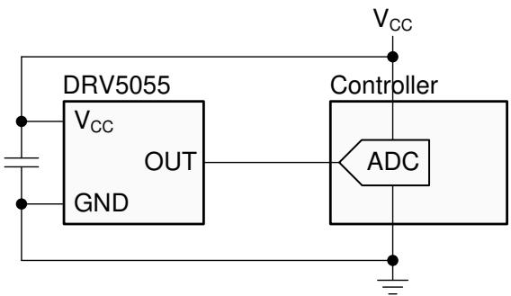  
典型原理图

## 3 说明

DRV5055 是一款线性霍尔效应传感器，可按比例响应磁通量密度。该器件可用于在各种应用中进行精确的位置检测。

该器件由 3.3V 或 5V 电源供电。当不存在磁场时，模拟输出可驱动 1/2 $\mathsf { V } _ { \mathsf { C C } }$ 。输出会随施加的磁通量密度呈线性变化，多个灵敏度选项可根据所需的检测范围提供最大的输出电压摆幅。南北磁极产生唯一的电压。

该器件可检测垂直于封装顶部的磁通量，两个封装选项可提供不同的检测方向。

该器件使用比例式架构，当外部模数转换器 (ADC) 使用相同的 $\mathsf { V } _ { \mathsf { C C } }$ 作为其基准电压时，可消除 $\mathsf { V } _ { \mathsf { C C } }$ 容差产生的误差。此外，该器件具有磁体温度补偿功能，可抵消磁体漂移，在 $\scriptscriptstyle - 4 0 ^ { \circ } \mathsf C$ 至 $1 2 5 ^ { \circ } \mathrm { C }$ 的宽温度范围内实现线性性能。此外，无磁体漂移温度补偿的器件选项也可供使用。

封装信息

<table><tr><td>器件型号</td><td>封装(1)</td><td>封装尺寸(2)</td></tr><tr><td rowspan="2">DRV5055</td><td>DBZ (SOT-23, 3)</td><td>2.92mm × 2.37mm</td></tr><tr><td>LPG (TO-92, 3)</td><td>4mm × 1.52mm</td></tr></table>

(1) 如需了解所有可用封装，请参阅数据表末尾的可订购产品附录。

(2) 封装尺寸（长 × 宽）为标称值，且包括引脚（如适用）

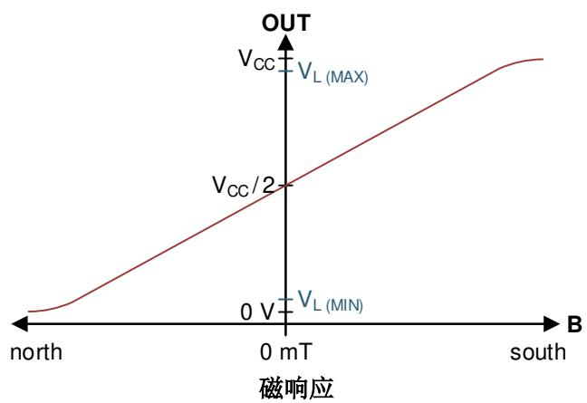

## 内容

1 特性.... 1
2 应用.... 1
3 说明.... 1
4 引脚配置和功能.... 3
5 规格.... 4
5.1 绝对最大额定值.... 4
5.2 ESD 等级.... 4
5.3 建议运行条件.... 4
5.4 热性能信息.... 4
5.5 电气特性.... 5
5.6 磁特性.... 6
5.7 典型特性.... 7
6 详细说明.... 10
6.1 概述.... 10
6.2 功能方框图.... 10
6.3 特性说明.... 10

6.4 器件功能模式.... 14
7 应用和实施.... 15
7.1 应用信息.... 15
7.2 典型应用.... 16
7.3 最佳设计实践.... 18
7.4 电源相关建议.... 19
7.5 布局.... 19
8 器件和文档支持.... 20
8.1 文档支持.... 20
8.2 接收文档更新通知.... 20
8.3 支持资源.... 20
8.4 商标.... 20
8.5 静电放电警告.... 20
8.6 术语表.... 20
9 修订历史记录.... 20
10 机械、封装和可订购信息.... 21

## 4 引脚配置和功能

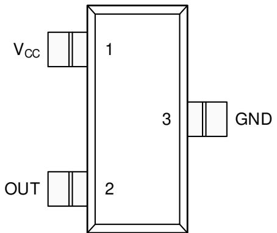  
图 4-1. DBZ 封装 3 引脚 SOT-23 顶视图

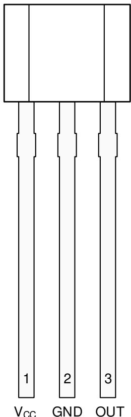  
图 4-2. LPG 封装 3 引脚 TO-92 顶视图

表 4-1. 引脚功能

<table><tr><td colspan="3">引脚</td><td rowspan="2">I/O</td><td rowspan="2">说明</td></tr><tr><td>名称</td><td>SOT-23</td><td>TO-92</td></tr><tr><td>GND</td><td>3</td><td>2</td><td>—</td><td>接地基准</td></tr><tr><td>OUT</td><td>2</td><td>3</td><td>O</td><td>模拟输出</td></tr><tr><td> $V_{CC}$ </td><td>1</td><td>1</td><td>—</td><td>电源。TI 建议将此引脚连接到一个电容值至少为  $0.01\mu F$  的接地陶瓷电容器。</td></tr></table>

## 5 规格

## 5.1 绝对最大额定值

在自然通风条件下的工作温度范围内测得（除非另有说明）(1)

<table><tr><td colspan="2"></td><td>最小值</td><td>最大值</td><td>单位</td></tr><tr><td>电源电压</td><td> $V_{CC}$ </td><td>-0.3</td><td>7</td><td>V</td></tr><tr><td>输出电压</td><td>OUT</td><td>-0.3</td><td> $V_{CC} + 0.3$ </td><td>V</td></tr><tr><td colspan="2">磁通密度, $B_{MAX}$ </td><td colspan="2">无限</td><td>T</td></tr><tr><td colspan="2">工作结温, $T_J$ </td><td>-40</td><td>170</td><td>°C</td></tr><tr><td colspan="2">贮存温度, $T_{stg}$ </td><td>-65</td><td>150</td><td>°C</td></tr></table>

(1) 应力超出绝对最大额定值中列出的值时，可能会对器件造成永久损坏。这些值仅为应力额定值，并不意味着器件在这些条件下以及在建以外的任何其他条件下能够正常运行。长时间处于绝对最大额定条件下可能会影响器件的可靠性。

## 5.2 ESD 等级

<table><tr><td colspan="3"></td><td>值</td><td>单位</td></tr><tr><td rowspan="2"> $V_{(ESD)}$ </td><td rowspan="2">静电放电</td><td>人体放电模型 (HBM),符合 ANSI/ESDA/JEDEC JS-001 标准(1)</td><td>±2500</td><td rowspan="2">V</td></tr><tr><td>充电器件模型 (CDM),符合 JEDEC 规范 JESD22-C101(2)</td><td>±750</td></tr></table>

(1) JEDEC 文件 JEP155 指出，500V HBM 可通过标准 ESD 管控流程安全生产。

(2) JEDEC 文档 JEP157 指出：250V CDM 能够在标准 ESD 控制流程下安全生产。

## 5.3 建议运行条件

在自然通风条件下的工作温度范围内测得（除非另有说明）

<table><tr><td colspan="2"></td><td>最小值</td><td>最大值</td><td>单位</td></tr><tr><td rowspan="2"> $V_{CC}$ </td><td rowspan="2"> $电源电压^{(1)}$ </td><td>3</td><td>3.63</td><td rowspan="2">V</td></tr><tr><td>4.5</td><td>5.5</td></tr><tr><td> $I_O$ </td><td>持续输出电流</td><td>-1</td><td>1</td><td>mA</td></tr><tr><td> $T_A$ </td><td> $工作环境温度^{(2)}$ </td><td>-40</td><td>125</td><td>°C</td></tr></table>

(1) 有两个隔离的工作 $\mathsf { V } _ { \mathsf { C C } }$ 范围。有关更多信息，请参阅功能描述部分。

(2) 必须遵循功率耗散和热限值。

## 5.4 热性能信息

<table><tr><td rowspan="3" colspan="2">热指标(1)</td><td colspan="2">DRV5055</td><td rowspan="3">单位</td></tr><tr><td>SOT-23 (DBZ)</td><td>TO-92 (LPG)</td></tr><tr><td>3引脚</td><td>3引脚</td></tr><tr><td> $R_{\theta JA}$ </td><td>结至环境热阻</td><td>170</td><td>121</td><td>°C/W</td></tr><tr><td> $R_{\theta JC(top)}$ </td><td>结至外壳(顶部)热阻</td><td>66</td><td>67</td><td>°C/W</td></tr><tr><td> $R_{\theta JB}$ </td><td>结至电路板热阻</td><td>49</td><td>97</td><td>°C/W</td></tr><tr><td> $Y_{JT}$ </td><td>结至顶部特征参数</td><td>1.7</td><td>7.6</td><td>°C/W</td></tr><tr><td> $Y_{JB}$ </td><td>结至电路板特征参数</td><td>48</td><td>97</td><td>°C/W</td></tr></table>

(1) 有关新旧热指标的更多信息，请参阅半导体和 IC 封装热指标应用手册。

## 5.5 电气特性

对于 $\mathsf { V } _ { \mathsf { C C } } = 3 \mathsf { V }$ 至 3.63V 和 4.5V 至 5.5V，在自然通风条件下的工作温度范围内测得（除非另有说明）

<table><tr><td colspan="2">参数</td><td colspan="2">测试条件(1)</td><td>最小值</td><td>典型值</td><td>最大值</td><td>单位</td></tr><tr><td rowspan="2"> $I_{CC}$ </td><td rowspan="2">工作电源电流</td><td colspan="2"> $V_{CC}=5.0V,B=0mT$ </td><td colspan="2">3</td><td>5</td><td rowspan="2">mA</td></tr><tr><td colspan="2"> $V_{CC}=3.3V,B=0mT$ </td><td colspan="2">2</td><td>4</td></tr><tr><td> $f_{BW}$ </td><td>检测带宽</td><td colspan="2"></td><td colspan="3">20</td><td>kHz</td></tr><tr><td> $t_d$ </td><td>传播延迟时间</td><td colspan="2">从B变化到OUT变化</td><td colspan="3">10</td><td>μs</td></tr><tr><td rowspan="2"> $B_{ND}$ </td><td rowspan="2">以输入为基准的RMS噪声密度</td><td colspan="2"> $V_{CC}=5V$ </td><td colspan="3">130</td><td rowspan="2">nT/√Hz</td></tr><tr><td colspan="2"> $V_{CC}=3.3V$ </td><td colspan="3">215</td></tr><tr><td rowspan="2"> $B_N$ </td><td rowspan="2">输入参考噪声</td><td rowspan="2"> $B_{ND}×6.6×\sqrt{20kHz}$ </td><td> $V_{CC}=5V$ </td><td colspan="3">0.12</td><td rowspan="2"> $mT_{PP}$ </td></tr><tr><td> $V_{CC}=3.3V$ </td><td colspan="3">0.2</td></tr><tr><td rowspan="5"> $V_N$ </td><td rowspan="5">以输出为基准的噪声(2)</td><td rowspan="5"> $B_N×S$ </td><td>DRV5055A1、DRV5055Z1</td><td colspan="3">12</td><td rowspan="5"> $mV_{PP}$ </td></tr><tr><td>DRV5055A2、DRV5055Z2</td><td colspan="3">6</td></tr><tr><td>DRV5055A3、DRV5055Z3</td><td colspan="3">3</td></tr><tr><td>DRV5055A4、DRV5055Z4</td><td colspan="3">1.5</td></tr><tr><td>DRV5055A8</td><td colspan="3">7.92</td></tr></table>

(1) B 是施加的磁通密度。  
(2) $\vee _ { \mathsf { N } }$ 表示器件输出端的电压噪声。如果不需要完整的器件带宽，则可以使用 RC 滤波器来降低噪声。

## 5.6 磁特性

对于 $\mathsf { V } _ { \mathsf { C C } } = 3 \mathsf { V }$ 至 3.63V 和 4.5V 至 5.5V，在自然通风条件下的工作温度范围内测得（除非另有说明）

<table><tr><td colspan="2">参数</td><td colspan="2">测试条件(1)</td><td>最小值</td><td>典型值</td><td>最大值</td><td>单位</td></tr><tr><td rowspan="2"> $V_Q$ </td><td rowspan="2">静态电压</td><td rowspan="2">B=0mT, $T_A$ =25°C</td><td> $V_{CC}$ =5V</td><td>2.43</td><td>2.5</td><td>2.57</td><td rowspan="2">V</td></tr><tr><td> $V_{CC}$ =3.3V</td><td>1.59</td><td>1.65</td><td>1.71</td></tr><tr><td> $V_{Q\Delta T}$ </td><td rowspan="2">静态电压温漂</td><td rowspan="2">B=0mT, $T_A$ =-40°C至125°C与25°C</td><td> $V_{CC}$ =5.0V</td><td></td><td>±1%× $V_{CC}$ </td><td></td><td>V</td></tr><tr><td> $V_{Q\Delta T}$ </td><td> $V_{CC}$ =3.3V</td><td></td><td>±1%× $V_{CC}$ </td><td></td><td>V</td></tr><tr><td> $V_{QRE}$ </td><td>静态电压比例式误差(2)</td><td colspan="2"></td><td colspan="3">±0.2</td><td>%</td></tr><tr><td> $V_{Q\Delta L}$ </td><td>静态电压寿命漂移</td><td colspan="2">1000小时高温工作应力</td><td colspan="2">&lt;0.5</td><td>1</td><td>%</td></tr><tr><td rowspan="10">S</td><td rowspan="10">灵敏度</td><td rowspan="5"> $V_{CC}$ =5V, $T_A$ =25°C</td><td>DRV5055A1/DRV5055Z1</td><td>95</td><td>100</td><td>105</td><td rowspan="10">mV/mT</td></tr><tr><td>DRV5055A8</td><td>63.3</td><td>66.6</td><td>69.9</td></tr><tr><td>DRV5055A2/DRV5055Z2</td><td>47.5</td><td>50</td><td>52.5</td></tr><tr><td>DRV5055A3/DRV5055Z3</td><td>23.8</td><td>25</td><td>26.2</td></tr><tr><td>DRV5055A4/DRV5055Z4</td><td>11.9</td><td>12.5</td><td>13.2</td></tr><tr><td rowspan="5"> $V_{CC}$ =3.3V, $T_A$ =25°C</td><td>DRV5055A1/DRV5055Z1</td><td>57</td><td>60</td><td>63</td></tr><tr><td>DRV5055A8</td><td>38</td><td>40</td><td>42</td></tr><tr><td>DRV5055A2/DRV5055Z2</td><td>28.5</td><td>30</td><td>31.5</td></tr><tr><td>DRV5055A3/DRV5055Z3</td><td>14.3</td><td>15</td><td>15.8</td></tr><tr><td>DRV5055A4/DRV5055Z4</td><td>7.1</td><td>7.5</td><td>7.9</td></tr><tr><td rowspan="10"> $B_L$ </td><td rowspan="10">线性磁感应范围(3)</td><td rowspan="5"> $V_{CC}$ =5V, $T_A$ =25°C</td><td>DRV5055A1/DRV5055Z1</td><td colspan="3">±21</td><td rowspan="10">mT</td></tr><tr><td>DRV5055A8</td><td colspan="3">±32.5</td></tr><tr><td>DRV5055A2/DRV5055Z2</td><td colspan="3">±42</td></tr><tr><td>DRV5055A3/DRV5055Z3</td><td colspan="3">±85</td></tr><tr><td>DRV5055A4/DRV5055Z4</td><td colspan="3">±169</td></tr><tr><td rowspan="5"> $V_{CC}$ =3.3V, $T_A$ =25°C</td><td>DRV5055A1/DRV5055Z1</td><td colspan="3">±22</td></tr><tr><td>DRV5055A8</td><td colspan="3">±39</td></tr><tr><td>DRV5055A2/DRV5055Z2</td><td colspan="3">±44</td></tr><tr><td>DRV5055A3/DRV5055Z3</td><td colspan="3">±88</td></tr><tr><td>DRV5055A4/DRV5055Z4</td><td colspan="3">±176</td></tr><tr><td> $V_L$ </td><td>输出电压线性范围(4)</td><td colspan="2"></td><td>0.2</td><td colspan="2"> $V_{CC}-0.2$ </td><td>V</td></tr><tr><td> $S_{TC}$ </td><td>磁体的灵敏度温度补偿(5)</td><td colspan="2">DRV5055A1/A2/A3/A4/A8</td><td>0.04</td><td>0.12</td><td>0.2</td><td>%/°C</td></tr><tr><td> $S_{TC}$ </td><td>磁体的灵敏度温度补偿(5)</td><td colspan="2">DRV5055Z1/Z2/Z3/Z4</td><td colspan="3">0</td><td>%/°C</td></tr><tr><td> $S_{LE}$ </td><td>灵敏度线性误差(4)</td><td colspan="2"> $V_{OUT}$ 处于 $V_L$ 范围之内</td><td colspan="3">±1</td><td>%</td></tr></table>

对于 $\mathsf { V } _ { \mathsf { C C } } = 3 \mathsf { V }$ 至 3.63V 和 4.5V 至 5.5V，在自然通风条件下的工作温度范围内测得（除非另有说明）

<table><tr><td colspan="2">参数</td><td>测试条件(1)</td><td>最小值</td><td>典型值</td><td>最大值</td><td>单位</td></tr><tr><td> $S_{SE}$ </td><td>灵敏度对称性误差(4)</td><td> $V_{OUT}$ 处于 $V_L$ 范围之内</td><td></td><td>±1</td><td></td><td>%</td></tr><tr><td> $S_{RE}$ </td><td>灵敏度比例式误差(2)</td><td> $T_A=25°C$ ,以 $V_{CC}=3.3V$ 或5V为基准</td><td>-2.5</td><td></td><td>2.5</td><td>%</td></tr><tr><td> $S_{\Delta L}$ </td><td>灵敏度寿命漂移</td><td>1000小时高温工作应力</td><td></td><td>&lt;0.5</td><td></td><td>%</td></tr></table>

(1) B 是施加的磁通密度。  
(2) 请参阅比例式架构部分。  
(3) $\mathsf { B } _ { \mathsf { L } }$ 表示 25°C 时的最小线性检测范围（考虑了最大 $\mathsf { V } _ { \mathsf { Q } }$ 和灵敏度容差）。

(4) 请参阅灵敏度线性度部分。

(5) $\mathsf { S } _ { \mathsf { T C } }$ 表示器件随温度增加灵敏度的速率。有关更多信息，请参阅 部分。

## 5.7 典型特性

在 ${ \bar { \mathsf { T } } } _ { \mathsf { A } } = 2 5 ^ { \circ } { \mathsf { C } }$ 条件下测得（除非另有说明）

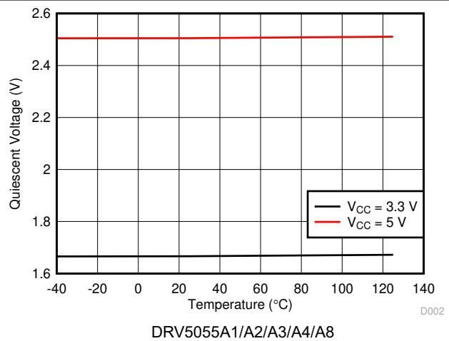

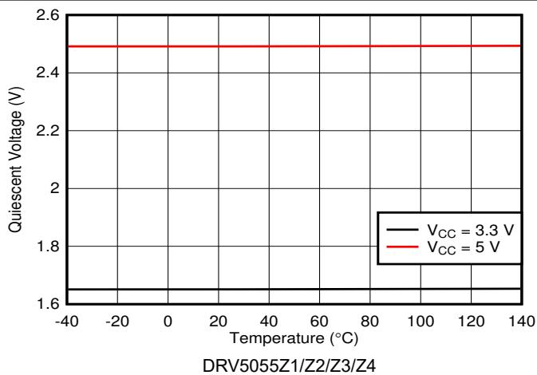

图 5-1. 静态电压与温度之间的关系  
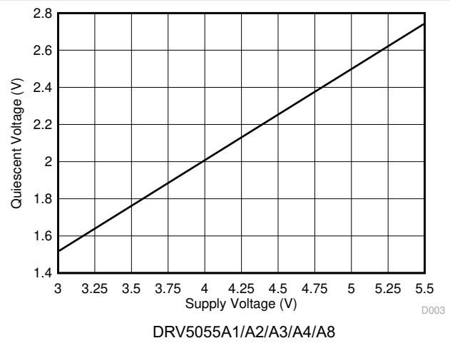  
图 5-3. 静态电压与电源电压之间的关系

图 5-2. 静态电压与温度之间的关系  
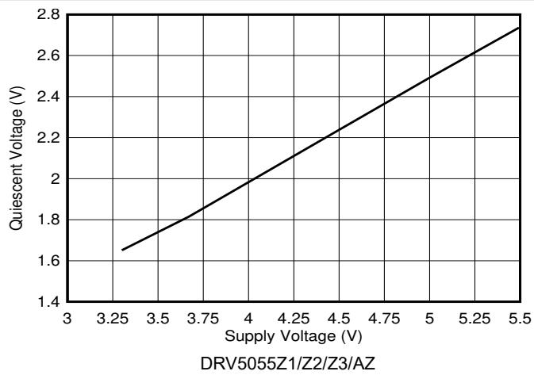  
图 5-4. 静态电压与电源电压之间的关系

## 5.7 典型特性 （续）

在 ${ \bar { \mathsf { T } } } _ { \mathsf { A } } = 2 5 ^ { \circ } { \mathsf { C } }$ 条件下测得（除非另有说明）

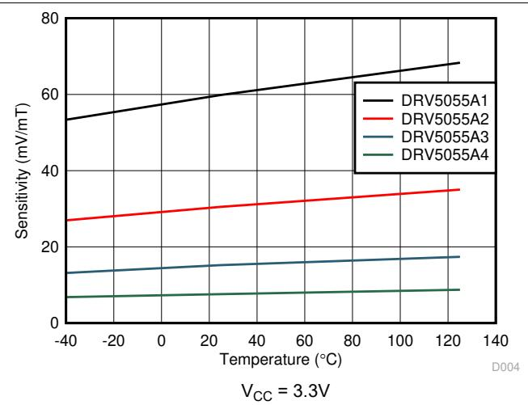

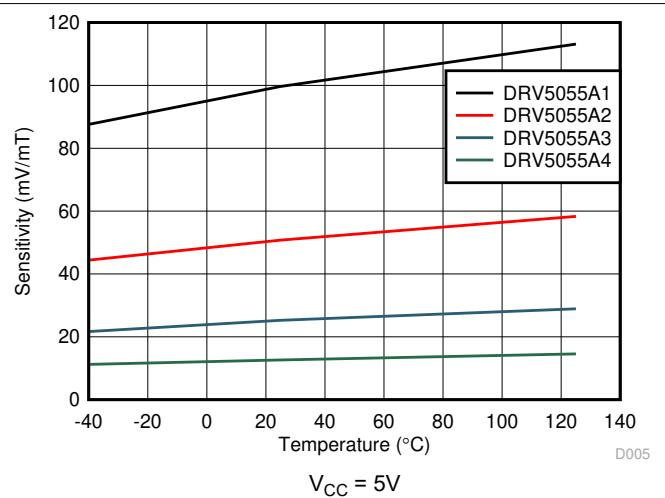

图 5-5. 灵敏度与温度之间的关系  
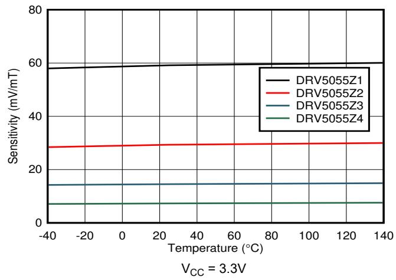  
图 5-7. 灵敏度与温度之间的关系

图 5-6. 灵敏度与温度之间的关系  
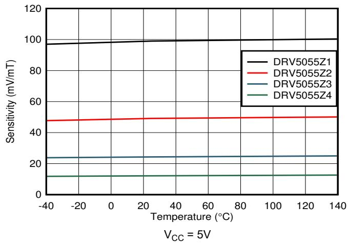

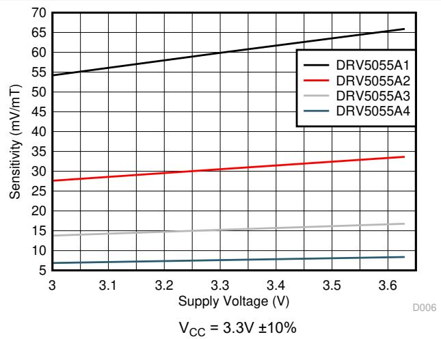  
图 5-9. 灵敏度与电源电压之间的关系

图 5-8. 灵敏度与温度之间的关系  
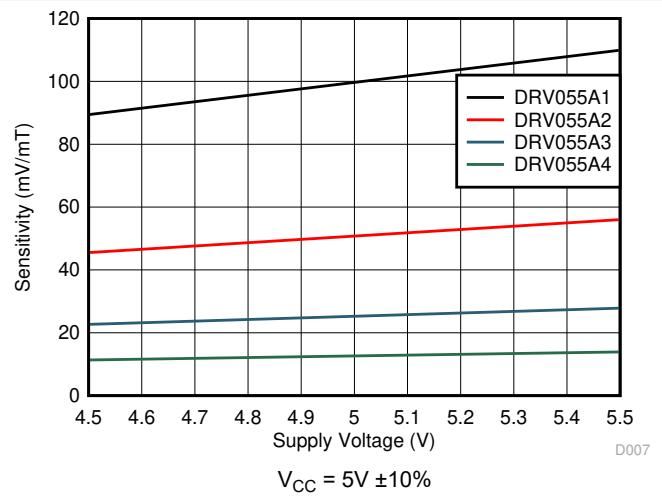  
图 5-10. 灵敏度与电源电压之间的关系

## 5.7 典型特性 （续）

在 ${ \bar { \mathsf { T } } } _ { \mathsf { A } } = 2 5 ^ { \circ } { \mathsf { C } }$ 条件下测得（除非另有说明）

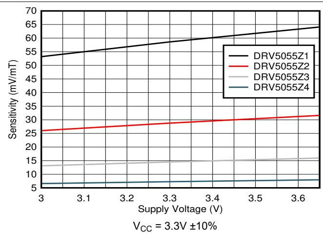  
图 5-11. 灵敏度与电源电压之间的关系

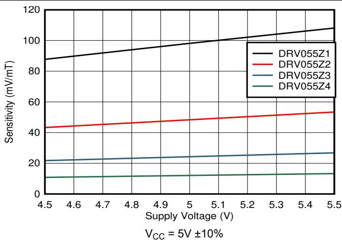

图 5-12. 灵敏度与电源电压之间的关系  
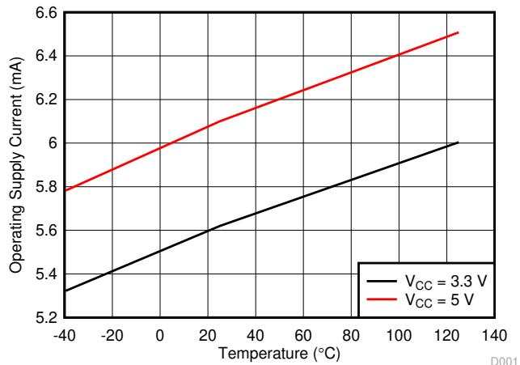  
图 5-13. 工作电源电流与温度之间的关系

## 6 详细说明

## 6.1 概述

DRV5055 是一款 3 引脚线性霍尔效应传感器，具有完全集成的信号调节、温度补偿电路、机械应力消除和放大器。该器件由 3.3V 和 5V (±10%) 电源供电，测量磁通密度，输出以 $\mathsf { V } _ { \mathsf { C C } }$ 为基准的成比例模拟电压。

## 6.2 功能方框图

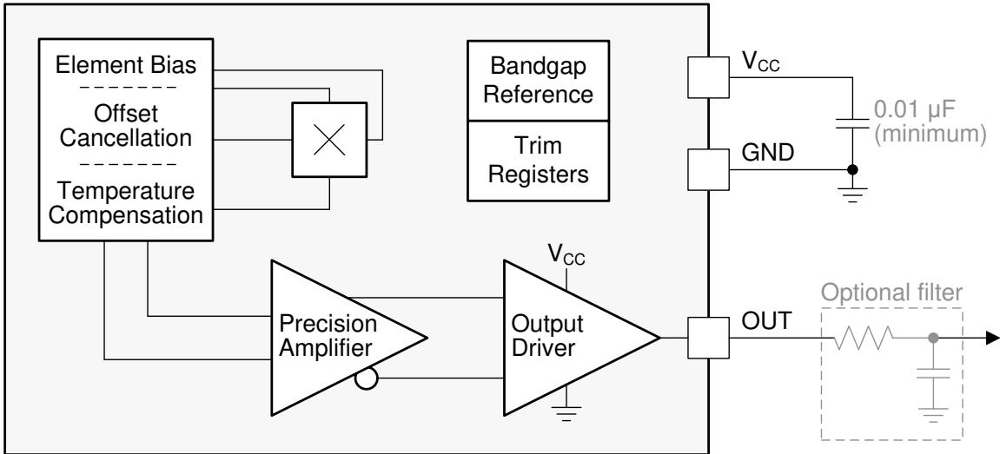

## 6.3 特性说明

## 6.3.1 磁通量方向

如图 6-1 所示，DRV5055 对垂直于封装顶部的磁场分量很敏感。

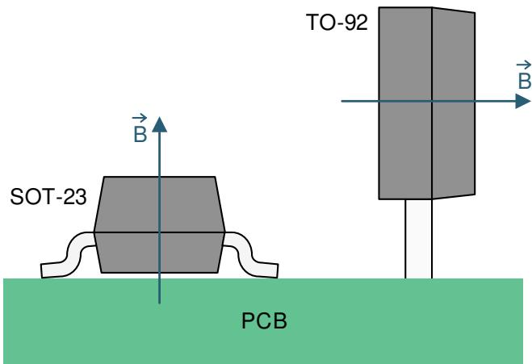  
图 6-1. 灵敏度方向

在该文档中，从封装底部到顶部的磁通为正。当南磁极靠近封装顶部（标记侧）时，就会出现这种情况。从封装顶部到底部的磁通量会产生负毫特斯拉值。

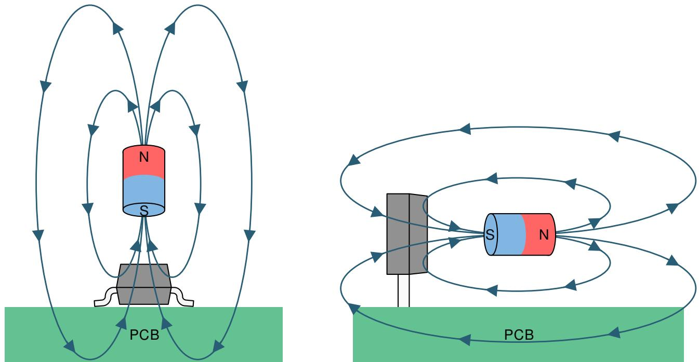  
图 6-2. 正 B 的磁通方向

## 6.3.2 磁响应

当 DRV5055 通电后，DRV5055 根据方程式 1 输出模拟电压：

$$
\mathrm{V} _ {\text { OUT }} = \mathrm{V} _ {\mathrm{Q}} + \mathrm{B} \times \left(\text { Sensitivity } _ {(2 5 ^ {\circ} \mathrm{C})} \times (1 + \mathrm{S} _ {\mathrm{TC}} \times (\mathrm{T} _ {\mathrm{A}} - 2 5 ^ {\circ} \mathrm{C}))\right)\tag{1}
$$

其中

${ \mathsf { V } } _ { \mathsf { Q } }$ 通常是 $\mathsf { V } _ { \mathsf { C C } }$ 的一半

• B 是施加的磁通密度

$\mathsf { S e n s i t i v i t y } _ { ( 2 5 ^ { \circ } \mathsf { C } ) }$ 取决于器件选项和 $\mathsf { V } _ { \mathsf { C C } }$

• 对于器件选项 DRV5055A1 - DRV5055A4，通常为 $0 . 1 2 \% / ^ { \circ } \mathrm { C }$ ，对于 DRV5055Z1 - DRV5055Z4 选项，通常为$0 \% 1 ^ { \circ } \mathrm { C }$

$\mathsf { T } _ { \mathsf { A } }$ 是环境温度

$\mathsf { V } _ { \mathsf { O U T } }$ 处于 $\mathsf { V } _ { \mathsf { L } }$ 范围之内

例如，假设使用 DRV5055A3， $\mathsf { V } _ { \mathsf { C C } } = 3 . 3 \mathsf { V }$ ，温度为 $5 0 ^ { \circ } \mathrm { C }$ ，施加 $6 7 \mathsf { m T }$ 0

在不考虑容差的情况下， $\mathsf { V } _ { \mathsf { O U T } } = 1 6 5 0 \mathsf { m V } + 6 7 \mathsf { m T } \times ( 1 5 \mathsf { m V } / \mathsf { m T } \times ( 1 + 0 . 0 0 1 2 / ^ { \circ } \mathsf { C } \times ( 5 0 ^ { \circ } \mathsf { C } - 2 5 ^ { \circ } \mathsf { C } ) ) ) = 2 6 8 5 \mathsf { m V } _ { \mathsf { c } }$

## 6.3.3 灵敏度线性度

当输出电压处于指定的 $\mathsf { V } _ { \mathsf { L } }$ 范围内时，该器件会产生线性响应。在该范围之外，灵敏度会降低且呈非线性。图 6-3磁响应。

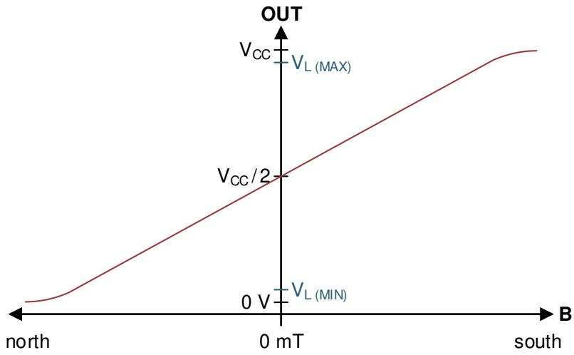  
图 6-3. 磁响应

方程式 2 用于计算 $\mathsf { B } _ { \mathsf { L } }$ ，即 $\boldsymbol { 2 5 ^ { \circ } \mathrm { C } }$ 时的最小线性检测范围（考虑了最大静态电压和灵敏度容差）。

$$
B _ {L (M I N)} = \frac {V _ {L (M A X)} - V _ {Q (M A X)}}{S _ {(M A X)}}\tag{2}
$$

参数 $\mathsf { S } _ { \mathsf { L E } }$ 将线性误差定义为输出处于 $\mathsf { V } _ { \mathsf { L } }$ 范围内时任意两个正 B 值和任意两个负 B 值之间的灵敏度差异。

参数 $\mathsf { S } _ { \mathsf { S E } }$ 将对称性误差定义为输出电压处于 ${ \mathsf { V } } _ { \mathsf { L } }$ 范围内时任何正 B 值与具有相同幅度的负 B 值之间的灵敏度差异。

## 6.3.4 比例式架构

DRV5055 具有比例式模拟架构，可随电源电压线性调整静态电压和灵敏度。例如，与 $\mathsf { V } _ { \mathsf { C C } } = 5 \mathsf { V }$ 相比， $\mathsf { V } _ { \mathsf { C C } } =$ 5.25V 时静态电压和灵敏度要高 5%。当 ADC 使用 $\mathsf { V } _ { \mathsf { C C } }$ 作为其基准时，无论电源电压容差如何，该行为都使外部ADC 能够数字化一致的值。

方程式 3 计算灵敏度比例式误差：

$$
S _ {R E} = 1 - \frac {S _ {(V C C)} / S _ {(5 V)}}{V _ {C C} / 5 V} \text {for} V _ {C C} = 4. 5 \mathrm{Vto} 5. 5 \mathrm{V}, \quad S _ {R E} = 1 - \frac {S _ {(V C C)} / S _ {(3 . 3 V)}}{V _ {C C} / 3 . 3 V} \text {for} V _ {C C} = 3 \mathrm{Vto} 3. 6 3 \mathrm{V}\tag{3}
$$

其中

$\mathsf { S } _ { \mathsf { ( V C C ) } }$ 是当前 $\mathsf { V } _ { \mathsf { C C } }$ 电压下的灵敏度

$\mathsf { S } _ { ( 5 \mathsf { V } ) }$ 或 $\mathsf { S } _ { ( 3 . 3 \mathsf { V } ) }$ 是 $\mathsf { V } _ { \mathsf { C C } } = 5 \mathsf { V }$ 或 3.3V 时的灵敏度

$\mathsf { V } _ { \mathsf { C C } }$ 是当前的 $\mathsf { V } _ { \mathsf { C C } }$ 电压

方程式 4 计算静态电压比例式误差：

$$
V _ {Q R E} = 1 - \frac {V _ {Q (V C C)} / V _ {Q (5 V)}}{V _ {C C} / 5 V} \text {for} V _ {C C} = 4. 5 \mathrm{Vto} 5. 5 \mathrm{V}, \quad V _ {Q R E} = 1 - \frac {V _ {Q (V C C)} / V _ {Q (3 . 3 V)}}{V _ {C C} / 3 . 3 V} \text {for} V _ {C C} = 3 \mathrm{Vto} 3. 6 3 \mathrm{V}\tag{4}
$$

其中

$\mathsf { V } _ { \mathsf { Q } ( \mathsf { V } \mathsf { C } \mathsf { C } ) }$ 是当前 $\mathsf { V } _ { \mathsf { C C } }$ 电压下的静态电压

• $V _ { \sf Q ( 5 V ) }$ 或 $\mathsf { V } _ { \mathsf { Q } ( 3 . 3 \mathsf { V } ) }$ 是 $\mathsf { V } _ { \mathsf { C C } } = 5 \mathsf { V }$ 或 3.3V 时的静态电压

• $\mathsf { V } _ { \mathsf { C C } }$ 是当前的 $\mathsf { V } _ { \mathsf { C C } }$ 电压

## 6.3.5 工作 $v _ { c c }$ 范围

DRV5055 具有两个建议工作 $\mathsf { V } _ { \mathsf { C C } }$ 范围：3V 至 3.63V 和 4.5V 至 5.5V。当 $\mathsf { V } _ { \mathsf { C C } }$ 处于 3.63V 至 4.5V 的中间区域时，器件会继续工作，但灵敏度不是很明确，因为在 4V 附近有一个交叉阈值可以调整器件特性。

## 6.3.6 磁体的灵敏度温度补偿

磁体的磁场通常会随着温度的升高而变弱。DRV5055 能够通过随温度增加灵敏度或使灵敏度保持恒定进行补偿，具体分别由参数 $\mathsf { S } _ { \mathsf { T C } }$ 和 $\mathsf { S } _ { \mathsf { T C z } }$ 定义。对于器件选项 DRV5055A1 - DRV5055A4， $\mathsf { T } _ { \mathsf { A } } = 1 2 5 ^ { \circ } \mathsf { C }$ 时的灵敏度通常比 $\mathsf { T } _ { \mathsf { A } }$ $= 2 5 ^ { \circ } \mathsf { C }$ 时高 12%。对于器件选项 DRV5055Z1 - DRV5055Z4， $\mathsf { T } _ { \mathsf { A } } = 1 2 5 ^ { \circ } \mathsf { C }$ 时的灵敏度通常与 $\bar { \mathsf { T } } _ { \mathsf { A } } = 2 5 ^ { \circ } \mathsf { C }$ 时的值相同。

## 6.3.7 上电时间

施加 $\mathsf { V } _ { \mathsf { C C } }$ 电压后，DRV5055 在设置输出之前需要短暂的初始化时间。参数 $\mathsf { t } _ { \mathsf { O N } }$ 表示在施加 0mT 并且 OUT 未连接负载的情况下从 $\mathsf { V } _ { \mathsf { C C } }$ 超过 3V 到 OUT 处 $\yen 100$ 的 5% 以内的时间。图 6-4 展示了该时序图。

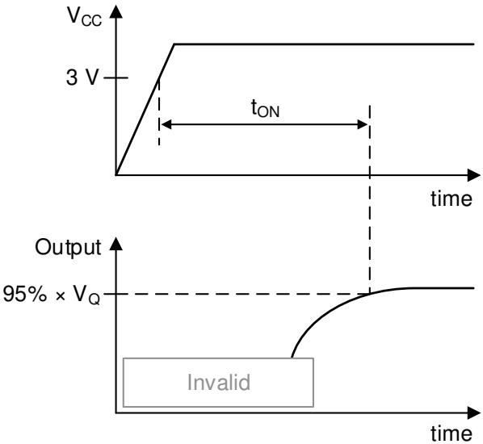  
图 6-4. tON 定义

## 6.3.8 霍尔元件位置

图 6-5 展示了每个封装选项中检测元件的位置。

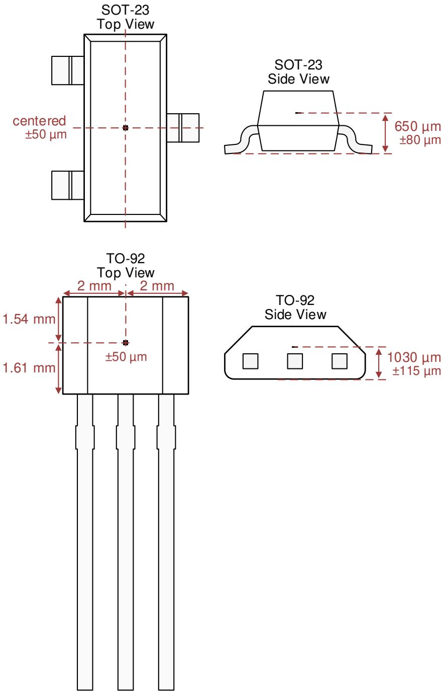  
图 6-5. 霍尔元件位置

## 6.4 器件功能模式

DRV5055 器件具有一种运行模式，在满足建议运行条件时适用。

## 7 应用和实施

## 备注

以下应用部分中的信息不属于 TI 器件规格的范围，TI 不担保其准确性和完整性。TI 的客 户应负责确定器件是否适用于其应用。客户应验证并测试其设计，以确保系统功能。

## 7.1 应用信息

## 7.1.1 选择灵敏度选项

选择可测量所需磁通密度范围的最高 DRV5055 灵敏度选项，从而尽可能地扩大输出电压摆幅。

与距离很近的极小磁体相比，尺寸更大的磁体和距离更远的感应距离通常可以实现更好的位置精度，因为磁通密度随着磁体的接近而呈指数级增长。TI 在 https://www.ti.com/product/drv5013 上创建了一个在线工具来帮助进行简单的磁体计算。

## 7.1.2 磁体的温度补偿

DRV5055 温度补偿旨在直接补偿钕 (NdFeB) 磁体的平均漂移并部分补偿铁氧体磁体。磁体的剩余感应 $( \mathsf { B } _ { \mathsf { r } } )$ 对于NdFeB 通常降低 0.12%/°C，对于铁氧体通常降低 $0 . 2 0 \% / ^ { \circ } \mathrm { C }$ 。当系统的工作温度降低时，温漂误差也会降低。

## 7.1.3 添加一个低通滤波器

如功能方框图中所示，当不需要完整的 20kHz 带宽时，可以将一个 RC 低通滤波器添加到器件输出端以最大限度地减小电压噪声。该滤波器可以提高信噪比 (SNR) 和整体精度。请勿在中间没有电阻器的情况下将电容器直接连接到器件输出端，因为这样做会使输出不稳定。

## 7.1.4 断线检测设计

一些系统必须检测互连导线是否开路或短路。DRV5055 支持该功能。

首先，选择一个灵敏度选项，使输出电压在正常操作期间保持在 $\mathsf { V } _ { \mathsf { L } }$ 范围内。接下来在 OUT 和 $\mathsf { V } _ { \mathsf { C C } }$ 之间添加一个上拉电阻器。TI 建议采用介于 20kΩ 和 100kΩ 之间的值，并且流经 OUT 的电流不得超过 $\mathsf { I } _ { 0 }$ 规格，包括进入外部 ADC 的电流。然后，如果测得的输出电压处于 $\mathsf { V } _ { \mathsf { C C } }$ 或 GND 的 150mV 范围以内，则存在故障情况。图 7-1 展示了该电路，表 7-1 说明了故障情况。

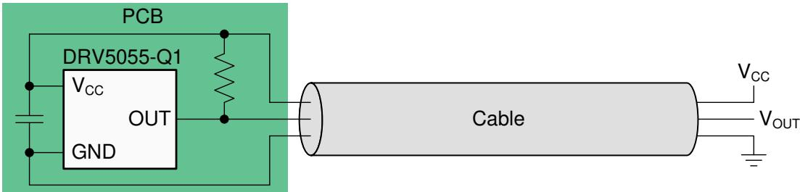  
图 7-1. 导线故障检测电路

表 7-1. 故障情况和产生的 VOUT

<table><tr><td>故障情况</td><td> $V_{OUT}$ </td></tr><tr><td> $V_{CC}$  断开</td><td>接近 GND</td></tr><tr><td>GND 断开</td><td>接近  $V_{CC}$ </td></tr><tr><td> $V_{CC}$  对 OUT 短路</td><td>接近  $V_{CC}$ </td></tr><tr><td>GND 对 OUT 短路</td><td>接近 GND</td></tr></table>

## 7.2 典型应用

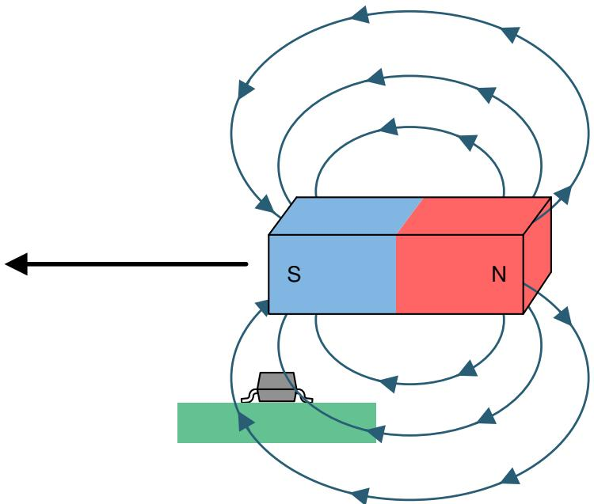  
图 7-2. 常见的磁铁方向

## 7.2.1 设计要求

此设计示例使用表 7-2 中列出的参数。

表 7-2. 设计参数

<table><tr><td>设计参数</td><td>示例值</td></tr><tr><td> $V_{CC}$ </td><td>5V</td></tr><tr><td>磁体</td><td>15 × 5 × 5mm NdFeB</td></tr><tr><td>行程</td><td>12mm</td></tr><tr><td>25°C时传感器的最大B</td><td>±75mT</td></tr><tr><td>器件选项</td><td>DRV5055A3</td></tr></table>

## 7.2.2 详细设计过程

线性霍尔效应传感器有助于实现灵活的机械设计，因为许多可能的磁体方向和运动会产生可用的传感器响应。图7-2 展示了最常见的方向之一，它使用传感器的整个北到南范围，在磁体移动时使磁通密度发生接近线性的变化。

在设计线性磁感应系统时，始终考虑以下三个变量：磁体、感应距离和传感器范围。选择灵敏度最高的DRV5055，其 $\mathsf { B } _ { \mathsf { L } }$ （线性磁感应范围）大于应用中的最大磁通密度。要确定传感器接收到的磁通密度，TI 建议使用磁场仿真软件，参考磁体规格并进行测试。

## 7.2.3 应用曲线

图 7-3 展示了来自 NdFeB 磁体的仿真磁通。

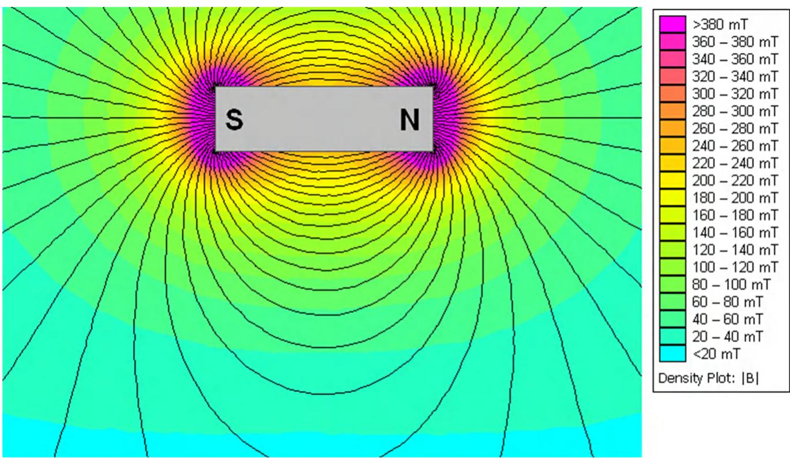  
图 7-3. 仿真磁通

## 7.3 最佳设计实践

霍尔元件对垂直于封装顶部的磁场很敏感，因此必须使用正确的磁铁方法让传感器检测磁场。图 7-4 展示了正确的方法和不正确的方法。

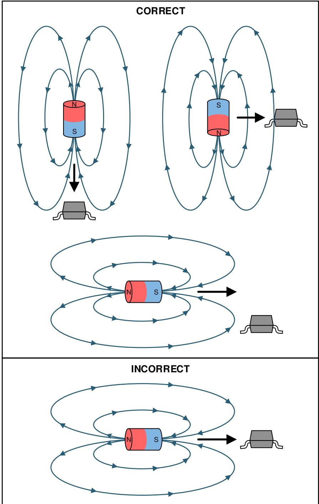  
图 7-4. 正确的磁方法和不正确的磁方法

## 7.4 电源相关建议

必须使用靠近器件的去耦电容器以最小电感提供局部能量。TI 建议使用容值至少为 0.01µF 的陶瓷电容器。

## 7.5 布局

## 7.5.1 布局指南

磁场在没有明显干扰的情况下穿过大多数非铁磁材料。将霍尔效应传感器嵌入塑料或铝制外壳中来感应外部磁体是惯常的做法。磁场也很容易穿过大多数印刷电路板，因此可以将磁体放置在另一侧。

## 7.5.2 布局示例

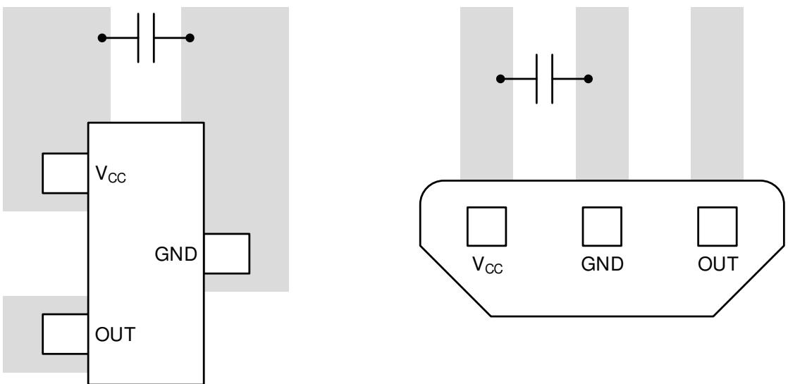  
图 7-5. 布局示例

## 8 器件和文档支持

## 8.1 文档支持

## 8.1.1 相关文档

请参阅以下相关文档：

• 德州仪器 (TI)，利用线性霍尔效应传感器测量角度概述应用简报

• 德州仪器 (TI)，增量旋转编码器设计注意事项应用简报

## 8.2 接收文档更新通知

要接收文档更新通知，请导航至 ti.com 上的器件产品文件夹。点击通知进行注册，即可每周接收产品信息更改摘要。有关更改的详细信息，请查看任何已修订文档中包含的修订历史记录。

## 8.3 支持资源

TI E2E™ 中文支持论坛是工程师的重要参考资料，可直接从专家处获得快速、经过验证的解答和设计帮助。搜索现有解答或提出自己的问题，获得所需的快速设计帮助。

链接的内容由各个贡献者“按原样”提供。这些内容并不构成 TI 技术规范，并且不一定反映 TI 的观点；请参阅TI 的使用条款。

## 8.4 商标

TI E2E™ 是 Texas Instruments 的商标。

所有商标均为其各自所有者的财产。

## 8.5 静电放电警告

静电放电 (ESD) 会损坏这个集成电路。德州仪器 (TI) 建议通过适当的预防措施处理所有集成电路。如果不遵守正确的处理和安装程序，可能会损坏集成电路。

ESD 的损坏小至导致微小的性能降级，大至整个器件故障。精密的集成电路可能更容易受到损坏，这是因为非常细微的参数更改都可能会导致器件与其发布的规格不相符。

## 8.6 术语表

TI 术语表 本术语表列出并解释了术语、首字母缩略词和定义。

## 9 修订历史记录

注：以前版本的页码可能与当前版本的页码不同

从修订版 B（2021 年 4 月）到修订版 C（2026 年 6 月）的更改 页码
• 在磁性灵敏度选项特性要点中添加了 A8 子要点……1
• 将器件信息表更改为封装信息……1
• 更改了工作电源电流和开通时间参数……5
• 为型号 DRV5055A8 添加了以输出为基准的噪声……5
• 在静态电压温漂参数中添加了测试条件……6
• 在“磁特性”表中添加了最大静态电压寿命漂移值……6
• 添加了 DRV5055A8 型号的灵敏度及范围……6
• 在“磁特性”表中添加了灵敏度线性度寿命漂移参数……6
• 在典型特性部分中添加了 DV5055A8 选项的图……7
• 将注意事项表更改为最佳设计实践……18

从修订版 A（2020 年 6 月）到修订版 B（2021 年 4 月）的更改 页码
- 更新了整个文档中的表格、图和交叉参考的编号格式....1
- 将绝对最大工作结温从 150°C 更新为 170°C....4
- 从“磁特性”表中删除了“产品预发布”表注....6

从修订版 \*（2018 年 1 月）到修订版 A（2020 年 6 月）的更改 页码
• 在数据表中添加了零 TC 灵敏度选项....1
• 在“电气特性”中添加了零 TC 信息....5
• 在“磁特性”表中添加了零 TC 信息....6
• 在典型特性部分中添加了 DV5055Z1/Z2/Z3/Z4 选项的图....7
• 更新了方程式 1 中的 S $_{TC}$ 定义....11
• 更新了磁体的灵敏度温度补偿部分中的零 TC 选项....13

## 10 机械、封装和可订购信息

以下页面包含机械、封装和可订购信息。这些信息是指定器件可用的最新数据。数据如有变更，恕不另行通知，且不会对此文档进行修订。有关此数据表的浏览器版本，请查阅左侧的导航栏。

## 封装信息

<table><tr><td>可订购器件型号</td><td>状态(1)</td><td>材料类型(2)</td><td>封装 | 引脚</td><td>封装数量 | 载具</td><td>RoHS(3)</td><td>引线镀层/焊球材料(4)</td><td>MSL 等级/峰值回流焊(5)</td><td>工作温度 (°C)</td><td>器件标识(6)</td></tr><tr><td>DRV5055A1QDBZR</td><td>在售</td><td>量产</td><td>SOT-23 (DBZ) | 3</td><td>3000 | LARGE T&amp;R</td><td>是</td><td>SN</td><td>Level-2-260C-1 YEAR</td><td>-40 to 125</td><td>55A1</td></tr><tr><td>DRV5055A1QDBZR.A</td><td>在售</td><td>量产</td><td>SOT-23 (DBZ) | 3</td><td>3000 | LARGE T&amp;R</td><td>是</td><td>SN</td><td>Level-2-260C-1 YEAR</td><td>-40 to 125</td><td>55A1</td></tr><tr><td>DRV5055A1QDBZR.B</td><td>在售</td><td>量产</td><td>SOT-23 (DBZ) | 3</td><td>3000 | LARGE T&amp;R</td><td>是</td><td>SN</td><td>Level-2-260C-1 YEAR</td><td>-40 to 125</td><td>55A1</td></tr><tr><td>DRV5055A1QDBZT</td><td>停产</td><td>量产</td><td>SOT-23 (DBZ) | 3</td><td>-</td><td>-</td><td>请联系 TI</td><td>请联系 TI</td><td>-40 to 125</td><td>55A1</td></tr><tr><td>DRV5055A1QLPG</td><td>在售</td><td>量产</td><td>TO-92 (LPG) | 3</td><td>1000 | BULK</td><td>是</td><td>SN</td><td>不适用于该封装类型</td><td>-40 to 125</td><td>55A1</td></tr><tr><td>DRV5055A1QLPG.A</td><td>在售</td><td>量产</td><td>TO-92 (LPG) | 3</td><td>1000 | BULK</td><td>是</td><td>SN</td><td>不适用于该封装类型</td><td>-40 to 125</td><td>55A1</td></tr><tr><td>DRV5055A1QLPG.B</td><td>在售</td><td>量产</td><td>TO-92 (LPG) | 3</td><td>1000 | BULK</td><td>是</td><td>SN</td><td>不适用于该封装类型</td><td>-40 to 125</td><td>55A1</td></tr><tr><td>DRV5055A1QLPGM</td><td>在售</td><td>量产</td><td>TO-92 (LPG) | 3</td><td>3000 | AMMO</td><td>是</td><td>SN</td><td>不适用于该封装类型</td><td>-40 to 125</td><td>55A1</td></tr><tr><td>DRV5055A1QLPGM.A</td><td>在售</td><td>量产</td><td>TO-92 (LPG) | 3</td><td>3000 | AMMO</td><td>是</td><td>SN</td><td>不适用于该封装类型</td><td>-40 to 125</td><td>55A1</td></tr><tr><td>DRV5055A1QLPGM.B</td><td>在售</td><td>量产</td><td>TO-92 (LPG) | 3</td><td>3000 | AMMO</td><td>是</td><td>SN</td><td>不适用于该封装类型</td><td>-40 to 125</td><td>55A1</td></tr><tr><td>DRV5055A2QDBZR</td><td>在售</td><td>量产</td><td>SOT-23 (DBZ) | 3</td><td>3000 | LARGE T&amp;R</td><td>是</td><td>SN</td><td>Level-2-260C-1 YEAR</td><td>-40 to 125</td><td>55A2</td></tr><tr><td>DRV5055A2QDBZR.A</td><td>在售</td><td>量产</td><td>SOT-23 (DBZ) | 3</td><td>3000 | LARGE T&amp;R</td><td>是</td><td>SN</td><td>Level-2-260C-1 YEAR</td><td>-40 to 125</td><td>55A2</td></tr><tr><td>DRV5055A2QDBZR.B</td><td>在售</td><td>量产</td><td>SOT-23 (DBZ) | 3</td><td>3000 | LARGE T&amp;R</td><td>是</td><td>SN</td><td>Level-2-260C-1 YEAR</td><td>-40 to 125</td><td>55A2</td></tr><tr><td>DRV5055A2QDBZT</td><td>停产</td><td>量产</td><td>SOT-23 (DBZ) | 3</td><td>-</td><td>-</td><td>请联系 TI</td><td>请联系 TI</td><td>-40 to 125</td><td>55A2</td></tr><tr><td>DRV5055A2QLPG</td><td>在售</td><td>量产</td><td>TO-92 (LPG) | 3</td><td>1000 | BULK</td><td>是</td><td>SN</td><td>不适用于该封装类型</td><td>-40 to 125</td><td>55A2</td></tr><tr><td>DRV5055A2QLPG.A</td><td>在售</td><td>量产</td><td>TO-92 (LPG) | 3</td><td>1000 | BULK</td><td>是</td><td>SN</td><td>不适用于该封装类型</td><td>-40 to 125</td><td>55A2</td></tr><tr><td>DRV5055A2QLPG.B</td><td>在售</td><td>量产</td><td>TO-92 (LPG) | 3</td><td>1000 | BULK</td><td>是</td><td>SN</td><td>不适用于该封装类型</td><td>-40 to 125</td><td>55A2</td></tr><tr><td>DRV5055A2QLPGM</td><td>在售</td><td>量产</td><td>TO-92 (LPG) | 3</td><td>3000 | AMMO</td><td>是</td><td>SN</td><td>不适用于该封装类型</td><td>-40 to 125</td><td>55A2</td></tr><tr><td>DRV5055A2QLPGM.A</td><td>在售</td><td>量产</td><td>TO-92 (LPG) | 3</td><td>3000 | AMMO</td><td>是</td><td>SN</td><td>不适用于该封装类型</td><td>-40 to 125</td><td>55A2</td></tr><tr><td>DRV5055A2QLPGM.B</td><td>在售</td><td>量产</td><td>TO-92 (LPG) | 3</td><td>3000 | AMMO</td><td>是</td><td>SN</td><td>不适用于该封装类型</td><td>-40 to 125</td><td>55A2</td></tr><tr><td>DRV5055A3QDBZR</td><td>在售</td><td>量产</td><td>SOT-23 (DBZ) | 3</td><td>3000 | LARGE T&amp;R</td><td>是</td><td>SN</td><td>Level-2-260C-1 YEAR</td><td>-40 to 125</td><td>55A3</td></tr><tr><td>DRV5055A3QDBZR.A</td><td>在售</td><td>量产</td><td>SOT-23 (DBZ) | 3</td><td>3000 | LARGE T&amp;R</td><td>是</td><td>SN</td><td>Level-2-260C-1 YEAR</td><td>-40 to 125</td><td>55A3</td></tr><tr><td>DRV5055A3QDBZR.B</td><td>在售</td><td>量产</td><td>SOT-23 (DBZ) | 3</td><td>3000 | LARGE T&amp;R</td><td>是</td><td>SN</td><td>Level-2-260C-1 YEAR</td><td>-40 to 125</td><td>55A3</td></tr><tr><td>DRV5055A3QDBZT</td><td>停产</td><td>量产</td><td>SOT-23 (DBZ) | 3</td><td>-</td><td>-</td><td>请联系 TI</td><td>请联系 TI</td><td>-40 to 125</td><td>55A3</td></tr><tr><td>DRV5055A3QLPG</td><td>在售</td><td>量产</td><td>TO-92 (LPG) | 3</td><td>1000 | BULK</td><td>是</td><td>SN</td><td>不适用于该封装类型</td><td>-40 to 125</td><td>55A3</td></tr><tr><td>DRV5055A3QLPG.A</td><td>在售</td><td>量产</td><td>TO-92 (LPG) | 3</td><td>1000 | BULK</td><td>是</td><td>SN</td><td>不适用于该封装类型</td><td>-40 to 125</td><td>55A3</td></tr><tr><td>DRV5055A3QLPG.B</td><td>在售</td><td>量产</td><td>TO-92 (LPG) | 3</td><td>1000 | BULK</td><td>是</td><td>SN</td><td>不适用于该封装类型</td><td>-40 to 125</td><td>55A3</td></tr><tr><td>DRV5055A3QLPGM</td><td>在售</td><td>量产</td><td>TO-92 (LPG) | 3</td><td>3000 | AMMO</td><td>是</td><td>SN</td><td>不适用于该封装类型</td><td>-40 to 125</td><td>55A3</td></tr><tr><td>DRV5055A3QLPGM.A</td><td>在售</td><td>量产</td><td>TO-92 (LPG) | 3</td><td>3000 | AMMO</td><td>是</td><td>SN</td><td>不适用于该封装类型</td><td>-40 to 125</td><td>55A3</td></tr><tr><td>DRV5055A3QLPGM.B</td><td>在售</td><td>量产</td><td>TO-92 (LPG) | 3</td><td>3000 | AMMO</td><td>是</td><td>SN</td><td>不适用于该封装类型</td><td>-40 to 125</td><td>55A3</td></tr><tr><td>DRV5055A4QDBZR</td><td>在售</td><td>量产</td><td>SOT-23 (DBZ) | 3</td><td>3000 | LARGE T&amp;R</td><td>是</td><td>SN</td><td>Level-2-260C-1 YEAR</td><td>-40 to 125</td><td>55A4</td></tr><tr><td>DRV5055A4QDBZR.A</td><td>在售</td><td>量产</td><td>SOT-23 (DBZ) | 3</td><td>3000 | LARGE T&amp;R</td><td>是</td><td>SN</td><td>Level-2-260C-1 YEAR</td><td>-40 to 125</td><td>55A4</td></tr><tr><td>DRV5055A4QDBZR.B</td><td>在售</td><td>量产</td><td>SOT-23 (DBZ) | 3</td><td>3000 | LARGE T&amp;R</td><td>是</td><td>SN</td><td>Level-2-260C-1 YEAR</td><td>-40 to 125</td><td>55A4</td></tr><tr><td>DRV5055A4QDBZT</td><td>停产</td><td>量产</td><td>SOT-23 (DBZ) | 3</td><td>-</td><td>-</td><td>请联系 TI</td><td>请联系 TI</td><td>-40 to 125</td><td>55A4</td></tr><tr><td>DRV5055A4QLPG</td><td>在售</td><td>量产</td><td>TO-92 (LPG) | 3</td><td>1000 | BULK</td><td>是</td><td>SN</td><td>不适用于该封装类型</td><td>-40 to 125</td><td>55A4</td></tr><tr><td>DRV5055A4QLPG.A</td><td>在售</td><td>量产</td><td>TO-92 (LPG) | 3</td><td>1000 | BULK</td><td>是</td><td>SN</td><td>不适用于该封装类型</td><td>-40 to 125</td><td>55A4</td></tr><tr><td>DRV5055A4QLPG.B</td><td>在售</td><td>量产</td><td>TO-92 (LPG) | 3</td><td>1000 | BULK</td><td>是</td><td>SN</td><td>不适用于该封装类型</td><td>-40 to 125</td><td>55A4</td></tr><tr><td>DRV5055A4QLPGM</td><td>在售</td><td>量产</td><td>TO-92 (LPG) | 3</td><td>3000 | AMMO</td><td>是</td><td>SN</td><td>不适用于该封装类型</td><td>-40 to 125</td><td>55A4</td></tr><tr><td>DRV5055A4QLPGM.A</td><td>在售</td><td>量产</td><td>TO-92 (LPG) | 3</td><td>3000 | AMMO</td><td>是</td><td>SN</td><td>不适用于该封装类型</td><td>-40 to 125</td><td>55A4</td></tr><tr><td>DRV5055A4QLPGM.B</td><td>在售</td><td>量产</td><td>TO-92 (LPG) | 3</td><td>3000 | AMMO</td><td>是</td><td>SN</td><td>不适用于该封装类型</td><td>-40 to 125</td><td>55A4</td></tr><tr><td>DRV5055A8QDBZR</td><td>在售</td><td>量产</td><td>SOT-23 (DBZ) | 3</td><td>3000 | LARGE T&amp;R</td><td>是</td><td>SN</td><td>Level-1-260C-UNLIM</td><td>-40 to 125</td><td>55A8</td></tr><tr><td>DRV5055Z1QDBZR</td><td>在售</td><td>量产</td><td>SOT-23 (DBZ) | 3</td><td>3000 | LARGE T&amp;R</td><td>是</td><td>SN</td><td>Level-2-260C-1 YEAR</td><td>-40 to 125</td><td>55Z1</td></tr><tr><td>DRV5055Z1QDBZR.A</td><td>在售</td><td>量产</td><td>SOT-23 (DBZ) | 3</td><td>3000 | LARGE T&amp;R</td><td>是</td><td>SN</td><td>Level-2-260C-1 YEAR</td><td>-40 to 125</td><td>55Z1</td></tr><tr><td>DRV5055Z1QDBZR.B</td><td>在售</td><td>量产</td><td>SOT-23 (DBZ) | 3</td><td>3000 | LARGE T&amp;R</td><td>是</td><td>SN</td><td>Level-2-260C-1 YEAR</td><td>-40 to 125</td><td>55Z1</td></tr><tr><td>DRV5055Z1QDBZT</td><td>停产</td><td>量产</td><td>SOT-23 (DBZ) | 3</td><td>-</td><td>-</td><td>请联系 TI</td><td>请联系 TI</td><td>-40 to 125</td><td>55Z1</td></tr><tr><td>DRV5055Z2QDBZR</td><td>在售</td><td>量产</td><td>SOT-23 (DBZ) | 3</td><td>3000 | LARGE T&amp;R</td><td>是</td><td>SN</td><td>Level-2-260C-1 YEAR</td><td>-40 to 125</td><td>55Z2</td></tr><tr><td>DRV5055Z2QDBZR.A</td><td>在售</td><td>量产</td><td>SOT-23 (DBZ) | 3</td><td>3000 | LARGE T&amp;R</td><td>是</td><td>SN</td><td>Level-2-260C-1 YEAR</td><td>-40 to 125</td><td>55Z2</td></tr><tr><td>DRV5055Z2QDBZR.B</td><td>在售</td><td>量产</td><td>SOT-23 (DBZ) | 3</td><td>3000 | LARGE T&amp;R</td><td>是</td><td>SN</td><td>Level-2-260C-1 YEAR</td><td>-40 to 125</td><td>55Z2</td></tr><tr><td>DRV5055Z2QDBZT</td><td>停产</td><td>量产</td><td>SOT-23 (DBZ) | 3</td><td>-</td><td>-</td><td>请联系 TI</td><td>请联系 TI</td><td>-40 to 125</td><td>55Z2</td></tr><tr><td>DRV5055Z2QLPG</td><td>在售</td><td>量产</td><td>TO-92 (LPG) | 3</td><td>1000 | BULK</td><td>是</td><td>SN</td><td>不适用于该封装类型</td><td>-40 to 125</td><td>55Z2</td></tr><tr><td>DRV5055Z3QDBZR</td><td>在售</td><td>量产</td><td>SOT-23 (DBZ) | 3</td><td>3000 | LARGE T&amp;R</td><td>是</td><td>SN</td><td>Level-2-260C-1 YEAR</td><td>-40 to 125</td><td>55Z3</td></tr><tr><td>DRV5055Z3QDBZR.A</td><td>在售</td><td>量产</td><td>SOT-23 (DBZ) | 3</td><td>3000 | LARGE T&amp;R</td><td>是</td><td>SN</td><td>Level-2-260C-1 YEAR</td><td>-40 to 125</td><td>55Z3</td></tr><tr><td>DRV5055Z3QDBZR.B</td><td>在售</td><td>量产</td><td>SOT-23 (DBZ) | 3</td><td>3000 | LARGE T&amp;R</td><td>是</td><td>SN</td><td>Level-2-260C-1 YEAR</td><td>-40 to 125</td><td>55Z3</td></tr><tr><td>DRV5055Z3QDBZT</td><td>停产</td><td>量产</td><td>SOT-23 (DBZ) | 3</td><td>-</td><td>-</td><td>请联系 TI</td><td>请联系 TI</td><td>-40 to 125</td><td>55Z3</td></tr><tr><td>DRV5055Z4QDBZR</td><td>在售</td><td>量产</td><td>SOT-23 (DBZ) | 3</td><td>3000 | LARGE T&amp;R</td><td>是</td><td>SN</td><td>Level-2-260C-1 YEAR</td><td>-40 to 125</td><td>55Z4</td></tr><tr><td>DRV5055Z4QDBZR.A</td><td>在售</td><td>量产</td><td>SOT-23 (DBZ) | 3</td><td>3000 | LARGE T&amp;R</td><td>是</td><td>SN</td><td>Level-2-260C-1 YEAR</td><td>-40 to 125</td><td>55Z4</td></tr><tr><td>DRV5055Z4QDBZR.B</td><td>在售</td><td>量产</td><td>SOT-23 (DBZ) | 3</td><td>3000 | LARGE T&amp;R</td><td>是</td><td>SN</td><td>Level-2-260C-1 YEAR</td><td>-40 to 125</td><td>55Z4</td></tr><tr><td>DRV5055Z4QDBZT</td><td>停产</td><td>量产</td><td>SOT-23 (DBZ) | 3</td><td>-</td><td>-</td><td>请联系 TI</td><td>请联系 TI</td><td>-40 to 125</td><td>55Z4</td></tr></table>

(1) 状态：有关状态的更多详细信息，请参阅我们的产品生命周期。

(2) 材料类型：在标明的情况下，预生产器件为原型/实验性器件，尚未批准或放行用于全面量产。测试和最终工艺（包括但不限于质量保证、可靠性性能测试和/或工艺鉴定）可能尚未完成，并且该产品可能会进一步变更或停产。如果可供订购，购买时需在结算时额外签署豁免书，且仅用于早期内部评估目的。此类产品售出时不提供任何形式的担保。

(3) RoHS 值：是、否、RoHS 豁免。有关更多信息和取值定义，请参阅 TI RoHS 声明。

(4) 引线镀层/焊球材料：器件可能有多种材料镀层选项。各镀层选项之间用竖线分隔。如果镀层值超出最大列宽，引线镀层/焊球材料值可能会换行显示为两行。

(5) MSL 等级/峰值回流焊：湿度敏感等级额定值和峰值焊接（回流）温度。如果某个器件有多个湿度敏感等级，则仅显示符合 JEDEC 标准的最低等级。有关将器件安装到印刷电路板时所使用的实际回流焊温度，请参阅发货标签。

(6) 器件标识：可能还有一个附加标识，它与器件的徽标、批次追溯码信息或环境类别有关。
多个器件标记将包含在括号内。括号内以“\~”分隔的器件标记中，只有一个会出现在器件上。如果某一行有缩进，则该行是上一行的延续，两行组合起来表示该器件的完整器件标记。

重要信息和免责声明：本页提供的信息代表 TI 在提供该信息之日所知和所信。TI 的知识和信念基于第三方提供的信息，对这类信息的准确性不作任何陈述或保证。TI 正在努力更好地整合来自第三方的信息。TI 已采取并将继续采取合理措施以提供具有代表性且准确的信息，但可能未对来料和化学品进行破坏性测试或化学分析。TI 和 TI 供应商认为某些信息属于专有信息，因此 CAS 编号和其他有限信息可能无法公布。

在任何情况下，TI 因这类信息而产生的责任均不超过 TI 每年向客户销售的、本文件中涉及的 TI 器件的总采购价格。

DRV5055 的其他合格版本：

汽车级：DRV5055-Q1

注：合格版本定义：

汽车级 - 符合面向零缺陷高可靠性汽车应用的 Q100 器件

载带和卷盘信息（TAPE AND REEL INFORMATION）  
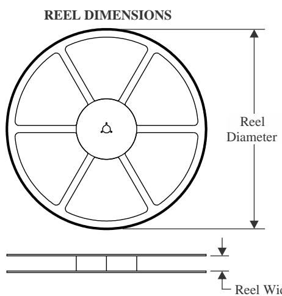

<table><tr><td>A0</td><td>用于容纳元件宽度的尺寸</td></tr><tr><td>B0</td><td>用于容纳元件长度的尺寸</td></tr><tr><td>K0</td><td>用于容纳元件厚度的尺寸</td></tr><tr><td>W</td><td>载带的总宽度</td></tr><tr><td>P1</td><td>相邻腔体中心之间的间距</td></tr></table>

卷盘宽度 (W1)  
载带中 PIN 1 方向的象限分配  

\*所有尺寸均为标称值

<table><tr><td>器件</td><td>封装类型</td><td>封装图</td><td>引脚数</td><td>SPQ</td><td>卷盘直径 (mm)</td><td>卷盘宽度 W1 (mm)</td><td>A0 (mm)</td><td>B0 (mm)</td><td>K0 (mm)</td><td>P1 (mm)</td><td>W (mm)</td><td>Pin1 象限</td></tr><tr><td>DRV5055A1QDBZR</td><td>SOT-23</td><td>DBZ</td><td>3</td><td>3000</td><td>178.0</td><td>9.0</td><td>3.15</td><td>2.77</td><td>1.22</td><td>4.0</td><td>8.0</td><td>Q3</td></tr><tr><td>DRV5055A1QDBZR</td><td>SOT-23</td><td>DBZ</td><td>3</td><td>3000</td><td>180.0</td><td>8.4</td><td>3.2</td><td>2.85</td><td>1.3</td><td>4.0</td><td>8.0</td><td>Q3</td></tr><tr><td>DRV5055A1QDBZR</td><td>SOT-23</td><td>DBZ</td><td>3</td><td>3000</td><td>180.0</td><td>8.4</td><td>3.2</td><td>2.85</td><td>1.3</td><td>4.0</td><td>8.0</td><td>Q3</td></tr><tr><td>DRV5055A2QDBZR</td><td>SOT-23</td><td>DBZ</td><td>3</td><td>3000</td><td>178.0</td><td>9.0</td><td>3.15</td><td>2.77</td><td>1.22</td><td>4.0</td><td>8.0</td><td>Q3</td></tr><tr><td>DRV5055A2QDBZR</td><td>SOT-23</td><td>DBZ</td><td>3</td><td>3000</td><td>180.0</td><td>8.4</td><td>3.2</td><td>2.85</td><td>1.3</td><td>4.0</td><td>8.0</td><td>Q3</td></tr><tr><td>DRV5055A2QDBZR</td><td>SOT-23</td><td>DBZ</td><td>3</td><td>3000</td><td>180.0</td><td>8.4</td><td>3.15</td><td>2.77</td><td>1.22</td><td>4.0</td><td>8.0</td><td>Q3</td></tr><tr><td>DRV5055A3QDBZR</td><td>SOT-23</td><td>DBZ</td><td>3</td><td>3000</td><td>178.0</td><td>9.0</td><td>3.15</td><td>2.77</td><td>1.22</td><td>4.0</td><td>8.0</td><td>Q3</td></tr><tr><td>DRV5055A3QDBZR</td><td>SOT-23</td><td>DBZ</td><td>3</td><td>3000</td><td>180.0</td><td>8.4</td><td>3.15</td><td>2.77</td><td>1.22</td><td>4.0</td><td>8.0</td><td>Q3</td></tr><tr><td>DRV5055A3QDBZR</td><td>SOT-23</td><td>DBZ</td><td>3</td><td>3000</td><td>180.0</td><td>8.4</td><td>3.2</td><td>2.85</td><td>1.3</td><td>4.0</td><td>8.0</td><td>Q3</td></tr><tr><td>DRV5055A4QDBZR</td><td>SOT-23</td><td>DBZ</td><td>3</td><td>3000</td><td>180.0</td><td>8.4</td><td>3.2</td><td>2.85</td><td>1.3</td><td>4.0</td><td>8.0</td><td>Q3</td></tr><tr><td>DRV5055A4QDBZR</td><td>SOT-23</td><td>DBZ</td><td>3</td><td>3000</td><td>178.0</td><td>9.0</td><td>3.15</td><td>2.77</td><td>1.22</td><td>4.0</td><td>8.0</td><td>Q3</td></tr><tr><td>DRV5055A8QDBZR</td><td>SOT-23</td><td>DBZ</td><td>3</td><td>3000</td><td>180.0</td><td>8.4</td><td>3.2</td><td>2.85</td><td>1.3</td><td>4.0</td><td>8.0</td><td>Q3</td></tr><tr><td>DRV5055Z1QDBZR</td><td>SOT-23</td><td>DBZ</td><td>3</td><td>3000</td><td>180.0</td><td>8.4</td><td>3.2</td><td>2.85</td><td>1.3</td><td>4.0</td><td>8.0</td><td>Q3</td></tr><tr><td>DRV5055Z1QDBZR</td><td>SOT-23</td><td>DBZ</td><td>3</td><td>3000</td><td>180.0</td><td>8.4</td><td>3.2</td><td>2.77</td><td>1.22</td><td>4.0</td><td>8.0</td><td>Q3</td></tr><tr><td>DRV5055Z2QDBZR</td><td>SOT-23</td><td>DBZ</td><td>3</td><td>3000</td><td>180.0</td><td>8.4</td><td>3.15</td><td>2.77</td><td>1.22</td><td>4.0</td><td>8.0</td><td>Q3</td></tr><tr><td>DRV5055Z2QDBZR</td><td>SOT-23</td><td>DBZ</td><td>3</td><td>3000</td><td>180.0</td><td>8.4</td><td>3.2</td><td>2.85</td><td>1.3</td><td>4.0</td><td>8.0</td><td>Q3</td></tr><tr><td>DRV5055Z2QDBZR</td><td>SOT-23</td><td>DBZ</td><td>3</td><td>3000</td><td>180.0</td><td>8.4</td><td>3.2</td><td>2.85</td><td>1.3</td><td>4.0</td><td>8.0</td><td>Q3</td></tr><tr><td>DRV5055Z3QDBZR</td><td>SOT-23</td><td>DBZ</td><td>3</td><td>3000</td><td>180.0</td><td>8.4</td><td>3.2</td><td>2.85</td><td>1.3</td><td>4.0</td><td>8.0</td><td>Q3</td></tr><tr><td>DRV5055Z3QDBZR</td><td>SOT-23</td><td>DBZ</td><td>3</td><td>3000</td><td>180.0</td><td>8.4</td><td>3.2</td><td>2. 85</td><td>1.3</td><td>4.0</td><td>8.0</td><td>Q3</td></tr><tr><td>DRV5055Z4QDBZR</td><td>SOT-23</td><td>DBZ</td><td>3</td><td>3000</td><td>180.0</td><td>8.4</td><td>3.2</td><td>2.85</td><td>1.3</td><td>4.0</td><td>8.0</td><td>Q3</td></tr><tr><td>DRV5055Z4QDBZR</td><td>SOT-23</td><td>DBZ</td><td>3</td><td>3000</td><td>180.0</td><td>8.4</td><td>3.2</td><td>2.85</td><td>1.3</td><td>4.0</td><td>8.0</td><td>Q3</td></tr></table>

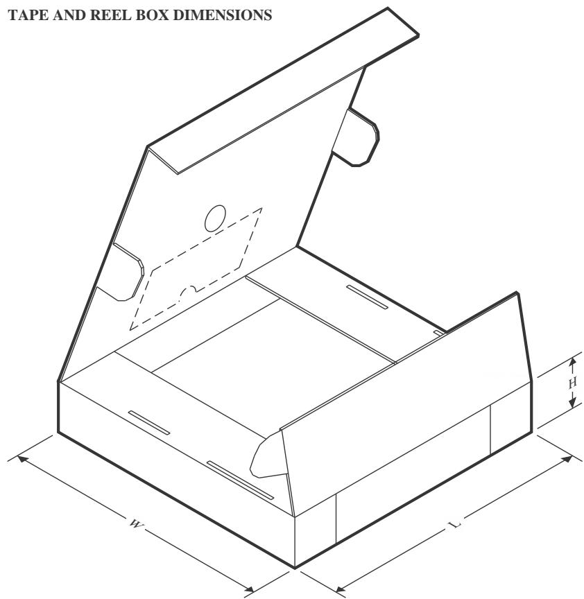

\*所有尺寸均为标称值

<table><tr><td>器件</td><td>封装类型</td><td>封装图</td><td>引脚数</td><td>SPQ</td><td>长度 (mm)</td><td>宽度 (mm)</td><td>高度 (mm)</td></tr><tr><td>DRV5055A1QDBZR</td><td>SOT-23</td><td>DBZ</td><td>3</td><td>3000</td><td>180.0</td><td>180.0</td><td>18.0</td></tr><tr><td>DRV5055A1QDBZR</td><td>SOT-23</td><td>DBZ</td><td>3</td><td>3000</td><td>210.0</td><td>185.0</td><td>35.0</td></tr><tr><td>DRV5055A1QDBZR</td><td>SOT-23</td><td>DBZ</td><td>3</td><td>3000</td><td>210.0</td><td>185.0</td><td>35.0</td></tr><tr><td>DRV5055A2QDBZR</td><td>SOT-23</td><td>DBZ</td><td>3</td><td>3000</td><td>180.0</td><td>180.0</td><td>18.0</td></tr><tr><td>DRV5055A2QDBZR</td><td>SOT-23</td><td>DBZ</td><td>3</td><td>3000</td><td>210.0</td><td>185.0</td><td>35.0</td></tr><tr><td>DRV5055A2QDBZR</td><td>SOT-23</td><td>DBZ</td><td>3</td><td>3000</td><td>213.0</td><td>191.0</td><td>35.0</td></tr><tr><td>DRV5055A3QDBZR</td><td>SOT-23</td><td>DBZ</td><td>3</td><td>3000</td><td>180.0</td><td>180.0</td><td>18.0</td></tr><tr><td>DRV5055A3QDBZR</td><td>SOT-23</td><td>DBZ</td><td>3</td><td>3000</td><td>213.0</td><td>191.0</td><td>35.0</td></tr><tr><td>DRV5055A3QDBZR</td><td>SOT-23</td><td>DBZ</td><td>3</td><td>3000</td><td>210.0</td><td>185.0</td><td>35.0</td></tr><tr><td>DRV5055A4QDBZR</td><td>SOT-23</td><td>DBZ</td><td>3</td><td>3000</td><td>210.0</td><td>185.0</td><td>35.0</td></tr><tr><td>DRV5055A4QDBZR</td><td>SOT-23</td><td>DBZ</td><td>3</td><td>3000</td><td>180.0</td><td>180.0</td><td>18.0</td></tr><tr><td>DRV5055A8QDBZR</td><td>SOT-23</td><td>DBZ</td><td>3</td><td>3000</td><td>210.0</td><td>185.0</td><td>35.0</td></tr><tr><td>DRV5055Z1QDBZR</td><td>SOT-23</td><td>DBZ</td><td>3</td><td>3000</td><td>210.0</td><td>185.0</td><td>35.0</td></tr><tr><td>DRV5055Z1QDBZR</td><td>SOT-23</td><td>DBZ</td><td>3</td><td>3000</td><td>210.0</td><td>185.0</td><td>35.0</td></tr><tr><td>DRV5055Z2QDBZR</td><td>SOT-23</td><td>DBZ</td><td>3</td><td>3000</td><td>213.0</td><td>191.0</td><td>35.0</td></tr><tr><td>DRV5055Z2QDBZR</td><td>SOT-23</td><td>DBZ</td><td>3</td><td>3000</td><td>210.0</td><td>185.0</td><td>35.0</td></tr><tr><td>DRV5055Z2QDBZR</td><td>SOT-23</td><td>DBZ</td><td>3</td><td>3000</td><td>210.0</td><td>185.0</td><td>35.0</td></tr><tr><td>DRV5055Z3QDBZR</td><td>SOT-23</td><td>DBZ</td><td>3</td><td>3000</td><td>210.0</td><td>185.0</td><td>35.0</td></tr><tr><td>DRV5055Z3QDBZR</td><td>SOT-23</td><td>DBZ</td><td>3</td><td>3000</td><td>210.0</td><td>185.0</td><td>35.0</td></tr><tr><td>DRV5055Z4QDBZR</td><td>SOT-23</td><td>DBZ</td><td>3</td><td>3000</td><td>210.0</td><td>185.0</td><td>35.0</td></tr><tr><td>DRV5055Z4QDBZR</td><td>SOT-23</td><td>DBZ</td><td>3</td><td>3000</td><td>210.0</td><td>185.0</td><td>35.0</td></tr></table>

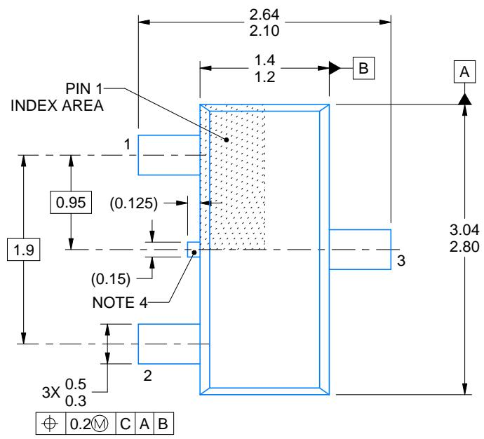

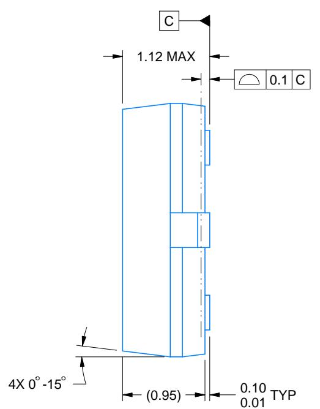

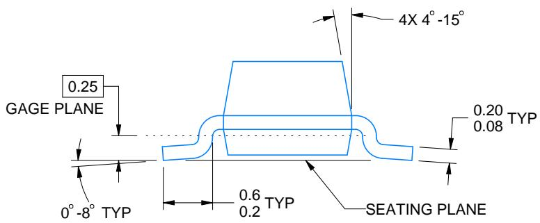

## 注：

4214838/F 08/2024

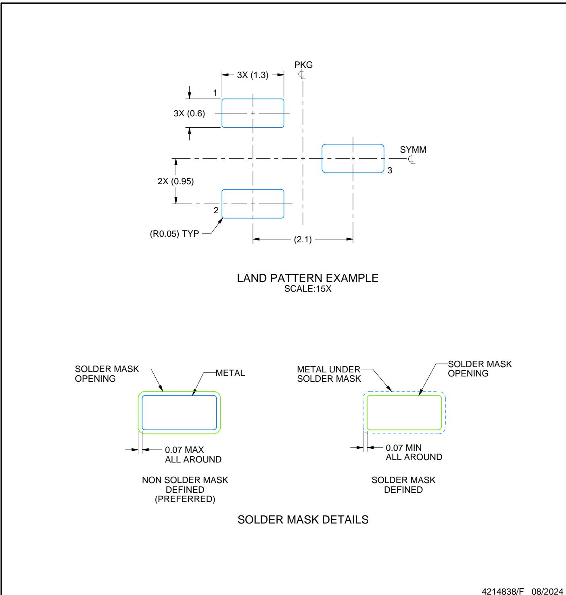

4214838/F 08/2024

注：（续）

5. 出版物 IPC-7351 可能有其他设计方案。

6. 信号焊盘之间及其周围的阻焊层公差可能因电路板制造厂而异。

小外形晶体管（SMALL OUTLINE TRANSISTOR）

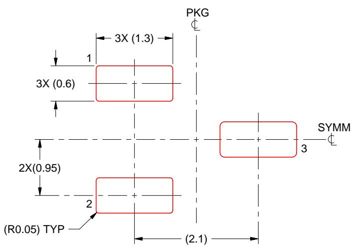

基于 0.125 厚模板的焊膏示例　比例：15X

注：（续）

4214838/F 08/2024

7. 采用梯形壁和圆角的激光切割开孔可获得更好的焊膏释放效果。IPC-7525 可能有其他设计建议。

8. 电路板组装厂可能对模板设计有不同的建议。

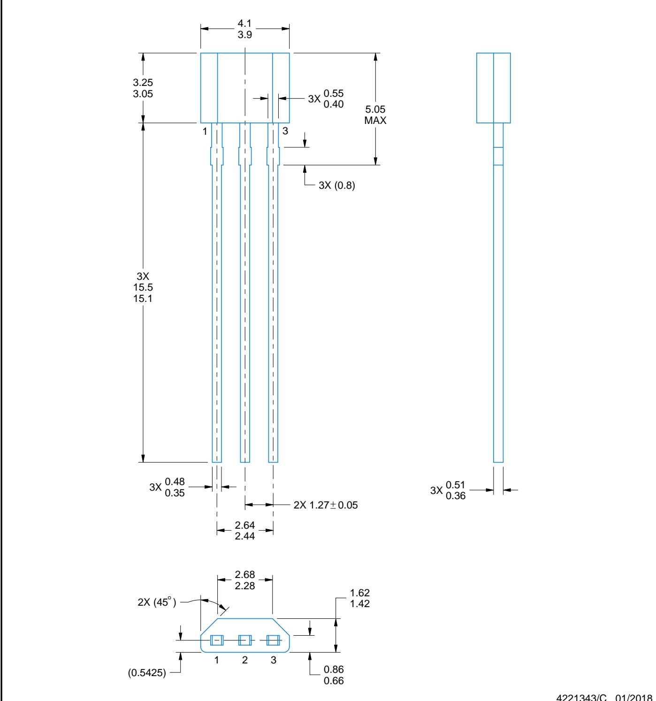

4221343/C 01/2018

## 注：

晶体管外形（TRANSISTOR OUTLINE）

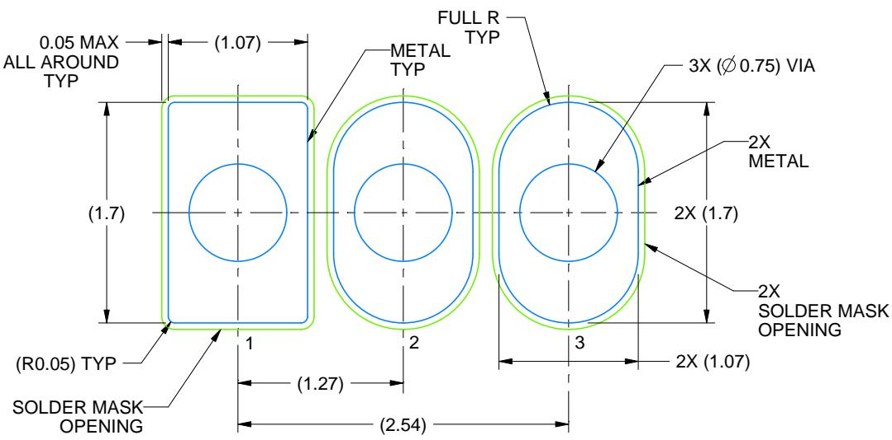

焊盘图形示例　非阻焊层限定　比例：20X

4221343/C 01/2018

晶体管外形（TRANSISTOR OUTLINE）

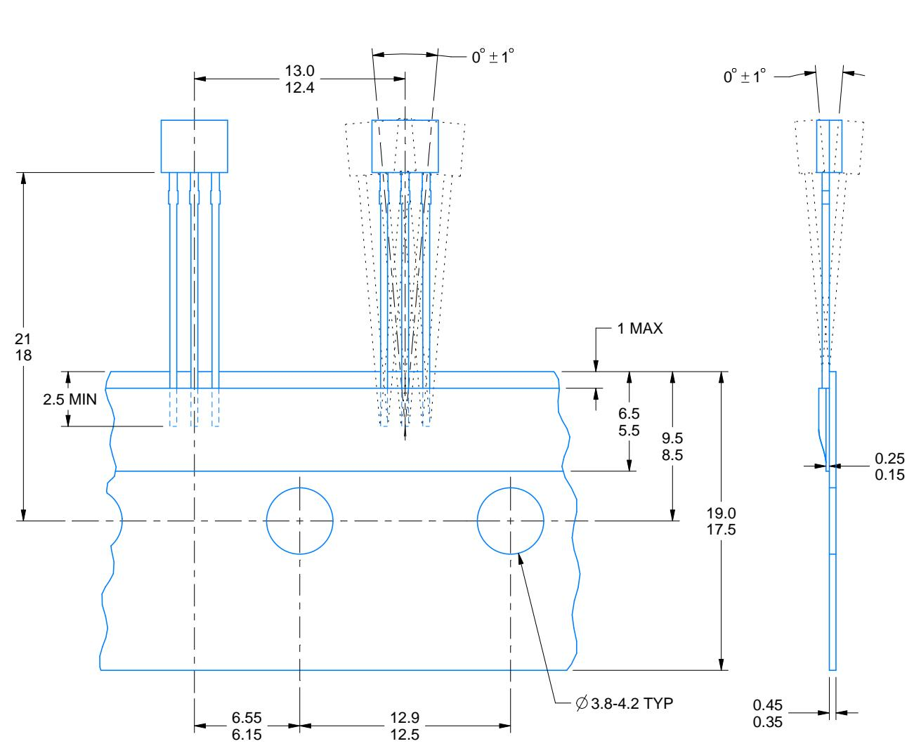

4221343/C 01/2018

## 重要通知和免责声明

TI“按原样”提供技术和可靠性数据（包括数据表）、设计资源（包括参考设计）、应用或其他设计建议、网络工具、安全信息和其他资源，不保证没有瑕疵且不做出任何明示或暗示的担保，包括但不限于对适销性、与某特定用途的适用性或不侵犯任何第三方知识产权的暗示担保。这些资源可供使用 TI 产品进行设计的熟练开发人员使用。您将自行承担以下全部责任：(1) 针对您的应用选择合适的 TI 产品，(2) 设计、验证并测试您的应用，(3) 确保您的应用满足相应标准以及任何其他安全、安保法规或其他要求。

这些资源如有变更，恕不另行通知。TI 授权您仅可将这些资源用于研发本资源所述的 TI 产品的相关应用。严禁以其他方式对这些资源进行复制或展示。您无权使用任何其他 TI 知识产权或任何第三方知识产权。对于因您对这些资源的使用而对 TI 及其代表造成的任何索赔、损害、成本、损失和债务，您将全额赔偿，TI 对此概不负责。

TI 提供的产品受 TI 销售条款)、TI 通用质量指南 或 ti.com 上其他适用条款或 TI 产品随附的其他适用条款的约束。TI 提供这些资源并不会扩展或以其他方式更改 TI 针对 TI 产品发布的适用的担保或担保免责声明。 除非德州仪器 (TI) 明确将某产品指定为定制产品或客户特定产品，否则其产品均为按确定价格收入目录的标准通用器件。

TI 反对并拒绝您可能提出的任何其他或不同的条款。

版权所有 © 2026，德州仪器 (TI) 公司

最后更新日期：2025 年 10 月