# TMUX1208 5V 双向 8:1、单通道多路复用器TMUX1209 5V 双向 4:1、双通道多路复用器

## 1 特性

1• 轨至轨运行

• 双向信号路径

• 低导通电阻：5Ω

• 宽电源电压范围：1.08V 至 5.5V

• -40°C 至 +125°C 运行温度

• 兼容 1.8V 逻辑

• 失效防护逻辑

• 低电源电流：10nA

• 转换时间：14ns

• 先断后合开关

• ESD 保护 HBM：2000V

• 行业标准 TSSOP 和 QFN 封装

## 2 应用

• 模拟和数字多路复用/多路信号分离

• HVAC：取暖、通风和空调

• 烟雾探测器

• 视频监控

• 电子销售终端

• 电池供电类设备

• 电器

• 消费类音频

## 3 说明

TMUX1208 和 TMUX1209 为通用互补金属氧化物半导体 (CMOS) 多路复用器 (MUX)。TMUX1208 提供8:1 单端通道，而 TMUX1209 提供差动 4:1 或双 4:1单端通道。1.08V 至 5.5V 的宽电源电压工作范围 可支持 的各种 应用中运行。该器件可在源极 (Sx) 和漏极(D) 引脚上支持从 GND 到 $\mathsf { V } _ { \mathsf { D D } }$ 范围的双向模拟和数字信号。

所有逻辑输入均具有兼容 1.8V 逻辑的阈值，当器件在有效电源电压范围内运行时，这些阈值可确保 TTL 和CMOS 逻辑兼容性。失效防护逻辑 电路允许在电源引脚之前的控制引脚上施加电压，从而保护器件免受潜在的损害。

器件信息(1)  
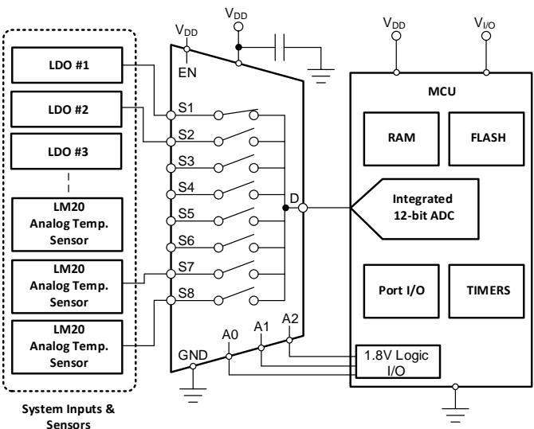

<table><tr><td>器件型号</td><td>封装</td><td>封装尺寸(标称值)</td></tr><tr><td>TMUX1208</td><td>TSSOP (16)</td><td>5.00mm × 4.40mm</td></tr><tr><td>TMUX1209</td><td>QFN (16)</td><td>2.60mm × 1.80mm</td></tr></table>

(1) 如需了解所有可用封装，请参阅数据表末尾的封装选项附录。  
System Inputs & Sensors

应用示例  
TMUX1208、TMUX1209 方框图  
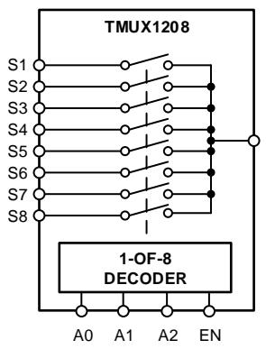

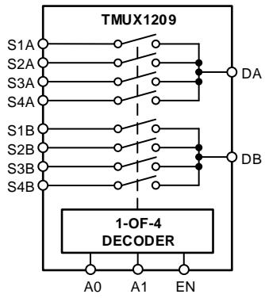

## 目录

1 特性.... 1
2 应用.... 1
3 说明.... 1
4 修订历史记录.... 2
5 Device Comparison Table.... 3
6 Pin Configuration and Functions.... 3
7 Specifications.... 5
7.1 Absolute Maximum Ratings.... 5
7.2 ESD Ratings.... 5
7.3 Recommended Operating Conditions.... 5
7.4 Thermal Information.... 5
7.5 Electrical Characteristics (VDD = 5 V ±10 %).... 6
7.6 Electrical Characteristics (VDD = 3.3 V ±10 %).... 8
7.7 Electrical Characteristics (VDD = 1.8 V ±10 %).... 10
7.8 Electrical Characteristics (VDD = 1.2 V ±10 %).... 12
7.9 Typical Characteristics.... 14
8 Detailed Description.... 15
8.1 Overview.... 15
8.2 Functional Block Diagram.... 20
8.3 Feature Description.... 20

9 Application and Implementation 22  
9.1 Application Information 22  
9.2 Typical Application 22  
9.3 Design Requirements 22  
9.4 Detailed Design Procedure 23  
9.5 Application Curve 23  
10 Power Supply Recommendations 23  
11 Layout 24  
11.1 Layout Guidelines 24  
11.2 Layout Example 24  
12 器件和文档支持 25  
12.1 文档支持 25  
12.2 相关链接 25  
12.3 接收文档更新通知 25  
12.4 社区资源 25  
12.5 商标 25  
12.6 静电放电警告 25  
12.7 术语表 25  
13 机械、封装和可订购信息 25

## 4 修订历史记录

注：之前版本的页码可能与当前版本有所不同。

Changes from Revision B (November 2018) to Revision C Page
• 向数据表添加了 TMUX1209 器件.... 1
Changes from Revision A (September 2018) to Revision B Page
• Added RSV (QFN) thermal information to Thermal Information: table.... 5
• Added footnote to clarify test conditions.... 8
Changes from Original (August 2018) to Revision A Page
• 将文件状态从预告信息更改为生产数据.... 1

## 5 Device Comparison Table

<table><tr><td>PRODUCT</td><td>DESCRIPTION</td></tr><tr><td>TMUX1208</td><td>8:1, 1-Channel, single-ended multiplexer</td></tr><tr><td>TMUX1209</td><td>4:1, 2-Channel, differential multiplexer</td></tr></table>

## 6 Pin Configuration and Functions

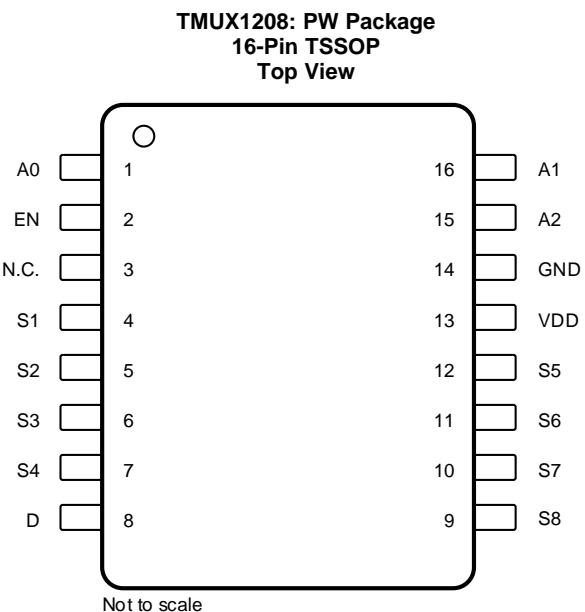  
TMUX1208: RSV Package 16-Pin QFN Top View

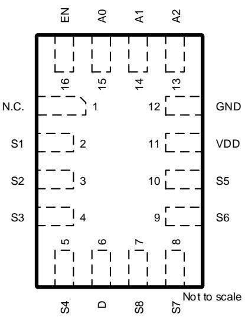

Pin Functions TMUX1208

<table><tr><td colspan="3">PIN</td><td rowspan="2">TYPE(1)</td><td rowspan="2">DESCRIPTION</td></tr><tr><td>NAME</td><td>TSSOP</td><td>UQFN</td></tr><tr><td>A0</td><td>1</td><td>15</td><td>I</td><td>Address line 0. Controls the switch configuration as shown in 表 1.</td></tr><tr><td>EN</td><td>2</td><td>16</td><td>I</td><td>Active high logic input. When this pin is low, all switches are turned off. When this pin is high, the A[2:0] address inputs determine which switch is turned on.</td></tr><tr><td>N.C.</td><td>3</td><td>1</td><td>Not Connected</td><td>Not Connected</td></tr><tr><td>S1</td><td>4</td><td>2</td><td>I/O</td><td>Source pin 1. Can be an input or output.</td></tr><tr><td>S2</td><td>5</td><td>3</td><td>I/O</td><td>Source pin 2. Can be an input or output.</td></tr><tr><td>S3</td><td>6</td><td>4</td><td>I/O</td><td>Source pin 3. Can be an input or output.</td></tr><tr><td>S4</td><td>7</td><td>5</td><td>I/O</td><td>Source pin 4. Can be an input or output.</td></tr><tr><td>D</td><td>8</td><td>6</td><td>I/O</td><td>Drain pin. Can be an input or output.</td></tr><tr><td>S8</td><td>9</td><td>7</td><td>I/O</td><td>Source pin 8. Can be an input or output.</td></tr><tr><td>S7</td><td>10</td><td>8</td><td>I/O</td><td>Source pin 7. Can be an input or output.</td></tr><tr><td>S6</td><td>11</td><td>9</td><td>I/O</td><td>Source pin 6. Can be an input or output.</td></tr><tr><td>S5</td><td>12</td><td>10</td><td>I/O</td><td>Source pin 5. Can be an input or output.</td></tr><tr><td>VDD</td><td>13</td><td>11</td><td>P</td><td>Positive power supply. This pin is the most positive power-supply potential. For reliable operation, connect a decoupling capacitor ranging from 0.1 μF to 10 μF between V_DD and GND.</td></tr><tr><td>GND</td><td>14</td><td>12</td><td>P</td><td>Ground (0 V) reference</td></tr><tr><td>A2</td><td>15</td><td>13</td><td>I</td><td>Address line 2. Controls the switch configuration as shown in 表 1.</td></tr><tr><td>A1</td><td>16</td><td>14</td><td>I</td><td>Address line 1. Controls the switch configuration as shown in 表 1.</td></tr></table>

(1) I = input, O = output, I/O = input and output, P = power

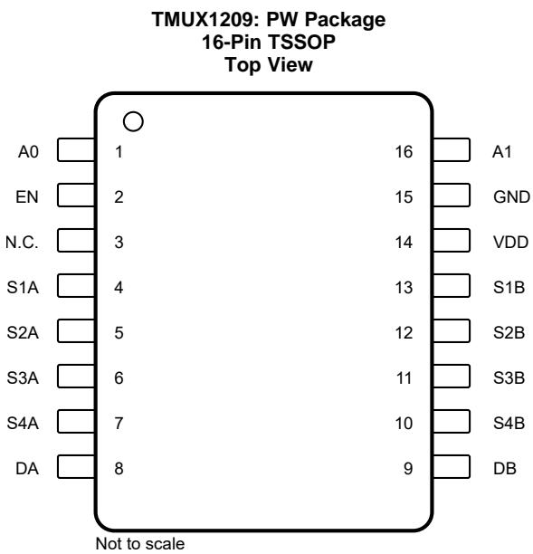

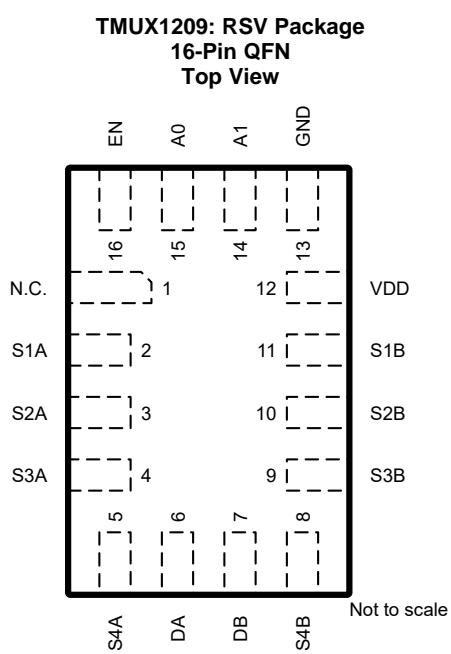

Pin Functions TMUX1209

<table><tr><td colspan="3">PIN</td><td rowspan="2">TYPE(1)</td><td rowspan="2">DESCRIPTION</td></tr><tr><td>NAME</td><td>TSSOP</td><td>UQFN</td></tr><tr><td>A0</td><td>1</td><td>15</td><td>I</td><td>Address line 0. Controls the switch configuration as shown in 表2.</td></tr><tr><td>EN</td><td>2</td><td>16</td><td>I</td><td>Active high logic input. When this pin is low, all switches are turned off. When this pin is high, the A[1:0] address inputs determine which switch is turned on.</td></tr><tr><td>N.C.</td><td>3</td><td>1</td><td>Not Connected</td><td>Not Connected</td></tr><tr><td>S1A</td><td>4</td><td>2</td><td>I/O</td><td>Source pin 1A. Can be an input or output.</td></tr><tr><td>S2A</td><td>5</td><td>3</td><td>I/O</td><td>Source pin 2A. Can be an input or output.</td></tr><tr><td>S3A</td><td>6</td><td>4</td><td>I/O</td><td>Source pin 3A. Can be an input or output.</td></tr><tr><td>S4A</td><td>7</td><td>5</td><td>I/O</td><td>Source pin 4A. Can be an input or output.</td></tr><tr><td>DA</td><td>8</td><td>6</td><td>I/O</td><td>Drain pin A. Can be an input or output.</td></tr><tr><td>DB</td><td>9</td><td>7</td><td>I/O</td><td>Drain pin B. Can be an input or output.</td></tr><tr><td>S4B</td><td>10</td><td>8</td><td>I/O</td><td>Source pin 4B. Can be an input or output.</td></tr><tr><td>S3B</td><td>11</td><td>9</td><td>I/O</td><td>Source pin 3B. Can be an input or output.</td></tr><tr><td>S2B</td><td>12</td><td>10</td><td>I/O</td><td>Source pin 2B. Can be an input or output.</td></tr><tr><td>S1B</td><td>13</td><td>11</td><td>I/O</td><td>Source pin 1B. Can be an input or output.</td></tr><tr><td>VDD</td><td>14</td><td>12</td><td>P</td><td>Positive power supply. This pin is the most positive power-supply potential. For reliable operation, connect a decoupling capacitor ranging from 0.1 μF to 10 μF between V_DD and GND.</td></tr><tr><td>GND</td><td>15</td><td>13</td><td>P</td><td>Ground (0 V) reference</td></tr><tr><td>A1</td><td>16</td><td>14</td><td>I</td><td>Address line 1. Controls the switch configuration as shown in 表2.</td></tr></table>

(1) I = input, O = output, I/O = input and output, P = power

## 7 Specifications

## 7.1 Absolute Maximum Ratings

over operating free-air temperature range (unless otherwise noted)(1) (2) (3)

<table><tr><td colspan="2"></td><td>MIN</td><td>MAX</td><td>UNIT</td></tr><tr><td> $V_{DD}$ </td><td>Supply voltage</td><td>-0.3</td><td>6</td><td>V</td></tr><tr><td> $V_{SEL}$  or  $V_{EN}$ </td><td>Logic control input pin voltage (EN, A0, A1, A2)</td><td>-0.3</td><td>6</td><td>V</td></tr><tr><td> $I_{SEL}$  or  $I_{EN}$ </td><td>Logic control input pin current (EN, A0, A1, A2)</td><td>-30</td><td>30</td><td>mA</td></tr><tr><td> $V_S$  or  $V_D$ </td><td>Source or drain voltage (Sx, D)</td><td>-0.5</td><td> $V_{DD}+0.5$ </td><td>V</td></tr><tr><td> $I_S$  or  $I_D$ (CONT)</td><td>Source or drain continuous current (Sx, D)</td><td>-30</td><td>30</td><td>mA</td></tr><tr><td> $T_{stg}$ </td><td>Storage temperature</td><td>-65</td><td>150</td><td>°C</td></tr><tr><td> $T_J$ </td><td>Junction temperature</td><td></td><td>150</td><td>°C</td></tr></table>

(1) Stresses beyond those listed under Absolute Maximum Rating may cause permanent damage to the device. These are stress ratings only, which do not imply functional operation of the device at these or any other conditions beyond those indicated under Recommended Operating Condition. Exposure to absolute-maximum-rated conditions for extended periods may affect device reliability.

(2) The algebraic convention, whereby the most negative value is a minimum and the most positive value is a maximum.

(3) All voltages are with respect to ground, unless otherwise specified.

## 7.2 ESD Ratings

<table><tr><td colspan="3"></td><td>VALUE</td><td>UNIT</td></tr><tr><td rowspan="2"> $V_{(ESD)}$ </td><td rowspan="2">Electrostatic discharge</td><td>Human body model (HBM), per ANSI/ESDA/JEDEC JS-001, all pins $^{(1)}$ </td><td>±2000</td><td rowspan="2">V</td></tr><tr><td>Charged device model (CDM), per JEDEC specification JESD22-C101, all pins $^{(2)}$ </td><td>±750</td></tr></table>

(1) JEDEC document JEP155 states that 500-V HBM allows safe manufacturing with a standard ESD control process.  
(2) JEDEC document JEP157 states that 250-V CDM allows safe manufacturing with a standard ESD control process.

## 7.3 Recommended Operating Conditions

over operating free-air temperature range (unless otherwise noted)

<table><tr><td colspan="2"></td><td>MIN</td><td>NOM</td><td>MAX</td><td>UNIT</td></tr><tr><td> $V_{DD}$ </td><td>Supply voltage</td><td>1.08</td><td></td><td>5.5</td><td>V</td></tr><tr><td> $V_S$  or  $V_D$ </td><td>Signal path input/output voltage (source or drain pin) (Sx, D)</td><td>0</td><td></td><td> $V_{DD}$ </td><td>V</td></tr><tr><td> $V_{SEL}$  or  $V_{EN}$ </td><td>Logic control input pin voltage (EN, A0, A1, A2)</td><td>0</td><td></td><td>5.5</td><td>V</td></tr><tr><td> $T_A$ </td><td>Ambient temperature</td><td>-40</td><td></td><td>125</td><td>°C</td></tr></table>

## 7.4 Thermal Information

<table><tr><td rowspan="3" colspan="2">THERMAL METRIC</td><td colspan="2">TMUX1208 / TMUX1209</td><td rowspan="3">UNIT</td></tr><tr><td>PW (TSSOP)</td><td>RSV (QFN)</td></tr><tr><td>16 PINS</td><td>16 PINS</td></tr><tr><td> $R_{\theta JA}$ </td><td>Junction-to-ambient thermal resistance</td><td>118.9</td><td>134.6</td><td>°C/W</td></tr><tr><td> $R_{\theta JC(top)}$ </td><td>Junction-to-case (top) thermal resistance</td><td>49.3</td><td>74.3</td><td>°C/W</td></tr><tr><td> $R_{\theta JB}$ </td><td>Junction-to-board thermal resistance</td><td>65.2</td><td>62.8</td><td>°C/W</td></tr><tr><td> $\Psi_{JT}$ </td><td>Junction-to-top characterization parameter</td><td>7.6</td><td>4.3</td><td>°C/W</td></tr><tr><td> $\Psi_{JB}$ </td><td>Junction-to-board characterization parameter</td><td>64.6</td><td>61.1</td><td>°C/W</td></tr><tr><td> $R_{\theta JC(bot)}$ </td><td>Junction-to-case (bottom) thermal resistance</td><td>N/A</td><td>N/A</td><td>°C/W</td></tr></table>

7.5 Electrical Characteristics $( \mathsf { V } _ { \mathsf { D D } } = 5 \mathrm { ~ V ~ } _ { \pm 1 0 } \mathrm { ~ \% } )$ at $\mathsf { T } _ { \mathsf { A } } = 2 5 ^ { \circ } \mathsf { C } , \mathsf { V } _ { \mathsf { D } \mathsf { D } } = 5 \mathsf { V }$ (unless otherwise noted)

<table><tr><td colspan="2">PARAMETER</td><td>TEST CONDITIONS</td><td>TA</td><td>MIN</td><td>TYP</td><td>MAX</td><td>UNIT</td></tr><tr><td colspan="8">ANALOG SWITCH</td></tr><tr><td rowspan="3"> $R_{ON}$ </td><td rowspan="3">On-resistance</td><td rowspan="3"> $V_{S}=0 V to V_{DD}$  $I_{SD}=10 mA$ Refer to On-Resistance</td><td>25°C</td><td></td><td>5</td><td></td><td>Ω</td></tr><tr><td>-40°C to +85°C</td><td></td><td></td><td>7</td><td>Ω</td></tr><tr><td>-40°C to +125°C</td><td></td><td></td><td>9</td><td>Ω</td></tr><tr><td rowspan="3"> $\Delta R_{ON}$ </td><td rowspan="3">On-resistance matching between channels</td><td rowspan="3"> $V_{S}=0 V to V_{DD}$  $I_{SD}=10 mA$ Refer to On-Resistance</td><td>25°C</td><td></td><td>0.15</td><td></td><td>Ω</td></tr><tr><td>-40°C to +85°C</td><td></td><td></td><td>1</td><td>Ω</td></tr><tr><td>-40°C to +125°C</td><td></td><td></td><td>1</td><td>Ω</td></tr><tr><td rowspan="3"> $R_{ON}$ FLAT</td><td rowspan="3">On-resistance flatness</td><td rowspan="3"> $V_{S}=0 V to V_{DD}$  $I_{SD}=10 mA$ Refer to On-Resistance</td><td>25°C</td><td></td><td>1.5</td><td></td><td>Ω</td></tr><tr><td>-40°C to +85°C</td><td></td><td>2</td><td></td><td>Ω</td></tr><tr><td>-40°C to +125°C</td><td></td><td>3</td><td></td><td>Ω</td></tr><tr><td rowspan="3"> $I_{S(OFF)}$ </td><td rowspan="3">Source off leakage current(1)</td><td rowspan="3"> $V_{DD}=5 V$ Switch Off $V_{D}=4.5 V/1 V$   $V_{S}=1 V/4.5 V$ Refer to Off-Leakage Current</td><td>25°C</td><td></td><td>±75</td><td></td><td>nA</td></tr><tr><td>-40°C to +85°C</td><td>-150</td><td></td><td>150</td><td>nA</td></tr><tr><td>-40°C to +125°C</td><td>-175</td><td></td><td>175</td><td>nA</td></tr><tr><td rowspan="3"> $I_{D(OFF)}$ </td><td rowspan="3">Drain off leakage current(1)</td><td rowspan="3"> $V_{DD}=5 V$ Switch Off $V_{D}=4.5 V/1 V$   $V_{S}=1 V/4.5 V$ Refer to Off-Leakage Current</td><td>25°C</td><td></td><td>±200</td><td></td><td>nA</td></tr><tr><td>-40°C to +85°C</td><td>-500</td><td></td><td>500</td><td>nA</td></tr><tr><td>-40°C to +125°C</td><td>-750</td><td></td><td>750</td><td>nA</td></tr><tr><td rowspan="3"> $I_{D(ON)}$   $I_{S(ON)}$ </td><td rowspan="3">Channel on leakage current</td><td rowspan="3"> $V_{DD}=5 V$ Switch On $V_{D}=V_{S}=4.5 V/1 V$ Refer to On-Leakage Current</td><td>25°C</td><td></td><td>±200</td><td></td><td>nA</td></tr><tr><td>-40°C to +85°C</td><td>-500</td><td></td><td>500</td><td>nA</td></tr><tr><td>-40°C to +125°C</td><td>-750</td><td></td><td>750</td><td>nA</td></tr><tr><td colspan="8">LOGIC INPUTS (EN, A0, A1, A2)</td></tr><tr><td> $V_{IH}$ </td><td>Input logic high</td><td></td><td>-40°C to 125°C</td><td>1.49</td><td></td><td>5.5</td><td>V</td></tr><tr><td> $V_{IL}$ </td><td>Input logic low</td><td></td><td>-40°C to 125°C</td><td>0</td><td></td><td>0.87</td><td>V</td></tr><tr><td> $I_{IH}$  $I_{IL}$ </td><td>Input leakage current</td><td></td><td>25°C</td><td></td><td>±0.005</td><td></td><td>μA</td></tr><tr><td> $I_{IH}$  $I_{IL}$ </td><td>Input leakage current</td><td></td><td>-40°C to +125°C</td><td></td><td></td><td>±0.10</td><td>μA</td></tr><tr><td> $C_{IN}$ </td><td>Logic input capacitance</td><td></td><td>25°C</td><td></td><td>1</td><td></td><td>pF</td></tr><tr><td> $C_{IN}$ </td><td>Logic input capacitance</td><td></td><td>-40°C to +125°C</td><td></td><td></td><td>2</td><td>pF</td></tr><tr><td colspan="8">POWER SUPPLY</td></tr><tr><td rowspan="2"> $I_{DD}$ </td><td rowspan="2"> $V_{DD}$  supply current</td><td rowspan="2">Logic inputs = 0 V or 5.5 V</td><td>25°C</td><td></td><td>0.02</td><td></td><td>μA</td></tr><tr><td>-40°C to +125°C</td><td></td><td></td><td>2.7</td><td>μA</td></tr></table>

(1) When ${ \sf V } _ { \sf S }$ is 4.5 V, VD is 1 V, and vice versa.

## Electrical Characteristics $( \mathsf { V } _ { \mathsf { D D } } = 5 \mathrm { ~ V ~ } _ { \pm 1 0 } \mathrm { ~ \% } )$ (continued)

at $\mathsf { T } _ { \mathsf { A } } = 2 5 ^ { \circ } \mathsf { C } , \mathsf { V } _ { \mathsf { D } \mathsf { D } } = 5 \mathsf { V }$ (unless otherwise noted)

<table><tr><td colspan="2">PARAMETER</td><td>TEST CONDITIONS</td><td>TA</td><td>MIN</td><td>TYP</td><td>MAX</td><td>UNIT</td></tr><tr><td colspan="8">DYNAMIC CHARACTERISTICS</td></tr><tr><td rowspan="3"> $t_{TRAN}$ </td><td rowspan="3">Transition time between channels</td><td rowspan="3"> $V_S=3 V$  $R_L=200 \Omega, C_L=15 pF$ Refer to Transition Time</td><td>25°C</td><td></td><td>14</td><td></td><td>ns</td></tr><tr><td>-40°C to +85°C</td><td></td><td></td><td>33</td><td>ns</td></tr><tr><td>-40°C to +125°C</td><td></td><td></td><td>33</td><td>ns</td></tr><tr><td rowspan="3"> $t_{OPEN(BBM)}$ </td><td rowspan="3">Break before make time</td><td rowspan="3"> $V_S=3 V$  $R_L=200 \Omega, C_L=15 pF$ Refer to Break-Before-Make</td><td>25°C</td><td></td><td>8</td><td></td><td>ns</td></tr><tr><td>-40°C to +85°C</td><td>1</td><td></td><td></td><td>ns</td></tr><tr><td>-40°C to +125°C</td><td>1</td><td></td><td></td><td>ns</td></tr><tr><td rowspan="3"> $t_{ON(EN)}$ </td><td rowspan="3">Enable turn-on time</td><td rowspan="3"> $V_S=3 V$  $R_L=200 \Omega, C_L=15 pF$ Refer to  $t_{ON(EN)}$  and  $t_{OFF(EN)}$ </td><td>25°C</td><td></td><td>14</td><td></td><td>ns</td></tr><tr><td>-40°C to +85°C</td><td></td><td></td><td>20</td><td>ns</td></tr><tr><td>-40°C to +125°C</td><td></td><td></td><td>20</td><td>ns</td></tr><tr><td rowspan="3"> $t_{OFF(EN)}$ </td><td rowspan="3">Enable turn-off time</td><td rowspan="3"> $V_S=3 V$  $R_L=200 \Omega, C_L=15 pF$ Refer to  $t_{ON(EN)}$  and  $t_{OFF(EN)}$ </td><td>25°C</td><td></td><td>5</td><td></td><td>ns</td></tr><tr><td>-40°C to +85°C</td><td></td><td></td><td>20</td><td>ns</td></tr><tr><td>-40°C to +125°C</td><td></td><td></td><td>20</td><td>ns</td></tr><tr><td> $Q_C$ </td><td>Charge Injection</td><td> $V_S=V_{DD}/2$  $R_S=0 \Omega, C_L=1 nF$ Refer to Charge Injection</td><td>25°C</td><td></td><td>±9</td><td></td><td>pC</td></tr><tr><td rowspan="2"> $O_{ISO}$ </td><td rowspan="2">Off Isolation</td><td> $R_L=50 \Omega, C_L=5 pF$  $f=1 MHz$ Refer to Off Isolation</td><td>25°C</td><td></td><td>-62</td><td></td><td>dB</td></tr><tr><td> $R_L=50 \Omega, C_L=5 pF$  $f=10 MHz$ Refer to Off Isolation</td><td>25°C</td><td></td><td>-42</td><td></td><td>dB</td></tr><tr><td rowspan="2"> $X_{TALK}$ </td><td rowspan="2">Crosstalk</td><td> $R_L=50 \Omega, C_L=5 pF$  $f=1 MHz$ Refer to Crosstalk</td><td>25°C</td><td></td><td>-62</td><td></td><td>dB</td></tr><tr><td> $R_L=50 \Omega, C_L=5 pF$  $f=10 MHz$ Refer to Crosstalk</td><td>25°C</td><td></td><td>-42</td><td></td><td>dB</td></tr><tr><td rowspan="2">BW</td><td>Bandwidth - TMUX1208</td><td> $R_L=50 \Omega, C_L=5 pF$  $Refer to Bandwidth$ </td><td>25°C</td><td></td><td>65</td><td></td><td>MHz</td></tr><tr><td>Bandwidth - TMUX1209</td><td> $R_L=50 \Omega, C_L=5 pF$  $Refer to Bandwidth$ </td><td>25°C</td><td></td><td>125</td><td></td><td>MHz</td></tr><tr><td> $C_{SOFF}$ </td><td>Source off capacitance</td><td> $f=1 MHz$ </td><td>25°C</td><td></td><td>13</td><td></td><td>pF</td></tr><tr><td rowspan="2"> $C_{DOFF}$ </td><td>Drain off capacitance - TMUX1208</td><td> $f=1 MHz$ </td><td>25°C</td><td></td><td>76</td><td></td><td>pF</td></tr><tr><td>Drain off capacitance - TMUX1209</td><td> $f=1 MHz$ </td><td>25°C</td><td></td><td>38</td><td></td><td>pF</td></tr><tr><td rowspan="2"> $C_{SON}$  $C_{DON}$ </td><td>On capacitance - TMUX1208</td><td> $f=1 MHz$ </td><td>25°C</td><td></td><td>85</td><td></td><td>pF</td></tr><tr><td>On capacitance - TMUX1209</td><td> $f=1 MHz$ </td><td>25°C</td><td></td><td>42</td><td></td><td>pF</td></tr></table>

7.6 Electrical Characteristics $( \mathsf { V } _ { \mathsf { D D } } = 3 . 3 \ \mathsf { V } \pm 1 0 \ \% )$ at $\mathsf { T } _ { \mathsf { A } } = 2 5 ^ { \circ } \mathsf { C } , \mathsf { V } _ { \mathsf { D D } } = 3 . 3 \mathsf { V }$ (unless otherwise noted)

<table><tr><td colspan="2">PARAMETER</td><td>TEST CONDITIONS</td><td>TA</td><td>MIN</td><td>TYP</td><td>MAX</td><td>UNIT</td></tr><tr><td colspan="8">ANALOG SWITCH</td></tr><tr><td rowspan="3"> $R_{ON}$ </td><td rowspan="3">On-resistance</td><td rowspan="3"> $V_{S}=0 V to V_{DD}$  $I_{SD}=10 mA$ Refer to On-Resistance</td><td>25°C</td><td></td><td>9</td><td></td><td>Ω</td></tr><tr><td>-40°C to +85°C</td><td></td><td></td><td>15</td><td>Ω</td></tr><tr><td>-40°C to +125°C</td><td></td><td></td><td>17</td><td>Ω</td></tr><tr><td rowspan="3"> $\Delta R_{ON}$ </td><td rowspan="3">On-resistance matching between channels</td><td rowspan="3"> $V_{S}=0 V to V_{DD}$  $I_{SD}=10 mA$ Refer to On-Resistance</td><td>25°C</td><td></td><td>0.15</td><td></td><td>Ω</td></tr><tr><td>-40°C to +85°C</td><td></td><td></td><td>1</td><td>Ω</td></tr><tr><td>-40°C to +125°C</td><td></td><td></td><td>1</td><td>Ω</td></tr><tr><td rowspan="3"> $R_{ON}$ FLAT</td><td rowspan="3">On-resistance flatness</td><td rowspan="3"> $V_{S}=0 V to V_{DD}$  $I_{SD}=10 mA$ Refer to On-Resistance</td><td>25°C</td><td></td><td>3</td><td></td><td>Ω</td></tr><tr><td>-40°C to +85°C</td><td></td><td>5</td><td></td><td>Ω</td></tr><tr><td>-40°C to +125°C</td><td></td><td>6</td><td></td><td>Ω</td></tr><tr><td rowspan="3"> $I_{S(OFF)}$ </td><td rowspan="3">Source off leakage current(1)</td><td rowspan="3"> $V_{DD}=3.3 V$ Switch Off $V_{D}=3 V/1 V$   $V_{S}=1 V/3 V$ Refer to Off-Leakage Current</td><td>25°C</td><td></td><td>±75</td><td></td><td>nA</td></tr><tr><td>-40°C to +85°C</td><td>-150</td><td></td><td>150</td><td>nA</td></tr><tr><td>-40°C to +125°C</td><td>-175</td><td></td><td>175</td><td>nA</td></tr><tr><td rowspan="3"> $I_{D(OFF)}$ </td><td rowspan="3">Drain off leakage current(1)</td><td rowspan="3"> $V_{DD}=3.3 V$ Switch Off $V_{D}=3 V/1 V$   $V_{S}=1 V/3 V$ Refer to Off-Leakage Current</td><td>25°C</td><td></td><td>±200</td><td></td><td>nA</td></tr><tr><td>-40°C to +85°C</td><td>-500</td><td></td><td>500</td><td>nA</td></tr><tr><td>-40°C to +125°C</td><td>-750</td><td></td><td>750</td><td>nA</td></tr><tr><td rowspan="3"> $I_{D(ON)}$   $I_{S(ON)}$ </td><td rowspan="3">Channel on leakage current</td><td rowspan="3"> $V_{DD}=3.3 V$ Switch On $V_{D}=V_{S}=3 V/1 V$ Refer to On-Leakage Current</td><td>25°C</td><td></td><td>±200</td><td></td><td>nA</td></tr><tr><td>-40°C to +85°C</td><td>-500</td><td></td><td>500</td><td>nA</td></tr><tr><td>-40°C to +125°C</td><td>-750</td><td></td><td>750</td><td>nA</td></tr><tr><td colspan="8">LOGIC INPUTS (EN, A0, A1, A2)</td></tr><tr><td> $V_{IH}$ </td><td>Input logic high</td><td></td><td>-40°C to 125°C</td><td>1.35</td><td></td><td>5.5</td><td>V</td></tr><tr><td> $V_{IL}$ </td><td>Input logic low</td><td></td><td>-40°C to 125°C</td><td>0</td><td></td><td>0.8</td><td>V</td></tr><tr><td> $I_{IH}$  $I_{IL}$ </td><td>Input leakage current</td><td></td><td>25°C</td><td></td><td>±0.005</td><td></td><td>μA</td></tr><tr><td> $I_{IH}$  $I_{IL}$ </td><td>Input leakage current</td><td></td><td>-40°C to +125°C</td><td></td><td></td><td>±0.10</td><td>μA</td></tr><tr><td> $C_{IN}$ </td><td>Logic input capacitance</td><td></td><td>25°C</td><td></td><td>1</td><td></td><td>pF</td></tr><tr><td> $C_{IN}$ </td><td>Logic input capacitance</td><td></td><td>-40°C to +125°C</td><td></td><td></td><td>2</td><td>pF</td></tr><tr><td colspan="8">POWER SUPPLY</td></tr><tr><td rowspan="2"> $I_{DD}$ </td><td rowspan="2"> $V_{DD}$  supply current</td><td rowspan="2">Logic inputs = 0 V or 5.5 V</td><td>25°C</td><td></td><td>0.01</td><td></td><td>μA</td></tr><tr><td>-40°C to +125°C</td><td></td><td></td><td>1.5</td><td>μA</td></tr></table>

(1) When ${ \sf V } _ { \sf S }$ is 3 V, $\mathsf { V } _ { \mathsf { D } }$ is 1 V, and vice versa.

## Electrical Characteristics $( \mathsf { V } _ { \mathsf { D D } } = 3 . 3 \ \mathsf { V } \pm 1 0 \ \% )$ (continued)

at $\mathsf { T } _ { \mathsf { A } } = 2 5 ^ { \circ } \mathsf { C } , \mathsf { V } _ { \mathsf { D D } } = 3 . 3 \mathsf { V }$ (unless otherwise noted)

<table><tr><td colspan="2">PARAMETER</td><td>TEST CONDITIONS</td><td>TA</td><td>MIN</td><td>TYP</td><td>MAX</td><td>UNIT</td></tr><tr><td colspan="8">DYNAMIC CHARACTERISTICS</td></tr><tr><td rowspan="3"> $t_{TRAN}$ </td><td rowspan="3">Transition time between channels</td><td rowspan="3"> $V_S=2 V$  $R_L=200 \Omega, C_L=15 pF$ Refer to Transition Time</td><td>25°C</td><td></td><td>14</td><td></td><td>ns</td></tr><tr><td>-40°C to +85°C</td><td></td><td></td><td>25</td><td>ns</td></tr><tr><td>-40°C to +125°C</td><td></td><td></td><td>25</td><td>ns</td></tr><tr><td rowspan="3"> $t_{OPEN(BBM)}$ </td><td rowspan="3">Break before make time</td><td rowspan="3"> $V_S=2 V$  $R_L=200 \Omega, C_L=15 pF$ Refer to Break-Before-Make</td><td>25°C</td><td></td><td>8</td><td></td><td>ns</td></tr><tr><td>-40°C to +85°C</td><td>1</td><td></td><td></td><td>ns</td></tr><tr><td>-40°C to +125°C</td><td>1</td><td></td><td></td><td>ns</td></tr><tr><td rowspan="3"> $t_{ON(EN)}$ </td><td rowspan="3">Enable turn-on time</td><td rowspan="3"> $V_S=2 V$  $R_L=200 \Omega, C_L=15 pF$ Refer to  $t_{ON(EN)}$  and  $t_{OFF(EN)}$ </td><td>25°C</td><td></td><td>14</td><td></td><td>ns</td></tr><tr><td>-40°C to +85°C</td><td></td><td></td><td>25</td><td>ns</td></tr><tr><td>-40°C to +125°C</td><td></td><td></td><td>25</td><td>ns</td></tr><tr><td rowspan="3"> $t_{OFF(EN)}$ </td><td rowspan="3">Enable turn-off time</td><td rowspan="3"> $V_S=2 V$  $R_L=200 \Omega, C_L=15 pF$ Refer to  $t_{ON(EN)}$  and  $t_{OFF(EN)}$ </td><td>25°C</td><td></td><td>7</td><td></td><td>ns</td></tr><tr><td>-40°C to +85°C</td><td></td><td></td><td>13</td><td>ns</td></tr><tr><td>-40°C to +125°C</td><td></td><td></td><td>13</td><td>ns</td></tr><tr><td> $Q_C$ </td><td>Charge Injection</td><td> $V_S=V_{DD}/2$  $R_S=0 \Omega, C_L=1 nF$ Refer to Charge Injection</td><td>25°C</td><td></td><td>±7</td><td></td><td>pC</td></tr><tr><td rowspan="2"> $O_{ISO}$ </td><td rowspan="2">Off Isolation</td><td> $R_L=50 \Omega, C_L=5 pF$  $f=1 MHz$ Refer to Off Isolation</td><td>25°C</td><td></td><td>-62</td><td></td><td>dB</td></tr><tr><td> $R_L=50 \Omega, C_L=5 pF$  $f=10 MHz$ Refer to Off Isolation</td><td>25°C</td><td></td><td>-42</td><td></td><td>dB</td></tr><tr><td rowspan="2"> $X_{TALK}$ </td><td rowspan="2">Crosstalk</td><td> $R_L=50 \Omega, C_L=5 pF$  $f=1 MHz$ Refer to Crosstalk</td><td>25°C</td><td></td><td>-62</td><td></td><td>dB</td></tr><tr><td> $R_L=50 \Omega, C_L=5 pF$  $f=10 MHz$ Refer to Crosstalk</td><td>25°C</td><td></td><td>-42</td><td></td><td>dB</td></tr><tr><td rowspan="2">BW</td><td>Bandwidth - TMUX1208</td><td> $R_L=50 \Omega, C_L=5 pF$  $Refer to Bandwidth$ </td><td>25°C</td><td></td><td>65</td><td></td><td>MHz</td></tr><tr><td>Bandwidth - TMUX1209</td><td> $R_L=50 \Omega, C_L=5 pF$  $Refer to Bandwidth$ </td><td>25°C</td><td></td><td>125</td><td></td><td>MHz</td></tr><tr><td> $C_{SOFF}$ </td><td>Source off capacitance</td><td> $f=1 MHz$ </td><td>25°C</td><td></td><td>13</td><td></td><td>pF</td></tr><tr><td rowspan="2"> $C_{DOFF}$ </td><td>Drain off capacitance - TMUX1208</td><td> $f=1 MHz$ </td><td>25°C</td><td></td><td>76</td><td></td><td>pF</td></tr><tr><td>Drain off capacitance - TMUX1209</td><td> $f=1 MHz$ </td><td>25°C</td><td></td><td>38</td><td></td><td>pF</td></tr><tr><td rowspan="2"> $C_{SON}$  $C_{DON}$ </td><td>On capacitance - TMUX1208</td><td> $f=1 MHz$ </td><td>25°C</td><td></td><td>85</td><td></td><td>pF</td></tr><tr><td>On capacitance - TMUX1209</td><td> $f=1 MHz$ </td><td>25°C</td><td></td><td>42</td><td></td><td>pF</td></tr></table>

7.7 Electrical Characteristics $( \mathsf { V } _ { \mathsf { D D } } = 1 . 8 \ \mathsf { V } \pm 1 0 \ \% )$ at $\mathsf { T } _ { \mathsf { A } } = 2 5 ^ { \circ } \mathsf { C } , \mathsf { V } _ { \mathsf { D D } } = 1 . 8 \mathsf { V }$ (unless otherwise noted)

<table><tr><td colspan="2">PARAMETER</td><td>TEST CONDITIONS</td><td>TA</td><td>MIN</td><td>TYP</td><td>MAX</td><td>UNIT</td></tr><tr><td colspan="8">ANALOG SWITCH</td></tr><tr><td rowspan="3"> $R_{ON}$ </td><td rowspan="3">On-resistance</td><td rowspan="3"> $V_S=0 V to V_{DD}$  $I_{SD}=10 mA$ Refer to On-Resistance</td><td>25°C</td><td></td><td>40</td><td></td><td>Ω</td></tr><tr><td>-40°C to +85°C</td><td></td><td></td><td>80</td><td>Ω</td></tr><tr><td>-40°C to +125°C</td><td></td><td></td><td>80</td><td>Ω</td></tr><tr><td rowspan="3"> $\Delta R_{ON}$ </td><td rowspan="3">On-resistance matching between channels</td><td rowspan="3"> $V_S=0 V to V_{DD}$  $I_{SD}=10 mA$ Refer to On-Resistance</td><td>25°C</td><td></td><td>0.15</td><td></td><td>Ω</td></tr><tr><td>-40°C to +85°C</td><td></td><td></td><td>1.5</td><td>Ω</td></tr><tr><td>-40°C to +125°C</td><td></td><td></td><td>1.5</td><td>Ω</td></tr><tr><td rowspan="3"> $I_{S(OFF)}$ </td><td rowspan="3">Source off leakage current(1)</td><td rowspan="3"> $V_{DD}=1.98 V$ Switch Off $V_D=1.8 V/1 V$   $V_S=1 V/1.8 V$ Refer to Off-Leakage Current</td><td>25°C</td><td></td><td>±75</td><td></td><td>nA</td></tr><tr><td>-40°C to +85°C</td><td>-150</td><td></td><td>150</td><td>nA</td></tr><tr><td>-40°C to +125°C</td><td>-175</td><td></td><td>175</td><td>nA</td></tr><tr><td rowspan="3"> $I_{D(OFF)}$ </td><td rowspan="3">Drain off leakage current(1)</td><td rowspan="3"> $V_{DD}=1.98 V$ Switch Off $V_D=1.8 V/1 V$   $V_S=1 V/1.8 V$ Refer to Off-Leakage Current</td><td>25°C</td><td></td><td>±200</td><td></td><td>nA</td></tr><tr><td>-40°C to +85°C</td><td>-500</td><td></td><td>500</td><td>nA</td></tr><tr><td>-40°C to +125°C</td><td>-750</td><td></td><td>750</td><td>nA</td></tr><tr><td rowspan="3"> $I_{D(ON)}$   $I_{S(ON)}$ </td><td rowspan="3">Channel on leakage current</td><td rowspan="3"> $V_{DD}=1.98 V$ Switch On $V_D=V_S=1.8 V/1 V$ Refer to On-Leakage Current</td><td>25°C</td><td></td><td>±200</td><td></td><td>nA</td></tr><tr><td>-40°C to +85°C</td><td>-500</td><td></td><td>500</td><td>nA</td></tr><tr><td>-40°C to +125°C</td><td>-750</td><td></td><td>750</td><td>nA</td></tr><tr><td colspan="8">LOGIC INPUTS (EN, A0, A1, A2)</td></tr><tr><td> $V_{IH}$ </td><td>Input logic high</td><td></td><td>-40°C to +125°C</td><td>1.07</td><td></td><td>5.5</td><td>V</td></tr><tr><td> $V_{IL}$ </td><td>Input logic low</td><td></td><td>-40°C to +125°C</td><td>0</td><td></td><td>0.68</td><td>V</td></tr><tr><td> $I_{IH}$  $I_{IL}$ </td><td>Input leakage current</td><td></td><td>25°C</td><td></td><td>±0.005</td><td></td><td>μA</td></tr><tr><td> $I_{IH}$  $I_{IL}$ </td><td>Input leakage current</td><td></td><td>-40°C to +125°C</td><td></td><td></td><td>±0.10</td><td>μA</td></tr><tr><td rowspan="2"> $C_{IN}$ </td><td rowspan="2">Logic input capacitance</td><td rowspan="2"></td><td>25°C</td><td></td><td>1</td><td></td><td>pF</td></tr><tr><td>-40°C to +125°C</td><td></td><td></td><td>2</td><td>pF</td></tr><tr><td colspan="8">POWER SUPPLY</td></tr><tr><td rowspan="2"> $I_{DD}$ </td><td rowspan="2"> $V_{DD}$  supply current</td><td rowspan="2">Logic inputs = 0 V or 5.5 V</td><td>25°C</td><td></td><td>0.006</td><td></td><td>μA</td></tr><tr><td>-40°C to +125°C</td><td></td><td></td><td>0.95</td><td>μA</td></tr></table>

(1) When ${ \sf V } _ { \sf S }$ is 1.8 V, VD is 1 V, and vice versa.

## Electrical Characteristics $( \mathsf { V } _ { \mathsf { D D } } = 1 . 8 \ \mathsf { V } \pm 1 0 \ \% )$ (continued)

at $\mathsf { T } _ { \mathsf { A } } = 2 5 ^ { \circ } \mathsf { C } , \mathsf { V } _ { \mathsf { D D } } = 1 . 8 \mathsf { V }$ (unless otherwise noted)

<table><tr><td colspan="2">PARAMETER</td><td>TEST CONDITIONS</td><td>TA</td><td>MIN</td><td>TYP</td><td>MAX</td><td>UNIT</td></tr><tr><td colspan="8">DYNAMIC CHARACTERISTICS</td></tr><tr><td rowspan="3"> $t_{TRAN}$ </td><td rowspan="3">Transition time between channels</td><td rowspan="3"> $V_S=1 V$  $R_L=200 \Omega, C_L=15 pF$ Refer to Transition Time</td><td>25°C</td><td></td><td>28</td><td></td><td>ns</td></tr><tr><td>-40°C to +85°C</td><td></td><td></td><td>48</td><td>ns</td></tr><tr><td>-40°C to +125°C</td><td></td><td></td><td>48</td><td>ns</td></tr><tr><td rowspan="3"> $t_{OPEN(BBM)}$ </td><td rowspan="3">Break before make time</td><td rowspan="3"> $V_S=1 V$  $R_L=200 \Omega, C_L=15 pF$ Refer to Break-Before-Make</td><td>25°C</td><td></td><td>16</td><td></td><td>ns</td></tr><tr><td>-40°C to +85°C</td><td>1</td><td></td><td></td><td>ns</td></tr><tr><td>-40°C to +125°C</td><td>1</td><td></td><td></td><td>ns</td></tr><tr><td rowspan="3"> $t_{ON(EN)}$ </td><td rowspan="3">Enable turn-on time</td><td rowspan="3"> $V_S=1 V$  $R_L=200 \Omega, C_L=15 pF$ Refer to  $t_{ON(EN)}$  and  $t_{OFF(EN)}$ </td><td>25°C</td><td></td><td>28</td><td></td><td>ns</td></tr><tr><td>-40°C to +85°C</td><td></td><td></td><td>48</td><td>ns</td></tr><tr><td>-40°C to +125°C</td><td></td><td></td><td>48</td><td>ns</td></tr><tr><td rowspan="3"> $t_{OFF(EN)}$ </td><td rowspan="3">Enable turn-off time</td><td rowspan="3"> $V_S=1 V$  $R_L=200 \Omega, C_L=15 pF$ Refer to  $t_{ON(EN)}$  and  $t_{OFF(EN)}$ </td><td>25°C</td><td></td><td>16</td><td></td><td>ns</td></tr><tr><td>-40°C to +85°C</td><td></td><td></td><td>27</td><td>ns</td></tr><tr><td>-40°C to +125°C</td><td></td><td></td><td>27</td><td>ns</td></tr><tr><td> $Q_C$ </td><td>Charge Injection</td><td> $V_S=V_{DD}/2$  $R_S=0 \Omega, C_L=1 nF$ Refer to Charge Injection</td><td>25°C</td><td></td><td>-2</td><td></td><td>pC</td></tr><tr><td rowspan="2"> $O_{ISO}$ </td><td rowspan="2">Off Isolation</td><td> $R_L=50 \Omega, C_L=5 pF$  $f=1 MHz$ Refer to Off Isolation</td><td>25°C</td><td></td><td>-62</td><td></td><td>dB</td></tr><tr><td> $R_L=50 \Omega, C_L=5 pF$  $f=10 MHz$ Refer to Off Isolation</td><td>25°C</td><td></td><td>-42</td><td></td><td>dB</td></tr><tr><td rowspan="2"> $X_{TALK}$ </td><td rowspan="2">Crosstalk</td><td> $R_L=50 \Omega, C_L=5 pF$  $f=1 MHz$ Refer to Crosstalk</td><td>25°C</td><td></td><td>-62</td><td></td><td>dB</td></tr><tr><td> $R_L=50 \Omega, C_L=5 pF$  $f=10 MHz$ Refer to Crosstalk</td><td>25°C</td><td></td><td>-42</td><td></td><td>dB</td></tr><tr><td rowspan="2">BW</td><td>Bandwidth - TMUX1208</td><td> $R_L=50 \Omega, C_L=5 pF$  $Refer to Bandwidth$ </td><td>25°C</td><td></td><td>65</td><td></td><td>MHz</td></tr><tr><td>Bandwidth - TMUX1209</td><td> $R_L=50 \Omega, C_L=5 pF$  $Refer to Bandwidth$ </td><td>25°C</td><td></td><td>125</td><td></td><td>MHz</td></tr><tr><td> $C_{SOFF}$ </td><td>Source off capacitance</td><td> $f=1 MHz$ </td><td>25°C</td><td></td><td>13</td><td></td><td>pF</td></tr><tr><td rowspan="2"> $C_{DOFF}$ </td><td>Drain off capacitance - TMUX1208</td><td> $f=1 MHz$ </td><td>25°C</td><td></td><td>76</td><td></td><td>pF</td></tr><tr><td>Drain off capacitance - TMUX1209</td><td> $f=1 MHz$ </td><td>25°C</td><td></td><td>38</td><td></td><td>pF</td></tr><tr><td rowspan="2"> $C_{SON}$  $C_{DON}$ </td><td>On capacitance - TMUX1208</td><td> $f=1 MHz$ </td><td>25°C</td><td></td><td>85</td><td></td><td>pF</td></tr><tr><td>On capacitance - TMUX1209</td><td> $f=1 MHz$ </td><td>25°C</td><td></td><td>42</td><td></td><td>pF</td></tr></table>

7.8 Electrical Characteristics $( \mathsf { V } _ { \mathsf { D D } } = 1 . 2 \ \mathsf { V } \pm 1 0 \ \% )$ at $\mathsf { T } _ { \mathsf { A } } = 2 5 ^ { \circ } \mathsf { C } , \mathsf { V } _ { \mathsf { D D } } = 1 . 2 \mathsf { V }$ (unless otherwise noted)

<table><tr><td colspan="2">PARAMETER</td><td>TEST CONDITIONS</td><td>TA</td><td>MIN</td><td>TYP</td><td>MAX</td><td>UNIT</td></tr><tr><td colspan="8">ANALOG SWITCH</td></tr><tr><td rowspan="3"> $R_{ON}$ </td><td rowspan="3">On-resistance</td><td rowspan="3"> $V_S=0 V to V_{DD}$  $I_{SD}=10 mA$ Refer to On-Resistance</td><td>25°C</td><td></td><td>70</td><td></td><td>Ω</td></tr><tr><td>-40°C to +85°C</td><td></td><td></td><td>105</td><td>Ω</td></tr><tr><td>-40°C to +125°C</td><td></td><td></td><td>105</td><td>Ω</td></tr><tr><td rowspan="3"> $\Delta R_{ON}$ </td><td rowspan="3">On-resistance matching between channels</td><td rowspan="3"> $V_S=0 V to V_{DD}$  $I_{SD}=10 mA$ Refer to On-Resistance</td><td>25°C</td><td></td><td>0.15</td><td></td><td>Ω</td></tr><tr><td>-40°C to +85°C</td><td></td><td></td><td>1.5</td><td>Ω</td></tr><tr><td>-40°C to +125°C</td><td></td><td></td><td>1.5</td><td>Ω</td></tr><tr><td rowspan="3"> $I_{S(OFF)}$ </td><td rowspan="3">Source off leakage current(1)</td><td rowspan="3"> $V_{DD}=1.32 V$ Switch Off $V_D=1.2 V/1 V$   $V_S=1 V/1.2 V$ Refer to Off-Leakage Current</td><td>25°C</td><td></td><td>±75</td><td></td><td>nA</td></tr><tr><td>-40°C to +85°C</td><td>-150</td><td></td><td>150</td><td>nA</td></tr><tr><td>-40°C to +125°C</td><td>-175</td><td></td><td>175</td><td>nA</td></tr><tr><td rowspan="3"> $I_{D(OFF)}$ </td><td rowspan="3">Drain off leakage current(1)</td><td rowspan="3"> $V_{DD}=1.32 V$ Switch Off $V_D=1.2 V/1 V$   $V_S=1 V/1.2 V$ Refer to Off-Leakage Current</td><td>25°C</td><td></td><td>±200</td><td></td><td>nA</td></tr><tr><td>-40°C to +85°C</td><td>-500</td><td></td><td>500</td><td>nA</td></tr><tr><td>-40°C to +125°C</td><td>-750</td><td></td><td>750</td><td>nA</td></tr><tr><td rowspan="3"> $I_{D(ON)}$   $I_{S(ON)}$ </td><td rowspan="3">Channel on leakage current</td><td rowspan="3"> $V_{DD}=1.32 V$ Switch On $V_D=V_S=1.2 V/1 V$ Refer to On-Leakage Current</td><td>25°C</td><td></td><td>±200</td><td></td><td>nA</td></tr><tr><td>-40°C to +85°C</td><td>-500</td><td></td><td>500</td><td>nA</td></tr><tr><td>-40°C to +125°C</td><td>-750</td><td></td><td>750</td><td>nA</td></tr><tr><td colspan="8">LOGIC INPUTS (EN, A0, A1, A2)</td></tr><tr><td> $V_{IH}$ </td><td>Input logic high</td><td></td><td>-40°C to +125°C</td><td>0.96</td><td></td><td>5.5</td><td>V</td></tr><tr><td> $V_{IL}$ </td><td>Input logic low</td><td></td><td>-40°C to +125°C</td><td>0</td><td></td><td>0.36</td><td>V</td></tr><tr><td> $I_{IH}$  $I_{IL}$ </td><td>Input leakage current</td><td></td><td>25°C</td><td></td><td>±0.005</td><td></td><td>μA</td></tr><tr><td> $I_{IH}$  $I_{IL}$ </td><td>Input leakage current</td><td></td><td>-40°C to +125°C</td><td></td><td></td><td>±0.10</td><td>μA</td></tr><tr><td rowspan="2"> $C_{IN}$ </td><td rowspan="2">Logic input capacitance</td><td rowspan="2"></td><td>25°C</td><td></td><td>1</td><td></td><td>pF</td></tr><tr><td>-40°C to +125°C</td><td></td><td></td><td>2</td><td>pF</td></tr><tr><td colspan="8">POWER SUPPLY</td></tr><tr><td rowspan="2"> $I_{DD}$ </td><td rowspan="2"> $V_{DD}$  supply current</td><td rowspan="2">Logic inputs = 0 V or 5.5 V</td><td>25°C</td><td></td><td>0.005</td><td></td><td>μA</td></tr><tr><td>-40°C to +125°C</td><td></td><td></td><td>0.8</td><td>μA</td></tr></table>

(1) When ${ \sf V } _ { \sf S }$ is 1.2 V, VD is 1 V, and vice versa.

## Electrical Characteristics $( \mathsf { V } _ { \mathsf { D D } } = 1 . 2 \ \mathsf { V } \pm 1 0 \ \% )$ (continued)

at $\mathsf { T } _ { \mathsf { A } } = 2 5 ^ { \circ } \mathsf { C } , \mathsf { V } _ { \mathsf { D D } } = 1 . 2 \mathsf { V }$ (unless otherwise noted)

<table><tr><td colspan="2">PARAMETER</td><td>TEST CONDITIONS</td><td>TA</td><td>MIN</td><td>TYP</td><td>MAX</td><td>UNIT</td></tr><tr><td colspan="8">DYNAMIC CHARACTERISTICS</td></tr><tr><td rowspan="3"> $t_{TRAN}$ </td><td rowspan="3">Transition time between channels</td><td rowspan="3"> $V_S=1 V$  $R_L=200 \Omega, C_L=15 pF$ Refer to Transition Time</td><td>25°C</td><td></td><td>60</td><td></td><td>ns</td></tr><tr><td>-40°C to +85°C</td><td></td><td></td><td>210</td><td>ns</td></tr><tr><td>-40°C to +125°C</td><td></td><td></td><td>210</td><td>ns</td></tr><tr><td rowspan="3"> $t_{OPEN(BBM)}$ </td><td rowspan="3">Break before make time</td><td rowspan="3"> $V_S=1 V$  $R_L=200 \Omega, C_L=15 pF$ Refer to Break-Before-Make</td><td>25°C</td><td></td><td>28</td><td></td><td>ns</td></tr><tr><td>-40°C to +85°C</td><td>1</td><td></td><td></td><td>ns</td></tr><tr><td>-40°C to +125°C</td><td>1</td><td></td><td></td><td>ns</td></tr><tr><td rowspan="3"> $t_{ON(EN)}$ </td><td rowspan="3">Enable turn-on time</td><td rowspan="3"> $V_S=1 V$  $R_L=200 \Omega, C_L=15 pF$ Refer to  $t_{ON(EN)}$  and  $t_{OFF(EN)}$ </td><td>25°C</td><td></td><td>60</td><td></td><td>ns</td></tr><tr><td>-40°C to +85°C</td><td></td><td></td><td>190</td><td>ns</td></tr><tr><td>-40°C to +125°C</td><td></td><td></td><td>190</td><td>ns</td></tr><tr><td rowspan="3"> $t_{OFF(EN)}$ </td><td rowspan="3">Enable turn-off time</td><td rowspan="3"> $V_S=1 V$  $R_L=200 \Omega, C_L=15 pF$ Refer to  $t_{ON(EN)}$  and  $t_{OFF(EN)}$ </td><td>25°C</td><td></td><td>45</td><td></td><td>ns</td></tr><tr><td>-40°C to +85°C</td><td></td><td></td><td>150</td><td>ns</td></tr><tr><td>-40°C to +125°C</td><td></td><td></td><td>150</td><td>ns</td></tr><tr><td> $Q_C$ </td><td>Charge Injection</td><td> $V_S=V_{DD}/2$  $R_S=0 \Omega, C_L=1 nF$ Refer to Charge Injection</td><td>25°C</td><td></td><td>±2</td><td></td><td>pC</td></tr><tr><td rowspan="2"> $O_{ISO}$ </td><td rowspan="2">Off Isolation</td><td> $R_L=50 \Omega, C_L=5 pF$  $f=1 MHz$ Refer to Off Isolation</td><td>25°C</td><td></td><td>-62</td><td></td><td>dB</td></tr><tr><td> $R_L=50 \Omega, C_L=5 pF$  $f=10 MHz$ Refer to Off Isolation</td><td>25°C</td><td></td><td>-42</td><td></td><td>dB</td></tr><tr><td rowspan="2"> $X_{TALK}$ </td><td rowspan="2">Crosstalk</td><td> $R_L=50 \Omega, C_L=5 pF$  $f=1 MHz$ Refer to Crosstalk</td><td>25°C</td><td></td><td>-62</td><td></td><td>dB</td></tr><tr><td> $R_L=50 \Omega, C_L=5 pF$  $f=10 MHz$ Refer to Crosstalk</td><td>25°C</td><td></td><td>-42</td><td></td><td>dB</td></tr><tr><td rowspan="2">BW</td><td>Bandwidth - TMUX1208</td><td> $R_L=50 \Omega, C_L=5 pF$  $Refer to Bandwidth$ </td><td>25°C</td><td></td><td>65</td><td></td><td>MHz</td></tr><tr><td>Bandwidth - TMUX1209</td><td> $R_L=50 \Omega, C_L=5 pF$  $Refer to Bandwidth$ </td><td>25°C</td><td></td><td>125</td><td></td><td>MHz</td></tr><tr><td> $C_{SOFF}$ </td><td>Source off capacitance</td><td> $f=1 MHz$ </td><td>25°C</td><td></td><td>13</td><td></td><td>pF</td></tr><tr><td rowspan="2"> $C_{DOFF}$ </td><td>Drain off capacitance - TMUX1208</td><td> $f=1 MHz$ </td><td>25°C</td><td></td><td>76</td><td></td><td>pF</td></tr><tr><td>Drain off capacitance - TMUX1209</td><td> $f=1 MHz$ </td><td>25°C</td><td></td><td>38</td><td></td><td>pF</td></tr><tr><td rowspan="2"> $C_{SON}$  $C_{DON}$ </td><td>On capacitance - TMUX1208</td><td> $f=1 MHz$ </td><td>25°C</td><td></td><td>85</td><td></td><td>pF</td></tr><tr><td>On capacitance - TMUX1209</td><td> $f=1 MHz$ </td><td>25°C</td><td></td><td>42</td><td></td><td>pF</td></tr></table>

## 7.9 Typical Characteristics

## at $\mathsf { T } _ { \mathsf { A } } = 2 5 ^ { \circ } \mathsf { C } , \mathsf { V } _ { \mathsf { D } \mathsf { D } } = 5 \mathsf { V }$ (unless otherwise noted)

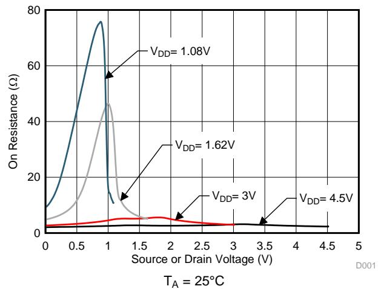

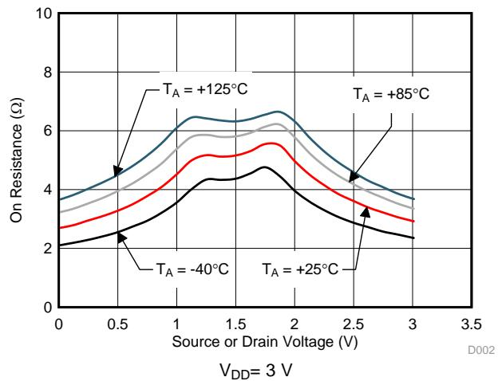

图 1. On-Resistance vs Source or Drain Voltage  
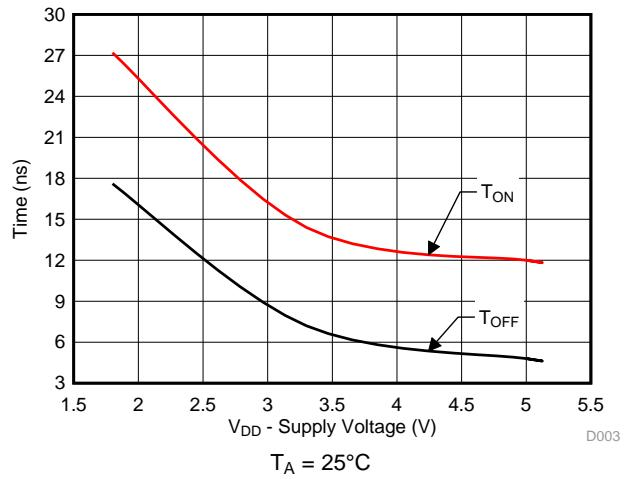

图 2. On-Resistance vs Source or Drain Voltage  
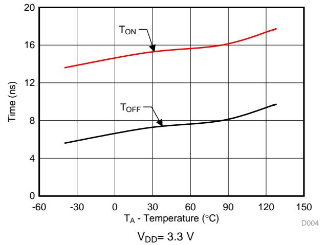

图 3. TON (EN) and TOFF (EN) vs Supply Voltage  
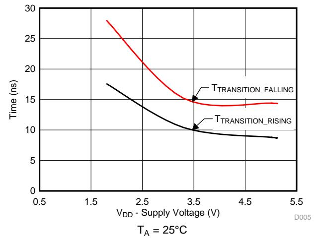  
图 5. TTRANSITION vs Supply Voltage

图 4. TON (EN) and TOFF (EN) vs Temperature  
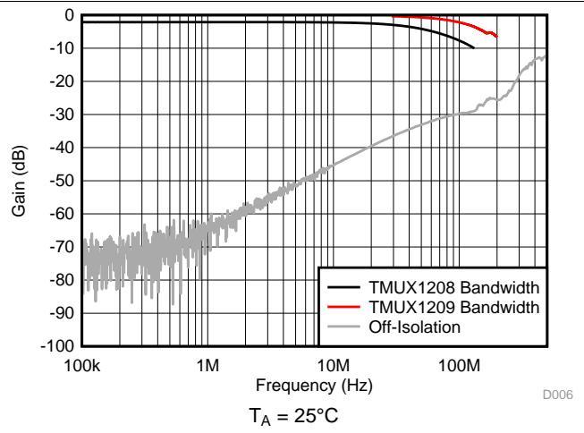  
图 6. Frequency Response

## 8 Detailed Description

## 8.1 Overview

## 8.1.1 On-Resistance

The on-resistance of a device is the ohmic resistance between the source $( { \mathsf { S } } { \mathsf { x } } )$ and drain (D) pins of the device. The on-resistance varies with input voltage and supply voltage. The symbol ${ \mathsf { R } } _ { \mathsf { O N } }$ is used to denote on-resistance. The measurement setup used to measure ${ \mathsf { R } } _ { \mathsf { O N } }$ is shown below. Voltage (V) and current (I ) are measured using this setup, and ${ \mathsf { R } } _ { \mathsf { O N } }$ is computed as shown in 图 7 with $\sf R _ { O N } = \sf V / \tau l _ { S D } \mathrm { : }$

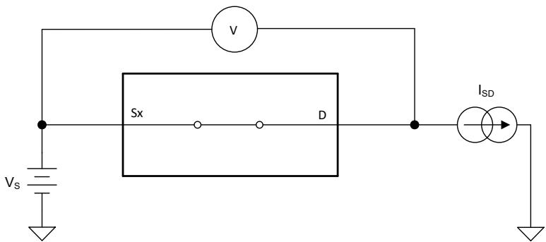  
图 7. On-Resistance Measurement Setup

## 8.1.2 Off-Leakage Current

There are two types of leakage currents associated with a switch during the off state:

1. Source off-leakage current

2. Drain off-leakage current

Source leakage current is defined as the leakage current flowing into or out of the source pin when the switch is off. This current is denoted by the symbol IS(OFF).

Drain leakage current is defined as the leakage current flowing into or out of the drain pin when the switch is off. This current is denoted by the symbol ID(OFF).

The setup used to measure both off-leakage currents is shown in 图 8.

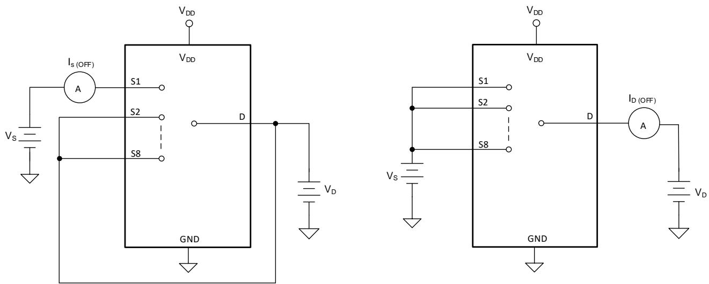  
图 8. Off-Leakage Measurement Setup

## Overview (接下页)

## 8.1.3 On-Leakage Current

Source on-leakage current is defined as the leakage current flowing into or out of the source pin when the switch is on. This current is denoted by the symbol IS(ON).

Drain on-leakage current is defined as the leakage current flowing into or out of the drain pin when the switch is on. This current is denoted by the symbol ID(ON).

Either the source pin or drain pin is left floating during the measurement. 图 9 shows the circuit used for measuring the on-leakage current, denoted by IS(ON) or ID(ON).

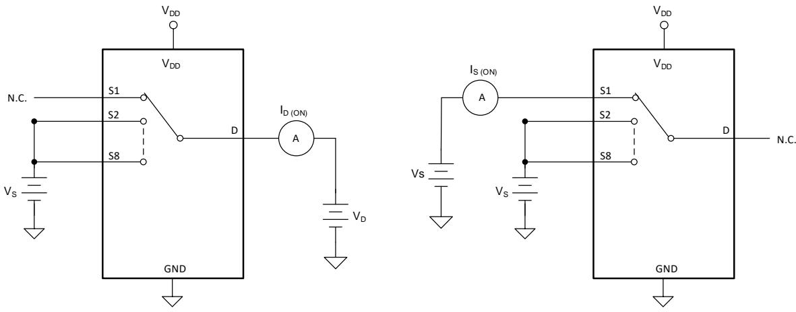  
图 9. On-Leakage Measurement Setup

## 8.1.4 Transition Time

Transition time is defined as the time taken by the output of the device to rise or fall 10% after the address signal has risen or fallen past the logic threshold. The 10% transition measurement is utilized to provide the timing of the device, system level timing can then account for the time constant added from the load resistance and load capacitance. 图 10 shows the setup used to measure transition time, denoted by the symbol tTRANSITION.

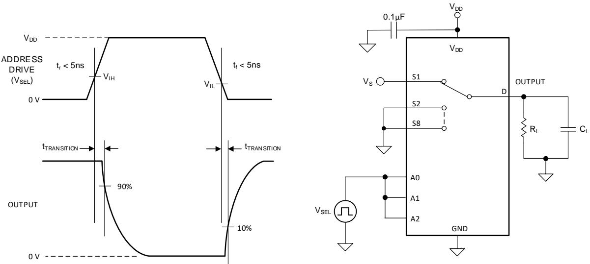  
图 10. Transition-Time Measurement Setup

## Overview (接下页)

## 8.1.5 Break-Before-Make

Break-before-make delay is a safety feature that prevents two inputs from connecting when the device is switching. The output first breaks from the on-state switch before making the connection with the next on-state switch. The time delay between the break and the make is known as break-before-make delay. 图 11 shows the setup used to measure break-before-make delay, denoted by the symbol tOPEN(BBM).

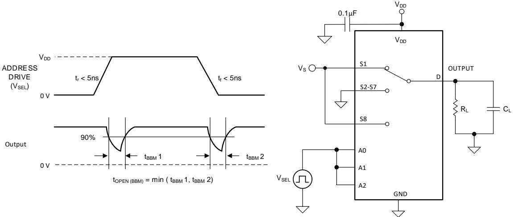  
图 11. Break-Before-Make Delay Measurement Setup

## 8.1.6 tON(EN) and tOFF(EN)

Turn-on time is defined as the time taken by the output of the device to rise to 10% after the enable has risen past the logic threshold. The 10% measurement is utilized to provide the timing of the device, system level timing can then account for the time constant added from the load resistance and load capacitance. 图 12 shows the setup used to measure transition time, denoted by the symbol tON(EN).

Turn-off time is defined as the time taken by the output of the device to fall to 90% after the enable has fallen past the logic threshold. The 90% measurement is utilized to provide the timing of the device, system level timing can then account for the time constant added from the load resistance and load capacitance. 图 12 shows the setup used to measure transition time, denoted by the symbol tOFF(EN).

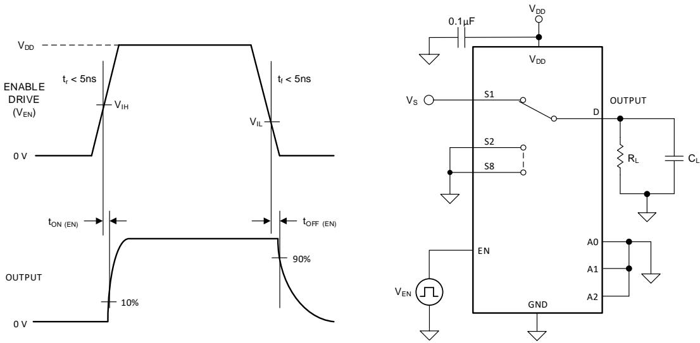  
图 12. Turn-On and Turn-Off Time Measurement Setup

## Overview (接下页)

## 8.1.7 Charge Injection

The TMUX1208 and TMUX1209 have a transmission-gate topology. Any mismatch in capacitance between the NMOS and PMOS transistors results in a charge injected into the drain or source during the falling or rising edge of the gate signal. The amount of charge injected into the source or drain of the device is known as charge injection, and is denoted by the symbol $\mathsf { \bar { Q } } _ { \mathsf { C } } .$ 图 13 shows the setup used to measure charge injection from source (Sx) to drain (D).

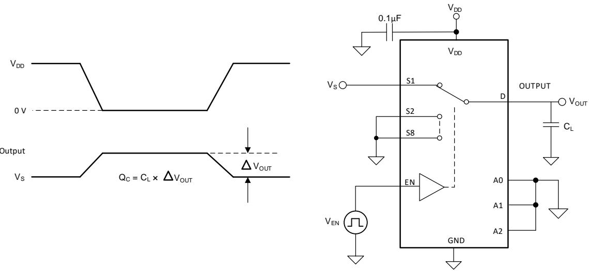  
图 13. Charge-Injection Measurement Setup

## 8.1.8 Off Isolation

Off isolation is defined as the ratio of the signal at the drain pin (D) of the device when a signal is applied to the source pin (Sx) of an off-channel. 图 14 shows the setup used to measure, and the equation to compute off isolation.

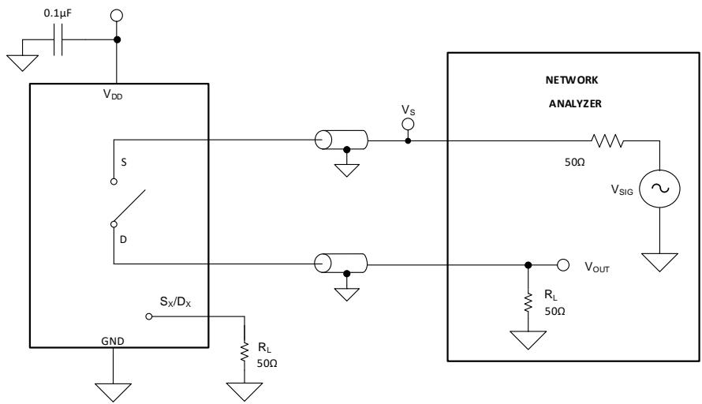  
图 14. Off Isolation Measurement Setup

$$
\text { Off   Isolation } = 2 0 \cdot \operatorname{Log} \left(\frac {\mathrm{V} _ {\mathrm{OUT}}}{\mathrm{V} _ {\mathrm{S}}}\right)\tag{1}
$$

Overview (接下页)

## 8.1.9 Crosstalk

Crosstalk is defined as the ratio of the signal at the drain pin (D) of a different channel, when a signal is applied at the source pin (Sx) of an on-channel. 图 15 shows the setup used to measure, and the equation used to compute crosstalk.

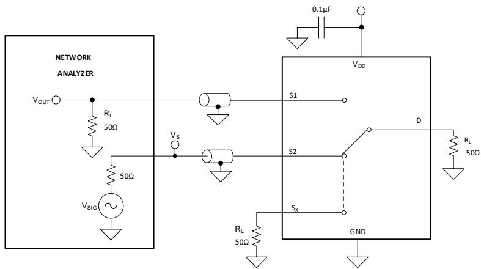  
图 15. Channel-to-Channel Crosstalk Measurement Setup

Channel-to-Channel Crosstalk $= 2 0 \cdot \mathrm { L o g } \left( \frac { \mathsf { V } _ { \mathsf { O U T } } } { \mathsf { V } _ { \mathsf { S } } } \right)$

(2)

## 8.1.10 Bandwidth

Bandwidth is defined as the range of frequencies that are attenuated by less than 3 dB when the input is applied to the source pin (Sx) of an on-channel, and the output is measured at the drain pin (D) of the device. 图 16 shows the setup used to measure bandwidth.

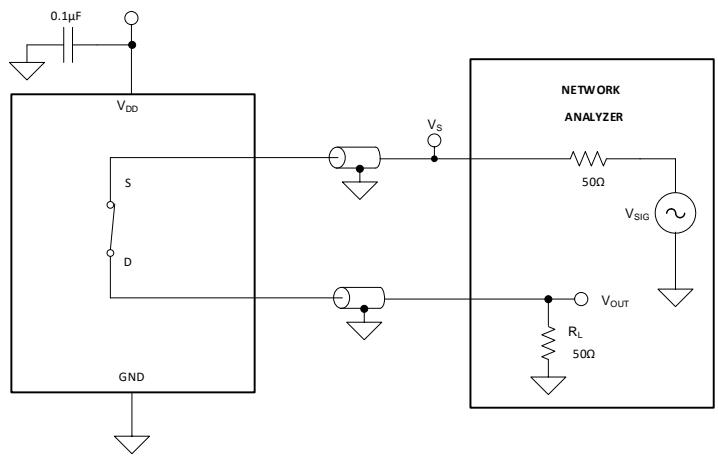  
图 16. Bandwidth Measurement Setup

$$
\text { Attenuation } = 2 0 \cdot \operatorname{Log} \left(\frac {\mathrm{V} _ {2}}{\mathrm{V} _ {1}}\right)\tag{3}
$$

## 8.2 Functional Block Diagram

The TMUX1208 is an 8:1, single-ended (1-ch.), mux. The TMUX1209 is an 4:1, differential (2-ch.), mux. Each channel is turned on or turned off based on the state of the address lines and enable pin.

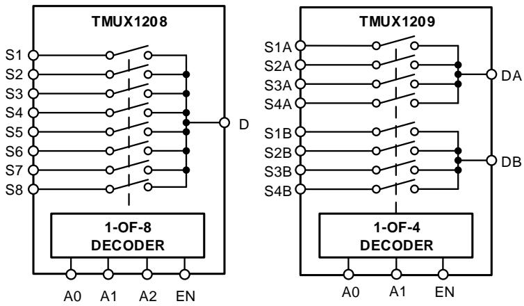  
图 17. TMUX1208, TMUX1209 Functional Block Diagrams

## 8.3 Feature Description

## 8.3.1 Bidirectional Operation

The TMUX1208 and TMUX1209 conduct equally well from source (Sx) to drain (D) or from drain (D) to source (Sx). Each channel has very similar characteristics in both directions and supports both analog and digital signals.

## 8.3.2 Rail to Rail Operation

The valid signal path input/output voltage for TMUX1208 and TMUX1209 ranges from GND to $\mathsf { V } _ { \mathsf { D D } }$

## 8.3.3 1.8 V Logic Compatible Inputs

The TMUX1208 and TMUX1209 has 1.8-V logic compatible control for all logic control inputs. The logic input thresholds scale with supply but still provide 1.8-V logic control when operating at 5.5 V supply voltage. 1.8-V logic level inputs allows the multiplexers to interface with processors that have lower logic I/O rails and eliminates the need for an external translator, which saves both space and BOM cost. For more information on 1.8 V logic implementations refer to Simplifying Design with 1.8 V logic Muxes and Switches

## 8.3.4 Fail-Safe Logic

The TMUX1208 and TMUX1209 have Fail-Safe Logic on the control input pins (EN, A0. A1, A2) allowing for operation up to 5.5 V, regardless of the state of the supply pin. This feature allows voltages on the control pins to be applied before the supply pin, protecting the device from potential damage. Fail-Safe Logic minimizes system complexity by removing the need for power supply sequencing on the logic control pins. For example, the Fail-Safe Logic feature allows the select pins of the TMUX1208 or TMUX1209 to be ramped to 5.5 V while $\mathsf { V } _ { \mathsf { D D } } = 0 \mathsf { V } .$ Additionally, the feature enables operation of the multiplexers with $\mathsf { V } _ { \mathsf { D D } } = 1 . 2 \mathrm { ~ V ~ }$ while allowing the select pins to interface with a logic level of another device up to 5.5 V.

## Feature Description (接下页)

## 8.3.5 Device Functional Modes

When the EN pin of the TMUX1208 is pulled high, one of the switches is closed based on the state of the address lines. Similarly, when the EN pin of the TMUX1209 is pulled high, two of the switches are closed based on the state of the address lines. When the EN pin is pulled low, all the switches are in an open state regardless of the state of the address lines.

## 8.3.6 Truth Tables

表 1 and 表 2 show the truth tables for the TMUX1208 and TMUX1209, respectively.

表 1. TMUX1208 Truth Table

<table><tr><td>EN</td><td>A2</td><td>A1</td><td>A0</td><td>Selected Inputs Connected To Drain (D) Pin</td></tr><tr><td>0</td><td> $X^{(1)}$ </td><td> $X^{(1)}$ </td><td> $X^{(1)}$ </td><td>All channels are off</td></tr><tr><td>1</td><td>0</td><td>0</td><td>0</td><td>S1</td></tr><tr><td>1</td><td>0</td><td>0</td><td>1</td><td>S2</td></tr><tr><td>1</td><td>0</td><td>1</td><td>0</td><td>S3</td></tr><tr><td>1</td><td>0</td><td>1</td><td>1</td><td>S4</td></tr><tr><td>1</td><td>1</td><td>0</td><td>0</td><td>S5</td></tr><tr><td>1</td><td>1</td><td>0</td><td>1</td><td>S6</td></tr><tr><td>1</td><td>1</td><td>1</td><td>0</td><td>S7</td></tr><tr><td>1</td><td>1</td><td>1</td><td>1</td><td>S8</td></tr></table>

(1) X denotes don't care.

表 2. TMUX1209 Truth Table

<table><tr><td>EN</td><td>A1</td><td>A0</td><td>Selected Input Connected To Drain (DA, DB) Pins</td></tr><tr><td>0</td><td> $X^{(1)}$ </td><td> $X^{(1)}$ </td><td>All channels are off</td></tr><tr><td>1</td><td>0</td><td>0</td><td>S1A and S1B</td></tr><tr><td>1</td><td>0</td><td>1</td><td>S2A and S2B</td></tr><tr><td>1</td><td>1</td><td>0</td><td>S3A and S3B</td></tr><tr><td>1</td><td>1</td><td>1</td><td>S4A and S4B</td></tr></table>

(1) X denotes don't care.

## 9 Application and Implementation

## 注

Information in the following applications sections is not part of the TI component specification, and TI does not warrant its accuracy or completeness. TI’s customers are responsible for determining suitability of components for their purposes. Customers should validate and test their design implementation to confirm system functionality.

## 9.1 Application Information

The TMUX12xx family offers good system performance across a wide operating supply (1.08V to 5.5V). These devices include 1.8V logic compatible control input pins that enable operation in systems with 1.8V I/O rails. Additionally, the control input pins support Fail-Safe Logic which allows for operation up to 5.5V, regardless of the state of the supply pin. This protection stops the logic pins from back-powering the supply rail. These features make the TMUX12xx a family of general purpose multiplexers and switches that can reduce system complexity, board size, and overall system cost.

## 9.2 Typical Application

One useful application to take advantage of the TMUX1208 features is multiplexing various signals into an ADC that is integrated into a MCU. Utilizing an integrated ADC in a MCU allows a system to minimize cost with a potential tradeoff of system performance when compared to an external ADC. The multiplexer allows for multiple inputs/sensors to be monitored with a single ADC pin of the device, which is critical in systems with limited I/O. The TMUX1209 is suitable for similar design example using differential signals, or as two 4:1 multiplexers.

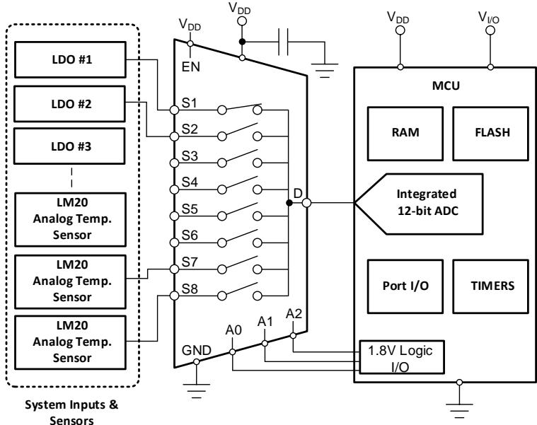  
图 18. Multiplexing Signals to Integrated ADC

## 9.3 Design Requirements

For this design example, use the parameters listed in 表 3.

表 3. Design Parameters

<table><tr><td>PARAMETERS</td><td>VALUES</td></tr><tr><td>Supply ( $V_{DD}$ )</td><td>5.0 V</td></tr><tr><td>I/O signal range</td><td>0 V to  $V_{DD}$  (Rail to Rail)</td></tr><tr><td>Control logic thresholds</td><td>1.8 V compatible</td></tr></table>

## 9.4 Detailed Design Procedure

The TMUX1208 and TMUX1209 can be operated without any external components except for the supply decoupling capacitors. If the parts desired power-up state is disabled, the enable pin should have a weak pulldown resistor and be controlled by the MCU via GPIO. All inputs being muxed to the ADC of the MCU must fall within the recommend operating conditions of the TMUX1208 and TMUX1209 including signal range and continuous current. For this design with a supply of 5 V the signal range can be 0 V to 5 V and the max continuous current can be 30 mA.

## 9.5 Application Curve

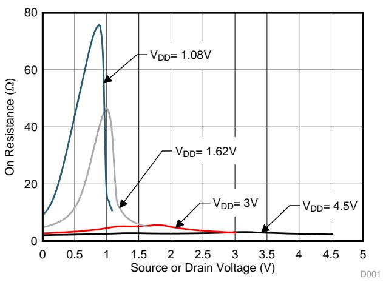  
图 19. On-Resistance vs Source or Drain Voltage

## 10 Power Supply Recommendations

The TMUX1208 and TMUX1209 operate across a wide supply range of 1.08 V to 5.5 V. Do not exceed the absolute maximum ratings because stresses beyond the listed ratings can cause permanent damage to the devices.

Power-supply bypassing improves noise margin and prevents switching noise propagation from the $\mathsf { V } _ { \mathsf { D D } }$ supply to other components. Good power-supply decoupling is important to achieve optimum performance. For improved supply noise immunity, use a supply decoupling capacitor ranging from $0 . 1 ~ \mu \mathsf { F }$ to $\dot { 1 } 0 ~ \mu \mathsf { F }$ from $\mathsf { V } _ { \mathsf { D D } }$ to ground. Place the bypass capacitors as close to the power supply pins of the device as possible using low-impedance connections. TI recommends using multi-layer ceramic chip capacitors (MLCCs) that offer low equivalent series resistance (ESR) and inductance (ESL) characteristics for power-supply decoupling purposes. For very sensitive systems, or for systems in harsh noise environments, avoiding the use of vias for connecting the capacitors to the device pins may offer superior noise immunity. The use of multiple vias in parallel lowers the overall inductance and is beneficial for connections to ground planes.

## 11 Layout

## 11.1 Layout Guidelines

## 11.1.1 Layout Information

When a PCB trace turns a corner at a $9 0 ^ { \circ }$ angle, a reflection can occur. A reflection occurs primarily because of the change of width of the trace. At the apex of the turn, the trace width increases to 1.414 times the width. This increase upsets the transmission-line characteristics, especially the distributed capacitance and self–inductance of the trace which results in the reflection. Not all PCB traces can be straight and therefore some traces must turn corners. 图 20 shows progressively better techniques of rounding corners. Only the last example (BEST) maintains constant trace width and minimizes reflections.

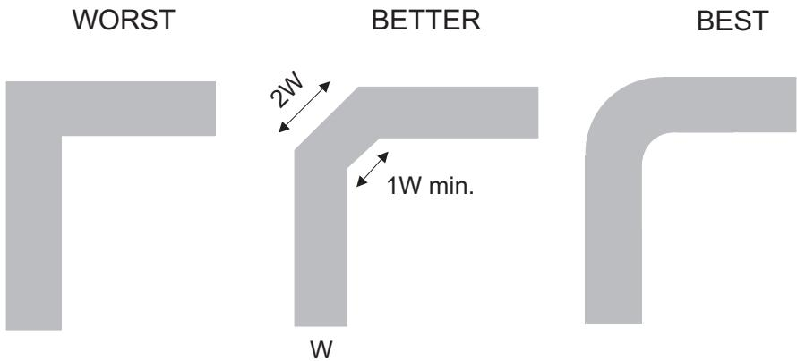  
图 20. Trace Example

Route high-speed signals using a minimum of vias and corners which reduces signal reflections and impedance changes. When a via must be used, increase the clearance size around it to minimize its capacitance. Each via introduces discontinuities in the signal’s transmission line and increases the chance of picking up interference from the other layers of the board. Be careful when designing test points, throughhole pins are not recommended at high frequencies.

图 21 illustrates an example of a PCB layout with the TMUX1208. Some key considerations are:

• Decouple the $\mathsf { V } _ { \mathsf { D D } }$ pin with a 0.1-µF capacitor, placed as close to the pin as possible. Make sure that the capacitor voltage rating is sufficient for the $\mathsf { V } _ { \mathsf { D D } }$ supply.

• Keep the input lines as short as possible.

• Use a solid ground plane to help reduce electromagnetic interference (EMI) noise pickup.

• Do not run sensitive analog traces in parallel with digital traces. Avoid crossing digital and analog traces if possible, and only make perpendicular crossings when necessary.

## 11.2 Layout Example

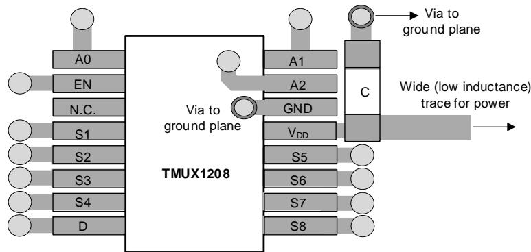  
图 21. TMUX1208 Layout Example

## 12 器件和文档支持

## 12.1 文档支持

## 12.1.1 相关文档

德州仪器 (TI)， 《使用 1.8V逻辑多路复用器和开关简化设计》 。

德州仪器 (TI)， 《QFN/SON PCB 连接》 。

Texas Instruments, 《四方扁平封装无引线逻辑封装》 。

## 12.2 相关链接

下表列出了快速访问链接。类别包括技术文档、支持和社区资源、工具和软件，以及立即订购快速访问。

表 4. 相关链接

<table><tr><td>器件</td><td>产品文件夹</td><td>立即订购</td><td>技术文档</td><td>工具与软件</td><td>支持和社区</td></tr><tr><td>TMUX1208</td><td>单击此处</td><td>单击此处</td><td>单击此处</td><td>单击此处</td><td>单击此处</td></tr><tr><td>TMUX1209</td><td>单击此处</td><td>单击此处</td><td>单击此处</td><td>单击此处</td><td>单击此处</td></tr></table>

## 12.3 接收文档更新通知

要接收文档更新通知，请导航至 TI.com.cn 上的器件产品文件夹。单击右上角的通知我进行注册，即可每周接收产品信息更改摘要。有关更改的详细信息，请查看任何已修订文档中包含的修订历史记录。

## 12.4 社区资源

下列链接提供到 TI 社区资源的连接。链接的内容由各个分销商“按照原样”提供。这些内容并不构成 TI 技术规范，并且不一定反映 TI 的观点；请参阅 TI 的 《使用条款》。

TI E2E™ 在线社区 TI 的工程师对工程师(E2E) 社区。 此社区的创建目的在于促进工程师之间的协作。在e2e.ti.com 中，您可以咨询问题、分享知识、拓展思路并与同行工程师一道帮助解决问题。

设计支持 TI参考设计支持可帮助您快速查找有帮助的 E2E 论坛、设计支持工具以及技术支持的联系信息。

## 12.5 商标

E2E is a trademark of Texas Instruments.

## 12.6 静电放电警告

ESD 可能会损坏该集成电路。德州仪器 (TI) 建议通过适当的预防措施处理所有集成电路。如果不遵守正确的处理措施和安装程序 , 可能会损坏集成电路。

ESD 的损坏小至导致微小的性能降级 , 大至整个器件故障。 精密的集成电路可能更容易受到损坏 , 这是因为非常细微的参数更改都可能会导致器件与其发布的规格不相符。

## 12.7 术语表

SLYZ022 — TI 术语表。

这份术语表列出并解释术语、缩写和定义。

## 13 机械、封装和可订购信息

以下页面包含机械、封装和可订购信息。这些信息是指定器件的最新可用数据。数据如有变更，恕不另行通知，且不会对此文档进行修订。如需获取此数据表的浏览器版本，请查阅左侧的导航栏。

## PACKAGING INFORMATION

<table><tr><td>Orderable part number</td><td>Status(1)</td><td>Material type(2)</td><td>Package | Pins</td><td>Package qty | Carrier</td><td>RoHS(3)</td><td>Lead finish/ Ball material(4)</td><td>MSL rating/ Peak reflow(5)</td><td>Op temp (°C)</td><td>Part marking(6)</td></tr><tr><td>TMUX1208PWR</td><td>Active</td><td>Production</td><td>TSSOP (PW) | 16</td><td>2000 | LARGE T&amp;R</td><td>Yes</td><td>NIPDAU | SN</td><td>Level-1-260C-UNLIM</td><td>-40 to 125</td><td>TM1208</td></tr><tr><td>TMUX1208PWR.A</td><td>Active</td><td>Production</td><td>TSSOP (PW) | 16</td><td>2000 | LARGE T&amp;R</td><td>Yes</td><td>NIPDAU</td><td>Level-1-260C-UNLIM</td><td>-40 to 125</td><td>TM1208</td></tr><tr><td>TMUX1208PWRG4</td><td>Active</td><td>Production</td><td>TSSOP (PW) | 16</td><td>2000 | LARGE T&amp;R</td><td>Yes</td><td>NIPDAU</td><td>Level-1-260C-UNLIM</td><td>-40 to 125</td><td>TM1208</td></tr><tr><td>TMUX1208PWRG4.A</td><td>Active</td><td>Production</td><td>TSSOP (PW) | 16</td><td>2000 | LARGE T&amp;R</td><td>Yes</td><td>NIPDAU</td><td>Level-1-260C-UNLIM</td><td>-40 to 125</td><td>TM1208</td></tr><tr><td>TMUX1208RSVR</td><td>Active</td><td>Production</td><td>UQFN (RSV) | 16</td><td>3000 | LARGE T&amp;R</td><td>Yes</td><td>NIPDAU</td><td>Level-1-260C-UNLIM</td><td>-40 to 125</td><td>1B4</td></tr><tr><td>TMUX1208RSVR.A</td><td>Active</td><td>Production</td><td>UQFN (RSV) | 16</td><td>3000 | LARGE T&amp;R</td><td>Yes</td><td>NIPDAU</td><td>Level-1-260C-UNLIM</td><td>-40 to 125</td><td>1B4</td></tr><tr><td>TMUX1208RSVRG4.A</td><td>Active</td><td>Production</td><td>UQFN (RSV) | 16</td><td>3000 | LARGE T&amp;R</td><td>Yes</td><td>NIPDAU</td><td>Level-1-260C-UNLIM</td><td>-40 to 125</td><td>1B4</td></tr><tr><td>TMUX1209PWR</td><td>Active</td><td>Production</td><td>TSSOP (PW) | 16</td><td>2000 | LARGE T&amp;R</td><td>Yes</td><td>NIPDAU | SN</td><td>Level-1-260C-UNLIM</td><td>-40 to 125</td><td>TM1209</td></tr><tr><td>TMUX1209PWR.A</td><td>Active</td><td>Production</td><td>TSSOP (PW) | 16</td><td>2000 | LARGE T&amp;R</td><td>Yes</td><td>NIPDAU</td><td>Level-1-260C-UNLIM</td><td>-40 to 125</td><td>TM1209</td></tr><tr><td>TMUX1209PWRG4</td><td>Active</td><td>Production</td><td>TSSOP (PW) | 16</td><td>2000 | LARGE T&amp;R</td><td>Yes</td><td>NIPDAU</td><td>Level-1-260C-UNLIM</td><td>-40 to 125</td><td>TM1209</td></tr><tr><td>TMUX1209PWRG4.A</td><td>Active</td><td>Production</td><td>TSSOP (PW) | 16</td><td>2000 | LARGE T&amp;R</td><td>Yes</td><td>NIPDAU</td><td>Level-1-260C-UNLIM</td><td>-40 to 125</td><td>TM1209</td></tr><tr><td>TMUX1209RSVR</td><td>Active</td><td>Production</td><td>UQFN (RSV) | 16</td><td>3000 | LARGE T&amp;R</td><td>Yes</td><td>NIPDAU</td><td>Level-1-260C-UNLIM</td><td>-40 to 125</td><td>1D2</td></tr><tr><td>TMUX1209RSVR.A</td><td>Active</td><td>Production</td><td>UQFN (RSV) | 16</td><td>3000 | LARGE T&amp;R</td><td>Yes</td><td>NIPDAU</td><td>Level-1-260C-UNLIM</td><td>-40 to 125</td><td>1D2</td></tr><tr><td>TMUX1209RSVRG4.A</td><td>Active</td><td>Production</td><td>UQFN (RSV) | 16</td><td>3000 | LARGE T&amp;R</td><td>Yes</td><td>NIPDAU</td><td>Level-1-260C-UNLIM</td><td>-40 to 125</td><td>1D2</td></tr></table>

(1) Status: For more details on status, see our product life cycle.

(2) Material type: When designated, preproduction parts are prototypes/experimental devices, and are not yet approved or released for full production. Testing and final process, including without limitation quality assurance, reliability performance testing, and/or process qualification, may not yet be complete, and this item is subject to further changes or possible discontinuation. If available for ordering, purchases will be subject to an additional waiver at checkout, and are intended for early internal evaluation purposes only. These items are sold without warranties of any kind.

(3) RoHS values: Yes, No, RoHS Exempt. See the TI RoHS Statement for additional information and value definition.

Multiple part markings will be inside parentheses. Only one part marking contained in parentheses and separated by a "\~" will appear on a part. If a line is indented then it is a continuation of the previous line and the tw combined represent the entire part marking for that device

Important Information and Disclaimer:The information provided on this page represents TI's knowledge and belief as of the date that it is provided. TI bases its knowledge and belief on information provided by third parties, and makes no representation or warranty as to the accuracy of such information. Efforts are underway to better integrate information from third parties. TI has taken and continues to take reasonable steps to provide representativ

In no event shall TI's liability arising out of such information exceed the total purchase price of the TI part(s) at issue in this document sold by TI to Customer on an annual basis

OTHER QUALIFIED VERSIONS OF TMUX1208 :

Automotive : TMUX1208-Q1

NOTE: Qualified Version Definitions:

• Automotive - Q100 devices qualified for high-reliability automotive applications targeting zero defects

TAPE AND REEL INFORMATION  

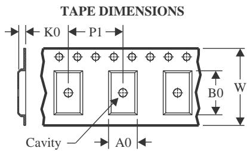

<table><tr><td>A0</td><td>Dimension designed to accommodate the component width</td></tr><tr><td>B0</td><td>Dimension designed to accommodate the component length</td></tr><tr><td>K0</td><td>Dimension designed to accommodate the component thickness</td></tr><tr><td>W</td><td>Overall width of the carrier tape</td></tr><tr><td>P1</td><td>Pitch between successive cavity centers</td></tr></table>

Reel Width (W1)  
QUADRANT ASSIGNMENTS FOR PIN 1 ORIENTATION IN TAPE  
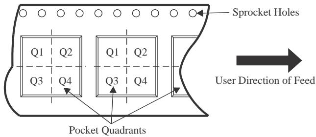

\*All dimensions are nomina

<table><tr><td>Device</td><td>Package Type</td><td>Package Drawing</td><td>Pins</td><td>SPQ</td><td>Reel Diameter (mm)</td><td>Reel Width W1 (mm)</td><td>A0 (mm)</td><td>B0 (mm)</td><td>K0 (mm)</td><td>P1 (mm)</td><td>W (mm)</td><td>Pin1 Quadrant</td></tr><tr><td>TMUX1208PWR</td><td>TSSOP</td><td>PW</td><td>16</td><td>2000</td><td>330.0</td><td>12.4</td><td>6.9</td><td>5.6</td><td>1.6</td><td>8.0</td><td>12.0</td><td>Q1</td></tr><tr><td>TMUX1208PWR</td><td>TSSOP</td><td>PW</td><td>16</td><td>2000</td><td>330.0</td><td>12.4</td><td>6.9</td><td>5.6</td><td>1.6</td><td>8.0</td><td>12.0</td><td>Q1</td></tr><tr><td>TMUX1208PWRG4</td><td>TSSOP</td><td>PW</td><td>16</td><td>2000</td><td>330.0</td><td>12.4</td><td>6.9</td><td>5.6</td><td>1.6</td><td>8.0</td><td>12.0</td><td>Q1</td></tr><tr><td>TMUX1208RSVR</td><td>UQFN</td><td>RSV</td><td>16</td><td>3000</td><td>178.0</td><td>13.5</td><td>2.1</td><td>2.9</td><td>0.75</td><td>4.0</td><td>12.0</td><td>Q1</td></tr><tr><td>TMUX1209PWR</td><td>TSSOP</td><td>PW</td><td>16</td><td>2000</td><td>330.0</td><td>12.4</td><td>6.9</td><td>5.6</td><td>1.6</td><td>8.0</td><td>12.0</td><td>Q1</td></tr><tr><td>TMUX1209PWR</td><td>TSSOP</td><td>PW</td><td>16</td><td>2000</td><td>330.0</td><td>12.4</td><td>6.9</td><td>5.6</td><td>1.6</td><td>8.0</td><td>12.0</td><td>Q1</td></tr><tr><td>TMUX1209PWRG4</td><td>TSSOP</td><td>PW</td><td>16</td><td>2000</td><td>330.0</td><td>12.4</td><td>6.9</td><td>5.6</td><td>1.6</td><td>8.0</td><td>12.0</td><td>Q1</td></tr><tr><td>TMUX1209RSVR</td><td>UQFN</td><td>RSV</td><td>16</td><td>3000</td><td>178.0</td><td>13.5</td><td>2.1</td><td>2.9</td><td>0.75</td><td>4.0</td><td>12.0</td><td>Q1</td></tr></table>

\*All dimensions are nominal

<table><tr><td>Device</td><td>Package Type</td><td>Package Drawing</td><td>Pins</td><td>SPQ</td><td>Length (mm)</td><td>Width (mm)</td><td>Height (mm)</td></tr><tr><td>TMUX1208PWR</td><td>TSSOP</td><td>PW</td><td>16</td><td>2000</td><td>353.0</td><td>353.0</td><td>32.0</td></tr><tr><td>TMUX1208PWR</td><td>TSSOP</td><td>PW</td><td>16</td><td>2000</td><td>356.0</td><td>356.0</td><td>35.0</td></tr><tr><td>TMUX1208PWRG4</td><td>TSSOP</td><td>PW</td><td>16</td><td>2000</td><td>353.0</td><td>353.0</td><td>32.0</td></tr><tr><td>TMUX1208RSVR</td><td>UQFN</td><td>RSV</td><td>16</td><td>3000</td><td>189.0</td><td>185.0</td><td>36.0</td></tr><tr><td>TMUX1209PWR</td><td>TSSOP</td><td>PW</td><td>16</td><td>2000</td><td>356.0</td><td>356.0</td><td>35.0</td></tr><tr><td>TMUX1209PWR</td><td>TSSOP</td><td>PW</td><td>16</td><td>2000</td><td>353.0</td><td>353.0</td><td>32.0</td></tr><tr><td>TMUX1209PWRG4</td><td>TSSOP</td><td>PW</td><td>16</td><td>2000</td><td>353.0</td><td>353.0</td><td>32.0</td></tr><tr><td>TMUX1209RSVR</td><td>UQFN</td><td>RSV</td><td>16</td><td>3000</td><td>189.0</td><td>185.0</td><td>36.0</td></tr></table>

1.8 x 2.6, 0.4 mm pitch

ULTRA THIN QUAD FLATPACK - NO LEAD

This image is a representation of the package family, actual package may vary. Refer to the product data sheet for package details.

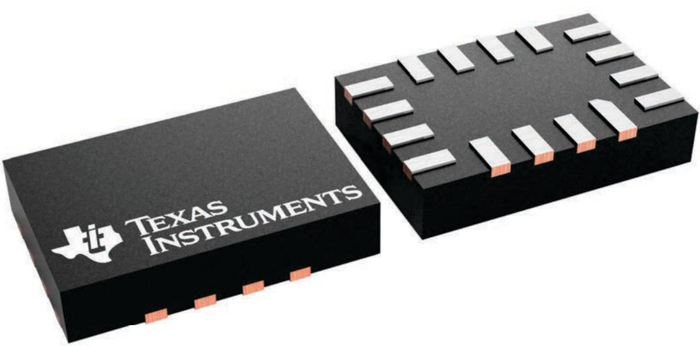

4220314/C 02/2020

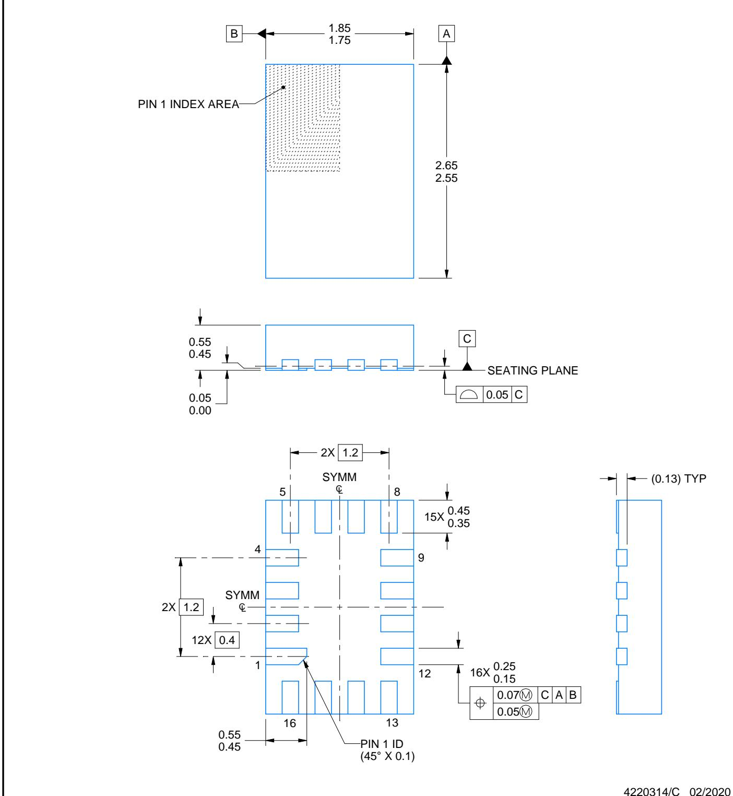

## NOTES:

1. All linear dimensions are in millimeters. Any dimensions in parenthesis are for reference only. Dimensioning and tolerancing per ASME Y14.5M.

2. This drawing is subject to change without notice.

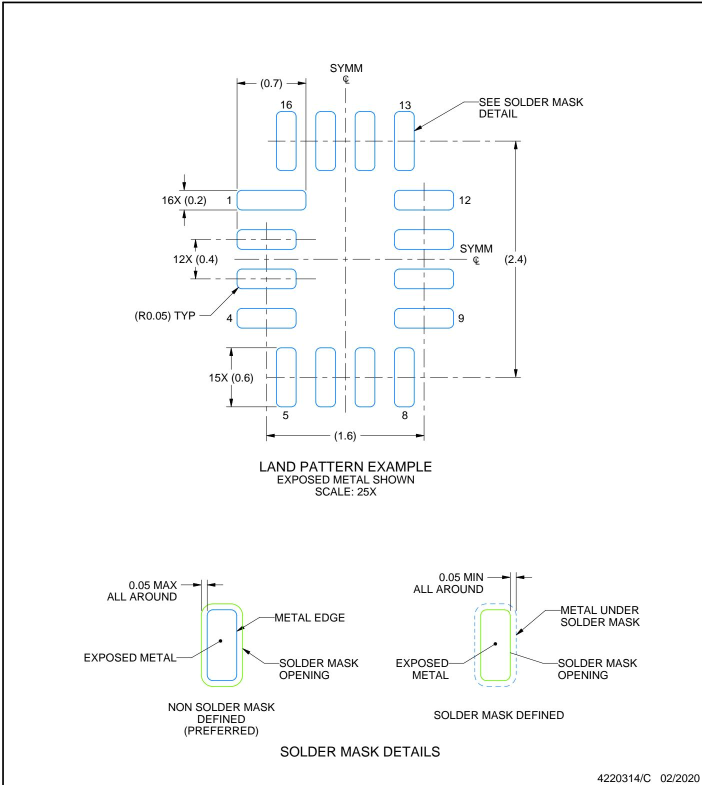  
NOTES: (continued)

3. For more information, see Texas Instruments literature number SLUA271 (www.ti.com/lit/slua271).

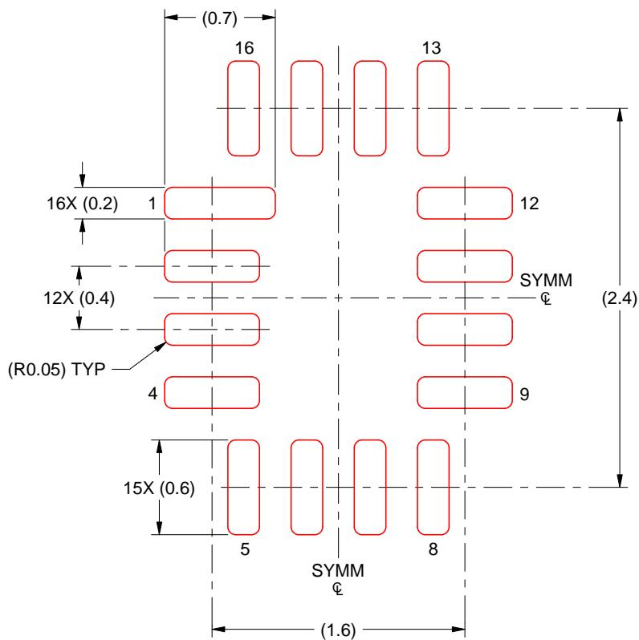

SOLDER PASTE EXAMPLE BASED ON 0.125 MM THICK STENCIL SCALE: 25X

4220314/C 02/2020

NOTES: (continued)

4. Laser cutting apertures with trapezoidal walls and rounded corners may offer better paste release. IPC-7525 may have alternate design recommendations.

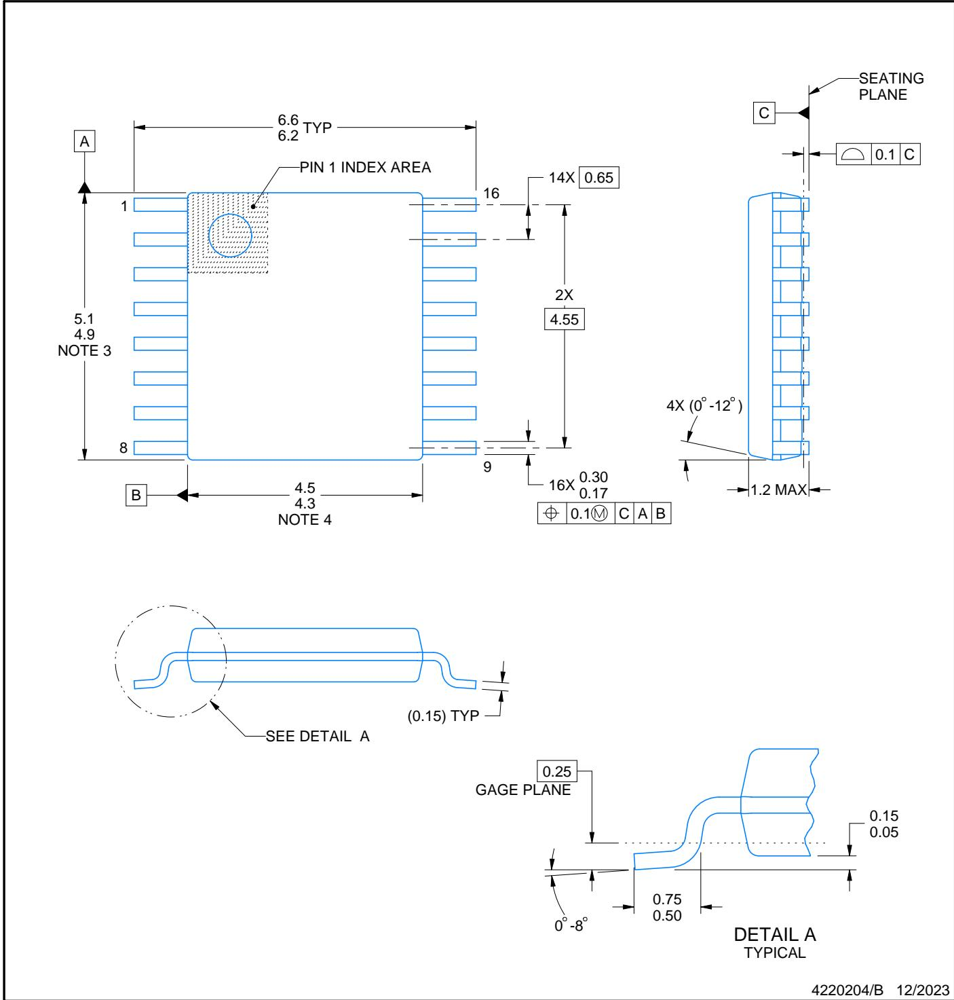

## NOTES:

1. All linear dimensions are in millimeters. Any dimensions in parenthesis are for reference only. Dimensioning and tolerancing per ASME Y14.5M.

2. This drawing is subject to change without notice.

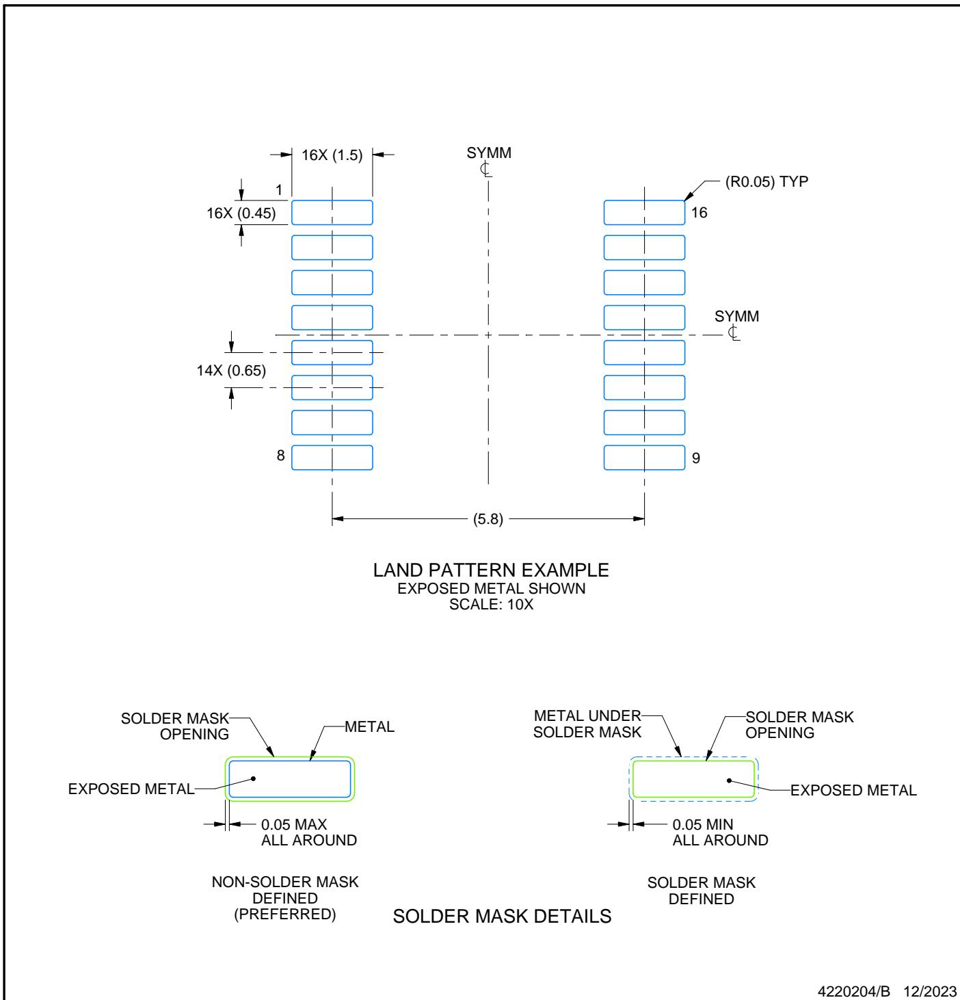

NOTES: (continued)

6. Publication IPC-7351 may have alternate designs.

7. Solder mask tolerances between and around signal pads can vary based on board fabrication site.

SMALL OUTLINE PACKAGE

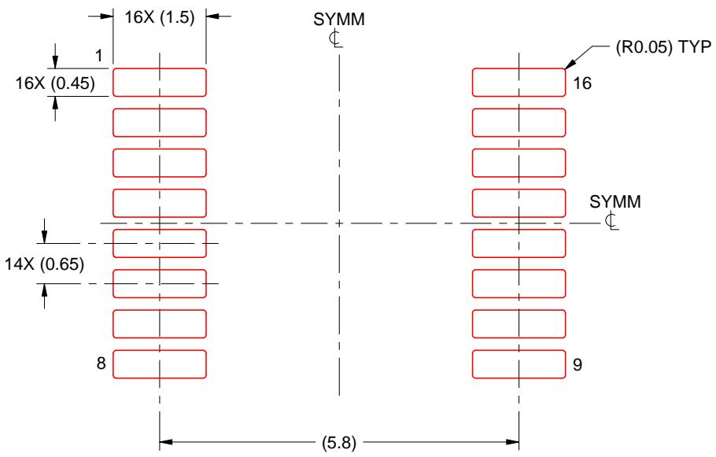

SOLDER PASTE EXAMPLE BASED ON 0.125 mm THICK STENCIL SCALE: 10X

4220204/B 12/2023

NOTES: (continued)

8. Laser cutting apertures with trapezoidal walls and rounded corners may offer better paste release. IPC-7525 may have alternate design recommendations.

9. Board assembly site may have different recommendations for stencil design.

## 重要通知和免责声明

TI“按原样”提供技术和可靠性数据（包括数据表）、设计资源（包括参考设计）、应用或其他设计建议、网络工具、安全信息和其他资源，不保证没有瑕疵且不做出任何明示或暗示的担保，包括但不限于对适销性、与某特定用途的适用性或不侵犯任何第三方知识产权的暗示担保。这些资源可供使用 TI 产品进行设计的熟练开发人员使用。您将自行承担以下全部责任：(1) 针对您的应用选择合适的 TI 产品，(2) 设计、验证并测试您的应用，(3) 确保您的应用满足相应标准以及任何其他安全、安保法规或其他要求。

这些资源如有变更，恕不另行通知。TI 授权您仅可将这些资源用于研发本资源所述的 TI 产品的相关应用。严禁以其他方式对这些资源进行复制或展示。您无权使用任何其他 TI 知识产权或任何第三方知识产权。对于因您对这些资源的使用而对 TI 及其代表造成的任何索赔、损害、成本、损失和债务，您将全额赔偿，TI 对此概不负责。

TI 提供的产品受 TI 销售条款)、TI 通用质量指南 或 ti.com 上其他适用条款或 TI 产品随附的其他适用条款的约束。TI 提供这些资源并不会扩展或以其他方式更改 TI 针对 TI 产品发布的适用的担保或担保免责声明。 除非德州仪器 (TI) 明确将某产品指定为定制产品或客户特定产品，否则其产品均为按确定价格收入目录的标准通用器件。

TI 反对并拒绝您可能提出的任何其他或不同的条款。

版权所有 © 2026，德州仪器 (TI) 公司

最后更新日期：2025 年 10 月