## 特性

8通道来自数字麦克风的PDM音频输入
PDM到PCM音频数据的16倍、32倍或64倍抽取比
24位分辨率，支持高声压级(SPL)麦克风
126 dB A计权SNR
4 kHz至192 kHz输出采样率
位时钟速率为输出采样率的64倍、128倍、192倍、256倍、384倍或512倍
双路输出PDM时钟
自动PDM时钟生成
BCLK移除时自动断电
可选择的I2C控制或硬件模式操作
8通道、48 kHz采样率、1.8 V电源下，DVDD工作电流为1.2 mA
从模式I2S或TDM输出接口
支持高达TDM-16
可配置的TDM时隙路由和大小
I/O电源电压范围：1.70 V至3.63 V
DVDD电源电压范围：1.10 V至1.98 V
<5 μA典型DVDD关断电流
16引脚、3 mm × 3 mm、0.50 mm间距LFCSP
上电复位

## 应用

麦克风阵列
移动计算
便携式电子设备
消费类电子设备
专业电子设备

## 概述

ADAU7118将四路立体声脉冲密度调制(PDM)比特流转换为一路脉冲编码调制(PCM)输出流。PDM数据源可以是八个麦克风或其他PDM源。PCM音频数据通过串行音频接口端口以芯片间串行(I2S)或时分复用(TDM)格式输出。

ADAU7118的额定工作温度范围为商业温度范围(−40°C至+85°C)。ADAU7118采用16引脚、3 mm × 3 mm、0.40 mm间距的引线框架芯片级封装(LFCSP)。

功能框图  
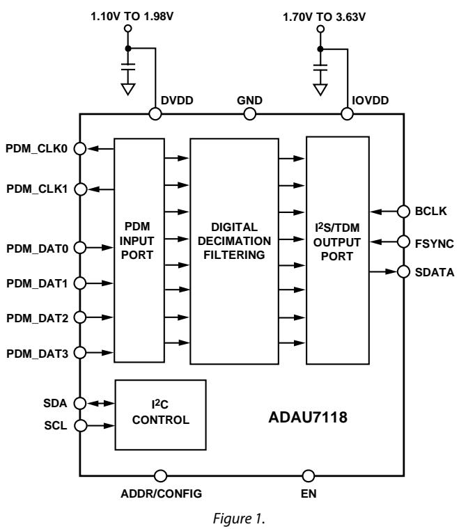

注意，在本数据手册中，多功能引脚（如ADDR/CONFIG）或以完整引脚名称引用，或仅以该引脚的单一功能引用，例如在仅涉及该功能时使用ADDR。

## 目录

特性 .... 1
应用 .... 1
功能框图 .... 1
概述 .... 1
修订历史 .... 2
技术规格 .... 3
绝对最大额定值 .... 7
热阻 .... 7
ESD注意事项 .... 7
引脚配置和功能描述 .... 8
典型性能特性 .... 9
工作原理 .... 11
上电与初始化 .... 11
时钟 .... 11
断电状态 .... 12
独立硬件模式 .... 12
串行音频输出接口 .... 13
I²C控制接口 .... 17
输出引脚驱动强度 .... 18
高通滤波器 .... 18
应用信息 .... 19
寄存器摘要 .... 20
寄存器详情 .... 21

## 修订历史

5/2019—修订版本0：初始版本

8/2019—修订版本0至修订版本A
特性章节更改 .... 1
订购指南更改 .... 34

ADI供应商ID寄存器 .... 21
器件ID 1寄存器 .... 21
器件ID 2寄存器 .... 21
修订代码寄存器 .... 21
通道对和时钟使能寄存器 .... 22
抽取比和PDM时钟映射控制寄存器 .... 23
高通滤波器控制寄存器 .... 24
串行端口控制1寄存器 .... 25
串行端口控制2寄存器 .... 25
串行端口路由和驱动使能通道0寄存器 ... 26
串行端口路由和驱动使能通道1寄存器 ... 27
串行端口路由和驱动使能通道2寄存器 ... 28
串行端口路由和驱动使能通道3寄存器 ... 29
串行端口路由和驱动使能通道4寄存器 ... 30
串行端口路由和驱动使能通道5寄存器 ... 31
串行端口路由和驱动使能通道6寄存器 ... 32
串行端口路由和驱动使能通道7寄存器 ... 33
输出焊盘驱动强度控制寄存器 .... 34
软件复位寄存器 .... 34
外形尺寸 .... 35
订购指南 .... 35

## 技术规格

DVDD = 1.10 V 至 1.98 V，IOVDD = 1.70 V 至 3.63 V，$\mathrm { T _ { A } } = 2 5 ^ { \circ } \mathrm { C } ,$ 引脚设置为低驱动强度，除非另有说明。

表 1.

| 参数 | 最小值 | 典型值 | 最大值 | 单位 | 测试条件/注释 |
| --- | --- | --- | --- | --- | --- |
| 数字输入 |  |  |  |  |  |
| 输入电压 |  |  |  |  |  |
| 高电平 ( $V_{IH}$ ) | 0.7 × IOVDD |  |  | V |  |
| 低电平 ( $V_{IL}$ ) |  |  | 0.3 × IOVDD | V |  |
| 输入漏电流 |  |  |  |  |  |
| 高电平 ( $I_{IH}$ ) |  |  | 2.5 | μA | 带下拉电阻的数字输入引脚 |
| 低电平 ( $I_{IL}$ )（0 V 时） |  |  | 1 | μA | 带下拉电阻的数字输入引脚 |
| 输入电容 ( $C_i$ ) |  | 2 |  | pF | 由设计保证 |
| 数字输出 |  |  |  |  |  |
| 输出电压 |  |  |  |  |  |
| 高电平 ( $V_{OH}$ ) | 0.85 × IOVDD |  |  | V | 输出高电平时的源电流 ( $I_{OH}$ ) = 1 mA |
| 低电平 ( $V_{OL}$ ) |  |  | 0.1 × IOVDD | V | 输出低电平时的源电流 ( $I_{OL}$ ) = 1 mA |
| 数字输出引脚，输出驱动 |  |  |  |  | 数字输出引脚驱动低阻抗 PCB 走线至高阻抗数字输入缓冲器 |
| IOVDD = 1.8 V（标称值） |  |  |  |  |  |
| 驱动强度设置 |  |  |  |  |  |
| 2.5 mA | 0.7 |  |  | mA |  |
| 5 mA | 1.4 |  |  | mA |  |
| 10 mA | 2.8 |  |  | mA |  |
| 15 mA | 4.2 |  |  | mA |  |
| IOVDD = 3.3 V（标称值） |  |  |  |  |  |
| 驱动强度设置 |  |  |  |  |  |
| 2.5 mA | 2.5 |  |  | mA |  |
| 5 mA | 5 |  |  | mA |  |
| 10 mA | 10 |  |  | mA |  |
| 15 mA | 15 |  |  | mA |  |
| 性能 |  |  |  |  |  |
| 动态范围 |  | 126 |  | dB | 20 Hz 至 20 kHz，-60 dB 输入，A计权滤波器（有效值），相对于 0 dBFS 输出 |
| 信噪比 (SNR) |  | 126 |  | dB | A计权滤波器，五阶输入，相对于 0 dBFS 输出 |
| 抽取比 | 16× | 64× | 64× |  |  |
| 频率响应 | -0.1 |  | +0.01 | dB | DC 至 0.45 × 输出采样率 (fs) |
| 阻带 |  | 0.566 × fs |  | Hz |  |
| 阻带衰减 | 75 |  |  | dB |  |
| 群延迟 | 4.47 | 4.47 | 4.47 | FSYNC 周期 | 0.02 fs 输入信号，64× 抽取 |
|  | 5.02 | 5.02 | 5.02 | FSYNC 周期 | 0.02 fs 输入信号，32× 抽取 |
|  | 5.83 | 5.83 | 5.83 | FSYNC 周期 | 0.02 fs 输入信号，16× 抽取 |
| 增益 | 0 | 0 | 0 | dB | PDM 转 PCM |
| 启动时间 | 63 | 64 | 64 | FSYNC 周期 | 上电复位及初始化代码运行后 |
| 位分辨率 |  | 24 |  | 位 | 内部及输出 |
| 通道间相位 | 0 | 0 | 0 | 度 |  |
| 高通滤波器 -3 dB 点 | 0.23328 | 0.9312 | 242.4 | Hz | $f_s = 48 kHz$ ，截止频率通过 HPF_CONTROL 寄存器中的 HPF_FC 位设置，典型值为默认设置 |
| 时钟 |  |  |  |  |  |
| 输出采样率 ( $f_s$ ) | 4 | 48 | 192 | kHz | FSYNC 脉冲率 |
| 位时钟频率 ( $f_{BCLK}$ ) | 0.256 | 12.288 | 24.576 | MHz |  |
| PDM_CLKx 频率 ( $f_{PDM\_CLK}$ ) | 0.256 | 3.072 | 6.144 | MHz |  |
| 电源 |  |  |  |  |  |
| 电源电压 |  |  |  |  |  |
| 数字电压（DVDD 引脚） | 1.10 |  | 1.98 | V | 数字电路供电 |
| I/O 电源电压（IOVDD 引脚） | 1.70 |  | 3.63 | V | 输入/输出 (I/O) 电路供电，包括焊盘和电平转换器 |
| 电源电流 |  |  |  |  |  |
| I/O 电流（IOVDD 引脚） |  |  |  |  | 取决于时钟频率和外部负载特性 |
| 工作状态 |  | 2 |  | mA | IOVDD = 3.3 V，48 kHz  $f_s$ ，TDM-8 格式，全部通道驱动，默认驱动强度，25 pF 电容，仅使用一个 PDM_CLKx 引脚 |
|  |  | 0.86 |  | mA | IOVDD = 1.8 V，48 kHz  $f_s$ ，TDM-8 格式，全部通道驱动，默认驱动强度，25 pF 电容，仅使用一个 PDM_CLKx 引脚 |
| 关断电流 |  | 16 |  | μA | 上电，施加帧时钟和位时钟，然后按照表 10 中的步骤将器件置于掉电状态 |
|  |  | 3 |  | μA | 上电，施加帧时钟和位时钟，然后按照表 9 中的步骤将器件置于掉电状态 |
| 数字电流（DVDD 引脚） |  |  |  |  |  |
| 工作状态 |  | 1.4 |  | mA | 全温度范围、全电压范围及硅工艺偏差，8 通道，48 kHz  $f_s$ |
|  |  | 1.2 |  | mA | DVDD = 1.8 V，8 通道，48 kHz  $f_s$ |
|  |  | 0.8 |  | mA | DVDD = 1.2 V，8 通道，48 kHz  $f_s$ |
|  |  | 0.7 |  | mA | DVDD = 1.8 V，4 通道，48 kHz  $f_s$ |
|  |  | 0.4 |  | mA | DVDD = 1.2 V，4 通道，48 kHz  $f_s$ |
|  |  | 0.4 |  | mA | DVDD = 1.8 V，8 通道，16 kHz  $f_s$ |
|  |  | 0.27 |  | mA | DVDD = 1.2 V，8 通道，16 kHz  $f_s$ |
|  |  | 0.22 |  | mA | DVDD = 1.8 V，4 通道，16 kHz  $f_s$ |
|  |  | 0.14 |  | mA | DVDD = 1.2 V，4 通道，16 kHz  $f_s$ |
| 关断电流 |  | 4 |  | μA | 使用表 9 或表 10 中任一方法的掉电模式 |

## 串行端口

$\mathrm { T _ { A } } = - 4 0 ^ { \circ } \mathrm { C }$ 至 $+ 8 5 ^ { \circ } \mathrm { C } ,$ DVDD = 1.10 V 至 1.98 V，IOVDD = 1.70 V 至 3.63 V，除非另有说明。

表 2.

| 参数 | 最小值 | 最大值 | 单位 | 描述 |
| --- | --- | --- | --- | --- |
| 串行端口 |  |  |  |  |
| $f_{FSYNC}$ |  | 192 | kHz | FSYNC 频率， $1/t_{FSYNC}$ |
| $t_{FSYNC}$ | 5.21 |  | μs | FSYNC 周期 |
| $f_{BCLK}$ |  | 24.576 | MHz | BCLK 频率，采样率范围为 4 kHz 至 192 kHz， $1/t_{BCLK}$ |
| $t_{BCLK}$ | 40.7 |  | ns | BCLK 周期 |
| $t_{BIL}$ | 18 |  | ns | BCLK 低电平脉冲宽度，从模式，BCLK 频率 = 24.576 MHz，BCLK 周期 = 40.6 ns |
| $t_{BIH}$ | 18 |  | ns | BCLK 高电平脉冲宽度，从模式，BCLK 频率 = 24.576 MHz，BCLK 周期 = 40.6 ns |
| $t_{LIS}$ | 10 |  | ns | FSYNC 至 BCLK 输入上升沿的建立时间，从模式，FSYNC 频率 = 192 kHz |
| $t_{LIH}$ | 10 |  | ns | FSYNC 从 BCLK 输入上升沿起的保持时间，从模式，FSYNC 频率 = 192 kHz |
| $t_{SOD}$ |  | 20.63 | ns | SDATA 从 BCLK 输出下降沿起的延迟，25 pF 负载，全 IOVDD 范围、全温度范围和工艺偏差，默认驱动强度 10 mA |
|  |  | 11.71 | ns | IOVDD = 3.3 V ± 10%，驱动强度设置为 0b00，25 pF 负载 |
|  |  | 10.37 | ns | IOVDD = 3.3 V ± 10%，驱动强度设置为 0b01，25 pF 负载 |
|  |  | 9.03 | ns | IOVDD = 3.3 V ± 10%，驱动强度设置为 0b10，25 pF 负载 |
|  |  | 8.72 | ns | IOVDD = 3.3 V ± 10%，驱动强度设置为 0b11，25 pF 负载 |
|  |  | 31.02 | ns | IOVDD = 1.7 V 至 1.89 V，驱动强度设置为 0b00，25 pF 负载 |
|  |  | 25.83 | ns | IOVDD = 1.7 V 至 1.89 V，驱动强度设置为 0b01，25 pF 负载 |
|  |  | 20.63 | ns | IOVDD = 1.7 V 至 1.89 V，驱动强度设置为 0b10，25 pF 负载 |
|  |  | 20.33 | ns | IOVDD = 1.7 V 至 1.89 V，驱动强度设置为 0b11，25 pF 负载 |

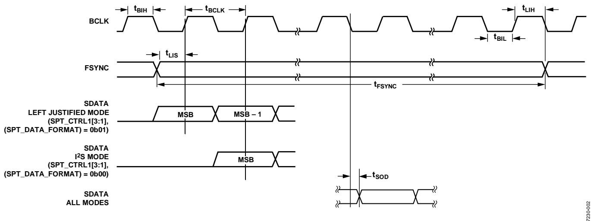  
图 2. 串行端口时序规格

## I2C 接口—从模式

$\mathrm { T _ { A } } = - 4 0 ^ { \circ } \mathrm { C }$ 至 +85°C，DVDD = 1.10 V 至 1.98 V，IOVDD = 1.70 V 至 3.63 V，除非另有说明。

表 3.

| 参数 | 最小值 | 最大值 | 单位 | 描述 |
| --- | --- | --- | --- | --- |
| $I^{2}C$  从模式端口 |  |  |  |  |
| $f_{SCL}$ |  | 1000 | kHz | SCL 时钟频率，未在图 3 中显示 |
| $t_{SCLH}$ | 0.26 |  | μs | SCL 高电平脉冲宽度 |
| $t_{SCLL}$ | 0.5 |  | μs | SCL 低电平脉冲宽度 |
| $t_{SCS}$ | 0.26 |  | μs | 起始及重复起始条件建立时间 |
| $t_{SCH}$ | 0.26 |  | μs | 起始条件保持时间 |
| $t_{DS}$ | 50 |  | ns | 数据建立时间 |
| $t_{DH}$ |  | 0.45 | μs | 数据保持时间 |
| $t_{SCLR}$ |  | 120 | ns | SCL 上升时间 |
| $t_{SCLF}$ |  | 120 | ns | SCL 下降时间 |
| $t_{SDR}$ |  | 120 | ns | SDA 上升时间 |
| $t_{SDF}$ |  | 120 | ns | SDA 下降时间 |
| $t_{BFT}$ | 0.5 |  | μs | 停止与起始之间的总线空闲时间 |
| $t_{SUSTO}$ | 0.26 |  | μs | 停止条件建立时间 |

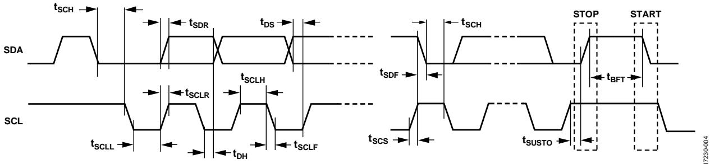  
图 3. I2C 从模式端口时序规格

## PDM 输入

$\mathrm { T _ { A } } = - 4 0 ^ { \circ } \mathrm { C }$ 至 +85°C，DVDD = 1.10 V 至 1.98 V，IOVDD = 1.70 V 至 3.63 V，PDM 数据在时钟的两个边沿锁存（见图 4），除非另有说明。

表 4.

| 参数 | $t_{MIN}$ | $t_{MAX}$ | 单位 | 描述 |
| --- | --- | --- | --- | --- |
| 时序要求 |  |  |  |  |
| $t_{SETUP}$ | 9 |  | ns | 数据建立时间 |
| $t_{HOLD}$ | 3 |  | ns | 数据保持时间 |

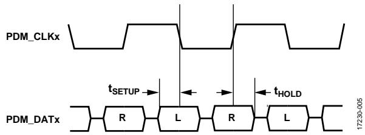  
图 4. PDM 时序图

## 绝对最大额定值

表 5.

| 参数 | 额定值 |
| --- | --- |
| DVDD 对地 | 1.98 V |
| IOVDD 对地 | 3.63 V |
| 数字输入 | GND – 0.3 V 至 IOVDD + 0.3 V |
| 最大工作环境温度范围 | -40°C 至 +85°C |
| 结温范围 | -65°C 至 +165°C |
| 存储温度范围 | -65°C 至 +150°C |
| 焊接（60 秒） | 300°C |
| 静电放电 (ESD) 敏感度 | 4.5 kV |

超过绝对最大额定值所列的应力水平可能导致产品永久性损坏。这仅是应力额定值；不暗示产品在这些条件或任何其他超出本规范操作部分所指示条件的条件下能够正常工作。长时间在超过最大工作条件下运行可能影响产品可靠性。

## 热阻

热性能与印刷电路板（PCB）设计和工作环境直接相关。需特别注意 PCB 的热设计。

表 6. 热阻

| 封装类型 | $\theta_{JA}^{1}$ | $\theta_{JC}^{2}$ | 单位 |
| --- | --- | --- | --- |
| CP-16-22 | 57 | 15 | °C/W |

1 热阻抗模拟值基于 JEDEC 1S0P 热测试板。参见 JEDEC JESD-51。

2 热阻抗模拟值基于 JEDEC 2S2P 热测试板（含四个热过孔）。参见 JEDEC JESD-51。

## ESD 警告

ESD（静电放电）敏感器件。带电器件和电路板可能在不被察觉的情况下发生放电。尽管本产品具有专利或专有保护电路，高能量 ESD 仍可能导致器件损坏。因此，应采取适当的 ESD 预防措施，以避免性能下降或功能丧失。

## 引脚配置和功能描述

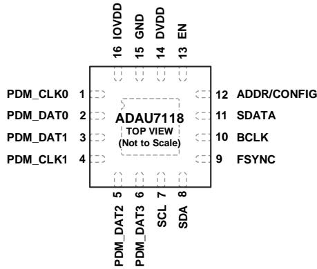

注释

裸露焊盘。必须将裸露焊盘焊接到 PCB 上等效尺寸的接地铜焊盘上以接地。无需热过孔。230-00

图 5. 引脚配置  
表 7. 引脚功能描述

| 引脚号 | 助记符 | 描述 |
| --- | --- | --- |
| 1 | PDM_CLK0 | PDM 输出时钟 0。 |
| 2 | PDM_DAT0 | PDM 输入数据 0。 |
| 3 | PDM_DAT1 | PDM 输入数据 1。 |
| 4 | PDM_CLK1 | PDM 输出时钟 1。 |
| 5 | PDM_DAT2 | PDM 输入数据 2。 |
| 6 | PDM_DAT3 | PDM 输入数据 3。 |
| 7 | SCL | I2C 串行时钟输入。 |
| 8 | SDA | I2C 数据。 |
| 9 | FSYNC | I2S/TDM 帧同步或左/右时钟。 |
| 10 | BCLK | I2S/TDM 位时钟。 |
| 11 | SDATA | I2S/TDM 串行数据输出。 |
| 12 | ADDR/CONFIG | I2C 地址或独立配置选择。 |
| 13 | EN | 芯片使能。将此引脚接地可禁用器件并使其进入低功耗模式。将此引脚接 IOVDD 可使能正常工作。禁用器件时，所有寄存器设置保持不变。但位时钟计数器和音频数据会复位，效果等同于执行软复位。 |
| 14 | DVDD | 内部核心数字电源。 |
| 15 | GND | 地。 |
| 16 | IOVDD | 数字输入/输出电源。 |
| EP | EPAD | 裸露焊盘。必须将裸露焊盘焊接到 PCB 上等效尺寸的接地铜焊盘上以接地。无需热过孔。 |

## 典型性能特性

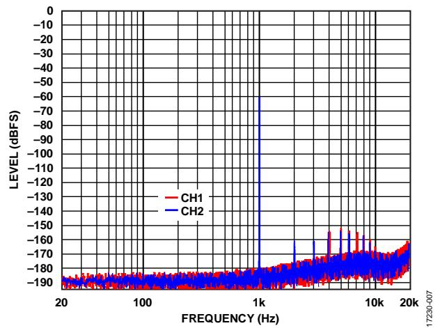  
图 6. 快速傅里叶变换（FFT），fS = 48 kHz，−60 dBFS 输入，64× 抽取，五阶

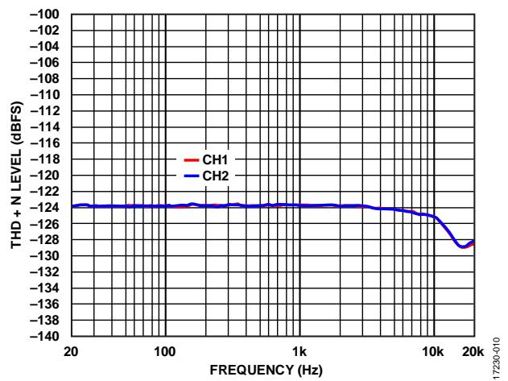

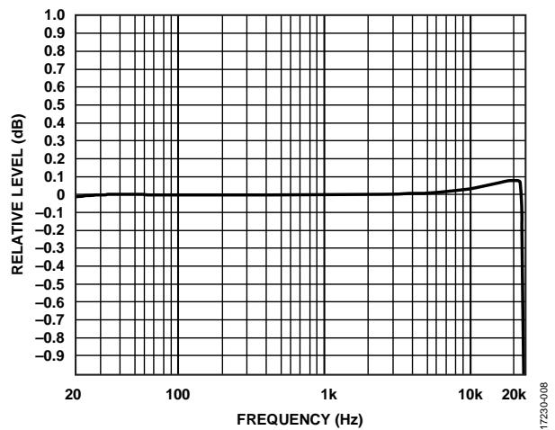  
图 7. 相对电平 vs. 频率（−10 dBFS 归一化），64× 抽取，fS = 48 kHz

图 9. 总谐波失真加噪声（THD + N）vs. 频率（−10 dBFS 未加权），fS = 48 kHz，64× 抽取，五阶  
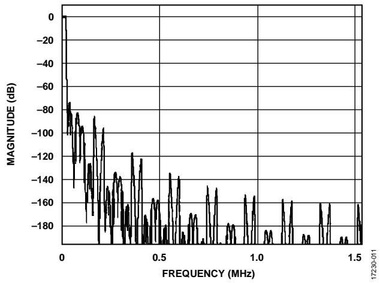  
图 10. 幅度 vs. 频率，48 kHz 输出，64× 抽取

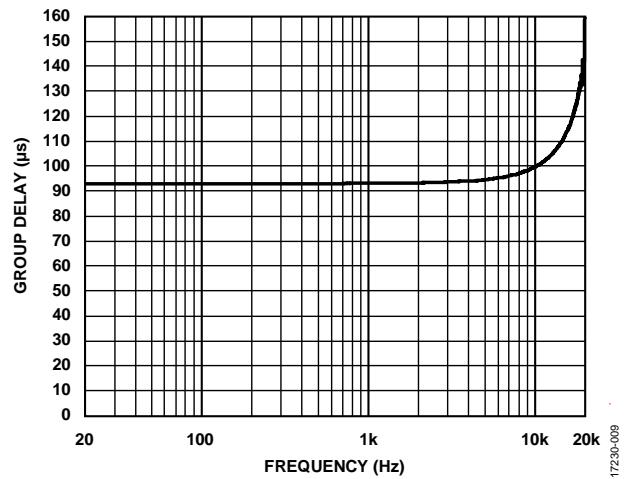  
图 8. 群延迟 vs. 频率，fS = 48 kHz，64× 抽取

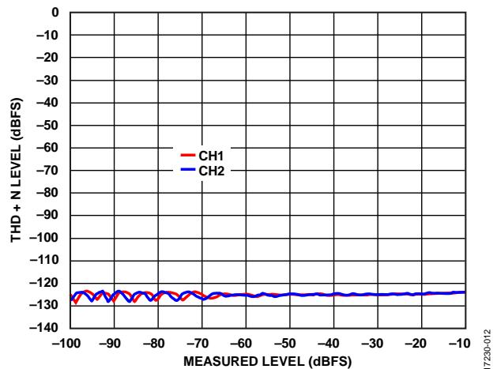  
图 11. THD + N 电平 vs. 测量电平，1 kHz，未加权，64× 抽取，五阶，fS = 48 kHz

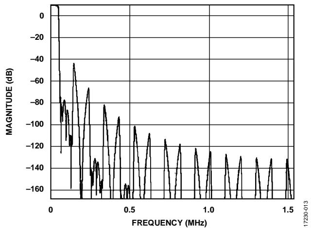  
图 12. 幅度 vs. 频率，48 kHz 输出，32× 抽取

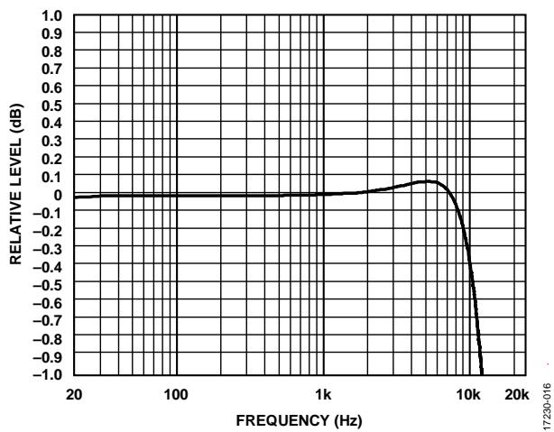  
图 15. 相对电平 vs. 频率（−10 dBFS 归一化），16× 抽取，fS = 48 kHz

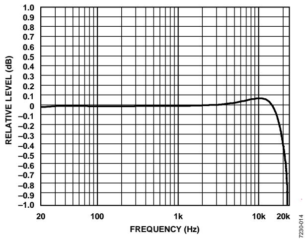  
图 13. 相对电平 vs. 频率（−10 dBFS 归一化），32× 抽取，fS = 48 kHz  
图 16. 群延迟 vs. 频率，fS = 48 kHz，32× 抽取

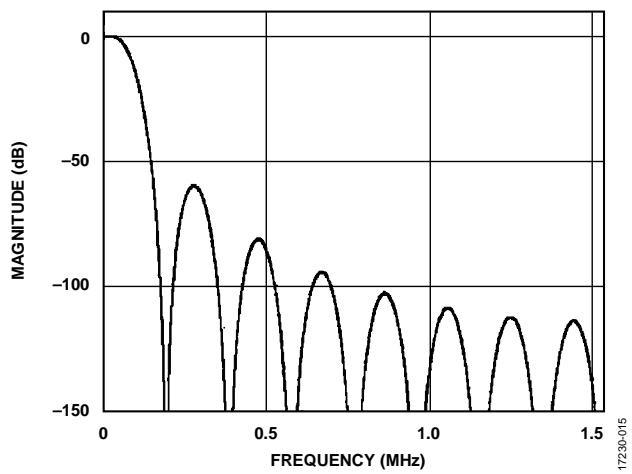

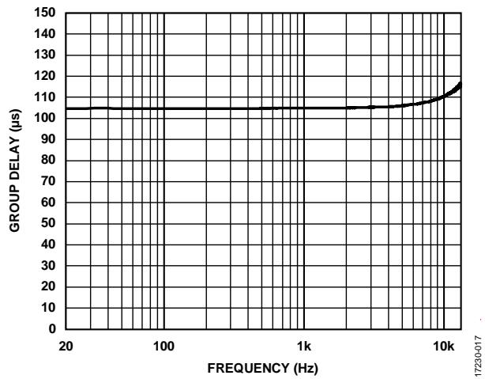

图 14. 幅度 vs. 频率，48 kHz 输出，16× 抽取  
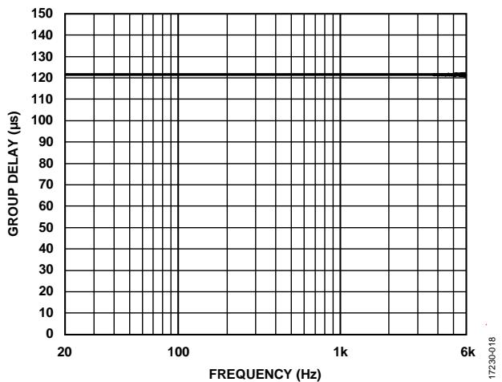  
图 17. 群延迟 vs. 频率，fS = 48 kHz，16× 抽取

## 工作原理

ADAU7118 提供最多 8 个通道的抽取功能，将 1 位 PDM 源转换为 24 位 PCM 音频。下采样比通常为 64 × fS，其中 fS 为 PCM 输出采样率，但下采样比也可以设置为 32 × fS 或 16 × fS，以支持更高的输出采样率。所有通道均以相同的比率进行抽取。下采样后的 24 位 PCM 音频通过标准 I2S 或 TDM 格式输出。

ADAU7118 的输入源可以是任何具有从模式 PDM 输出的器件，例如数字麦克风。这些麦克风的输出引脚可以直接连接到 ADAU7118 的输入引脚。器件提供两个独立的 PDM\_CLKx 输出，它们是同一信号的复制，以便更轻松地驱动多个源。每个 PDM\_CLKx 可以单独禁用。

PDM\_DATx 输入引脚连接到 PDM 源的数据输出。内部共有 8 个通道，即通道 0 至通道 7。PDM\_DATx 输入到内部通道的映射关系详见表格 8。

表格 8. PDM\_DATx 到内部通道的映射

| 输入引脚 | PDM_CLK 边沿 | 内部通道 |
| --- | --- | --- |
| PDM_DAT0 | 下降沿 | 0 |
| PDM_DAT0 | 上升沿 | 1 |
| PDM_DAT1 | 下降沿 | 2 |
| PDM_DAT1 | 上升沿 | 3 |
| PDM_DAT2 | 下降沿 | 4 |
| PDM_DAT2 | 上升沿 | 5 |
| PDM_DAT3 | 下降沿 | 6 |
| PDM_DAT3 | 上升沿 | 7 |

与每个 PDM\_DATx 引脚关联的每个内部通道对如果未被使用，可以禁用以节省功耗。

每个 PDM 数据引脚必须通过抽取比与 PDM 时钟映射控制寄存器（DEC\_RATIO\_CLK\_MAP）分配给 PDM\_CLK0 或 PDM\_CLK1 时钟源，以确保满足时序规格。PDM\_CLKx 的分配必须与驱动 PDM 麦克风的实际 PDM 时钟一致。默认情况下，PDM\_DAT0 和 PDM\_DAT1 映射到 PDM\_CLK0，PDM\_DAT2 和 PDM\_DAT3 映射到 PDM\_CLK1。这两个时钟源到四个数据输入引脚的映射关系可以通过 PDM\_DATx\_CLK\_MAP 位进行修改。

## 上电与初始化

ADAU7118 需要两个电源才能工作：IOVDD 和 DVDD。两个电源可以同时上电。如果电源在不同时间上电，则必须先施加 IOVDD，然后在之后的任何时间点施加 DVDD。没有时序限制。

电源稳定后，器件开始初始化，并根据工作模式准备接受输入的 I2S 时钟或 I2C 命令。

初始化完成后，施加 I2S 时钟后，需要 16 个完整的帧同步周期才能开始输出 PDM 时钟。

当 PDM 时钟启动后，再经过 48 个帧同步周期，PDM 数据才会出现在 SDATA 引脚上。这 64 个帧同步周期列于表格 1 中。

ADAU7118 可以在两种工作模式下运行：独立硬件模式和 I2C 模式。更多详细信息，请参阅独立硬件模式部分或 I2C 控制接口部分。

## 时钟

电源上电并完成上电初始化后，器件即可接受 I2S 时钟。此时，器件需要 16 个完整的帧同步周期才能完全初始化并开始输出 PDM 时钟。如果在正常工作期间，位时钟或帧同步被移除，ADAU7118 的 PDM\_CLKx 输出会立即停止，器件自动进入低功耗状态。更多详细信息，请参阅掉电状态部分。当时钟恢复时，ADAU7118 会重新锁定到位时钟和帧同步信号，并相应调整 PDM\_CLKx 输出。PDM 时钟输出恢复之前的时间长度为 4 帧 ± 1 帧，用于锁定输入信号。如果时钟信号的格式发生变化，ADAU7118 会在帧结束时检测到这一变化，并停止 PDM 时钟输出。然后，器件会重新配置并恢复输出 PDM 时钟，无需用户干预。同样，PDM 时钟输出恢复之前的时间长度通常为 4 帧 ± 1 帧，用于锁定输入信号。

ADAU7118 要求 BCLK 速率至少为帧同步（FSYNC）采样率的 64 倍。也支持 128 倍、192 倍、256 倍、384 倍和 512 倍 FSYNC 速率的 BCLK 速率。ADAU7118 会自动检测 BCLK 与 FSYNC 之间的比率，默认生成频率为 FSYNC 速率 64 倍的 PDM 时钟输出。如果在寄存器 0x05（DEC\_RATIO\_CLK\_MAP）中选择了较低的抽取比，则 PDM 输出时钟速率与 DEC\_RATIO 位设置相对应。最低采样率为 4 kHz，最高采样率为 192 kHz。PDM 时钟范围为 256 kHz 至 6.144 MHz。内部所有处理均在 PDM\_CLK 速率下完成。

两个 PDM 时钟输出 PDM\_CLK0 和 PDM\_CLK1 是同一时钟的独立缓冲输出。但是，输入的 PDM 数据是使用实际时钟引脚上的信号进行采样的，而不是使用输出到引脚的内部时钟。这样做的原因是为了让时钟上升时间能够以与 PDM 数据信号类似的方式被外部电容减缓。建议将输入的 PDM 数据与实际连接到 PDM 麦克风的时钟输出相关联。DEC\_RATIO\_CLK\_MAP 寄存器（寄存器 0x05）用于为每个 PDM 数据输入分配两个时钟之一。

## 掉电状态

ADAU7118 可以通过两种可用方法之一进入掉电状态。首选方法是使用寄存器写入将器件置于尽可能最低的掉电状态。但是，当 ADAU7118 在独立模式下工作时，使用第二种方法，即使用使能引脚（EN）。

当使用系统控制器并进入低功耗状态时，通过向寄存器 0x04（ENABLES 寄存器）写入零来禁用 PDM 时钟并禁用电���通道输出。然后，可以移除（停止）帧时钟和位时钟，以将器件置于掉电状态。在停止时钟之前，应留出足够的时间让 I2C 写入完成。I2C 写入完成后至少等待一个完整帧就足够了。无需拉低 EN 引脚，这不会进一步降低功耗。更多详细信息，请参阅表格 9。

表格 9. 使用寄存器写入将 ADAU7118 置于掉电状态

| 步骤 | 操作 |
| --- | --- |
| 1 | 向寄存器 0x04 写入零 |
| 2 | 等待至少一个帧周期 |
| 3 | 停止帧时钟和位时钟 |

当 ADAU7118 处于独立模式时，可以通过向 EN 引脚施加低电平信号，然后等待至少一个完整帧，将器件置于掉电状态。更多详细信息，请参阅表格 10。请注意，如果在 EN 引脚上使用了上拉电阻，则通过该上拉电阻的额外电流必须计入表格 1 中的数值。

表格 10. 在独立模式下工作时将 ADAU7118 置于掉电状态

| 步骤 | 操作 |
| --- | --- |
| 1 | 向 EN 引脚施加低电平电压 |
| 2 | 等待至少一个帧周期 |
| 3 | 停止帧时钟和位时钟 |

要退出掉电模式，恢复时钟与使能器件的顺序无关紧要。使能器件指的是拉高 EN 引脚或通过写入寄存器 0x04 来使能器件。

## 独立硬件模式

由于所有通道默认使能并输出，该器件可以在默认控制设置下使用，无需 I2C，且 ADDR/CONFIG 引脚可设置为任意状态，但硬件模式除外。如果 ADDR/CONFIG 引脚悬空，器件处于独立硬件模式，此时无法进行 I2C 通信。有关 ADDR/CONFIG 引脚设置的详细信息，请参见表 14。在独立硬件模式下，I2C SCL 引脚和 SDA 引脚的设置可通过改变部分寄存器的默认状态来选择不同的功能。有关与默认设置差异的详细信息，请参见表 11。

为了在独立硬件模式下有 BCLK 存在时实现最低功耗，EN 引脚仍然有效，可将其拉低以使器件进入低功耗模式。EN 引脚还执行软复位，但不会复位任何寄存器设置。停止位时钟和帧同步时钟也会使器件进入低功耗状态。更多详细信息请参见时钟章节。

表 11. 独立硬件模式设置：与默认设置的差异

| SCL 引脚连接到 | SDA 引脚连接到 | 工作模式设置 | PDM 时钟设置：ENABLES，寄存器 0x04 | 通道使能：ENABLES，寄存器 0x04 | 驱动强度 |
| --- | --- | --- | --- | --- | --- |
| IOVDD | IOVDD | 4-channel | PDM_CLK1_EN bit = 0,disabled | CHAN_45_EN bit = 0,CHAN_67_EN bit = 0 | Default setting = 10 |
| IOVDD | GND | 8-channel highdrive | Default settings | All channels enabled | SDATA_DS = 11, PDM_CLK0_DS = 11, PDM_CLK1_EN = 11 |
| GND | IOVDD | 6-channel | Default settings | CHAN_67_EN = 0 | Default setting = 10 |
| GND | GND | 6-channel highdrive | Default settings | CHAN_67_EN = 0 | SDATA_DS = 11, PDM_CLK0_DS = 11, PDM_CLK1_EN = 11 |

## 串行音频输出接口

ADAU7118 支持 I2S 和 TDM 串行输出格式。最多可使用 16 个 TDM 时隙。支持 16 位、24 位和 32 位的 TDM 时隙宽度。通过 SPT\_Cx\_SLOT 位，任意内部通道均可路由至任意输出时隙。默认情况下，每个通道路由至与其编号相同的时隙。例如，通道 1 进入时隙 1，通道 6 进入时隙 6。通过各自的 SPT\_Cx\_DRV 位，每个通道可设置为在其设定时隙期间驱动或不驱动（三态高阻模式）。I2S 模式或 TDM 模式的选择通过 SPT\_CTRL1 寄存器中的 SPT\_SAI\_MODE 位（位 0）进行。SDATA 引脚默认处于三态高阻模式，除非该端口正在驱动串行数据。可以将两个或多个通道设置为相同的 TDM 时隙。在这种情况下，编号最低的通道获胜并将其数据驱动到时隙中。其他通道的数据不会出现在任何位置。寄存器设置没有交叉检查来防止用户执行此操作，但器件不会损坏，只是输出中会丢失数据。

SPT\_CTRL1 寄存器的 SPT\_SAI\_MODE 位（位 0）用于设置串行端口音频接口模式。两种模式分别为立体声和 TDM。这两种模式之间的主要区别在于所需的帧同步时钟格式以及时钟有效沿的极性。

当 SPT\_SAI\_MODE 位设置为 0，且 SPT\_LRCLK\_POL 位（位 1，寄存器 SPT\_CTRL2）设置为 0 时，串行端口处于立体声模式，时钟极性设置为正常。在此模式下，预计仅发送两个通道的数据。帧从帧同步的下降沿开始，预期占空比为 50% 高电平和 50% 低电平。通道 0 在时钟为低电平时发送其数据，一旦帧同步变为高电平，通道 0 的数据停止，通道 1 开始发送。帧同步时钟的两个边沿均被使用。如果占空比不是 50/50，则结果数据可能出现错误。在此工作模式下，ADAU7118 不要求每个通道有 32 位时钟转换。支持所有位时钟与帧同步的比率。

当 SPT\_SAI\_MODE 位设置为 1，且 SPT\_LRCLK\_POL 位设置为 0 时，串行端口处于 TDM 模式，时钟极性设置为正常。在此模式下，最少可以传输单个通道，最多可以传输 8 个通道，分布在 TDM-16 格式的 16 个数据时隙中。

ADAU7118 支持六种不同的位时钟速率：输出采样率的 64×、128×、192×、256×、384× 或 512×。这些位时钟速率与三种不同的 TDM 时隙大小（16 位、24 位或 32 位时隙，通过 SPT\_CTRL1 寄存器的 Bits[5:4]（SPT\_SLOT\_WIDTH）选择）相结合，共支持 18 种 TDM 格式组合。请注意，其中某些格式不具有偶数个完整宽度时隙（参见表 12）。

请注意，一旦检测到下一个帧同步边沿，ADAU7118 会从时隙 0 重新开始，前一帧中任何未被访问到的数据都将丢失。这就是实现 TDM-5 或 TDM-10 等非标准 TDM 格式的方法。此外，仅支持 TDM-16 或更少的时隙数来将数据放入 TDM 时隙中。数据不能放入编号大于 16 的时隙中。ADAU7118 可配置为将所有未使用的 TDM 时隙置于三态，对于具有超过 16 个时隙的模式，这包括前 16 个时隙之外的所有时隙。

在 TDM 模式下，帧同步应为正向脉冲，宽度至少为一个位时钟周期。下降沿不重要，只要低电平持续时间足够长，满足在被读为低电平后回到高电平的时序规范，就不会被关注。帧从该脉冲的上升沿开始。数据按照 SPT\_CTRL1 寄存器（寄存器 0x07）中指定的时隙宽度和数据格式输出。ADAU7118 持续发送数据，直到所有活动通道发送完毕，然后器件等待下一个帧同步时钟边沿以开始发送下一组帧采样数据。如果使用 TDM-16，且 ADAU7118 设置为将通道 0 至通道 7 输出到时隙 0 至时隙 7，则 ADAU7118 可在帧的剩余时间内处于三态，从而允许另一个 ADAU7118 将其 8 个通道输出到时隙 8 至时隙 15。这些时隙不必连续。如果正确设置，两个器件可以交错各自的数据。串行端口可设置为仅在有数据需要驱动到数据时隙时才驱动。如果 8 个通道中有一个或多个未使用，则该通道可被分配为驱动一个时隙或在该数据时隙期间处于三态，这通过 SPT\_Cx 寄存器中的位 0 来实现。

SPT\_LRCLK\_POL 位（左/右时钟极性）可设置为 1，该位会反相预期的帧时钟。在立体声模式下，当 SPT\_LRCLK\_POL 位设置为 1 时，通道 0 在帧同步为高电平时发送，因此帧的开始是低电平到高电平的转换。

在 TDM 模式下，当 SPT\_LRCLK\_POL 位设置为 1 时，预期的帧同步脉冲为负向，因此帧从高电平到低电平的转换开始。

SPT\_CTRL1 寄存器中的 SPT\_DATA\_FORMAT 位（Bits[3:1]）允许调整 32 位数据时隙中数据的对齐方式。支持延迟一个位时钟周期的左对齐模式，以及 24 位、20 位和 16 位数据字大小的右对齐模式。

表 12. 支持的 TDM 位时钟速率与对应的时隙数量（按时隙大小设置）

| 位时钟速率 | SPT_CTRL1, Bits[5:4] |  |  |
| --- | --- | --- | --- |
| 位时钟速率 | 0b01，16 位时隙 | 0b10，24 位时隙 | 0b00，32 位时隙 |
| $64 \times f_s$ | 4 | $2^1$ | 2 |
| $128 \times f_s$ | 8 | $5^1$ | 4 |
| $192 \times f_s$ | 12 | 8 | 6 |
| $256 \times f_s$ | 16 | $10^1$ | 8 |
| $384 \times f_s$ | 24 | 16 | 12 |
| $512 \times f_s$ | 32 | $21^1$ | 16 |

1 此组合会产生一个部分最终 TDM 时隙，该时隙不计入时隙总数。该最终时隙中的数据无效。表中显示的时隙数为完整宽度的时隙。

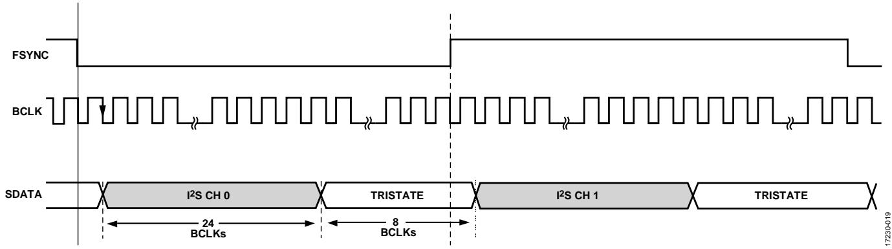  
图 18. SPT\_SIA\_MODE = 立体声模式（I2S），仅 I2C 操作

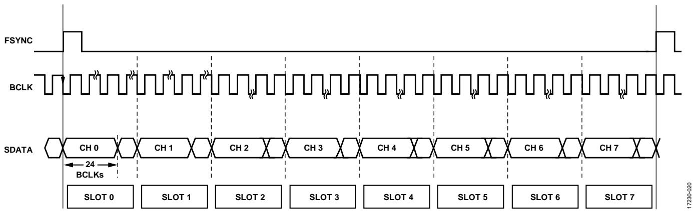  
图 19. TDM-8，默认通道分配，左对齐零延迟，24 位数据，32 位时隙，正常极性时钟

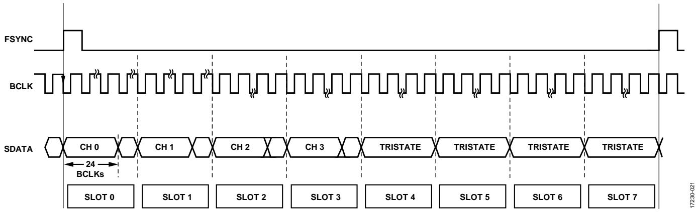  
图 20. TDM-8，左对齐零 BCLK 延迟，仅通道 0 至通道 3 使能

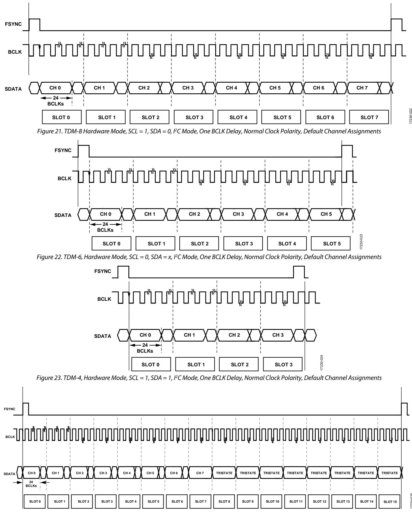  
图 24. TDM-16，默认通道分配，左对齐零 BCLK 延迟，正常时钟极性

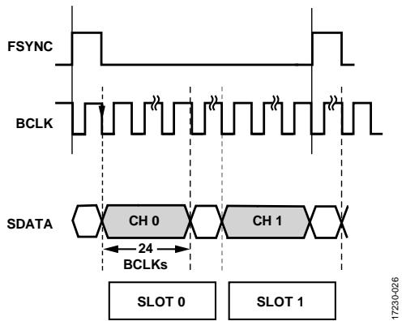  
图 25. TDM-2，I2C 模式，一个 BCLK 延迟，正常时钟极性，默认通道分配

## I2C 控制接口

ADAU7118 支持跨多个外设共享的 2 线串行总线（兼容 I2C）。两个信号——串行数据（SDA）和串行时钟（SCL）——在 ADAU7118 和系统 I2C 主控制器之间传输信息。ADAU7118 始终是总线上的从机，不能发起数据传输。每个从机器件由唯一的地址标识。地址字节格式如表 13 所示，地址的 LSB 由 ADDR/CONFIG 引脚的状态决定（参见表 14）。地址位于 I2C 写入的前 7 位中。该字节的 LSB 设置读操作或写操作。逻辑电平 1 对应读操作，逻辑电平 0 对应写操作。

SDA 和 SCL 均为开漏，需要上拉电阻连接到 IOVDD 电压。ADAU7118 在 IOVDD 的整个电压范围内支持 I2C 操作。

表 13. I2C 器件地址字节格式

| Bit 7 | Bit 6 | Bit 5 | Bit 4 | Bit 3 | Bit 2 | Bit 1 | Bit 0 |
| --- | --- | --- | --- | --- | --- | --- | --- |
| 0 | 0 | 1 | 0 | 1 | Bit 2 | Bit 1 | R/W |

表 14. 独立硬件模式：ADDR/CONFIG 引脚选项

| I²C 地址位 2 | I²C 地址位 1 | ADDR 引脚配置 |
| --- | --- | --- |
| 1 | 1 | Tie to IOVDD |
| 0 | 0 | Tie to GND |
| Hardware Mode 1 | Hardware Mode 1 | Open |
| 1 | 0 | Tie to IOVDD through a 47 kΩ resistor |
| 0 | 1 | Tie to GND through a 47 kΩ resistor |

## 输出引脚驱动强度

所有输出引脚均具有可配置的输出驱动强度，可通过各自的控制器寄存器进行设置。在 3.3 V IOVDD 下，可实现 2.5 mA、5 mA、10 mA 和 15 mA 的驱动强度。串行数据输出引脚在所有有效采样率下均以从模式工作，前提是外部电路设计提供足够的电气信号完整性。当在 IOVDD = 1.8 V 标称值下工作时，应注意在 BCLK 频率超过 12.288 MHz 时获得足够的时序裕量。PCB 上位时钟和 SDATA 信号线的电容以及走线长度均参与了此时序裕量的计算。

## 高通滤波器

信号路径中有一阶高通滤波器，如果需要可以旁路。高通滤波器默认禁用，可通过设置 HPF\_EN（位 0，寄存器 HPF\_CONTROL）= 1 来使能。截止频率可使用 HPF\_CONTROL 寄存器中的 HPF\_FC 位（Bits[7:4]）进行调整。这些设置与输出采样率相关。表 15 显示了常见采样率下的设置和截止频率。

表 15. HPF 截止频率选择

| HPF_FC（Bits[7:4]）设置 | 乘法因子 | 截止频率（Hz） |  |
| --- | --- | --- | --- |
| HPF_FC（Bits[7:4]）设置 | 乘法因子 | 48 kHz 采样率 | 32 kHz 采样率 |
| 101 | 0.00505 | 242.4 | 161.6 |
| 110 | 0.00251 | 120.48 | 80.32 |
| 111 | 0.00125 | 60 | 40 |
| 1000 | 0.000623 | 29.904 | 19.936 |
| 1001 | 0.000311 | 14.928 | 9.952 |
| 1010 | 0.000155 | 7.44 | 4.96 |
| 1011 | 0.0000777 | 3.7296 | 2.4864 |
| 1100 | 0.0000389 | 1.8672 | 1.2448 |
| 1101 | 0.0000194 | 0.9312 | 0.6208 |
| 1110 | 0.00000971 | 0.46608 | 0.31072 |
| 1111 | 0.00000486 | 0.23328 | 0.15552 |

# 应用信息

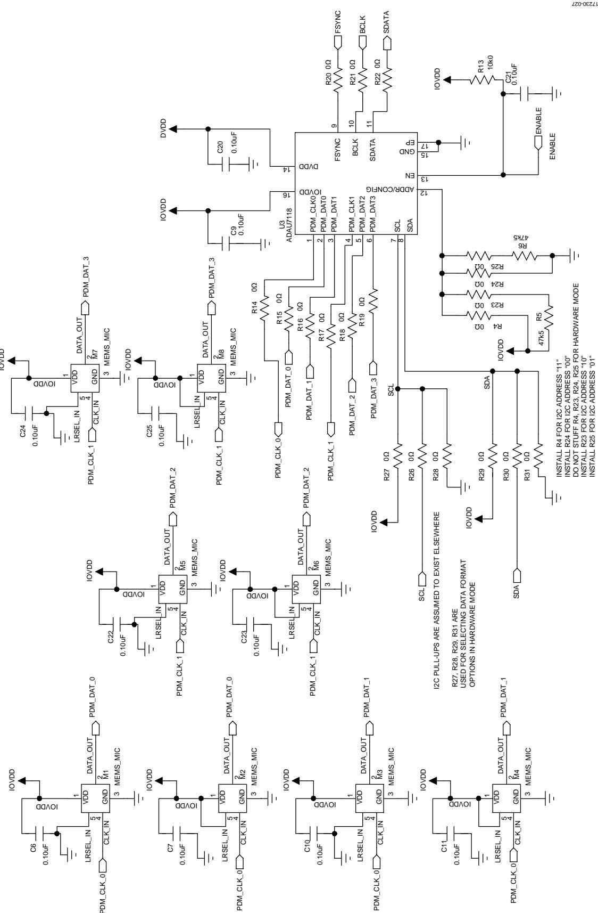  
图 26. 典型应用电路

## 寄存器摘要

表 16. ADAU7118 寄存器摘要

| 寄存器 | 名称 | 位 | 位 7 | 位 6 | 位 5 | 位 4 | 位 3 | 位 2 | 位 1 | 位 0 | 复位值 | 读/写 |
| --- | --- | --- | --- | --- | --- | --- | --- | --- | --- | --- | --- | --- |
| 0x00 | VENDOR_ID | [7:0] | VENDOR |  |  |  |  |  |  |  | 0x41 | R |
| 0x01 | DEVICE_ID1 | [7:0] | DEVICE1 |  |  |  |  |  |  |  | 0x71 | R |
| 0x02 | DEVICE_ID2 | [7:0] | DEVICE2 |  |  |  |  |  |  |  | 0x18 | R |
| 0x03 | REVISION_ID | [7:0] | REV |  |  |  |  |  |  |  | 0x00 | R |
| 0x04 | ENABLES | [7:0] | 保留 |  | PDM_CLK1_EN | PDM_CLK0_EN | CHAN_67_EN | CHAN_45_EN | CHAN_23_EN | CHAN_01_EN | 0x3F | R/W |
| 0x05 | DEC_RATIO_CLK_MAP | [7:0] | PDM_DAT3_CLK_MAP | PDM_DAT2_CLK_MAP | PDM_DAT1_CLK_MAP | PDM_DAT0_CLK_MAP | 保留 |  | DEC_RATIO |  | 0xC0 | R/W |
| 0x06 | HPF_CONTROL | [7:0] | HPF_FC |  |  |  | 保留 |  |  | HPF_EN | 0xD0 | R/W |
| 0x07 | SPT_CTRL1 | [7:0] | 保留 | SPT_TRI_STATE | SPT_SLOT_WIDTH |  | SPT_DATA_FORMAT |  |  | SPT_SAI_MODE | 0x41 | R/W |
| 0x08 | SPT_CTRL2 | [7:0] | 保留 |  |  |  |  |  | SPT_LRCLK_POL | SPT_BCLK_POL | 0x00 | R/W |
| 0x09 | SPT_C0 | [7:0] | SPT_C0_SLOT |  |  |  | 保留 |  |  | SPT_C0_DRV | 0x01 | R/W |
| 0x0A | SPT_C1 | [7:0] | SPT_C1_SLOT |  |  |  | 保留 |  |  | SPT_C1_DRV | 0x11 | R/W |
| 0x0B | SPT_C2 | [7:0] | SPT_C2_SLOT |  |  |  | 保留 |  |  | SPT_C2_DRV | 0x21 | R/W |
| 0x0C | SPT_C3 | [7:0] | SPT_C3_SLOT |  |  |  | 保留 |  |  | SPT_C3_DRV | 0x31 | R/W |
| 0x0D | SPT_C4 | [7:0] | SPT_C4_SLOT |  |  |  | 保留 |  |  | SPT_C4_DRV | 0x41 | R/W |
| 0x0E | SPT_C5 | [7:0] | SPT_C5_SLOT |  |  |  | 保留 |  |  | SPT_C5_DRV | 0x51 | R/W |
| 0x0F | SPT_C6 | [7:0] | SPT_C6_SLOT |  |  |  | 保留 |  |  | SPT_C6_DRV | 0x61 | R/W |
| 0x10 | SPT_C7 | [7:0] | SPT_C7_SLOT |  |  |  | 保留 |  |  | SPT_C7_DRV | 0x71 | R/W |
| 0x11 | DRIVE_STRENGTH | [7:0] | 保留 |  | SDATA_DS |  | PDM_CLK1_DS |  | PDM_CLK0_DS |  | 0x2A | R/W |
| 0x12 | RESETS | [7:0] | 保留 |  |  |  |  |  | SOFT_FULL_RESET | SOFT_RESET | 0x00 | W |

[7:0]DEVICE2 (R) 器件 ID 2

## 寄存器详细说明

ADI 供应商 ID 寄存器

地址: 0x00, 复位值: 0x41, 名称: VENDOR\_ID

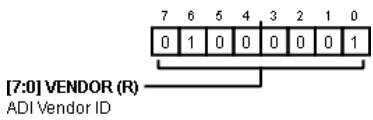

表 17. VENDOR\_ID 的位描述

| 位 | 位名称 | 设置 | 描述 | 复位值 | 访问 |
| --- | --- | --- | --- | --- | --- |
| [7:0] | VENDOR | 不适用 | ADI 供应商 ID | 0x41 | R |

## 器件 ID 1 寄存器

地址: 0x01, 复位值: 0x71, 名称: DEVICE\_ID1

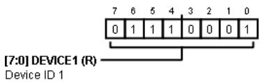

表 18. DEVICE\_ID1 的位描述

| 位 | 位名称 | 设置 | 描述 | 复位值 | 访问 |
| --- | --- | --- | --- | --- | --- |
| [7:0] | DEVICE1 | 不适用 | 器件 ID 1 | 0x71 | R |

## 器件 ID 2 寄存器

地址: 0x02, 复位值: 0x18, 名称: DEVICE\_ID2

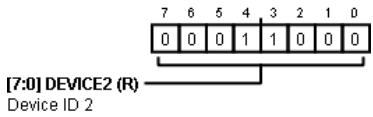

表 19. DEVICE\_ID2 的位描述

| 位 | 位名称 | 设置 | 描述 | 复位值 | 访问 |
| --- | --- | --- | --- | --- | --- |
| [7:0] | DEVICE2 | 不适用 | 器件 ID 2 | 0x18 | R |

## 版本代码寄存器

地址: 0x03, 复位值: 0x00, 名称: REVISION\_ID

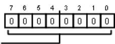

[7:0]REV (R) 版本 ID

表 20. REVISION\_ID 的位描述

| 位 | 位名称 | 设置 | 描述 | 复位值 | 访问 |
| --- | --- | --- | --- | --- | --- |
| [7:0] | REV | 不适用 | 版本 ID | 0x0 | R |

## 通道对和时钟使能寄存器

地址: 0x04, 复位值: 0x3F, 名称: ENABLES

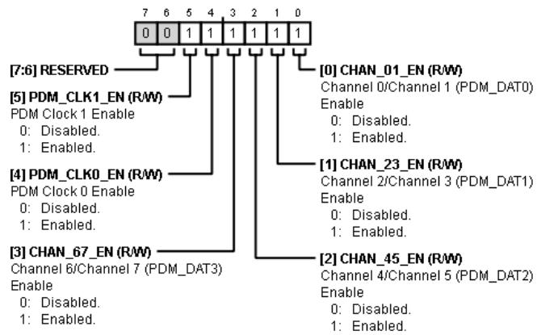

表 21. ENABLES 的位描述

| 位 | 位名称 | 设置 | 描述 | 复位值 | 访问 |
| --- | --- | --- | --- | --- | --- |
| [7:6] | 保留 |  | 保留。 | 0x0 | R |
| 5 | PDM_CLK1_EN | 01 | PDM 时钟 1 使能。禁用。使能。 | 0x1 | R/W |
| 4 | PDM_CLK0_EN | 01 | PDM 时钟 0 使能。禁用。使能。 | 0x1 | R/W |
| 3 | CHAN_67_EN | 01 | 通道 6/通道 7 (PDM_DAT3) 使能。禁用。使能。 | 0x1 | R/W |
| 2 | CHAN_45_EN | 01 | 通道 4/通道 5 (PDM_DAT2) 使能。禁用。使能。 | 0x1 | R/W |
| 1 | CHAN_23_EN | 01 | 通道 2/通道 3 (PDM_DAT1) 使能。禁用。使能。 | 0x1 | R/W |
| 0 | CHAN_01_EN | 01 | 通道 0/通道 1 (PDM_DAT0) 使能。禁用。使能。 | 0x1 | R/W |

## 抽取比和 PDM 时钟映射控制寄存器

地址: 0x05, 复位值: 0xC0, 名称: DEC\_RATIO\_CLK\_MAP

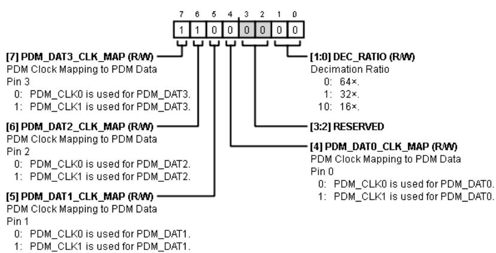

0: PDM_CLK0 用于 PDM_DAT1。1: PDM_CLK1 用于 PDM_DAT1。

表 22. DEC\_RATIO\_CLK\_MAP 的位描述

| 位 | 位名称 | 设置 | 描述 | 复位值 | 访问 |
| --- | --- | --- | --- | --- | --- |
| 7 | PDM_DAT3_CLK_MAP |  | PDM 时钟映射到 PDM 数据引脚 3。 | 0x1 | R/W |
| 7 | PDM_DAT3_CLK_MAP | 0 | PDM_CLK0 用于 PDM_DAT3。 | 0x1 | R/W |
| 7 | PDM_DAT3_CLK_MAP | 1 | PDM_CLK1 用于 PDM_DAT3。 | 0x1 | R/W |
| 6 | PDM_DAT2_CLK_MAP |  | PDM 时钟映射到 PDM 数据引脚 2。 | 0x1 | R/W |
| 6 | PDM_DAT2_CLK_MAP | 0 | PDM_CLK0 用于 PDM_DAT2。 | 0x1 | R/W |
| 6 | PDM_DAT2_CLK_MAP | 1 | PDM_CLK1 用于 PDM_DAT2。 | 0x1 | R/W |
| 5 | PDM_DAT1_CLK_MAP |  | PDM 时钟映射到 PDM 数据引脚 1。 | 0x0 | R/W |
| 5 | PDM_DAT1_CLK_MAP | 0 | PDM_CLK0 用于 PDM_DAT1。 | 0x0 | R/W |
| 5 | PDM_DAT1_CLK_MAP | 1 | PDM_CLK1 用于 PDM_DAT1。 | 0x0 | R/W |
| 4 | PDM_DAT0_CLK_MAP |  | PDM 时钟映射到 PDM 数据引脚 0。 | 0x0 | R/W |
| 4 | PDM_DAT0_CLK_MAP | 0 | PDM_CLK0 用于 PDM_DAT0。 | 0x0 | R/W |
| 4 | PDM_DAT0_CLK_MAP | 1 | PDM_CLK1 用于 PDM_DAT0。 | 0x0 | R/W |
| [3:2] | 保留 |  | 保留。 | 0x0 | R |
| [1:0] | DEC_RATIO |  | 抽取比。 | 0x0 | R/W |
| [1:0] | DEC_RATIO | 0 | 64×。 | 0x0 | R/W |
| [1:0] | DEC_RATIO | 1 | 32×。 | 0x0 | R/W |
| [1:0] | DEC_RATIO | 10 | 16×。 | 0x0 | R/W |

## 高通滤波器控制寄存器

地址: 0x06, 复位值: 0xD0, 名称: HPF\_CONTROL

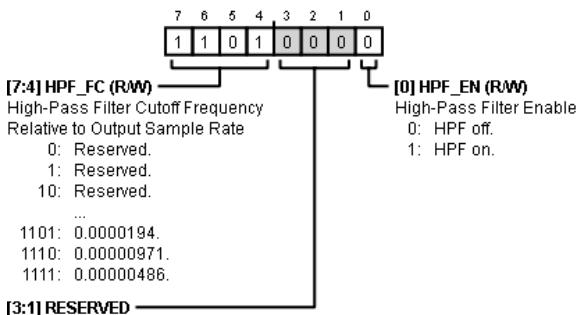

表 23. HPF\_CONTROL 的位描述

| 位 | 位名称 | 设置 | 描述 | 复位值 | 访问 |
| --- | --- | --- | --- | --- | --- |
| [7:4] | HPF_FC |  | 高通滤波器截止频率（相对于输出采样率）。 | 0xD | R/W |
| [7:4] | HPF_FC | 0 | 保留。 | 0xD | R/W |
| [7:4] | HPF_FC | 1 | 保留。 | 0xD | R/W |
| [7:4] | HPF_FC | 10 | 保留。 | 0xD | R/W |
| [7:4] | HPF_FC | 11 | 保留。 | 0xD | R/W |
| [7:4] | HPF_FC | 100 | 保留。 | 0xD | R/W |
| [7:4] | HPF_FC | 101 | 0.00505。 | 0xD | R/W |
| [7:4] | HPF_FC | 110 | 0.00251。 | 0xD | R/W |
| [7:4] | HPF_FC | 111 | 0.00125。 | 0xD | R/W |
| [7:4] | HPF_FC | 1000 | 0.000623。 | 0xD | R/W |
| [7:4] | HPF_FC | 1001 | 0.000311。 | 0xD | R/W |
| [7:4] | HPF_FC | 1010 | 0.000155。 | 0xD | R/W |
| [7:4] | HPF_FC | 1011 | 0.0000777。 | 0xD | R/W |
| [7:4] | HPF_FC | 1100 | 0.0000389。 | 0xD | R/W |
| [7:4] | HPF_FC | 1101 | 0.0000194。 | 0xD | R/W |
| [7:4] | HPF_FC | 1110 | 0.00000971。 | 0xD | R/W |
| [7:4] | HPF_FC | 1111 | 0.00000486。 | 0xD | R/W |
| [3:1] | 保留 |  | 保留。 | 0x0 | R |
| 0 | HPF_EN |  | 高通滤波器使能。 | 0x0 | R/W |
| 0 | HPF_EN | 0 | HPF 关闭。 | 0x0 | R/W |
| 0 | HPF_EN | 1 | HPF 开启。 | 0x0 | R/W |

## 串行端口控制 1 寄存器

地址: 0x07, 复位值: 0x41, 名称: SPT\_CTRL1

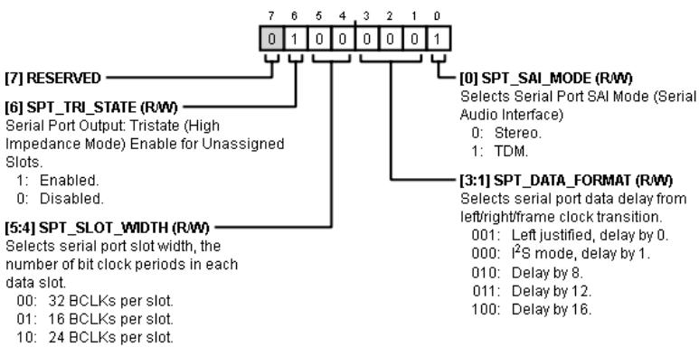  
表 24. SPT\_CTRL1 的位描述

| 位 | 位名称 | 设置 | 描述 | 复位值 | 访问 |
| --- | --- | --- | --- | --- | --- |
| 7 | 保留 |  | 保留。 | 0x0 | R |
| 6 | SPT_TRI_STATE | 10 | 串行端口输出：未分配时隙的三态（高阻抗模式）使能。使能。禁用。 | 0x1 | R/W |
| [5:4] | SPT_SLOT_WIDTH | 000110 | 选择串行端口时隙宽度，即每个数据时隙中的位时钟周期数。每时隙 32 个 BCLK。每时隙 16 个 BCLK。每时隙 24 个 BCLK。 | 0x0 | R/W |
| [3:1] | SPT_DATA_FORMAT | 001000010011100 | 选择串行端口数据相对于左/右/帧时钟跳变的延迟。左对齐，延迟为 0。$I^{2}S$ 模式，延迟为 1。延迟为 8。延迟为 12。延迟为 16。 | 0x0 | R/W |
| 0 | SPT_SAI_MODE | 01 | 选择串行端口 SAI 模式（串行音频接口）。立体声。TDM。 | 0x1 | R/W |

## 串行端口控制 2 寄存器

地址: 0x08, 复位值: 0x00, 名称: SPT\_CTRL2

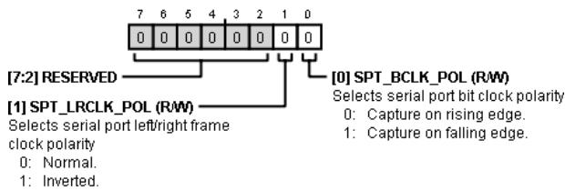

表 25. SPT\_CTRL2 的位描述

| 位 | 位名称 | 设置 | 描述 | 复位值 | 访问 |
| --- | --- | --- | --- | --- | --- |
| [7:2] | 保留 |  | 保留。 | 0x0 | R |
| 1 | SPT_LRCLK_POL | 0 | 选择串行端口左/右帧时钟极性。 | 0x0 | R/W |
| 1 | SPT_LRCLK_POL | 1 | 正常。反转。 | 0x0 | R/W |
| 0 | SPT_BCLK_POL | 0 | 选择串行端口位时钟极性。 | 0x0 | R/W |
| 0 | SPT_BCLK_POL | 1 | 上升沿捕获。 | 0x0 | R/W |
| 0 | SPT_BCLK_POL | 1 | 下降沿捕获。 | 0x0 | R/W |

## 串行端口路由和驱动使能通道 0 寄存器

地址: 0x09, 复位值: 0x01, 名称: SPT\_C0

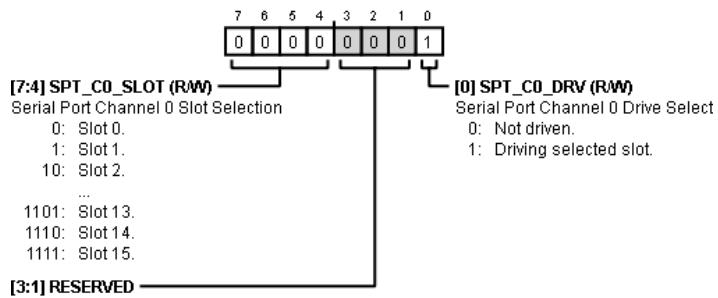

表 26. SPT\_C0 的位描述

| 位 | 位名称 | 设置 | 描述 | 复位值 | 访问 |
| --- | --- | --- | --- | --- | --- |
| [7:4] | SPT_C0_SLOT |  | 串行端口通道 0 时隙选择。 | 0x0 | R/W |
| [7:4] | SPT_C0_SLOT | 0 | 时隙 0。 | 0x0 | R/W |
| [7:4] | SPT_C0_SLOT | 1 | 时隙 1。 | 0x0 | R/W |
| [7:4] | SPT_C0_SLOT | 10 | 时隙 2。 | 0x0 | R/W |
| [7:4] | SPT_C0_SLOT | 11 | 时隙 3。 | 0x0 | R/W |
| [7:4] | SPT_C0_SLOT | 100 | 时隙 4。 | 0x0 | R/W |
| [7:4] | SPT_C0_SLOT | 101 | 时隙 5。 | 0x0 | R/W |
| [7:4] | SPT_C0_SLOT | 110 | 时隙 6。 | 0x0 | R/W |
| [7:4] | SPT_C0_SLOT | 111 | 时隙 7。 | 0x0 | R/W |
| [7:4] | SPT_C0_SLOT | 1000 | 时隙 8。 | 0x0 | R/W |
| [7:4] | SPT_C0_SLOT | 1001 | 时隙 9。 | 0x0 | R/W |
| [7:4] | SPT_C0_SLOT | 1010 | 时隙 10。 | 0x0 | R/W |
| [7:4] | SPT_C0_SLOT | 1011 | 时隙 11。 | 0x0 | R/W |
| [7:4] | SPT_C0_SLOT | 1100 | 时隙 12。 | 0x0 | R/W |
| [7:4] | SPT_C0_SLOT | 1101 | 时隙 13。 | 0x0 | R/W |
| [7:4] | SPT_C0_SLOT | 1110 | 时隙 14。 | 0x0 | R/W |
| [7:4] | SPT_C0_SLOT | 1111 | 时隙 15。 | 0x0 | R/W |
| [3:1] | 保留 |  | 保留。 | 0x0 | R |
| 0 | SPT_C0_DRV |  | 串行端口通道 0 驱动选择。该位决定相关通道在其分配的时隙中是驱动输出还是在其分配的时隙期间处于高阻抗浮空状态。 | 0x1 | R/W |
| 0 | SPT_C0_DRV | 0 | 不驱动。 | 0x1 | R/W |
| 0 | SPT_C0_DRV | 1 | 驱动所选时隙。 | 0x1 | R/W |

## 串行端口路由和驱动使能通道 1 寄存器

地址: 0x0A, 复位值: 0x11, 名称: SPT\_C1

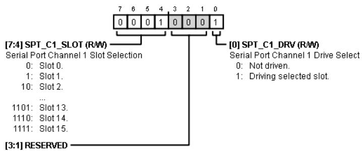

表 27. SPT\_C1 的位描述

| 位 | 位名称 | 设置 | 描述 | 复位值 | 访问 |
| --- | --- | --- | --- | --- | --- |
| [7:4] | SPT_C1_SLOT |  | 串行端口通道 1 时隙选择。 | 0x1 | R/W |
| [7:4] | SPT_C1_SLOT | 0 | 时隙 0。 | 0x1 | R/W |
| [7:4] | SPT_C1_SLOT | 1 | 时隙 1。 | 0x1 | R/W |
| [7:4] | SPT_C1_SLOT | 10 | 时隙 2。 | 0x1 | R/W |
| [7:4] | SPT_C1_SLOT | 11 | 时隙 3。 | 0x1 | R/W |
| [7:4] | SPT_C1_SLOT | 100 | 时隙 4。 | 0x1 | R/W |
| [7:4] | SPT_C1_SLOT | 101 | 时隙 5。 | 0x1 | R/W |
| [7:4] | SPT_C1_SLOT | 110 | 时隙 6。 | 0x1 | R/W |
| [7:4] | SPT_C1_SLOT | 111 | 时隙 7。 | 0x1 | R/W |
| [7:4] | SPT_C1_SLOT | 1000 | 时隙 8。 | 0x1 | R/W |
| [7:4] | SPT_C1_SLOT | 1001 | 时隙 9。 | 0x1 | R/W |
| [7:4] | SPT_C1_SLOT | 1010 | 时隙 10。 | 0x1 | R/W |
| [7:4] | SPT_C1_SLOT | 1011 | 时隙 11。 | 0x1 | R/W |
| [7:4] | SPT_C1_SLOT | 1100 | 时隙 12。 | 0x1 | R/W |
| [7:4] | SPT_C1_SLOT | 1101 | 时隙 13。 | 0x1 | R/W |
| [7:4] | SPT_C1_SLOT | 1110 | 时隙 14。 | 0x1 | R/W |
| [7:4] | SPT_C1_SLOT | 1111 | 时隙 15。 | 0x1 | R/W |
| [3:1] | 保留 |  | 保留。 | 0x0 | R |
| 0 | SPT_C1_DRV |  | 串行端口通道 1 驱动选择。该位决定相关通道在其分配的时隙中是驱动输出还是在其分配的时隙期间处于高阻抗浮空状态。 | 0x1 | R/W |
| 0 | SPT_C1_DRV | 0 | 不驱动。 | 0x1 | R/W |
| 0 | SPT_C1_DRV | 1 | 驱动所选时隙。 | 0x1 | R/W |

## 串行端口路由和驱动使能通道 2 寄存器

地址: 0x0B, 复位值: 0x21, 名称: SPT\_C2

表 28. SPT\_C2 的位描述

| 位 | 位名称 | 设置 | 描述 | 复位值 | 访问 |
| --- | --- | --- | --- | --- | --- |
| [7:4] | SPT_C2_SLOT |  | 串行端口通道 2 时隙选择。 | 0x2 | R/W |
| [7:4] | SPT_C2_SLOT | 0 | 时隙 0。 | 0x2 | R/W |
| [7:4] | SPT_C2_SLOT | 1 | 时隙 1。 | 0x2 | R/W |
| [7:4] | SPT_C2_SLOT | 10 | 时隙 2。 | 0x2 | R/W |
| [7:4] | SPT_C2_SLOT | 11 | 时隙 3。 | 0x2 | R/W |
| [7:4] | SPT_C2_SLOT | 100 | 时隙 4。 | 0x2 | R/W |
| [7:4] | SPT_C2_SLOT | 101 | 时隙 5。 | 0x2 | R/W |
| [7:4] | SPT_C2_SLOT | 110 | 时隙 6。 | 0x2 | R/W |
| [7:4] | SPT_C2_SLOT | 111 | 时隙 7。 | 0x2 | R/W |
| [7:4] | SPT_C2_SLOT | 1000 | 时隙 8。 | 0x2 | R/W |
| [7:4] | SPT_C2_SLOT | 1001 | 时隙 9。 | 0x2 | R/W |
| [7:4] | SPT_C2_SLOT | 1010 | 时隙 10。 | 0x2 | R/W |
| [7:4] | SPT_C2_SLOT | 1011 | 时隙 11。 | 0x2 | R/W |
| [7:4] | SPT_C2_SLOT | 1100 | 时隙 12。 | 0x2 | R/W |
| [7:4] | SPT_C2_SLOT | 1101 | 时隙 13。 | 0x2 | R/W |
| [7:4] | SPT_C2_SLOT | 1110 | 时隙 14。 | 0x2 | R/W |
| [7:4] | SPT_C2_SLOT | 1111 | 时隙 15。 | 0x2 | R/W |
| [3:1] | 保留 |  | 保留。 | 0x0 | R |
| 0 | SPT_C2_DRV |  | 串行端口通道 2 驱动选择。该位决定相关通道在其分配的时隙中是驱动输出还是在其分配的时隙期间处于高阻抗浮空状态。 | 0x1 | R/W |
| 0 | SPT_C2_DRV | 0 | 不驱动。 | 0x1 | R/W |
| 0 | SPT_C2_DRV | 1 | 驱动所选时隙。 | 0x1 | R/W |

## 串行端口路由和驱动使能通道 3 寄存器

地址: 0x0C, 复位值: 0x31, 名称: SPT\_C3

表 29. SPT\_C3 的位描述

| 位 | 位名称 | 设置 | 描述 | 复位值 | 访问 |
| --- | --- | --- | --- | --- | --- |
| [7:4] | SPT_C3_SLOT |  | 串行端口通道 3 时隙选择。 | 0x3 | R/W |
| [7:4] | SPT_C3_SLOT | 0 | 时隙 0。 | 0x3 | R/W |
| [7:4] | SPT_C3_SLOT | 1 | 时隙 1。 | 0x3 | R/W |
| [7:4] | SPT_C3_SLOT | 10 | 时隙 2。 | 0x3 | R/W |
| [7:4] | SPT_C3_SLOT | 11 | 时隙 3。 | 0x3 | R/W |
| [7:4] | SPT_C3_SLOT | 100 | 时隙 4。 | 0x3 | R/W |
| [7:4] | SPT_C3_SLOT | 101 | 时隙 5。 | 0x3 | R/W |
| [7:4] | SPT_C3_SLOT | 110 | 时隙 6。 | 0x3 | R/W |
| [7:4] | SPT_C3_SLOT | 111 | 时隙 7。 | 0x3 | R/W |
| [7:4] | SPT_C3_SLOT | 1000 | 时隙 8。 | 0x3 | R/W |
| [7:4] | SPT_C3_SLOT | 1001 | 时隙 9。 | 0x3 | R/W |
| [7:4] | SPT_C3_SLOT | 1010 | 时隙 10。 | 0x3 | R/W |
| [7:4] | SPT_C3_SLOT | 1011 | 时隙 11。 | 0x3 | R/W |
| [7:4] | SPT_C3_SLOT | 1100 | 时隙 12。 | 0x3 | R/W |
| [7:4] | SPT_C3_SLOT | 1101 | 时隙 13。 | 0x3 | R/W |
| [7:4] | SPT_C3_SLOT | 1110 | 时隙 14。 | 0x3 | R/W |
| [7:4] | SPT_C3_SLOT | 1111 | 时隙 15。 | 0x3 | R/W |
| [3:1] | 保留 |  | 保留。 | 0x0 | R |
| 0 | SPT_C3_DRV |  | 串行端口通道 3 驱动选择。该位决定相关通道在其分配的时隙中是驱动输出还是在其分配的时隙期间处于高阻抗浮空状态。 | 0x1 | R/W |
| 0 | SPT_C3_DRV | 0 | 不驱动。 | 0x1 | R/W |
| 0 | SPT_C3_DRV | 1 | 驱动所选时隙。 | 0x1 | R/W |

## 串行端口路由和驱动使能通道 4 寄存器

地址: 0x0D, 复位值: 0x41, 名称: SPT\_C4

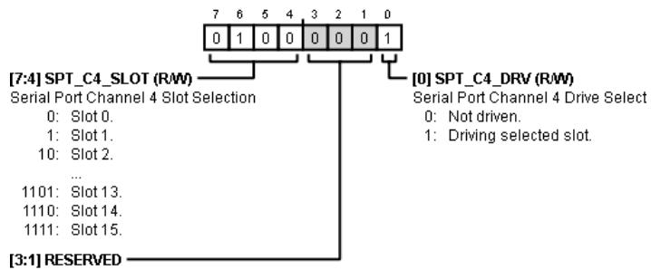

表 30. SPT\_C4 的位描述

| 位 | 位名称 | 设置 | 描述 | 复位值 | 访问 |
| --- | --- | --- | --- | --- | --- |
| [7:4] | SPT_C4_SLOT |  | 串行端口通道 4 时隙选择。 | 0x4 | R/W |
| [7:4] | SPT_C4_SLOT | 0 | 时隙 0。 | 0x4 | R/W |
| [7:4] | SPT_C4_SLOT | 1 | 时隙 1。 | 0x4 | R/W |
| [7:4] | SPT_C4_SLOT | 10 | 时隙 2。 | 0x4 | R/W |
| [7:4] | SPT_C4_SLOT | 11 | 时隙 3。 | 0x4 | R/W |
| [7:4] | SPT_C4_SLOT | 100 | 时隙 4。 | 0x4 | R/W |
| [7:4] | SPT_C4_SLOT | 101 | 时隙 5。 | 0x4 | R/W |
| [7:4] | SPT_C4_SLOT | 110 | 时隙 6。 | 0x4 | R/W |
| [7:4] | SPT_C4_SLOT | 111 | 时隙 7。 | 0x4 | R/W |
| [7:4] | SPT_C4_SLOT | 1000 | 时隙 8。 | 0x4 | R/W |
| [7:4] | SPT_C4_SLOT | 1001 | 时隙 9。 | 0x4 | R/W |
| [7:4] | SPT_C4_SLOT | 1010 | 时隙 10。 | 0x4 | R/W |
| [7:4] | SPT_C4_SLOT | 1011 | 时隙 11。 | 0x4 | R/W |
| [7:4] | SPT_C4_SLOT | 1100 | 时隙 12。 | 0x4 | R/W |
| [7:4] | SPT_C4_SLOT | 1101 | 时隙 13。 | 0x4 | R/W |
| [7:4] | SPT_C4_SLOT | 1110 | 时隙 14。 | 0x4 | R/W |
| [7:4] | SPT_C4_SLOT | 1111 | 时隙 15。 | 0x4 | R/W |
| [3:1] | 保留 |  | 保留。 | 0x0 | R |
| 0 | SPT_C4_DRV |  | 串行端口通道 4 驱动选择。该位决定相关通道在其分配的时隙中是驱动输出还是在其分配的时隙期间处于高阻抗浮空状态。 | 0x1 | R/W |
| 0 | SPT_C4_DRV | 0 | 不驱动。 | 0x1 | R/W |
| 0 | SPT_C4_DRV | 1 | 驱动所选时隙。 | 0x1 | R/W |

## 串行端口路由和驱动使能通道 5 寄存器

地址: 0x0E, 复位值: 0x51, 名称: SPT\_C5

表 31. SPT\_C5 的位描述

| 位 | 位名称 | 设置 | 描述 | 复位值 | 访问 |
| --- | --- | --- | --- | --- | --- |
| [7:4] | SPT_C5_SLOT |  | 串行端口通道 5 时隙选择。 | 0x5 | R/W |
| [7:4] | SPT_C5_SLOT | 0 | 时隙 0。 | 0x5 | R/W |
| [7:4] | SPT_C5_SLOT | 1 | 时隙 1。 | 0x5 | R/W |
| [7:4] | SPT_C5_SLOT | 10 | 时隙 2。 | 0x5 | R/W |
| [7:4] | SPT_C5_SLOT | 11 | 时隙 3。 | 0x5 | R/W |
| [7:4] | SPT_C5_SLOT | 100 | 时隙 4。 | 0x5 | R/W |
| [7:4] | SPT_C5_SLOT | 101 | 时隙 5。 | 0x5 | R/W |
| [7:4] | SPT_C5_SLOT | 110 | 时隙 6。 | 0x5 | R/W |
| [7:4] | SPT_C5_SLOT | 111 | 时隙 7。 | 0x5 | R/W |
| [7:4] | SPT_C5_SLOT | 1000 | 时隙 8。 | 0x5 | R/W |
| [7:4] | SPT_C5_SLOT | 1001 | 时隙 9。 | 0x5 | R/W |
| [7:4] | SPT_C5_SLOT | 1010 | 时隙 10。 | 0x5 | R/W |
| [7:4] | SPT_C5_SLOT | 1011 | 时隙 11。 | 0x5 | R/W |
| [7:4] | SPT_C5_SLOT | 1100 | 时隙 12。 | 0x5 | R/W |
| [7:4] | SPT_C5_SLOT | 1101 | 时隙 13。 | 0x5 | R/W |
| [7:4] | SPT_C5_SLOT | 1110 | 时隙 14。 | 0x5 | R/W |
| [7:4] | SPT_C5_SLOT | 1111 | 时隙 15。 | 0x5 | R/W |
| [3:1] | 保留 |  | 保留。 | 0x0 | R |
| 0 | SPT_C5_DRV |  | 串行端口通道 5 驱动选择。该位决定相关通道在其分配的时隙中是驱动输出还是在其分配的时隙期间处于高阻抗浮空状态。 | 0x1 | R/W |
| 0 | SPT_C5_DRV | 0 | 不驱动。 | 0x1 | R/W |
| 0 | SPT_C5_DRV | 1 | 驱动所选时隙。 | 0x1 | R/W |

## 串行端口路由和驱动使能通道 6 寄存器

地址: 0x0F, 复位值: 0x61, 名称: SPT\_C6

表 32. SPT\_C6 的位描述

| 位 | 位名称 | 设置 | 描述 | 复位值 | 访问 |
| --- | --- | --- | --- | --- | --- |
| [7:4] | SPT_C6_SLOT |  | 串行端口通道 6 时隙选择。 | 0x6 | R/W |
| [7:4] | SPT_C6_SLOT | 0 | 时隙 0。 | 0x6 | R/W |
| [7:4] | SPT_C6_SLOT | 1 | 时隙 1。 | 0x6 | R/W |
| [7:4] | SPT_C6_SLOT | 10 | 时隙 2。 | 0x6 | R/W |
| [7:4] | SPT_C6_SLOT | 11 | 时隙 3。 | 0x6 | R/W |
| [7:4] | SPT_C6_SLOT | 100 | 时隙 4。 | 0x6 | R/W |
| [7:4] | SPT_C6_SLOT | 101 | 时隙 5。 | 0x6 | R/W |
| [7:4] | SPT_C6_SLOT | 110 | 时隙 6。 | 0x6 | R/W |
| [7:4] | SPT_C6_SLOT | 111 | 时隙 7。 | 0x6 | R/W |
| [7:4] | SPT_C6_SLOT | 1000 | 时隙 8。 | 0x6 | R/W |
| [7:4] | SPT_C6_SLOT | 1001 | 时隙 9。 | 0x6 | R/W |
| [7:4] | SPT_C6_SLOT | 1010 | 时隙 10。 | 0x6 | R/W |
| [7:4] | SPT_C6_SLOT | 1011 | 时隙 11。 | 0x6 | R/W |
| [7:4] | SPT_C6_SLOT | 1100 | 时隙 12。 | 0x6 | R/W |
| [7:4] | SPT_C6_SLOT | 1101 | 时隙 13。 | 0x6 | R/W |
| [7:4] | SPT_C6_SLOT | 1110 | 时隙 14。 | 0x6 | R/W |
| [7:4] | SPT_C6_SLOT | 1111 | 时隙 15。 | 0x6 | R/W |
| [3:1] | 保留 |  | 保留。 | 0x0 | R |
| 0 | SPT_C6_DRV |  | 串行端口通道 6 驱动选择。该位决定相关通道在其分配的时隙中是驱动输出还是在其分配的时隙期间处于高阻抗浮空状态。 | 0x1 | R/W |
| 0 | SPT_C6_DRV | 0 | 不驱动。 | 0x1 | R/W |
| 0 | SPT_C6_DRV | 1 | 驱动所选时隙。 | 0x1 | R/W |

## 串行端口路由和驱动使能通道 7 寄存器

地址: 0x10, 复位值: 0x71, 名称: SPT\_C7

表 33. SPT\_C7 的位描述

| 位 | 位名称 | 设置 | 描述 | 复位值 | 访问 |
| --- | --- | --- | --- | --- | --- |
| [7:4] | SPT_C7_SLOT |  | 串行端口通道 7 时隙选择。 | 0x7 | R/W |
| [7:4] | SPT_C7_SLOT | 0 | 时隙 0。 | 0x7 | R/W |
| [7:4] | SPT_C7_SLOT | 1 | 时隙 1。 | 0x7 | R/W |
| [7:4] | SPT_C7_SLOT | 10 | 时隙 2。 | 0x7 | R/W |
| [7:4] | SPT_C7_SLOT | 11 | 时隙 3。 | 0x7 | R/W |
| [7:4] | SPT_C7_SLOT | 100 | 时隙 4。 | 0x7 | R/W |
| [7:4] | SPT_C7_SLOT | 101 | 时隙 5。 | 0x7 | R/W |
| [7:4] | SPT_C7_SLOT | 110 | 时隙 6。 | 0x7 | R/W |
| [7:4] | SPT_C7_SLOT | 111 | 时隙 7。 | 0x7 | R/W |
| [7:4] | SPT_C7_SLOT | 1000 | 时隙 8。 | 0x7 | R/W |
| [7:4] | SPT_C7_SLOT | 1001 | 时隙 9。 | 0x7 | R/W |
| [7:4] | SPT_C7_SLOT | 1010 | 时隙 10。 | 0x7 | R/W |
| [7:4] | SPT_C7_SLOT | 1011 | 时隙 11。 | 0x7 | R/W |
| [7:4] | SPT_C7_SLOT | 1100 | 时隙 12。 | 0x7 | R/W |
| [7:4] | SPT_C7_SLOT | 1101 | 时隙 13。 | 0x7 | R/W |
| [7:4] | SPT_C7_SLOT | 1110 | 时隙 14。 | 0x7 | R/W |
| [7:4] | SPT_C7_SLOT | 1111 | 时隙 15。 | 0x7 | R/W |
| [3:1] | 保留 |  | 保留。 | 0x0 | R |
| 0 | SPT_C7_DRV |  | 串行端口通道 7 驱动选择。该位决定相关通道在其分配的时隙中是驱动输出还是在其分配的时隙期间处于高阻抗浮空状态。 | 0x1 | R/W |
| 0 | SPT_C7_DRV | 0 | 不驱动。 | 0x1 | R/W |
| 0 | SPT_C7_DRV | 1 | 驱动所选时隙。 | 0x1 | R/W |

## 输出焊盘驱动强度控制寄存器

地址: 0x11, 复位值: 0x2A, 名称: DRIVE\_STRENGTH

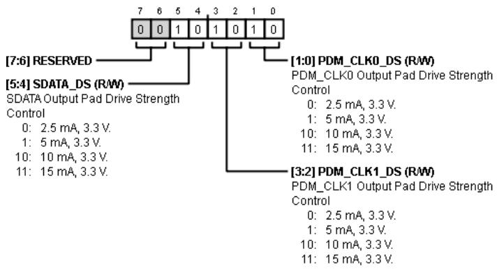

表 34. DRIVE\_STRENGTH 的位描述

| 位 | 位名称 | 设置 | 描述 | 复位值 | 访问 |
| --- | --- | --- | --- | --- | --- |
| [7:6] | 保留 |  | 保留。 | 0x0 | R |
| [5:4] | SDATA_DS |  | SDATA 输出焊盘驱动强度控制。 | 0x2 | R/W |
| [5:4] | SDATA_DS | 0 | 2.5 mA, 3.3 V。 | 0x2 | R/W |
| [5:4] | SDATA_DS | 1 | 5 mA, 3.3 V。 | 0x2 | R/W |
| [5:4] | SDATA_DS | 10 | 10 mA, 3.3 V。 | 0x2 | R/W |
| [5:4] | SDATA_DS | 11 | 15 mA, 3.3 V。 | 0x2 | R/W |
| [3:2] | PDM_CLK1_DS |  | PDM_CLK1 输出焊盘驱动强度控制。 | 0x2 | R/W |
| [3:2] | PDM_CLK1_DS | 0 | 2.5 mA, 3.3 V。 | 0x2 | R/W |
| [3:2] | PDM_CLK1_DS | 1 | 5 mA, 3.3 V。 | 0x2 | R/W |
| [3:2] | PDM_CLK1_DS | 10 | 10 mA, 3.3 V。 | 0x2 | R/W |
| [3:2] | PDM_CLK1_DS | 11 | 15 mA, 3.3 V。 | 0x2 | R/W |
| [1:0] | PDM_CLK0_DS |  | PDM_CLK0 输出焊盘驱动强度控制。 | 0x2 | R/W |
| [1:0] | PDM_CLK0_DS | 0 | 2.5 mA, 3.3 V。 | 0x2 | R/W |
| [1:0] | PDM_CLK0_DS | 1 | 5 mA, 3.3 V。 | 0x2 | R/W |
| [1:0] | PDM_CLK0_DS | 10 | 10 mA, 3.3 V。 | 0x2 | R/W |
| [1:0] | PDM_CLK0_DS | 11 | 15 mA, 3.3 V。 | 0x2 | R/W |

## 软件复位寄存器

地址: 0x12, 复位值: 0x00, 名称: RESETS

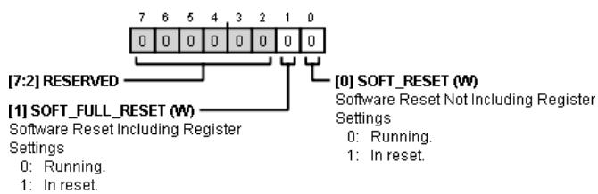

表 35. RESETS 的位描述

| 位 | 位名称 | 设置 | 描述 | 复位值 | 访问 |
| --- | --- | --- | --- | --- | --- |
| [7:2] | 保留 |  | 保留。 | 0x0 | R |
| 1 | SOFT_FULL_RESET | 01 | 软件复位，包括寄存器设置。运行中。复位中。 | 0x0 | W |
| 0 | SOFT_RESET | 01 | 软件复位，不包括寄存器设置。运行中。复位中。 | 0x0 | W |

## 外形尺寸

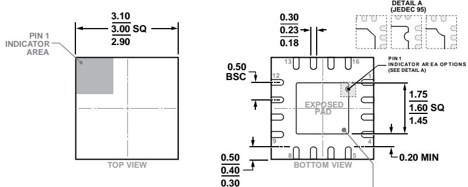

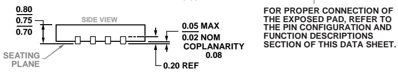

图 27. 16 引脚引线框架芯片级封装 [LFCSP]

3 mm × 3 mm 主体，0.75 mm 高度

(CP-16-22)

尺寸以毫米为单位

订购指南

| 型号1 | 温度范围 | 封装描述 | 标记代码 | 封装选项 |
| --- | --- | --- | --- | --- |
| ADAU7118ACPZRL | -40°C 至 +85°C | 16 引脚 LFCSP，13" 卷带包装 | Y70 | CP-16-22 |
| ADAU7118ACPZRL7 | -40°C 至 +85°C | 16 引脚 LFCSP，7" 卷带包装 | Y70 | CP-16-22 |
| EVAL-ADAU7118Z |  | 评估板 |  |  |

1 Z = 符合 RoHS 标准的器件。
