# PCMD3140 四通道、PDM 输入至 TDM 或 I<sup>2</sup>S 输出转换器


## 1 特性

• 4 通道 PDM 麦克风同步转换

• PDM 输入至 TDM 或 I2S 输出转换器性能：

– 127dB 动态范围 (DR)，带高性能 5 阶 PDM 输入

– 117dB 动态范围 (DR)，带高性能 4 阶 PDM 输入

• 通道相加模式，DR 性能，带高性能 4 阶 PDM 输入：

– 120dB，2 通道相加

• 可编程 PDM 时钟输出：

– 768kHz 至 6.144MHz

• 可编程输出采样率 (f<sub>S</sub>)：

– 8kHz 至 768kHz

• 可编程通道设置：

– 数字音量控制：–100dB 至 27dB

– 增益校准：0.1dB 分辨率

– 相位校准：163ns 分辨率

• 麦克风偏置或电源电压生成

• 话音激活检测 (VAD)

• 低延迟信号处理滤波器选择

• 可编程 HPF 和双二阶数字滤波器

• I<sup>2</sup>C 控制

• 集成高性能音频 PLL

• 自动时钟分频器设置配置

• 音频串行数据接口：

– 格式：TDM、I2S 或左平衡 (LJ)

– 字长：16 位、20 位、24 位或 32 位

– 主/从接口

德州仪器 Burr-Brown 音频

• 单电源运行：3.3V 或 1.8V

• I/O 电源运行：3.3V 或 1.8V

• 1.8V 电源电压下的功耗：– 16kHz 采样率下为 2.8mW/通道– 48kHz 采样率下为 3.6mW/通道

## 2 应用

• 可视门铃

• 智能扬声器

• 楼宇安全网关

• IP 网络摄像头

• GPS 个人导航设备

• 视频会议系统

## 3 说明

PCMD3140 是一款高性能脉冲密度调制 (PDM) 输入至时分多路复用 (TDM) 或 I2S 输出转换器，最多可支持对 PDM 麦克风输入的四个数字通道进行同步采样。该器件集成了可编程数字音量控制、麦克风偏置电压、锁相环 (PLL)、可编程高通滤波器 (HPF)、双二阶滤波器、低延迟滤波器模式，并可实现高达 768 kHz 的输出采样率。该器件支持时分多路复用 (TDM)、I<sup>2</sup>S 或左平衡 (LJ) 音频格式，并可通过 I2C 接口进行控制。此外，PCMD3140 还支持主从模式选择，从而实现音频总线接口操作。这些集成的高性能特性，以及采用3.3V 或 1.8V 单电源供电的功能，使该器件非常适用于远场麦克风录音应用中空间受限的音频系统。

PCMD3140 的额定工作温度范围为 –40°C 至+125°C，并且采用 20 引脚 WQFN 封装。

器件信息<sup>(1)</sup>


| 器件型号 | 封装 | 封装尺寸(标称值) |
| --- | --- | --- |
| PCMD3140 | WQFN (20) | 3.00mm × 3.00mm,间距为0.5mm |


(1) 如需了解所有可用封装，请参阅数据表末尾的封装选项附录。

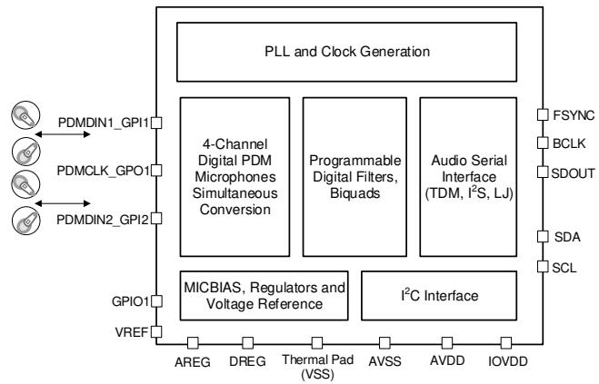  
简化版方框图

## 目录

1 特性.... 1
2 应用.... 1
3 说明.... 1
4 修订历史记录.... 2
5 引脚配置和功能.... 3
6 规格.... 4
6.1 绝对最大额定值.... 4
6.2 ESD 等级.... 4
6.3 建议运行条件.... 5
6.4 热性能信息.... 5
6.5 电气特性.... 5
6.6 时序要求：I²C 接口.... 8
6.7 开关特性：I²C 接口.... 9
6.8 时序要求：TDM、I²S 或 LJ 接口.... 9
6.9 开关特性：TDM、I²S 或 LJ 接口.... 9
6.10 时序要求：PDM 数字麦克风接口.... 10
6.11 开关特性：PDM 数字麦克风接口.... 10
6.12 时序图.... 10
6.13 典型特性.... 12
7 详细说明.... 15

7.1 概述....15  
7.2 功能方框图....16  
7.3 特性描述....16  
7.4 器件功能模式....50  
7.5 编程....51  
7.6 寄存器映射....54  
8 应用与实现....93  
8.1 应用信息....93  
8.2 典型应用....93  
8.3 注意事项....96  
9 电源供电建议....97  
10 布局....98  
10.1 布局指南....98  
10.2 布局示例....98  
11 器件和文档支持....99  
11.1 文档支持....99  
11.2 接收文档更新通知....99  
11.3 支持资源....99  
11.4 商标....99  
11.5 静电放电警告....99  
11.6 术语表....99  
12 机械、封装和可订购信息....99

## 4 修订历史记录

注：以前版本的页码可能与当前版本的页码不同

从版本 *（2020 年 12 月）到版本 A（2021 年 6 月）的更改 页码
• 将文档状态从预告信息更改为量产数据....1

## 5 引脚配置和功能

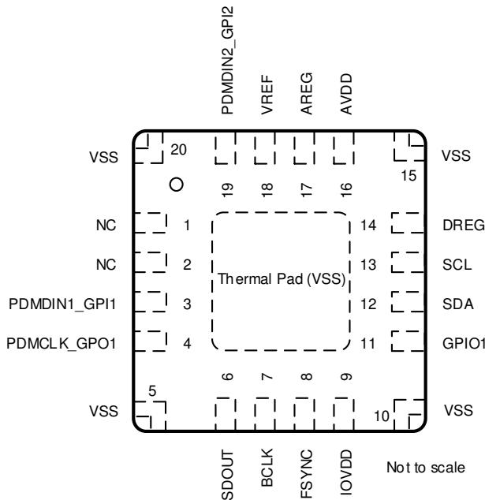  
图 5-1. RTE 封装，20 引脚 WQFN（带外露散热焊盘），顶视图

表 5-1. 引脚功能


| 引脚 |  | 类型 | 说明 |
| --- | --- | --- | --- |
| 编号 | 名称 | 类型 | 说明 |
| 1 | NC | 无连接 | 无连接 |
| 2 | NC | 无连接 | 无连接 |
| 3 | PDMDIN1_GPI1 | 数字输入 | 数字输入 1（多功能用途，如数字麦克风数据、PLL 输入时钟源等）。 |
| 4 | PDMCLK_GPO1 | 数字输出 | 通用数字输出 1（多功能用途，如数字麦克风时钟、中断等）。 |
| 5 | VSS | 接地电源 | 器件地，内部短接至散热焊盘。将此封装角引脚直接短接到电路板接地平面。有关角引脚尺寸，请参阅本文档末尾的封装图纸。 |
| 6 | SDOUT | 数字输出 | 音频串行数据接口总线输出。 |
| 7 | BCLK | 数字 I/O | 音频串行数据接口总线位时钟。 |
| 8 | FSYNC | 数字 I/O | 音频串行数据接口总线帧同步信号。 |
| 9 | IOVDD | 数字电源 | 数字 I/O 电源（标称值 1.8V 或 3.3V）。 |
| 10 | VSS | 接地电源 | 器件地，内部短接至散热焊盘。将此封装角引脚直接短接到电路板接地平面。有关角引脚尺寸，请参阅本文档末尾的封装图纸。 |
| 11 | GPIO1 | 数字 I/O | 通用数字输入/输出 1（多功能用途，如数字麦克风时钟或数据、PLL 输入时钟源、中断等）。 |
| 12 | SDA | 数字 I/O | $I^2C$ 控制总线的数据引脚。 |
| 13 | SCL | 数字输入 | $I^2C$ 控制总线的时钟引脚。 |
| 14 | DREG | 数字电源 | 数字稳压器输出电压，用于数字内核电源（标称值 1.5V）。将一个 10μF 和一个 0.1μF 低 ESR 电容并联连接到器件地 (VSS)。 |
| 15 | VSS | 接地电源 | 器件地，内部短接至散热焊盘。将此封装角引脚直接短接到电路板接地平面。有关角引脚尺寸，请参阅本文档末尾的封装图纸。 |
| 16 | AVDD | 模拟电源 | 模拟电源（标称值 1.8V 或 3.3V）。 |
| 17 | AREG | 模拟电源 | 模拟片内稳压器输出电压，用于模拟电源（标称值 1.8V）或外部模拟电源（标称值 1.8V）。将一个 10μF 和一个 0.1μF 低 ESR 电容并联连接到模拟地 (AVSS)。 |
| 18 | VREF | 模拟 | 模拟参考电压滤波器输出。将一个 1μF 电容连接到模拟地 (AVSS)。 |
| 19 | PDMDIN2_GPI2 | 模拟输出/数字输入 | 数字输入 2。MICBIAS 输出或通用数字输入 2（多功能用途，如数字麦克风数据、MICBIAS、PLL 输入时钟源等）。如果用作 MICBIAS 输出，则将 1μF 电容连接到模拟地 (AVSS)。 |
| 20 | VSS | 接地电源 | 器件地，内部短接至散热焊盘。将此封装角引脚直接短接到电路板接地平面。有关角引脚尺寸，请参阅本文档末尾的封装图纸。 |
| 散热焊盘 | 散热焊盘 (VSS) | 接地电源 | 散热焊盘短接到内部器件地。将散热焊盘直接短接到电路板接地平面。 |


## 6 规格

## 6.1 绝对最大额定值

在工作环境温度范围内（除非另有说明）<sup>(1)</sup>


|  |  | MIN | MAX | 单位 |
| --- | --- | --- | --- | --- |
| 电源电压 | AVDD to AVSS | -0.3 | 3.9 | V |
| 电源电压 | AREG to AVSS | -0.3 | 2.0 | V |
| 电源电压 | IOVDD to VSS (thermal pad) | -0.3 | 3.9 | V |
| 接地电压差 | AVSS to VSS (thermal pad) | -0.3 | 0.3 | V |
| 数字输入电压 | Digital input except PDMDINx_GPIx pins voltage to VSS (thermal pad) | -0.3 | IOVDD + 0.3 | V |
| 数字输入电压 | Digital input PDMDINx_GPIx pins voltage to VSS (thermal pad) | -0.3 | AVDD + 0.3 | V |
| 温度 | 工作环境温度,  $T_A$ | -40 | 125 | °C |
| 温度 | 结温,  $T_J$ | -40 | 150 | °C |
| 温度 | 存储温度,  $T_{stg}$ | -65 | 150 | °C |


(1) 超出绝对最大额定值所列值的应力可能会对器件造成永久性损坏。这些仅为应力额定值，并不意味着器件在这些条件下或超出建议运行条件所指明的任何其他条件下能够正常工作。长时间处于绝对最大额定值条件下可能会影响器件的可靠性。

## 6.2 ESD 等级


|  |  |  | 数值 | 单位 |
| --- | --- | --- | --- | --- |
| $V_{(ESD)}$ | 静电放电 | 人体放电模型 (HBM)，符合 ANSI/ESDA/JEDEC JS-001 $^{(1)}$ | ±2000 | V |
| $V_{(ESD)}$ | 静电放电 | 充电器件模型 (CDM)，符合 JEDEC 规范 JESD22-C101 $^{(2)}$ | ±500 | V |


(1) JEDEC 文件 JEP155 规定，500V HBM 可在标准 ESD 控制流程下实现安全制造。(2) JEDEC 文件 JEP157 规定，250V CDM 可在标准 ESD 控制流程下实现安全制造。

## 6.3 建议运行条件


|  |  | MIN | NOM | MAX | 单位 |
| --- | --- | --- | --- | --- | --- |
| 电源 |  |  |  |  |  |
| $AVDD, \text{AREG}^{(1)}$ | 模拟电源电压 AVDD 至 AVSS（AREG 使用片内稳压器生成）- AVDD 3.3V 操作 | 3.0 | 3.3 | 3.6 | V |
| $AVDD, \text{AREG}^{(1)}$ | 模拟电源电压 AVDD 和 AREG 至 AVSS（AREG 内部稳压器关闭）- AVDD 1.8V 操作 | 1.7 | 1.8 | 1.9 | V |
| IOVDD | IO 电源电压至 VSS（散热焊盘）- IOVDD 3.3V 操作 | 3.0 | 3.3 | 3.6 | V |
| IOVDD | IO 电源电压至 VSS（散热焊盘）- IOVDD 1.8V 操作 | 1.65 | 1.8 | 1.95 | V |
| 输入 |  |  |  |  |  |
|  | 除 PDMDIN1_GPI1 和 PDMDIN2_GPI2 引脚外的数字输入电压至 VSS（散热焊盘） | 0 |  | IOVDD | V |
|  | 数字输入 PDMDIN1_GPI1 和 PDMDIN2_GPI2 引脚电压至 VSS（散热焊盘） | 0 |  | AVDD | V |
| 温度 |  |  |  |  |  |
| $T_A$ | 工作环境温度 temperature | -40 |  | 125 | °C |
| 其他 |  |  |  |  |  |
|  | GPIOx 或 GPIx（用作 MCLK 输入）时钟频率 |  |  | 36.864 | MHz |
| $C_b$ | SCL and SDA bus capacitance for  $I^2C$  interface supports standard-mode and fast-mode |  |  | 400 | pF |
| $C_b$ | SCL and SDA bus capacitance for  $I^2C$  interface supports fast-mode plus |  |  | 550 | pF |
| $C_L$ | 数字输出负载电容 |  | 20 | 50 | pF |


(1) AVSS 和 VSS（散热焊盘）：所有接地引脚必须连接在一起，电压差不得超过 0.2V。

## 6.4 热性能信息


| 热性能指标(1) |  | PCMD3140 | 单位 |
| --- | --- | --- | --- |
| 热性能指标(1) | 热性能指标(1) | RTW (WQFN) | 单位 |
| 热性能指标(1) | 热性能指标(1) | 24 引脚 | 单位 |
| $R_{\theta JA}$ | 结至环境热阻 | 55.9 | °C/W |
| $R_{\theta JC(top)}$ | 结至外壳（顶部）热阻 | 33.1 | °C/W |
| $R_{\theta JB}$ | 结至电路板热阻 | 23.4 | °C/W |
| $\psi_{JT}$ | 结至顶部特性参数 | 0.6 | °C/W |
| $\psi_{JB}$ | 结至电路板特性参数 | 23.3 | °C/W |
| $R_{\theta JC(bot)}$ | 结至外壳（底部）热阻 | 16.7 | °C/W |


(1) 有关传统和新型热性能指标的更多信息，请参阅《半导体和 IC 封装热性能指标》应用报告。

## 6.5 电气特性

at $\mathsf { T } _ { \mathsf { A } } = 2 5 ^ { \circ } \mathsf { C }$ , AVDD = 3.3 V, IOVDD = 3.3 V, f<sub>IN</sub> = 1-kHz 正弦信号, $\mathsf { f } _ { \mathsf { S } } = 4 8 \mathsf { k H z }$ $P \mathsf { D M C L K } \times = 6 4 \times \mathsf { f } _ { \mathsf { S } , }$ 32 位音频数据, ${ \sf B C L K } = 2 5 6 \times { \sf f } _ { \sf S } ,$ TDM 从模式，PLL 开启 （除非另有说明）


| 参数 |  | 测试条件 | MIN | TYP | MAX | 单位 |
| --- | --- | --- | --- | --- | --- | --- |
| PDM 输入转换性能 |  |  |  |  |  |  |
| SNR | 信噪比，A 加权(1) (2) (3) | 无信号，输入使用 5 阶 PDM 调制器生成 | 130 |  |  | dB |
| SNR | 信噪比，A 加权(1) (2) (3) | 无信号，输入使用 4 阶 PDM 调制器生成 | 118 |  |  | dB |
| DR | 动态范围，A 加权(2) (3) | -60dB 满量程信号输入，输入使用 5 阶 PDM 调制器生成 | 127 |  |  | dB |
| DR | 动态范围，A 加权(2) (3) | -60dB 满量程信号输入，输入使用 4 阶 PDM 调制器生成 | 116 |  |  | dB |
| 其他参数 |  |  |  |  |  |  |
|  | 数字音量控制范围 | 可编程 0.5dB 步长 | -100 |  | 27 | dB |


版权所有 © 2021 德州仪器公司

## 6.5 电气特性（续）

at $\mathsf { T } _ { \mathsf { A } } = 2 5 ^ { \circ } \mathsf { C }$ , AVDD = 3.3 V, IOVDD = 3.3 V, f<sub>IN</sub> = 1-kHz 正弦信号, $\boldsymbol { \mathfrak { f } } _ { \mathbb { S } } = 4 8$ kHz, PDMCLKx = 64 × f<sub>S,</sub> 32 位音频数据, ${ \sf B C L K } = 2 5 6 \times { \sf f } _ { \sf S } ,$ TDM 从模式，PLL 开启 （除非另有说明）


| 参数 |  | 测试条件 | MIN | TYP | MAX | 单位 |
| --- | --- | --- | --- | --- | --- | --- |
|  | 输出数据采样率 | Programmable | 7.35 |  | 768 | kHz |
|  | 输出数据采样字长 | Programmable | 16 |  | 32 | 位 |
|  | 数字高通滤波器截止频率 | 具有可编程系数的一阶 IIR 滤波器，-3dB 点（默认设置） |  | 12 |  | Hz |
| 麦克风偏置 |  |  |  |  |  |  |
|  | MICBIAS 噪声 | BW = 20 Hz to 20 kHz, A-weighted, 1- μ F capacitor between MICBIAS and AVSS |  | 2.1 |  | μVRMS |
|  | MICBIAS 电压 | MICBIAS 编程为 VREF，VREF 编程为 2.75V、2.5V 或 1.375V |  | VREF |  | V |
|  | MICBIAS 电压 | MICBIAS programmed to VREF × 1.096 and VREF programmed to either 2.75 V, 2.5 V, or 1.375 V |  | VREF × 1.096 |  | V |
|  | MICBIAS 电压 | 旁路至 AVDD，负载 5mA |  | AVDD - 0.2 |  | V |
|  | MICBIAS 电流驱动能力 |  |  |  | 5 | mA |
|  | MICBIAS 负载调整率 | MICBIAS programmed to either VREF or VREF × 1.096, measured up to max load |  | 0 | 0.6 | 1 |
|  | MICBIAS 过流保护阈值 |  |  | 6.1 |  | mA |
| 数字 I/O |  |  |  |  |  |  |
| $V_{IL}$ | 低电平数字输入逻辑电压阈值 | 除 PDMDIN1_GPI1、PDMDIN2_GPI2、SDA 和 SCL 外的所有数字引脚，IOVDD 1.8V 操作 |  | - 0.3 | 0.35 × IOVDD | V |
| $V_{IL}$ | 低电平数字输入逻辑电压阈值 | 除 PDMDIN1_GPI1、PDMDIN2_GPI2、SDA 和 SCL 外的所有数字引脚，IOVDD 3.3V 操作 |  | - 0.3 | 0.8 | V |
| $V_{IH}$ | 高电平数字输入逻辑电压阈值 | 除 PDMDIN1_GPI1、PDMDIN2_GPI2、SDA 和 SCL 外的所有数字引脚，IOVDD 1.8V 操作 |  | 0.65 × IOVDD | IOVDD + 0.3 | V |
| $V_{IH}$ | 高电平数字输入逻辑电压阈值 | 除 PDMDIN1_GPI1、PDMDIN2_GPI2、SDA 和 SCL 外的所有数字引脚，IOVDD 3.3V 操作 |  | 2 | IOVDD + 0.3 | V |
| $V_{OL}$ | 低电平数字输出电压 | 除 PDMCLK_GPO1、SDA 和 SCL 外的所有数字引脚,  $I_{OL}$ = - 2 mA, IOVDD 1.8-V operation |  |  | 0.45 | V |
| $V_{OL}$ | 低电平数字输出电压 | 除 PDMCLK_GPO1、SDA 和 SCL 外的所有数字引脚,  $I_{OL}$ = - 2 mA, IOVDD 3.3-V operation |  |  | 0.4 | V |
| $V_{OH}$ | 高电平数字输出电压 | 除 PDMCLK_GPO1、SDA 和 SCL 外的所有数字引脚,  $I_{OH}$ = 2 mA, IOVDD 1.8-V operation |  | IOVDD - 0.45 |  | V |
| $V_{OH}$ | 高电平数字输出电压 | 除 PDMCLK_GPO1、SDA 和 SCL 外的所有数字引脚,  $I_{OH}$ = 2 mA, IOVDD 3.3-V operation |  | 2.4 |  | V |
| $V_{IL(I2C)}$ | 低电平数字输入逻辑电压阈值 | SDA 和 SCL |  | - 0.5 | 0.3 × IOVDD | V |
| $V_{IH(I2C)}$ | 高电平数字输入逻辑电压阈值 | SDA 和 SCL |  | 0.7 × IOVDD | IOVDD + 0.5 | V |
| $V_{OL1(I2C)}$ | 低电平数字输出电压 | SDA,  $I_{OL(I2C)}$  = - 3 mA, IOVDD &gt; 2 V |  |  | 0.4 | V |
| $V_{OL2(I2C)}$ | 低电平数字输出电压 | SDA,  $I_{OL(I2C)}$  = - 2 mA, IOVDD ≤ 2 V |  |  | 0.2 × IOVDD | V |
| $I_{OL(I2C)}$ | Low-level digital output current | SDA,  $V_{OL(I2C)}$  = 0.4 V, standard-mode or fast-mode |  | 3 |  | mA |
| $I_{OL(I2C)}$ | Low-level digital output current | SDA,  $V_{OL(I2C)}$  = 0.4 V, fast-mode plus |  | 20 |  | mA |
| $I_{IH}$ | 数字输入的逻辑高电平漏电流 | 所有数字引脚 except PDMDIN1_GPI1, PDMDIN2_GPI2 pins, input = IOVDD |  | - 5 | 0.1 | 5 |
| $I_{IL}$ | 数字输入的逻辑低电平漏电流 | 所有数字引脚 except PDMDIN1_GPI1, PDMDIN2_GPI2 pins, input = 0 V |  | - 5 | 0.1 | 5 |
| $V_{IL(GPIx)}$ | 低电平数字输入逻辑电压阈值 | PDMDIN1_GPI1、PDMDIN2_GPI2 数字引脚，AVDD 1.8V 操作 |  | - 0.3 | 0.35 × AVDD | V |
| $V_{IL(GPIx)}$ | 低电平数字输入逻辑电压阈值 | PDMDIN1_GPI1、PDMDIN2_GPI2 数字引脚，AVDD 3.3V 操作 |  | - 0.3 | 0.8 | V |


## 6.5 电气特性（续）

at $\mathsf { T } _ { \mathsf { A } } = 2 5 ^ { \circ } \mathsf { C }$ , AVDD = 3.3 V, IOVDD = 3.3 V, f<sub>IN</sub> = 1-kHz 正弦信号, $\boldsymbol { \mathfrak { f } } _ { \mathbb { S } } = 4 8$ kHz, $P \mathsf { D M C L K } \times = 6 4 \times \mathsf { f } _ { \mathsf { S } , }$ 32 位音频数据, ${ \sf B C L K } = 2 5 6 \times { \sf f } _ { \sf S } ,$ TDM 从模式，PLL 开启 （除非另有说明）


| 参数 |  | 测试条件 | MIN | TYP | MAX | 单位 |
| --- | --- | --- | --- | --- | --- | --- |
| $V_{IH(GPIx)}$ | 高电平数字输入逻辑电压阈值 | PDMDIN1_GPI1、PDMDIN2_GPI2 数字引脚，AVDD 1.8V 操作 | 0.65 × AVDD |  | AVDD + 0.3 | V |
| $V_{IH(GPIx)}$ | 高电平数字输入逻辑电压阈值 | PDMDIN1_GPI1、PDMDIN2_GPI2 数字引脚，AVDD 3.3V 操作 | 2 |  | AVDD + 0.3 | V |
| $V_{OL(GPOx)}$ | 低电平数字输出电压 | PDMDIN1_GPI1, PDMDIN2_GPI2 digital pins,  $I_{OL}$ = - 2 mA, AVDD 1.8-V operation |  |  | 0.45 | V |
| $V_{OL(GPOx)}$ | 低电平数字输出电压 | PDMDIN1_GPI1, PDMDIN2_GPI2 digital pins,  $I_{OL}$  = - 2 mA, AVDD 3.3-V operation |  |  | 0.4 | V |
| $V_{OH(GPOx)}$ | 高电平数字输出电压 | PDMDIN1_GPI1, PDMDIN2_GPI2 digital pins,  $I_{OH}$ = 2 mA, AVDD 1.8-V operation | AVDD - 0.45 |  |  | V |
| $V_{OH(GPOx)}$ | 高电平数字输出电压 | PDMDIN1_GPI1, PDMDIN2_GPI2 digital pins,  $I_{OH}$ = 2 mA, AVDD 3.3-V operation | 2.4 |  |  | V |
| $I_{IH(GPIx)}$ | 数字输入的逻辑高电平漏电流 | PDMDIN1_GPI1、PDMDIN2_GPI2 数字引脚，输入 = AVDD | - 5 | 0.1 | 5 | μA |
| $I_{IL(GPIx)}$ | 数字输入的逻辑高电平漏电流 | PDMDIN1_GPI1、PDMDIN2_GPI2 数字引脚，输入 = 0V | - 5 | 0.1 | 5 | μA |
| $C_{IN}$ | 数字输入的输入电容 | 所有数字引脚 |  | 5 |  | pF |
| $R_{PD}$ | 数字 I/O 引脚断言时的下拉电阻 |  |  | 20 |  | kΩ |
| 典型电源电流消耗 |  |  |  |  |  |  |
| $I_{AVDD}$ | 睡眠模式（软件关断模式）下的电流消耗 | 所有外部时钟停止，AVDD = 3.3V |  | 5 |  | μA |
| $I_{AVDD}$ | 睡眠模式（软件关断模式）下的电流消耗 | 所有外部时钟停止，AVDD = 1.8V，外部 AREG 电源（AREG 短接至 AVDD） |  | 10 |  | μA |
| $I_{IOVDD}$ | 睡眠模式（软件关断模式）下的电流消耗 | 所有外部时钟停止，IOVDD = 3.3V |  | 0.5 |  | μA |
| $I_{IOVDD}$ | 睡眠模式（软件关断模式）下的电流消耗 | 所有外部时钟停止，IOVDD = 1.8V |  | 0.3 |  | μA |
| $I_{AVDD}$ | 4 通道 PDM 输入录音时的电流消耗 | AVDD = 3.3 V |  | 9.1 |  | mA |
| $I_{AVDD}$ | 4 通道 PDM 输入录音时的电流消耗 | AVDD = 1.8 V, external AREG supply (AREG shorted to AVDD) |  | 8.1 |  | mA |
| $I_{IOVDD}$ | 4 通道 PDM 输入录音时的电流消耗 | IOVDD = 3.3 V |  | 0.1 |  | mA |
| $I_{IOVDD}$ | 4 通道 PDM 输入录音时的电流消耗 | IOVDD = 1.8 V |  | 0.05 |  | mA |
| $I_{AVDD}$ | 4 通道 PDM 输入录音时的电流消耗,  $f_S$ = 16 kHz, PDMCLKx = 96 ×  $f_S$ , PLL off and BCLK = 384 ×  $f_S$ | AVDD = 3.3 V |  | 7.3 |  | mA |
| $I_{AVDD}$ | 4 通道 PDM 输入录音时的电流消耗,  $f_S$ = 16 kHz, PDMCLKx = 96 ×  $f_S$ , PLL off and BCLK = 384 ×  $f_S$ | AVDD = 1.8 V, external AREG supply (AREG shorted to AVDD) |  | 6.3 |  | mA |
| $I_{IOVDD}$ | 4 通道 PDM 输入录音时的电流消耗,  $f_S$ = 16 kHz, PDMCLKx = 96 ×  $f_S$ , PLL off and BCLK = 384 ×  $f_S$ | IOVDD = 3.3 V |  | 0.1 |  | mA |
| $I_{IOVDD}$ | 4 通道 PDM 输入录音时的电流消耗,  $f_S$ = 16 kHz, PDMCLKx = 96 ×  $f_S$ , PLL off and BCLK = 384 ×  $f_S$ | IOVDD = 1.8 V |  | 0.05 |  | mA |


(1) 使用音频分析仪在 20Hz 至 20kHz 带宽范围内以 A 加权测量的 1kHz 满量程正弦波输入时的输出电平与无信号时输出电平之比。  
(2) 所有性能测量均使用 20kHz 低通滤波器进行，并在注明时使用 A 加权滤波器。不使用此类滤波器可能导致 THD 高于电气特性中所示的值，而 SNR 和动态范围读数低于所示值。低通滤波器可消除带外噪声，这些噪声虽然听不见，但可能会影响动态规格值。  
(3) 器件的性能参数 SNR、DR 和 THD+N 主要受单位 PDM 调制器生成的数据输出限制。对于高于 -10dB 满量程的信号，单位 PDM 调制器输出本身的 THD+N 性能通常不太好。

## 6.6 时序要求：I<sup>2</sup>C 接口

at ${ \sf T } _ { \sf A } = 2 5 ^ { \circ } { \sf C } _ { \mathrm { ~ ~ } }$ , IOVDD = 3.3 V or 1.8 V （除非另有说明）; see Figure 6-1 时序图


|  |  | MIN | NOM | MAX | 单位 |
| --- | --- | --- | --- | --- | --- |
| 标准模式 |  |  |  |  |  |
| $f_{SCL}$ | SCL 时钟频率 | 0 |  | 100 | kHz |
| $t_{HD;STA}$ | 保持时间（重复）起始条件。在此时间后，生成第一个时钟脉冲。 | 4 |  |  | μs |
| $t_{LOW}$ | SCL 时钟的低电平周期 | 4.7 |  |  | μs |
| $t_{HIGH}$ | SCL 时钟的高电平周期 | 4 |  |  | μs |
| $t_{SU;STA}$ | 重复起始条件的建立时间 | 4.7 |  |  | μs |
| $t_{HD;DAT}$ | 数据保持时间 | 0 |  | 3.45 | μs |
| $t_{SU;DAT}$ | 数据建立时间 | 250 |  |  | ns |
| $t_r$ | SDA 和 SCL 上升时间 |  |  | 1000 | ns |
| $t_f$ | SDA 和 SCL 下降时间 |  |  | 300 | ns |
| $t_{SU;STO}$ | 停止条件的建立时间 | 4 |  |  | μs |
| $t_{BUF}$ | 停止和起始条件之间的总线空闲时间 | 4.7 |  |  | μs |
| 快速模式 |  |  |  |  |  |
| $f_{SCL}$ | SCL 时钟频率 | 0 |  | 400 | kHz |
| $t_{HD;STA}$ | 保持时间（重复）起始条件。在此时间后，生成第一个时钟脉冲。 | 0.6 |  |  | μs |
| $t_{LOW}$ | SCL 时钟的低电平周期 | 1.3 |  |  | μs |
| $t_{HIGH}$ | SCL 时钟的高电平周期 | 0.6 |  |  | μs |
| $t_{SU;STA}$ | 重复起始条件的建立时间 | 0.6 |  |  | μs |
| $t_{HD;DAT}$ | 数据保持时间 | 0 |  | 0.9 | μs |
| $t_{SU;DAT}$ | 数据建立时间 | 100 |  |  | ns |
| $t_r$ | SDA 和 SCL 上升时间 | 20 |  | 300 | ns |
| $t_f$ | SDA 和 SCL 下降时间 | 20 × (IOVDD / 5.5 V) |  | 300 | ns |
| $t_{SU;STO}$ | 停止条件的建立时间 | 0.6 |  |  | μs |
| $t_{BUF}$ | 停止和起始条件之间的总线空闲时间 | 1.3 |  |  | μs |
| 快速模式+ |  |  |  |  |  |
| $f_{SCL}$ | SCL 时钟频率 | 0 |  | 1000 | kHz |
| $t_{HD;STA}$ | 保持时间（重复）起始条件。在此时间后，生成第一个时钟脉冲。 | 0.26 |  |  | μs |
| $t_{LOW}$ | SCL 时钟的低电平周期 | 0.5 |  |  | μs |
| $t_{HIGH}$ | SCL 时钟的高电平周期 | 0.26 |  |  | μs |
| $t_{SU;STA}$ | 重复起始条件的建立时间 | 0.26 |  |  | μs |
| $t_{HD;DAT}$ | 数据保持时间 | 0 |  |  | μs |
| $t_{SU;DAT}$ | 数据建立时间 | 50 |  |  | ns |
| $t_r$ | SDA 和 SCL 上升时间 |  |  | 120 | ns |
| $t_f$ | SDA 和 SCL 下降时间 | 20 × (IOVDD / 5.5 V) |  | 120 | ns |
| $t_{SU;STO}$ | 停止条件的建立时间 | 0.26 |  |  | μs |
| $t_{BUF}$ | 停止和起始条件之间的总线空闲时间 | 0.5 |  |  | μs |


## 6.7 开关特性：I<sup>2</sup>C 接口

at $\mathsf { T } _ { \mathsf { A } } = 2 5 ^ { \circ } \mathsf { C }$ , IOVDD = 3.3 V or 1.8 V （除非另有说明）; see Figure 6-1 时序图


| 参数 |  | 测试条件 | MIN | TYP | MAX | 单位 |
| --- | --- | --- | --- | --- | --- | --- |
| $t_{d(SDA)}$ | SCL 至 SDA 延迟 | 标准模式 | 250 |  | 1250 | ns |
| $t_{d(SDA)}$ | SCL 至 SDA 延迟 | 快速模式 | 250 |  | 850 | ns |
| $t_{d(SDA)}$ | SCL 至 SDA 延迟 | 快速模式 plus |  |  | 400 | ns |


## 6.8 时序要求：TDM、I<sup>2</sup>S 或 LJ 接口

at $\mathsf { T } _ { \mathsf { A } } = 2 5 ^ { \circ } \mathsf { C }$ , IOVDD = 3.3 V or 1.8 V and 20-pF load on all outputs （除非另有说明）; see Figure 6-2 时序图


|  |  |  | MIN | NOM | MAX | 单位 |
| --- | --- | --- | --- | --- | --- | --- |
| $t_{(BCLK)}$ | BCLK 周期 |  | 40 |  |  | ns |
| $t_{H(BCLK)}$ | BCLK 高脉冲持续时间 (1) |  | 25 |  |  | ns |
| $t_{L(BCLK)}$ | BCLK 低脉冲持续时间 (1) |  | 25 |  |  | ns |
| $t_{SU(FSYNC)}$ | FSYNC 建立时间 |  | 8 |  |  | ns |
| $t_{HLD(FSYNC)}$ | FSYNC 保持时间 |  | 8 |  |  | ns |
| $t_{r(BCLK)}$ | BCLK 上升时间 | 10% - 90% rise time(2) |  |  | 10 | ns |
| $t_{f(BCLK)}$ | BCLK 下降时间 | 90% - 10% fall time(2) |  |  | 10 | ns |


(1) 如果 SDOUT 数据线在器件用于传输 SDOUT 数据的相同 BCLK 沿极性上锁存，则 BCLK 最小高或低脉冲持续时间可放宽至 14ns（以满足时序规格）。

(2) 如果系统中使用的 BCLK 频率低于 20MHz，BCLK 最大上升和下降时间可放宽至 13ns。这可能会因较高的时钟抖动而导致噪声增加。

## 6.9 开关特性：TDM、I<sup>2</sup>S 或 LJ 接口

at ${ \sf T } _ { \sf A } = 2 5 ^ { \circ } { \sf C } ,$ , IOVDD = 3.3 V or 1.8 V and 20-pF load on all outputs （除非另有说明）; see Figure 6-2 时序图


| 参数 |  | 测试条件 | MIN | TYP | MAX | 单位 |
| --- | --- | --- | --- | --- | --- | --- |
| $t_{d(SDOUT-BCLK)}$ | BCLK 至 SDOUT 延迟 | 50% of BCLK to 50% of SDOUT | 3 |  | 18 | ns |
| $t_{d(SDOUT-FSYNC)}$ | TDM 或 LJ 模式下 FSYNC 至 SDOUT 延迟（对于 TX_OFFSET = 0 的 MSB 数据） | 50% of FSYNC to 50% of SDOUT |  |  | 18 | ns |
| $f_{(BCLK)}$ | BCLK 输出时钟频率：主模式 (1) |  |  |  | 24.576 | MHz |
| $t_{H(BCLK)}$ | BCLK 高脉冲持续时间: master mode |  | 14 |  |  | ns |
| $t_{L(BCLK)}$ | BCLK 低脉冲持续时间: master mode |  | 14 |  |  | ns |
| $t_{d(FSYNC)}$ | BCLK 至 FSYNC 延迟：主模式 | 50% of BCLK to 50% of FSYNC | 3 |  | 18 | ns |
| $t_{r(BCLK)}$ | BCLK 上升时间: master mode | 10% - 90% rise time |  |  | 8 | ns |
| $t_{f(BCLK)}$ | BCLK 下降时间: master mode | 90% - 10% fall time |  |  | 8 | ns |


(1) 如果 SDOUT 数据线在与器件用于传输 SDOUT 数据的 BCLK 沿极性相反的沿上锁存，则 BCLK 输出时钟频率必须低于 18.5MHz（以满足时序规格）。

## 6.10 时序要求：PDM 数字麦克风接口

at $\mathsf { T } _ { \mathsf { A } } = 2 5 ^ { \circ } \mathsf { C }$ , IOVDD = 3.3 V or 1.8 V and 20-pF load on all outputs （除非另有说明）; see Figure 6-3 时序图


|  |  | MIN | NOM | MAX | 单位 |
| --- | --- | --- | --- | --- | --- |
| $t_{SU(PDMDINx)}$ | PDMDINx 建立时间 | 30 |  |  | ns |
| $t_{HLD(PDMDINx)}$ | PDMDINx 保持时间 | 0 |  |  | ns |


## 6.11 开关特性：PDM 数字麦克风接口

at $\mathsf { T } _ { \mathsf { A } } = 2 5 ^ { \circ } \mathsf { C }$ , IOVDD = 3.3 V or 1.8 V and 20-pF load on all outputs （除非另有说明）; see Figure 6-3 for timing


| 参数 |  | 测试条件 | MIN | TYP | MAX | 单位 |
| --- | --- | --- | --- | --- | --- | --- |
| $f_{(PDMCLK)}$ | PDMCLK 时钟频率 |  | 0.768 |  | 6.144 | MHz |
| $t_{H(PDMCLK)}$ | PDMCLK 高脉冲持续时间 |  | 72 |  |  | ns |
| $t_{L(PDMCLK)}$ | PDMCLK 低脉冲持续时间 |  | 72 |  |  | ns |
| $t_{r(PDMCLK)}$ | PDMCLK 上升时间 | 10% - 90% rise time |  |  | 18 | ns |
| $t_{f(PDMCLK)}$ | PDMCLK 下降时间 | 90% - 10% fall time |  |  | 18 | ns |


6.12 时序图  
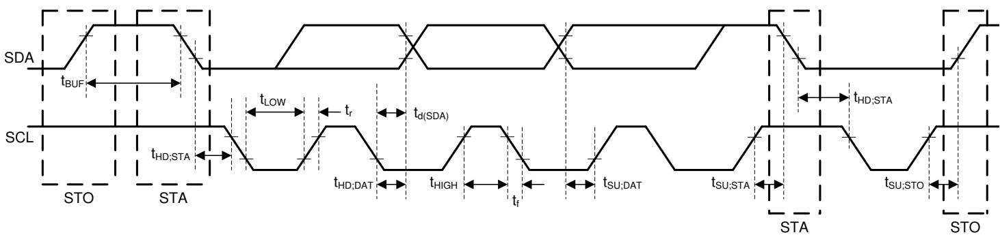  
图 6-1. I<sup>2</sup>C 接口时序图

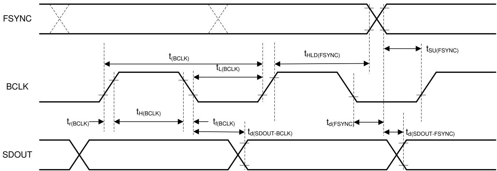  
图 6-2. TDM (With BCLK\_POL = 1), I<sup>2</sup>S, and LJ Interface Timing Diagram

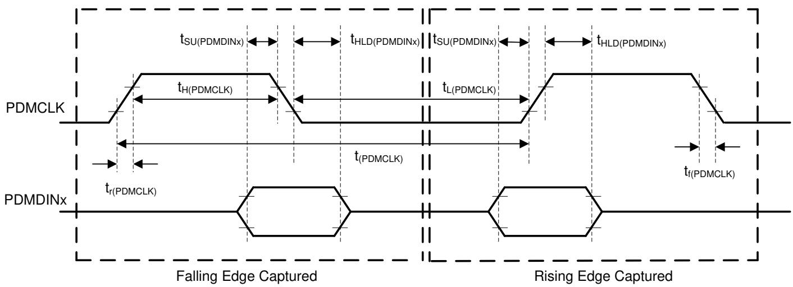  
图 6-3. PDM 数字麦克风接口时序图

## 6.13 典型特性

at $\mathsf { T } _ { \mathsf { A } } = 2 5 ^ { \circ } \mathsf { C } , \mathsf { A V D D } = 3 . 3 \mathsf { V } , \mathsf { I O V D D } = 3 . 3 \mathsf { V } , \mathsf { f } _ { \mathsf { I N } } = 1$ -kHz 正弦信号, $\boldsymbol { \mathfrak { f } } _ { \mathbb { S } } = 4 8$ kHz, $\mathsf { P D M C L K x } = 6 4 \times \mathsf { f } _ { \mathsf { S } } ,$ 32 位音频数据, $B C \lfloor K = 2 5 6 \times \mathsf { f } _ { \mathsf { S } } ,$ , TDM 从模式，PLL 开启，线性相位抽取滤波器 （除非另有说明）; 所有性能测量均使用 20kHz 低通滤波器和 A 加权滤波器进行 （除非另有说明）; 所有测量均通过使用 Audio Precision 向器件馈送 PDM 数字输入信号来完成

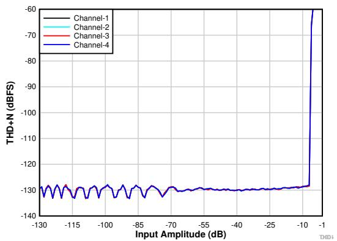  
5 阶 PDM 调制器，PDMCLKx = 3.072 MHz

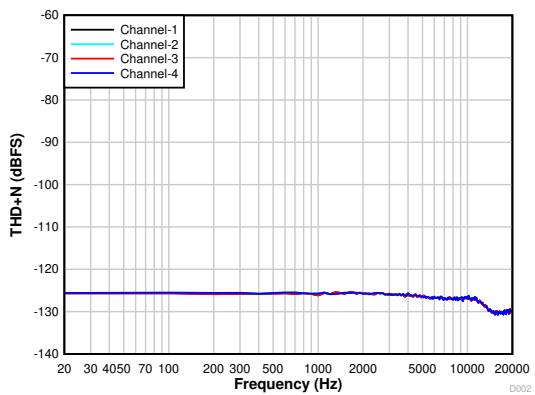  
5 阶 PDM 调制器，PDMCLKx = 3.072 MHz

图 6-4. THD+N vs Input Amplitude  
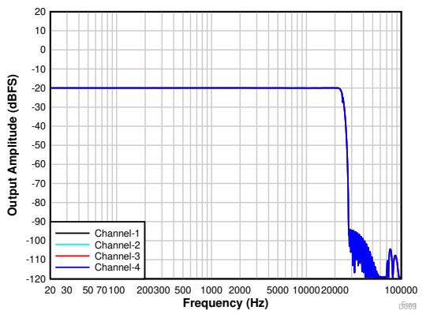  
5 阶 PDM 调制器，PDMCLKx = 3.072 MHz

图 6-5. THD+N vs Input Frequency With a –20-dBr Input  
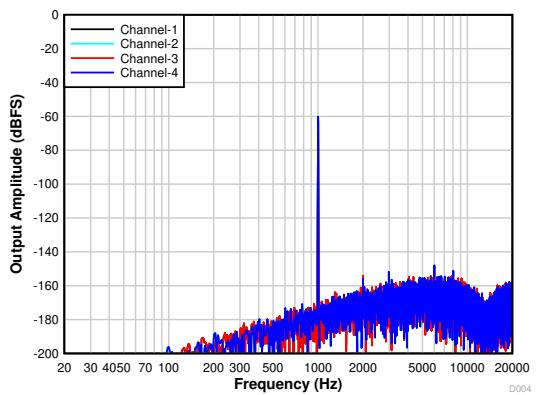  
5 阶 PDM 调制器，PDMCLKx = 3.072 MHz

图 6-6. Frequency Response With a –20-dBr Input  
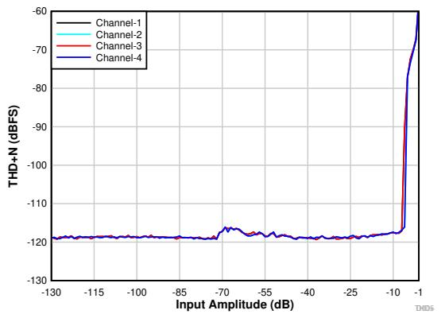  
4 阶 PDM 调制器，PDMCLKx = 3.072 MHz  
图 6-8. THD+N vs Input Amplitude

图 6-7. FFT With a –60-dBr Input  
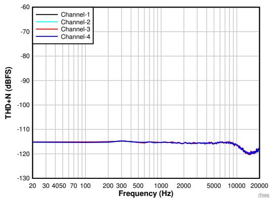  
4 阶 PDM 调制器，PDMCLKx = 3.072 MHz  
图 6-9. THD+N vs Input Frequency With a –20-dBr Input

## 6.13 典型特性（续）

at $\mathsf { T } _ { \mathsf { A } } = 2 5 ^ { \circ } \mathsf { C } , \mathsf { A V D D } = 3 . 3 \mathsf { V } , \mathsf { I O V D D } = 3 . 3 \mathsf { V } , \mathsf { f } _ { \mathsf { I N } } = 1$ -kHz 正弦信号, $\boldsymbol { \mathfrak { f } } _ { \mathbb { S } } = 4 8$ kHz, $\mathsf { P D M C L K x } = 6 4 \times \mathsf { f } _ { \mathsf { S } } ,$ 32 位音频数据, $B C \lfloor K = 2 5 6 \times \mathsf { f } _ { \mathsf { S } } ,$ , TDM 从模式，PLL 开启，线性相位抽取滤波器 （除非另有说明）; 所有性能测量均使用 20kHz 低通滤波器和 A 加权滤波器进行 （除非另有说明）; 所有测量均通过使用 Audio Precision 向器件馈送 PDM 数字输入信号来完成

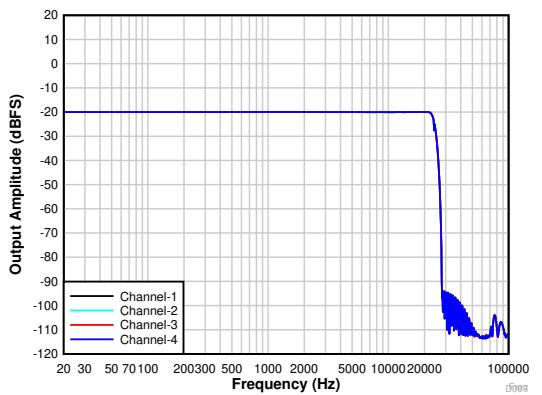  
4 阶 PDM 调制器，PDMCLKx = 3.072 MHz

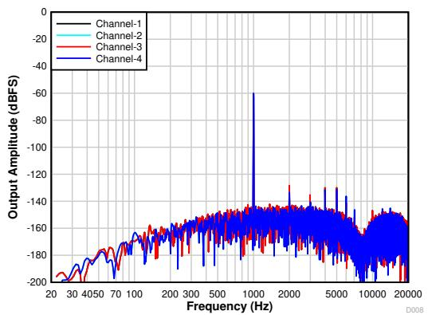  
4 阶 PDM 调制器，PDMCLKx = 3.072 MHz

图 6-10. Frequency Response With a –20-dBr Input  
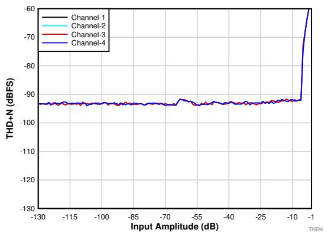  
4 阶 PDM 调制器，PDMCLKx = 1.536 MHz

图 6-11. FFT With a –60-dBr Input  
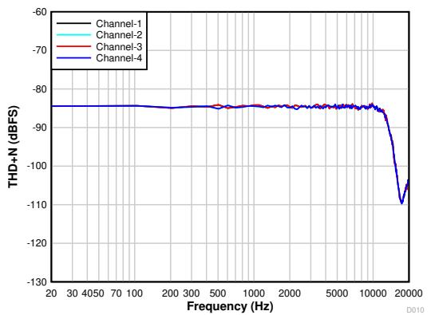  
4 阶 PDM 调制器，PDMCLKx = 1.536 MHz

图 6-12. THD+N vs Input Amplitude  
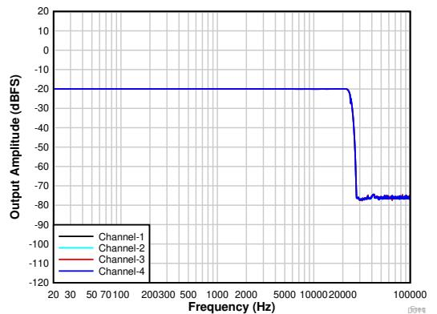  
4 阶 PDM 调制器，PDMCLKx = 1.536 MHz  
图 6-14. Frequency Response With a –20-dBr Input

图 6-13. THD+N vs Input Frequency With a –20-dBr Input  
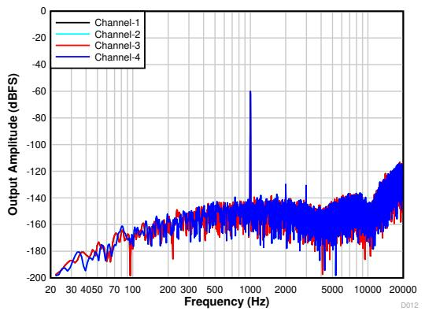  
4 阶 PDM 调制器，PDMCLKx = 1.536 MHz  
图 6-15. FFT With a –60-dBr Input

## 6.13 典型特性（续）

to $1 \dagger 7 _ { \mathsf { A } } = 2 5 ^ { \circ } \mathsf { C } , \mathsf { A V D D } = 3 . 3 \vee , \mathsf { I O V D D } = 3 . 3 \vee , \mathsf { f } _ { 1 \mathsf { N } } = 1 - \mathsf { k H z }$ 正弦信号, $\boldsymbol { \mathfrak { f } } _ { \mathbb { S } } = 4 8$ kHz, $P D M C L K x = 6 4 \times 9 s .$ 32 位音频数据, $B C \lfloor K = 2 5 6 \times \mathsf { f } _ { \mathsf { S } } ,$ , TDM 从模式，PLL 开启，线性相位抽取滤波器 （除非另有说明）; 所有性能测量均使用 20kHz 低通滤波器和 A 加权滤波器进行 （除非另有说明）; 所有测量均通过使用 Audio Precision 向器件馈送 PDM 数字输入信号来完成

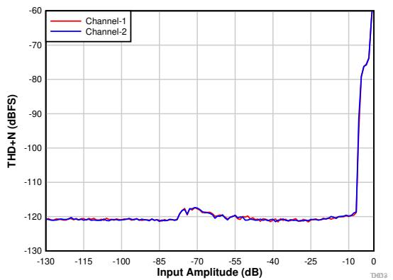  
4 阶 PDM 调制器，PDMCLKx = 6.144 MHz

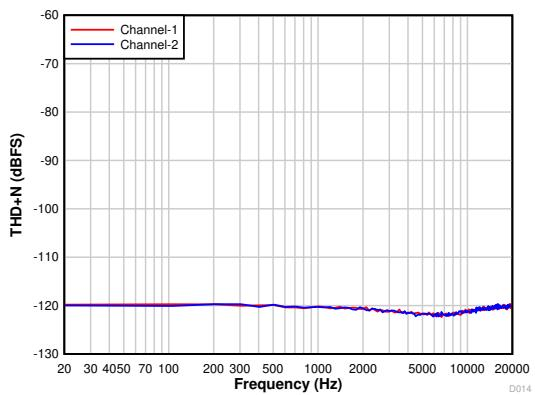

图 6-16. THD+N vs Input Amplitude  
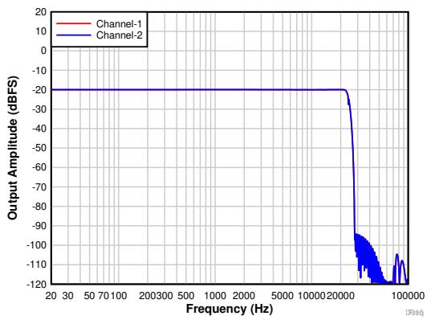  
4 阶 PDM 调制器，PDMCLKx = 6.144 MHz  
图 6-18. Frequency Response With a –20-dBr Input

4 阶 PDM 调制器，PDMCLKx = 6.144 MHz  
图 6-17. THD+N vs Input Frequency With a –20-dBr Input  
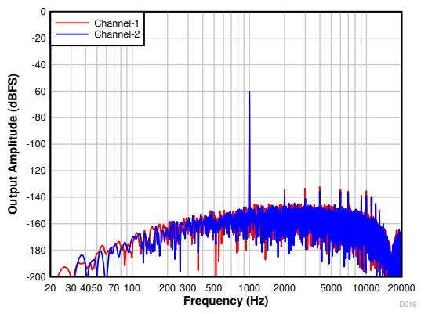  
图 6-19. FFT With a –60-dBr Input

## 7 详细说明

## 7.1 概述

PCMD3140 是一款高性能、低功耗、灵活的 4 通道脉冲密度调制 (PDM) 输入至时分多路复用 (TDM) 或 I<sup>2</sup>S 音频输出转换器，具有丰富的功能集成。该器件适用于语音激活系统、便携式计算、通信和娱乐应用。低功耗特性使该器件非常适合电池供电的便携式音频系统。该器件集成了多种功能，可降低空间受限、电池供电的消费类、家庭和工业应用中的成本、电路板空间和功耗。

PCMD3140 由以下功能模块组成：

• 四通道脉冲密度调制 (PDM) 数字麦克风接口，带高性能抽取滤波器

• 低噪声麦克风偏置输出，用于为数字麦克风供电

• 可编程抽取滤波器，支持线性相位或低延迟滤波器

• 可编程数字音量控制，每通道配备双二阶滤波器

• 每通道具有高分辨率的可编程相位和增益校准

• 可编程高通滤波器 (HPF) 和数字通道混频器

• 集成低抖动锁相环 (PLL)，支持宽范围系统时钟

• 集成数字和模拟电压稳压器，支持单电源运行

通过 I<sup>2</sup>C 接口可与 PCMD3140 通信以配置控制寄存器。该器件支持高度灵活的音频串行接口 [时分多路复用 (TDM)、I<sup>2</sup>S 或左平衡 (LJ)]，可在系统中跨器件无缝传输音频数据。

该器件可通过跨器件共享公共 TDM 总线来支持多个器件。此外，该器件还具有菊花链功能。这些特性可放宽共享 TDM 总线时序要求，并降低在需要高音频数据带宽的应用中运行多个器件时的电路板设计复杂性。

表 7-1 列出了本文档中用于控制器件寄存器的引用缩写。

表 7-1. 寄存器引用缩写


| 引用 | 缩写 | 说明 | 示例 |
| --- | --- | --- | --- |
| 页面 y，寄存器 z，位 k | Py_Rz_Dk | 单个数据位。寄存器中单个位的值。 | 页面 4，寄存器 36，位 0 = P4_R36_D0 |
| 页面 y，寄存器 z，位 k-m | Py_Rz_D[k:m] | 数据位范围。数据位的范围（含两端）。 | 页面 4，寄存器 36，位 3-0 = P4_R36_D[3:0] |
| 页面 y，寄存器 z | Py_Rz | 一个完整的寄存器。寄存器中所有 8 位作为一个单元。 | 页面 4，寄存器 36 = P4_R36 |
| 页面 y，寄存器 z-n | Py_Rz-Rn | 寄存器范围。同一页面中的寄存器范围。 | 页面 4，寄存器 36、37、38 = P4_R36-R38 |


## 7.2 功能方框图

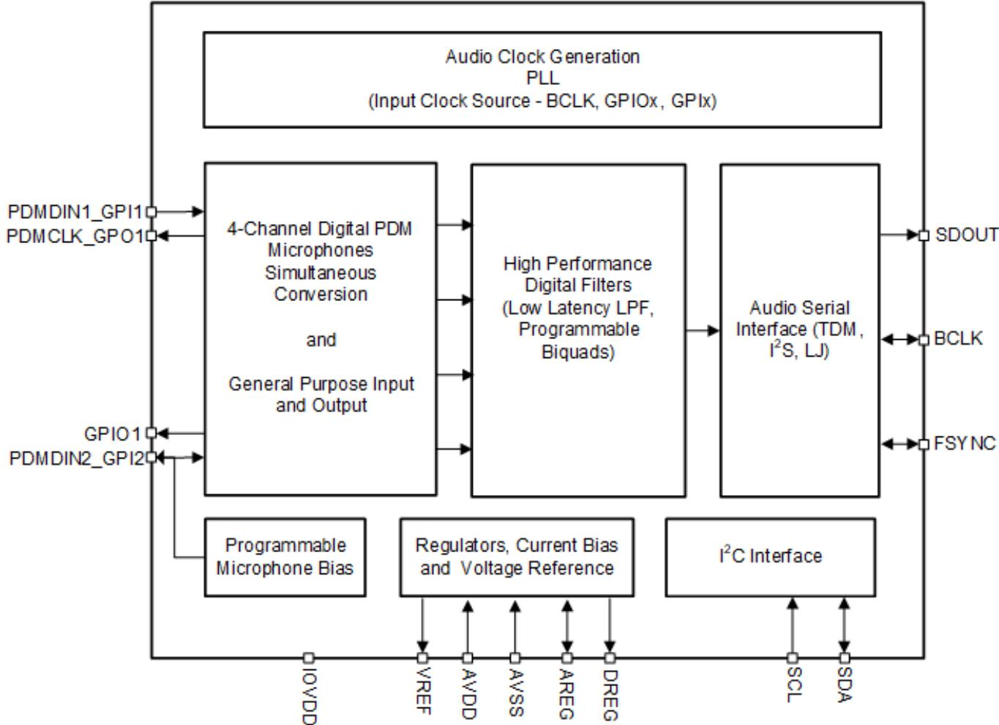

## 7.3 特性描述

## 7.3.1 串行接口

该器件有两个串行接口：控制接口和音频数据接口。控制串行接口用于器件配置。音频数据串行接口用于将音频数据传输到主机设备。

## 7.3.1.1 控制串行接口

该器件包含配置寄存器和可编程系数，可根据特定系统和应用需求设置为所需值。所有寄存器均可通过 ${ \mathsf { I } } ^ { 2 } { \mathsf { C } }$ 通信访问。更多信息请参阅编程章节。

## 7.3.1.2 音频串行接口

数字音频数据通过数字音频串行接口 (ASI) 或音频总线在主机处理器和 PCMD3140 之间传输。该高度灵活的 ASI 总线包括用于多通道操作的 TDM 模式、支持 I<sup>2</sup>S 或左平衡协议格式、可编程数据长度选项、非常灵活的总线时钟线主从配置能力，以及直接与系统内多个器件通信的能力。

总线协议 TDM、I<sup>2</sup>S 或左平衡 (LJ) 格式可通过 ASI_FORMAT[1:0] (P0_R7_D[7:6]) 寄存器位进行选择。如 表 7-2 和 表 7-3 所示，这些模式均为最高有效字节 (MSB) 优先的脉冲编码调制 (PCM) 数据格式，输出通道数据字长可通过配置 ASI_WLEN[1:0] (P0_R7_D[5:4]) 寄存器位编程为 16 位、20 位、24 位或 32 位。

表 7-2. Audio Serial Interface Format


| P0_R7_D[7:6] : ASI_FORMAT[1:0] | 音频串行接口格式 |
| --- | --- |
| 00 (default) | 时分多路复用 (TDM) 模式 |
| 01 | Inter IC 音频 ( $I^{2}S$ ) mode |
| 10 | 左平衡 (LJ) 模式 |
| 11 | 保留（请勿使用此设置） |


表 7-3. Audio Output Channel Data Word-Length


| P0_R7_D[5:4] : ASI_WLEN[1:0] | 音频输出通道数据字长 |
| --- | --- |
| 00 | 输出通道数据字长设置为 16 位 |
| 01 | 输出通道数据字长设置为 20 位 |
| 10 | 输出通道数据字长设置为 24 位 |
| 11 (default) | 输出通道数据字长设置为 32 位 |


帧同步引脚 FSYNC 在此音频总线协议中用于定义帧的起始，其频率与输出数据采样率相同。位时钟引脚 BCLK 用于在串行总线上输出数字音频数据。一帧中的位时钟周期数必须能够容纳多个器件活动输出通道以及编程的数据字长。

一帧由多个时分通道时隙（最多 64 个）组成，以允许器件或 PCMD3140 以及共享同一总线的其他音频器件在音频总线上完成所有输出通道音频数据传输。该器件最多支持四个输出通道，可配置为将其音频数据放置在总线时隙 0 至时隙 63 上。表 7-4 列出了输出通道时隙配置设置。在 I<sup>2</sup>S 和 LJ 模式下，时隙分为两组：左通道时隙和右通道时隙，如 Inter IC Sound (I<sup>2</sup>S) 接口和左平衡 (LJ) 接口章节所述。

表 7-4. 输出通道时隙分配设置


| P0_R11_D[5:0] : CH1_SLOT[5:0] | 输出通道 1 时隙分配 |
| --- | --- |
| 00 0000 = 0d (default) | Slot 0 for TDM or left slot 0 for  $I^{2}S$ , LJ. |
| 00 0001 = 1d | Slot 1 for TDM or left slot 1 for  $I^{2}S$ , LJ. |
| ... | ... |
| 01 1111 = 31d | Slot 31 for TDM or left slot 31 for  $I^{2}S$ , LJ. |
| 10 0000 = 32d | Slot 32 for TDM or right slot 0 for  $I^{2}S$ , LJ. |
| ... | ... |
| 11 1110 = 62d | Slot 62 for TDM or right slot 30 for  $I^{2}S$ , LJ. |
| 11 1111 = 63d | Slot 63 for TDM or right slot 31 for  $I^{2}S$ , LJ. |


同样，输出通道 2 至通道 4 的时隙分配设置可分别使用 CH2_SLOT (P0_R12) 至 CH8_SLOT (P0_R18) 寄存器进行配置。

时隙字长与器件设置的输出通道数据字长相同。如果系统中所有器件共享同一 ASI 总线，则必须为所有 PCMD3140 器件设置相同的输出通道数据字长。系统中 ASI 总线可能的最大时隙数受可用总线带宽限制，该带宽取决于 BCLK 频率、使用的输出数据采样率以及配置的通道数据字长。

该器件还具有一项功能，可将时隙数据传输的起始位置相对于帧同步偏移最多 31 个位时钟周期。表 7-5 列出了可编程偏移配置设置。

表 7-5. ASI 时隙起始的可编程偏移设置


| P0_R8_D[4:0] : TX_OFFSET[4:0] | 时隙数据传输起始的可编程偏移设置 |
| --- | --- |
| 0 0000 = 0d (default) | 器件遵循标准协议时序，无任何偏移。 |
| 0 0001 = 1d | 相对于标准协议时序，时隙起始偏移一个 BCLK 周期。对于 I2S 或 LJ，左右时隙起始相对于标准协议时序偏移一个 BCLK 周期。 |
| ...... | ...... |
| 1 1110 = 30d | 相对于标准协议时序，时隙起始偏移 30 个 BCLK 周期。对于 I2S 或 LJ，左右时隙起始相对于标准协议时序偏移 30 个 BCLK 周期。 |
| 1 1111 = 31d | 相对于标准协议时序，时隙起始偏移 31 个 BCLK 周期。对于 I2S 或 LJ，左右时隙起始相对于标准协议时序偏移 31 个 BCLK 周期。 |


该器件还可以反转用于传输音频数据的帧同步引脚 FSYNC 的极性（相对于标准协议时序中使用的默认 FSYNC 极性）。此功能可通过 FSYNC_POL (P0_R7_D3) 寄存器位进行设置。同样，该器件可以反转位时钟引脚 BCLK 的极性，可通过 BCLK_POL (P0_R7_D2) 寄存器位进行设置。

## 7.3.1.2.1 时分多路复用音频 (TDM) 接口

在 TDM 模式（也称为 DSP 模式）下，FSYNC 的上升沿启动数据传输，首先传输时隙 0 数据。时隙 0 数据传输完成后，其余时隙数据依次传输。FSYNC 和每个数据位（当 TX_OFFSET 等于 0 时，时隙 0 的 MSB 除外）在 BCLK 的上升沿传输。图 7-1 至图 7-4 展示了各种配置下 TDM 操作的协议时序。

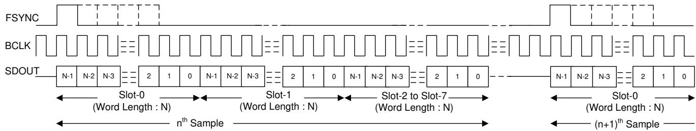  
图 7-1. TDM 模式标准协议时序 (TX_OFFSET = 0)

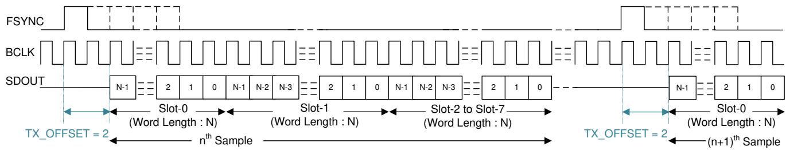  
图 7-2. TDM 模式协议时序 (TX_OFFSET = 2)

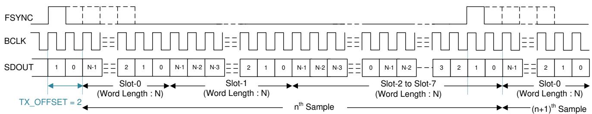  
图 7-3. TDM 模式协议时序（无空闲 BCLK 周期，TX_OFFSET = 2）

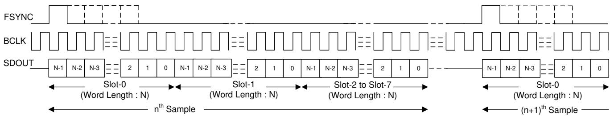  
图 7-4. TDM 模式协议时序 (TX_OFFSET = 0 且 BCLK_POL = 1)

为确保音频总线在 TDM 模式下正常工作，每帧的位时钟数必须大于或等于活动输出通道数乘以输出通道数据的编程字长。该器件支持 FSYNC 作为 1 个位时钟周期宽度的脉冲，但也支持多个周期的宽度。对于较高的 BCLK 频率操作，建议使用 TX_OFFSET 值大于 0 的 TDM 模式。

## 7.3.1.2.2 Inter IC Sound (I<sup>2</sup>S) Interface

标准 I<sup>2</sup>S 协议仅定义了两个通道：左通道和右通道。该器件将相同的协议时序扩展到多通道操作。在 I<sup>2</sup>S 模式下，左时隙 0 的 MSB 在 FSYNC 下降沿后的第二个 BCLK 下降沿传输。左时隙 0 数据传输完成后，其余左时隙数据依次传输。右时隙 0 的 MSB 在 FSYNC 上升沿后的第二个 BCLK 下降沿传输。右时隙 0 数据传输完成后，其余右时隙数据依次传输。FSYNC 和每个数据位在 BCLK 的下降沿传输。图 7-5 至图 7-8 展示了各种配置下 I<sup>2</sup>S 操作的协议时序。

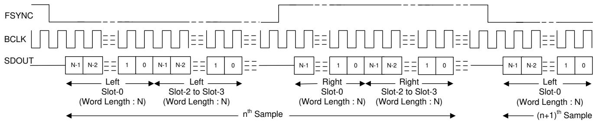  
图 7-5. I<sup>2</sup>S 模式标准协议时序 (TX_OFFSET = 0)

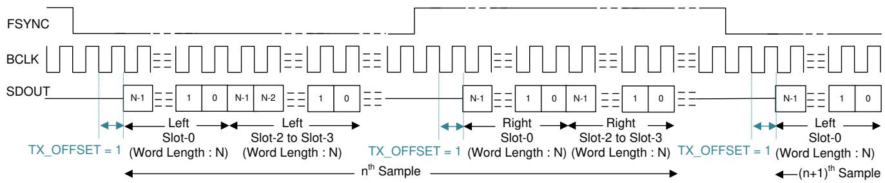  
图 7-6. I<sup>2</sup>S 协议时序 (TX_OFFSET = 1)

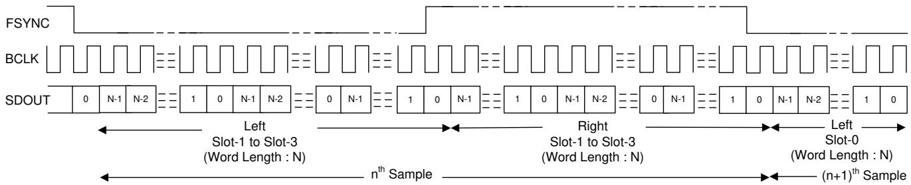  
图 7-7. I<sup>2</sup>S 协议时序（无空闲 BCLK 周期，TX_OFFSET = 0）

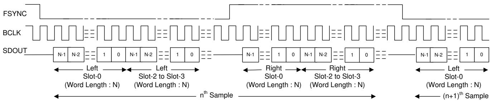  
图 7-8. I<sup>2</sup>S 协议时序 (TX_OFFSET = 0 且 BCLK_POL = 1)

为确保音频总线在 I<sup>2</sup>S 模式下正常工作，每帧的位时钟数必须大于或等于活动输出通道数（包括左右时隙）乘以输出通道数据的编程字长。器件 FSYNC 低脉冲的 BCLK 周期宽度必须大于或等于活动左时隙数乘以配置的数据字长。同样，FSYNC 高脉冲的 BCLK 周期宽度必须大于或等于活动右时隙数乘以配置的数据字长。

## 7.3.1.2.3 左平衡 (LJ) 接口

标准 LJ 协议仅定义了两个通道：左通道和右通道。该器件将相同的协议时序扩展到多通道操作。在 LJ 模式下，左时隙 0 的 MSB 在 FSYNC 上升沿后的同一个 BCLK 周期内传输。每个后续数据位在 BCLK 的下降沿传输。左时隙 0 数据传输完成后，其余左时隙数据依次传输。右时隙 0 的 MSB 在 FSYNC 下降沿后的同一个 BCLK 周期内传输。每个后续数据位在 BCLK 的下降沿传输。右时隙 0 数据传输完成后，其余右时隙数据依次传输。FSYNC 在 BCLK 的下降沿传输。图 7-9 至图 7-12 展示了各种配置下 LJ 操作的协议时序。

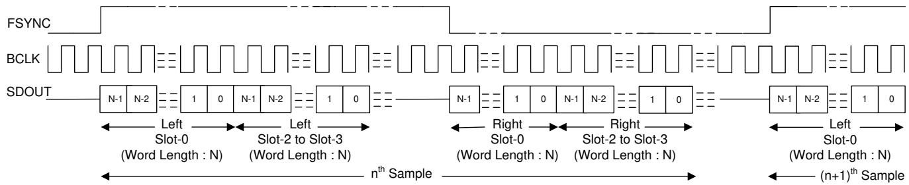  
图 7-9. LJ 模式标准协议时序 (TX_OFFSET = 0)

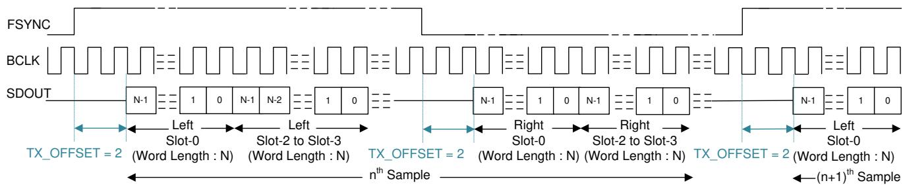  
图 7-10. LJ 协议时序 (TX_OFFSET = 2)

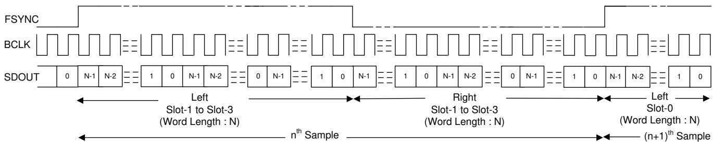  
图 7-11. LJ 协议时序（无空闲 BCLK 周期，TX_OFFSET = 0）

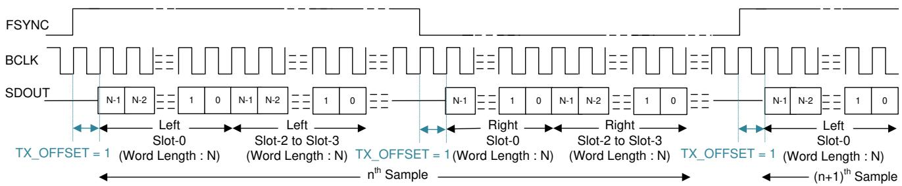  
图 7-12. LJ 协议时序 (TX_OFFSET = 1 且 BCLK_POL = 1)

为确保音频总线在 LJ 模式下正常工作，每帧的位时钟数必须大于或等于活动输出通道数（包括左右时隙）乘以输出通道数据的编程字长。器件 FSYNC 高脉冲的 BCLK 周期宽度必须大于或等于活动左时隙数乘以配置的数据字长。同样，FSYNC 低脉冲的 BCLK 周期宽度必须大于或等于活动右时隙数乘以配置的数据字长。对于较高的 BCLK 频率操作，建议使用 TX_OFFSET 值大于 0 的 LJ 模式。

## 7.3.1.3 使用共享总线的多个器件

该器件具有许多支持的功能和灵活选项，可在系统中通过共享单个公共 ${ \mathsf { I } } ^ { 2 } { \mathsf { C } }$ 控制总线和音频串行接口总线来无缝连接 PCMD3140 和任何其他音频器件。这种架构使得需要麦克风阵列进行波束成形操作、音频会议、噪声消除等应用的系统能够实现多种应用。图 7-13 展示了 PCMD3140 和 PCMD3180 器件在共享控制和音频数据总线配置下的连接图。

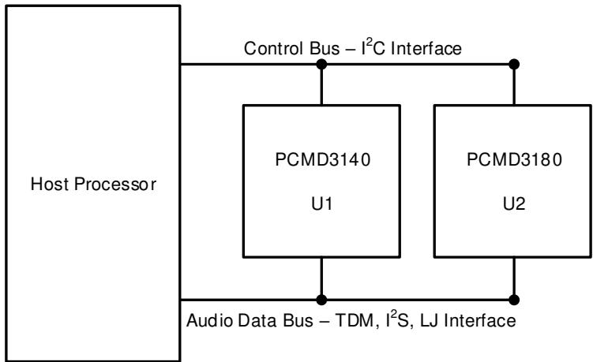  
图 7-13. Multiple Devices With Shared Control and Audio Data Buses

PCMD3140 具有以下特性，可使用共享总线实现多个器件的无缝连接和交互：

• I<sup>2</sup>C 广播同时写入（或触发）PCMD3140 和 PCMD3180 器件

• 支持音频串行接口最多 64 个配置输出通道时隙

• 针对器件未使用音频数据时隙的三态功能（可使能和禁用）

• 支持总线保持功能（可使能和禁用），以保持音频总线上的最后驱动值

• GPIO1 或 PDMCLK_GPO1 引脚可配置为音频串行接口的辅助输出数据通道

• GPIO1 或 PDMDINx_GPIx 引脚可用于多个器件的菊花链配置

• 支持一个 BCLK 周期数据锁存时序，以放宽高速接口的时序要求

• 音频串行接口的可编程主从选项

• 能够同步多个器件以满足跨器件同时采样的要求

系统还可以通过共享单个公共 ${ \mathsf { I } } ^ { 2 } { \mathsf { C } }$ 控制总线和音频串行接口总线，将多个 PCMD3140 器件与 TLV320ADCx140 器件组合连接。有关更多详细信息，请参阅《多个 TLV320ADCx140 和 TLV320ADCx120 器件共享 TDM 和 I<sup>2</sup>C 总线》应用报告。

## 7.3.2 锁相环 (PLL) 和时钟生成

该器件具有智能自动配置模块，可生成 PDM 时钟生成和用于信号处理的数字滤波器引擎所需的所有内部时钟。此配置通过监测音频总线上 FSYNC 和 BCLK 信号的频率来完成。

该器件支持各种输出数据采样率（FSYNC 信号频率）和 BCLK 与 FSYNC 比率，可在内部配置所有时钟分频器（包括 PLL 配置），无需主机编程。表 7-6 和表 7-7 列出了支持的 FSYNC 和 BCLK 频率。

表 7-6. 支持的 FSYNC（48kHz 的倍数或约数）和 BCLK 频率


| BCLK TO FSYNC RATIO | BCLK (MHz) |  |  |  |  |  |  |  |  |
| --- | --- | --- | --- | --- | --- | --- | --- | --- | --- |
| BCLK TO FSYNC RATIO | FSYNC (8 kHz) | FSYNC (16 kHz) | FSYNC (24 kHz) | FSYNC (32 kHz) | FSYNC (48 kHz) | FSYNC (96 kHz) | FSYNC (192 kHz) | FSYNC (384 kHz) | FSYNC (768 kHz) |
| 16 | Reserved | 0.256 | 0.384 | 0.512 | 0.768 | 1.536 | 3.072 | 6.144 | 12.288 |
| 24 | Reserved | 0.384 | 0.576 | 0.768 | 1.152 | 2.304 | 4.608 | 9.216 | 18.432 |
| 32 | 0.256 | 0.512 | 0.768 | 1.024 | 1.536 | 3.072 | 6.144 | 12.288 | 24.576 |
| 48 | 0.384 | 0.768 | 1.152 | 1.536 | 2.304 | 4.608 | 9.216 | 18.432 | Reserved |
| 64 | 0.512 | 1.024 | 1.536 | 2.048 | 3.072 | 6.144 | 12.288 | 24.576 | Reserved |
| 96 | 0.768 | 1.536 | 2.304 | 3.072 | 4.608 | 9.216 | 18.432 | Reserved | Reserved |
| 128 | 1.024 | 2.048 | 3.072 | 4.096 | 6.144 | 12.288 | 24.576 | Reserved | Reserved |
| 192 | 1.536 | 3.072 | 4.608 | 6.144 | 9.216 | 18.432 | Reserved | Reserved | Reserved |
| 256 | 2.048 | 4.096 | 6.144 | 8.192 | 12.288 | 24.576 | Reserved | Reserved | Reserved |
| 384 | 3.072 | 6.144 | 9.216 | 12.288 | 18.432 | Reserved | Reserved | Reserved | Reserved |
| 512 | 4.096 | 8.192 | 12.288 | 16.384 | 24.576 | Reserved | Reserved | Reserved | Reserved |
| 1024 | 8.192 | 16.384 | 24.576 | Reserved | Reserved | Reserved | Reserved | Reserved | Reserved |
| 2048 | 16.384 | Reserved | Reserved | Reserved | Reserved | Reserved | Reserved | Reserved | Reserved |


表 7-7. 支持的 FSYNC（44.1kHz 的倍数或约数）和 BCLK 频率


| BCLK TO FSYNC RATIO | BCLK (MHz) |  |  |  |  |  |  |  |  |
| --- | --- | --- | --- | --- | --- | --- | --- | --- | --- |
| BCLK TO FSYNC RATIO | FSYNC (7.35 kHz) | FSYNC (14.7 kHz) | FSYNC (22.05 kHz) | FSYNC (29.4 kHz) | FSYNC (44.1 kHz) | FSYNC (88.2 kHz) | FSYNC (176.4 kHz) | FSYNC (352.8 kHz) | FSYNC (705.6 kHz) |
| 16 | Reserved | Reserved | 0.3528 | 0.4704 | 0.7056 | 1.4112 | 2.8224 | 5.6448 | 11.2896 |
| 24 | Reserved | 0.3528 | 0.5292 | 0.7056 | 1.0584 | 2.1168 | 4.2336 | 8.4672 | 16.9344 |
| 32 | Reserved | 0.4704 | 0.7056 | 0.9408 | 1.4112 | 2.8224 | 5.6448 | 11.2896 | 22.5792 |
| 48 | 0.3528 | 0.7056 | 1.0584 | 1.4112 | 2.1168 | 4.2336 | 8.4672 | 16.9344 | Reserved |
| 64 | 0.4704 | 0.9408 | 1.4112 | 1.8816 | 2.8224 | 5.6448 | 11.2896 | 22.5792 | Reserved |
| 96 | 0.7056 | 1.4112 | 2.1168 | 2.8224 | 4.2336 | 8.4672 | 16.9344 | Reserved | Reserved |
| 128 | 0.9408 | 1.8816 | 2.8224 | 3.7632 | 5.6448 | 11.2896 | 22.5792 | Reserved | Reserved |
| 192 | 1.4112 | 2.8224 | 4.2336 | 5.6448 | 8.4672 | 16.9344 | Reserved | Reserved | Reserved |
| 256 | 1.8816 | 3.7632 | 5.6448 | 7.5264 | 11.2896 | 22.5792 | Reserved | Reserved | Reserved |
| 384 | 2.8224 | 5.6448 | 8.4672 | 11.2896 | 16.9344 | Reserved | Reserved | Reserved | Reserved |
| 512 | 3.7632 | 7.5264 | 11.2896 | 15.0528 | 22.5792 | Reserved | Reserved | Reserved | Reserved |
| 1024 | 7.5264 | 15.0528 | 22.5792 | Reserved | Reserved | Reserved | Reserved | Reserved | Reserved |
| 2048 | 15.0528 | Reserved | Reserved | Reserved | Reserved | Reserved | Reserved | Reserved | Reserved |


状态寄存器 ASI_STS (P0_R21) 捕获器件对 FSYNC 频率和 BCLK 与 FSYNC 比率的自动检测结果。如果器件发现任何不支持的 FSYNC 频率和 BCLK 与 FSYNC 比率组合，器件将生成 ASI 时钟错误中断并相应地静音录音通道。

该器件使用集成的低抖动锁相环 (PLL) 生成 PDM 时钟生成和数字滤波器引擎以及其他控制模块所需的内部时钟。该器件还支持使用 BCLK、GPIO1 或 GPIx 引脚（作为 MCLK）作为音频时钟源而不使用 PLL 以降低功耗。然而，PDM 麦克风性能可能会因外部时钟源的抖动而降级，如果外部音频时钟源频率不够高，某些处理功能可能不受支持。因此，TI 建议在高性能应用中使用 PLL。有关如何在不使用 PLL 的情况下以低功耗模式配置和使用器件的更多详细信息，请参阅《TLV320ADCx120 各种使用场景下的功耗矩阵》应用报告。

该器件还支持使用 GPIO1 或 GPIx 引脚（作为 MCLK）作为参考输入时钟源的音频总线主模式操作，并支持各种灵活选项和多种系统时钟。有关主模式配置和操作的更多详细信息，请参阅《将 TLV320ADCx120 配置和操作为音频总线主设备》应用报告。

音频总线时钟错误检测和自动检测功能可自动生成所有内部时钟，但可分别使用 ASI_ERR (P0_R9_D5) 和 AUTO_CLK_CFG (P0_R19_D6) 寄存器位禁用。在系统中，此禁用功能可用于支持自动检测方案未涵盖的自定义时钟频率。对于此类应用场景，必须注意确保多个时钟分频器均已适当配置。因此，TI 建议使用 PPC3 GUI 进行器件配置设置；有关更多详细信息，请参阅《ADCx120EVM-PDK 评估模块用户指南》和《PurePath™ Console 音频系统设计与开发图形开发套件》。

## 7.3.3 参考电压

PCMD3140 通过内部生成低噪声参考电压来实现低噪声性能。该参考电压使用具有高 PSRR 性能的带隙电路生成，必须使用从 VREF 引脚连接到模拟地 (AVSS) 的 1µF 电容进行外部滤波。

该参考电压的值可通过 P0_R59_D[1:0] 寄存器位进行配置，并且必须根据系统中可用的 AVDD 电源电压设置为适当的值。默认 VREF 值设置为 2.75V，此模式所需的最小 AVDD 电压为 3V。表 7-8 列出了支持的各种 VREF 设置以及该配置所需的 AVDD 范围。

表 7-8. VREF 可编程设置


| P0_R59_D[1:0] : VREF_SEL[1:0] | VREF 输出电压 | AVDD 范围要求 |
| --- | --- | --- |
| 00 (default) | 2.75 V | 3 V to 3.6 V |
| 01 | 2.5 V | 2.8 V to 3.6 V |
| 10 | 1.375 V | 1.7 V to 1.9 V |
| 11 | Reserved | Reserved |


为实现低功耗，该音频参考模块可按照睡眠模式或软件关断章节所述断电。退出睡眠模式时，音频参考模块使用内部快速充电方案上电，VREF 引脚在经过稳定时间（取决于 VREF 引脚上的去耦电容）后稳定到其稳态电压。使用 1μF 去耦电容时，该时间约等于 3.5ms。如果 VREF 引脚上使用较大值的去耦电容，则必须使用 VREF_QCHG (P0_R2_D[4:3]) 寄存器位重新配置快速充电设置，该设置支持 3.5ms（默认）、10ms、50ms 或 100ms 选项。

## 7.3.4 麦克风偏置

该器件集成了内置的低噪声可编程麦克风偏置引脚，可在系统中用于为 MEMS 数字麦克风提供电源。MICBIAS 引脚必须通过外部 1µF 电容连接到模拟地 (AVSS)。MICBIAS 引脚支持高达 5mA 的负载电流，可用于多个麦克风。当使用此 MICBIAS 引脚为多个麦克风提供偏置或电源时，应避免电路板布局中 MICBIAS 连接的任何公共阻抗，以最大限度地减少麦克风之间的耦合。在系统中，如果 MICBIAS 引脚用作数字麦克风的电源，则 TI 建议将 MICBIAS 配置为 AVDD，以便数字麦克风 PDMCLKx 和 PDMDINx 信号可以直接连接到 PCMD3140，无需使用任何外部电平转换器。表 7-9 显示了可用的麦克风偏置可编程选项。

表 7-9. MICBIAS 可编程设置


| P0_R59_D[6:4] : MBIAS_VAL[2:0] | P0_R59_D[1:0] : VREF_SEL[1:0] | MICBIAS OUTPUT VOLTAGE |
| --- | --- | --- |
| 000 (default) | 00 (default) | 2.75 V (same as the VREF output) |
| 000 (default) | 01 | 2.5 V (same as the VREF output) |
| 000 (default) | 10 | 1.375 V (same as the VREF output) |
| 001 to 101 | XX | 保留（请勿使用这些设置） |
| 110 | XX | 与 AVDD 相同 |
| 111 | XX | 保留（请勿使用此设置） |


麦克风偏置输出可通过配置 MICBIAS_PDZ (P0_R117_D7) 寄存器位来上电或断电（默认）。此外，该器件还提供了一个选项，可配置 GPIO1 或 GPIx 引脚直接控制麦克风偏置输出的上电或断电。此功能可用于直接控制麦克风，无需主机进行 I<sup>2</sup>C 通信。如果 GPIO1 或 GPIx 引脚配置为设置麦克风偏置的开或关，则 MICBIAS_PDZ (P0_R117_D7) 寄存器位值将被忽略。

## 7.3.5 数字 PDM 麦克风录音通道

该器件可连接最多四个数字脉冲密度调制 (PDM) 麦克风进行同步转换，并使用高阶高性能抽取滤波器生成脉冲编码调制 (PCM) 输出数据，这些数据可通过音频串行接口使用时分多路复用 (TDM)、I<sup>2</sup>S 或左平衡 (LJ) 音频格式传输到主机。

该器件内部生成 PDMCLK，可使用 PDMCLK_DIV[1:0] (P0_R31_D[1:0]) 寄存器位编程为 6.144MHz、3.072MHz、1.536MHz 或 768kHz（适用于 48kHz 倍数或约数的输出数据采样率）或 5.6448MHz、2.8224MHz、1.4112MHz 或 705.6kHz（适用于 44.1kHz 倍数或约数的输出数据采样率）。PDMCLK 可路由到 PDMCLKx_GPOx 引脚。此时钟可连接到外部数字麦克风器件。该器件还支持控制寄存器独立配置每个通道的 PDMDINx 数据使用上升沿或下降沿锁存。图 7-14 显示了数字 PDM 麦克风的连接图。

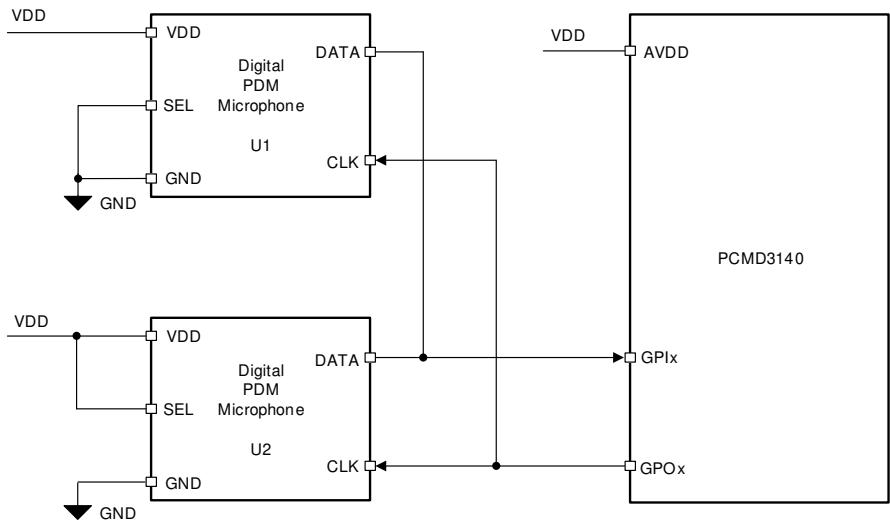  
图 7-14. 数字 PDM 麦克风连接到 PCMD3140 的连接图

外部数字麦克风器件的单位输出可连接到 GPIx 引脚。该单数据线可由两个数字麦克风共享，将各自的数据放置在 PDMCLK 的相反沿上。在内部，器件根据 P0_R32_D[7:4] 中设置的配置寄存器位，在 PDMCLK 的上升沿或下降沿锁存数据的稳定值。图 7-15 显示了数字 PDM 麦克风接口时序图。

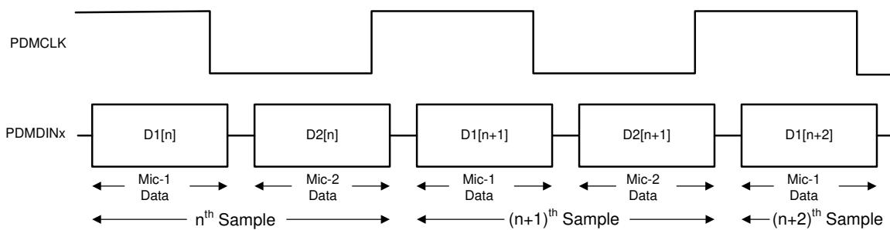  
图 7-15. 数字 PDM 麦克风协议时序图

## 7.3.6 信号链处理

PCMD3140 信号链由高性能、低功耗且高度灵活可编程的数字处理模块组成。高性能和灵活性结合紧凑的封装，使 PCMD3140 针对需要多通道音频捕获的各种终端设备和应用进行了优化。图 7-16 显示了一个概念框图，突出显示了信号链中使用的各种构建模块以及这些模块在信号链中的交互方式。

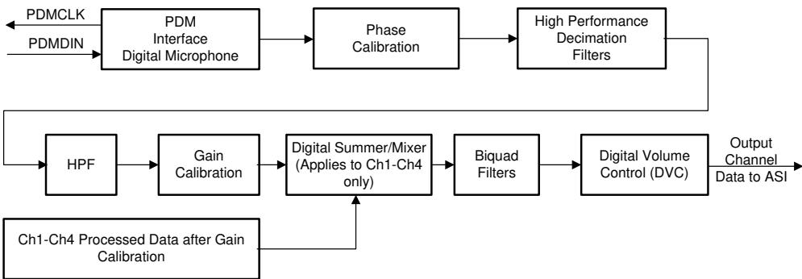  
图 7-16. 信号链处理流程图

该器件最多支持四个数字 PDM 麦克风录音通道同时工作。信号链由各种高度可编程的数字处理模块组成，如相位校准、增益校准、高通滤波器、数字加法器或混频器、双二阶滤波器和音量控制。本节将进一步讨论这些处理模块的详细信息。图 7-16 信号链框图中的通道 1 至通道 4 如本节所述。

所需的录音输入通道可通过 IN_CH_EN (P0_R115) 寄存器使能或禁用，音频串行接口的输出通道可通过 ASI_OUT_EN (P0_R116) 寄存器使能或禁用。通常，该器件支持所有活动通道同时上电和断电以实现同步录音。但是，根据应用需求，如果某些通道需要在其他通道录音时动态上电或断电，则可通过将 DYN_CH_PUPD_EN (P0_R117_D4) 寄存器位设置为 1'b1 来支持该使用场景，但在此操作模式下不要关闭通道 1。

该器件支持高达 80kHz 的输入信号带宽，这使得可以使用 176.4kHz（或更高）采样率录制高频非音频信号。

对于 48kHz 或更低的输出采样率，该器件支持 4 通道录音的所有功能和各种可编程处理模块。但是，对于高于 48kHz 的输出采样率，同时支持的通道录音数量以及双二阶滤波器数量等存在限制。有关更多详细信息，请参阅《TLV320ADCx120 采样率和支持的可编程处理模块》应用报告。

## 7.3.6.1 可编程数字音量控制

该器件具有可编程数字音量控制，范围为 -100dB 至 27dB，步长为 0.5dB，并可选择静音通道录音。数字音量控制值可在通道上电并录音时动态更改。在音量控制更改期间，内部使用软斜坡上升或下降音量功能以避免任何可听伪影。软步进可通过 DISABLE_SOFT_STEP (P0_R108_D4) 寄存器位完全禁用。

数字音量控制设置可供每个输出通道（包括数字麦克风录音通道）独立使用。但是，该器件还支持使用通道 1 数字音量控制设置将所有通道的音量控制设置联动在一起的选项，无论通道 1 是上电还是断电。此联动功能可通过 DVOL_GANG (P0_R108_D7) 寄存器位使能。

表 7-10 显示了数字音量控制的可用可编程选项。

表 7-10. 数字音量控制 (DVC) 可编程设置


| P0_R62_D[7:0] : CH1_DVOL[7:0] | 输出通道 1 的 DVC 设置 |
| --- | --- |
| 0000 0000 = 0d | 输出通道 1 DVC 设置为静音 |
| 0000 0001 = 1d | 输出通道 1 DVC 设置为 -100dB |
| 0000 0010 = 2d | 输出通道 1 DVC 设置为 -99.5dB |
| 0000 0011 = 3d | 输出通道 1 DVC 设置为 -99dB |
| ... | ... |
| 1100 1000 = 200d | 输出通道 1 DVC 设置为 -0.5dB |
| 1100 1001 = 201d (default) | 输出通道 1 DVC 设置为 0dB |
| 1100 1010 = 202d | 输出通道 1 DVC 设置为 0.5dB |
| ... | ... |
| 1111 1101 = 253d | 输出通道 1 DVC 设置为 26dB |
| 1111 1110 = 254d | 输出通道 1 DVC 设置为 26.5dB |
| 1111 1111 = 255d | 输出通道 1 DVC 设置为 27dB |


同样，输出通道 2 至通道 4 的数字音量控制设置可分别使用 CH2_DVOL (P0_R67) 至 CH4_DVOL (P0_R77) 寄存器位进行配置。

当通道上电时，内部数字处理引擎将音量从静音级别软斜坡上升到编程的音量级别；当通道断电时，内部数字处理引擎将音量从编程的音量软斜坡下降到静音。这种音量软步进是为了防止录音通道的突然上电和断电。此功能也可通过 DISABLE_SOFT_STEP (P0_R108_D4) 寄存器位完全禁用。

## 7.3.6.2 可编程通道增益校准

除了可编程通道增益和数字音量之外，该器件还提供可编程通道增益校准。每个通道的增益可以 0.1dB 的步长进行精细校准或调整，增益误差范围为 -0.8dB 至 0.7dB。当需要匹配因外部元件和麦克风灵敏度导致的通道间增益差异时，此调整非常有用。此功能与常规数字音量控制相结合，可在宽增益误差范围内以 0.1dB 的分辨率匹配所有通道的增益。表 7-11 显示了通道增益校准的可用可编程选项。

表 7-11. 通道增益校准可编程设置


| P0_R63_D[7:4] : CH1_GCAL[3:0] | 输入通道 1 的通道增益校准设置 |
| --- | --- |
| 0000 = 0d | 输入通道 1 增益校准设置为 -0.8dB |
| 0001 = 1d | 输入通道 1 增益校准设置为 -0.7dB |
| ... | ... |
| 1000 = 8d (default) | 输入通道 1 增益校准设置为 0dB |
| ... | ... |
| 1110 = 14d | 输入通道 1 增益校准设置为 0.6dB |
| 1111 = 15d | 输入通道 1 增益校准设置为 0.7dB |


同样，输入通道 2 至通道 4 的通道增益校准设置可分别使用 CH2_GCAL (P0_R68) 至 CH4_GCAL (P0_R78) 寄存器位进行配置。

## 7.3.6.3 可编程通道相位校准

除了增益校准之外，每个通道的相位延迟可以以一个调制器时钟周期为步长进行精细校准或调整，相位误差的周期范围为 0 至 255。相位校准时钟取决于使用的 PDM 时钟。对于 6.144MHz 的 PDM_CLK（输出数据采样率为 48kHz 的倍数或约数）或 5.6448MHz（输出数据采样率为 44.1kHz 的倍数或约数），相位校准时钟与 PDM_CLK 相同。对于等于或低于 3.072MHz 的 PDM_CLK（输出数据采样率为 48kHz 的倍数或约数），使用的相位校准时钟为 3.072MHz。同样，对于 2.8224MHz、1.4112MHz 或 705.6kHz 的 PDM_CLK（输出数据采样率为 44.1kHz 的倍数或约数），使用的相位校准时钟为 2.8224MHz。此功能对于需要在各通道之间以精细分辨率匹配相位的许多应用非常有用，包括因外部元件或麦克风导致的通道间任何相位失配。表 7-12 显示了 PDM_CLK 为 6.144MHz 或 5.6448MHz 的数字麦克风的通道相位校准可用可编程选项。

表 7-12. 通道相位校准可编程设置


| P0_R64_D[7:0] : CH1_PCAL[7:0] | 输入通道 1 的通道相位校准设置 |
| --- | --- |
| 0000 0000 = 0d (default) | 输入通道 1 相位校准，无延迟 |
| 0000 0001 = 1d | 输入通道 1 相位校准延迟设置为一个调制器时钟周期 |
| 0000 0010 = 2d | 输入通道 1 相位校准延迟设置为两个调制器时钟周期 |
| ... | ... |
| 1111 1110 = 254d | 输入通道 1 相位校准延迟设置为 254 个调制器时钟周期 |
| 1111 1111 = 255d | 输入通道 1 相位校准延迟设置为 255 个调制器时钟周期 |


对于 PDM_CLK 频率低于 3.072MHz 的数字麦克风接口，相位校准范围为相位校准时钟的 0 至 127 个周期（输出数据采样率为 48kHz 倍数或约数时相位校准时钟为 3.072MHz，输出数据采样率为 44.1kHz 倍数或约数时相位校准时钟为 2.8224MHz）。PDM_CLK 频率低于 3.072MHz 的相位校准可使用通道 1 的 CH1_PCAL[7:1] 寄存器位进行配置。

同样，输入通道 2 至通道 4 的通道相位校准设置可分别使用 CH2_PCAL (P0_R69) 至 CH4_PCAL (P0_R79) 寄存器位进行配置。

## 7.3.6.4 可编程数字高通滤波器

为了消除录音数据中的直流偏移分量并衰减不需要的低频噪声内容，该器件支持可编程高通滤波器 (HPF)。HPF 不是独立于通道的滤波器设置，而是全局适用于所有通道。该 HPF 使用一阶无限脉冲响应 (IIR) 滤波器构建，能够有效滤除信号中可能的直流分量。表 7-13 显示了可通过 P0_R107 的 HPF_SEL[1:0] 寄存器位设置的预定义 -3dB 截止频率。此外，为了针对特定应用实现自定义的 -3dB 截止频率，当 HPF_SEL[1:0] 寄存器位设置为 2'b00 时，该器件还允许对一阶 IIR 滤波器系数进行编程。图 7-17 展示了 HPF 滤波器的频率响应图。

表 7-13. HPF 可编程设置


| P0_R107_D[1:0] : HPF_SEL[1:0] | -3-dB CUTOFF FREQUENCY SETTING | -3-dB CUTOFF FREQUENCY AT 16-kHz SAMPLE RATE | -3-dB CUTOFF FREQUENCY AT 48-kHz SAMPLE RATE |
| --- | --- | --- | --- |
| 00 | Programmable 1st-order IIR filter | Programmable 1st-order IIR filter | Programmable 1st-order IIR filter |
| 01 (default) | $0.00025 \times f_{S}$ | 4 Hz | 12 Hz |
| 10 | $0.002 \times f_{S}$ | 32 Hz | 96 Hz |
| 11 | $0.008 \times f_{S}$ | 128 Hz | 384 Hz |


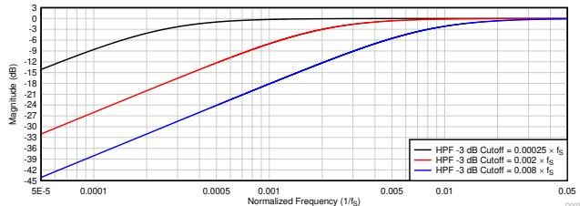  
图 7-17. HPF Filter Frequency Response Plot

方程式 1 给出了一阶可编程 IIR 滤波器的传递函数：

$$
H (z) = \frac {N _ {0} + N _ {1} z ^ {- 1}}{2 ^ {3 1} - D _ {1} z ^ {- 1}}\tag{1}
$$

具有默认系数的该一阶可编程 IIR 滤波器的频率响应在 0dB 增益处是平坦的（全通滤波器）。主机设备可通过编程表 7-14 中的 IIR 系数来覆盖频率响应，以实现所需的高通滤波频率响应或任何其他所需的滤波。如果 HPF_SEL[1:0] 设置为 2'b00，则主机设备必须在上电任何 PDM 通道进行录音之前写入这些系数值以获得所需的频率响应。这些可编程系数是 32 位二进制补码数字。表 7-14 显示了一阶 IIR 滤波器的滤波器系数。

表 7-14. 1st-Order IIR 滤波器系数s


| 滤波器 | 滤波器系数 | 默认系数值 | 系数寄存器映射 |
| --- | --- | --- | --- |
| 可编程一阶 IIR 滤波器（可分配给 HPF 或任何其他所需滤波器） | $N_0$ | 0x7FFFFFFF | P4_R72-R75 |
| 可编程一阶 IIR 滤波器（可分配给 HPF 或任何其他所需滤波器） | $N_1$ | 0x00000000 | P4_R76-R79 |
| 可编程一阶 IIR 滤波器（可分配给 HPF 或任何其他所需滤波器） | $D_1$ | 0x00000000 | P4_R80-R83 |


## 7.3.6.5 可编程数字双二阶滤波器

该器件最多支持 12 个可编程数字双二阶滤波器。这些高效滤波器可实现所需的频率响应。在数字信号处理中，数字双二阶滤波器是具有两个极点和两个零点的二阶递归线性滤波器。方程式 2 给出了每个双二阶滤波器的传递函数：

$$
H (z) = \frac {N _ {0} + 2 N _ {1} z ^ {- 1} + N _ {2} z ^ {- 2}}{2 ^ {3 1} - 2 D _ {1} z ^ {- 1} - D _ {2} z ^ {- 2}}\tag{2}
$$

具有默认系数的双二阶滤波器部分的频率响应在 0dB 增益处是平坦的（全通滤波器）。主机设备可通过编程双二阶系数来覆盖频率响应，以实现所需的低通、高通或任何其他所需频率整形的频率响应。混频器操作的可编程系数位于可编程系数寄存器：页面 2 和可编程系数寄存器：页面 3 章节中。如果需要双二阶滤波，则主机设备必须在上电任何 PDM 通道进行录音之前写入这些系数值。这些可编程系数是 32 位二进制补码数字。如 表 7-15 所述，这些双二阶滤波器可根据 P0_R108 的 BIQUAD_CFG[1:0] 寄存器设置为每个输出通道分配。通过将 BIQUAD_CFG[1:0] 设置为 2'b00，所有录音通道的双二阶滤波被禁用，如果系统应用不需要额外滤波，主机设备可以选择此设置。有关更多详细信息，请参阅《TLV320ADCx140 可编程双二阶滤波器配置和应用》应用报告。

表 7-15. 双二阶滤波器分配给录音输出通道


| 可编程双二阶滤波器 | 使用 P0_R108_D[6:5] 寄存器设置的录音输出通道分配 |  |  |
| --- | --- | --- | --- |
| 可编程双二阶滤波器 | BIQUAD_CFG[1:0] = 2&#x27;b01(1 Biquad per Channel) | BIQUAD_CFG[1:0] = 2&#x27;b10 (Default)(2 Biquads per Channel) | BIQUAD_CFG[1:0] = 2&#x27;b11(3 Biquads per Channel) |
| 可编程双二阶滤波器 | 支持全部 8 个通道 | 最多支持 6 个通道 | 最多支持 4 个通道 |
| 双二阶滤波器 1 | 分配给输出通道 1 | 分配给输出通道 1 | 分配给输出通道 1 |
| 双二阶滤波器 2 | 分配给输出通道 2 | 分配给输出通道 2 | 分配给输出通道 2 |
| 双二阶滤波器 3 | 分配给输出通道 3 | 分配给输出通道 3 | 分配给输出通道 3 |
| 双二阶滤波器 4 | 分配给输出通道 4 | 分配给输出通道 4 | 分配给输出通道 4 |
| 双二阶滤波器 5 | 未使用 | 分配给输出通道 1 | 分配给输出通道 1 |
| 双二阶滤波器 6 | 未使用 | 分配给输出通道 2 | 分配给输出通道 2 |
| 双二阶滤波器 7 | 未使用 | 分配给输出通道 3 | 分配给输出通道 3 |
| 双二阶滤波器 8 | 未使用 | 分配给输出通道 4 | 分配给输出通道 4 |
| 双二阶滤波器 9 | 未使用 | 未使用 | 分配给输出通道 1 |
| 双二阶滤波器 10 | 未使用 | 未使用 | 分配给输出通道 2 |
| 双二阶滤波器 11 | 未使用 | 未使用 | 分配给输出通道 3 |
| 双二阶滤波器 12 | 未使用 | 未使用 | 分配给输出通道 4 |


表 7-16 shows the biquad filter coefficients mapping to the register space.

表 7-16. Biquad 滤波器系数s Register Mapping


| PROGRAMMABLE BIQUAD 滤波器 | 双二阶滤波器系数寄存器映射 | PROGRAMMABLE BIQUAD 滤波器 | 双二阶滤波器系数寄存器映射 |
| --- | --- | --- | --- |
| 双二阶滤波器 1 | P2_R8-R27 | 双二阶滤波器 7 | P3_R8-R27 |
| 双二阶滤波器 2 | P2_R28-R47 | 双二阶滤波器 8 | P3_R28-R47 |
| 双二阶滤波器 3 | P2_R48-R67 | 双二阶滤波器 9 | P3_R48-R67 |
| 双二阶滤波器 4 | P2_R68-R87 | 双二阶滤波器 10 | P3_R68-R87 |
| 双二阶滤波器 5 | P2_R88-R107 | 双二阶滤波器 11 | P3_R88-R107 |
| 双二阶滤波器 6 | P2_R108-R127 | 双二阶滤波器 12 | P3_R108-R127 |


## 7.3.6.6 可编程通道加法器和数字混频器

对于需要比每个通道支持的 SNR 更高的应用，可使用器件数字求和模式。在此模式下，数字录音数据以相等的权重因子跨通道求和，有助于降低有效录音噪声。表 7-17 列出了通道求和模式的可用配置设置。

表 7-17. 通道求和模式可编程设置


| P0_R107_D[3:2] : CH_SUM[2:0] | 输入通道的通道求和模式 | SNR 和动态范围提升 |
| --- | --- | --- |
| 00 (default) | 通道求和模式禁用 | 不适用 |
| 01 | 输出通道 1 =（输入通道 1 + 输入通道 2）/ 2 | SNR 和动态范围提升 3dB |
| 01 | 输出通道 2 =（输入通道 1 + 输入通道 2）/ 2 | SNR 和动态范围提升 3dB |
| 01 | 输出通道 3 =（输入通道 3 + 输入通道 4）/ 2 | SNR 和动态范围提升 3dB |
| 01 | 输出通道 4 =（输入通道 3 + 输入通道 4）/ 2 | SNR 和动态范围提升 3dB |
| 10 | 保留（请勿使用此设置） | 不适用 |
| 11 | 保留（请勿使用此设置） | 不适用 |


该器件还支持完全可编程的混频器功能，可将各种输入通道与其自定义的可编程比例因子混合以生成最终输出通道。可编程混频器功能仅在 CH_SUM[2:0] 设置为 2'b00 时可用。混频器功能支持所有 4 个输入通道。图 7-18 显示了一个框图，描述了混频器 1 生成输出通道 1 的操作。混频器操作的可编程系数位于可编程系数寄存器：页面 4 章节中。所有混频器系数均为 32 位二进制补码数字，使用 1.31 数字格式。值 0x7FFFFFFF 等同于 +1（0dB 增益），值 0x00000000 等同于静音（零数据），介于两者之间的任何值设置的混频器衰减使用 方程式 3 计算。如果 MSB 设置为 '1'，则衰减保持不变，但信号相位反转。

(3)

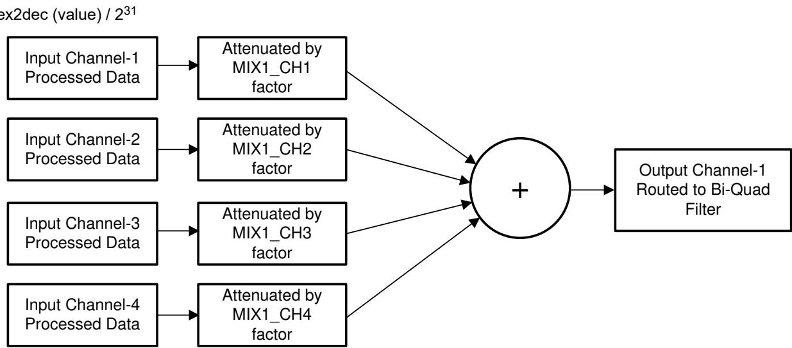  
图 7-18. Programmable Digital Mixer Block Diagram

混频器 2、混频器 3 和混频器 4 执行类似的混频操作，分别生成输出通道 2、通道 3 和通道 4。

## 7.3.6.7 可配置数字抽取滤波器

器件录音通道包括一个高动态范围的内置数字抽取滤波器，用于处理来自数字麦克风的过采样 PDM 数据流，以生成与 FSYNC 速率相同的奈奎斯特采样率的数字数据。抽取滤波器可以从三种不同类型中选择，具体取决于目标应用所需的频率响应、群延迟和相位线性度要求。抽取滤波器选项的选择可通过配置 DECI_FILT (P0_R107_D[5:4]) 寄存器位来完成。表 7-18 显示了录音通道抽取滤波器模式选择的配置寄存器设置。

表 7-18. Decimation Filter Mode Selection for the Record Channel


| P0_R107_D[5:4] : DECI_FILT[1:0] | 抽取滤波器模式选择 |
| --- | --- |
| 00 (default) | 线性相位滤波器用于抽取 |
| 01 | 低延迟滤波器用于抽取 |
| 10 | 超低延迟滤波器用于抽取 |
| 11 | 保留（请勿使用此设置） |


## 7.3.6.7.1 线性相位滤波器

线性相位抽取滤波器是器件设置的默认滤波器，可用于需要在滤波器通带规格内具有完美线性相位且零相位偏差的所有应用。本节列出了所有支持的输出采样率的滤波器性能规格和各种图表。

## 7.3.6.7.1.1 采样率：7.35kHz 至 8kHz

图 7-19 和图 7-20 分别显示了采样率为 7.35kHz 至 8kHz 的抽取滤波器的幅度响应和通带纹波。表 7-19 列出了 7.35kHz 至 8kHz 采样率抽取滤波器的规格。

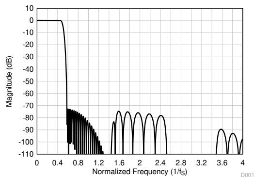  
图 7-19. 线性相位抽取滤波器幅度响应

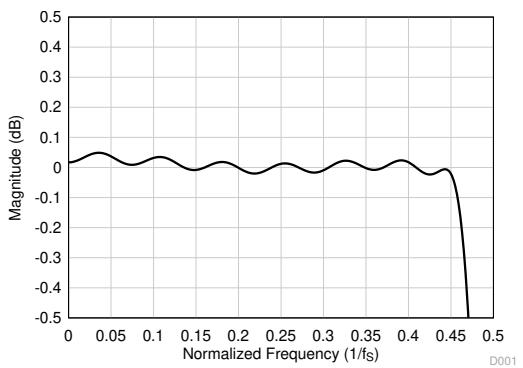  
图 7-20. 线性相位抽取滤波器通带纹波

表 7-19. 线性相位抽取滤波器规格


| 参数 | 测试条件 | MIN | TYP | MAX | 单位 |
| --- | --- | --- | --- | --- | --- |
| Pass-band ripple | Frequency range is 0 to  $0.454 \times f_{S}$ | -0.05 |  | 0.05 | dB |
| Stop-band attenuation | Frequency range is  $0.58 \times f_{S}$  to  $4 \times f_{S}$ | 72.7 |  |  | dB |
| Stop-band attenuation | Frequency range is  $4 \times f_{S}$  onwards | 81.2 |  |  | dB |
| Group delay or latency | Frequency range is 0 to  $0.454 \times f_{S}$ |  | 17.1 |  | $1/f_{S}$ |


## 7.3.6.7.1.2 采样率：14.7kHz 至 16kHz

图 7-21 和图 7-22 分别显示了采样率为 14.7kHz 至 16kHz 的抽取滤波器的幅度响应和通带纹波。表 7-20 列出了 14.7kHz 至 16kHz 采样率抽取滤波器的规格。

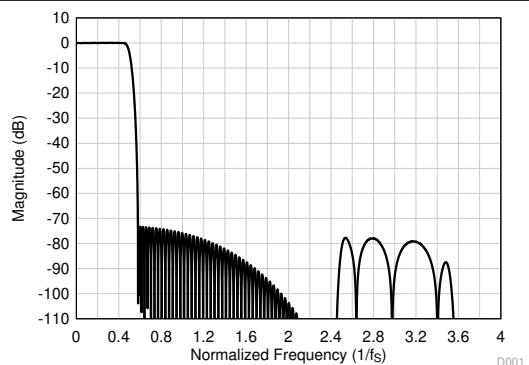  
图 7-21. 线性相位抽取滤波器幅度响应

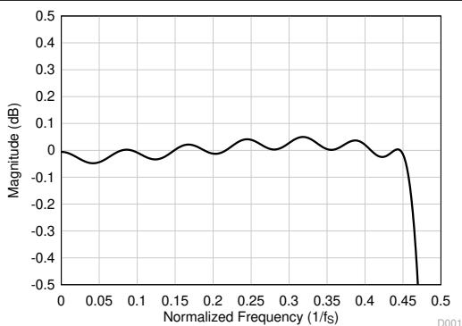  
图 7-22. 线性相位抽取滤波器通带纹波

表 7-20. 线性相位抽取滤波器规格


| 参数 | 测试条件 | MIN | TYP | MAX | 单位 |
| --- | --- | --- | --- | --- | --- |
| Pass-band ripple | Frequency range is 0 to  $0.454 \times f_{S}$ | -0.05 |  | 0.05 | dB |
| Stop-band attenuation | Frequency range is  $0.58 \times f_{S}$  to  $4 \times f_{S}$ | 73.3 |  |  | dB |
| Stop-band attenuation | Frequency range is  $4 \times f_{S}$  onwards | 95.0 |  |  | dB |
| Group delay or latency | Frequency range is 0 to  $0.454 \times f_{S}$ |  | 15.7 |  | $1/f_{S}$ |


## 7.3.6.7.1.3 采样率：22.05kHz 至 24kHz

图 7-23 和图 7-24 分别显示了采样率为 22.05kHz 至 24kHz 的抽取滤波器的幅度响应和通带纹波。表 7-21 列出了 22.05kHz 至 24kHz 采样率抽取滤波器的规格。

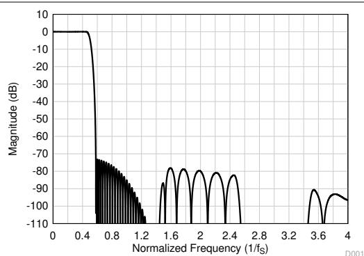  
图 7-23. 线性相位抽取滤波器幅度响应

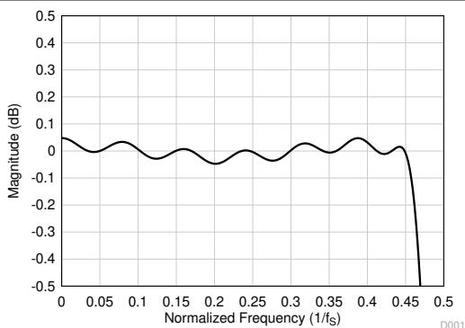  
图 7-24. 线性相位抽取滤波器通带纹波

表 7-21. 线性相位抽取滤波器规格


| 参数 | 测试条件 | MIN | TYP | MAX | 单位 |
| --- | --- | --- | --- | --- | --- |
| Pass-band ripple | Frequency range is 0 to  $0.454 \times f_{S}$ | -0.05 |  | 0.05 | dB |
| Stop-band attenuation | Frequency range is  $0.58 \times f_{S}$  to  $4 \times f_{S}$ | 73.0 |  |  | dB |
| Stop-band attenuation | Frequency range is  $4 \times f_{S}$  onwards | 96.4 |  |  | dB |
| Group delay or latency | Frequency range is 0 to  $0.454 \times f_{S}$ |  | 16.6 |  | $1/f_{S}$ |


## 7.3.6.7.1.4 采样率：29.4kHz 至 32kHz

图 7-25 和图 7-26 分别显示了采样率为 29.4kHz 至 32kHz 的抽取滤波器的幅度响应和通带纹波。表 7-22 列出了 29.4kHz 至 32kHz 采样率抽取滤波器的规格。

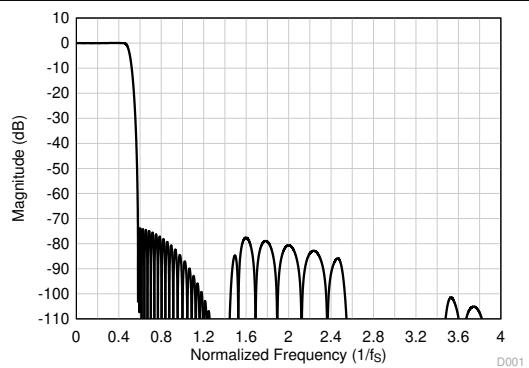  
图 7-25. 线性相位抽取滤波器幅度响应

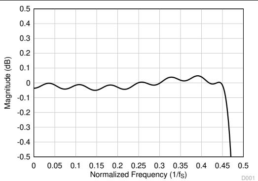  
图 7-26. 线性相位抽取滤波器通带纹波

表 7-22. 线性相位抽取滤波器规格


| 参数 | 测试条件 | MIN | TYP | MAX | 单位 |
| --- | --- | --- | --- | --- | --- |
| Pass-band ripple | Frequency range is 0 to  $0.454 \times f_{S}$ | -0.05 |  | 0.05 | dB |
| Stop-band attenuation | Frequency range is  $0.58 \times f_{S}$  to  $4 \times f_{S}$ | 73.7 |  |  | dB |
| Stop-band attenuation | Frequency range is  $4 \times f_{S}$  onwards | 107.2 |  |  | dB |
| Group delay or latency | Frequency range is 0 to  $0.454 \times f_{S}$ |  | 16.9 |  | $1/f_{S}$ |


## 7.3.6.7.1.5 采样率：44.1kHz 至 48kHz

图 7-27 和图 7-28 分别显示了采样率为 44.1kHz 至 48kHz 的抽取滤波器的幅度响应和通带纹波。表 7-23 列出了 44.1kHz 至 48kHz 采样率抽取滤波器的规格。

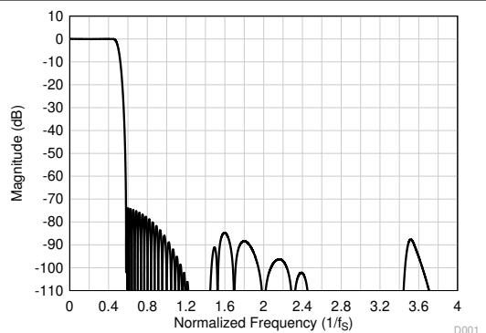  
图 7-27. 线性相位抽取滤波器幅度响应

  
图 7-28. 线性相位抽取滤波器通带纹波

表 7-23. 线性相位抽取滤波器规格


| 参数 | 测试条件 | MIN | TYP | MAX | 单位 |
| --- | --- | --- | --- | --- | --- |
| Pass-band ripple | Frequency range is 0 to  $0.454 \times f_{S}$ | -0.05 |  | 0.05 | dB |
| Stop-band attenuation | Frequency range is  $0.58 \times f_{S}$  to  $4 \times f_{S}$ | 73.8 |  |  | dB |
| Stop-band attenuation | Frequency range is  $4 \times f_{S}$  onwards | 98.1 |  |  | dB |
| Group delay or latency | Frequency range is 0 to  $0.454 \times f_{S}$ |  | 17.1 |  | $1/f_{S}$ |


## 7.3.6.7.1.6 采样率：88.2kHz 至 96kHz

图 7-29 和图 7-30 分别显示了采样率为 88.2kHz 至 96kHz 的抽取滤波器的幅度响应和通带纹波。表 7-24 列出了 88.2kHz 至 96kHz 采样率抽取滤波器的规格。

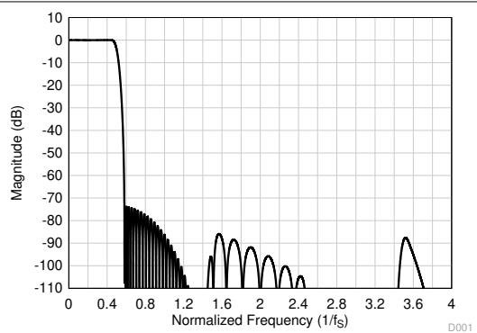  
图 7-29. 线性相位抽取滤波器幅度响应

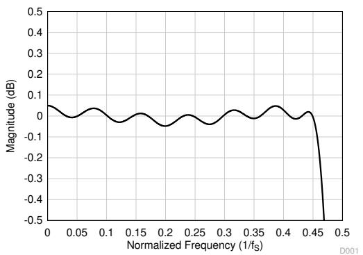  
图 7-30. 线性相位抽取滤波器通带纹波

表 7-24. 线性相位抽取滤波器规格


| 参数 | 测试条件 | MIN | TYP | MAX | 单位 |
| --- | --- | --- | --- | --- | --- |
| Pass-band ripple | Frequency range is 0 to  $0.454 \times f_{S}$ | -0.05 |  | 0.05 | dB |
| Stop-band attenuation | Frequency range is  $0.58 \times f_{S}$  to  $4 \times f_{S}$ | 73.6 |  |  | dB |
| Stop-band attenuation | Frequency range is  $4 \times f_{S}$  onwards | 97.9 |  |  | dB |
| Group delay or latency | Frequency range is 0 to  $0.454 \times f_{S}$ |  | 17.1 |  | $1/f_{S}$ |


## 7.3.6.7.1.7 采样率：176.4kHz 至 192kHz

图 7-31 和图 7-32 分别显示了采样率为 176.4kHz 至 192kHz 的抽取滤波器的幅度响应和通带纹波。表 7-25 列出了 176.4kHz 至 192kHz 采样率抽取滤波器的规格。
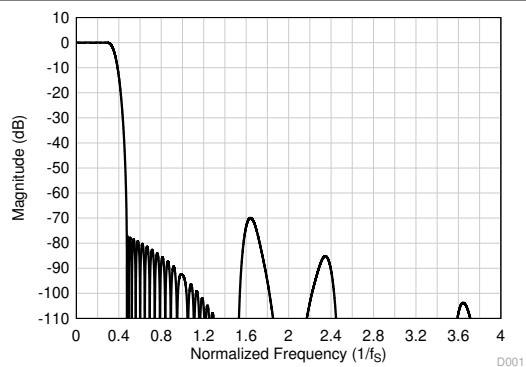  
图 7-31. 线性相位抽取滤波器幅度响应

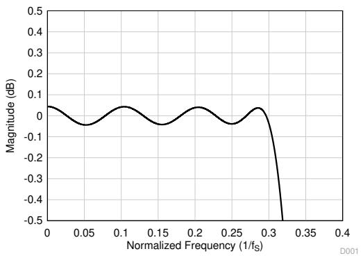  
图 7-32. 线性相位抽取滤波器通带纹波

表 7-25. 线性相位抽取滤波器规格


| 参数 | 测试条件 | MIN | TYP | MAX | 单位 |
| --- | --- | --- | --- | --- | --- |
| Pass-band ripple | Frequency range is 0 to  $0.3 \times f_{S}$ | -0.05 |  | 0.05 | dB |
| Stop-band attenuation | Frequency range is  $0.473 \times f_{S}$  to  $4 \times f_{S}$ | 70.0 |  |  | dB |
| Stop-band attenuation | Frequency range is  $4 \times f_{S}$  onwards | 111.0 |  |  | dB |
| Group delay or latency | Frequency range is 0 to  $0.3 \times f_{S}$ |  | 11.9 |  | $1/f_{S}$ |


## 7.3.6.7.1.8 采样率：352.8kHz 至 384kHz

图 7-33 和图 7-34 分别显示了采样率为 352.8kHz 至 384kHz 的抽取滤波器的幅度响应和通带纹波。表 7-26 列出了 352.8kHz 至 384kHz 采样率抽取滤波器的规格。

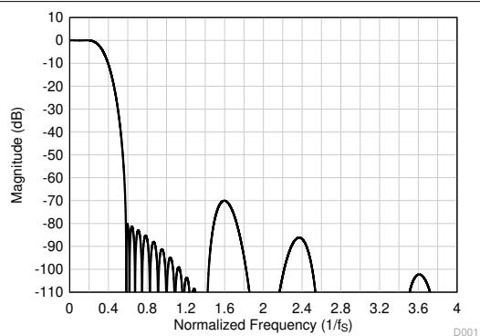  
图 7-33. 线性相位抽取滤波器幅度响应

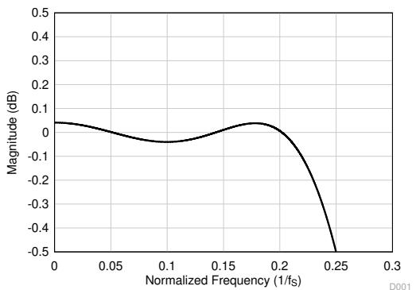  
图 7-34. 线性相位抽取滤波器通带纹波

表 7-26. 线性相位抽取滤波器规格


| 参数 | 测试条件 | MIN | TYP | MAX | 单位 |
| --- | --- | --- | --- | --- | --- |
| Pass-band ripple | Frequency range is 0 to  $0.212 \times f_{S}$ | -0.05 |  | 0.05 | dB |
| Stop-band attenuation | Frequency range is  $0.58 \times f_{S}$  to  $4 \times f_{S}$ | 70.0 |  |  | dB |
| Stop-band attenuation | Frequency range is  $4 \times f_{S}$  onwards | 108.8 |  |  | dB |
| Group delay or latency | Frequency range is 0 to  $0.212 \times f_{S}$ |  | 7.2 |  | $1/f_{S}$ |


## 7.3.6.7.1.9 采样率：705.6kHz 至 768kHz

图 7-35 和图 7-36 分别显示了采样率为 705.6kHz 至 768kHz 的抽取滤波器的幅度响应和通带纹波。表 7-27 列出了 705.6kHz 至 768kHz 采样率抽取滤波器的规格。

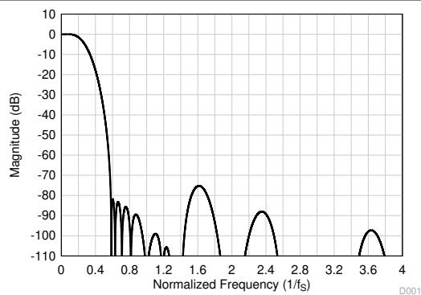  
图 7-35. 线性相位抽取滤波器幅度响应

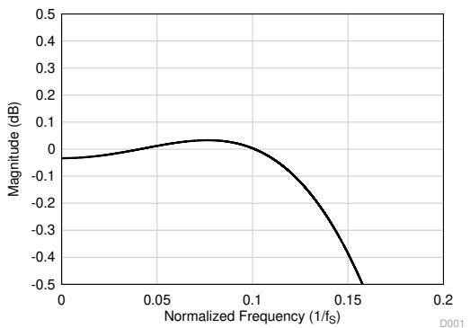  
图 7-36. 线性相位抽取滤波器通带纹波

表 7-27. 线性相位抽取滤波器规格


| 参数 | 测试条件 | MIN | TYP | MAX | 单位 |
| --- | --- | --- | --- | --- | --- |
| Pass-band ripple | Frequency range is 0 to  $0.113 \times f_{S}$ | -0.05 |  | 0.05 | dB |
| Stop-band attenuation | Frequency range is  $0.58 \times f_{S}$  to  $2 \times f_{S}$ | 75.0 |  |  | dB |
| Stop-band attenuation | Frequency range is  $2 \times f_{S}$  onwards | 88.0 |  |  | dB |
| Group Delay or Latency | Frequency range is 0 to  $0.113 \times f_{S}$ |  | 5.9 |  | $1/f_{S}$ |


## 7.3.6.7.2 低延迟滤波器

对于低延迟和最小相位偏差（在音频频带内）至关重要的应用，可使用 PCMD3140 上的低延迟抽取滤波器。该器件支持这些滤波器，群延迟约为七个采样点，在 $0 . 3 6 5 \times \mathsf { f } _ { \mathsf { S } }$ 频率范围内具有几乎线性的相位响应。本节提供了低延迟滤波器所有支持的输出采样率的滤波器性能规格和各种图表。

## 7.3.6.7.2.1 采样率：14.7kHz 至 16kHz

图 7-37 显示了幅度响应，图 7-38 显示了采样率为 14.7kHz 至 16kHz 的抽取滤波器的通带纹波和相位偏差。表 7-28 列出了 14.7kHz 至 16kHz 采样率抽取滤波器的规格。

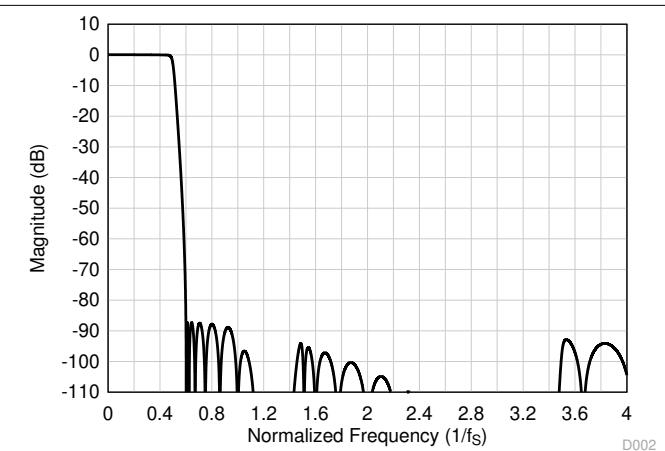  
图 7-37. 低延迟抽取滤波器幅度响应

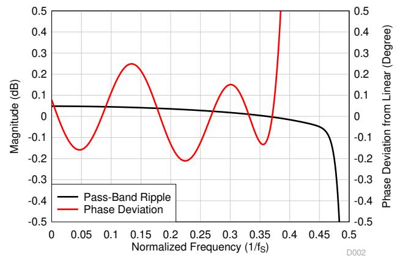  
图 7-38. 低延迟抽取滤波器通带纹波和相位偏差

表 7-28. 低延迟抽取滤波器规格


| 参数 | 测试条件 | MIN | TYP | MAX | 单位 |
| --- | --- | --- | --- | --- | --- |
| Pass-band ripple | Frequency range is 0 to  $0.451 \times f_{S}$ | -0.05 |  | 0.05 | dB |
| Stop-band attenuation | Frequency range is  $0.61 \times f_{S}$  onwards | 87.3 |  |  | dB |
| Group delay or latency | Frequency range is 0 to  $0.363 \times f_{S}$ |  | 7.6 |  | $1/f_{S}$ |
| Group delay deviation | Frequency range is 0 to  $0.363 \times f_{S}$ | -0.022 |  | 0.022 | $1/f_{S}$ |
| Phase deviation | Frequency range is 0 to  $0.363 \times f_{S}$ | -0.21 |  | 0.25 | 度 |


## 7.3.6.7.2.2 采样率：22.05kHz 至 24kHz

图 7-39 显示了幅度响应，图 7-40 显示了采样率为 22.05kHz 至 24kHz 的抽取滤波器的通带纹波和相位偏差。表 7-29 列出了 22.05kHz 至 24kHz 采样率抽取滤波器的规格。

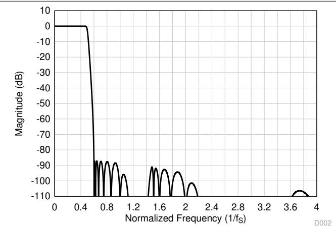  
图 7-39. 低延迟抽取滤波器幅度响应

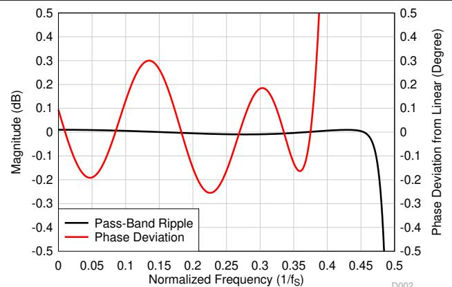  
图 7-40. 低延迟抽取滤波器通带纹波和相位偏差

表 7-29. 低延迟抽取滤波器规格


| 参数 | 测试条件 | MIN | TYP | MAX | 单位 |
| --- | --- | --- | --- | --- | --- |
| Pass-band ripple | Frequency range is 0 to  $0.459 \times f_{S}$ | -0.01 |  | 0.01 | dB |
| Stop-band attenuation | Frequency range is  $0.6 \times f_{S}$  onwards | 87.2 |  |  | dB |
| Group delay or latency | Frequency range is 0 to  $0.365 \times f_{S}$ |  | 7.5 |  | $1/f_{S}$ |
| Group delay deviation | Frequency range is 0 to  $0.365 \times f_{S}$ | -0.026 |  | 0.026 | $1/f_{S}$ |
| Phase deviation | Frequency range is 0 to  $0.365 \times f_{S}$ | -0.26 |  | 0.30 | 度 |


## 7.3.6.7.2.3 采样率：29.4kHz 至 32kHz

图 7-41 显示了幅度响应，图 7-42 显示了采样率为 29.4kHz 至 32kHz 的抽取滤波器的通带纹波和相位偏差。表 7-30 列出了 29.4kHz 至 32kHz 采样率抽取滤波器的规格。

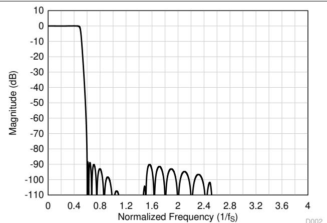  
图 7-41. 低延迟抽取滤波器幅度响应

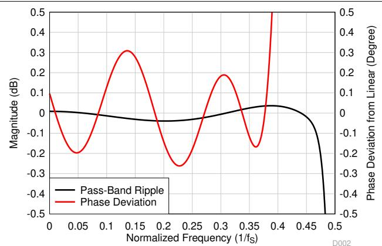  
图 7-42. 低延迟抽取滤波器通带纹波和相位偏差

表 7-30. 低延迟抽取滤波器规格


| 参数 | 测试条件 | MIN | TYP | MAX | 单位 |
| --- | --- | --- | --- | --- | --- |
| Pass-band ripple | Frequency range is 0 to  $0.457 \times f_{S}$ | -0.04 |  | 0.04 | dB |
| Stop-band attenuation | Frequency range is  $0.6 \times f_{S}$  onwards | 88.3 |  |  | dB |
| Group delay or latency | Frequency range is 0 to  $0.368 \times f_{S}$ |  | 8.7 |  | $1/f_{S}$ |
| Group delay deviation | Frequency range is 0 to  $0.368 \times f_{S}$ | -0.026 |  | 0.026 | $1/f_{S}$ |
| Phase deviation | Frequency range is 0 to  $0.368 \times f_{S}$ | -0.26 |  | 0.31 | 度 |


7.3.6.7.2.4 采样率：44.1kHz 至 48kHz

图 7-43 显示了幅度响应，图 7-44 显示了采样率为 44.1kHz 至 48kHz 的抽取滤波器的通带纹波和相位偏差。表 7-31 列出了 44.1kHz 至 48kHz 采样率抽取滤波器的规格。

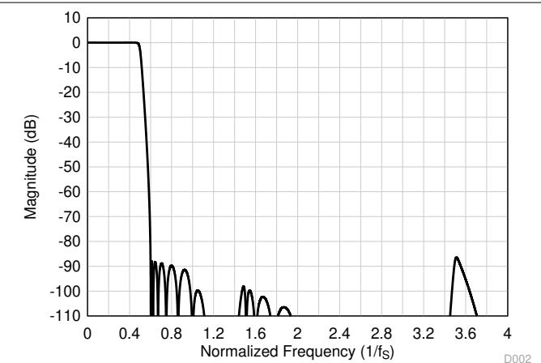  
图 7-43. 低延迟抽取滤波器幅度响应

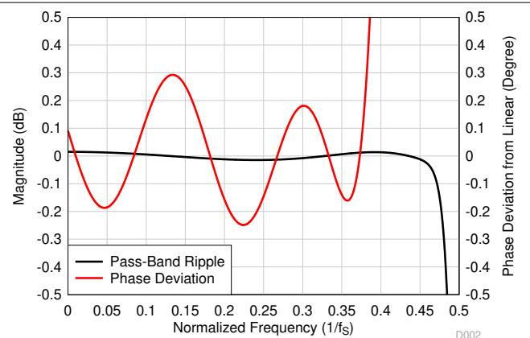  
图 7-44. 低延迟抽取滤波器通带纹波和相位偏差

表 7-31. 低延迟抽取滤波器规格


| 参数 | 测试条件 | MIN | TYP | MAX | 单位 |
| --- | --- | --- | --- | --- | --- |
| Pass-band ripple | Frequency range is 0 to  $0.452 \times f_{S}$ | -0.015 |  | 0.015 | dB |
| Stop-band attenuation | Frequency range is  $0.6 \times f_{S}$  onwards | 86.4 |  |  | dB |
| Group delay or latency | Frequency range is 0 to  $0.365 \times f_{S}$ |  | 7.7 |  | $1/f_{S}$ |
| Group delay deviation | Frequency range is 0 to  $0.365 \times f_{S}$ | -0.027 |  | 0.027 | $1/f_{S}$ |
| Phase deviation | Frequency range is 0 to  $0.365 \times f_{S}$ | -0.25 |  | 0.30 | 度 |


## 7.3.6.7.2.5 采样率：88.2kHz 至 96kHz

图 7-45 显示了幅度响应，图 7-46 显示了采样率为 88.2kHz 至 96kHz 的抽取滤波器的通带纹波和相位偏差。表 7-32 列出了 88.2kHz 至 96kHz 采样率抽取滤波器的规格。

  
图 7-45. 低延迟抽取滤波器幅度响应

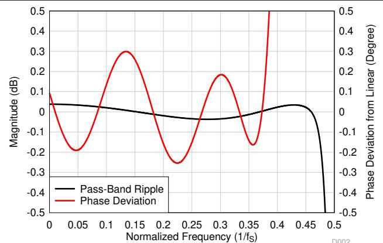  
图 7-46. 低延迟抽取滤波器通带纹波和相位偏差

表 7-32. 低延迟抽取滤波器规格


| 参数 | 测试条件 | MIN | TYP | MAX | 单位 |
| --- | --- | --- | --- | --- | --- |
| Pass-band ripple | Frequency range is 0 to  $0.466 \times f_{S}$ | -0.04 |  | 0.04 | dB |
| Stop-band attenuation | Frequency range is  $0.6 \times f_{S}$  onwards | 86.3 |  |  | dB |
| Group delay or latency | Frequency range is 0 to  $0.365 \times f_{S}$ |  | 7.7 |  | $1/f_{S}$ |
| Group delay deviation | Frequency range is 0 to  $0.365 \times f_{S}$ | -0.027 |  | 0.027 | $1/f_{S}$ |
| Phase deviation | Frequency range is 0 to  $0.365 \times f_{S}$ | -0.26 |  | 0.30 | 度 |


7.3.6.7.2.6 采样率：176.4kHz 至 192kHz

图 7-47 显示了幅度响应，图 7-48 显示了采样率为 176.4kHz 至 192kHz 的抽取滤波器的通带纹波和相位偏差。表 7-33 列出了 176.4kHz 至 192kHz 采样率抽取滤波器的规格。

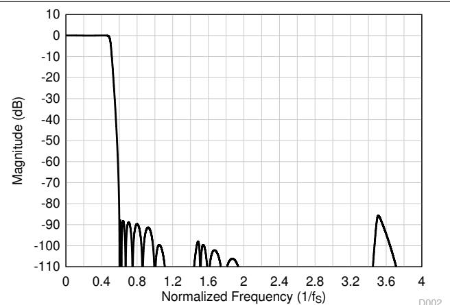  
图 7-47. 低延迟抽取滤波器幅度响应

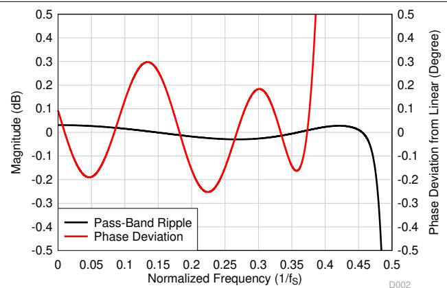  
图 7-48. 低延迟抽取滤波器通带纹波和相位偏差

表 7-33. 低延迟抽取滤波器规格


| 参数 | 测试条件 | MIN | TYP | MAX | 单位 |
| --- | --- | --- | --- | --- | --- |
| Pass-band ripple | Frequency range is 0 to  $463 \times f_{S}$ | -0.03 |  | 0.03 | dB |
| Stop-band attenuation | Frequency range is  $0.6 \times f_{S}$  onwards | 85.6 |  |  | dB |
| Group delay or latency | Frequency range is 0 to  $0.365 \times f_{S}$ |  | 7.7 |  | $1/f_{S}$ |
| Group delay deviation | Frequency range is 0 to  $0.365 \times f_{S}$ | -0.027 |  | 0.027 | $1/f_{S}$ |
| Phase deviation | Frequency range is 0 to  $0.365 \times f_{S}$ | -0.26 |  | 0.30 | 度 |


## 7.3.6.7.3 超低延迟滤波器

对于超低延迟（在音频频带内）至关重要的应用，可使用 PCMD3140 上的超低延迟抽取滤波器。该器件支持这些滤波器，群延迟约为四个采样点，在 0.325 × f<sub>S</sub> 频率范围内具有几乎线性的相位响应。本节提供了超低延迟滤波器所有支持的输出采样率的滤波器性能规格和各种图表。

## 7.3.6.7.3.1 采样率：14.7kHz 至 16kHz

图 7-49 显示了幅度响应，图 7-50 显示了采样率为 14.7kHz 至 16kHz 的抽取滤波器的通带纹波和相位偏差。表 7-34 列出了 14.7kHz 至 16kHz 采样率抽取滤波器的规格。

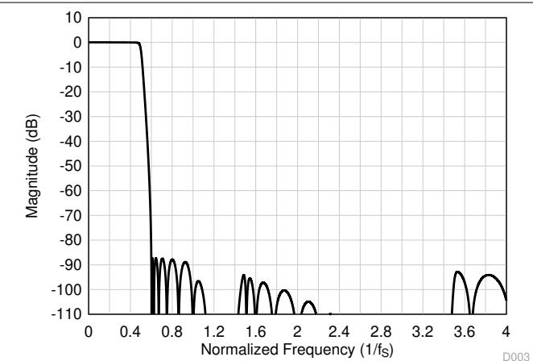  
图 7-49. Ultra-低延迟抽取滤波器幅度响应

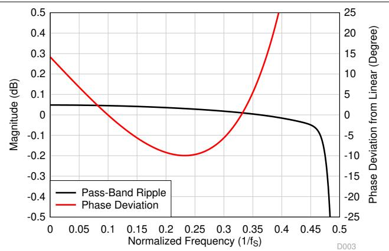  
图 7-50. Ultra-低延迟抽取滤波器通带纹波和相位偏差

表 7-34. Ultra-低延迟抽取滤波器规格


| 参数 | 测试条件 | MIN | TYP | MAX | 单位 |
| --- | --- | --- | --- | --- | --- |
| Pass-band ripple | Frequency range is 0 to  $0.45 \times f_{S}$ | -0.05 |  | 0.05 | dB |
| Stop-band attenuation | Frequency range is  $0.6 \times f_{S}$  onwards | 87.2 |  |  | dB |
| Group delay or latency | Frequency range is 0 to  $0.325 \times f_{S}$ |  | 4.3 |  | $1/f_{S}$ |
| Group delay deviation | Frequency range is 0 to  $0.325 \times f_{S}$ | -0.512 |  | 0.512 | $1/f_{S}$ |
| Phase deviation | Frequency range is 0 to  $0.325 \times f_{S}$ | -10.0 |  | 14.2 | 度 |


## 7.3.6.7.3.2 采样率：22.05kHz 至 24kHz

图 7-51 显示了幅度响应，图 7-52 显示了采样率为 22.05kHz 至 24kHz 的抽取滤波器的通带纹波和相位偏差。表 7-35 列出了 22.05kHz 至 24kHz 采样率抽取滤波器的规格。

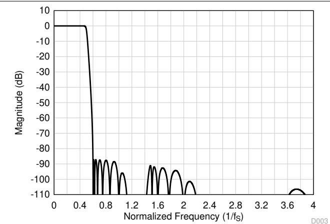  
图 7-51. Ultra-低延迟抽取滤波器幅度响应

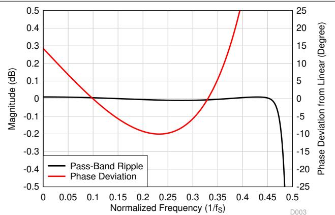  
图 7-52. Ultra-低延迟抽取滤波器通带纹波和相位偏差

表 7-35. Ultra-低延迟抽取滤波器规格


| 参数 | 测试条件 | MIN | TYP | MAX | 单位 |
| --- | --- | --- | --- | --- | --- |
| Pass-band ripple | Frequency range is 0 to  $0.46 \times f_{S}$ | -0.01 |  | 0.01 | dB |
| Stop-band attenuation | Frequency range is  $0.6 \times f_{S}$  onwards | 87.1 |  |  | dB |
| Group delay or latency | Frequency range is 0 to  $0.325 \times f_{S}$ |  | 4.1 |  | $1/f_{S}$ |
| Group delay deviation | Frequency range is 0 to  $0.325 \times f_{S}$ | -0.514 |  | 0.514 | $1/f_{S}$ |
| Phase deviation | Frequency range is 0 to  $0.325 \times f_{S}$ | -10.0 |  | 14.3 | 度 |


## 7.3.6.7.3.3 采样率：29.4kHz 至 32kHz

图 7-53 显示了幅度响应，图 7-54 显示了采样率为 29.4kHz 至 32kHz 的抽取滤波器的通带纹波和相位偏差。表 7-36 列出了 29.4kHz 至 32kHz 采样率抽取滤波器的规格。

  
图 7-53. Ultra-低延迟抽取滤波器幅度响应

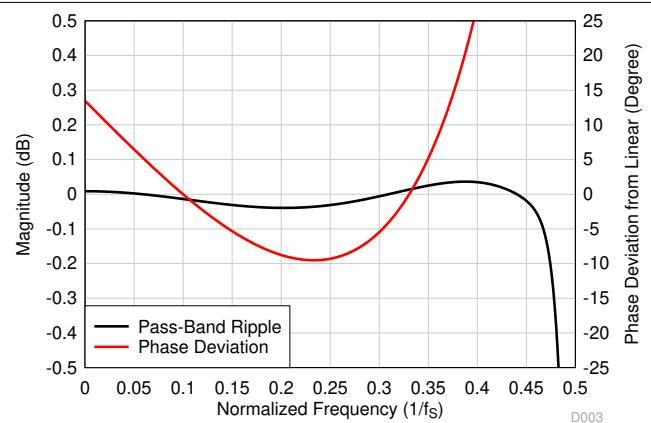  
图 7-54. Ultra-低延迟抽取滤波器通带纹波和相位偏差

表 7-36. Ultra-低延迟抽取滤波器规格


| 参数 | 测试条件 | MIN | TYP | MAX | 单位 |
| --- | --- | --- | --- | --- | --- |
| Pass-band ripple | Frequency range is 0 to  $0.457 \times f_{S}$ | -0.04 |  | 0.04 | dB |
| Stop-band attenuation | Frequency range is  $0.6 \times f_{S}$  onwards | 88.3 |  |  | dB |
| Group delay or latency | Frequency range is 0 to  $0.325 \times f_{S}$ |  | 5.2 |  | $1/f_{S}$ |
| Group delay deviation | Frequency range is 0 to  $0.325 \times f_{S}$ | -0.492 |  | 0.492 | $1/f_{S}$ |
| Phase deviation | Frequency range is 0 to  $0.325 \times f_{S}$ | -9.5 |  | 13.5 | 度 |


7.3.6.7.3.4 采样率：44.1kHz 至 48kHz

图 7-55 显示了幅度响应，图 7-56 显示了采样率为 44.1kHz 至 48kHz 的抽取滤波器的通带纹波和相位偏差。表 7-37 列出了 44.1kHz 至 48kHz 采样率抽取滤波器的规格。

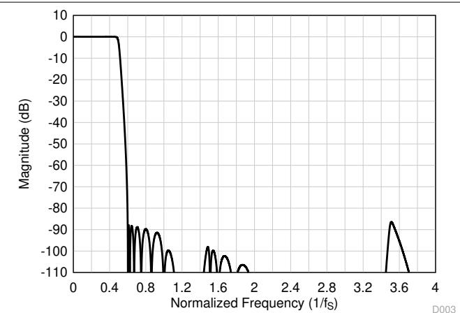  
图 7-55. Ultra-低延迟抽取滤波器幅度响应

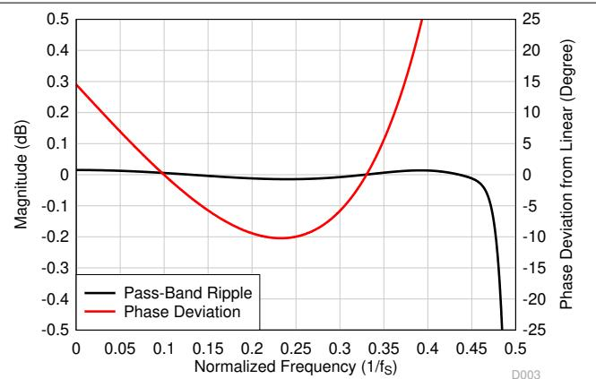  
图 7-56. Ultra-低延迟抽取滤波器通带纹波和相位偏差

表 7-37. Ultra-低延迟抽取滤波器规格


| 参数 | 测试条件 | MIN | TYP | MAX | 单位 |
| --- | --- | --- | --- | --- | --- |
| Pass-band ripple | Frequency range is 0 to  $0.452 \times f_{S}$ | -0.015 |  | 0.015 | dB |
| Stop-band attenuation | Frequency range is  $0.6 \times f_{S}$  onwards | 86.4 |  |  | dB |
| Group delay or latency | Frequency range is 0 to  $0.325 \times f_{S}$ |  | 4.1 |  | $1/f_{S}$ |
| Group delay deviation | Frequency range is 0 to  $0.325 \times f_{S}$ | -0.525 |  | 0.525 | $1/f_{S}$ |
| Phase deviation | Frequency range is 0 to  $0.325 \times f_{S}$ | -10.3 |  | 14.5 | 度 |


## 7.3.6.7.3.5 采样率：88.2kHz 至 96kHz

图 7-57 显示了幅度响应，图 7-58 显示了采样率为 88.2kHz 至 96kHz 的抽取滤波器的通带纹波和相位偏差。表 7-38 列出了 88.2kHz 至 96kHz 采样率抽取滤波器的规格。

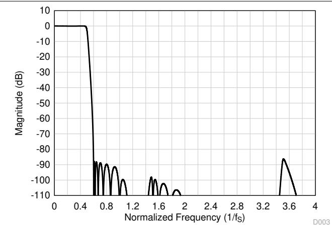  
图 7-57. Ultra-低延迟抽取滤波器幅度响应

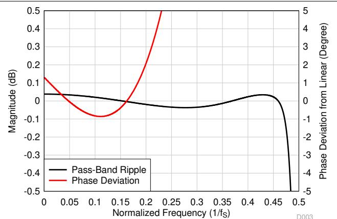  
图 7-58. Ultra-低延迟抽取滤波器通带纹波和相位偏差

表 7-38. Ultra-低延迟抽取滤波器规格


| 参数 | 测试条件 | MIN | TYP | MAX | 单位 |
| --- | --- | --- | --- | --- | --- |
| Pass-band ripple | Frequency range is 0 to  $0.466 \times f_{S}$ | -0.04 |  | 0.04 | dB |
| Stop-band attenuation | Frequency range is  $0.6 \times f_{S}$  onwards | 86.3 |  |  | dB |
| Group delay or latency | Frequency range is 0 to  $0.1625 \times f_{S}$ |  | 3.7 |  | $1/f_{S}$ |
| Group delay deviation | Frequency range is 0 to  $0.1625 \times f_{S}$ | -0.091 |  | 0.091 | $1/f_{S}$ |
| Phase deviation | Frequency range is 0 to  $0.1625 \times f_{S}$ | -0.86 |  | 1.30 | 度 |


## 7.3.6.7.3.6 采样率：176.4kHz 至 192kHz

图 7-59 显示了幅度响应，图 7-60 显示了采样率为 176.4kHz 至 192kHz 的抽取滤波器的通带纹波和相位偏差。表 7-39 列出了 176.4kHz 至 192kHz 采样率抽取滤波器的规格。

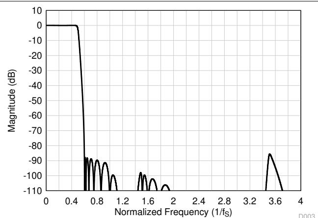  
图 7-59. Ultra-低延迟抽取滤波器幅度响应

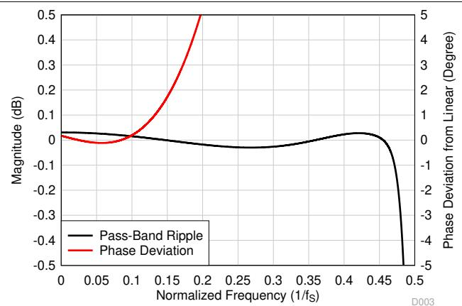  
图 7-60. Ultra-低延迟抽取滤波器通带纹波和相位偏差

表 7-39. Ultra-低延迟抽取滤波器规格


| 参数 | 测试条件 | MIN | TYP | MAX | 单位 |
| --- | --- | --- | --- | --- | --- |
| Pass-band ripple | Frequency range is 0 to  $0.463 \times f_{S}$ | -0.03 |  | 0.03 | dB |
| Stop-band attenuation | Frequency range is  $0.6 \times f_{S}$  onwards | 85.6 |  |  | dB |
| Group delay or latency | Frequency range is 0 to  $0.085 \times f_{S}$ |  | 3.7 |  | $1/f_{S}$ |
| Group delay deviation | Frequency range is 0 to  $0.085 \times f_{S}$ | -0.024 |  | 0.024 | $1/f_{S}$ |
| Phase deviation | Frequency range is 0 to  $0.085 \times f_{S}$ | -0.12 |  | 0.18 | 度 |


7.3.6.7.3.7 采样率：352.8kHz 至 384kHz

图 7-61 显示了幅度响应，图 7-62 显示了采样率为 352.8kHz 至 384kHz 的抽取滤波器的通带纹波和相位偏差。表 7-40 列出了 352.8kHz 至 384kHz 采样率抽取滤波器的规格。

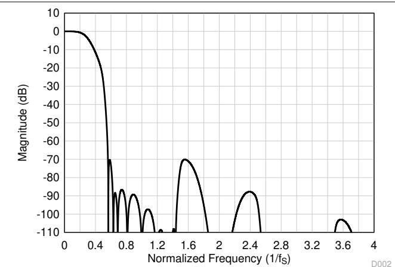  
图 7-61. Ultra-低延迟抽取滤波器幅度响应

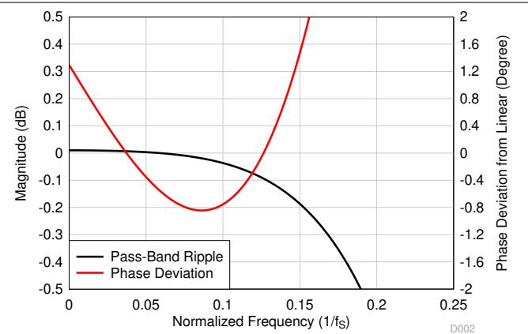  
图 7-62. Ultra-低延迟抽取滤波器通带纹波和相位偏差

表 7-40. Ultra-低延迟抽取滤波器规格


| 参数 | 测试条件 | MIN | TYP | MAX | 单位 |
| --- | --- | --- | --- | --- | --- |
| Pass-band ripple | Frequency range is 0 to  $0.1 \times f_{S}$ | -0.04 |  | 0.01 | dB |
| Stop-band attenuation | Frequency range is  $0.56 \times f_{S}$  onwards | 70.1 |  |  | dB |
| Group delay or latency | Frequency range is 0 to  $0.157 \times f_{S}$ |  | 4.1 |  | $1/f_{S}$ |
| Group delay deviation | Frequency range is 0 to  $0.157 \times f_{S}$ | -0.18 |  | 0.18 | $1/f_{S}$ |
| Phase deviation | Frequency range is 0 to  $0.157 \times f_{S}$ | -0.85 |  | 2.07 | 度 |


## 7.3.7 话音激活检测 (VAD)

PCMD3140 支持话音激活检测 (VAD) 模式。在此模式下，PCMD3140 持续监测其中一个输入通道以进行语音检测。在此模式下，器件从 AVDD 电源消耗低静态电流。此功能可通过将 VAD_EN (P0_R117_D0) 位设置为 1'b1 来使能。检测到语音活动时，PCMD3140 可通过中断提醒主机，或根据 I<sup>2</sup>C 编程配置自动唤醒并开始录音。此功能可通过 VAD_MODE (P1_R30_D[7:6]) 寄存器位进行配置。

VAD 的输入通道可通过将 VAD_CH_SEL (P1_R30_D[5:4]) 寄存器位设置为适当的值来选择。有关更多详细信息，请参阅《在 TLV320ADC5120 和 TLV320ADC6120 中使用话音激活检测器 (VAD)》应用报告。

## 7.3.8 中断、状态和数字 I/O 引脚复用

器件中的某些事件可能需要主机处理器干预，并可用于触发对主机处理器的中断。其中一个事件是音频串行接口 (ASI) 总线错误。如果检测到 ASI 总线错误时钟的任何故障，器件将关闭录音通道，例如：

• 无效的 FSYNC 频率

• 无效的 SBCLK 与 FSYNC 比率

• SBCLK 或 FSYNC 时钟长时间暂停

当检测到 ASI 总线时钟错误时，器件会尽快关闭录音通道。所有 ASI 总线时钟错误解决后，器件音量会斜坡恢复到之前的状态以恢复录音通道。在 ASI 总线时钟错误期间，如果时钟错误中断屏蔽寄存器位 INT_MASK0[7] (P0_R51_D7) 设置为低电平，内部中断请求 (IRQ) 中断信号将断言为低电平。时钟故障也可在锁存故障状态寄存器位 INT_LTCH0 (P0_R54) 中回读，该寄存器为只读寄存器。读取锁存故障状态寄存器 INT_LTCH0 会清除所有锁存故障状态。该器件还可额外配置为将内部 IRQ 中断信号路由到 GPIO1 或 GPOx 引脚上，也可配置为开漏输出，以便这些引脚可与其他器件的开漏中断输出进行线与连接。

IRQ 中断信号可通过设置 INT_POL (P0_R50_D7) 寄存器位配置为低电平有效或高电平有效极性。该信号还可通过编程 INT_EVENT[1:0] (P0_R50_D[6:5]) 寄存器位配置为单脉冲或一系列脉冲。如果中断配置为一系列脉冲，则事件触发脉冲开始，当读取锁存故障状态寄存器以确定中断原因时脉冲停止。

该器件还支持只读实时状态寄存器，用于确定通道是上电还是断电，以及器件是否处于睡眠模式。这些状态寄存器位于 DEV_STS0 (P0_R118) 和 DEV_STS1 (P0_R119) 寄存器中。

该器件具有一个多功能 GPIO1 引脚，可配置为所需的特定功能。此外，GPIx 和 GPOx 可根据系统应用需要分别重新用作多功能引脚 GPIx 和 GPOx。表 7-41 显示了这些多功能引脚针对各种特性的所有可能分配。

表 7-41. Multifunction Pin Assignments


| 行 | 引脚功能 | GPIO1 | GPO1 | GPI1 | GPI2 |
| --- | --- | --- | --- | --- | --- |
| — | — | GPIO1_CFG | GPO1_CFG | GPI1_CFG | GPI2_CFG |
| — | — | P0_R33[7:4] | P0_R34[7:4] | P0_R43[6:4] | P0_R43[2:0] |
| A | 引脚禁用 | $S^{(1)}$ | S（默认） | S（默认） | S（默认） |
| B | 通用输出 (GPO) | S | S | $NS^{(2)}$ | NS |
| C | 中断输出 (IRQ) | S（默认） | S | NS | NS |
| D | 所有录音通道断电 | S | NS | S | S |
| E | PDM 时钟输出 (PDMCLK) | S | S | NS | NS |
| F | MICBIAS 开/关输入 (BIASEN) | S | NS | NS | NS |
| G | 通用输入 (GPI) | S | NS | S | S |
| H | 主时钟输入 (MCLK) | S | NS | S | S |
| I | ASI 菊花链输入 (SDIN) | S | NS | S | S |
| J | PDM 数据输入 1 (PDMDIN1) | S | NS | S | S |
| K | PDM 数据输入 2 (PDMDIN2) | S | NS | S | S |


(1) S 表示此行提到的功能支持此列中提到的相应 GPIO1、GPOx 或 GPIx 引脚。  
(2) NS 表示此行提到的功能不支持此列中提到的相应 GPIO1、GPOx 或 GPIx 引脚。

每个 GPOx 或 GPIOx 引脚可分别使用 GPOx_DRV[3:0] 或 GPIO1_DRV[3:0] 寄存器位独立设置所需的驱动配置。表 7-42 列出了驱动配置设置。

表 7-42. GPIO or GPOx Pins Drive Configuration Settings


| P0_R33_D[3:0] : GPIO1_DRV[3:0] | GPIO1 的 GPIO 输出驱动配置设置 |
| --- | --- |
| 000 | GPIO1 引脚设置为高阻态（浮空） |
| 001 | GPIO1 引脚设置为驱动有效低电平或有效高电平 |
| 010 (default) | GPIO1 引脚设置为驱动有效低电平或弱高电平（片内上拉） |
| 011 | GPIO1 引脚设置为驱动有效低电平或高阻（浮空） |
| 100 | GPIO1 引脚设置为驱动弱低电平（片内下拉）或有效高电平 |
| 101 | GPIO1 引脚设置为驱动高阻（浮空）或有效高电平 |
| 110 and 111 | 保留（请勿使用这些设置） |


## Similarly, the GPO1 pin can be configured using the GPO1\_DRV (P0\_R34) register bits.

当配置为通用输出 (GPO) 时，GPIO1 或 GPOx 引脚值可通过写入 GPIO_VAL 或 GPOx_VAL (P0_R41) 寄存器来驱动。GPIO_MON (P0_R42) 寄存器可用于回读配置为通用输入 (GPI) 时 GPIO1 引脚的状态。同样，GPI_MON (P0_R47) 寄存器可用于回读配置为通用输入 (GPI) 时 GPIx 引脚的状态。

## 7.4 器件功能模式

## 7.4.1 睡眠模式或软件关断

在睡眠模式或软件关断模式下，器件从 AVDD 电源消耗非常低的静态电流，同时允许 I<sup>2</sup>C 通信唤醒器件以进行活动操作。

当主机设备将 SLEEP_ENZ (P0_R2_D0) 位设置为 1'b0 时，器件进入睡眠模式。如果在器件处于活动模式时 SLEEP_ENZ 位断言为低电平，器件会降低录音数据的音量，关闭模拟和数字模块，并进入睡眠模式。但是，器件仍继续保留器件配置寄存器和可编程系数的最后编程值。

在睡眠模式下，除了为进入活动模式而退出睡眠模式外，不要执行任何 I<sup>2</sup>C 事务。进入睡眠模式后，等待至少 10ms 再启动 I<sup>2</sup>C 事务以退出睡眠模式。

退出睡眠模式时，主机设备必须将 PCMD3140 配置为使用外部 1.8V AREG 电源（默认设置）或片内稳压器生成的 AREG 电源。要配置 AREG 电源，请写入同一 P0_R2 寄存器中的 AREG_SELECT（位 D7）。

## 7.4.2 活动模式

如果主机设备通过将 SLEEP_ENZ 位设置为 1'b1 退出睡眠模式，器件进入活动模式。在活动模式下，可进行 I<sup>2</sup>C 事务来配置和上电器件以进行活动操作。进入活动模式后，等待至少 1ms 再启动任何 I<sup>2</sup>C 事务，以使器件完成内部唤醒序列。

对页面 2、页面 3 和页面 4 中的可编程系数寄存器以及页面 0 中的通道配置寄存器 (CHx_CFG[1:4]) 的读写操作必须在退出睡眠模式 10ms 后进行。

在为目标应用和系统设置配置所有其他寄存器后，分别配置输入和输出通道使能寄存器 IN_CH_EN (P0_R115) 和 ASI_OUT_CH_EN (P0_R116)。最后，配置器件上电寄存器 PWR_CFG (P0_R117)。所有可编程系数值必须在上电相应通道之前写入。

在活动模式下，通过读取位于 DEV_STS0 (P0_R117) 和 DEV_STS1 (P0_R118) 寄存器中的只读器件状态位来监控各种模块的上电和断电状态。

## 7.4.3 软件复位

A software reset can be done any time by asserting the SW\_RESET (P0\_R1\_D0) bit, which is a self-clearing bit. This software reset immediately shuts down the device, and restores all device configuration registers and programmable coefficients to their default values.

## 7.5 编程

该器件包含配置寄存器和可编程系数，可根据特定系统和应用需求设置为所需值。这些寄存器称为器件控制寄存器，每个宽度为 8 位，使用页面方案映射。

每个页面包含 128 个配置寄存器。所有器件配置寄存器存储在页面 0 中，这是上电时和软件复位后的默认页面设置。所有可编程系数寄存器位于页面 2、页面 3 和页面 4 中。器件的当前页面可通过使用每个页面中寄存器 0 的 PAGE[7:0] 位切换到新的所需页面。

## 7.5.1 控制串行接口

器件控制寄存器可通过 I<sup>2</sup>C 通信访问。器件使用固定的 I<sup>2</sup>C 地址运行，可使用此地址进行配置。

## 7.5.1.1 I<sup>2</sup>C Control Interface

该器件作为从设备支持 I<sup>2</sup>C 控制协议，能够在标准模式、快速模式和快速模式+下运行。I<sup>2</sup>C 控制协议需要 7 位从地址。7 位从地址固定为 1001110，不可更改。如果 I2C_BRDCAST_EN (P0_R2_D2) 位设置为 1'b1，则 I<sup>2</sup>C 从地址固定为 1001100，以便同时向系统中包括 PCMD3140 和 PCMD3180 在内的多个器件进行 I<sup>2</sup>C 广播通信。表 7-43 列出了此配置产生的可能器件地址。

表 7-43. I<sup>2</sup>C Slave Address Settings


| I2C_BRDCAST_EN (P0_R2_D2) | I2C SLAVE ADDRESS |
| --- | --- |
| 0 (default) | 1001 110 |
| 1 | 1001 100 |


## 7.5.1.1.1 General I<sup>2</sup>C Operation

I<sup>2</sup>C 总线使用两个信号 SDA（数据）和 SCL（时钟），通过串行数据传输在系统中的集成电路之间进行通信。地址和数据 8 位字节以 MSB 优先的方式传输。此外，总线上传输的每个字节都由接收设备通过应答位进行确认。每个传输操作以主设备在总线上驱动起始条件开始，以主设备在总线上驱动停止条件结束。总线使用数据引脚 (SDA) 在时钟为逻辑高电平时的跳变来指示起始和停止条件。SDA 上的高至低跳变表示起始，低至高跳变表示停止。正常的数据位跳变必须在时钟周期的低电平时间内发生。

主设备驱动起始条件，后跟 7 位从地址和读/写 (R/W) 位，以开启与另一个设备的通信，然后等待应答条件。从设备在应答时钟周期内将 SDA 保持低电平以指示应答。当这发生时，主设备传输序列的下一个字节。每个从设备由唯一的 7 位从地址加上 R/W 位（1 字节）寻址。所有兼容设备通过使用线与连接的双向总线共享相同的信号。

在起始和停止条件之间可传输的字节数没有限制。当最后一个字传输完成时，主设备生成停止条件以释放总线。图 7-63 显示了一个通用数据传输序列。

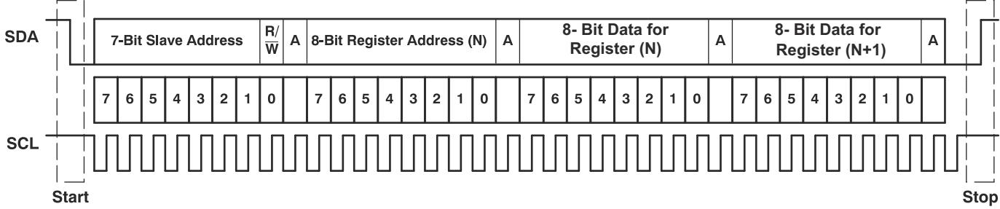  
图 7-63. Typical I<sup>2</sup>C Sequence

在系统中，为 SDA 和 SCL 信号使用外部上拉电阻以设置总线的逻辑高电平。SDA 和 SCL 电压不得超过器件电源电压 IOVDD。

## 7.5.1.1.2 I<sup>2</sup>C Single-Byte and Multiple-Byte Transfers

器件 I<sup>2</sup>C 接口支持所有寄存器的单字节和多字节读/写操作。在多字节读操作期间，只要主设备继续以应答响应，器件就会从分配的寄存器开始逐字节响应数据。

器件支持顺序 I<sup>2</sup>C 寻址。对于写事务，如果发出一个寄存器后跟该寄存器及随后所有剩余寄存器的数据，则发生顺序 I<sup>2</sup>C 写事务。对于 I<sup>2</sup>C 顺序写事务，发出的寄存器作为起始点，在传输停止或起始之前随后传输的数据量决定了写入多少个寄存器。

## 7.5.1.1.2.1 I<sup>2</sup>C Single-Byte Write

如图 7-64 所示，单字节数据写传输以主设备传输起始条件开始，后跟 I<sup>2</sup>C 器件地址和读/写位。读/写位决定数据传输的方向。对于写数据传输，读/写位必须设置为 0。在接收到正确的 I<sup>2</sup>C 从地址和读/写位后，器件以应答位 (ACK) 响应。接下来，主设备传输对应于正在访问的器件内部寄存器地址的寄存器字节。接收到寄存器字节后，器件再次以应答位 (ACK) 响应。然后，主设备传输要写入指定寄存器的数据字节。完成后，从设备以应答位 (ACK) 响应。最后，主设备传输停止条件以完成单字节数据写传输。

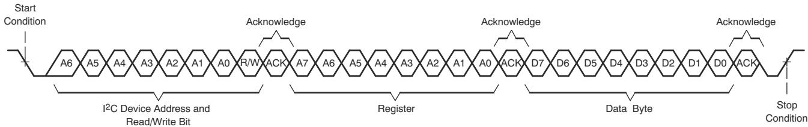  
图 7-64. I<sup>2</sup>C Single-Byte Write Transfer

## 7.5.1.1.2.2 I<sup>2</sup>C Multiple-Byte Write

如图 7-65 所示，多字节数据写传输与单字节数据写传输相同，只是主设备向从设备传输多个数据字节。在接收到每个数据字节后，器件以应答位 (ACK) 响应。最后，主设备在最后一个数据字节写传输后传输停止条件。

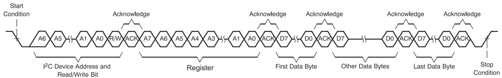  
图 7-65. I<sup>2</sup>C Multiple-Byte Write Transfer

## 7.5.1.1.2.3 I<sup>2</sup>C Single-Byte Read

如图 7-66 所示，单字节数据读传输以主设备传输起始条件开始，后跟 I<sup>2</sup>C 从地址和读/写位。对于数据读传输，先执行写操作，然后执行读操作。首先，执行写操作以传输要读取的内部寄存器地址的地址字节。因此，读/写位设置为 0。

在接收到从地址和读/写位后，器件以应答位 (ACK) 响应。然后主设备发送内部寄存器地址字节，之后器件发出应答位 (ACK)。主设备传输另一个起始条件，再次后跟从地址和读/写位。这次读/写位设置为 1，表示读传输。接下来，器件从正在读取的寄存器地址传输数据字节。接收到数据字节后，主设备传输非应答 (NACK)，后跟停止条件，以完成单字节数据读传输。

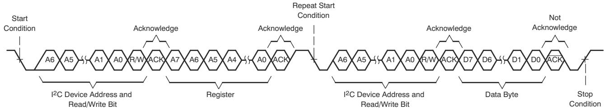  
图 7-66. I<sup>2</sup>C Single-Byte Read Transfer

## 7.5.1.1.2.4 I<sup>2</sup>C Multiple-Byte Read

如图 7-67 所示，多字节数据读传输与单字节数据读传输相同，只是器件向主设备传输多个数据字节。除最后一个数据字节外，主设备在接收到每个数据字节后以应答位响应。接收到最后一个数据字节后，主设备传输非应答 (NACK)，后跟停止条件，以完成数据读传输。

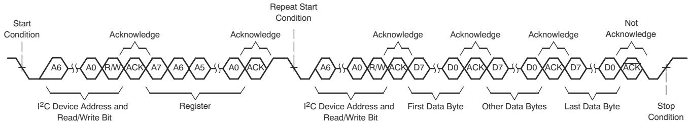  
图 7-67. I<sup>2</sup>C Multiple-Byte Read Transfer

## 7.6 寄存器映射

本节详细描述了器件的控制寄存器。所有寄存器宽度为 8 位，分配给器件配置和可编程系数设置。这些寄存器使用页面方案在内部映射，可通过 I<sup>2</sup>C 通信进行控制。每个页面包含 128 字节的寄存器。所有器件配置寄存器存储在页面 0 中，这是上电时（和软件复位后）的默认页面设置。所有可编程系数寄存器位于页面 2、页面 3 和页面 4 中。器件当前页面可通过使用每个页面中寄存器 0 的 PAGE[7:0] 位切换到新的所需页面。

不要读取或写入保留页面或保留寄存器。仅向有效寄存器中的保留位写入默认值。

跨页面寄存器访问的过程如下：

• 选择页面 N（无论当前页面号如何，向寄存器 0 写入数据 N）

• 从页面 N 中的有效寄存器读取数据或向其写入数据

• 选择新页面 M（无论当前页面号如何，向寄存器 0 写入数据 M）

• 从页面 M 中的有效寄存器读取数据或向其写入数据

• 根据需要重复

## 7.6.1 页面 0 寄存器

表 7-44 列出了页面 0 寄存器的存储器映射寄存器。所有未在 表 7-44 中列出的寄存器偏移地址应视为保留位置，不应修改寄存器内容。

表 7-44. 页面 0 寄存器


| 地址 | 缩写 | 寄存器名称 | 复位值 | 章节 |
| --- | --- | --- | --- | --- |
| 0x0 | PAGE_CFG | 器件页面寄存器 | 0x00 | 节 7.6.1.1 |
| 0x1 | SW_RESET | 软件复位寄存器 | 0x00 | 节 7.6.1.2 |
| 0x2 | SLEEP_CFG | 睡眠模式寄存器 | 0x00 | 节 7.6.1.3 |
| 0x7 | ASI_CFG0 | ASI 配置寄存器 0 | 0x30 | 节 7.6.1.4 |
| 0x8 | ASI_CFG1 | ASI 配置寄存器 1 | 0x00 | 节 7.6.1.5 |
| 0x9 | ASI_CFG2 | ASI 配置寄存器 2 | 0x00 | 节 7.6.1.6 |
| 0xA | ASI_MIX_CFG | ASI 输入混频配置寄存器 | 0x00 | 节 7.6.1.7 |
| 0xB | ASI_CH1 | 通道 1 ASI 时隙配置寄存器 | 0x00 | 节 7.6.1.8 |
| 0xC | ASI_CH2 | 通道 2 ASI 时隙配置寄存器 | 0x01 | 节 7.6.1.9 |
| 0xD | ASI_CH3 | 通道 3 ASI 时隙配置寄存器 | 0x02 | 节 7.6.1.10 |
| 0xE | ASI_CH4 | 通道 4 ASI 时隙配置寄存器 | 0x03 | 节 7.6.1.11 |
| 0x13 | MST_CFG0 | ASI 主模式配置寄存器 0 | 0x02 | 节 7.6.1.12 |
| 0x14 | MST_CFG1 | ASI 主模式配置寄存器 1 | 0x48 | 节 7.6.1.13 |
| 0x15 | ASI_STS | ASI 总线时钟监控状态寄存器 | 0xFF | 节 7.6.1.14 |
| 0x16 | CLK_SRC | 时钟源配置寄存器 0 | 0x10 | 节 7.6.1.15 |
| 0x1F | PDMCLK_CFG | PDM 时钟生成配置寄存器 | 0x40 | 节 7.6.1.16 |
| 0x20 | PDMIN_CFG | PDM DINx 采样边沿寄存器 | 0x00 | 节 7.6.1.17 |
| 0x21 | GPIO_CFG0 | GPIO 配置寄存器 0 | 0x22 | 节 7.6.1.18 |
| 0x22 | GPO_CFG0 | GPO 配置寄存器 0 | 0x00 | 节 7.6.1.19 |
| 0x29 | GPO_VAL | GPIO、GPO 输出值寄存器 | 0x00 | 节 7.6.1.20 |
| 0x2A | GPIO_MON | GPIO 监控值寄存器 | 0x00 | 节 7.6.1.21 |
| 0x2B | GPI_CFG0 | GPI 配置寄存器 0 | 0x00 | 节 7.6.1.22 |
| 0x2F | GPI_MON | GPI 监控值寄存器 | 0x00 | 节 7.6.1.23 |
| 0x32 | INT_CFG | 中断配置寄存器 | 0x00 | 节 7.6.1.24 |
| 0x33 | INT_MASK0 | 中断屏蔽寄存器 0 | 0xFF | 节 7.6.1.25 |
| 0x36 | INT_LTCH0 | 锁存中断回读寄存器 0 | 0x00 | 节 7.6.1.26 |
| 0x3B | BIAS_CFG | 偏置和 ADC 配置寄存器 | 0x00 | 节 7.6.1.27 |
| 0x3E | CH1_CFG2 | 通道 1 配置寄存器 2 | 0xC9 | 节 7.6.1.28 |
| 0x3F | CH1_CFG3 | 通道 1 配置寄存器 3 | 0x80 | 节 7.6.1.29 |
| 0x40 | CH1_CFG4 | 通道 1 配置寄存器 4 | 0x00 | 节 7.6.1.30 |
| 0x41 | CH2_CFG0 | 通道 2 配置寄存器 0 | 0x00 | 节 7.6.1.31 |
| 0x43 | CH2_CFG2 | 通道 2 配置寄存器 2 | 0xC9 | 节 7.6.1.32 |
| 0x44 | CH2_CFG3 | 通道 2 配置寄存器 3 | 0x80 | 节 7.6.1.33 |
| 0x45 | CH2_CFG4 | 通道 2 配置寄存器 4 | 0x00 | 节 7.6.1.34 |
| 0x48 | CH3_CFG2 | 通道 3 配置寄存器 2 | 0xC9 | 节 7.6.1.35 |
| 0x49 | CH3_CFG3 | 通道 3 配置寄存器 3 | 0x80 | 节 7.6.1.36 |
| 0x4A | CH3_CFG4 | 通道 3 配置寄存器 4 | 0x00 | 节 7.6.1.37 |
| 0x4D | CH4_CFG2 | 通道 4 配置寄存器 2 | 0xC9 | 节 7.6.1.38 |
| 0x4E | CH4_CFG3 | 通道 4 配置寄存器 3 | 0x80 | 节 7.6.1.39 |
| 0x4F | CH4_CFG4 | 通道 4 配置寄存器 4 | 0x00 | 节 7.6.1.40 |
| 0x6B | DSP_CFG0 | DSP 配置寄存器 0 | 0x01 | 节 7.6.1.41 |
| 0x6C | DSP_CFG1 | DSP 配置寄存器 1 | 0x40 | 节 7.6.1.42 |
| 0x73 | IN_CH_EN | 输入通道使能配置寄存器 | 0xC0 | 节 7.6.1.43 |
| 0x74 | ASI_OUT_CH_EN | ASI 输出通道使能配置寄存器 | 0x00 | 节 7.6.1.44 |
| 0x75 | PWR_CFG | 上电配置寄存器 | 0x00 | 节 7.6.1.45 |
| 0x76 | DEV_STS0 | 器件状态值寄存器 0 | 0x00 | 节 7.6.1.46 |
| 0x77 | DEV_STS1 | 器件状态值寄存器 1 | 0x80 | 节 7.6.1.47 |
| 0x7E | I2C_CKSUM | I2C 校验和寄存器 | 0x00 | 节 7.6.1.48 |


## 7.6.1.1 PAGE\_CFG Register (Address = 0x0) [Reset = 0x0]

PAGE\_CFG 如 图 7-68 所示，并在 表 7-45 中进行了说明。

返回 表 7-44。

器件存储器映射分为多个页面。此寄存器用于设置页面。

图 7-68. PAGE\_CFG Register


| 7 | 6 | 5 | 4 | 3 | 2 | 1 | 0 |
| --- | --- | --- | --- | --- | --- | --- | --- |
| PAGE[7:0] |  |  |  |  |  |  |  |
| R/W-00000000b |  |  |  |  |  |  |  |


表 7-45. PAGE\_CFG Register Field Descriptions


| 位 | 字段 | 类型 | 复位值 | 说明 |
| --- | --- | --- | --- | --- |
| 7-0 | PAGE[7:0] | R/W | 00000000b | 这些位用于设置器件页面。0d = 页面 0；1d = 页面 1；2d 至 254d = 分别对应页面 2 至页面 254；255d = 页面 255 |


## 7.6.1.2 SW\_RESET Register (Address = 0x1) [Reset = 0x0]

SW\_RESET 如 图 7-69 所示，并在 表 7-46 中进行了说明。

返回 表 7-44。

此寄存器是软件复位寄存器。执行软件复位会将所有寄存器值置于其默认的上电复位 (POR) 状态。

图 7-69. SW\_RESET Register


| 7 | 6 | 5 | 4 | 3 | 2 | 1 | 0 |
| --- | --- | --- | --- | --- | --- | --- | --- |
|  |  |  | RESERVED |  |  |  | SW_RESET |
|  |  |  | R-0000000b |  |  |  | R/W-0b |


表 7-46. SW\_RESET Register Field Descriptions


| 位 | 字段 | 类型 | 复位值 | 说明 |
| --- | --- | --- | --- | --- |
| 7-1 | RESERVED | R | 0000000b | 保留位；仅写入复位值 |
| 0 | SW_RESET | R/W | 0b | 软件复位。此位可自动清零。0d = 不复位；1d = 将所有寄存器复位为其复位值 |


## 7.6.1.3 SLEEP\_CFG Register (Address = 0x2) [Reset = 0x0]

SLEEP\_CFG 如 图 7-70 所示，并在 表 7-47 中进行了说明。

返回 表 7-44。

此寄存器用于配置稳压器、VREF 快速充电、I<sup>2</sup>C 广播和睡眠模式。

图 7-70. SLEEP\_CFG Register


| 7 | 6 | 5 | 4 | 3 | 2 | 1 | 0 |
| --- | --- | --- | --- | --- | --- | --- | --- |
| AREG_SELECT | RESERVED |  | VREF_QCHG[1:0] |  | I2C_BRDCAST_EN | RESERVED | SLEEP_ENZ |
| R/W-0b | R/W-00b |  | R/W-00b |  | R/W-0b | R-0b | R/W-0b |


表 7-47. SLEEP\_CFG Register Field Descriptions


| 位 | 字段 | 类型 | 复位值 | 说明 |
| --- | --- | --- | --- | --- |
| 7 | AREG_SELECT | R/W | 0b | 模拟电源选择，可选择内部稳压器供电或外部 AREG 供电。0d = 外部 1.8V AREG 电源（当 AVDD 为 1.8V 且 AREG 与 AVDD 短接时使用此设置）；1d = 使用片内稳压器内部生成 1.8V AREG 电源（当 AVDD 为 3.3V 时使用此设置） |
| 6-5 | RESERVED | R/W | 00b | 保留位；仅写入复位值 |
| 4-3 | VREF_QCHG[1:0] | R/W | 00b | VREF 外部电容的快速充电持续时间通过 200Ω 内部串联阻抗设置。0d = VREF 快速充电持续时间 3.5ms（典型值）；1d = VREF 快速充电持续时间 10ms（典型值）；2d = VREF 快速充电持续时间 50ms（典型值）；3d = VREF 快速充电持续时间 100ms（典型值） |
| 2 | I2C_BRDCAST_EN | R/W | 0b | I2C 广播寻址设置。0d = I2C 广播模式禁用；1d = I2C 广播模式使能；I2C 从地址固定为 1001 100 |
| 1 | RESERVED | R | 0b | 保留位；仅写入复位值 |
| 0 | SLEEP_ENZ | R/W | 0b | 睡眠模式设置。0d = 器件处于睡眠模式；1d = 器件未处于睡眠模式 |


## 7.6.1.4 ASI\_CFG0 Register (Address = 0x7) [Reset = 0x30]

ASI\_CFG0 如 图 7-71 所示，并在 表 7-48 中进行了说明。

返回 表 7-44。

此寄存器是 ASI 配置寄存器 0。

图 7-71. ASI\_CFG0 Register


| 7 | 6 | 5 | 4 | 3 | 2 | 1 | 0 |
| --- | --- | --- | --- | --- | --- | --- | --- |
| ASI_FORMAT[1:0] |  | ASI_WLEN[1:0] |  | FSYNC_POL | BCLK_POL | TX_EDGE | TX_FILL |
| R/W-00b |  | R/W-11b |  | R/W-0b | R/W-0b | R/W-0b | R/W-0b |


表 7-48. ASI\_CFG0 Register Field Descriptions


| 位 | 字段 | 类型 | 复位值 | 说明 |
| --- | --- | --- | --- | --- |
| 7-6 | ASI_FORMAT[1:0] | R/W | 00b | ASI 协议格式。0d = TDM 模式；1d = $I^{2}S$ 模式；2d = LJ（左平衡）模式；3d = 保留；请勿使用 |
| 5-4 | ASI_WLEN[1:0] | R/W | 11b | ASI 字长或时隙长度。0d = 16 位（建议在 10kΩ 或 20kΩ 输入阻抗配置中使用此设置）；1d = 20 位；2d = 24 位；3d = 32 位 |
| 3 | FSYNC_POL | R/W | 0b | ASI FSYNC 极性。0d = 符合标准协议的默认极性；1d = 相对于标准协议反转极性 |
| 2 | BCLK_POL | R/W | 0b | ASI BCLK 极性。0d = 符合标准协议的默认极性；1d = 相对于标准协议反转极性 |
| 1 | TX_EDGE | R/W | 0b | ASI 数据输出（在主要和辅助数据引脚上）发送边沿。0d = 符合位 2 (BCLK_POL) 协议配置设置的默认边沿；1d = 相对于默认边沿设置反转跟随边沿（半周期延迟） |
| 0 | TX_FILL | R/W | 0b | ASI 数据输出（在主要和辅助数据引脚上）对任何未使用周期的处理。0d = 未使用周期始终发送 0；1d = 未使用周期始终使用高阻态 |


## 7.6.1.5 ASI\_CFG1 Register (Address = 0x8) [Reset = 0x0]

ASI\_CFG1 如 图 7-72 所示，并在 表 7-49 中进行了说明。

返回 表 7-44。

此寄存器是 ASI 配置寄存器 1。

图 7-72. ASI\_CFG1 Register


| 7 | 6 | 5 | 4 | 3 | 2 | 1 | 0 |
| --- | --- | --- | --- | --- | --- | --- | --- |
| TX_LSB | TX_KEEPER[1:0] |  |  |  | TX_OFFSET[4:0] |  |  |
| R/W-0b | R/W-00b |  |  |  | R/W-00000b |  |  |


表 7-49. ASI\_CFG1 Register Field Descriptions


| 位 | 字段 | 类型 | 复位值 | 说明 |
| --- | --- | --- | --- | --- |
| 7 | TX_LSB | R/W | 0b | ASI 数据输出（在主要和辅助数据引脚上）LSB 传输方式。0d = 全周期发送 LSB；1d = 前半周期发送 LSB，后半周期为高阻态 |
| 6-5 | TX_KEEPER[1:0] | R/W | 00b | ASI 数据输出（在主要和辅助数据引脚上）总线保持器。0d = 总线保持器始终禁用；1d = 总线保持器始终使能；2d = 仅在 LSB 传输期间使能总线保持器一个周期；3d = 仅在 LSB 传输期间使能总线保持器一个半周期 |
| 4-0 | TX_OFFSET[4:0] | R/W | 00000b | ASI 数据 MSB 时隙 0 偏移（在主要和辅助数据引脚上）。0d = ASI 数据 MSB 位置无偏移，符合标准协议；1d = ASI 数据 MSB 位置（TDM 模式为时隙 0 或 I2S、LJ 模式为左右时隙 0）相对于标准协议偏移一个 BCLK 周期；2d = ASI 数据 MSB 位置偏移两个 BCLK 周期；3d 至 30d = ASI 数据 MSB 位置按配置分配偏移；31d = ASI 数据 MSB 位置偏移 31 个 BCLK 周期 |


## 7.6.1.6 ASI\_CFG2 Register (Address = 0x9) [Reset = 0x0]

ASI\_CFG2 如 图 7-73 所示，并在 表 7-50 中进行了说明。

返回 表 7-44。

此寄存器是 ASI 配置寄存器 2。

图 7-73. ASI\_CFG2 Register


| 7 | 6 | 5 | 4 | 3 | 2 | 1 | 0 |
| --- | --- | --- | --- | --- | --- | --- | --- |
| ASI_DAISY | RESERVED | ASI_ERR | ASI_ERR_RCOV | RESERVED |  | RESERVED |  |
| R/W-0b | R-0b | R/W-0b | R/W-0b | R/W-0b |  | R-000b |  |


表 7-50. ASI\_CFG2 Register Field Descriptions


| 位 | 字段 | 类型 | 复位值 | 说明 |
| --- | --- | --- | --- | --- |
| 7 | ASI_DAISY | R/W | 0b | ASI 菊花链连接。0d = 所有器件连接到公共 ASI 总线；1d = 所有器件以菊花链方式连接到 ASI 总线。仅在 ASI 输入混频禁用时支持此功能，有关 ASI 输入混频功能的详细信息，请参阅寄存器 10。 |
| 6 | RESERVED | R | 0b | 保留位；仅写入复位值 |
| 5 | ASI_ERR | R/W | 0b | ASI 总线错误检测。0d = 使能总线错误检测；1d = 禁用总线错误检测 |
| 4 | ASI_ERR_RCOV | R/W | 0b | ASI 总线错误自动恢复。0d = 使能总线错误恢复后自动恢复；1d = 禁用自动恢复，保持掉电状态直到主机配置器件 |
| 3 | RESERVED | R/W | 0b | 保留位；仅写入复位值 |
| 2-0 | RESERVED | R | 000b | 保留位；仅写入复位值 |


## 7.6.1.7 ASI\_MIX\_CFG Register (Address = 0xA) [Reset = 0x0]

ASI\_MIX\_CFG 如 图 7-74 所示，并在 表 7-51 中进行了说明。

返回 表 7-44。

此寄存器是 ASI 输入混频配置寄存器。

图 7-74. ASI\_MIX\_CFG Register


| 7 | 6 | 5 | 4 | 3 | 2 | 1 | 0 |
| --- | --- | --- | --- | --- | --- | --- | --- |


版权所有 © 2021 德州仪器公司

图 7-74. ASI\_MIX\_CFG Register (continued)


| ASI_MIX_SEL[1:0] | ASI_GAIN_SEL[1:0] | ASI_IN_INVERSE | RESERVED | RESERVED | RESERVED |
| --- | --- | --- | --- | --- | --- |
| R/W-00b | R/W-00b | R/W-0b | R-0b | R-0b | R-0b |


表 7-51. ASI\_MIX\_CFG Register Field Descriptions


| 位 | 字段 | 类型 | 复位值 | 说明 |
| --- | --- | --- | --- | --- |
| 7-6 | ASI_MIX_SEL[1:0] | R/W | 00b | ASI 输入（来自 GPIx 或 GPIO）与通道数据的混频选择。0d = 无混频；1d = 通道 1 和通道 2 输出数据与 ASI 输入数据在通道 1（时隙 0）上混频；2d = 通道 1 和通道 2 输出数据与 ASI 输入数据在通道 2（时隙 1）上混频；3d = 两个通道数据分别与 ASI 输入数据独立混频，将 asi_in_ch_1 与通道 1 输出数据混频，类似地将 asi_in_ch_2 与通道 2 输出数据混频 |
| 5-4 | ASI_GAIN_SEL[1:0] | R/W | 00b | ASI 输入数据在混频到通道数据之前的增益选择。0d = 无增益；1d = 将 ASI 输入数据增益 -6dB；2d = 将 ASI 输入数据增益 -12dB；3d = 将 ASI 输入数据增益 -18dB |
| 3 | ASI_IN_INVERSE | R/W | 0b | 在混频到通道数据之前反转 ASI 输入数据。0d = 不对 ASI 输入数据进行反转；1d = ASI 输入数据在与通道数据混频之前反转 |
| 2 | RESERVED | R | 0b | 保留位；仅写入复位值 |
| 1 | RESERVED | R | 0b | 保留位；仅写入复位值 |
| 0 | RESERVED | R | 0b | 保留位；仅写入复位值 |


## 7.6.1.8 ASI\_CH1 Register (Address = 0xB) [Reset = 0x0]

ASI\_CH1 如 图 7-75 所示，并在 表 7-52 中进行了说明。

返回 表 7-44。

此寄存器是通道 1 的 ASI 时隙配置寄存器。

图 7-75. ASI\_CH1 Register


| 7 | 6 | 5 | 4 | 3 | 2 | 1 | 0 |
| --- | --- | --- | --- | --- | --- | --- | --- |
| RESERVED |  | CH1_SLOT[5:0] |  |  |  |  |  |
| R-00b |  | R/W-000000b |  |  |  |  |  |


表 7-52. ASI\_CH1 Register Field Descriptions


| 位 | 字段 | 类型 | 复位值 | 说明 |
| --- | --- | --- | --- | --- |
| 7-6 | RESERVED | R | 00b | 保留位；仅写入复位值 |
| 5-0 | CH1_SLOT[5:0] | R/W | 000000b | Channel 1 slot assignment.0d = TDM is slot 0 or  $I^{2}S$ , LJ is left slot 01d = TDM is slot 1 or  $I^{2}S$ , LJ is left slot 12d to 30d = Slot assigned as per configuration31d = TDM is slot 31 or  $I^{2}S$ , LJ is left slot 3132d = TDM is slot 32 or  $I^{2}S$ , LJ is right slot 033d = TDM is slot 33 or  $I^{2}S$ , LJ is right slot 134d to 62d = Slot assigned as per configuration63d = TDM is slot 63 or  $I^{2}S$ , LJ is right slot 31 |


## 7.6.1.9 ASI\_CH2 Register (Address = 0xC) [Reset = 0x1]

ASI\_CH2 如 图 7-76 所示，并在 表 7-53 中进行了说明。

返回 表 7-44。

此寄存器是通道 2 的 ASI 时隙配置寄存器。

图 7-76. ASI\_CH2 Register


| 7 | 6 | 5 | 4 | 3 | 2 | 1 | 0 |
| --- | --- | --- | --- | --- | --- | --- | --- |
| RESERVED |  | CH2_SLOT[5:0] |  |  |  |  |  |
| R-00b |  | R/W-000001b |  |  |  |  |  |


表 7-53. ASI\_CH2 Register Field Descriptions


| 位 | 字段 | 类型 | 复位值 | 说明 |
| --- | --- | --- | --- | --- |
| 7-6 | RESERVED | R | 00b | 保留位；仅写入复位值 |
| 5-0 | CH2_SLOT[5:0] | R/W | 000001b | Channel 2 slot assignment.0d = TDM is slot 0 or  $I^{2}S$ , LJ is left slot 01d = TDM is slot 1 or  $I^{2}S$ , LJ is left slot 12d to 30d = Slot assigned as per configuration31d = TDM is slot 31 or  $I^{2}S$ , LJ is left slot 3132d = TDM is slot 32 or  $I^{2}S$ , LJ is right slot 033d = TDM is slot 33 or  $I^{2}S$ , LJ is right slot 134d to 62d = Slot assigned as per configuration63d = TDM is slot 63 or  $I^{2}S$ , LJ is right slot 31 |


## 7.6.1.10 ASI\_CH3 Register (Address = 0xD) [Reset = 0x2]

ASI\_CH3 如 图 7-77 所示，并在 表 7-54 中进行了说明。

返回 表 7-44。

此寄存器是通道 3 的 ASI 时隙配置寄存器。

图 7-77. ASI\_CH3 Register


| 7 | 6 | 5 | 4 | 3 | 2 | 1 | 0 |
| --- | --- | --- | --- | --- | --- | --- | --- |
| RESERVED |  | CH3_SLOT[5:0] |  |  |  |  |  |
| R-00b |  | R/W-000010b |  |  |  |  |  |


表 7-54. ASI\_CH3 Register Field Descriptions


| 位 | 字段 | 类型 | 复位值 | 说明 |
| --- | --- | --- | --- | --- |
| 7-6 | RESERVED | R | 00b | 保留位；仅写入复位值 |
| 5-0 | CH3_SLOT[5:0] | R/W | 000010b | Channel 3 slot assignment.0d = TDM is slot 0 or  $I^{2}S$ , LJ is left slot 01d = TDM is slot 1 or  $I^{2}S$ , LJ is left slot 12d to 30d = Slot assigned as per configuration31d = TDM is slot 31 or  $I^{2}S$ , LJ is left slot 3132d = TDM is slot 32 or  $I^{2}S$ , LJ is right slot 033d = TDM is slot 33 or  $I^{2}S$ , LJ is right slot 134d to 62d = Slot assigned as per configuration63d = TDM is slot 63 or  $I^{2}S$ , LJ is right slot 31 |


## 7.6.1.11 ASI\_CH4 Register (Address = 0xE) [Reset = 0x3]

ASI\_CH4 如 图 7-78 所示，并在 表 7-55 中进行了说明。

返回 表 7-44。

此寄存器是通道 4 的 ASI 时隙配置寄存器。

图 7-78. ASI\_CH4 Register


| 7 | 6 | 5 | 4 | 3 | 2 | 1 | 0 |
| --- | --- | --- | --- | --- | --- | --- | --- |


版权所有 © 2021 德州仪器公司

图 7-78. ASI\_CH4 Register (continued)


| RESERVED | CH4_SLOT[5:0] |
| --- | --- |
| R-00b | R/W-000011b |


表 7-55. ASI\_CH4 Register Field Descriptions


| 位 | 字段 | 类型 | 复位值 | 说明 |
| --- | --- | --- | --- | --- |
| 7-6 | RESERVED | R | 00b | 保留位；仅写入复位值 |
| 5-0 | CH4_SLOT[5:0] | R/W | 000011b | Channel 4 slot assignment.0d = TDM is slot 0 or  $I^{2}S$ , LJ is left slot 01d = TDM is slot 1 or  $I^{2}S$ , LJ is left slot 12d to 30d = Slot assigned as per configuration31d = TDM is slot 31 or  $I^{2}S$ , LJ is left slot 3132d = TDM is slot 32 or  $I^{2}S$ , LJ is right slot 033d = TDM is slot 33 or  $I^{2}S$ , LJ is right slot 134d to 62d = Slot assigned as per configuration63d = TDM is slot 63 or  $I^{2}S$ , LJ is right slot 31 |


## 7.6.1.12 MST\_CFG0 Register (Address = 0x13) [Reset = 0x2]

MST\_CFG0 如 图 7-79 所示，并在 表 7-56 中进行了说明。

返回 表 7-44。

此寄存器是 ASI 主模式配置寄存器 0。

图 7-79. MST\_CFG0 Register


| 7 | 6 | 5 | 4 | 3 | 2 | 1 | 0 |
| --- | --- | --- | --- | --- | --- | --- | --- |
| MST_SLV_CFG | AUTO_CLK_CFG | AUTO_MODE_PLL_DIS | BCLK_FSYNC_GATE | FS_MODE | MCLK_FREQ_SEL[2:0] |  |  |
| R/W-0b | R/W-0b | R/W-0b | R/W-0b | R/W-0b | R/W-010b |  |  |


表 7-56. MST\_CFG0 Register Field Descriptions


| 位 | 字段 | 类型 | 复位值 | 说明 |
| --- | --- | --- | --- | --- |
| 7 | MST_SLV_CFG | R/W | 0b | ASI 主或从配置寄存器设置。0d = 器件处于从模式（BCLK 和 FSYNC 均为器件输入）；1d = 器件处于主模式（BCLK 和 FSYNC 均由器件生成） |
| 6 | AUTO_CLK_CFG | R/W | 0b | 自动时钟配置设置。0d = 自动时钟配置使能（所有内部时钟分频器和 PLL 配置均为自动推导）；1d = 自动时钟配置禁用（必须使用自定义模式和器件 GUI 进行器件配置设置） |
| 5 | AUTO_MODE_PLL_DIS | R/W | 0b | 自动模式 PLL 设置。0d = 在自动时钟配置中 PLL 使能；1d = 在自动时钟配置中 PLL 禁用 |
| 4 | BCLK_FSYNC_GATE | R/W | 0b | BCLK 和 FSYNC 时钟门控（当器件处于主模式时有效）。0d = 不门控 BCLK 和 FSYNC；1d = 在主模式下从器件传输时强制门控 BCLK 和 FSYNC |
| 3 | FS_MODE | R/W | 0b | 采样率设置（当器件处于主模式时有效）。0d = fs 为 48kHz 的倍数（或约数）；1d = fs 为 44.1kHz 的倍数（或约数） |
| 2-0 | MCLK_FREQ_SEL[2:0] | R/W | 010b | 这些位选择 PLL 源时钟输入的 MCLK（GPIO 或 GPIx）频率（当器件处于主模式且 MCLK_FREQ_SEL_MODE = 0 时有效）。0d = 12MHz；1d = 12.288MHz；2d = 13MHz；3d = 16MHz；4d = 19.2MHz；5d = 19.68MHz；6d = 24MHz；7d = 24.576MHz |


## 7.6.1.13 MST\_CFG1 Register (Address = 0x14) [Reset = 0x48]

MST\_CFG1 如 图 7-80 所示，并在 表 7-57 中进行了说明。

返回 表 7-44。

此寄存器是 ASI 主模式配置寄存器 1。

图 7-80. MST\_CFG1 Register


| 7 | 6 | 5 | 4 | 3 | 2 | 1 | 0 |
| --- | --- | --- | --- | --- | --- | --- | --- |
| FS_RATE[3:0] |  |  |  | FS_BCLK_RATIO[3:0] |  |  |  |
| R/W-0100b |  |  |  | R/W-1000b |  |  |  |


表 7-57. MST\_CFG1 Register Field Descriptions


| 位 | 字段 | 类型 | 复位值 | 说明 |
| --- | --- | --- | --- | --- |
| 7-4 | FS_RATE[3:0] | R/W | 0100b | Programmed sample rate of the ASI bus (not used when the device is configured in slave mode auto clock configuration).0d = 7.35 kHz or 8 kHz1d = 14.7 kHz or 16 kHz2d = 22.05 kHz or 24 kHz3d = 29.4 kHz or 32 kHz4d = 44.1 kHz or 48 kHz5d = 88.2 kHz or 96 kHz6d = 176.4 kHz or 192 kHz7d = 352.8 kHz or 384 kHz8d = 705.6 kHz or 768 kHz9d to 15d = Reserved; Don&#x27;t use |
| 3-0 | FS_BCLK_RATIO[3:0] | R/W | 1000b | Programmed BCLK to FSYNC frequency ratio of the ASI bus (not used when the device is configured in slave mode auto clock configuration).0d = Ratio of 161d = Ratio of 242d = Ratio of 323d = Ratio of 484d = Ratio of 645d = Ratio of 966d = Ratio of 1287d = Ratio of 1928d = Ratio of 2569d = Ratio of 38410d = Ratio of 51211d = Ratio of 102412d = Ratio of 204813d to 15d = Reserved; Don&#x27;t use |


## 7.6.1.14 ASI\_STS Register (Address = 0x15) [Reset = 0xFF]

ASI\_STS 如 图 7-81 所示，并在 表 7-58 中进行了说明。

返回 表 7-44。

此寄存器是 ASI 总线时钟监控状态寄存器。

图 7-81. ASI\_STS Register


| 7 | 6 | 5 | 4 | 3 | 2 | 1 | 0 |
| --- | --- | --- | --- | --- | --- | --- | --- |
| FS_RATE_STS[3:0] |  |  |  | FS_RATIO_STS[3:0] |  |  |  |
| R-1111b |  |  |  | R-1111b |  |  |  |


表 7-58. ASI\_STS Register Field Descriptions


| 位 | 字段 | 类型 | 复位值 | 说明 |
| --- | --- | --- | --- | --- |
| 7-4 | FS_RATE_STS[3:0] | R | 1111b | 检测到的 ASI 总线采样率。0d = 7.35kHz 或 8kHz；1d = 14.7kHz 或 16kHz；2d = 22.05kHz 或 24kHz；3d = 29.4kHz 或 32kHz；4d = 44.1kHz 或 48kHz；5d = 88.2kHz 或 96kHz；6d = 176.4kHz 或 192kHz；7d = 352.8kHz 或 384kHz；8d = 705.6kHz 或 768kHz；9d 至 14d = 保留状态；15d = 无效采样率 |
| 3-0 | FS_RATIO_STS[3:0] | R | 1111b | 检测到的 ASI 总线 BCLK 与 FSYNC 频率比。0d = 比率 16；1d = 比率 24；2d = 比率 32；3d = 比率 48；4d = 比率 64；5d = 比率 96；6d = 比率 128；7d = 比率 192；8d = 比率 256；9d = 比率 384；10d = 比率 512；11d = 比率 1024；12d = 比率 2048；13d 至 14d = 保留状态；15d = 无效比率 |


## 7.6.1.15 CLK\_SRC Register (Address = 0x16) [Reset = 0x10]

CLK\_SRC 如 图 7-82 所示，并在 表 7-59 中进行了说明。

返回 表 7-44。

此寄存器是时钟源配置寄存器。

图 7-82. CLK\_SRC Register


| 7 | 6 | 5 | 4 | 3 | 2 | 1 | 0 |
| --- | --- | --- | --- | --- | --- | --- | --- |
| DIS_PLL_SLV_CLK_SRC | MCLK_FREQ_SEL_MODE | MCLK_RATIO_SEL[2:0] |  |  | RESERVED | INV_BCLK_FOR_FSYNC | RESERVED |
| R/W-0b | R/W-0b | R/W-010b |  |  | R/W-0b | R/W-0b | R/W-0b |


表 7-59. CLK\_SRC Register Field Descriptions


| 位 | 字段 | 类型 | 复位值 | 说明 |
| --- | --- | --- | --- | --- |
| 7 | DIS_PLL_SLV_CLK_SRC | R/W | 0b | 当器件在从模式的自动时钟配置中禁用 PLL 时的音频根时钟源设置 (AUTO_MODE_PLL_DIS = 1)。0d = BCLK 用作音频根时钟源；1d = MCLK（GPIO 或 GPIx）用作音频根时钟源（MCLK 与 FSYNC 比率根据 MCLK_RATIO_SEL 设置） |
| 6 | MCLK_FREQ_SEL_MODE | R/W | 0b | 主模式 MCLK（GPIO 或 GPIx）频率选择模式（当器件处于自动时钟配置时有效）。0d = MCLK 频率基于 MCLK_FREQ_SEL (P0_R19) 配置；1d = MCLK 频率在 MCLK_RATIO_SEL (P0_R22) 配置中指定为 FSYNC 的倍数 |
| 5-3 | MCLK_RATIO_SEL[2:0] | R/W | 010b | 这些位选择主模式或当 MCLK 在从模式下用作音频根时钟源时的 MCLK（GPIO 或 GPIx）与 FSYNC 比率。0d = 比率 64；1d = 比率 256；2d = 比率 384；3d = 比率 512；4d = 比率 768；5d = 比率 1024；6d = 比率 1536；7d = 比率 2304 |
| 2 | RESERVED | R/W | 0b | 保留位；仅写入复位值 |
| 1 | INV_BCLK_FOR_FSYNC | R/W | 0b | 在主模式配置中仅对 FSYNC 生成反转 BCLK 极性。0d = 不对 FSYNC 生成反转 BCLK 极性；1d = 对 FSYNC 生成反转 BCLK 极性 |
| 0 | RESERVED | R/W | 0b | 保留位；仅写入复位值 |


## 7.6.1.16 PDMCLK\_CFG Register (Address = 0x1F) [Reset = 0x40]

PDMCLK\_CFG 如 图 7-83 所示，并在 表 7-60 中进行了说明。

返回 表 7-44。

此寄存器是 PDM 时钟生成配置寄存器。

图 7-83. PDMCLK\_CFG Register


| 7 | 6 | 5 | 4 | 3 | 2 | 1 | 0 |
| --- | --- | --- | --- | --- | --- | --- | --- |
| RESERVED |  |  | RESERVED |  |  | PDMCLK_DIV[1:0] |  |
| R/W-0b |  |  | R/W-10000b |  |  | R/W-00b |  |


表 7-60. PDMCLK\_CFG Register Field Descriptions


| 位 | 字段 | 类型 | 复位值 | 说明 |
| --- | --- | --- | --- | --- |
| 7 | RESERVED | R/W | 0b | 保留位；仅写入复位值 |
| 6-2 | RESERVED | R/W | 10000b | 保留位；仅写入复位值 |
| 1-0 | PDMCLK_DIV[1:0] | R/W | 00b | PDMCLK 分频器值。0d = PDMCLK 为 2.8224MHz 或 3.072MHz；1d = PDMCLK 为 1.4112MHz 或 1.536MHz；2d = PDMCLK 为 705.6kHz 或 768kHz；3d = PDMCLK 为 5.6448MHz 或 6.144MHz（仅适用于 PDM 通道 1 和 2） |


## 7.6.1.17 PDMIN\_CFG Register (Address = 0x20) [Reset = 0x0]

PDMIN\_CFG 如 图 7-84 所示，并在 表 7-61 中进行了说明。

返回 表 7-44。

此寄存器是 PDM DINx 采样边沿配置寄存器。

图 7-84. PDMIN\_CFG Register


| 7 | 6 | 5 | 4 | 3 | 2 | 1 | 0 |
| --- | --- | --- | --- | --- | --- | --- | --- |
| PDMDIN1_EDGE | RESERVED |  |  | RESERVED |  |  |  |
| R/W-0b | R/W-0b |  |  | R-000000b |  |  |  |


表 7-61. PDMIN\_CFG Register Field Descriptions


| 位 | 字段 | 类型 | 复位值 | 说明 |
| --- | --- | --- | --- | --- |
| 7 | PDMDIN1_EDGE | R/W | 0b | 用于通道 1 和通道 2 数据的 PDMCLK 锁存沿。0d = 通道 1 数据在下降沿锁存，通道 2 数据在上升沿锁存；1d = 通道 1 数据在上升沿锁存，通道 2 数据在下降沿锁存 |
| 6 | RESERVED | R/W | 0b | 保留位；仅写入复位值 |
| 5-0 | RESERVED | R | 000000b | 保留位；仅写入复位值 |


## 7.6.1.18 GPIO\_CFG0 Register (Address = 0x21) [Reset = 0x22]

GPIO\_CFG0 如 图 7-85 所示，并在 表 7-62 中进行了说明。

返回 表 7-44。

此寄存器是 GPIO 配置寄存器 0。

图 7-85. GPIO\_CFG0 Register


| 7 | 6 | 5 | 4 | 3 | 2 | 1 | 0 |
| --- | --- | --- | --- | --- | --- | --- | --- |
|  | GPIO1_CFG[3:0] |  |  | RESERVED |  | GPIO1_DRV[2:0] |  |
|  | R/W-0010b |  |  | R-0b |  | R/W-010b |  |


表 7-62. GPIO\_CFG0 Register Field Descriptions


| 位 | 字段 | 类型 | 复位值 | 说明 |
| --- | --- | --- | --- | --- |
| 7-4 | GPIO1_CFG[3:0] | R/W | 0010b | GPIO1 配置。0d = GPIO1 禁用；1d = GPIO1 配置为通用输出 (GPO)；2d = GPIO1 配置为器件中断输出 (IRQ)；3d = 保留，请勿使用；4d = GPIO1 配置为 PDM 时钟输出 (PDMCLK)；5d = 保留，请勿使用；6d = 保留，请勿使用；7d = 关闭所有 ADC 通道；8d = GPIO1 配置为控制 MICBIAS 开或关的输入 (MICBIAS_EN)；9d = GPIO1 配置为通用输入 (GPI)；10d = GPIO1 配置为主时钟输入 (MCLK)；11d = GPIO1 配置为用于菊花链的 ASI 输入或用于混频的 ASI 输入 (SDIN)；12d = GPIO1 配置为通道 1 和通道 2 的 PDM 数据输入 (PDMDIN1)；13d = GPIO1 配置为通道 3 和通道 4 的 PDM 数据输入 (PDMDIN2)；14d 至 15d = 保留，请勿使用 |
| 3 | RESERVED | R | 0b | 保留位；仅写入复位值 |
| 2-0 | GPIO1_DRV[2:0] | R/W | 010b | GPIO1 输出驱动配置。0d = 高阻输出；1d = 驱动有效低电平和有效高电平；2d = 驱动有效低电平和弱高电平；3d = 驱动有效低电平和高阻；4d = 驱动弱低电平和有效高电平；5d = 驱动高阻和有效高电平；6d 至 7d = 保留，请勿使用 |


## 7.6.1.19 GPO\_CFG0 Register (Address = 0x22) [Reset = 0x0]

GPO\_CFG0 如 图 7-86 所示，并在 表 7-63 中进行了说明。

返回 表 7-44。

此寄存器是 GPO 配置寄存器 0。

图 7-86. GPO\_CFG0 Register


| 7 | 6 | 5 | 4 | 3 | 2 | 1 | 0 |
| --- | --- | --- | --- | --- | --- | --- | --- |
|  | GPO1_CFG[3:0] |  |  | RESERVED |  | GPO1_DRV[2:0] |  |
|  | R/W-0000b |  |  | R-0b |  | R/W-000b |  |


表 7-63. GPO\_CFG0 Register Field Descriptions


| 位 | 字段 | 类型 | 复位值 | 说明 |
| --- | --- | --- | --- | --- |
| 7-4 | GPO1_CFG[3:0] | R/W | 0000b | GPO1 configuration.0d = GPO1 is disabled1d = GPO1 is configured as a general-purpose output (GPO)2d = GPO1 is configured as a device interrupt output (IRQ)3d = Reserved; Don&#x27;t use4d = GPO1 is configured as a PDM 时钟输出 (PDMCLK)5d to 15d = Reserved; Don&#x27;t use |
| 3 | RESERVED | R | 0b | 保留位；仅写入复位值 |
| 2-0 | GPO1_DRV[2:0] | R/W | 000b | IN2M_GPO1 (GPO1) output drive configuration.0d = Hi-Z output1d = Drive active low and active high2d = Reserved; Don&#x27;t use3d = Drive active low and Hi-Z4d = Reserved; Don&#x27;t use5d = Drive Hi-Z and active high6d to 7d = Reserved; Don&#x27;t use |


## 7.6.1.20 GPO\_VAL Register (Address = 0x29) [Reset = 0x0]

GPO\_VAL 如 图 7-87 所示，并在 表 7-64 中进行了说明。

返回 表 7-44。

此寄存器是 GPIO 和 GPO 输出值寄存器。

图 7-87. GPO\_VAL Register


| 7 | 6 | 5 | 4 | 3 | 2 | 1 | 0 |
| --- | --- | --- | --- | --- | --- | --- | --- |
| GPIO1_VAL | GPO1_VAL | RESERVED |  |  |  |  |  |
| R/W-0b | R/W-0b | R-000000b |  |  |  |  |  |


表 7-64. GPO\_VAL Register Field Descriptions


| 位 | 字段 | 类型 | 复位值 | 说明 |
| --- | --- | --- | --- | --- |
| 7 | GPIO1_VAL | R/W | 0b | GPIO1 配置为 GPO 时的输出值。0d = 以值 0 驱动输出；1d = 以值 1 驱动输出 |
| 6 | GPO1_VAL | R/W | 0b | GPO1 配置为 GPO 时的输出值。0d = 以值 0 驱动输出；1d = 以值 1 驱动输出 |
| 5-0 | RESERVED | R | 000000b | 保留位；仅写入复位值 |


## 7.6.1.21 GPIO\_MON Register (Address = 0x2A) [Reset = 0x0]

GPIO\_MON 如 图 7-88 所示，并在 表 7-65 中进行了说明。

返回 表 7-44。

此寄存器是 GPIO 监控值寄存器。

图 7-88. GPIO\_MON Register


| 7 | 6 | 5 | 4 | 3 | 2 | 1 | 0 |
| --- | --- | --- | --- | --- | --- | --- | --- |
| GPIO1_MON | RESERVED |  |  |  |  |  |  |
| R-0b | R-0000000b |  |  |  |  |  |  |


表 7-65. GPIO\_MON Register Field Descriptions


| 位 | 字段 | 类型 | 复位值 | 说明 |
| --- | --- | --- | --- | --- |
| 7 | GPIO1_MON | R | 0b | GPIO1 配置为 GPI 时的监控值。0d = 输入监控值 0；1d = 输入监控值 1 |
| 6-0 | RESERVED | R | 0000000b | 保留位；仅写入复位值 |


## 7.6.1.22 GPI\_CFG0 Register (Address = 0x2B) [Reset = 0x0]

GPI\_CFG0 如 图 7-89 所示，并在 表 7-66 中进行了说明。

返回 表 7-44。

此寄存器是 GPI 配置寄存器 0。

图 7-89. GPI\_CFG0 Register


| 7 | 6 | 5 | 4 | 3 | 2 | 1 | 0 |
| --- | --- | --- | --- | --- | --- | --- | --- |
| RESERVED | GPI1_CFG[2:0] |  |  | RESERVED | GPI2_CFG[2:0] |  |  |
| R-0b | R/W-000b |  |  | R-0b | R/W-000b |  |  |


表 7-66. GPI\_CFG0 Register Field Descriptions


| 位 | 字段 | 类型 | 复位值 | 说明 |
| --- | --- | --- | --- | --- |
| 7 | RESERVED | R | 0b | 保留位；仅写入复位值 |
| 6-4 | GPI1_CFG[2:0] | R/W | 000b | GPI1 (GPI1) 配置。0d = GPI1 禁用；1d = GPI1 配置为通用输入 (GPI)；2d = GPI1 配置为主时钟输入 (MCLK)；3d = GPI1 配置为用于菊花链的 ASI 输入或用于混频的 ASI 输入 (SDIN)；4d = GPI1 配置为通道 1 和通道 2 的 PDM 数据输入 (PDMDIN1)；5d = GPI1 配置为通道 3 和通道 4 的 PDM 数据输入 (PDMDIN2)；6d = 保留，请勿使用；7d = 关闭所有 ADC 通道 |
| 3 | RESERVED | R | 0b | 保留位；仅写入复位值 |
| 2-0 | GPI2_CFG[2:0] | R/W | 000b | MICBIAS_GPI2 作为 GPI2 的配置。0d = GPI2 禁用；1d = GPI2 配置为通用输入 (GPI)；2d = GPI2 配置为主时钟输入 (MCLK)；3d = GPI2 配置为用于菊花链的 ASI 输入或用于混频的 ASI 输入 (SDIN)；4d = GPI2 配置为通道 1 和通道 2 的 PDM 数据输入 (PDMDIN1)；5d = GPI2 配置为通道 3 和通道 4 的 PDM 数据输入 (PDMDIN2)；6d = 保留，请勿使用；7d = 关闭所有 ADC 通道 |


## 7.6.1.23 GPI\_MON Register (Address = 0x2F) [Reset = 0x0]

GPI\_MON 如 图 7-90 所示，并在 表 7-67 中进行了说明。

返回 表 7-44。

此寄存器是 GPI 监控值寄存器。

图 7-90. GPI\_MON Register


| 7 | 6 | 5 | 4 | 3 | 2 | 1 | 0 |
| --- | --- | --- | --- | --- | --- | --- | --- |
| GPI1_MON | GPI2_MON | RESERVED |  |  |  |  |  |
| R-0b | R-0b | R-000000b |  |  |  |  |  |


表 7-67. GPI\_MON Register Field Descriptions


| 位 | 字段 | 类型 | 复位值 | 说明 |
| --- | --- | --- | --- | --- |
| 7 | GPI1_MON | R | 0b | GPI1 配置为 GPI 时的监控值。0d = 输入监控值 0；1d = 输入监控值 1 |
| 6 | GPI2_MON | R | 0b | MICBIAS_GPI2 配置为 GPI 时 GPI2 的监控值。0d = 输入监控值 0；1d = 输入监控值 1 |
| 5-0 | RESERVED | R | 000000b | 保留位；仅写入复位值 |


## 7.6.1.24 INT\_CFG Register (Address = 0x32) [Reset = 0x0]

INT\_CFG 如 图 7-91 所示，并在 表 7-68 中进行了说明。

返回 表 7-44。

此寄存器是中断配置寄存器。

图 7-91. INT\_CFG Register


| 7 | 6 | 5 | 4 | 3 | 2 | 1 | 0 |
| --- | --- | --- | --- | --- | --- | --- | --- |
| INT_POL | INT_EVENT[1:0] |  | RESERVED |  | LTCH_READ_CFG | RESERVED |  |
| R/W-0b | R/W-00b |  | R-00b |  | R/W-0b | R-00b |  |


表 7-68. INT\_CFG Register Field Descriptions


| 位 | 字段 | 类型 | 复位值 | 说明 |
| --- | --- | --- | --- | --- |
| 7 | INT_POL | R/W | 0b | 中断极性。0d = 低电平有效 (IRQZ)；1d = 高电平有效 (IRQ) |
| 6-5 | INT_EVENT[1:0] | R/W | 00b | 中断事件配置。0d = INT 在任何未屏蔽的锁存中断事件上断言；1d = 请勿使用；2d = 在任何未屏蔽的锁存中断事件上，INT 每 4ms（典型值）持续 2ms（典型值）断言；3d = 对于任何未屏蔽的中断事件，INT 在每个脉冲上断言 2ms（典型值）一次 |
| 4-3 | RESERVED | R | 00b | 保留位；仅写入复位值 |
| 2 | LTCH_READ_CFG | R/W | 0b | 中断锁存寄存器回读配置。0d = 所有中断均可通过 LTCH 寄存器读取；1d = 仅未屏蔽的中断可通过 LTCH 寄存器读取 |
| 1-0 | RESERVED | R | 00b | 保留位；仅写入复位值 |


## 7.6.1.25 INT\_MASK0 Register (Address = 0x33) [Reset = 0xFF]

INT\_MASK0 如 图 7-92 所示，并在 表 7-69 中进行了说明。

返回 表 7-44。

此寄存器是中断屏蔽寄存器 0。

图 7-92. INT\_MASK0 Register


| 7 | 6 | 5 | 4 | 3 | 2 | 1 | 0 |
| --- | --- | --- | --- | --- | --- | --- | --- |
| INT_MASK0 | INT_MASK0 | INT_MASK0 | INT_MASK0 | INT_MASK0 | RESERVED | RESERVED | RESERVED |
| R/W-1b | R/W-1b | R/W-1b | R/W-1b | R/W-1b | R/W-1b | R/W-1b | R/W-1b |


表 7-69. INT\_MASK0 Register Field Descriptions


| 位 | 字段 | 类型 | 复位值 | 说明 |
| --- | --- | --- | --- | --- |
| 7 | INT_MASK0 | R/W | 1b | ASI 时钟错误屏蔽。0d = 不屏蔽；1d = 屏蔽 |
| 6 | INT_MASK0 | R/W | 1b | PLL 锁定中断屏蔽。0d = 不屏蔽；1d = 屏蔽 |
| 5 | INT_MASK0 | R/W | 1b | ASI 输入混频饱和警报屏蔽。0d = 不屏蔽；1d = 屏蔽 |
| 4 | INT_MASK0 | R/W | 1b | VAD 上电检测中断屏蔽。0d = 不屏蔽；1d = 屏蔽 |
| 3 | INT_MASK0 | R/W | 1b | VAD 断电检测中断屏蔽。0d = 不屏蔽；1d = 屏蔽 |
| 2 | RESERVED | R/W | 1b | 保留位；仅写入复位值 |
| 1 | RESERVED | R/W | 1b | 保留位；仅写入复位值 |
| 0 | RESERVED | R/W | 1b | 保留位；仅写入复位值 |


## 7.6.1.26 INT\_LTCH0 Register (Address = 0x36) [Reset = 0x0]

INT\_LTCH0 如 图 7-93 所示，并在 表 7-70 中进行了说明。

返回 表 7-44。

此寄存器是锁存中断回读寄存器 0。

图 7-93. INT\_LTCH0 Register


| 7 | 6 | 5 | 4 | 3 | 2 | 1 | 0 |
| --- | --- | --- | --- | --- | --- | --- | --- |
| INT_LTCH0 | INT_LTCH0 | INT_LTCH0 | INT_LTCH0 | INT_LTCH0 | RESERVED | RESERVED | RESERVED |
| R-0b | R-0b | R-0b | R-0b | R-0b | R-0b | R-0b | R-0b |


表 7-70. INT\_LTCH0 Register Field Descriptions


| 位 | 字段 | 类型 | 复位值 | 说明 |
| --- | --- | --- | --- | --- |
| 7 | INT_LTCH0 | R | 0b | 由 ASI 总线时钟错误引起的中断（自清除位）。0d = 无中断；1d = 中断 |
| 6 | INT_LTCH0 | R | 0b | 由 PLL 锁定引起的中断（自清除位）。0d = 无中断；1d = 中断 |
| 5 | INT_LTCH0 | R | 0b | 由 ASI 输入混频通道饱和警报引起的中断（自清除位）。0d = 无中断；1d = 中断 |
| 4 | INT_LTCH0 | R | 0b | 由 VAD 上电检测引起的中断（自清除位）。0d = 无中断；1d = 中断 |
| 3 | INT_LTCH0 | R | 0b | 由 VAD 断电检测引起的中断（自清除位）。0d = 无中断；1d = 中断 |
| 2 | RESERVED | R | 0b | 保留位；仅写入复位值 |
| 1 | RESERVED | R | 0b | 保留位；仅写入复位值 |
| 0 | RESERVED | R | 0b | 保留位；仅写入复位值 |


## 7.6.1.27 BIAS\_CFG Register (Address = 0x3B) [Reset = 0x0]

BIAS\_CFG 如 图 7-94 所示，并在 表 7-71 中进行了说明。

返回 表 7-44。

此寄存器是偏置和 ADC 配置寄存器。

图 7-94. BIAS\_CFG Register


| 7 | 6 | 5 | 4 | 3 | 2 | 1 | 0 |
| --- | --- | --- | --- | --- | --- | --- | --- |
| RESERVED | MBIAS_VAL[2:0] |  |  | RESERVED |  | RESERVED |  |
| R-0b | R/W-000b |  |  | R-00b |  | R/W-00b |  |


表 7-71. BIAS\_CFG Register Field Descriptions


| 位 | 字段 | 类型 | 复位值 | 说明 |
| --- | --- | --- | --- | --- |
| 7 | RESERVED | R | 0b | 保留位；仅写入复位值 |
| 6-4 | MBIAS_VAL[2:0] | R/W | 000b | MICBIAS 值。0d = 麦克风偏置设置为 VREF（2.750V、2.500V 或 1.375V）；1d = 麦克风偏置设置为 VREF x 1.096（3.014V、2.740V 或 1.507V）；2d-5d = 请勿使用；6d = 麦克风偏置设置为 AVDD；7d = MICBIAS 配置为 GPI2 |
| 3-2 | RESERVED | R | 00b | 保留位；仅写入复位值 |
| 1-0 | RESERVED | R/W | 00b | 保留位；仅写入复位值 |


## 7.6.1.28 CH1\_CFG2 Register (Address = 0x3E) [Reset = 0xC9]

CH1\_CFG2 如 图 7-95 所示，并在 表 7-72 中进行了说明。

返回 表 7-44。

此寄存器是通道 1 的配置寄存器 2。

图 7-95. CH1\_CFG2 Register


| 7 | 6 | 5 | 4 | 3 | 2 | 1 | 0 |
| --- | --- | --- | --- | --- | --- | --- | --- |
|  |  |  | CH1_DVOL[7:0] |  |  |  |  |
|  |  |  | R/W-11001001b |  |  |  |  |


表 7-72. CH1\_CFG2 Register Field Descriptions


| 位 | 字段 | 类型 | 复位值 | 说明 |
| --- | --- | --- | --- | --- |
| 7-0 | CH1_DVOL[7:0] | R/W | 11001001b | 通道 1 数字音量控制。0d = 数字音量静音；1d = 数字音量控制设置为 -100dB；2d = 数字音量控制设置为 -99.5dB；3d 至 200d = 数字音量控制按配置设置；201d = 数字音量控制设置为 0dB；202d = 数字音量控制设置为 0.5dB；203d 至 253d = 数字音量控制按配置设置；254d = 数字音量控制设置为 26.5dB；255d = 数字音量控制设置为 27dB |


## 7.6.1.29 CH1\_CFG3 Register (Address = 0x3F) [Reset = 0x80]

CH1\_CFG3 如 图 7-96 所示，并在 表 7-73 中进行了说明。

返回 表 7-44。

此寄存器是通道 1 的配置寄存器 3。

图 7-96. CH1\_CFG3 Register


| 7 | 6 | 5 | 4 | 3 | 2 | 1 | 0 |
| --- | --- | --- | --- | --- | --- | --- | --- |
|  | CH1_GCAL[3:0] |  |  | RESERVED |  |  |  |
|  | R/W-1000b |  |  | R-0000b |  |  |  |

表 7-73. CH1\_CFG3 Register Field Descriptions


| 位 | 字段 | 类型 | 复位值 | 说明 |
| --- | --- | --- | --- | --- |
| 7-4 | CH1_GCAL[3:0] | R/W | 1000b | 通道 1 增益校准。0d = 增益校准设置为 -0.8dB；1d = 增益校准设置为 -0.7dB；2d = 增益校准设置为 -0.6dB；3d 至 7d = 增益校准按配置设置；8d = 增益校准设置为 0dB；9d = 增益校准设置为 0.1dB；10d 至 13d = 增益校准按配置设置；14d = 增益校准设置为 0.6dB；15d = 增益校准设置为 0.7dB |
| 3-0 | RESERVED | R | 0000b | 保留位；仅写入复位值 |


## 7.6.1.30 CH1\_CFG4 Register (Address = 0x40) [Reset = 0x0]

CH1\_CFG4 如 图 7-97 所示，并在 表 7-74 中进行了说明。

返回 表 7-44。

此寄存器是通道 1 的配置寄存器 4。

图 7-97. CH1\_CFG4 Register


| 7 | 6 | 5 | 4 | 3 | 2 | 1 | 0 |
| --- | --- | --- | --- | --- | --- | --- | --- |
|  |  |  | CH1_PCAL[7:0] |  |  |  |  |
|  |  |  | R/W-00000000b |  |  |  |  |


表 7-74. CH1\_CFG4 Register Field Descriptions


| 位 | 字段 | 类型 | 复位值 | 说明 |
| --- | --- | --- | --- | --- |
| 7-0 | CH1_PCAL[7:0] | R/W | 00000000b | 通道 1 相位校准，以调制器时钟为分辨率。0d = 无相位校准；1d = 相位校准延迟设置为一个调制器时钟周期；2d = 相位校准延迟设置为两个调制器时钟周期；3d 至 254d = 相位校准延迟按配置设置；255d = 相位校准延迟设置为 255 个调制器时钟周期 |


## 7.6.1.31 CH2\_CFG0 Register (Address = 0x41) [Reset = 0x0]

CH2\_CFG0 如 图 7-98 所示，并在 表 7-75 中进行了说明。

返回 表 7-44。

此寄存器是通道 2 的配置寄存器 0。

图 7-98. CH2\_CFG0 Register


| 7 | 6 | 5 | 4 | 3 | 2 | 1 | 0 |
| --- | --- | --- | --- | --- | --- | --- | --- |
| RESERVED | CH2_INSRC[1:0] |  | RESERVED | RESERVED |  | RESERVED | RESERVED |
| R/W-0b | R/W-00b |  | R/W-0b | R/W-00b |  | R-0b | R/W-0b |


表 7-75. CH2\_CFG0 Register Field Descriptions


| 位 | 字段 | 类型 | 复位值 | 说明 |
| --- | --- | --- | --- | --- |
| 7 | RESERVED | R/W | 0b | 保留位；仅写入复位值 |
| 6-5 | CH2_INSRC[1:0] | R/W | 00b | 通道 2 输入配置。0d = 输入源未使能；1d = 请勿使用；2d = 数字麦克风 PDM 输入（相应地配置 GPO 和 GPI 引脚用于 PDMDIN1 和 PDMCLK）；3d = 请勿使用 |
| 4 | RESERVED | R/W | 0b | 保留位；仅写入复位值 |
| 3-2 | RESERVED | R/W | 00b | 保留位；仅写入复位值 |
| 1 | RESERVED | R | 0b | 保留位；仅写入复位值 |
| 0 | RESERVED | R/W | 0b | 保留位；仅写入复位值 |


## 7.6.1.32 CH2\_CFG2 Register (Address = 0x43) [Reset = 0xC9]

CH2\_CFG2 如 图 7-99 所示，并在 表 7-76 中进行了说明。

返回 表 7-44。

此寄存器是通道 2 的配置寄存器 2。

图 7-99. CH2\_CFG2 Register


| 7 | 6 | 5 | 4 | 3 | 2 | 1 | 0 |
| --- | --- | --- | --- | --- | --- | --- | --- |
|  |  |  | CH2_DVOL[7:0] |  |  |  |  |
|  |  |  | R/W-11001001b |  |  |  |  |


表 7-76. CH2\_CFG2 Register Field Descriptions


| 位 | 字段 | 类型 | 复位值 | 说明 |
| --- | --- | --- | --- | --- |
| 7-0 | CH2_DVOL[7:0] | R/W | 11001001b | 通道 2 数字音量控制。0d = 数字音量静音；1d = 数字音量控制设置为 -100dB；2d = 数字音量控制设置为 -99.5dB；3d 至 200d = 数字音量控制按配置设置；201d = 数字音量控制设置为 0dB；202d = 数字音量控制设置为 0.5dB；203d 至 253d = 数字音量控制按配置设置；254d = 数字音量控制设置为 26.5dB；255d = 数字音量控制设置为 27dB |


## 7.6.1.33 CH2\_CFG3 Register (Address = 0x44) [Reset = 0x80]

CH2\_CFG3 如 图 7-100 所示，并在 表 7-77 中进行了说明。

返回 表 7-44。

此寄存器是通道 2 的配置寄存器 3。

图 7-100. CH2\_CFG3 Register


| 7 | 6 | 5 | 4 | 3 | 2 | 1 | 0 |
| --- | --- | --- | --- | --- | --- | --- | --- |
| CH2_GCAL[3:0] |  |  |  | RESERVED |  |  |  |
| R/W-1000b |  |  |  | R-0000b |  |  |  |


表 7-77. CH2\_CFG3 Register Field Descriptions


| 位 | 字段 | 类型 | 复位值 | 说明 |
| --- | --- | --- | --- | --- |
| 7-4 | CH2_GCAL[3:0] | R/W | 1000b | 通道 2 增益校准。0d = 增益校准设置为 -0.8dB；1d = 增益校准设置为 -0.7dB；2d = 增益校准设置为 -0.6dB；3d 至 7d = 增益校准按配置设置；8d = 增益校准设置为 0dB；9d = 增益校准设置为 0.1dB；10d 至 13d = 增益校准按配置设置；14d = 增益校准设置为 0.6dB；15d = 增益校准设置为 0.7dB |
| 3-0 | RESERVED | R | 0000b | 保留位；仅写入复位值 |


## 7.6.1.34 CH2\_CFG4 Register (Address = 0x45) [Reset = 0x0]

CH2\_CFG4 如 图 7-101 所示，并在 表 7-78 中进行了说明。

返回 表 7-44。

此寄存器是通道 2 的配置寄存器 4。

图 7-101. CH2\_CFG4 Register


| 7 | 6 | 5 | 4 | 3 | 2 | 1 | 0 |
| --- | --- | --- | --- | --- | --- | --- | --- |
|  |  |  | CH2_PCAL[7:0] |  |  |  |  |
|  |  |  | R/W-00000000b |  |  |  |  |


表 7-78. CH2\_CFG4 Register Field Descriptions


| 位 | 字段 | 类型 | 复位值 | 说明 |
| --- | --- | --- | --- | --- |
| 7-0 | CH2_PCAL[7:0] | R/W | 00000000b | 通道 2 相位校准，以调制器时钟为分辨率。0d = 无相位校准；1d = 相位校准延迟设置为一个调制器时钟周期；2d = 相位校准延迟设置为两个调制器时钟周期；3d 至 254d = 相位校准延迟按配置设置；255d = 相位校准延迟设置为 255 个调制器时钟周期 |


## 7.6.1.35 CH3\_CFG2 Register (Address = 0x48) [Reset = 0xC9]

CH3\_CFG2 如 图 7-102 所示，并在 表 7-79 中进行了说明。

返回 表 7-44。

此寄存器是通道 3 的配置寄存器 2。

图 7-102. CH3\_CFG2 Register


| 7 | 6 | 5 | 4 | 3 | 2 | 1 | 0 |
| --- | --- | --- | --- | --- | --- | --- | --- |
|  |  |  | CH3_DVOL[7:0] |  |  |  |  |
|  |  |  | R/W-11001001b |  |  |  |  |


表 7-79. CH3\_CFG2 Register Field Descriptions


| 位 | 字段 | 类型 | 复位值 | 说明 |
| --- | --- | --- | --- | --- |
| 7-0 | CH3_DVOL[7:0] | R/W | 11001001b | 通道 3 数字音量控制。0d = 数字音量静音；1d = 数字音量控制设置为 -100dB；2d = 数字音量控制设置为 -99.5dB；3d 至 200d = 数字音量控制按配置设置；201d = 数字音量控制设置为 0dB；202d = 数字音量控制设置为 0.5dB；203d 至 253d = 数字音量控制按配置设置；254d = 数字音量控制设置为 26.5dB；255d = 数字音量控制设置为 27dB |


## 7.6.1.36 CH3\_CFG3 Register (Address = 0x49) [Reset = 0x80]

CH3\_CFG3 如 图 7-103 所示，并在 表 7-80 中进行了说明。

返回 表 7-44。

此寄存器是通道 3 的配置寄存器 3。

图 7-103. CH3\_CFG3 Register


| 7 | 6 | 5 | 4 | 3 | 2 | 1 | 0 |
| --- | --- | --- | --- | --- | --- | --- | --- |
| CH3_GCAL[3:0] |  |  |  | RESERVED |  |  |  |
| R/W-1000b |  |  |  | R-0000b |  |  |  |


表 7-80. CH3\_CFG3 Register Field Descriptions


| 位 | 字段 | 类型 | 复位值 | 说明 |
| --- | --- | --- | --- | --- |
| 7-4 | CH3_GCAL[3:0] | R/W | 1000b | 通道 3 增益校准。0d = 增益校准设置为 -0.8dB；1d = 增益校准设置为 -0.7dB；2d = 增益校准设置为 -0.6dB；3d 至 7d = 增益校准按配置设置；8d = 增益校准设置为 0dB；9d = 增益校准设置为 0.1dB；10d 至 13d = 增益校准按配置设置；14d = 增益校准设置为 0.6dB；15d = 增益校准设置为 0.7dB |
| 3-0 | RESERVED | R | 0000b | 保留位；仅写入复位值 |


## 7.6.1.37 CH3\_CFG4 Register (Address = 0x4A) [Reset = 0x0]

CH3\_CFG4 如 图 7-104 所示，并在 表 7-81 中进行了说明。

返回 表 7-44。

此寄存器是通道 3 的配置寄存器 4。

图 7-104. CH3\_CFG4 Register


| 7 | 6 | 5 | 4 | 3 | 2 | 1 | 0 |
| --- | --- | --- | --- | --- | --- | --- | --- |
|  |  |  | CH3_PCAL[7:0] |  |  |  |  |
|  |  |  | R/W-00000000b |  |  |  |  |


表 7-81. CH3\_CFG4 Register Field Descriptions


| 位 | 字段 | 类型 | 复位值 | 说明 |
| --- | --- | --- | --- | --- |
| 7-0 | CH3_PCAL[7:0] | R/W | 00000000b | 通道 3 相位校准，以调制器时钟为分辨率。0d = 无相位校准；1d = 相位校准延迟设置为一个调制器时钟周期；2d = 相位校准延迟设置为两个调制器时钟周期；3d 至 254d = 相位校准延迟按配置设置；255d = 相位校准延迟设置为 255 个调制器时钟周期 |


## 7.6.1.38 CH4\_CFG2 Register (Address = 0x4D) [Reset = 0xC9]

CH4\_CFG2 如 图 7-105 所示，并在 表 7-82 中进行了说明。

返回 表 7-44。

此寄存器是通道 4 的配置寄存器 2。

图 7-105. CH4\_CFG2 Register


| 7 | 6 | 5 | 4 | 3 | 2 | 1 | 0 |
| --- | --- | --- | --- | --- | --- | --- | --- |
|  |  |  | CH4_DVOL[7:0] |  |  |  |  |
|  |  |  | R/W-11001001b |  |  |  |  |


表 7-82. CH4\_CFG2 Register Field Descriptions


| 位 | 字段 | 类型 | 复位值 | 说明 |
| --- | --- | --- | --- | --- |
| 7-0 | CH4_DVOL[7:0] | R/W | 11001001b | 通道 4 数字音量控制。0d = 数字音量静音；1d = 数字音量控制设置为 -100dB；2d = 数字音量控制设置为 -99.5dB；3d 至 200d = 数字音量控制按配置设置；201d = 数字音量控制设置为 0dB；202d = 数字音量控制设置为 0.5dB；203d 至 253d = 数字音量控制按配置设置；254d = 数字音量控制设置为 26.5dB；255d = 数字音量控制设置为 27dB |


## 7.6.1.39 CH4\_CFG3 Register (Address = 0x4E) [Reset = 0x80]

CH4\_CFG3 如 图 7-106 所示，并在 表 7-83 中进行了说明。

返回 表 7-44。

此寄存器是通道 4 的配置寄存器 3。

图 7-106. CH4\_CFG3 Register


| 7 | 6 | 5 | 4 | 3 | 2 | 1 | 0 |
| --- | --- | --- | --- | --- | --- | --- | --- |
|  | CH4_GCAL[3:0] |  |  | RESERVED |  |  |  |
|  | R/W-1000b |  |  | R-0000b |  |  |  |


表 7-83. CH4\_CFG3 Register Field Descriptions


| 位 | 字段 | 类型 | 复位值 | 说明 |
| --- | --- | --- | --- | --- |
| 7-4 | CH4_GCAL[3:0] | R/W | 1000b | 通道 4 增益校准。0d = 增益校准设置为 -0.8dB；1d = 增益校准设置为 -0.7dB；2d = 增益校准设置为 -0.6dB；3d 至 7d = 增益校准按配置设置；8d = 增益校准设置为 0dB；9d = 增益校准设置为 0.1dB；10d 至 13d = 增益校准按配置设置；14d = 增益校准设置为 0.6dB；15d = 增益校准设置为 0.7dB |
| 3-0 | RESERVED | R | 0000b | 保留位；仅写入复位值 |


## 7.6.1.40 CH4\_CFG4 Register (Address = 0x4F) [Reset = 0x0]

CH4\_CFG4 如 图 7-107 所示，并在 表 7-84 中进行了说明。

返回 表 7-44。

此寄存器是通道 4 的配置寄存器 4。

图 7-107. CH4\_CFG4 Register


| 7 | 6 | 5 | 4 | 3 | 2 | 1 | 0 |
| --- | --- | --- | --- | --- | --- | --- | --- |
|  |  |  | CH4_PCAL[7:0] |  |  |  |  |
|  |  |  | R/W-00000000b |  |  |  |  |


表 7-84. CH4\_CFG4 Register Field Descriptions


| 位 | 字段 | 类型 | 复位值 | 说明 |
| --- | --- | --- | --- | --- |
| 7-0 | CH4_PCAL[7:0] | R/W | 00000000b | 通道 4 相位校准，以调制器时钟为分辨率。0d = 无相位校准；1d = 相位校准延迟设置为一个调制器时钟周期；2d = 相位校准延迟设置为两个调制器时钟周期；3d 至 254d = 相位校准延迟按配置设置；255d = 相位校准延迟设置为 255 个调制器时钟周期 |


## 7.6.1.41 DSP\_CFG0 Register (Address = 0x6B) [Reset = 0x1]

DSP\_CFG0 如 图 7-108 所示，并在 表 7-85 中进行了说明。

返回 表 7-44。

此寄存器是数字信号处理器 (DSP) 配置寄存器 0。

图 7-108. DSP\_CFG0 Register


| 7 | 6 | 5 | 4 | 3 | 2 | 1 | 0 |
| --- | --- | --- | --- | --- | --- | --- | --- |
| RESERVED | RESERVED | DECI_FILT[1:0] |  | CH_SUM[1:0] |  | HPF_SEL[1:0] |  |
| R/W-0b | R/W-0b | R/W-00b |  | R/W-00b |  | R/W-01b |  |


表 7-85. DSP\_CFG0 Register Field Descriptions


| 位 | 字段 | 类型 | 复位值 | 说明 |
| --- | --- | --- | --- | --- |
| 7 | RESERVED | R/W | 0b | 保留位；仅写入复位值 |
| 6 | RESERVED | R/W | 0b | 保留位；仅写入复位值 |
| 5-4 | DECI_FILT[1:0] | R/W | 00b | 抽取滤波器响应。0d = 线性相位；1d = 低延迟；2d = 超低延迟；3d = 保留，请勿使用 |
| 3-2 | CH_SUM[1:0] | R/W | 00b | 用于更高 SNR 的通道求和模式。0d = 通道求和模式禁用；1d = 使能 2 通道求和模式以生成 (CH1 + CH2) / 2 输出；2d = 保留，请勿使用；3d = 保留，请勿使用 |
| 1-0 | HPF_SEL[1:0] | R/W | 01b | High-pass filter (HPF) selection.0d = Programmable first-order IIR filter for a custom HPF with default coefficient values in P4_R72 to P4_R83 set as the all-pass filter1d = HPF with a cutoff of  $0.00025 \times f_{S}$  (12 Hz at  $f_{S} = 48$  kHz) is selected2d = HPF with a cutoff of  $0.002 \times f_{S}$  (96 Hz at  $f_{S} = 48$  kHz) is selected3d = HPF with a cutoff of  $0.008 \times f_{S}$  (384 Hz at  $f_{S} = 48$  kHz) is selected |


## 7.6.1.42 DSP\_CFG1 Register (Address = 0x6C) [Reset = 0x40]

DSP\_CFG1 如 图 7-109 所示，并在 表 7-86 中进行了说明。

返回 表 7-44。

此寄存器是数字信号处理器 (DSP) 配置寄存器 1。

图 7-109. DSP\_CFG1 Register


| 7 | 6 | 5 | 4 | 3 | 2 | 1 | 0 |
| --- | --- | --- | --- | --- | --- | --- | --- |
| DVOL_GANG | BIQUAD_CFG[1:0] |  | DISABLE_SOFT_STEP | RESERVED | RESERVED | RESERVED | RESERVED |
| R/W-0b | R/W-10b |  | R/W-0b | R/W-0b | R/W-0b | R/W-0b | R/W-0b |


表 7-86. DSP\_CFG1 Register Field Descriptions


| 位 | 字段 | 类型 | 复位值 | 说明 |
| --- | --- | --- | --- | --- |
| 7 | DVOL_GANG | R/W | 0b | 跨通道联动 DVOL 控制。0d = 每个通道具有其自己的 DVOL CTRL 设置，按 CHx_DVOL 位编程；1d = 所有活动通道必须使用通道 1 DVOL 设置 (CH1_DVOL)，无论通道 1 是否开启 |
| 6-5 | BIQUAD_CFG[1:0] | R/W | 10b | 每通道双二阶滤波器数量配置。0d = 每通道无双二阶滤波器，双二阶滤波器全部禁用；1d = 每通道 1 个双二阶滤波器；2d = 每通道 2 个双二阶滤波器；3d = 每通道 3 个双二阶滤波器 |
| 4 | DISABLE_SOFT_STEP | R/W | 0b | DVOL 更改、静音和取消静音期间禁用软步进。0d = 软步进使能；1d = 软步进禁用 |
| 3 | RESERVED | R/W | 0b | 保留位；仅写入复位值 |
| 2 | RESERVED | R/W | 0b | 保留位；仅写入复位值 |
| 1 | RESERVED | R/W | 0b | 保留位；仅写入复位值 |
| 0 | RESERVED | R/W | 0b | 保留位；仅写入复位值 |


## 7.6.1.43 IN\_CH\_EN Register (Address = 0x73) [Reset = 0xC0]

IN\_CH\_EN 如 图 7-110 所示，并在 表 7-87 中进行了说明。

返回 表 7-44。

此寄存器是输入通道使能配置寄存器。

图 7-110. IN\_CH\_EN Register


| 7 | 6 | 5 | 4 | 3 | 2 | 1 | 0 |
| --- | --- | --- | --- | --- | --- | --- | --- |
| IN_CH1_EN | IN_CH2_EN | IN_CH3_EN | IN_CH4_EN | RESERVED |  |  |  |
| R/W-1b | R/W-1b | R/W-0b | R/W-0b | R-0000b |  |  |  |


表 7-87. IN\_CH\_EN Register Field Descriptions


| 位 | 字段 | 类型 | 复位值 | 说明 |
| --- | --- | --- | --- | --- |
| 7 | IN_CH1_EN | R/W | 1b | 输入通道 1 使能设置。0d = 通道 1 禁用；1d = 通道 1 使能 |
| 6 | IN_CH2_EN | R/W | 1b | 输入通道 2 使能设置。0d = 通道 2 禁用；1d = 通道 2 使能 |
| 5 | IN_CH3_EN | R/W | 0b | 输入通道 3（仅限 PDM）使能设置。0d = 通道 3 禁用；1d = 通道 3 使能 |
| 4 | IN_CH4_EN | R/W | 0b | 输入通道 4（仅限 PDM）使能设置。0d = 通道 4 禁用；1d = 通道 4 使能 |
| 3-0 | RESERVED | R | 0000b | 保留位；仅写入复位值 |


## 7.6.1.44 ASI\_OUT\_CH\_EN Register (Address = 0x74) [Reset = 0x0]

ASI\_OUT\_CH\_EN 如 图 7-111 所示，并在 表 7-88 中进行了说明。

返回 表 7-44。

此寄存器是 ASI 输出通道使能配置寄存器。

图 7-111. ASI\_OUT\_CH\_EN Register


| 7 | 6 | 5 | 4 | 3 | 2 | 1 | 0 |
| --- | --- | --- | --- | --- | --- | --- | --- |
| ASI_OUT_CH1_EN | ASI_OUT_CH2_EN | ASI_OUT_CH3_EN | ASI_OUT_CH4_EN | RESERVED |  |  |  |
| R/W-0b | R/W-0b | R/W-0b | R/W-0b | R-0000b |  |  |  |


表 7-88. ASI\_OUT\_CH\_EN Register Field Descriptions


| 位 | 字段 | 类型 | 复位值 | 说明 |
| --- | --- | --- | --- | --- |
| 7 | ASI_OUT_CH1_EN | R/W | 0b | ASI 输出通道 1 使能设置。0d = 通道 1 输出时隙处于三态状态；1d = 通道 1 输出时隙使能 |
| 6 | ASI_OUT_CH2_EN | R/W | 0b | ASI 输出通道 2 使能设置。0d = 通道 2 输出时隙处于三态状态；1d = 通道 2 输出时隙使能 |
| 5 | ASI_OUT_CH3_EN | R/W | 0b | ASI 输出通道 3 使能设置。0d = 通道 3 输出时隙处于三态状态；1d = 通道 3 输出时隙使能 |
| 4 | ASI_OUT_CH4_EN | R/W | 0b | ASI 输出通道 4 使能设置。0d = 通道 4 输出时隙处于三态状态；1d = 通道 4 输出时隙使能 |
| 3-0 | RESERVED | R | 0000b | 保留位；仅写入复位值 |


## 7.6.1.45 PWR\_CFG Register (Address = 0x75) [Reset = 0x0]

PWR\_CFG 如 图 7-112 所示，并在 表 7-89 中进行了说明。

返回 表 7-44。

此寄存器是上电配置寄存器。

图 7-112. PWR\_CFG Register


| 7 | 6 | 5 | 4 | 3 | 2 | 1 | 0 |
| --- | --- | --- | --- | --- | --- | --- | --- |
| MICBIAS_PDZ | ADC_PDZ | PLL_PDZ | DYN_CH_PUP D_EN | DYN_MAXCH_SEL[1:0] |  | RESERVED | VAD_EN |
| R/W-0b | R/W-0b | R/W-0b | R/W-0b | R/W-00b |  | R/W-0b | R/W-0b |


表 7-89. PWR\_CFG Register Field Descriptions


| 位 | 字段 | 类型 | 复位值 | 说明 |
| --- | --- | --- | --- | --- |
| 7 | MICBIAS_PDZ | R/W | 0b | MICBIAS 电源控制。0d = 关闭 MICBIAS；1d = 开启 MICBIAS |
| 6 | ADC_PDZ | R/W | 0b | PDM 通道电源控制。0d = 关闭所有 PDM 通道；1d = 开启所有使能的 PDM 通道 |
| 5 | PLL_PDZ | R/W | 0b | PLL 电源控制。0d = 关闭 PLL；1d = 开启 PLL |
| 4 | DYN_CH_PUPD_EN | R/W | 0b | 动态通道上电、断电使能。0d = 如果任何通道录音开启，则不支持通道上电、断电；1d = 即使通道录音开启，通道也可单独上电或断电 |
| 3-2 | DYN_MAXCH_SEL[1:0] | R/W | 00b | Dynamic mode maximum channel select configuration.0d = Channel 1 and channel 2 are used with dynamic channel power-up, power-down feature enabled1d = Channel 1 to channel 4 are used with dynamic channel power-up, power-down feature enabled2d = Reserved; Don&#x27;t use3d = Reserved; Don&#x27;t use |
| 1 | RESERVED | R/W | 0b | 保留位；仅写入复位值 |
| 0 | VAD_EN | R/W | 0b | 使能话音激活检测 (VAD) 算法。0d = VAD 禁用；1d = VAD 使能 |


## 7.6.1.46 DEV\_STS0 Register (Address = 0x76) [Reset = 0x0]

DEV\_STS0 如 图 7-113 所示，并在 表 7-90 中进行了说明。

返回 表 7-44。

此寄存器是器件状态值寄存器 0。

图 7-113. DEV\_STS0 Register


| 7 | 6 | 5 | 4 | 3 | 2 | 1 | 0 |
| --- | --- | --- | --- | --- | --- | --- | --- |
| CH1_STATUS | CH2_STATUS | RESERVED |  |  |  |  |  |


图 7-113. DEV\_STS0 Register (continued)R-000000b  
表 7-90. DEV\_STS0 Register Field Descriptions


| 位 | 字段 | 类型 | 复位值 | 说明 |
| --- | --- | --- | --- | --- |
| 7 | CH1_STATUS | R | 0b | PDM 通道 1 电源状态。0d = PDM 通道已断电；1d = PDM 通道已上电 |
| 6 | CH2_STATUS | R | 0b | PDM 通道 2 电源状态。0d = PDM 通道已断电；1d = PDM 通道已上电 |
| 5-0 | RESERVED | R | 000000b | 保留位；仅写入复位值 |


## 7.6.1.47 DEV\_STS1 Register (Address = 0x77) [Reset = 0x80]

DEV\_STS1 如 图 7-114 所示，并在 表 7-91 中进行了说明。

返回 表 7-44。

此寄存器是器件状态值寄存器 1。

图 7-114. DEV\_STS1 Register


| 7 | 6 | 5 | 4 | 3 | 2 | 1 | 0 |
| --- | --- | --- | --- | --- | --- | --- | --- |
| MODE_STS[2:0] |  |  | RESERVED |  |  |  |  |
| R-100b |  |  | R-00000b |  |  |  |  |


表 7-91. DEV\_STS1 Register Field Descriptions


| 位 | 字段 | 类型 | 复位值 | 说明 |
| --- | --- | --- | --- | --- |
| 7-5 | MODE_STS[2:0] | R | 100b | 器件模式状态。4d = 器件处于睡眠模式或软件关断模式；6d = 器件处于活动模式，所有 PDM 通道关闭；7d = 器件处于活动模式，至少一个 PDM 通道开启 |
| 4-0 | RESERVED | R | 00000b | 保留位；仅写入复位值 |


## 7.6.1.48 I2C\_CKSUM Register (Address = 0x7E) [Reset = 0x0]

I2C\_CKSUM 如 图 7-115 所示，并在 表 7-92 中进行了说明。

返回 表 7-44。

此寄存器返回 I<sup>2</sup>C 事务校验和值。

图 7-115. I2C\_CKSUM Register


| 7 | 6 | 5 | 4 | 3 | 2 | 1 | 0 |
| --- | --- | --- | --- | --- | --- | --- | --- |
|  |  |  | I2C_CKSUM[7:0] |  |  |  |  |
|  |  |  | R/W-00000000b |  |  |  |  |


表 7-92. I2C\_CKSUM Register Field Descriptions


| 位 | 字段 | 类型 | 复位值 | 说明 |
| --- | --- | --- | --- | --- |
| 7-0 | I2C_CKSUM[7:0] | R/W | 00000000b | 这些位返回 I2C 事务校验和值。写入此寄存器会将校验和重置为写入的值。此寄存器在对所有页面上的其他寄存器进行写入时更新。 |


## 7.6.2 页面 1 寄存器

表 7-93 列出了页面 1 寄存器的存储器映射寄存器。所有未在 表 7-93 中列出的寄存器偏移地址应视为保留位置，不应修改寄存器内容。

表 7-93. 页面 1 寄存器


| 地址 | 缩写 | 寄存器名称 | 复位值 | 章节 |
| --- | --- | --- | --- | --- |
| 0x0 | PAGE_CFG | 器件页面寄存器 | 0x00 | 节 7.6.2.1 |
| 0x1E | VAD_CFG1 | 话音激活检测配置寄存器 1 | 0x20 | 节 7.6.2.2 |
| 0x1F | VAD_CFG2 | 话音激活检测配置寄存器 2 | 0x08 | 节 7.6.2.3 |


## 7.6.2.1 PAGE\_CFG Register (Address = 0x0) [Reset = 0x0]

PAGE\_CFG 如 图 7-116 所示，并在 表 7-94 中进行了说明。

返回 表 7-93。

器件存储器映射分为多个页面。此寄存器用于设置页面。

图 7-116. PAGE\_CFG Register


| 7 | 6 | 5 | 4 | 3 | 2 | 1 | 0 |
| --- | --- | --- | --- | --- | --- | --- | --- |
| PAGE[7:0] |  |  |  |  |  |  |  |
| R/W-00000000b |  |  |  |  |  |  |  |


表 7-94. PAGE\_CFG Register Field Descriptions


| 位 | 字段 | 类型 | 复位值 | 说明 |
| --- | --- | --- | --- | --- |
| 7-0 | PAGE[7:0] | R/W | 00000000b | 这些位用于设置器件页面。0d = 页面 0；1d = 页面 1；2d 至 254d = 分别对应页面 2 至页面 254；255d = 页面 255 |


## 7.6.2.2 VAD\_CFG1 Register (Address = 0x1E) [Reset = 0x20]

VAD\_CFG1 如 图 7-117 所示，并在 表 7-95 中进行了说明。

返回 表 7-93。

此寄存器是话音激活检测的配置寄存器 1。

图 7-117. VAD\_CFG1 Register


| 7 | 6 | 5 | 4 | 3 | 2 | 1 | 0 |
| --- | --- | --- | --- | --- | --- | --- | --- |
| VAD_MODE[1:0] |  | VAD_CH_SEL[1:0] |  | VAD_CLK_CFG[1:0] |  | VAD_EXT_CLK_CFG[1:0] |  |
| R/W-00b |  | R/W-10b |  | R/W-00b |  | R/W-00b |  |


表 7-95. VAD\_CFG1 Register Field Descriptions


| 位 | 字段 | 类型 | 复位值 | 说明 |
| --- | --- | --- | --- | --- |
| 7-6 | VAD_MODE[1:0] | R/W | 00b | 自动 ADC 上电/断电配置选择。0d = 用户启动 ADC 上电和 ADC 断电；1d = 基于 VAD 中断的 ADC 上电和 ADC 断电；2d = 基于 VAD 中断的 ADC 上电但用户启动 ADC 断电；3d = 用户启动 ADC 上电但基于 VAD 中断的 ADC 断电 |
| 5-4 | VAD_CH_SEL[1:0] | R/W | 10b | VAD 通道选择。0d = 监测通道 1 的 VAD 活动；1d = 监测通道 2 的 VAD 活动；2d = 监测通道 3 的 VAD 活动；3d = 监测通道 4 的 VAD 活动 |
| 3-2 | VAD_CLK_CFG[1:0] | R/W | 00b | VAD 时钟选择。0d = 使用内部振荡器时钟进行 VAD 处理；1d = 使用 BCLK 输入上的外部时钟进行 VAD 处理；2d = 使用 MCLK 输入上的外部时钟进行 VAD 处理；3d = 基于页面 0 中 MST_CFG、CLK_SRC 和 CLKGEN_CFG 寄存器的自定义时钟配置 |
| 1-0 | VAD_EXT_CLK_CFG[1:0] | R/W | 00b | 使用外部时钟进行 VAD 的时钟配置。0d = 外部时钟为 3.072MHz；1d = 外部时钟为 6.144MHz；2d = 外部时钟为 12.288MHz；3d = 外部时钟为 18.432MHz |


## 7.6.2.3 VAD\_CFG2 Register (Address = 0x1F) [Reset = 0x8]

VAD\_CFG2 如 图 7-118 所示，并在 表 7-96 中进行了说明。

返回 表 7-93。

此寄存器是话音激活检测的配置寄存器 2。

图 7-118. VAD\_CFG2 Register


| 7 | 6 | 5 | 4 | 3 | 2 | 1 | 0 |
| --- | --- | --- | --- | --- | --- | --- | --- |
| RESERVED | SDOUT_INT_CFG | RESERVED | RESERVED | VAD_PD_DET_EN |  | RESERVED |  |
| R/W-0b | R/W-0b | R-0b | R/W-0b | R/W-1b |  | R-000b |  |


表 7-96. VAD\_CFG2 Register Field Descriptions


| 位 | 字段 | 类型 | 复位值 | 说明 |
| --- | --- | --- | --- | --- |
| 7 | RESERVED | R/W | 0b | 保留位；仅写入复位值 |
| 6 | SDOUT_INT_CFG | R/W | 0b | SDOUT interrupt configuration.0d = SDOUT pin is not enabled for interrupt function1d = SDOUT pin is enabled to support interrupt output when channel data in not being recorded |
| 5 | RESERVED | R | 0b | 保留位；仅写入复位值 |
| 4 | RESERVED | R/W | 0b | 保留位；仅写入复位值 |
| 3 | VAD_PD_DET_EN | R/W | 1b | Enable ASI output data during VAD activity.0d = VAD processing is not enabled during ADC recording1d = VAD processing is enabled during ADC recording and VAD interrupts are generated as configured |
| 2-0 | RESERVED | R | 000b | 保留位；仅写入复位值 |


## 7.6.3 可编程系数寄存器

## 7.6.3.1 可编程系数寄存器：页面 2

此寄存器页面（如 表 7-97 所示）包含双二阶滤波器 1 至双二阶滤波器 6 的可编程系数。为了优化页面 2、页面 3 和页面 4 的系数寄存器事务时间，该器件还支持（默认情况下）I<sup>2</sup>C 写入和读取的页面自动递增。在寄存器地址为 0x7F 的事务之后，器件会自动递增到下一页的寄存器 0x08 以处理下一个系数值。

表 7-97. 页面 2 可编程系数寄存器


| 地址 | 缩写 | 寄存器名称 | 复位值 |
| --- | --- | --- | --- |
| 0x00 | PAGE[7:0] | 器件页面寄存器 | 0x00 |
| 0x08 | BQ1_N0_BYT1[7:0] | Programmable biquad 1, N0 coefficient byte[31:24] | 0x7F |
| 0x09 | BQ1_N0_BYT2[7:0] | Programmable biquad 1, N0 coefficient byte[23:16] | 0xFF |
| 0x0A | BQ1_N0_BYT3[7:0] | Programmable biquad 1, N0 coefficient byte[15:8] | 0xFF |
| 0x0B | BQ1_N0_BYT4[7:0] | Programmable biquad 1, N0 coefficient byte[7:0] | 0xFF |
| 0x0C | BQ1_N1_BYT1[7:0] | Programmable biquad 1, N1 coefficient byte[31:24] | 0x00 |
| 0x0D | BQ1_N1_BYT2[7:0] | Programmable biquad 1, N1 coefficient byte[23:16] | 0x00 |
| 0x0E | BQ1_N1_BYT3[7:0] | Programmable biquad 1, N1 coefficient byte[15:8] | 0x00 |
| 0x0F | BQ1_N1_BYT4[7:0] | Programmable biquad 1, N1 coefficient byte[7:0] | 0x00 |
| 0x10 | BQ1_N2_BYT1[7:0] | Programmable biquad 1, N2 coefficient byte[31:24] | 0x00 |
| 0x11 | BQ1_N2_BYT2[7:0] | Programmable biquad 1, N2 coefficient byte[23:16] | 0x00 |
| 0x12 | BQ1_N2_BYT3[7:0] | Programmable biquad 1, N2 coefficient byte[15:8] | 0x00 |
| 0x13 | BQ1_N2_BYT4[7:0] | Programmable biquad 1, N2 coefficient byte[7:0] | 0x00 |
| 0x14 | BQ1_D1_BYT1[7:0] | Programmable biquad 1, D1 coefficient byte[31:24] | 0x00 |
| 0x15 | BQ1_D1_BYT2[7:0] | Programmable biquad 1, D1 coefficient byte[23:16] | 0x00 |
| 0x16 | BQ1_D1_BYT3[7:0] | Programmable biquad 1, D1 coefficient byte[15:8] | 0x00 |
| 0x17 | BQ1_D1_BYT4[7:0] | Programmable biquad 1, D1 coefficient byte[7:0] | 0x00 |
| 0x18 | BQ1_D2_BYT1[7:0] | Programmable biquad 1, D2 coefficient byte[31:24] | 0x00 |
| 0x19 | BQ1_D2_BYT2[7:0] | Programmable biquad 1, D2 coefficient byte[23:16] | 0x00 |
| 0x1A | BQ1_D2_BYT3[7:0] | Programmable biquad 1, D2 coefficient byte[15:8] | 0x00 |
| 0x1B | BQ1_D2_BYT4[7:0] | Programmable biquad 1, D2 coefficient byte[7:0] | 0x00 |
| 0x1C | BQ2_N0_BYT1[7:0] | Programmable biquad 2, N0 coefficient byte[31:24] | 0x7F |
| 0x1D | BQ2_N0_BYT2[7:0] | Programmable biquad 2, N0 coefficient byte[23:16] | 0xFF |
| 0x1E | BQ2_N0_BYT3[7:0] | Programmable biquad 2, N0 coefficient byte[15:8] | 0xFF |
| 0x1F | BQ2_N0_BYT4[7:0] | Programmable biquad 2, N0 coefficient byte[7:0] | 0xFF |
| 0x20 | BQ2_N1_BYT1[7:0] | Programmable biquad 2, N1 coefficient byte[31:24] | 0x00 |
| 0x21 | BQ2_N1_BYT2[7:0] | Programmable biquad 2, N1 coefficient byte[23:16] | 0x00 |
| 0x22 | BQ2_N1_BYT3[7:0] | Programmable biquad 2, N1 coefficient byte[15:8] | 0x00 |
| 0x23 | BQ2_N1_BYT4[7:0] | Programmable biquad 2, N1 coefficient byte[7:0] | 0x00 |
| 0x24 | BQ2_N2_BYT1[7:0] | Programmable biquad 2, N2 coefficient byte[31:24] | 0x00 |
| 0x25 | BQ2_N2_BYT2[7:0] | Programmable biquad 2, N2 coefficient byte[23:16] | 0x00 |
| 0x26 | BQ2_N2_BYT3[7:0] | Programmable biquad 2, N2 coefficient byte[15:8] | 0x00 |
| 0x27 | BQ2_N2_BYT4[7:0] | Programmable biquad 2, N2 coefficient byte[7:0] | 0x00 |
| 0x28 | BQ2_D1_BYT1[7:0] | Programmable biquad 2, D1 coefficient byte[31:24] | 0x00 |
| 0x29 | BQ2_D1_BYT2[7:0] | Programmable biquad 2, D1 coefficient byte[23:16] | 0x00 |
| 0x2A | BQ2_D1_BYT3[7:0] | Programmable biquad 2, D1 coefficient byte[15:8] | 0x00 |
| 0x2B | BQ2_D1_BYT4[7:0] | Programmable biquad 2, D1 coefficient byte[7:0] | 0x00 |
| 0x2C | BQ2_D2_BYT1[7:0] | Programmable biquad 2, D2 coefficient byte[31:24] | 0x00 |
| 0x2D | BQ2_D2_BYT2[7:0] | Programmable biquad 2, D2 coefficient byte[23:16] | 0x00 |
| 0x2E | BQ2_D2_BYT3[7:0] | Programmable biquad 2, D2 coefficient byte[15:8] | 0x00 |
| 0x2F | BQ2_D2_BYT4[7:0] | Programmable biquad 2, D2 coefficient byte[7:0] | 0x00 |
| 0x30 | BQ3_N0_BYT1[7:0] | Programmable biquad 3, N0 coefficient byte[31:24] | 0x7F |
| 0x31 | BQ3_N0_BYT2[7:0] | Programmable biquad 3, N0 coefficient byte[23:16] | 0xFF |


表 7-97. 页面 2 可编程系数寄存器 (continued)


| 地址 | 缩写 | 寄存器名称 | 复位值 |
| --- | --- | --- | --- |
| 0x32 | BQ3_N0_BYT3[7:0] | Programmable biquad 3, N0 coefficient byte[15:8] | 0xFF |
| 0x33 | BQ3_N0_BYT4[7:0] | Programmable biquad 3, N0 coefficient byte[7:0] | 0xFF |
| 0x34 | BQ3_N1_BYT1[7:0] | Programmable biquad 3, N1 coefficient byte[31:24] | 0x00 |
| 0x35 | BQ3_N1_BYT2[7:0] | Programmable biquad 3, N1 coefficient byte[23:16] | 0x00 |
| 0x36 | BQ3_N1_BYT3[7:0] | Programmable biquad 3, N1 coefficient byte[15:8] | 0x00 |
| 0x37 | BQ3_N1_BYT4[7:0] | Programmable biquad 3, N1 coefficient byte[7:0] | 0x00 |
| 0x38 | BQ3_N2_BYT1[7:0] | Programmable biquad 3, N2 coefficient byte[31:24] | 0x00 |
| 0x39 | BQ3_N2_BYT2[7:0] | Programmable biquad 3, N2 coefficient byte[23:16] | 0x00 |
| 0x3A | BQ3_N2_BYT3[7:0] | Programmable biquad 3, N2 coefficient byte[15:8] | 0x00 |
| 0x3B | BQ3_N2_BYT4[7:0] | Programmable biquad 3, N2 coefficient byte[7:0] | 0x00 |
| 0x3C | BQ3_D1_BYT1[7:0] | Programmable biquad 3, D1 coefficient byte[31:24] | 0x00 |
| 0x3D | BQ3_D1_BYT2[7:0] | Programmable biquad 3, D1 coefficient byte[23:16] | 0x00 |
| 0x3E | BQ3_D1_BYT3[7:0] | Programmable biquad 3, D1 coefficient byte[15:8] | 0x00 |
| 0x3F | BQ3_D1_BYT4[7:0] | Programmable biquad 3, D1 coefficient byte[7:0] | 0x00 |
| 0x40 | BQ3_D2_BYT1[7:0] | Programmable biquad 3, D2 coefficient byte[31:24] | 0x00 |
| 0x41 | BQ3_D2_BYT2[7:0] | Programmable biquad 3, D2 coefficient byte[23:16] | 0x00 |
| 0x42 | BQ3_D2_BYT3[7:0] | Programmable biquad 3, D2 coefficient byte[15:8] | 0x00 |
| 0x43 | BQ3_D2_BYT4[7:0] | Programmable biquad 3, D2 coefficient byte[7:0] | 0x00 |
| 0x44 | BQ4_N0_BYT1[7:0] | Programmable biquad 4, N0 coefficient byte[31:24] | 0x7F |
| 0x45 | BQ4_N0_BYT2[7:0] | Programmable biquad 4, N0 coefficient byte[23:16] | 0xFF |
| 0x46 | BQ4_N0_BYT3[7:0] | Programmable biquad 4, N0 coefficient byte[15:8] | 0xFF |
| 0x47 | BQ4_N0_BYT4[7:0] | Programmable biquad 4, N0 coefficient byte[7:0] | 0xFF |
| 0x48 | BQ4_N1_BYT1[7:0] | Programmable biquad 4, N1 coefficient byte[31:24] | 0x00 |
| 0x49 | BQ4_N1_BYT2[7:0] | Programmable biquad 4, N1 coefficient byte[23:16] | 0x00 |
| 0x4A | BQ4_N1_BYT3[7:0] | Programmable biquad 4, N1 coefficient byte[15:8] | 0x00 |
| 0x4B | BQ4_N1_BYT4[7:0] | Programmable biquad 4, N1 coefficient byte[7:0] | 0x00 |
| 0x4C | BQ4_N2_BYT1[7:0] | Programmable biquad 4, N2 coefficient byte[31:24] | 0x00 |
| 0x4D | BQ4_N2_BYT2[7:0] | Programmable biquad 4, N2 coefficient byte[23:16] | 0x00 |
| 0x4E | BQ4_N2_BYT3[7:0] | Programmable biquad 4, N2 coefficient byte[15:8] | 0x00 |
| 0x4F | BQ4_N2_BYT4[7:0] | Programmable biquad 4, N2 coefficient byte[7:0] | 0x00 |
| 0x50 | BQ4_D1_BYT1[7:0] | Programmable biquad 4, D1 coefficient byte[31:24] | 0x00 |
| 0x51 | BQ4_D1_BYT2[7:0] | Programmable biquad 4, D1 coefficient byte[23:16] | 0x00 |
| 0x52 | BQ4_D1_BYT3[7:0] | Programmable biquad 4, D1 coefficient byte[15:8] | 0x00 |
| 0x53 | BQ4_D1_BYT4[7:0] | Programmable biquad 4, D1 coefficient byte[7:0] | 0x00 |
| 0x54 | BQ4_D2_BYT1[7:0] | Programmable biquad 4, D2 coefficient byte[31:24] | 0x00 |
| 0x55 | BQ4_D2_BYT2[7:0] | Programmable biquad 4, D2 coefficient byte[23:16] | 0x00 |
| 0x56 | BQ4_D2_BYT3[7:0] | Programmable biquad 4, D2 coefficient byte[15:8] | 0x00 |
| 0x57 | BQ4_D2_BYT4[7:0] | Programmable biquad 4, D2 coefficient byte[7:0] | 0x00 |
| 0x58 | BQ5_N0_BYT1[7:0] | Programmable biquad 5, N0 coefficient byte[31:24] | 0x7F |
| 0x59 | BQ5_N0_BYT2[7:0] | Programmable biquad 5, N0 coefficient byte[23:16] | 0xFF |
| 0x5A | BQ5_N0_BYT3[7:0] | Programmable biquad 5, N0 coefficient byte[15:8] | 0xFF |
| 0x5B | BQ5_N0_BYT4[7:0] | Programmable biquad 5, N0 coefficient byte[7:0] | 0xFF |
| 0x5C | BQ5_N1_BYT1[7:0] | Programmable biquad 5, N1 coefficient byte[31:24] | 0x00 |
| 0x5D | BQ5_N1_BYT2[7:0] | Programmable biquad 5, N1 coefficient byte[23:16] | 0x00 |
| 0x5E | BQ5_N1_BYT3[7:0] | Programmable biquad 5, N1 coefficient byte[15:8] | 0x00 |
| 0x5F | BQ5_N1_BYT4[7:0] | Programmable biquad 5, N1 coefficient byte[7:0] | 0x00 |
| 0x60 | BQ5_N2_BYT1[7:0] | Programmable biquad 5, N2 coefficient byte[31:24] | 0x00 |
| 0x61 | BQ5_N2_BYT2[7:0] | Programmable biquad 5, N2 coefficient byte[23:16] | 0x00 |
| 0x62 | BQ5_N2_BYT3[7:0] | Programmable biquad 5, N2 coefficient byte[15:8] | 0x00 |
| 0x63 | BQ5_N2_BYT4[7:0] | Programmable biquad 5, N2 coefficient byte[7:0] | 0x00 |
| 0x64 | BQ5_D1_BYT1[7:0] | Programmable biquad 5, D1 coefficient byte[31:24] | 0x00 |
| 0x65 | BQ5_D1_BYT2[7:0] | Programmable biquad 5, D1 coefficient byte[23:16] | 0x00 |
| 0x66 | BQ5_D1_BYT3[7:0] | Programmable biquad 5, D1 coefficient byte[15:8] | 0x00 |
| 0x67 | BQ5_D1_BYT4[7:0] | Programmable biquad 5, D1 coefficient byte[7:0] | 0x00 |
| 0x68 | BQ5_D2_BYT1[7:0] | Programmable biquad 5, D2 coefficient byte[31:24] | 0x00 |
| 0x69 | BQ5_D2_BYT2[7:0] | Programmable biquad 5, D2 coefficient byte[23:16] | 0x00 |
| 0x6A | BQ5_D2_BYT3[7:0] | Programmable biquad 5, D2 coefficient byte[15:8] | 0x00 |
| 0x6B | BQ5_D2_BYT4[7:0] | Programmable biquad 5, D2 coefficient byte[7:0] | 0x00 |
| 0x6C | BQ6_N0_BYT1[7:0] | Programmable biquad 6, N0 coefficient byte[31:24] | 0x7F |
| 0x6D | BQ6_N0_BYT2[7:0] | Programmable biquad 6, N0 coefficient byte[23:16] | 0xFF |
| 0x6E | BQ6_N0_BYT3[7:0] | Programmable biquad 6, N0 coefficient byte[15:8] | 0xFF |
| 0x6F | BQ6_N0_BYT4[7:0] | Programmable biquad 6, N0 coefficient byte[7:0] | 0xFF |
| 0x70 | BQ6_N1_BYT1[7:0] | Programmable biquad 6, N1 coefficient byte[31:24] | 0x00 |
| 0x71 | BQ6_N1_BYT2[7:0] | Programmable biquad 6, N1 coefficient byte[23:16] | 0x00 |
| 0x72 | BQ6_N1_BYT3[7:0] | Programmable biquad 6, N1 coefficient byte[15:8] | 0x00 |
| 0x73 | BQ6_N1_BYT4[7:0] | Programmable biquad 6, N1 coefficient byte[7:0] | 0x00 |
| 0x74 | BQ6_N2_BYT1[7:0] | Programmable biquad 6, N2 coefficient byte[31:24] | 0x00 |
| 0x75 | BQ6_N2_BYT2[7:0] | Programmable biquad 6, N2 coefficient byte[23:16] | 0x00 |
| 0x76 | BQ6_N2_BYT3[7:0] | Programmable biquad 6, N2 coefficient byte[15:8] | 0x00 |
| 0x77 | BQ6_N2_BYT4[7:0] | Programmable biquad 6, N2 coefficient byte[7:0] | 0x00 |
| 0x78 | BQ6_D1_BYT1[7:0] | Programmable biquad 6, D1 coefficient byte[31:24] | 0x00 |
| 0x79 | BQ6_D1_BYT2[7:0] | Programmable biquad 6, D1 coefficient byte[23:16] | 0x00 |
| 0x7A | BQ6_D1_BYT3[7:0] | Programmable biquad 6, D1 coefficient byte[15:8] | 0x00 |
| 0x7B | BQ6_D1_BYT4[7:0] | Programmable biquad 6, D1 coefficient byte[7:0] | 0x00 |
| 0x7C | BQ6_D2_BYT1[7:0] | Programmable biquad 6, D2 coefficient byte[31:24] | 0x00 |
| 0x7D | BQ6_D2_BYT2[7:0] | Programmable biquad 6, D2 coefficient byte[23:16] | 0x00 |
| 0x7E | BQ6_D2_BYT3[7:0] | Programmable biquad 6, D2 coefficient byte[15:8] | 0x00 |
| 0x7F | BQ6_D2_BYT4[7:0] | Programmable biquad 6, D2 coefficient byte[7:0] | 0x00 |


## 7.6.3.2 可编程系数寄存器：页面 3

此寄存器页面（如 表 7-98 所示）包含双二阶滤波器 7 至双二阶滤波器 12 的可编程系数。为了优化页面 2、页面 3 和页面 4 的系数寄存器事务时间，该器件还支持（默认情况下）I<sup>2</sup>C 写入和读取的页面自动递增。在寄存器地址为 0x7F 的事务之后，器件会自动递增到下一页的寄存器 0x08 以处理下一个系数值。

表 7-98. 页面 3 可编程系数寄存器


| 地址 | 寄存器 | 复位值 | 说明 |
| --- | --- | --- | --- |
| 0x00 | PAGE[7:0] | 0x00 | 器件页面寄存器 |
| 0x08 | BQ7_N0_BYT1[7:0] | 0x7F | Programmable biquad 7, N0 coefficient byte[31:24] |
| 0x09 | BQ7_N0_BYT2[7:0] | 0xFF | Programmable biquad 7, N0 coefficient byte[23:16] |
| 0x0A | BQ7_N0_BYT3[7:0] | 0xFF | Programmable biquad 7, N0 coefficient byte[15:8] |
| 0x0B | BQ7_N0_BYT4[7:0] | 0xFF | Programmable biquad 7, N0 coefficient byte[7:0] |
| 0x0C | BQ7_N1_BYT1[7:0] | 0x00 | Programmable biquad 7, N1 coefficient byte[31:24] |
| 0x0D | BQ7_N1_BYT2[7:0] | 0x00 | Programmable biquad 7, N1 coefficient byte[23:16] |
| 0x0E | BQ7_N1_BYT3[7:0] | 0x00 | Programmable biquad 7, N1 coefficient byte[15:8] |
| 0x0F | BQ7_N1_BYT4[7:0] | 0x00 | Programmable biquad 7, N1 coefficient byte[7:0] |
| 0x10 | BQ7_N2_BYT1[7:0] | 0x00 | Programmable biquad 7, N2 coefficient byte[31:24] |
| 0x11 | BQ7_N2_BYT2[7:0] | 0x00 | Programmable biquad 7, N2 coefficient byte[23:16] |
| 0x12 | BQ7_N2_BYT3[7:0] | 0x00 | Programmable biquad 7, N2 coefficient byte[15:8] |
| 0x13 | BQ7_N2_BYT4[7:0] | 0x00 | Programmable biquad 7, N2 coefficient byte[7:0] |
| 0x14 | BQ7_D1_BYT1[7:0] | 0x00 | Programmable biquad 7, D1 coefficient byte[31:24] |
| 0x15 | BQ7_D1_BYT2[7:0] | 0x00 | Programmable biquad 7, D1 coefficient byte[23:16] |
| 0x16 | BQ7_D1_BYT3[7:0] | 0x00 | Programmable biquad 7, D1 coefficient byte[15:8] |
| 0x17 | BQ7_D1_BYT4[7:0] | 0x00 | Programmable biquad 7, D1 coefficient byte[7:0] |
| 0x18 | BQ7_D2_BYT1[7:0] | 0x00 | Programmable biquad 7, D2 coefficient byte[31:24] |
| 0x19 | BQ7_D2_BYT2[7:0] | 0x00 | Programmable biquad 7, D2 coefficient byte[23:16] |
| 0x1A | BQ7_D2_BYT3[7:0] | 0x00 | Programmable biquad 7, D2 coefficient byte[15:8] |
| 0x1B | BQ7_D2_BYT4[7:0] | 0x00 | Programmable biquad 7, D2 coefficient byte[7:0] |
| 0x1C | BQ8_N0_BYT1[7:0] | 0x7F | Programmable biquad 8, N0 coefficient byte[31:24] |
| 0x1D | BQ8_N0_BYT2[7:0] | 0xFF | Programmable biquad 8, N0 coefficient byte[23:16] |
| 0x1E | BQ8_N0_BYT3[7:0] | 0xFF | Programmable biquad 8, N0 coefficient byte[15:8] |
| 0x1F | BQ8_N0_BYT4[7:0] | 0xFF | Programmable biquad 8, N0 coefficient byte[7:0] |
| 0x20 | BQ8_N1_BYT1[7:0] | 0x00 | Programmable biquad 8, N1 coefficient byte[31:24] |
| 0x21 | BQ8_N1_BYT2[7:0] | 0x00 | Programmable biquad 8, N1 coefficient byte[23:16] |
| 0x22 | BQ8_N1_BYT3[7:0] | 0x00 | Programmable biquad 8, N1 coefficient byte[15:8] |
| 0x23 | BQ8_N1_BYT4[7:0] | 0x00 | Programmable biquad 8, N1 coefficient byte[7:0] |
| 0x24 | BQ8_N2_BYT1[7:0] | 0x00 | Programmable biquad 8, N2 coefficient byte[31:24] |
| 0x25 | BQ8_N2_BYT2[7:0] | 0x00 | Programmable biquad 8, N2 coefficient byte[23:16] |
| 0x26 | BQ8_N2_BYT3[7:0] | 0x00 | Programmable biquad 8, N2 coefficient byte[15:8] |
| 0x27 | BQ8_N2_BYT4[7:0] | 0x00 | Programmable biquad 8, N2 coefficient byte[7:0] |
| 0x28 | BQ8_D1_BYT1[7:0] | 0x00 | Programmable biquad 8, D1 coefficient byte[31:24] |
| 0x29 | BQ8_D1_BYT2[7:0] | 0x00 | Programmable biquad 8, D1 coefficient byte[23:16] |
| 0x2A | BQ8_D1_BYT3[7:0] | 0x00 | Programmable biquad 8, D1 coefficient byte[15:8] |
| 0x2B | BQ8_D1_BYT4[7:0] | 0x00 | Programmable biquad 8, D1 coefficient byte[7:0] |
| 0x2C | BQ8_D2_BYT1[7:0] | 0x00 | Programmable biquad 8, D2 coefficient byte[31:24] |
| 0x2D | BQ8_D2_BYT2[7:0] | 0x00 | Programmable biquad 8, D2 coefficient byte[23:16] |
| 0x2E | BQ8_D2_BYT3[7:0] | 0x00 | Programmable biquad 8, D2 coefficient byte[15:8] |
| 0x2F | BQ8_D2_BYT4[7:0] | 0x00 | Programmable biquad 8, D2 coefficient byte[7:0] |
| 0x30 | BQ9_N0_BYT1[7:0] | 0x7F | Programmable biquad 9, N0 coefficient byte[31:24] |
| 0x31 | BQ9_N0_BYT2[7:0] | 0xFF | Programmable biquad 9, N0 coefficient byte[23:16] |
| 0x32 | BQ9_N0_BYT3[7:0] | 0xFF | Programmable biquad 9, N0 coefficient byte[15:8] |
| 0x33 | BQ9_N0_BYT4[7:0] | 0xFF | Programmable biquad 9, N0 coefficient byte[7:0] |
| 0x34 | BQ9_N1_BYT1[7:0] | 0x00 | Programmable biquad 9, N1 coefficient byte[31:24] |
| 0x35 | BQ9_N1_BYT2[7:0] | 0x00 | Programmable biquad 9, N1 coefficient byte[23:16] |
| 0x36 | BQ9_N1_BYT3[7:0] | 0x00 | Programmable biquad 9, N1 coefficient byte[15:8] |
| 0x37 | BQ9_N1_BYT4[7:0] | 0x00 | Programmable biquad 9, N1 coefficient byte[7:0] |
| 0x38 | BQ9_N2_BYT1[7:0] | 0x00 | Programmable biquad 9, N2 coefficient byte[31:24] |
| 0x39 | BQ9_N2_BYT2[7:0] | 0x00 | Programmable biquad 9, N2 coefficient byte[23:16] |
| 0x3A | BQ9_N2_BYT3[7:0] | 0x00 | Programmable biquad 9, N2 coefficient byte[15:8] |
| 0x3B | BQ9_N2_BYT4[7:0] | 0x00 | Programmable biquad 9, N2 coefficient byte[7:0] |
| 0x3C | BQ9_D1_BYT1[7:0] | 0x00 | Programmable biquad 9, D1 coefficient byte[31:24] |
| 0x3D | BQ9_D1_BYT2[7:0] | 0x00 | Programmable biquad 9, D1 coefficient byte[23:16] |
| 0x3E | BQ9_D1_BYT3[7:0] | 0x00 | Programmable biquad 9, D1 coefficient byte[15:8] |
| 0x3F | BQ9_D1_BYT4[7:0] | 0x00 | Programmable biquad 9, D1 coefficient byte[7:0] |
| 0x40 | BQ9_D2_BYT1[7:0] | 0x00 | Programmable biquad 9, D2 coefficient byte[31:24] |
| 0x41 | BQ9_D2_BYT2[7:0] | 0x00 | Programmable biquad 9, D2 coefficient byte[23:16] |
| 0x42 | BQ9_D2_BYT3[7:0] | 0x00 | Programmable biquad 9, D2 coefficient byte[15:8] |
| 0x43 | BQ9_D2_BYT4[7:0] | 0x00 | Programmable biquad 9, D2 coefficient byte[7:0] |
| 0x44 | BQ10_N0_BYT1[7:0] | 0x7F | Programmable biquad 10, N0 coefficient byte[31:24] |
| 0x45 | BQ10_N0_BYT2[7:0] | 0xFF | Programmable biquad 10, N0 coefficient byte[23:16] |
| 0x46 | BQ10_N0_BYT3[7:0] | 0xFF | Programmable biquad 10, N0 coefficient byte[15:8] |
| 0x47 | BQ10_N0_BYT4[7:0] | 0xFF | Programmable biquad 10, N0 coefficient byte[7:0] |
| 0x48 | BQ10_N1_BYT1[7:0] | 0x00 | Programmable biquad 10, N1 coefficient byte[31:24] |
| 0x49 | BQ10_N1_BYT2[7:0] | 0x00 | Programmable biquad 10, N1 coefficient byte[23:16] |
| 0x4A | BQ10_N1_BYT3[7:0] | 0x00 | Programmable biquad 10, N1 coefficient byte[15:8] |
| 0x4B | BQ10_N1_BYT4[7:0] | 0x00 | Programmable biquad 10, N1 coefficient byte[7:0] |
| 0x4C | BQ10_N2_BYT1[7:0] | 0x00 | Programmable biquad 10, N2 coefficient byte[31:24] |
| 0x4D | BQ10_N2_BYT2[7:0] | 0x00 | Programmable biquad 10, N2 coefficient byte[23:16] |
| 0x4E | BQ10_N2_BYT3[7:0] | 0x00 | Programmable biquad 10, N2 coefficient byte[15:8] |
| 0x4F | BQ10_N2_BYT4[7:0] | 0x00 | Programmable biquad 10, N2 coefficient byte[7:0] |
| 0x50 | BQ10_D1_BYT1[7:0] | 0x00 | Programmable biquad 10, D1 coefficient byte[31:24] |
| 0x51 | BQ10_D1_BYT2[7:0] | 0x00 | Programmable biquad 10, D1 coefficient byte[23:16] |
| 0x52 | BQ10_D1_BYT3[7:0] | 0x00 | Programmable biquad 10, D1 coefficient byte[15:8] |
| 0x53 | BQ10_D1_BYT4[7:0] | 0x00 | Programmable biquad 10, D1 coefficient byte[7:0] |
| 0x54 | BQ10_D2_BYT1[7:0] | 0x00 | Programmable biquad 10, D2 coefficient byte[31:24] |
| 0x55 | BQ10_D2_BYT2[7:0] | 0x00 | Programmable biquad 10, D2 coefficient byte[23:16] |
| 0x56 | BQ10_D2_BYT3[7:0] | 0x00 | Programmable biquad 10, D2 coefficient byte[15:8] |
| 0x57 | BQ10_D2_BYT4[7:0] | 0x00 | Programmable biquad 10, D2 coefficient byte[7:0] |
| 0x58 | BQ11_N0_BYT1[7:0] | 0x7F | Programmable biquad 11, N0 coefficient byte[31:24] |
| 0x59 | BQ11_N0_BYT2[7:0] | 0xFF | Programmable biquad 11, N0 coefficient byte[23:16] |
| 0x5A | BQ11_N0_BYT3[7:0] | 0xFF | Programmable biquad 11, N0 coefficient byte[15:8] |
| 0x5B | BQ11_N0_BYT4[7:0] | 0xFF | Programmable biquad 11, N0 coefficient byte[7:0] |
| 0x5C | BQ11_N1_BYT1[7:0] | 0x00 | Programmable biquad 11, N1 coefficient byte[31:24] |
| 0x5D | BQ11_N1_BYT2[7:0] | 0x00 | Programmable biquad 11, N1 coefficient byte[23:16] |
| 0x5E | BQ11_N1_BYT3[7:0] | 0x00 | Programmable biquad 11, N1 coefficient byte[15:8] |
| 0x5F | BQ11_N1_BYT4[7:0] | 0x00 | Programmable biquad 11, N1 coefficient byte[7:0] |
| 0x60 | BQ11_N2_BYT1[7:0] | 0x00 | Programmable biquad 11, N2 coefficient byte[31:24] |
| 0x61 | BQ11_N2_BYT2[7:0] | 0x00 | Programmable biquad 11, N2 coefficient byte[23:16] |
| 0x62 | BQ11_N2_BYT3[7:0] | 0x00 | Programmable biquad 11, N2 coefficient byte[15:8] |
| 0x63 | BQ11_N2_BYT4[7:0] | 0x00 | Programmable biquad 11, N2 coefficient byte[7:0] |
| 0x64 | BQ11_D1_BYT1[7:0] | 0x00 | Programmable biquad 11, D1 coefficient byte[31:24] |
| 0x65 | BQ11_D1_BYT2[7:0] | 0x00 | Programmable biquad 11, D1 coefficient byte[23:16] |
| 0x66 | BQ11_D1_BYT3[7:0] | 0x00 | Programmable biquad 11, D1 coefficient byte[15:8] |
| 0x67 | BQ11_D1_BYT4[7:0] | 0x00 | Programmable biquad 11, D1 coefficient byte[7:0] |
| 0x68 | BQ11_D2_BYT1[7:0] | 0x00 | Programmable biquad 11, D2 coefficient byte[31:24] |
| 0x69 | BQ11_D2_BYT2[7:0] | 0x00 | Programmable biquad 11, D2 coefficient byte[23:16] |
| 0x6A | BQ11_D2_BYT3[7:0] | 0x00 | Programmable biquad 11, D2 coefficient byte[15:8] |
| 0x6B | BQ11_D2_BYT4[7:0] | 0x00 | Programmable biquad 11, D2 coefficient byte[7:0] |
| 0x6C | BQ12_N0_BYT1[7:0] | 0x7F | Programmable biquad 12, N0 coefficient byte[31:24] |
| 0x6D | BQ12_N0_BYT2[7:0] | 0xFF | Programmable biquad 12, N0 coefficient byte[23:16] |
| 0x6E | BQ12_N0_BYT3[7:0] | 0xFF | Programmable biquad 12, N0 coefficient byte[15:8] |
| 0x6F | BQ12_N0_BYT4[7:0] | 0xFF | Programmable biquad 12, N0 coefficient byte[7:0] |
| 0x70 | BQ12_N1_BYT1[7:0] | 0x00 | Programmable biquad 12, N1 coefficient byte[31:24] |
| 0x71 | BQ12_N1_BYT2[7:0] | 0x00 | Programmable biquad 12, N1 coefficient byte[23:16] |
| 0x72 | BQ12_N1_BYT3[7:0] | 0x00 | Programmable biquad 12, N1 coefficient byte[15:8] |
| 0x73 | BQ12_N1_BYT4[7:0] | 0x00 | Programmable biquad 12, N1 coefficient byte[7:0] |
| 0x74 | BQ12_N2_BYT1[7:0] | 0x00 | Programmable biquad 12, N2 coefficient byte[31:24] |
| 0x75 | BQ12_N2_BYT2[7:0] | 0x00 | Programmable biquad 12, N2 coefficient byte[23:16] |
| 0x76 | BQ12_N2_BYT3[7:0] | 0x00 | Programmable biquad 12, N2 coefficient byte[15:8] |
| 0x77 | BQ12_N2_BYT4[7:0] | 0x00 | Programmable biquad 12, N2 coefficient byte[7:0] |
| 0x78 | BQ12_D1_BYT1[7:0] | 0x00 | Programmable biquad 12, D1 coefficient byte[31:24] |
| 0x79 | BQ12_D1_BYT2[7:0] | 0x00 | Programmable biquad 12, D1 coefficient byte[23:16] |
| 0x7A | BQ12_D1_BYT3[7:0] | 0x00 | Programmable biquad 12, D1 coefficient byte[15:8] |
| 0x7B | BQ12_D1_BYT4[7:0] | 0x00 | Programmable biquad 12, D1 coefficient byte[7:0] |
| 0x7C | BQ12_D2_BYT1[7:0] | 0x00 | Programmable biquad 12, D2 coefficient byte[31:24] |
| 0x7D | BQ12_D2_BYT2[7:0] | 0x00 | Programmable biquad 12, D2 coefficient byte[23:16] |
| 0x7E | BQ12_D2_BYT3[7:0] | 0x00 | Programmable biquad 12, D2 coefficient byte[15:8] |
| 0x7F | BQ12_D2_BYT4[7:0] | 0x00 | Programmable biquad 12, D2 coefficient byte[7:0] |


## 7.6.3.3 可编程系数寄存器：页面 4

此寄存器页面（如 表 7-99 所示）包含混频器 1 至混频器 4 以及一阶 IIR 滤波器的可编程系数。

hex2dec (value) / 2<sup>31</sup>

(4)

表 7-99. 页面 4 可编程系数寄存器


| 地址 | 寄存器 | 复位值 | 说明 |
| --- | --- | --- | --- |
| 0x00 | PAGE[7:0] | 0x00 | 器件页面寄存器 |
| 0x08 | MIX1_CH1_BYT1[7:0] | 0x7F | 数字混频器 1，通道 1 系数 字节 [31:24] |
| 0x09 | MIX1_CH1_BYT2[7:0] | 0xFF | 数字混频器 1，通道 1 系数 字节 [23:16] |
| 0x0A | MIX1_CH1_BYT3[7:0] | 0xFF | 数字混频器 1，通道 1 系数 字节 [15:8] |
| 0x0B | MIX1_CH1_BYT4[7:0] | 0xFF | 数字混频器 1，通道 1 系数 字节 [7:0] |
| 0x0C | MIX1_CH2_BYT1[7:0] | 0x00 | 数字混频器 1，通道 2 系数 字节 [31:24] |
| 0x0D | MIX1_CH2_BYT2[7:0] | 0x00 | 数字混频器 1，通道 2 系数 字节 [23:16] |
| 0x0E | MIX1_CH2_BYT3[7:0] | 0x00 | 数字混频器 1，通道 2 系数 字节 [15:8] |
| 0x0F | MIX1_CH2_BYT4[7:0] | 0x00 | 数字混频器 1，通道 2 系数 字节 [7:0] |
| 0x10 | MIX1_CH3_BYT1[7:0] | 0x00 | 数字混频器 1，通道 3 系数 字节 [31:24] |
| 0x11 | MIX1_CH3_BYT2[7:0] | 0x00 | 数字混频器 1，通道 3 系数 字节 [23:16] |
| 0x12 | MIX1_CH3_BYT3[7:0] | 0x00 | 数字混频器 1，通道 3 系数 字节 [15:8] |
| 0x13 | MIX1_CH3_BYT4[7:0] | 0x00 | 数字混频器 1，通道 3 系数 字节 [7:0] |
| 0x14 | MIX1_CH4_BYT1[7:0] | 0x00 | 数字混频器 1，通道 4 系数 字节 [31:24] |
| 0x15 | MIX1_CH4_BYT2[7:0] | 0x00 | 数字混频器 1，通道 4 系数 字节 [23:16] |
| 0x16 | MIX1_CH4_BYT3[7:0] | 0x00 | 数字混频器 1，通道 4 系数 字节 [15:8] |
| 0x17 | MIX1_CH4_BYT4[7:0] | 0x00 | 数字混频器 1，通道 4 系数 字节 [7:0] |
| 0x18 | MIX2_CH1_BYT1[7:0] | 0x00 | 数字混频器 2，通道 1 系数 字节 [31:24] |
| 0x19 | MIX2_CH1_BYT2[7:0] | 0x00 | 数字混频器 2，通道 1 系数 字节 [23:16] |
| 0x1A | MIX2_CH1_BYT3[7:0] | 0x00 | 数字混频器 2，通道 1 系数 字节 [15:8] |
| 0x1B | MIX2_CH1_BYT4[7:0] | 0x00 | 数字混频器 2，通道 1 系数 字节 [7:0] |
| 0x1C | MIX2_CH2_BYT1[7:0] | 0x7F | 数字混频器 2，通道 2 系数 字节 [31:24] |
| 0x1D | MIX2_CH2_BYT2[7:0] | 0xFF | 数字混频器 2，通道 2 系数 字节 [23:16] |
| 0x1E | MIX2_CH2_BYT3[7:0] | 0xFF | 数字混频器 2，通道 2 系数 字节 [15:8] |
| 0x1F | MIX2_CH2_BYT4[7:0] | 0xFF | 数字混频器 2，通道 2 系数 字节 [7:0] |
| 0x20 | MIX2_CH3_BYT1[7:0] | 0x00 | 数字混频器 2，通道 3 系数 字节 [31:24] |
| 0x21 | MIX2_CH3_BYT2[7:0] | 0x00 | 数字混频器 2，通道 3 系数 字节 [23:16] |
| 0x22 | MIX2_CH3_BYT3[7:0] | 0x00 | 数字混频器 2，通道 3 系数 字节 [15:8] |
| 0x23 | MIX2_CH3_BYT4[7:0] | 0x00 | 数字混频器 2，通道 3 系数 字节 [7:0] |
| 0x24 | MIX2_CH4_BYT1[7:0] | 0x00 | 数字混频器 2，通道 4 系数 字节 [31:24] |
| 0x25 | MIX2_CH4_BYT2[7:0] | 0x00 | 数字混频器 2，通道 4 系数 字节 [23:16] |
| 0x26 | MIX2_CH4_BYT3[7:0] | 0x00 | 数字混频器 2，通道 4 系数 字节 [15:8] |
| 0x27 | MIX2_CH4_BYT4[7:0] | 0x00 | 数字混频器 2，通道 4 系数 字节 [7:0] |
| 0x28 | MIX3_CH1_BYT1[7:0] | 0x00 | 数字混频器 3，通道 1 系数 字节 [31:24] |
| 0x29 | MIX3_CH1_BYT2[7:0] | 0x00 | 数字混频器 3，通道 1 系数 字节 [23:16] |
| 0x2A | MIX3_CH1_BYT3[7:0] | 0x00 | 数字混频器 3，通道 1 系数 字节 [15:8] |
| 0x2B | MIX3_CH1_BYT4[7:0] | 0x00 | 数字混频器 3，通道 1 系数 字节 [7:0] |
| 0x2C | MIX3_CH2_BYT1[7:0] | 0x00 | 数字混频器 3，通道 2 系数 字节 [31:24] |
| 0x2D | MIX3_CH2_BYT2[7:0] | 0x00 | 数字混频器 3，通道 2 系数 字节 [23:16] |
| 0x2E | MIX3_CH2_BYT3[7:0] | 0x00 | 数字混频器 3，通道 2 系数 字节 [15:8] |
| 0x2F | MIX3_CH2_BYT4[7:0] | 0x00 | 数字混频器 3，通道 2 系数 字节 [7:0] |
| 0x30 | MIX3_CH3_BYT1[7:0] | 0x7F | 数字混频器 3，通道 3 系数 字节 [31:24] |
| 0x31 | MIX3_CH3_BYT2[7:0] | 0xFF | 数字混频器 3，通道 3 系数 字节 [23:16] |
| 0x32 | MIX3_CH3_BYT3[7:0] | 0xFF | 数字混频器 3，通道 3 系数 字节 [15:8] |
| 0x33 | MIX3_CH3_BYT4[7:0] | 0xFF | 数字混频器 3，通道 3 系数 字节 [7:0] |
| 0x34 | MIX3_CH4_BYT1[7:0] | 0x00 | 数字混频器 3，通道 4 系数 字节 [31:24] |
| 0x35 | MIX3_CH4_BYT2[7:0] | 0x00 | 数字混频器 3，通道 4 系数 字节 [23:16] |
| 0x36 | MIX3_CH4_BYT3[7:0] | 0x00 | 数字混频器 3，通道 4 系数 字节 [15:8] |
| 0x37 | MIX3_CH4_BYT4[7:0] | 0x00 | 数字混频器 3，通道 4 系数 字节 [7:0] |
| 0x38 | MIX4_CH1_BYT1[7:0] | 0x00 | 数字混频器 4，通道 1 系数 字节 [31:24] |
| 0x39 | MIX4_CH1_BYT2[7:0] | 0x00 | 数字混频器 4，通道 1 系数 字节 [23:16] |
| 0x3A | MIX4_CH1_BYT3[7:0] | 0x00 | 数字混频器 4，通道 1 系数 字节 [15:8] |
| 0x3B | MIX4_CH1_BYT4[7:0] | 0x00 | 数字混频器 4，通道 1 系数 字节 [7:0] |
| 0x3C | MIX4_CH2_BYT1[7:0] | 0x00 | 数字混频器 4，通道 2 系数 字节 [31:24] |
| 0x3D | MIX4_CH2_BYT2[7:0] | 0x00 | 数字混频器 4，通道 2 系数 字节 [23:16] |
| 0x3E | MIX4_CH2_BYT3[7:0] | 0x00 | 数字混频器 4，通道 2 系数 字节 [15:8] |
| 0x3F | MIX4_CH2_BYT4[7:0] | 0x00 | 数字混频器 4，通道 2 系数 字节 [7:0] |
| 0x40 | MIX4_CH3_BYT1[7:0] | 0x00 | 数字混频器 4，通道 3 系数 字节 [31:24] |
| 0x41 | MIX4_CH3_BYT2[7:0] | 0x00 | 数字混频器 4，通道 3 系数 字节 [23:16] |
| 0x42 | MIX4_CH3_BYT3[7:0] | 0x00 | 数字混频器 4，通道 3 系数 字节 [15:8] |
| 0x43 | MIX4_CH3_BYT4[7:0] | 0x00 | 数字混频器 4，通道 3 系数 字节 [7:0] |
| 0x44 | MIX4_CH4_BYT1[7:0] | 0x7F | 数字混频器 4，通道 4 系数 字节 [31:24] |
| 0x45 | MIX4_CH4_BYT2[7:0] | 0xFF | 数字混频器 4，通道 4 系数 字节 [23:16] |
| 0x46 | MIX4_CH4_BYT3[7:0] | 0xFF | 数字混频器 4，通道 4 系数 字节 [15:8] |
| 0x47 | MIX4_CH4_BYT4[7:0] | 0xFF | 数字混频器 4，通道 4 系数 字节 [7:0] |
| 0x48 | IIR_N0_BYT1[7:0] | 0x7F | 可编程一阶 IIR，N0 系数 字节 [31:24] |
| 0x49 | IIR_N0_BYT2[7:0] | 0xFF | 可编程一阶 IIR，N0 系数 字节 [23:16] |
| 0x4A | IIR_N0_BYT3[7:0] | 0xFF | 可编程一阶 IIR，N0 系数 字节 [15:8] |
| 0x4B | IIR_N0_BYT4[7:0] | 0xFF | 可编程一阶 IIR，N0 系数 字节 [7:0] |
| 0x4C | IIR_N1_BYT1[7:0] | 0x00 | 可编程一阶 IIR，N1 系数 字节 [31:24] |
| 0x4D | IIR_N1_BYT2[7:0] | 0x00 | 可编程一阶 IIR，N1 系数 字节 [23:16] |
| 0x4E | IIR_N1_BYT3[7:0] | 0x00 | 可编程一阶 IIR，N1 系数 字节 [15:8] |
| 0x4F | IIR_N1_BYT4[7:0] | 0x00 | 可编程一阶 IIR，N1 系数 字节 [7:0] |
| 0x50 | IIR_D1_BYT1[7:0] | 0x00 | 可编程一阶 IIR，D1 系数 字节 [31:24] |
| 0x51 | IIR_D1_BYT2[7:0] | 0x00 | 可编程一阶 IIR，D1 系数 字节 [23:16] |
| 0x52 | IIR_D1_BYT3[7:0] | 0x00 | 可编程一阶 IIR，D1 系数 字节 [15:8] |
| 0x53 | IIR_D1_BYT4[7:0] | 0x00 | 可编程一阶 IIR，D1 系数 字节 [7:0] |


## 8 应用与实现

## 注

以下应用部分中的信息不属于 TI 器件规格的范围，TI 不担保其准确性和完整性。TI 的客 户应负责确定器件是否适用于其应用。客户应验证并测试其设计，以确保系统功能。

## 8.1 应用信息

PCMD3140 是一款多通道脉冲密度调制 (PDM) 输入至时分多路复用 (TDM) 或 I<sup>2</sup>S 音频输出转换器，支持高达 768kHz 的输出采样率。该器件最多支持四个数字 PDM 麦克风进行同步录音应用。

通过 I<sup>2</sup>C 接口支持与 PCMD3140 通信以配置控制寄存器。该器件支持高度灵活的音频串行接口（TDM、I<sup>2</sup>S 和 LJ），可在系统中跨器件无缝传输音频数据。

## 8.2 典型应用

## 8.2.1 四通道数字 PDM 麦克风录音

图 8-1 展示了 PCMD3140 的典型配置，该应用使用四个数字 PDM MEMS 麦克风，采用 I<sup>2</sup>C 控制接口和 TDM 音频数据从接口进行同步录音操作。如果系统中未使用 MICBIAS 输出，则不使用 MICBIAS 引脚的 1µF 电容。

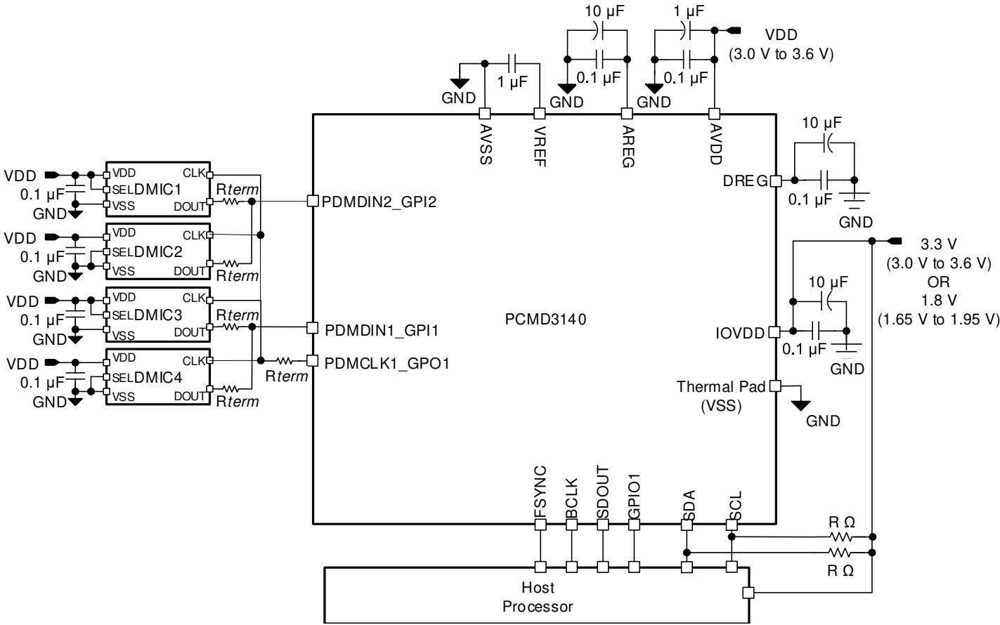  
图 8-1. 四通道数字 PDM 麦克风录音示意图

## 8.2.1.1 设计要求

所使用的电源去耦电容必须为低 ESR 陶瓷电容。表 8-1 列出了此应用的设计参数。

表 8-1. 设计参数


| KEY 参数 | SPECIFICATION |
| --- | --- |
| AVDD | 3.3 V |
| AVDD 电源电流消耗 | 10 mA (PLL on, four-channel recording,  $f_{S} = 48$  kHz, PDMCLKx = 64 ×  $f_{S}$ ) |
| IOVDD | 1.8 V or 3.3 V |


## 8.2.1.2 详细设计流程

本节描述了为此特定应用配置 PCMD3140 所需的步骤。以下步骤提供了在器件上电和从器件读取数据之间，或从一种操作模式转换到另一种操作模式之间必须执行的一系列操作。

1. Apply power to the device:

a. Power-up the IOVDD and AVDD power supplies

b. Wait for at least 1 ms to allow the device to initialize the internal registers initialization

c. The device now goes into sleep shutdown mode (low-power mode < 10 µA)

2. Transition from sleep mode to active mode whenever required for the recording operation:

a. Wake up the device by writing to P0\_R2 to disable sleep mode

b. Wait for at least 1 ms to allow the device to complete the internal wake-up sequence

c. Override the default configuration registers or programmable coefficients value as required (this step is optional)

d. Configure channel 1 to channel 2 (CHx\_INSRC) for the digital microphone as the input source for recording

e. Configure GPO1 (GPO1\_CFG) and GPIO1 (GPIO1\_CFG) as the PDMCLK output

f. Configure GPIx (GPI1x\_CFG) as PDMDINx

g. Enable all desired input channels by writing to P0\_R115

h. Enable all desired audio serial interface output channels by writing to P0\_R116

i. Power-up the PDM converter and PLL by writing to P0\_R117

j. Apply FSYNC and BCLK with the desired output sample rates and the BCLK to FSYNC ratio

此特定步骤可在步骤 a 之后序列中的任何时间点执行。

有关支持的采样率和 BCLK 与 FSYNC 比率，请参阅锁相环 (PLL) 和时钟生成章节。

k. The device recording data is now sent to the host processor using the TDM audio serial data bus

3. Transition from active mode to sleep mode (again) as required in the system for low-power operation:

a. Enter sleep mode by writing to P0\_R2 to enable sleep mode

b. Wait at least 6 ms (when FSYNC = 48 kHz) for the volume to ramp down and for all blocks to power down

c. Read P0\_R119 to check the device shutdown and sleep mode status

d. If the device P0\_R119\_D7 status bit is 1'b1 then stop FSYNC and BCLK in the system

e. The device now goes into sleep mode (low-power mode < 10 µA) and retains all register values

4. Transition from sleep mode to active mode (again) as required for the recording operation:

a. Wake up the device by writing to P0\_R2 to disable sleep mode

b. Wait at least 1 ms to allow the device to complete the internal wake-up sequence

c. Apply FSYNC and BCLK with the desired output sample rates and the BCLK to FSYNC ratio

d. The device recording data are now sent to the host processor using the TDM audio serial data bus

5. Repeat step 3 and step 4 as required for mode transitions and step 2 to step 4 for configuration changes.

## 8.2.1.2.1 EVM 设置示例器件寄存器配置脚本

本节提供了典型的 EVM I<sup>2</sup>C 寄存器控制脚本，展示了如何在 4 通道数字 PDM 麦克风录音模式下设置 PCMD3140。

```txt
# Key: w 9C XX YY ==> write to I2C address 0x9C, to register 0xXX, data 0xYY
#
# 以下列表给出了在器件上电和从器件读取数据之间必须执行的操作序列示例。
# 请注意，根据使用的功能不同，还有其他有效的序列。
#
# 有关跳线设置和音频连接，请参阅 PCMD3140EVM 用户指南。
#
# PDM 8-channel : PDMDIN1 - Ch1 and Ch2, PDMDIN2 - Ch3 and Ch4,
#
#    PDMDIN3 - Ch5 and Ch6, PDMDIN4 - Ch7 and Ch8
# PDMCLKx = 2.8224 MHz (PDMCLKx/FSYNC = 64)
# FSYNC = 44.1 kHz (Output Data Sample Rate), BCLK = 11.2896 MHz (BCLK/FSYNC = 256)
##########
#
#
# Power up IOVDD and AVDD power supplies
# 等待 IOVDD 和 AVDD 电源稳定到稳态工作电压范围。
# Wait for 1ms.
#
# Wake-up device by I2C write into P0_R2 using internal AREG
w 9C 02 81
#
# Configure CH2_INSRC as Digital PDM Input by I2C write into P0_R65
w 9C 41 40
#
# Configure MICBIAS_GPI2 as Digital PDM Input by I2C write into P0_R59
w 9C 3B 70
#
# Configure GPO1 as PDMCLK by I2C write into P0_R34
w 9C 22 41
#
# Configure GPI1 and GPI2 as PDMDIN1 and PDMDIN2 by I2C write into P0_R43
w 9C 2B 45
#
# Enable Input Ch-1 to Ch-4 by I2C write into P0_R115
w 9C 73 F0
#
# Enable ASI Output Ch-1 to Ch-4 slots by I2C write into P0_R116
w 9C 74 F0
#
# Power-up ADC and PLL by I2C write into P0_R117
w 9C 75 60
#
# Apply FSYNC = 44.1 kHz and BCLK = 11.2896 MHz and
# Start recording data by host on ASI bus with TDM protocol 32-bits channel wordlength
```

## 8.2.1.3 应用曲线

在 EVM 上通过使用 Audio Precision 向器件馈送 PDM 数字输入信号来进行测量。在系统应用中，器件性能预计将受单位 PDM 调制器数字麦克风输出性能的限制。

4th-order PDM modulator with PDMCLKx = 2.8224 MHz  
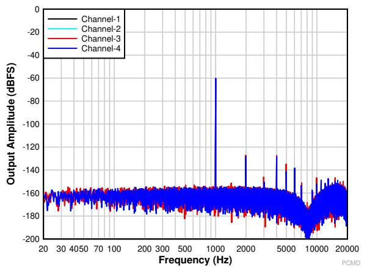  
图 8-2. FFT With a –60-dBr Input

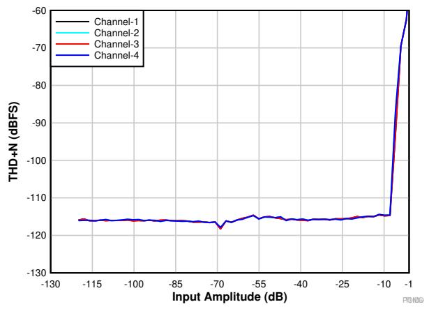  
图 8-3. THD+N vs Input Amplitude

## 8.3 注意事项

在 VAD 操作模式下，当使能自动唤醒时，中断生成存在一些限制。有关这些限制的详细信息，请参阅《在 TLV320ADC5120 和 TLV320ADC6120 中使用话音激活检测器 (VAD)》应用报告。

## 9 电源供电建议

IOVDD 和 AVDD 电源轨之间的上电顺序可以任意顺序施加。但是，只有在所有电源稳定后才启动 $\mathsf { I } 2 \mathsf { C }$ 事务以初始化器件。

对于电源上电要求，$\mathfrak { t } _ { 1 }$ 和 $\mathbf { t } _ { 2 }$ 必须至少为 2ms，以使器件初始化内部寄存器。有关器件电源稳定到建议的工作电压电平后器件如何以各种模式运行的详细信息，请参阅器件功能模式章节。对于电源断电要求，$\mathfrak { t } _ { 3 }$ 和 $\mathrm { t } _ { 4 }$ 必须至少为 10ms。此时序（如 图 9-1 所示）允许器件降低录音数据的音量，关闭模拟和数字模块，并将器件置于关断模式。器件也可以通过降低电源来立即进入关断模式，但这样做会导致突然关断。

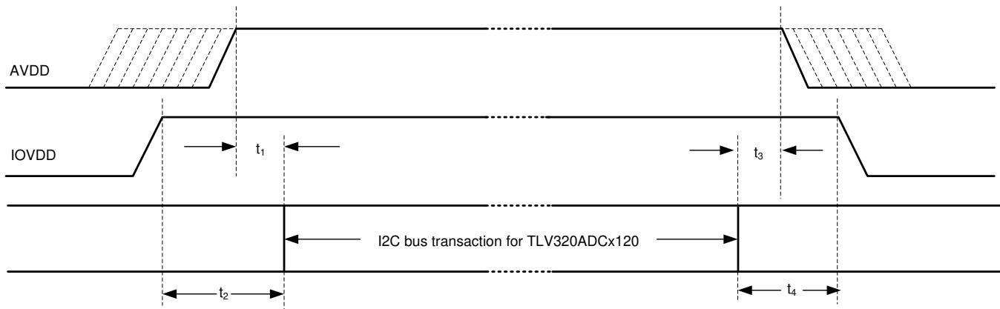  
图 9-1. Power-Supply Sequencing Requirement Timing Diagram

确保电源斜坡速率低于 1V/µs，并且断电和上电事件之间的等待时间至少为 100ms。对于低于 0.1V/ms 的电源斜坡速率，主机设备必须在配置器件之前首先执行软件复位。确保所有数字输入引脚处于有效输入电平，并且在电源时序期间不发生翻转。

PCMD3140 通过集成片内数字稳压器 DREG 和模拟稳压器 AREG 来支持单 AVDD 电源操作。但是，如果系统中的 AVDD 电压低于 1.98V，则在电路板上短接 AREG 和 AVDD 引脚，并通过保持 P0_R2 的 AREG_SELECT 位为 1b'0（默认值）来禁用内部 AREG。如果系统中使用的 AVDD 电源高于 2.7V，则主机设备可以在退出睡眠模式时将 AREG_SELECT 设置为 1'b1，以允许器件内部稳压器生成 AREG 电源。

## 10 布局

## 10.1 布局指南

每个系统设计和印刷电路板 (PCB) 布局都是独特的。布局必须在特定 PCB 设计的背景下仔细审查。但是，以下指南可以优化器件性能：

• 将散热焊盘连接到地。使用过孔图案将器件散热焊盘（器件正下方区域）连接到接地平面。此连接有助于器件散热。

• 电源的去耦电容必须靠近器件引脚放置。

• 电源去耦电容必须使用低 ESR 的陶瓷类型。

• 避免数字信号和模拟信号交叉，以防止不必要的串扰。

• 器件内部电压基准必须使用外部电容进行滤波。将滤波电容靠近 VREF 引脚放置以获得最佳性能。

• 在为多个麦克风布线偏置或电源走线时，直接接入 MICBIAS 引脚以避免公共阻抗，从而避免麦克风之间的耦合。

• 将 VREF 和 MICBIAS 外部电容的接地端直接短接到 AVSS 引脚，此连接走线不使用任何过孔。

• 将 MICBIAS 电容（具有低等效串联电阻）靠近器件放置，走线阻抗最小。

• 使用接地平面为器件和去耦电容之间的电源和信号电流提供最低阻抗。将器件正下方区域视为器件的中央接地区域，所有器件地必须直接连接到该区域。

## 10.2 布局示例

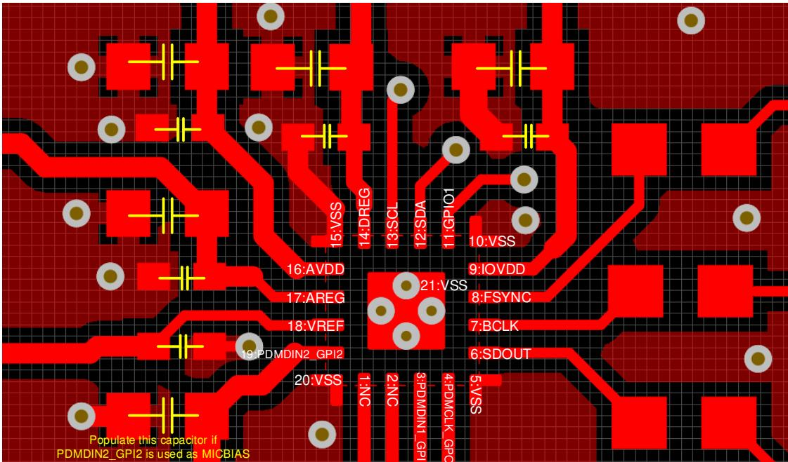  
图 10-1. 布局示例

## 11 器件和文档支持

## 11.1 文档支持

## 11.1.1 相关文档

相关文档请参阅以下：

• 德州仪器，《多个 TLV320ADCx140 器件共享 TDM 和 I<sup>2</sup>C 总线》应用报告

• 德州仪器，《将 TLV320ADCx120 配置和操作为音频总线主设备》应用报告

德州仪器，《TLV320ADCx140 采样率和支持的可编程处理模块》应用报告

• 德州仪器，《TLV320ADCx140 可编程双二阶滤波器配置和应用》应用报告

• 德州仪器，《TLV320ADCx120 各种使用场景下的功耗矩阵》应用报告

• 德州仪器，《在 TLV320ADC5120 和 TLV320ADC6120 中使用话音激活检测器 (VAD)》应用报告

• Texas Instruments, ADCx120EVM-PDK Evaluation module user's guide

• Texas Instruments, PurePath™ Console Graphical Development Suite for Audio System Design and Development

## 11.2 接收文档更新通知

要接收文档更新通知，请导航至 ti.com 上的器件产品文件夹。点击订阅更新进行注册，即可每周接收产品信息更改摘要。有关更改的详细信息，请查看任何已修订文档中包含的修订历史记录。

## 11.3 支持资源

TI E2E™ 支持论坛是工程师的重要参考资料，可直接从专家获得快速、经过验证的解答和设计帮助。搜索现有解答或提出自己的问题可获得所需的快速设计帮助。

链接的内容由各个贡献者“按原样”提供。这些内容并不构成 TI 技术规范，并且不一定反映 TI 的观点；请参阅TI 的《使用条款》。

## 11.4 商标

PurePath™ 和 TI E2E™ 是德州仪器的商标。

所有商标均为其各自所有者的财产。

## 11.5 静电放电警告


此集成电路可能因 ESD 而损坏。德州仪器建议所有集成电路都应采取适当的预防措施进行处理。不遵守正确的处理和安装程序可能导致损坏。

ESD damage can range from subtle performance degradation to complete device failure. Precision integrated circuits may be more susceptible to damage because very small parametric changes could cause the device not to meet its published specifications.

## 11.6 术语表

TI 术语表 本术语表列出并解释了术语、首字母缩略词和定义。

## 12 机械、封装和可订购信息

以下页面包含机械、封装和可订购信息。此信息是指定器件可用的最新数据。此数据如有更改，恕不另行通知，也不另行修订本文档。对于基于浏览器的本数据表版本，请参阅左侧导航栏。

## 重要声明和免责声明

TI 提供技术和可靠性数据（包括数据表）、设计资源（包括参考设计）、应用或其他设计建议、网络工具、安全信息和其他资源，不保证没有瑕疵且不做出任何明示或暗示的担保，包括但不限于对适销性、某特定用途方面的适用性或不侵犯任何第三方知识产权的暗示担保。这些资源可供使用 TI 产品进行设计的熟练开发人员使用。您将自行承担以下全部责任：(1) 针对您的应用选择合适的 TI 产品，(2) 设计、验证并测试您的应用，(3) 确保您的应用满足相应标准以及任何其他安全、安保或其他要求。这些资源如有变更，恕不另行通知。TI 授权您仅可将这些资源用于研发本资源所述的 TI 产品的应用。严禁对这些资源进行其他复制或展示。您无权使用任何其他 TI 知识产权或任何第三方知识产权。您应全额赔偿因在这些资源的使用中对 TI 及其代表造成的任何索赔、损害、成本、损失和债务，TI 对此概不负责。TI 提供的产品受 TI 的销售条款 (https:www.ti.com/legal/termsofsale.html) 或 ti.com 上其他适用条款/TI 产品随附的其他适用条款的约束。TI提供这些资源并不会扩展或以其他方式更改 TI 针对 TI 产品发布的适用的担保或担保免责声明。

邮寄地址：Texas Instruments, Post Office Box 655303, Dallas, Texas 75265Copyright © 2021，德州仪器 (TI) 公司

## PACKAGING INFORMATION


| 可订购器件型号 | 状态(1) | 材料类型(2) | 封装 | 引脚 | 封装数量 | 载体 | RoHS(3) | 引脚镀层/ 球体材料(4) | MSL 等级/ 峰值回流(5) | 工作温度 (°C) | 器件标记(6) |
| --- | --- | --- | --- | --- | --- | --- | --- | --- | --- |
| PCMD3140IRTER | 活跃 | 量产 | WQFN (RTE) | 20 | 3000 | 大卷带 | 是 | SN | Level-2-260C-1 年 | -40 至 125 | PD3140 |
| PCMD3140IRTER.A | 活跃 | 量产 | WQFN (RTE) | 20 | 3000 | 大卷带 | 是 | SN | Level-2-260C-1 年 | -40 至 125 | PD3140 |


<sup>(1)</sup> 状态：有关状态的更多详细信息，请参阅我们的产品生命周期。

<sup>(2)</sup> 材料类型：当指定时，预生产器件为原型/实验器件，尚未批准或发布用于全面量产。测试和最终工艺（包括但不限于质量保证、可靠性性能测试和/或工艺鉴定）可能尚未完成，此器件可能会进一步更改或可能停产。如果可供订购，购买时将在结账时需要额外的豁免声明，并且仅用于早期内部评估目的。这些器件不附任何形式的保证。

<sup>(3)</sup> RoHS values: 是, No, RoHS Exempt. See the TI RoHS Statement for additional information and value definition.

<sup>(4)</sup> 引脚镀层/球体材料：器件可能有多种材料镀层选项。镀层选项由垂直线分隔。如果镀层值超过最大列宽，引脚镀层/球体材料值可能换行为两行。

<sup>(5)</sup> MSL rating/Peak reflow: The moisture sensitivity level ratings and peak solder (reflow) temperatures. In the event that a part has multiple moisture sensitivity ratings, only the lowest level per JEDEC standards is shown. Refer to the shipping label for the actual reflow temperature that will be used to mount the part to the printed circuit board.

<sup>(6)</sup> Part marking: There may be an additional marking, which relates to the logo, the lot trace code information, or the environmental category of the part.

多个器件标记将在括号内。括号内由 "\~" 分隔的仅一个器件标记将出现在器件上。如果一行缩进，则它是前一行的延续，两者组合表示该器件的完整器件标记。

重要信息和免责声明：本页面提供的信息代表 TI 截至提供之日的知识和信念。TI 的知识和信念基于第三方提供的信息，对此类信息的准确性不作任何陈述或保证。目前正在努力更好地整合适用第三方的信息。TI 已采取并将继续采取合理步骤提供具有代表性和准确的信息，但可能未对来料和化学品进行破坏性测试或化学分析。TI 和 TI 供应商认为某些信息属于专有信息，因此 CAS 编号和其他有限信息可能无法发布。

TI 因该等信息而产生的责任在任何情况下均不得超过 TI 每年向客户出售的本文件中涉及的 TI 器件的总购买价。

## PCMD3140 的其他认证版本：

汽车级：PCMD3140-Q1

25-May-2026

注：认证版本定义：

• 汽车级 - Q100 器件经认证适用于高可靠性汽车应用，目标为零缺陷

卷带和卷盘信息  
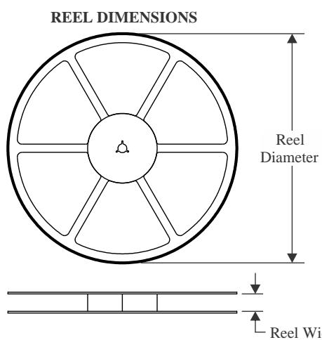

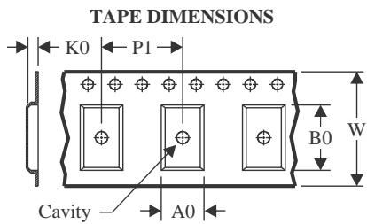


| A0 | 设计用于容纳元件宽度的尺寸 |
| --- | --- |
| B0 | 设计用于容纳元件长度的尺寸 |
| K0 | 设计用于容纳元件厚度的尺寸 |
| W | 载带总宽度 |
| P1 | 相邻型腔中心之间的间距 |


卷盘宽度 (W1)  
卷带中引脚 1 方向的象限分配  
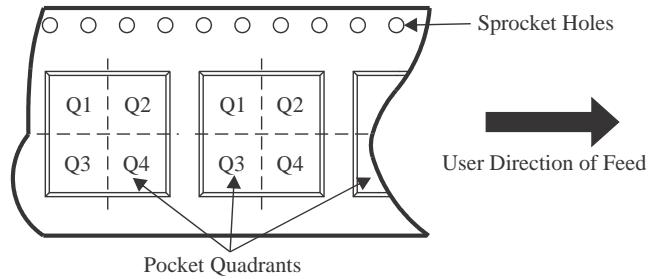

\*All dimensions are nomina


| 器件 | 封装类型 | 封装图纸 | 引脚 | SPQ | 卷盘直径 (mm) | 卷盘宽度 W1 (mm) | A0 (mm) | B0 (mm) | K0 (mm) | P1 (mm) | W (mm) | 引脚1 象限 |
| --- | --- | --- | --- | --- | --- | --- | --- | --- | --- | --- | --- | --- |
| PCMD3140IRTER | WQFN | RTE | 20 | 3000 | 330.0 | 12.4 | 3.3 | 3.3 | 1.1 | 8.0 | 12.0 | Q2 |


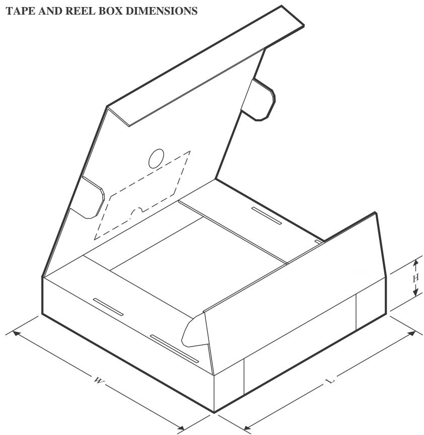

\*All dimensions are nominal


| 器件 | 封装类型 | 封装图纸 | 引脚 | SPQ | 长度 (mm) | 宽度 (mm) | 高度 (mm) |
| --- | --- | --- | --- | --- | --- | --- | --- |
| PCMD3140IRTER | WQFN | RTE | 20 | 3000 | 367.0 | 367.0 | 35.0 |


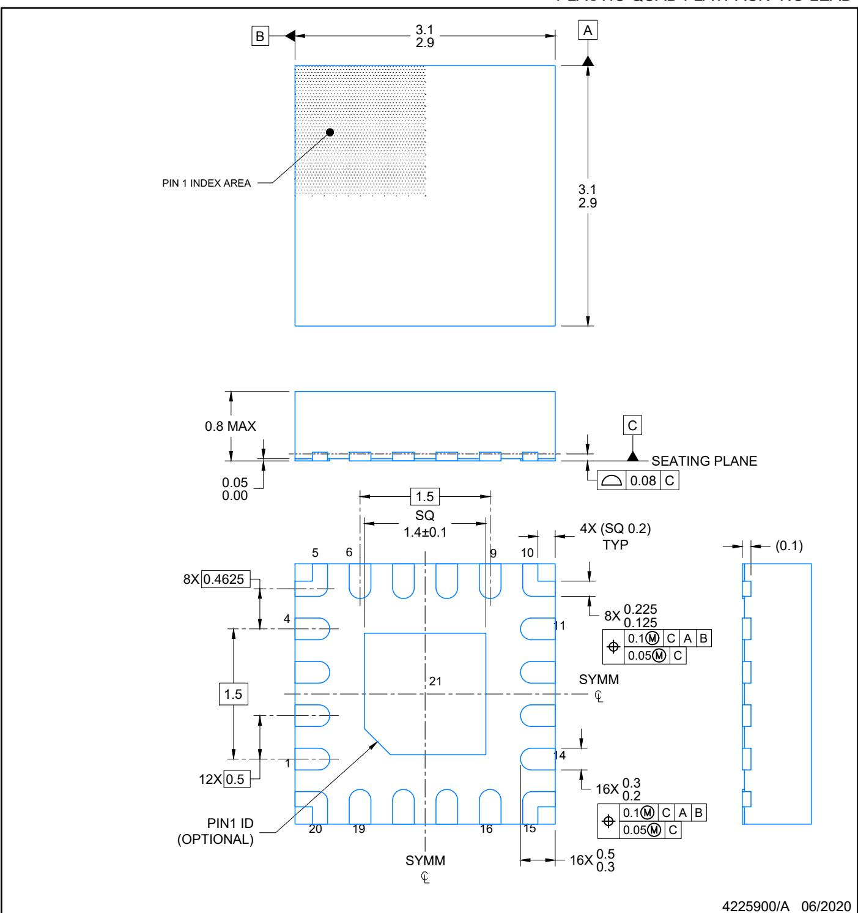  
注：

塑料四方扁平无引线封装

注： (continued)

塑料四方扁平无引线封装  
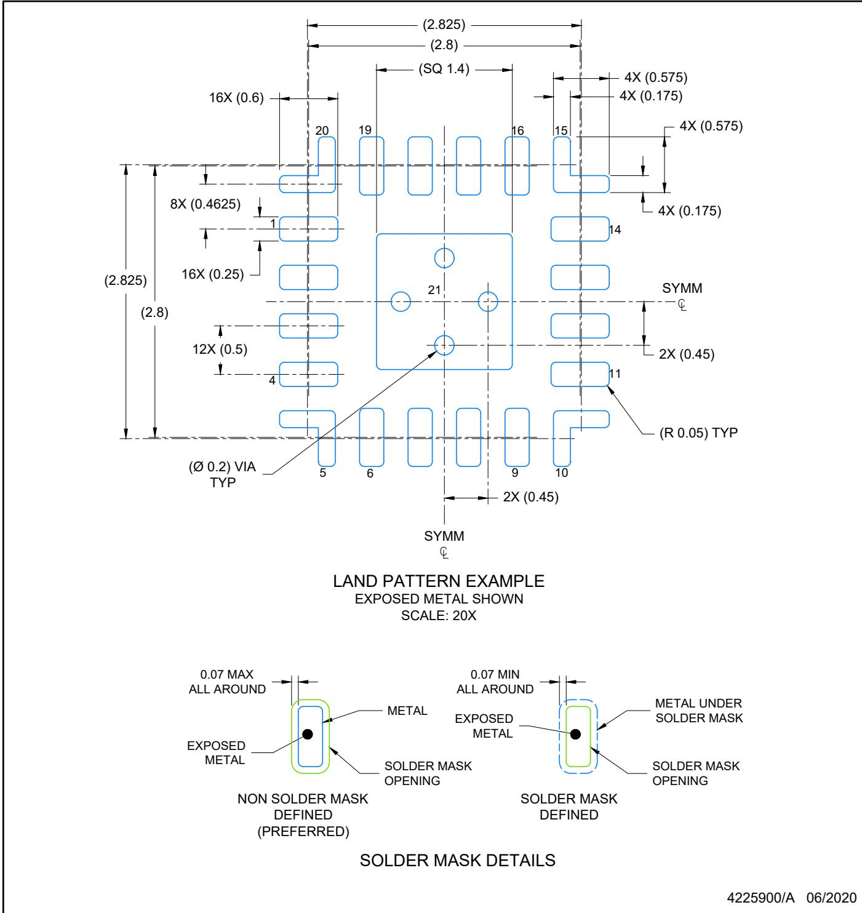

4225900/A 06/2020

4. This package is designed to be soldered to a thermal pad on the board. For more information, see Texas Instruments literature number SLUA271 (www.ti.com/lit/slua271) .

5. 过孔根据应用可选，请参阅器件数据表。如果使用了任何过孔，请参考此视图中所示的位置。建议对焊膏下的过孔进行填充、堵塞或覆盖。

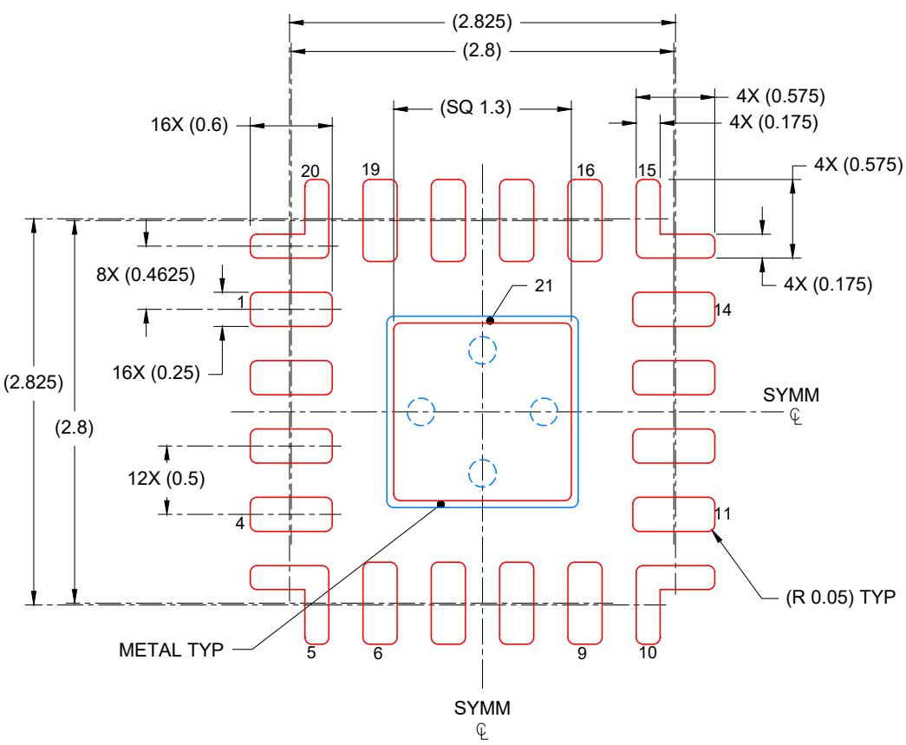

基于 0.125mm 厚度钢网的焊膏示例

# 外露焊盘 86% 按面积印刷覆盖率 比例：20X

4225900/A 06/2020

注： (continued)

6. 具有梯形壁和圆角的激光切割开孔可提供更好的焊膏释放效果。IPC-7525 可能提供了替代设计建议。

## 重要通知和免责声明

TI“按原样”提供技术和可靠性数据（包括数据表）、设计资源（包括参考设计）、应用或其他设计建议、网络工具、安全信息和其他资源，不保证没有瑕疵且不做出任何明示或暗示的担保，包括但不限于对适销性、与某特定用途的适用性或不侵犯任何第三方知识产权的暗示担保。这些资源可供使用 TI 产品进行设计的熟练开发人员使用。您将自行承担以下全部责任：(1) 针对您的应用选择合适的 TI 产品，(2) 设计、验证并测试您的应用，(3) 确保您的应用满足相应标准以及任何其他安全、安保法规或其他要求。

这些资源如有变更，恕不另行通知。TI 授权您仅可将这些资源用于研发本资源所述的 TI 产品的相关应用。严禁以其他方式对这些资源进行复制或展示。您无权使用任何其他 TI 知识产权或任何第三方知识产权。对于因您对这些资源的使用而对 TI 及其代表造成的任何索赔、损害、成本、损失和债务，您将全额赔偿，TI 对此概不负责。

TI 提供的产品受 TI 销售条款)、TI 通用质量指南 或 ti.com 上其他适用条款或 TI 产品随附的其他适用条款的约束。TI 提供这些资源并不会扩展或以其他方式更改 TI 针对 TI 产品发布的适用的担保或担保免责声明。 除非德州仪器 (TI) 明确将某产品指定为定制产品或客户特定产品，否则其产品均为按确定价格收入目录的标准通用器件。

TI 反对并拒绝您可能提出的任何其他或不同的条款。

版权所有 © 2026，德州仪器 (TI) 公司

最后更新日期：2025 年 10 月
