# Qucs-S：模拟仿真入门指南

Vadim Kuznetsov

2024 年 7 月 11 日

> 本文档由 `qucs_s_tutorial.md`（英文原版，源自 `qucs_s_tutorial.pdf`）翻译为简体中文。
> 示意图/截图路径、LaTeX 公式、表格与代码示例均保持原样：图片仍引用 `images/` 目录，原理图中的器件名、节点名、菜单项与 SPICE 语法未作改动。

## 1 引言

Qucs-S 于 2017 年从 Qucs 跨平台电路仿真器分支而来，其中字母 “S” 表示 SPICE。Qucs-S 子项目的目的是把自由的 SPICE 电路仿真内核与 Qucs 图形界面结合起来，兼得 SPICE 的强大功能与 Qucs GUI 的简洁易用。Qucs 有意使用自己研发的、与 SPICE 不兼容的仿真内核 Qucsator，它具备先进的射频与交流域仿真能力，但现有的大多数工业级 SPICE 模型都与它不兼容。Qucs-S 本身并不是一个仿真器，它必须配合一个仿真后端（backend）来使用。Qucs 与 Qucs-S 的原理图文档格式完全兼容。Qucs-S 允许搭配使用以下仿真内核：

• 推荐使用 Ngspice。Ngspice 是一款功能强大的混合层次/混合信号电路仿真器，大多数工业级 SPICE 模型都与 Ngspice 兼容；它在开关电路的时域仿真方面性能优异，并带有强大的后处理器。

• XYCE 是 Sandia 从零开始编写的、兼容 SPICE 的新型电路仿真器。

• SpiceOpus 由卢布尔雅那大学电气工程学院开发，基于 SPICE-3f5 代码。

• QucsatorRF 用于微波器件与微带线的射频仿真。它不是 SPICE 兼容的仿真器，不推荐用于通用电路。

Qucs-S 是跨平台软件，除 Windows™ 之外还支持多种 Linux 发行版。Linux 软件包由 Open Build Service（OBS）系统自动生成，请访问官方网站查看受支持的发行版列表。请注意：安装包并不包含仿真内核，需要单独安装，推荐使用 Ngspice。在 Debian 和 Ubuntu 上，Ngspice 会作为依赖被自动安装；其他平台的安装方法请参阅 Ngspice 官方网站。

## 2 首次启动时的设置

Qucs-S 安装完成后会要求选择仿真内核。从 2.0.0 版本开始，应用在首次启动时会尝试在常见的系统位置查找 Ngspice：若自动找到了 Ngspice 可执行文件，会显示一条提示信息；否则将提示用户手动配置仿真器。首次启动后会打开如下窗口（图 1），请用下拉列表选择默认仿真器，必要时修正仿真器可执行文件的路径。之后也可以通过 Simulation->Select default simulator（仿真->选择默认仿真器）菜单修改这些设置。

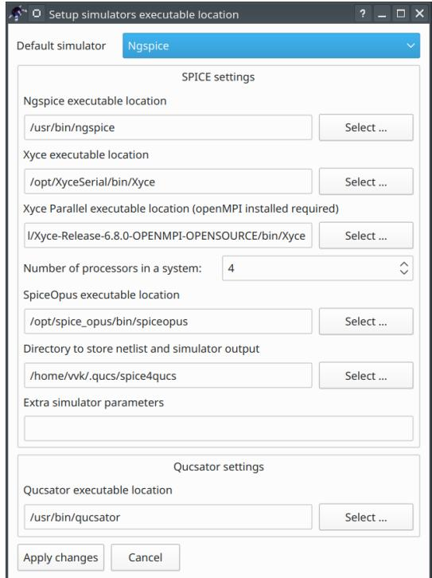  
图 1：仿真器设置对话框

自 2.0.0 版本起，支持在无需重启应用的情况下快速切换仿真内核，详见第 10 节。

## 3 主窗口结构

Qucs-S 主窗口如图 2 所示，由两个区域构成：右侧的原理图编辑器（4）和左侧的主停靠面板（1）。可以同时打开多个原理图，并通过原理图编辑区上方的标签栏在它们之间切换。

左侧停靠面板有四个选项卡（3）：Projects（工程）、Content（内容）、Components（元件）和 Libraries（库）。应用启动后默认打开 Projects 选项卡；由于是全新安装、还没有任何工程，所以它是空的。Components 选项卡（见图 2）列出 Qucs 中可用的基本器件，元件被划分为若干类别（集总器件、非线性器件、仿真等），可通过下拉列表（2）切换类别。状态栏位于主窗口底部，其中显示当前生效的仿真内核（例如图 2 中为 Ngspice）。

工具栏位于主菜单下方的主窗口顶部，上面有一些常用按钮：Wire（导线，6）、Node name（节点名，7）、Ground（接地，8）和 Marker（标记，9）。

在 Qucs-S 中一切都被视为元件。仿真、方程和 SPICE 指令同样是特殊元件，可以在元件面板的专门类别中找到；图表（diagram）也是特殊元件，位于下拉列表（2）的 diagrams 类别中。

要把元件放到原理图上，先从下拉列表（2）中选择所需类别（例如 “lumped components”），再点击相应符号（例如 “Resistor”）。把鼠标光标移入工作区（4）时，你会“携带”一个电阻符号的图形：按鼠标右键可旋转符号，按鼠标左键则把元件放置到原理图上。

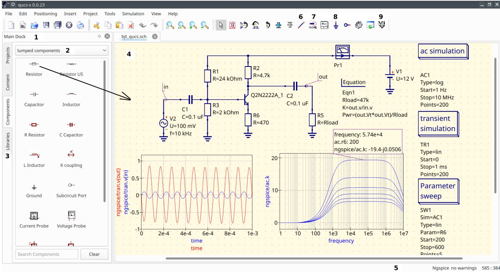  
图 2：Qucs-S 主窗口。说明见正文

元件属性可以通过属性对话框（图 3）编辑，该对话框可从元件右键菜单调出，或在元件上双击左键打开。

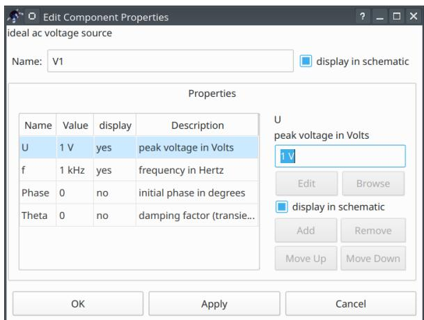  
图 3：元件属性对话框

## 4 逐步搭建模拟仿真的操作指南

## 4.1 交流与瞬态仿真

我们以 Ngspice 为后端，用 Qucs-S 仿真一个 RC 电路，原理图见图 4。下面进行交流仿真与瞬态仿真，并绘制电路的幅频响应以及输入、输出节点上的波形。请按以下步骤绘制原理图并设置仿真。

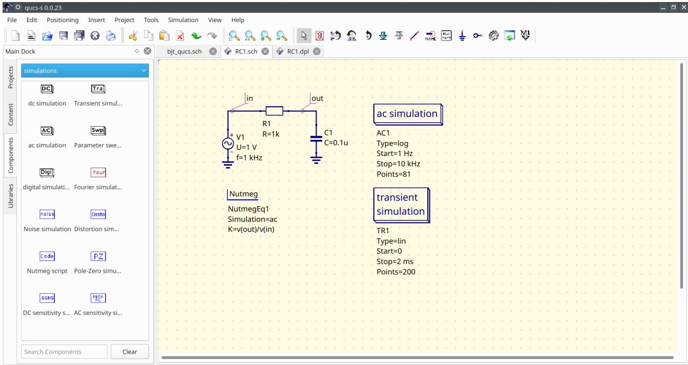  
Ngspice 无警告 35: 90

图 4：Qucs-S 中的 RC 电路

• 第 1 步：把元件放到原理图上，并按图 4 所示设置其属性。我们需要电阻、电容（两者都在集总器件类别中）以及交流电压源（在 sources 类别中）。接地与导线可以通过应用工具栏上的按钮（6）和（8）取得（见图 2）。

• 第 2 步：把仿真放到原理图上。我们需要交流仿真（AC simulation）和瞬态仿真（Transient simulation），两者都可从 simulations 类别中取得（见图 4），其放置过程与普通元件相同。按图 4 所示设置仿真的属性：双击仿真器件会打开一个专用对话框（图 5）。对交流仿真，输入起始频率（1 Hz）和终止频率（10 kHz），并选择对数扫频类型；对瞬态仿真，输入终止时间（2 ms）和点数（200 points）。

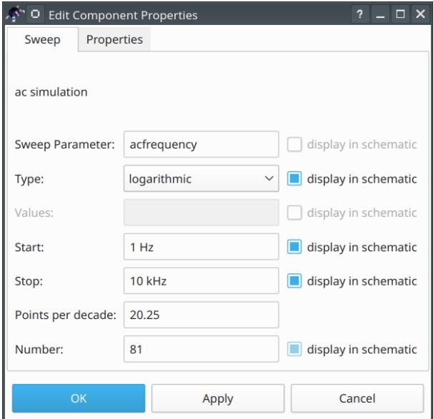  
图 5：仿真属性对话框

• 第 3 步：使用工具栏上的按钮（6）在原理图上放置名为 in 和 out 的节点标签（见图 2）。节点名称可以在专用对话框中设置（图 6）。

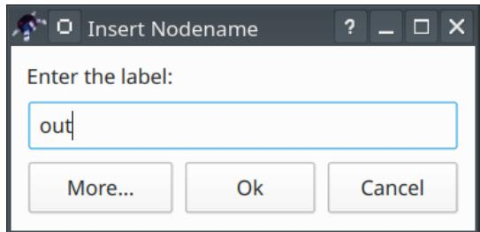  
图 6：节点标签设置对话框

• 第 4 步：在原理图上放置幅频响应方程 $K = V _ { o u t } / V _ { i n }$。该方程是一种名为 Nutmeg equation 的特殊元件，可在 spice specific sections（SPICE 专用段）类别中找到。它完整支持 SPICE 的数学函数与节点名语法，详见 Ngspice 手册。每个 Nutmeg 方程都必须指定所针对的仿真：我们只打算计算交流仿真的幅频响应，因此需要把 ac 作为该器件的第一个属性输入，如图 7 所示。

• 第 5 步：用 File -> Save as 菜单或 Ctrl-S 快捷键把原理图保存为 \*.sch 文件。此时原理图已可用于仿真。

• 第 6 步：执行仿真。按 Simulation -> Simulate，或按键盘快捷键 F2。稍后会弹出包含仿真器日志消息的对话框（图 8），其中显示来自 Ngspice 的消息，即仿真控制台。

它应当报告仿真已无错误地完成。如果看到错误消息，请检查原理图与应用设置。在 Ngspice 报告仿真结束后，点击 Exit 按钮关闭该窗口，此时就可以在原理图上添加图表了。也可以在这个对话框中保存网表文件。

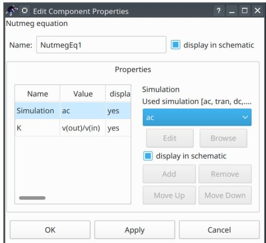  
图 7：方程设置对话框

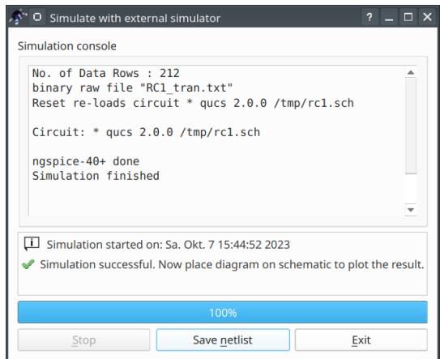  
图 8：仿真对话框

• 第 7 步：在原理图上放置图表（图 9）。我们需要两张笛卡尔图：一张画幅频响应，一张画瞬态波形。图表同样是特殊元件，位于 diagrams 类别中。曲线可在专门的图表属性对话框（图 10）中选择：一张图选择 ac.k 曲线，另一张图选择 tran.v(in) 和 tran.v(out) 曲线。还可以设置坐标轴范围与类型以及图表的配色方案：通过 Properties 选项卡中的设置，为幅频响应图选择对数 X 轴。可以用工具栏上的按钮（9）在图形上放置标记（Marker）（见图 2），标记的位置可用键盘方向键调整。

## 4.2 直流分析

与 Qucs 不同，Qucs-S 没有专门的直流仿真模式。如果原理图上只放置了 DC simulation 元件，则不会启动任何仿真，并会显示错误消息。该元件保留下来只是为了兼容旧的 Qucs 原理图。

不过直流仿真存在两种模式：

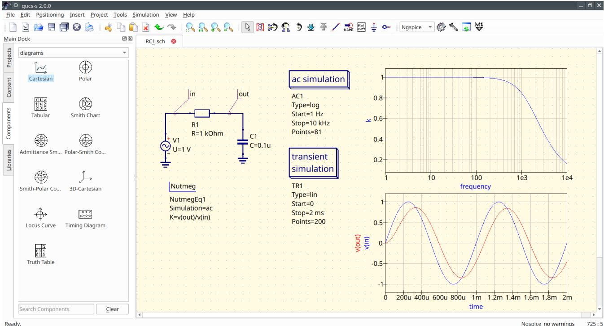  
Ngspice 无警告 725:5

图 9：添加了两张图表的原理图  
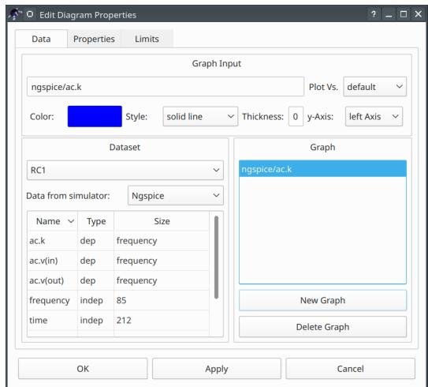  
图 10：图表属性对话框

• 直接在电路上显示工作点。按键盘快捷键 F8，或使用 Simulation->Show bias 菜单项即可激活该模式，示例见图 11。

• 直流扫描模式。需要插入 Parameter sweep（参数扫描）仿真元件，并将其连接到 DC simulation 上。该仿真模式可用于绘制 IV 曲线或获得表格输出，示例见图 12。

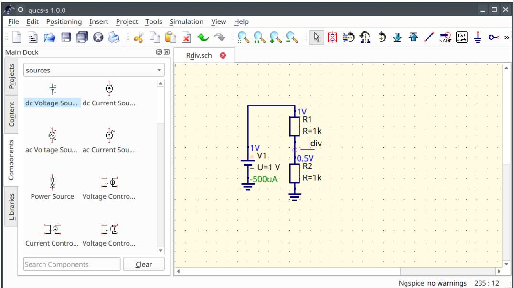

图 11：分压器的工作点仿真  
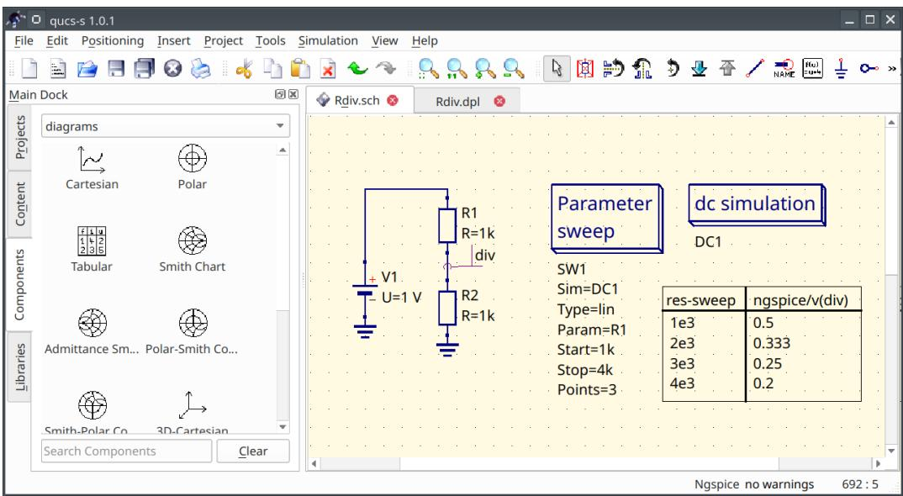  
图 12：用直流扫描获得电阻分压器电压的表格输出

## 5 参数扫描

## 5.1 器件扫描

参数扫描被定义为一种特殊的仿真类型，它挂接到任何其他仿真之上。我们来看一个例子：把参数扫描挂接到图 4 所示的电路上，观察 RC 电路中电阻值对截止频率的影响。

重要提示：与 0.0.20 之前的 Qucs 不同，Qucs-S 不支持直接对变量进行扫描，使用变量扫描的旧 Qucs 原理图将无法工作。参数扫描只支持器件扫描，可接受的器件为电阻、电容或源。

按以下步骤添加参数扫描：

• 第 1 步：把参数扫描元件放到原理图上（图 13）。Parameter sweep 器件可在 simulations 组中找到。

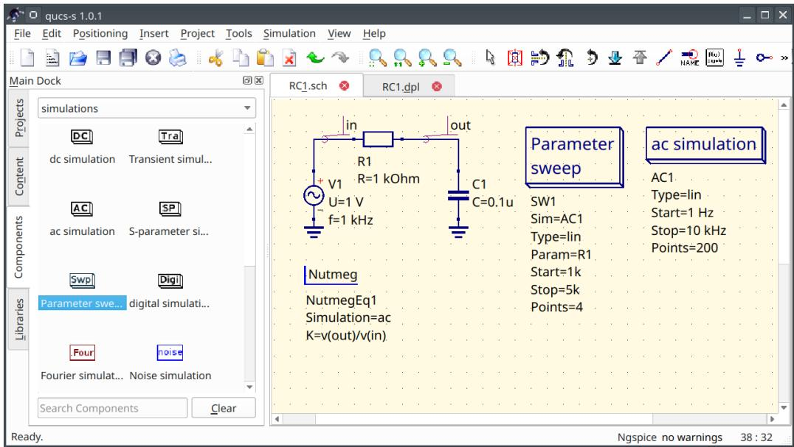  
图 13：在原理图上添加参数扫描

• 第 2 步：设置参数扫描仿真的属性。双击后会打开对话框（图 14）。Simulation 下拉列表给出参数扫描所挂接的仿真元件名称；在本例中我们需要从下拉列表中选择 AC1 仿真，因为要把参数扫描挂接到交流仿真上。Sweep parameter 输入框填写器件名称，这里不接受变量或其他对象的名称！在此输入器件名 R1。Start、Stop、Step 和 Number 输入框用于定义扫描范围。我们将把 R1 的阻值从 1 kOhm 扫描到 5 kOhm，取 4 个扫描点。

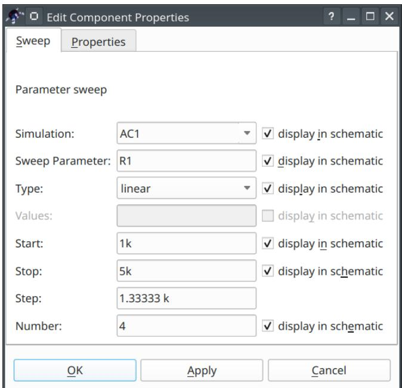  
图 14：设置参数扫描属性

• 第 3 步：运行仿真，并像普通仿真那样放置图表（图 15）。你应该能看到一组曲线族。可以在图表上放置标记，并用方向键 ↑ 和 ↓ 在扫描曲线之间移动它。

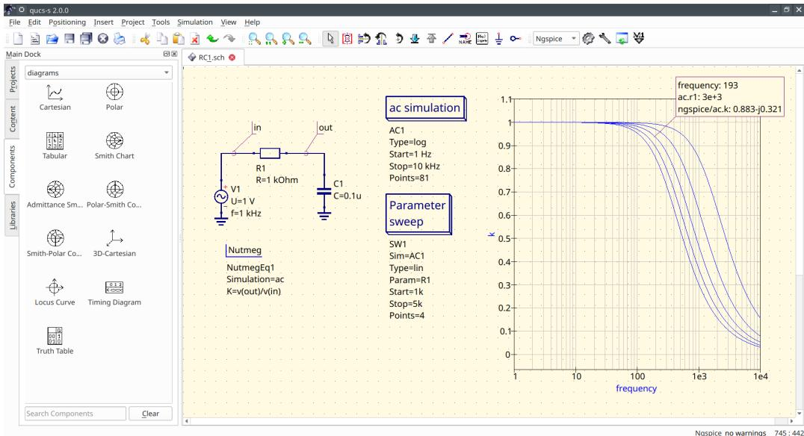  
图 15：带参数扫描的 RC 电路幅频响应

## 5.2 直流扫描

当参数扫描挂接到直流仿真上时，就构成了直流扫描仿真。这种仿真模式已在第 4.2 节中说明。直流扫描只接受器件名（电阻或源）作为扫描参数名，使用变量名的直流扫描不会工作。该仿真模式通常用于获取 IV 曲线。

## 5.3 变量扫描

较新版本的 Ngspice 支持变量扫描。变量需要用 .PARAM 语句定义（该语句可在 SPICE specific sections 组中找到）。Qucs-S 不会自动创建变量。这种仿真模式的示例可参考图 16 所示的原理图。

## 6 数字仿真

## 6.1 带模拟模型的数字器件

包括逻辑门、触发器等在内的数字器件以及更复杂的器件，都可以在 Digital components（数字元件）组中找到。其中一些器件同时具备模拟模型和数字模型，Ngspice 仿真使用 XSPICE 模型。这些器件的列表如下：

• 逻辑门、反相器和缓冲器

• D 型、JK 型、T 型触发器

• 数字源

在模拟仿真模式下使用这些器件没有特殊要求。图 17 所示的例子演示了包含两个反相逻辑门的 RC 振荡电路的瞬态仿真。数字器件的电源电压应通过 .PARAM 段中的 VCC 参数设置。

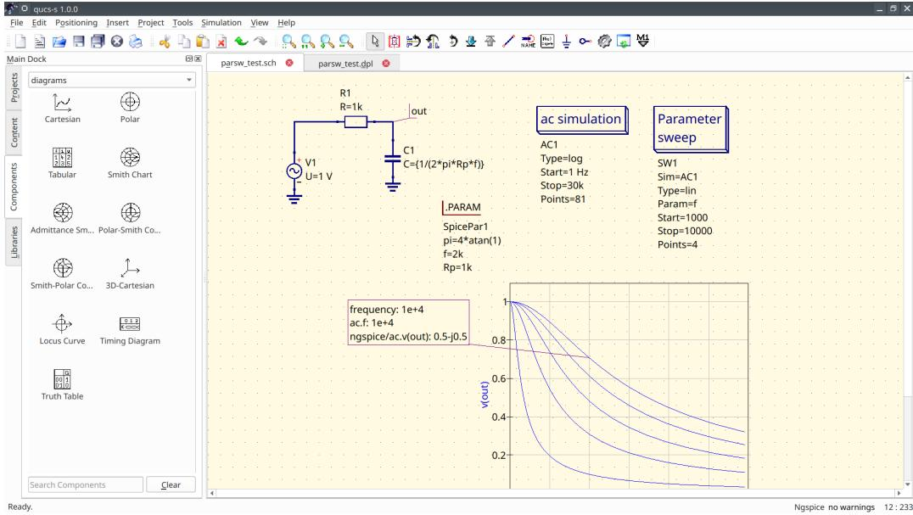

图 16：带参数扫描的 RC 电路幅频响应  
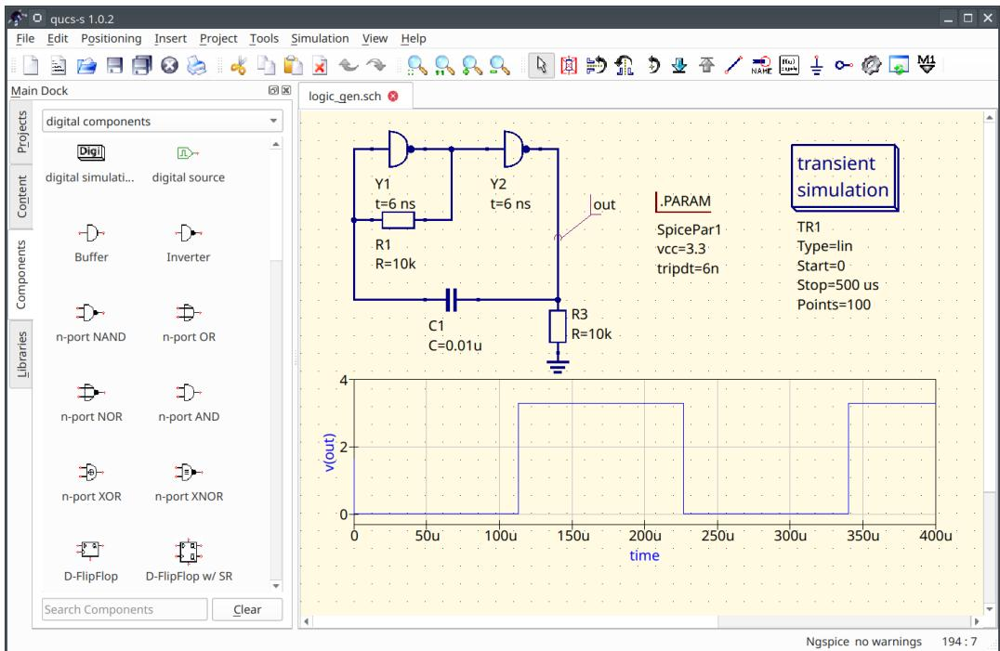  
图 17：使用逻辑门的振荡器示例

## 6.2 使用 Verilog/VHDL 的数字仿真

除上一节列出的器件之外，大多数数字器件不包含模拟 SPICE 模型，这些器件只受数字仿真模式支持。不支持把数字器件与模拟器件（如 RCL）混在同一个电路中！要执行数字仿真，需要安装以下某个免费后端：

• Icarus Verilog iverilog https://steveicarus.github.io/iverilog/

• FreeHDL http://freehdl.seul.org/

在原理图上放置一个名为 Digital simulation 的特殊器件，即可把 Qucs-S 切换到数字模式。如果原理图中检测到数字仿真，就会自动启动 Verilog 或 VHDL 后端来取代 SPICE，用户无需在应用设置中手动把 Qucs-S 切换到数字模式。

数字仿真有两种模式：真值表和时序图。图 18 给出了 2 位译码器/解复用器数字仿真的例子，该仿真使用 Verilog 和时序图模式。

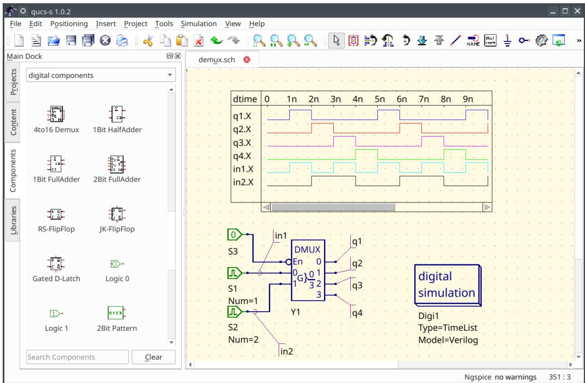  
图 18：用 iverilog 进行数字电路仿真

## 7 调谐模式

自 v2.1.0 版本起，Qucs-S 支持调谐（tuning）仿真模式。调谐器允许用交互式滑块调整元件属性值，并立即在图表上看到结果。包括 Ngspice 和 Qucsator 在内的所有仿真内核都支持调谐模式。调谐器可以充当参数扫描仿真的交互式替代方案。

我们来看如何对图 4 的 RC 电路使用调谐模式。原理图上必须已经放置了仿真和图表，没有定义仿真和图表时调谐器无法工作。通过 Simulation->Tune 菜单或键盘快捷键 F3 激活调谐器，激活后会显示如下对话框（图 19）。接着用户需要用鼠标左键点击器件或器件属性，调谐器窗口中就会新增一个滑块。可以手动设置被调器件属性的上下限，默认范围是起始值的 ±15%。

滑块加入调谐器窗口后，就可以拖动滑块并观察图表上的变化。例如可以看到，当 C 减小时 RC 电路的截止频率升高。如果关闭调谐器窗口，会提示用户是更新还是还原原理图上的元件值。

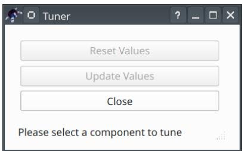

图 19：调谐器对话框  
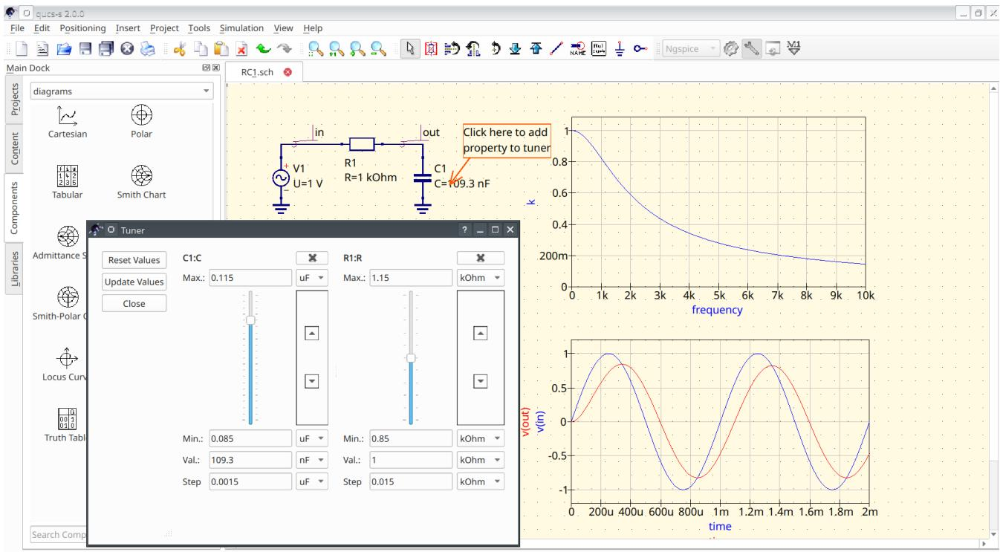  
图 20：RC 电路的调谐

## 8 SPICE 模型的使用

## 8.1 导入 SPICE 模型卡

分立晶体管、二极管等非线性器件的模型以 SPICE 模型卡（modelcard）的形式分发。下面是 1N4007 二极管的模型卡示例，该模型卡定义了名为 DI\_1N4007 的模型。模型卡总是以 .MODEL 指令开头。

```txt
.MODEL DI_1N4007 D (IS=76.9p RS=42.0m BV=1.00k IBV=5.00u + CJO=26.5p M=0.333 N=1.45 TT=4.32u)
```

自 24.3.0 版本起，Qucs-S 能够从 SPICE 模型卡填充统一非线性器件的属性。支持该功能的元件有：

• 二极管

• 双极型晶体管（NPN、PNP）

• MOSFET，包括 3 引脚和 4 引脚（NMOS、PMOS）

## • JFET

上述器件可在左侧面板的 nonlinear components 组中找到，显示为蓝色。microelectronics（微电子）组中与之相似的红色器件不支持该功能。把非线性器件放到原理图上，然后双击器件或通过鼠标右键菜单打开器件属性对话框。该对话框中有名为 Fill from SPICE .MODEL 的按钮，按下它即可导入 SPICE 模型卡，随后会出现如下对话框（图 21）：把模型卡的 SPICE 代码粘贴到大的输入框中，按 OK 按钮。Qucs-S 会识别该 SPICE 模型并自动更新器件属性。

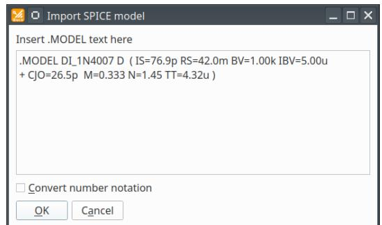  
图 21：导入 SPICE 二极管模型卡

复选框 Convert number notation 用于把数字转换为 Qucs-S 兼容的形式。子电路类型的 SPICE 模型不能用这种方式导入。

## 8.2 导入 SPICE 子电路器件

模拟与数字 IC 等复杂半导体器件以 SPICE 子电路模型的形式定义，这类模型以 .SUBCKT 指令开头。下面的清单给出 LM358 运算放大器的这种模型示例，子电路通常收集在 SPICE 库中。

```txt
*LM358 DUAL OPERATIONAL AMPLIFIER MACRO-MODEL
* connections: non-inverting input
*    inverting input
*    positive power supply
*    negative power supply
*    output
*    |
. SUBCKT LM358 1 2 99 50 28
**************************INPUT STAGE**************************
IOS 2 1 5N
^Input offset current
R1 1 3 500K
R2 3 2 500K
I1 99 4 100U
R3 5 50 517
R4 6 50 517
Q1 5 2 4 QX
Q2 6 7 4 QX
*Fp2=1.2 MHz
```

```txt
C4 5 6 128.27P
**************************COMMON MODE EFFECT**************************
I2 99 50 75U
*^Quiescent supply current
EOS 7 1 POLY(1) 16 49 2E-3 1
*Input offset voltage.~
R8 99 49 60K
R9 49 50 60K
**************************OUTPUT VOLTAGE LIMITING**************************
V2 99 8 1.63
D1 9 8 DX
D2 10 9 DX
V3 10 50 .635
**************************SECOND STAGE**************************
EH 99 98 99 49 1
G1 98 9 POLY(1) 5 6 0 9.8772E-4 0 .3459
*Fp1=7.86 Hz
R5 98 9 101.2433MEG
C3 98 9 200P
**************************POLE STAGE**************************
*Fp=2 MHz
G3 98 15 9 49 1E-6
R12 98 15 1MEG
C5 98 15 7.9577E-14
**************************COMMON-MODE ZERO STAGE**************************
*Fpcm=10 KHz
G4 98 16 3 49 5.6234E-8
L2 98 17 15.9M
R13 17 16 1K
**************************OUTPUT STAGE**************************
F6 50 99 POLY(1) V6 300U 1
E1 99 23 99 15 1
R16 24 23 17.5
D5 26 24 DX
V6 26 22 .63V
R17 23 25 17.5
D6 25 27 DX
V7 22 27 .63V
V5 22 21 0.27V
D4 21 15 DX
V4 20 22 0.27V
D3 15 20 DX
L3 22 28 500P
RL3 22 28 100K
```

## .ENDS

Qucs-S 提供了一个特殊的 Spice library device（SPICE 库器件）元件，用于在原理图中使用 SPICE 子电路。该元件可在左侧面板的 File components（文件元件）组中找到。放置 Spice library 器件后，双击或通过右键菜单进入其属性，将打开如下对话框（图 22）。

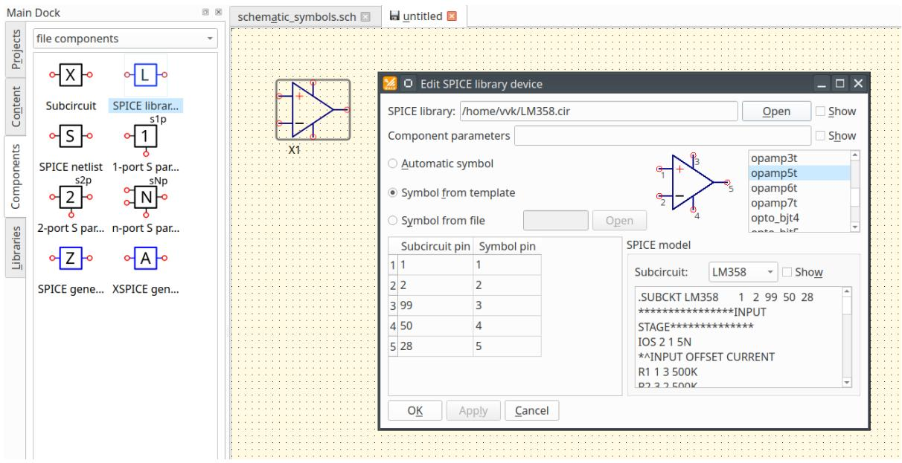  
图 22：SPICE 库器件属性

该对话框包含若干输入框和其他输入控件。请按以下步骤设置 SPICE 器件属性。

1. 在 SPICE library 输入框中指定包含子电路类型模型的 SPICE 库文件路径；

2. 从 Subcircuit 下拉列表中选择要使用的 SPICE 模型。Qucs-S 会解析指定的库文件，并把其中找到的所有 .SUBCKT 条目填入该下拉列表。

3. 为 SPICE 器件选择符号。共有三种方式：Automatic symbol 生成矩形符号；Symbol from template 可从对话框右侧的列表中选择模板，Qucs-S 为最常见的 IC 和分立器件提供了一组符号模板；也可以自行绘制用户符号，并用 Symbol from file 选项指定它，符号文件应保存为 \*.sym，可通过主菜单的 File->New symbol 创建。

4. 用对话框左侧的表格为每个子电路引脚分配符号引脚。表格单元格中的 NC 表示该引脚尚未分配。所有器件引脚都必须完成分配。窗口右侧的符号预览会显示符号的引脚编号。

选好器件与符号并完成引脚分配后，按 OK 按钮，Spice Library Device 即可用于仿真。请记住：Qucs-S 不会把 SPICE 代码嵌入原理图，这个库器件仍然引用着 SPICE 库文件，因此必须把 SPICE 库与原理图一起分发。IC 厂商分发的某些 SPICE 模型可能需要设置 Ngspice 兼容性选项，例如 PSPICE/LTspice 兼容模式。配合 Qucs-S 使用之前请先参阅该模型的说明。

## 9 射频仿真

## 9.1 射频电路分析的一般说明

射频电路常用散射矩阵（S 参数）来描述。由元件（电感、电容、电阻）构成的网络的许多电学特性都可以用 S 参数表示，例如增益、回波损耗、电压驻波比（VSWR）、反射系数以及放大器稳定性。也可以把 S 参数转换为 Y 矩阵或 Z 矩阵，以估算电路的输入、输出阻抗。

二端口电路的 S 参数含义如下：

$S _ { 1 1 } = \Gamma _ { 1 }$ 为输入反射系数；若 $S _ { 1 1 } = 0$，则电路理想匹配、无反射；

$S _ { 2 1 }$ 为从输入端（端口 1）到输出端（端口 2）的正向功率增益 $G _ { p }$。对于无源电路，总有 $G _ { p } < 1$；

$S _ { 1 2 }$ 为从输出端到输入端的反向功率增益。

$S _ { 2 2 } = \Gamma _ { 2 }$ 为输出反射系数；

VSWR 与反射系数的关系如下：

$$
\mathrm{VSWR} = \frac {1 + | \Gamma |}{1 - | \Gamma |}\tag{1}
$$

## 9.2 使用 Ngspice 进行射频仿真

Ngspice 自第 37 版起支持 S 参数仿真。请确认你的 Ngspice 软件包版本高于 37，否则该仿真模式无法工作。有一个专门的 S 参数仿真元件需要放置到原理图上。电路的输入端口和输出端口用功率源元件表示（图 23）。

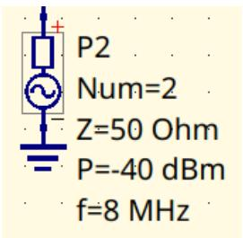  
图 23：表示 50 欧姆端口的功率源

该器件的参数包括端口号 Num、频率 $f ,$ 以及以 dBm 表示的源功率 P。应把两个这样的源分别连接到原理图的输入节点和输出节点上。

我们来看一个例子，仿真 20m 业余无线电波段的带通滤波器的频率响应，原理图见图 24。

该滤波器由可在 lumped devices 组中找到的 LC 器件构成。滤波器原理图包含两个 50 欧姆的端口源，分别连接到其输入和输出节点（in 和 out）。S 参数仿真元件把扫频范围定义为 6 MHz 到 20 MHz。

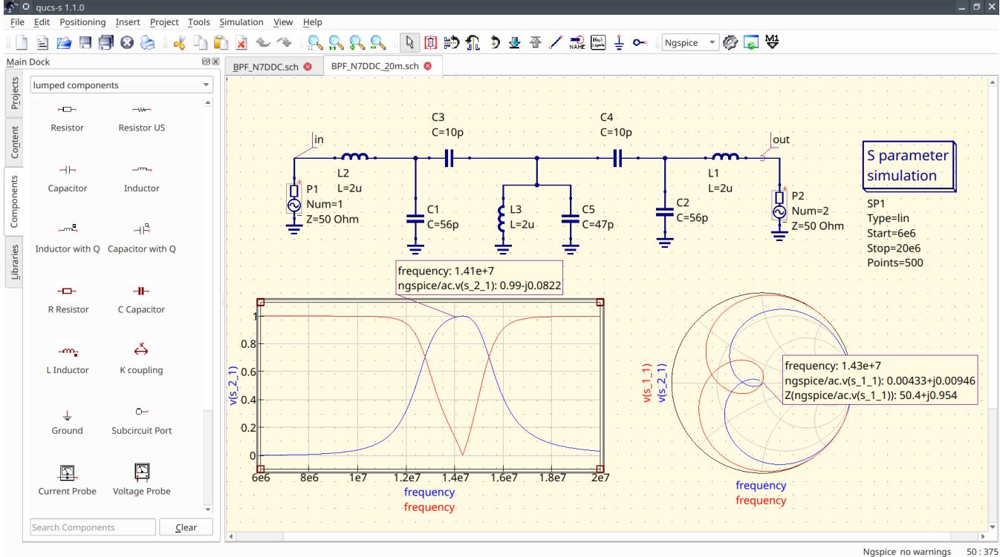  
图 24：用 Qucs-S 和 Ngspice 仿真带通滤波器

滤波器电路的仿真可以像往常一样用 F2 快捷键启动。仿真结束后可以在原理图上放置若干图表。Ngspice 把 S 参数仿真数据表示为虚拟电压，例如要绘制 $S _ { 2 1 }$ 曲线就需要选取 $\mathtt { v } ( \mathtt { s } _ { - } 2 _ { - } 1 )$ 变量。笛卡尔图中包含 $S _ { 1 1 }$ 和 $S _ { 2 1 }$ 两条曲线，其中 $S _ { 2 1 }$ 就是滤波器的幅频响应。同样的曲线也可以画在史密斯圆图上。Qucs-S 提供了多种可用于射频电路分析的图表，包括：史密斯圆图、导纳史密斯圆图、极坐标复平面，以及史密斯圆图与复平面的组合。

Ngspice 会自动把 S 矩阵转换为 Y 矩阵和 Z 矩阵。仿真后可以绘制 Y 参数和 Z 参数随频率变化的曲线。Ngspice 同样把 Y 参数和 Z 参数表示为虚拟电压，例如 v(z\_1\_1) 变量就表示 $Z _ { 1 1 }$ 参数。有源射频电路（如放大器）的仿真与无源电路类似，这里不再单独讨论。

## 9.3 使用 Qucsator/QucsatorRF 进行射频仿真

Qucsator 仿真内核为射频电路分析提供了一些高级功能。自 v24.2.0 版本起，无需手动安装 Qucsator：QucsatorRF 仿真内核是 Qucs-S 发行版的一部分，随主程序一起发布，详见第 10 节。请记住，Qucsator 在时域的性能很差，不推荐用于通用电路的仿真；此外 Qucsator 不兼容 SPICE，使用另一套网表语法。

不过 Qucsator 支持一些高级射频仿真技术，例如多端口 S 参数仿真（包括单端口）和谐波平衡（HB）分析。Qucsator 提供了多种改进的传输线模型（图 25）。最常用的传输线列举如下：

• 四端传输线与双绞线；

• 同轴电缆；

• 微带线、微带 T 型接头与拐角；

• 耦合微带线；

• 共面线；

• 波导；

• 通用 RLCG 传输线；

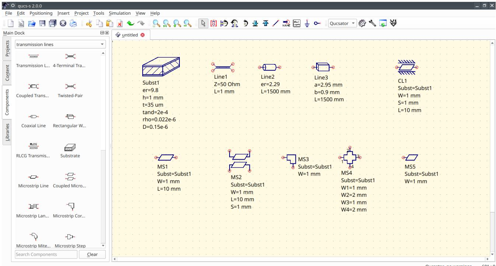  
图 25：Qucsator 后端可用的传输线模型

我们来看微带电路仿真的基础。每个微带线元件都需要挂接基板（substrate），基板同样由专门的元件表示（图 26）。可以定义基板材料属性和微带线厚度，基板引用必须作为所有微带器件的第一个参数给出。

1.5 GHz 耦合微带带通滤波器的仿真见图 27。原理图包含连接到输入与输出的两个端口 P1 和 P2、两个微带器件 MS1 和 MS2，以及基板 Subst1。S 参数仿真的定义与 Ngspice 没有差别，同样由专门元件表示，频率范围定义为 1.3 至 1.7 GHz。

原理图包含两个方程，用 dB() 函数把 S 参数表示为分贝值。请记住，Qucsator 的方程语法是不同的，Ngspice 的方程在 Qucsator 中无法工作。S 参数以 S[i,j] 形式表示，例如用 S[2,1] 表示 $S _ { 2 1 }$。Qucsator 不像 Ngspice 那样自动计算 Y 矩阵和 Z 矩阵，必须用 stoy() 和 stoz() 函数进行矩阵转换，详见 Qucsator 文档。

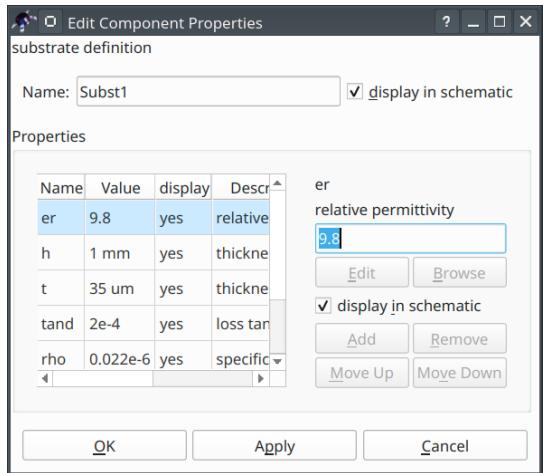

图 26：基板属性定义  
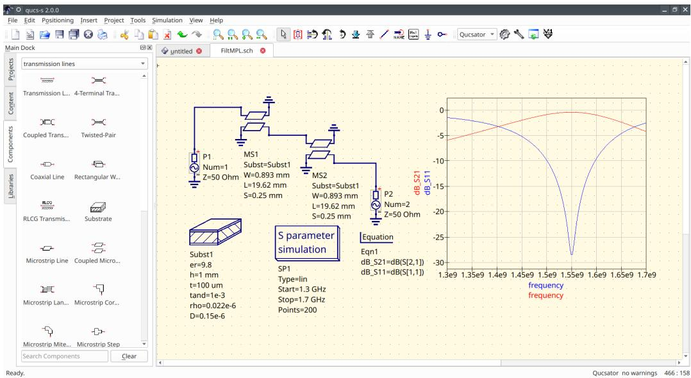  
图 27：耦合微带带通滤波器仿真

## 10 快速切换仿真内核

## 10.1 快速选择仿真器

自 2.0.0 版本起，Qucs-S 支持快速切换仿真内核，应用该设置不再需要重启程序。随时都可以用工具栏上的下拉列表（图 28）选择仿真器。必须通过应用设置对话框（图 1）配置仿真器所在位置，并且所指定的仿真器可执行文件必须真实存在；否则该仿真器不会出现在工具栏的下拉列表中，也无法被选中。受支持的仿真内核列表见第 1 节。

另请注意，Qucs-S 发行版不提供任何仿真内核，仿真器必须单独安装。如果使用 Linux DEB 软件包，Ngspice 会作为软件包依赖被自动安装。该选择只影响模拟仿真；如果原理图中包含数字仿真，数字仿真内核会被自动执行（见第 6.2 节）。

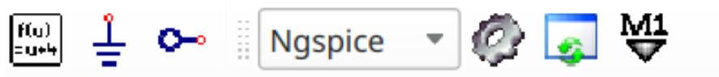  
图 28：仿真器选择下拉列表

## 10.2 不兼容的元件

某些器件可能与所选的仿真内核不兼容。例如微带线是为 Qucsator 设计的，在 Ngspice 中不可用。这类器件将无法插入原理图，并且在原理图视图中显示为灰色（见图 29）。如果用户尝试仿真含有不兼容器件的原理图，会显示相应的警告。

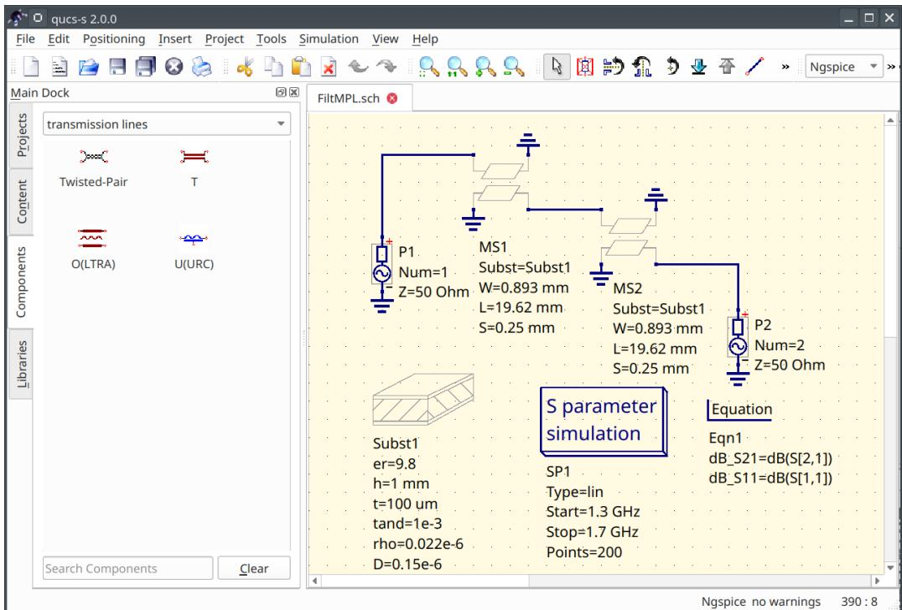  
图 29：包含不兼容器件的原理图

## 11 Nutmeg 方程支持的数学函数列表

Nutmeg 方程所支持的完整数学函数列表见 Ngspice 手册第 17.2 节。下表列出最常用的函数。下表中所有函数的输入都是一个表示电压或电流的单一向量，详细说明及其他函数的信息请参阅 Ngspice 手册第 17 节。

表 1：最常用的 Nutmeg 函数列表

<table><tr><td>函数</td><td>说明</td></tr><tr><td>mag</td><td>向量的模（与 abs(vector) 相同）</td></tr><tr><td>ph</td><td>向量的相位。</td></tr><tr><td>cph</td><td>向量的相位。取值连续，在 ±π 处不出现不连续</td></tr><tr><td>unwrap</td><td>向量的相位。取值连续，在 ±π 处不出现不连续 输入为以度表示的实数相位向量</td></tr><tr><td>real</td><td>向量的实部</td></tr><tr><td>imag</td><td>向量的虚部</td></tr><tr><td>conj</td><td>向量的复共轭</td></tr><tr><td>db</td><td>向量的分贝值 20 log10()</td></tr><tr><td>abs</td><td>向量的绝对值（与 mag 相同）</td></tr><tr><td>integ</td><td>对给定向量积分（相对于标度向量的实部）</td></tr><tr><td>deriv</td><td>计算给定向量的导数</td></tr><tr><td>vecd</td><td>计算向量的微分</td></tr><tr><td>group_delay</td><td>计算群时延 -dφ/dω</td></tr></table>

## 12 结语

本教程介绍了如何完成 Qucs-S 配合 Ngspice 后端的首次启动设置，并对简单的 RC 电路进行交流与瞬态仿真；还展示了如何添加后处理方程和绘制波形图。要学习更高级的仿真技术，请参阅 Qucs-S 与 Ngspice 的官方文档。
